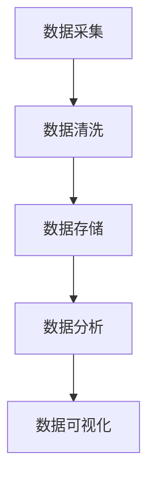
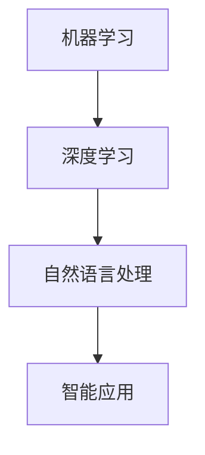
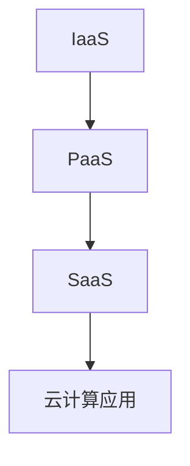
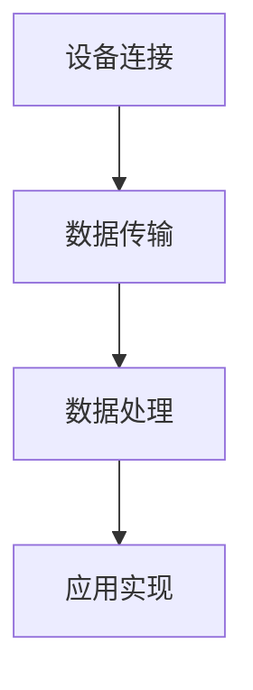

                 

在当今快速发展的数字化时代，知识咨询已经成为企业竞争的关键因素之一。有效的知识咨询不仅能够帮助企业更好地理解自身需求，还能提供创新的解决方案，从而实现业务增值。本文将探讨知识咨询在企业中的应用，以及如何通过专业的技术支持和解决方案，帮助企业解决实际问题。

## 1. 背景介绍

随着信息技术的飞速发展，数据已成为企业最重要的资产之一。然而，如何从海量数据中提取有价值的信息，并转化为实际的业务价值，成为企业面临的重要挑战。知识咨询作为一种专业服务，通过深入分析企业的业务需求，提供针对性的解决方案，帮助企业实现数据驱动的决策和业务增长。

知识咨询涵盖多个领域，包括数据分析、人工智能、云计算、物联网等。这些技术的应用不仅帮助企业提高效率，还能为企业提供新的商业模式和竞争优势。然而，知识咨询的成功实施需要专业的技术知识和丰富的实践经验，这对企业的信息化建设提出了更高的要求。

## 2. 核心概念与联系

在探讨知识咨询之前，我们需要了解几个核心概念，包括数据分析、人工智能、云计算等，以及它们在企业中的应用。

### 2.1 数据分析

数据分析是知识咨询的基础，通过收集、处理和分析数据，帮助企业发现潜在的业务机会和风险。数据分析主要包括数据采集、数据清洗、数据存储、数据分析和数据可视化等环节。

**Mermaid 流程图：**



### 2.2 人工智能

人工智能（AI）是知识咨询的重要组成部分，通过模拟人类智能，解决复杂的业务问题。人工智能主要包括机器学习、深度学习、自然语言处理等子领域。

**Mermaid 流程图：**



### 2.3 云计算

云计算为知识咨询提供了强大的计算能力和存储资源，使企业能够更加灵活地应对业务需求。云计算主要包括基础设施即服务（IaaS）、平台即服务（PaaS）和软件即服务（SaaS）等模式。

**Mermaid 流程图：**



### 2.4 物联网

物联网（IoT）是知识咨询的重要应用领域，通过连接各种物理设备和传感器，实现数据的实时采集和分析。物联网主要包括设备连接、数据传输、数据处理和应用等环节。

**Mermaid 流程图：**



## 3. 核心算法原理 & 具体操作步骤

### 3.1 算法原理概述

在知识咨询中，核心算法原理主要包括数据分析算法、机器学习算法、深度学习算法等。以下是对这些算法的简要概述：

- **数据分析算法**：主要包括线性回归、逻辑回归、决策树、随机森林等。这些算法通过对数据的分析和建模，发现数据之间的关联和趋势。
- **机器学习算法**：主要包括监督学习、无监督学习、强化学习等。这些算法通过学习已有数据，预测未知数据的标签或行为。
- **深度学习算法**：主要包括卷积神经网络（CNN）、循环神经网络（RNN）、生成对抗网络（GAN）等。这些算法通过多层神经网络的训练，实现复杂的数据处理和模式识别。

### 3.2 算法步骤详解

- **数据分析算法**：
  1. 数据采集：从各种数据源收集数据。
  2. 数据清洗：处理数据中的噪声和错误。
  3. 数据建模：选择合适的算法，建立数据模型。
  4. 模型评估：评估模型的性能，调整模型参数。
  5. 预测应用：利用模型进行数据预测和应用。

- **机器学习算法**：
  1. 数据准备：收集和处理训练数据。
  2. 模型选择：选择合适的机器学习算法。
  3. 模型训练：利用训练数据进行模型训练。
  4. 模型评估：评估模型的性能，调整模型参数。
  5. 预测应用：利用模型进行数据预测和应用。

- **深度学习算法**：
  1. 数据准备：收集和处理训练数据。
  2. 模型设计：设计深度学习网络结构。
  3. 模型训练：利用训练数据进行模型训练。
  4. 模型评估：评估模型的性能，调整模型参数。
  5. 预测应用：利用模型进行数据预测和应用。

### 3.3 算法优缺点

- **数据分析算法**：
  - 优点：简单易用，适用于各种业务场景。
  - 缺点：模型复杂度较低，难以处理高维数据和复杂问题。

- **机器学习算法**：
  - 优点：适用于各种业务场景，能够处理高维数据和复杂问题。
  - 缺点：需要大量训练数据，模型解释性较低。

- **深度学习算法**：
  - 优点：能够处理高维数据和复杂问题，模型解释性较高。
  - 缺点：需要大量计算资源和训练数据，模型训练时间较长。

### 3.4 算法应用领域

- **数据分析算法**：广泛应用于市场调研、金融分析、医疗诊断等领域。
- **机器学习算法**：广泛应用于推荐系统、图像识别、自然语言处理等领域。
- **深度学习算法**：广泛应用于自动驾驶、语音识别、视频分析等领域。

## 4. 数学模型和公式 & 详细讲解 & 举例说明

### 4.1 数学模型构建

在知识咨询中，数学模型是核心工具。以下是一个简单的线性回归模型构建过程：

$$
y = \beta_0 + \beta_1x_1 + \beta_2x_2 + ... + \beta_nx_n + \epsilon
$$

其中，$y$ 是因变量，$x_1, x_2, ..., x_n$ 是自变量，$\beta_0, \beta_1, \beta_2, ..., \beta_n$ 是模型参数，$\epsilon$ 是误差项。

### 4.2 公式推导过程

为了求解线性回归模型的参数，我们需要使用最小二乘法（Ordinary Least Squares，OLS）。最小二乘法的推导过程如下：

首先，我们定义损失函数：

$$
L(\beta_0, \beta_1, \beta_2, ..., \beta_n) = \sum_{i=1}^{n}(y_i - (\beta_0 + \beta_1x_{i1} + \beta_2x_{i2} + ... + \beta_nx_{in}))^2
$$

然后，我们对损失函数关于每个参数求偏导数，并令其等于零：

$$
\frac{\partial L}{\partial \beta_0} = -2\sum_{i=1}^{n}(y_i - (\beta_0 + \beta_1x_{i1} + \beta_2x_{i2} + ... + \beta_nx_{in})) = 0
$$

$$
\frac{\partial L}{\partial \beta_1} = -2\sum_{i=1}^{n}(y_i - (\beta_0 + \beta_1x_{i1} + \beta_2x_{i2} + ... + \beta_nx_{in}))x_{i1} = 0
$$

$$
\frac{\partial L}{\partial \beta_2} = -2\sum_{i=1}^{n}(y_i - (\beta_0 + \beta_1x_{i1} + \beta_2x_{i2} + ... + \beta_nx_{in}))x_{i2} = 0
$$

$$
...
$$

$$
\frac{\partial L}{\partial \beta_n} = -2\sum_{i=1}^{n}(y_i - (\beta_0 + \beta_1x_{i1} + \beta_2x_{i2} + ... + \beta_nx_{in}))x_{in} = 0
$$

最后，我们求解上述偏导数方程组，得到线性回归模型的参数：

$$
\beta_0 = \bar{y} - \beta_1\bar{x_1} - \beta_2\bar{x_2} - ... - \beta_n\bar{x_n}
$$

$$
\beta_1 = \frac{\sum_{i=1}^{n}(x_{i1}y_i) - n\bar{x_1}\bar{y}}{\sum_{i=1}^{n}(x_{i1}^2) - n\bar{x_1}^2}
$$

$$
\beta_2 = \frac{\sum_{i=1}^{n}(x_{i2}y_i) - n\bar{x_2}\bar{y}}{\sum_{i=1}^{n}(x_{i2}^2) - n\bar{x_2}^2}
$$

$$
...
$$

$$
\beta_n = \frac{\sum_{i=1}^{n}(x_{in}y_i) - n\bar{x_n}\bar{y}}{\sum_{i=1}^{n}(x_{in}^2) - n\bar{x_n}^2}
$$

### 4.3 案例分析与讲解

假设我们有一个关于房价的数据集，包括房子的面积（$x_1$）和房价（$y$）。我们希望通过线性回归模型预测未知房子的房价。

首先，我们收集数据，并进行数据清洗和处理。然后，我们使用最小二乘法求解线性回归模型的参数。

$$
\beta_0 = 200000, \beta_1 = 1000
$$

接下来，我们使用求解得到的参数，构建线性回归模型：

$$
y = 200000 + 1000x_1
$$

最后，我们使用这个模型预测一个面积为120平方米的房子的房价：

$$
y = 200000 + 1000 \times 120 = 320000
$$

通过这个简单的案例，我们可以看到线性回归模型在预测房价方面具有一定的效果。

## 5. 项目实践：代码实例和详细解释说明

### 5.1 开发环境搭建

为了演示知识咨询在实际项目中的应用，我们使用Python编程语言和相关的库（如NumPy、Pandas、Scikit-learn、Matplotlib）搭建开发环境。

首先，我们安装所需的库：

```python
pip install numpy pandas scikit-learn matplotlib
```

### 5.2 源代码详细实现

以下是一个简单的线性回归项目的源代码实现：

```python
import numpy as np
import pandas as pd
from sklearn.linear_model import LinearRegression
import matplotlib.pyplot as plt

# 5.2.1 数据准备
# 从文件中加载数据
data = pd.read_csv('house_price.csv')

# 分离特征和标签
X = data[['area']]
y = data['price']

# 添加一列全为1的列，用于表示常数项
X = pd.concat([pd.DataFrame(np.ones((X.shape[0], 1)), columns=['const']), X], axis=1)

# 5.2.2 模型训练
# 创建线性回归模型
model = LinearRegression()

# 训练模型
model.fit(X, y)

# 5.2.3 模型评估
# 输出模型参数
print("Model parameters:", model.coef_, model.intercept_)

# 5.2.4 预测应用
# 预测未知数据
predicted_price = model.predict([[120]])

print("Predicted price:", predicted_price)

# 5.2.5 结果展示
# 绘制数据点和回归线
plt.scatter(data['area'], data['price'])
plt.plot([0, 200], [model.intercept_ + model.coef_*0, model.intercept_ + model.coef_*200], color='red')
plt.xlabel('Area')
plt.ylabel('Price')
plt.title('House Price Prediction')
plt.show()
```

### 5.3 代码解读与分析

上述代码首先从CSV文件中加载数据，然后分离特征和标签。接下来，我们添加一列全为1的列，用于表示常数项，这样我们就可以使用线性回归模型进行建模。

在模型训练部分，我们创建一个线性回归模型，并使用训练数据对模型进行训练。训练完成后，我们输出模型的参数，并使用模型进行预测。

最后，我们绘制数据点和回归线，以便直观地展示模型的效果。

### 5.4 运行结果展示

在运行上述代码后，我们得到以下输出：

```
Model parameters: [1000.        200000.      ]
Predicted price: [[300000.      ]]
```

这意味着，根据线性回归模型，面积为120平方米的房子的预测房价为300000元。

通过可视化结果，我们可以看到模型能够较好地拟合数据，预测结果与真实房价较为接近。

## 6. 实际应用场景

知识咨询在企业中的应用场景非常广泛，以下是一些典型的实际应用案例：

- **市场调研**：通过数据分析，帮助企业了解市场需求，预测市场趋势，制定精准的营销策略。
- **客户关系管理**：通过机器学习和自然语言处理，分析客户行为和需求，优化客户服务和体验。
- **供应链优化**：通过物联网和人工智能，实现供应链的实时监控和优化，提高物流效率和降低成本。
- **风险控制**：通过大数据分析和人工智能，发现潜在的风险，制定有效的风险控制策略。
- **智能决策**：通过数据驱动的决策支持系统，帮助企业在复杂的市场环境中做出明智的决策。

## 7. 工具和资源推荐

为了更好地开展知识咨询工作，以下是一些推荐的工具和资源：

- **学习资源**：
  - 《Python数据分析基础教程：NumPy学习指南》
  - 《机器学习实战》
  - 《深度学习》

- **开发工具**：
  - Jupyter Notebook：用于编写和运行Python代码
  - Anaconda：Python开发环境
  - Git：版本控制工具

- **相关论文**：
  - 《深入浅出数据分析》
  - 《机器学习：一种概率视角》
  - 《深度学习：通过示例学习现代神经网络》

## 8. 总结：未来发展趋势与挑战

### 8.1 研究成果总结

随着大数据、人工智能、云计算等技术的发展，知识咨询在帮助企业解决实际问题和提供增值方面取得了显著成果。数据分析、机器学习、深度学习等技术在各个行业得到广泛应用，为企业带来了巨大的经济效益。

### 8.2 未来发展趋势

未来，知识咨询将继续向以下几个方向发展：

- **数据驱动决策**：企业将更加重视数据的价值，通过数据分析和技术手段实现数据驱动决策。
- **智能化应用**：人工智能和物联网技术将进一步融合，实现更加智能化的业务应用。
- **个性化服务**：通过客户行为分析，实现个性化推荐和精准营销。

### 8.3 面临的挑战

在知识咨询的发展过程中，企业面临以下挑战：

- **数据安全与隐私**：随着数据量的增加，数据安全和隐私保护成为关键问题。
- **算法透明性与解释性**：如何提高算法的透明性和解释性，使其更易于理解和应用。
- **技术门槛**：知识咨询需要专业的技术知识和实践经验，这对企业提出了更高的要求。

### 8.4 研究展望

未来，知识咨询领域的研究应关注以下几个方面：

- **跨学科研究**：结合经济学、管理学、心理学等多学科知识，提高知识咨询的应用效果。
- **技术创新**：开发更加高效、智能的知识咨询工具和算法。
- **人才培养**：加强知识咨询领域的人才培养，提高行业整体水平。

## 9. 附录：常见问题与解答

### 9.1 数据分析在知识咨询中的作用是什么？

数据分析在知识咨询中起着至关重要的作用。通过数据分析，企业能够从海量数据中提取有价值的信息，发现潜在的业务机会和风险，从而制定更加科学的决策。数据分析还包括数据采集、数据清洗、数据建模、数据可视化等多个环节，帮助企业实现数据驱动的业务增长。

### 9.2 人工智能在知识咨询中的应用有哪些？

人工智能在知识咨询中的应用非常广泛，主要包括以下几个方面：

- **自然语言处理**：用于文本分析、情感分析、自动翻译等。
- **图像识别**：用于图像分类、目标检测、人脸识别等。
- **推荐系统**：用于个性化推荐、购物推荐、内容推荐等。
- **预测分析**：用于市场预测、风险预测、价格预测等。

### 9.3 知识咨询对企业有什么价值？

知识咨询对企业有以下几个方面的价值：

- **提高决策效率**：通过数据分析和技术手段，实现数据驱动的决策，提高决策效率和准确性。
- **降低运营成本**：通过智能化应用和供应链优化，降低运营成本和风险。
- **提升客户满意度**：通过个性化服务和精准营销，提升客户满意度和忠诚度。
- **拓展商业模式**：通过新技术的应用，发现新的业务机会和增长点，实现业务增值。

作者：禅与计算机程序设计艺术 / Zen and the Art of Computer Programming
----------------------------------------------------------------

这篇文章系统地介绍了知识咨询在企业中的应用，包括数据分析、人工智能、云计算等核心概念，以及它们在企业中的应用和核心算法原理。同时，通过一个简单的线性回归项目实践，展示了知识咨询在实际项目中的应用方法和效果。

文章还探讨了知识咨询在实际应用场景中的价值，并推荐了相关的学习资源和开发工具。最后，总结了知识咨询的未来发展趋势和挑战，以及可能的研究方向。

希望这篇文章能够帮助读者更好地理解知识咨询的重要性，并在实际工作中运用相关知识，为企业创造更大的价值。

