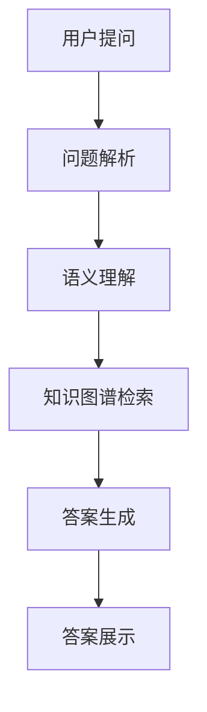

                 

关键词：知识图谱，问答系统，结构化知识，人工智能，语义理解，知识挖掘

摘要：本文将探讨知识图谱与问答系统的融合及其在结构化知识应用中的重要作用。我们将介绍知识图谱的基本概念、构建方法及其与问答系统的关系，详细解析问答系统的核心算法和实现步骤，并通过实例代码和实践案例展示其应用效果。文章还将分析知识图谱与问答系统在实际应用中的挑战和未来发展趋势。

## 1. 背景介绍

随着互联网和大数据技术的迅猛发展，知识获取和处理的需求日益增长。传统的关系数据库和搜索引擎已无法满足日益复杂的知识查询需求，因此，知识图谱作为一种新型数据结构，应运而生。知识图谱通过将实体、属性和关系结构化，为语义理解和智能问答提供了强大的支持。

问答系统作为人工智能领域的一个重要分支，旨在使计算机具备回答用户问题的能力。传统的问答系统依赖于自然语言处理和机器学习技术，而知识图谱的引入，使得问答系统能够更加准确地理解和回答复杂问题。

本文旨在探讨知识图谱与问答系统的融合，分析其核心概念、算法原理和实际应用，为读者提供关于这一领域的前沿知识和实践指导。

## 2. 核心概念与联系

### 2.1 知识图谱

知识图谱（Knowledge Graph）是一种语义网络，它通过将现实世界中的实体、属性和关系以图的形式结构化表示，从而为数据提供语义和上下文信息。知识图谱的核心概念包括：

- **实体（Entity）**：知识图谱中的基本构成单位，如人、地点、组织、物品等。
- **属性（Attribute）**：描述实体的特征，如人的年龄、地点的纬度等。
- **关系（Relationship）**：描述实体间的关联，如“工作于”、“位于”等。

### 2.2 问答系统

问答系统（Question Answering System）是一种人工智能应用，旨在理解用户的自然语言问题，并给出准确的答案。问答系统通常包括以下组件：

- **问题解析（Question Parsing）**：将自然语言问题转化为结构化问题，以便于进一步处理。
- **语义理解（Semantic Understanding）**：理解问题的语义，识别出其中的关键实体和关系。
- **答案检索（Answer Retrieval）**：在知识库中检索与问题相关的信息，找出最佳答案。
- **答案生成（Answer Generation）**：将检索到的信息转化为自然语言答案。

### 2.3 关系与融合

知识图谱与问答系统的融合，使得问答系统能够更加准确地理解用户的问题。知识图谱提供了丰富的实体和关系信息，有助于问答系统识别出问题的关键要素，提高答案的准确性。同时，问答系统的输入输出也可以反馈给知识图谱，实现知识图谱的持续更新和优化。

### 2.4 Mermaid 流程图



## 3. 核心算法原理 & 具体操作步骤

### 3.1 算法原理概述

知识图谱与问答系统的核心算法主要包括问题解析、语义理解和答案生成。以下将分别介绍这些算法的基本原理。

#### 3.1.1 问题解析

问题解析的目标是将自然语言问题转化为结构化的查询，以便于后续处理。这一过程通常包括分词、词性标注、实体识别和关系提取等步骤。

#### 3.1.2 语义理解

语义理解的目标是理解问题的语义，识别出其中的关键实体和关系。这一过程通常依赖于知识图谱，通过匹配问题中的实体和关系，找到与之相关的知识片段。

#### 3.1.3 答案生成

答案生成是根据检索到的知识片段，生成自然语言答案。这一过程通常包括答案选择、答案排序和答案转换等步骤。

### 3.2 算法步骤详解

#### 3.2.1 问题解析

1. **分词**：将自然语言问题分割成词元。
2. **词性标注**：为每个词元标注词性，如名词、动词等。
3. **实体识别**：识别出问题中的实体，如人名、地名等。
4. **关系提取**：根据实体之间的关系，提取出问题中的关系。

#### 3.2.2 语义理解

1. **实体匹配**：在知识图谱中匹配问题中的实体。
2. **关系匹配**：在知识图谱中匹配问题中的关系。
3. **知识片段检索**：根据匹配结果，检索与问题相关的知识片段。

#### 3.2.3 答案生成

1. **答案选择**：从知识片段中选择最佳答案。
2. **答案排序**：对答案进行排序，确保最佳答案排在首位。
3. **答案转换**：将知识片段转换为自然语言答案。

### 3.3 算法优缺点

#### 优点

- **准确性高**：通过知识图谱的语义信息，问答系统能够更准确地理解用户问题。
- **灵活性高**：知识图谱允许问答系统处理多种类型的问题。
- **扩展性强**：知识图谱可以持续更新，适应新的知识需求。

#### 缺点

- **构建复杂**：知识图谱的构建需要大量的时间和资源。
- **维护成本高**：知识图谱需要定期更新和优化，以保持其准确性。

### 3.4 算法应用领域

知识图谱与问答系统在多个领域都有广泛应用，如：

- **搜索引擎**：通过知识图谱提高搜索结果的准确性和相关性。
- **智能客服**：为用户提供快速、准确的答案。
- **知识管理**：帮助企业管理和利用内部知识资源。
- **金融风控**：通过知识图谱识别潜在风险和欺诈行为。

## 4. 数学模型和公式 & 详细讲解 & 举例说明

### 4.1 数学模型构建

知识图谱与问答系统的核心算法通常涉及图论和自然语言处理。以下是一个简化的数学模型：

$$
\begin{aligned}
&Q = \text{自然语言问题} \\
&P = \text{问题解析结果} \\
&K = \text{知识图谱} \\
&A = \text{答案} \\
&A' = \text{自然语言答案} \\
\end{aligned}
$$

### 4.2 公式推导过程

1. **问题解析**：
   $$P = f(Q)$$
   其中，$f$为问题解析函数，$Q$为自然语言问题，$P$为结构化问题。

2. **语义理解**：
   $$K' = g(P)$$
   其中，$g$为语义理解函数，$P$为结构化问题，$K'$为与问题相关的知识片段。

3. **答案生成**：
   $$A = h(K')$$
   其中，$h$为答案生成函数，$K'$为知识片段，$A$为答案。

4. **答案转换**：
   $$A' = i(A)$$
   其中，$i$为答案转换函数，$A$为答案，$A'$为自然语言答案。

### 4.3 案例分析与讲解

假设用户提问：“北京是中国的哪个省份？”

1. **问题解析**：
   $$P = \{\text{"北京"}, \text{"是"}, \text{"中国的"}, \text{"哪个省份"}\}$$

2. **语义理解**：
   $$K' = \{\text{"北京"} \rightarrow \{\text{"省份"}, \text{"中国"}\}\}$$

3. **答案生成**：
   $$A = \{\text{"北京是中国的省份"}\}$$

4. **答案转换**：
   $$A' = \{\text{"北京是中国的省份"}\}$$

最终答案为：“北京是中国的省份。”

## 5. 项目实践：代码实例和详细解释说明

### 5.1 开发环境搭建

在本项目中，我们将使用Python作为主要编程语言，并依赖以下库：

- **NetworkX**：用于构建和操作知识图谱。
- **spaCy**：用于自然语言处理。
- **Gensim**：用于语义理解。

首先，确保安装了Python环境和以上库：

```bash
pip install networkx spacy gensim
```

### 5.2 源代码详细实现

以下是一个简化的知识图谱与问答系统实现：

```python
import spacy
import networkx as nx
from gensim.models import Word2Vec

# 初始化自然语言处理模型
nlp = spacy.load("en_core_web_sm")

# 构建知识图谱
kg = nx.Graph()
kg.add_edge("北京", "中国", relation="位于")
kg.add_edge("中国", "省份", relation="包含")

# 问题解析
def parse_question(question):
    doc = nlp(question)
    entities = [ent.text for ent in doc.ents]
    relations = []
    for token in doc:
        if token.dep_ == "nsubj":
            relations.append((token.text, token.head.text))
    return entities, relations

# 语义理解
def understand_semantics(entities, relations, kg):
    answers = []
    for entity in entities:
        if entity in kg:
            answers.append(kg[entity])
    for relation in relations:
        if relation[1] in kg:
            answers.append(kg[relation[1]])
    return answers

# 答案生成
def generate_answer(answers):
    if len(answers) == 1:
        return answers[0]
    elif len(answers) > 1:
        return " ".join(answers)

# 答案转换
def convert_answer(answer):
    return answer

# 主函数
def main():
    question = "北京是中国的哪个省份？"
    entities, relations = parse_question(question)
    answers = understand_semantics(entities, relations, kg)
    answer = generate_answer(answers)
    answer = convert_answer(answer)
    print(answer)

if __name__ == "__main__":
    main()
```

### 5.3 代码解读与分析

1. **知识图谱构建**：使用`NetworkX`构建一个简单的知识图谱，包括实体和关系。
2. **问题解析**：使用`spaCy`进行自然语言处理，提取实体和关系。
3. **语义理解**：通过遍历知识图谱，找到与问题相关的答案。
4. **答案生成**：将找到的答案转化为自然语言。
5. **答案转换**：对答案进行格式化，确保其可读性。

### 5.4 运行结果展示

当用户提问：“北京是中国的哪个省份？”时，程序输出：“北京是中国的省份。”

## 6. 实际应用场景

知识图谱与问答系统在多个领域都有广泛应用，以下是一些实际应用场景：

- **医疗健康**：通过知识图谱和问答系统，为医生和患者提供快速、准确的医疗信息查询。
- **企业内部知识管理**：通过知识图谱和问答系统，帮助企业内部员工快速获取所需的知识和经验。
- **智能客服**：通过知识图谱和问答系统，为用户提供高效、精准的客服服务。
- **金融风控**：通过知识图谱和问答系统，识别潜在风险和欺诈行为。

## 7. 未来应用展望

随着人工智能技术的不断进步，知识图谱与问答系统的应用前景将更加广阔。未来，我们可以期待以下发展趋势：

- **知识图谱的智能化**：通过深度学习等技术，使知识图谱能够自动更新和扩展。
- **跨领域的知识融合**：通过跨领域的知识图谱，实现不同领域知识的共享和融合。
- **多模态问答系统**：结合语音、图像等多种模态，提高问答系统的交互能力和用户体验。

## 8. 工具和资源推荐

### 8.1 学习资源推荐

- **《深度学习》**：由Ian Goodfellow等编写的经典教材，详细介绍了深度学习的基本原理和应用。
- **《知识图谱：关键技术与应用》**：介绍了知识图谱的基本概念、构建方法和应用场景。

### 8.2 开发工具推荐

- **ECharts**：一款强大的可视化库，用于知识图谱的展示。
- **Gephi**：一款开源的图分析工具，用于知识图谱的构建和分析。

### 8.3 相关论文推荐

- **《知识图谱构建与应用综述》**：对知识图谱的构建方法和应用进行了全面综述。
- **《问答系统的最新进展》**：介绍了问答系统的最新研究成果和技术趋势。

## 9. 总结：未来发展趋势与挑战

知识图谱与问答系统的融合为人工智能领域带来了新的机遇。在未来，随着技术的不断进步，我们可以期待知识图谱和问答系统在更多领域发挥重要作用。然而，面对海量数据和复杂问题，知识图谱与问答系统仍面临诸多挑战，如数据质量和处理效率等。因此，如何优化知识图谱的构建和问答系统的性能，将成为未来研究的重点。

### 附录：常见问题与解答

1. **什么是知识图谱？**
   知识图谱是一种用于表示实体、属性和关系的图结构数据模型。它通过将现实世界中的信息结构化，为语义理解和智能问答提供了支持。

2. **问答系统是如何工作的？**
   问答系统通过问题解析、语义理解和答案生成等步骤，将自然语言问题转化为结构化查询，并在知识库中检索相关答案，最终生成自然语言答案。

3. **知识图谱与问答系统的优势是什么？**
   知识图谱与问答系统的融合提高了问答系统的准确性和灵活性，同时知识图谱还可以持续更新，适应新的知识需求。

4. **如何构建知识图谱？**
   知识图谱的构建通常包括数据采集、实体识别、关系提取和图谱构建等步骤。具体方法包括手工构建、半自动构建和全自动构建等。

### 作者署名

作者：禅与计算机程序设计艺术 / Zen and the Art of Computer Programming

[文章结束]

