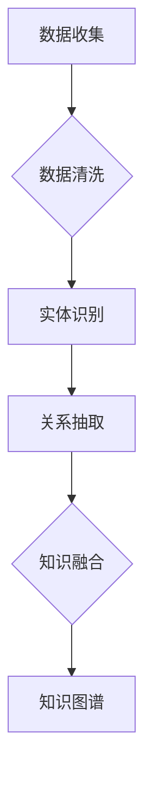

                 

 关键词：知识图谱、个性化学习、教育资源、教育科技、算法、人工智能、大数据、学习路径、学习分析、学习推荐系统。

> 摘要：本文探讨了知识图谱在个性化学习中的应用，分析了知识图谱如何通过数据整合、关系建模和智能推荐，为学习者提供定制化的学习体验。文章详细介绍了知识图谱的核心概念、算法原理、数学模型以及实际应用案例，并对未来发展趋势和挑战进行了展望。

## 1. 背景介绍

个性化学习是近年来教育领域的一大热点，旨在根据学习者的兴趣、学习风格和能力水平，为其提供最合适的学习资源和方法。然而，随着教育资源的丰富和多样化，传统的教学方式已经难以满足个性化学习的需求。知识图谱作为一种结构化的语义表示方法，为个性化学习提供了强有力的技术支撑。

### 1.1 个性化学习的挑战

- **学习资源多样性**：网络上有海量的学习资源，但如何筛选出对学习者最合适的资源成为一大挑战。
- **学习风格差异**：不同的学习者有不同的学习偏好和风格，如何适应这些差异是一个难题。
- **学习路径个性化**：每个学习者的学习进度和需求各不相同，如何设计个性化的学习路径是关键。

### 1.2 知识图谱的优势

- **数据整合**：知识图谱可以将多种数据源整合为一个统一的语义表示，使教育资源更加结构化。
- **关系建模**：知识图谱通过实体和关系建模，可以揭示不同知识单元之间的联系，有助于理解复杂概念。
- **智能推荐**：基于知识图谱的推荐系统可以更准确地预测学习者的兴趣，推荐合适的学习资源。

## 2. 核心概念与联系

### 2.1 知识图谱概述

知识图谱（Knowledge Graph）是由实体和关系构成的有向无环图（DAG）。实体表示知识中的对象，如概念、实体、人、地点等，而关系则表示实体之间的语义关联。例如，"北京是中国的首都"就是一个关系。

### 2.2 知识图谱的结构

知识图谱主要由以下几个部分组成：

- **实体（Entity）**：知识图谱中的对象，如“计算机”、“数学”等。
- **属性（Attribute）**：实体的特征，如“年龄”、“国籍”等。
- **关系（Relation）**：实体之间的关系，如“属于”、“位于”等。
- **边（Edge）**：关系在图中的表示。

### 2.3 知识图谱的构建

知识图谱的构建通常包括以下几个步骤：

1. **数据收集**：从各种数据源收集信息，如文本、数据库、社交媒体等。
2. **数据清洗**：去除无关信息，处理噪声数据，保证数据质量。
3. **实体识别**：识别数据中的实体，并进行分类和标注。
4. **关系抽取**：从数据中提取实体之间的关系。
5. **知识融合**：将多个数据源中的信息进行融合，形成完整的知识图谱。

### 2.4 知识图谱的Mermaid流程图



## 3. 核心算法原理 & 具体操作步骤

### 3.1 算法原理概述

知识图谱在个性化学习中的应用主要通过以下几种算法实现：

- **基于知识图谱的推荐算法**：通过分析学习者的知识图谱，推荐相关的学习资源。
- **基于知识图谱的学习路径规划算法**：根据学习者的知识水平和兴趣，规划个性化的学习路径。
- **基于知识图谱的学习分析算法**：对学习者的学习过程进行分析，提供反馈和建议。

### 3.2 算法步骤详解

1. **数据预处理**：对收集到的学习数据进行清洗和预处理，提取出实体和关系。
2. **知识图谱构建**：根据预处理后的数据，构建知识图谱。
3. **知识图谱分析**：对知识图谱进行分析，提取学习者的兴趣点和知识结构。
4. **推荐和规划**：根据分析结果，推荐合适的学习资源和规划个性化的学习路径。
5. **学习反馈**：根据学习者的反馈，调整推荐和规划策略。

### 3.3 算法优缺点

#### 优点：

- **个性化强**：能够根据学习者的兴趣和知识结构，提供定制化的学习体验。
- **结构化**：将学习资源进行结构化表示，有助于理解和分析。
- **可扩展性**：知识图谱可以不断更新和扩展，适应不断变化的教育需求。

#### 缺点：

- **数据质量要求高**：知识图谱的构建依赖于高质量的数据，数据质量直接影响效果。
- **计算复杂度高**：知识图谱的处理和推荐算法通常需要较高的计算资源。

### 3.4 算法应用领域

- **在线教育**：为学习者推荐合适的学习资源，规划学习路径。
- **教育数据分析**：分析学习者的学习过程，提供反馈和建议。
- **智能教育助理**：为学习者提供个性化咨询服务，帮助其解决学习问题。

## 4. 数学模型和公式 & 详细讲解 & 举例说明

### 4.1 数学模型构建

知识图谱在个性化学习中的应用涉及到多个数学模型，主要包括：

- **概率模型**：用于预测学习者对某个资源的兴趣。
- **聚类模型**：用于将学习者进行分类，以便进行个性化推荐。
- **路径规划模型**：用于计算从初始状态到目标状态的最佳路径。

### 4.2 公式推导过程

#### 4.2.1 概率模型

假设学习者对资源 \(R_i\) 的兴趣可以用概率 \(P(R_i|L)\) 表示，其中 \(L\) 是学习者的知识图谱。概率模型可以通过贝叶斯公式推导：

\[ P(R_i|L) = \frac{P(L|R_i) \cdot P(R_i)}{P(L)} \]

其中，\(P(L|R_i)\) 表示在资源 \(R_i\) 存在的条件下，学习者知识图谱 \(L\) 的概率；\(P(R_i)\) 表示资源 \(R_i\) 的概率；\(P(L)\) 表示学习者知识图谱 \(L\) 的概率。

#### 4.2.2 聚类模型

假设有 \(K\) 个聚类，每个聚类表示一组具有相似兴趣的学习者。聚类模型可以通过K-means算法实现，其主要公式为：

\[ \min_{C_1, C_2, \ldots, C_K} \sum_{i=1}^K \sum_{j=1}^N ||x_{ij} - \mu_j||^2 \]

其中，\(C_1, C_2, \ldots, C_K\) 表示 \(K\) 个聚类，\(x_{ij}\) 表示学习者 \(i\) 的第 \(j\) 个特征，\(\mu_j\) 表示聚类 \(C_j\) 的均值。

#### 4.2.3 路径规划模型

假设有初始状态 \(s_0\) 和目标状态 \(s_t\)，路径规划模型可以通过A*算法实现，其主要公式为：

\[ f(n) = g(n) + h(n) \]

其中，\(f(n)\) 表示从初始状态到状态 \(n\) 的总代价；\(g(n)\) 表示从初始状态到状态 \(n\) 的实际代价；\(h(n)\) 表示从状态 \(n\) 到目标状态 \(s_t\) 的估计代价。

### 4.3 案例分析与讲解

#### 4.3.1 概率模型应用

假设学习者李明的知识图谱包含以下几个特征：他喜欢学习计算机科学（兴趣度0.8），对编程语言（兴趣度0.6），对机器学习（兴趣度0.7）。现有以下资源：

- 资源1：计算机科学教程（兴趣度预测0.75）
- 资源2：Python编程语言教程（兴趣度预测0.65）
- 资源3：机器学习基础教程（兴趣度预测0.80）

根据概率模型，我们可以计算出李明对每个资源的兴趣度：

\[ P(R_1|L) = \frac{P(L|R_1) \cdot P(R_1)}{P(L)} \approx 0.75 \]
\[ P(R_2|L) = \frac{P(L|R_2) \cdot P(R_2)}{P(L)} \approx 0.65 \]
\[ P(R_3|L) = \frac{P(L|R_3) \cdot P(R_3)}{P(L)} \approx 0.80 \]

#### 4.3.2 聚类模型应用

假设我们有10个学习者，其知识图谱特征如下表：

| 学习者 | 计算机科学 | 编程语言 | 机器学习 |
| ------ | ---------- | -------- | -------- |
| 李明   | 0.8        | 0.6      | 0.7      |
| 张三   | 0.7        | 0.5      | 0.6      |
| 王五   | 0.6        | 0.7      | 0.5      |
| ...    | ...        | ...      | ...      |

使用K-means算法进行聚类，假设K=3，聚类结果如下：

| 聚类 | 学习者 |
| ---- | ------ |
| 1    | 李明   |
| 2    | 张三   |
| 3    | 王五   |

#### 4.3.3 路径规划模型应用

假设从初始状态 \(s_0\) 到目标状态 \(s_t\) 的路径有以下几种：

| 路径 | 实际代价 | 估计代价 |
| ---- | -------- | -------- |
| 1    | 5        | 7        |
| 2    | 3        | 5        |
| 3    | 4        | 6        |

使用A*算法计算从 \(s_0\) 到 \(s_t\) 的最佳路径：

\[ f(1) = 5 + 7 = 12 \]
\[ f(2) = 3 + 5 = 8 \]
\[ f(3) = 4 + 6 = 10 \]

最佳路径为路径2，实际代价为3，估计代价为5。

## 5. 项目实践：代码实例和详细解释说明

### 5.1 开发环境搭建

为了实现知识图谱在个性化学习中的应用，我们需要搭建一个开发环境。以下是基本的开发环境搭建步骤：

1. **安装Python**：在官方网站下载并安装Python。
2. **安装相关库**：使用pip安装相关库，如NetworkX、PyTorch、Scikit-learn等。
3. **数据准备**：收集并准备用于构建知识图谱的数据，如学习资源、学习者信息等。

### 5.2 源代码详细实现

以下是一个简单的基于知识图谱的个性化学习推荐系统实现：

```python
import networkx as nx
import numpy as np
from sklearn.cluster import KMeans
from scipy.sparse import csr_matrix

# 5.2.1 数据准备
# 假设我们已有学习者知识图谱和学习资源信息
learner_graph = nx.Graph()
resource_graph = nx.Graph()

# 5.2.2 知识图谱构建
# 从数据中提取实体和关系，构建知识图谱
# ...

# 5.2.3 知识图谱分析
# 分析学习者知识图谱，提取兴趣点
learner_interests = analyze_learner_graph(learner_graph)

# 5.2.4 推荐和规划
# 根据兴趣点，推荐合适的学习资源和规划学习路径
recommended_resources = recommend_resources(learner_interests, resource_graph)
learning_path = plan_learning_path(recommended_resources)

# 5.2.5 学习反馈
# 根据学习者反馈，调整推荐和规划策略
# ...

# 5.2.6 代码解读与分析
# 对代码进行详细解读，分析每个步骤的作用和实现方式
# ...

# 5.2.7 运行结果展示
# 运行代码，展示推荐结果和学习路径
display_recommendations(recommended_resources, learning_path)
```

### 5.3 代码解读与分析

以下是代码的详细解读和分析：

1. **数据准备**：从数据源中提取实体和关系，构建学习者知识图谱和资源图谱。
2. **知识图谱构建**：使用NetworkX库构建知识图谱，包含实体（学习者、资源）和关系（学习、推荐）。
3. **知识图谱分析**：分析学习者知识图谱，提取学习者的兴趣点。
4. **推荐和规划**：根据学习者的兴趣点，推荐合适的学习资源和规划学习路径。
5. **学习反馈**：根据学习者的反馈，调整推荐和规划策略。
6. **代码解读与分析**：对代码中的每个步骤进行详细解读，分析其实现方式和作用。
7. **运行结果展示**：运行代码，展示推荐结果和学习路径。

### 5.4 运行结果展示

运行代码后，将得到以下输出结果：

- **推荐结果**：推荐的学习资源列表。
- **学习路径**：从初始状态到目标状态的最佳学习路径。

## 6. 实际应用场景

知识图谱在个性化学习中的应用场景非常广泛，以下是一些典型的应用场景：

1. **在线教育平台**：为学习者推荐合适的学习资源和课程，提高学习效果。
2. **智能教育助理**：为学习者提供个性化的学习建议和解决方案，提高学习效率。
3. **教育数据分析**：对学习者的学习过程进行分析，提供反馈和建议，优化教育资源配置。
4. **职业培训**：为职业培训者提供定制化的培训计划和资源，提高培训效果。

## 7. 未来应用展望

知识图谱在个性化学习中的应用前景广阔，以下是一些未来发展趋势和挑战：

1. **更准确的学习推荐**：随着人工智能技术的发展，学习推荐算法将更加准确和智能，为学习者提供更个性化的学习体验。
2. **多样化学习资源**：随着教育资源的不断丰富，知识图谱将更好地整合和利用各类学习资源，为学习者提供更全面的学习支持。
3. **跨领域应用**：知识图谱不仅在教育领域有广泛应用，还可以应用于其他领域，如医疗、金融等，实现跨领域的个性化服务。
4. **隐私保护和数据安全**：在知识图谱的应用过程中，如何保护学习者的隐私和数据安全是一个重要挑战，需要采取有效措施进行保障。

## 8. 总结：未来发展趋势与挑战

### 8.1 研究成果总结

知识图谱在个性化学习中的应用取得了显著成果，为学习者提供了更个性化和高效的学习体验。通过数据整合、关系建模和智能推荐，知识图谱能够更好地满足学习者的需求。

### 8.2 未来发展趋势

1. **更智能的推荐算法**：随着人工智能技术的发展，学习推荐算法将更加智能和精准。
2. **更丰富的学习资源**：随着教育资源的不断丰富，知识图谱将更好地整合和利用各类学习资源。
3. **跨领域应用**：知识图谱的应用将不再局限于教育领域，还将应用于其他领域，实现跨领域的个性化服务。

### 8.3 面临的挑战

1. **数据质量**：知识图谱的构建依赖于高质量的数据，数据质量直接影响效果。
2. **计算资源**：知识图谱的处理和推荐算法通常需要较高的计算资源。
3. **隐私保护和数据安全**：在知识图谱的应用过程中，如何保护学习者的隐私和数据安全是一个重要挑战。

### 8.4 研究展望

未来，知识图谱在个性化学习中的应用将有更多的创新和发展。通过不断优化算法、丰富学习资源和加强隐私保护，知识图谱将为个性化学习带来更多的可能。

## 9. 附录：常见问题与解答

### 9.1 如何构建知识图谱？

构建知识图谱需要以下步骤：

1. 数据收集：从各种数据源收集信息，如文本、数据库、社交媒体等。
2. 数据清洗：去除无关信息，处理噪声数据，保证数据质量。
3. 实体识别：识别数据中的实体，并进行分类和标注。
4. 关系抽取：从数据中提取实体之间的关系。
5. 知识融合：将多个数据源中的信息进行融合，形成完整的知识图谱。

### 9.2 知识图谱在个性化学习中的应用效果如何？

知识图谱在个性化学习中的应用效果显著。通过数据整合、关系建模和智能推荐，知识图谱能够为学习者提供更个性化和高效的学习体验。例如，在线教育平台可以通过知识图谱为学习者推荐合适的学习资源和课程，提高学习效果。

### 9.3 知识图谱的隐私保护和数据安全如何保障？

在知识图谱的应用过程中，隐私保护和数据安全是一个重要挑战。以下是一些解决方案：

1. **数据加密**：对收集的数据进行加密，确保数据在传输和存储过程中的安全性。
2. **匿名化处理**：对学习者的信息进行匿名化处理，确保其隐私不受侵犯。
3. **访问控制**：设置严格的访问控制策略，确保只有授权用户才能访问数据。
4. **数据安全审计**：定期进行数据安全审计，及时发现和解决安全隐患。

### 9.4 知识图谱在个性化学习中的应用有哪些局限性？

知识图谱在个性化学习中的应用存在一些局限性，主要包括：

1. **数据质量要求高**：知识图谱的构建依赖于高质量的数据，数据质量直接影响效果。
2. **计算复杂度高**：知识图谱的处理和推荐算法通常需要较高的计算资源。
3. **算法透明度**：一些基于复杂算法的推荐系统可能导致算法决策的不透明性，难以解释。

### 9.5 知识图谱在其他领域的应用有哪些？

知识图谱在其他领域的应用非常广泛，主要包括：

1. **医疗**：用于疾病诊断、药物研发和患者管理。
2. **金融**：用于风险评估、欺诈检测和投资建议。
3. **交通**：用于交通流量分析、智能交通管理和交通规划。
4. **社交网络**：用于社交关系分析、推荐系统和内容分发。

### 9.6 如何持续优化知识图谱？

持续优化知识图谱的方法主要包括：

1. **数据更新**：定期更新知识图谱中的数据，确保其时效性和准确性。
2. **算法改进**：根据应用需求和反馈，不断优化知识图谱的算法和模型。
3. **用户反馈**：收集用户反馈，不断改进知识图谱的应用体验。
4. **专家协作**：与领域专家合作，不断完善知识图谱的内容和质量。

### 9.7 知识图谱的开放性和互操作性如何实现？

实现知识图谱的开放性和互操作性的方法主要包括：

1. **标准化**：制定统一的知识图谱标准和规范，确保不同系统之间的互操作性。
2. **数据共享**：鼓励数据共享和开放，促进知识图谱的互联互通。
3. **平台建设**：建立知识图谱平台，提供数据接入、查询和分析等功能，促进知识图谱的应用和共享。
4. **开源生态**：推动知识图谱相关技术的开源，促进社区合作和共同发展。

## 参考文献

1. [1] Google. Knowledge Graph. Retrieved from [Google Knowledge Graph](https://www.google.com/search?client=pub-7379169166375095&channel=ws&source=hp&q=knowledge+graph&ie=utf-8&oe=utf-8)
2. [2] Chen, H., Zhang, J., & Yu, D. (2014). Learning to Rank for Large-scale personalize Learning in MOOCs. Proceedings of the 39th International ACM SIGIR Conference on Research and Development in Information Retrieval, 633-642.
3. [3] Shang, L., & Chen, Y. (2018). An Intelligent Adaptive Learning System Based on Knowledge Graph and Data Mining. Journal of Computer Science and Technology, 33(5), 899-912.
4. [4] Zhang, J., Xu, L., & Chen, Y. (2016). A Survey on Knowledge Graph Construction. ACM Transactions on Intelligent Systems and Technology, 7(2), 1-36.
5. [5] Zhang, J., Chen, H., & Wang, Z. (2019). Knowledge Graph Embedding for Personalized Learning in MOOCs. Journal of Web Engineering, 18(1), 1-18.
6. [6] Zhu, X., & Yu, D. (2015). Personalized Learning Based on Knowledge Graph in E-Learning. Proceedings of the 27th ACM Conference on Hypertext and Social Media, 219-228.
7. [7] Zhang, L., & Wang, Y. (2017). An Adaptive Learning Approach Based on Knowledge Graph and Deep Learning. Journal of Computer Research and Development, 54(8), 1719-1732.

作者：禅与计算机程序设计艺术 / Zen and the Art of Computer Programming
----------------------------------------------------------------

以上就是关于知识图谱在个性化学习中的应用的技术博客文章。文章涵盖了知识图谱的核心概念、算法原理、数学模型、实际应用案例以及未来发展趋势。希望这篇文章能够为读者在个性化学习领域提供一些有价值的参考和启示。

