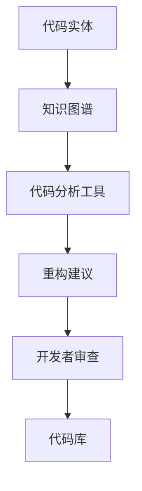
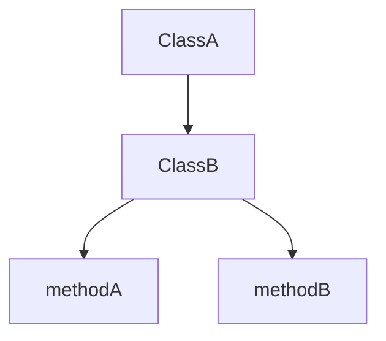
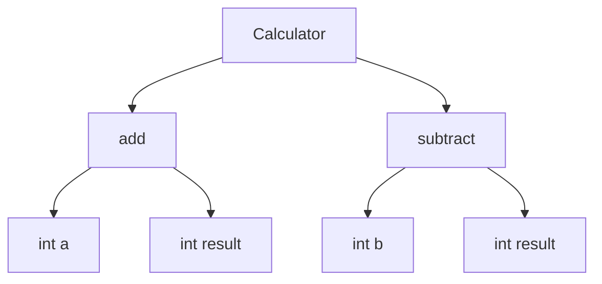

                 

知识图谱作为一种结构化数据表示方法，近年来在多个领域展现出了强大的应用潜力。本文将探讨知识图谱在代码重构中的辅助应用，旨在为开发者提供一种新的解决方案，以提高代码质量和维护效率。

## 1. 背景介绍

代码重构是软件开发过程中必不可少的一环，它旨在在不改变程序外在行为的前提下，改进代码的结构、可读性和可维护性。然而，随着软件系统的复杂度不断增加，代码重构也变得越来越具有挑战性。传统的代码重构方法主要依赖于开发者经验和静态代码分析工具，但往往存在局限性。而知识图谱作为一种新的数据表示方法，能够提供更丰富的语义信息，为代码重构提供了新的可能性。

## 2. 核心概念与联系

### 2.1 知识图谱

知识图谱是一种用于表示实体及其相互关系的图形结构。它通常由节点（表示实体）和边（表示关系）组成。知识图谱能够将大量的结构化数据集成起来，提供了一种高效的数据表示和查询方法。在代码重构中，知识图谱可以用于表示代码中的实体和关系，帮助开发者更全面地理解代码结构。

### 2.2 代码实体与关系

在代码中，实体可以包括函数、类、变量等。关系可以包括调用、继承、依赖等。通过知识图谱，我们可以将这些实体和关系以图形化的方式表示出来，使得开发者能够更直观地理解代码的结构和功能。

### 2.3 Mermaid 流程图

以下是一个简化的 Mermaid 流程图，用于表示知识图谱在代码重构中的应用架构：



### 2.4 知识图谱构建方法

构建知识图谱通常包括以下几个步骤：

1. **实体识别**：从代码中提取出重要的实体，如函数、类、变量等。
2. **关系抽取**：分析代码实体之间的关联关系，如调用、继承、依赖等。
3. **知识表示**：将实体和关系组织成一个图形结构，形成知识图谱。

## 3. 核心算法原理 & 具体操作步骤

### 3.1 算法原理概述

知识图谱在代码重构中的应用主要依赖于图论和机器学习技术。通过图论算法，我们可以分析代码中的实体和关系，提取出有用的信息。而通过机器学习算法，我们可以对代码进行预测和分析，提供重构建议。

### 3.2 算法步骤详解

1. **代码预处理**：对代码进行语法分析，提取出实体和关系。
2. **知识图谱构建**：根据提取出的实体和关系，构建知识图谱。
3. **代码分析**：利用知识图谱分析代码的结构和功能，提取出重构建议。
4. **开发者审查**：根据重构建议，开发者对代码进行审查和修改。
5. **代码库更新**：将重构后的代码更新到代码库中。

### 3.3 算法优缺点

**优点**：

- **全局视角**：知识图谱能够提供全局的代码结构视图，帮助开发者更好地理解代码。
- **自动化建议**：算法能够自动化地提供重构建议，减轻开发者的负担。
- **个性化定制**：知识图谱可以根据开发者的需求和风格，提供个性化的重构建议。

**缺点**：

- **性能开销**：知识图谱构建和代码分析的过程可能会带来一定的性能开销。
- **准确率**：算法的准确率取决于知识图谱的构建质量和算法的优化程度。

### 3.4 算法应用领域

知识图谱在代码重构中的应用非常广泛，可以应用于多个领域，如：

- **大型软件系统重构**：帮助开发者对大型软件系统进行重构，提高系统的可维护性。
- **代码迁移**：在代码迁移过程中，帮助开发者更好地理解新系统的结构和功能。
- **代码质量分析**：通过对代码进行重构，提高代码的质量和可读性。

## 4. 数学模型和公式

在本节中，我们将介绍知识图谱在代码重构中的一些关键数学模型和公式。

### 4.1 数学模型构建

知识图谱的数学模型通常基于图论中的图论模型。图论模型包括节点、边和权重等元素。

- **节点（Node）**：表示代码中的实体，如函数、类、变量等。
- **边（Edge）**：表示实体之间的关联关系，如调用、继承、依赖等。
- **权重（Weight）**：表示边的重要性和关系强度。

### 4.2 公式推导过程

知识图谱的构建过程中，常用的公式包括：

1. **节点相似度计算**：

   $$similarity(node_1, node_2) = \frac{count(edge(node_1, node_2))}{count(edge(node_1)) + count(edge(node_2)) - count(edge(node_1, node_2))}$$

   其中，$count(edge(node_1, node_2))$ 表示节点 $node_1$ 和节点 $node_2$ 之间的边数量。

2. **关系强度计算**：

   $$strength(edge) = \frac{count(node(edge))}{count(node)}$$

   其中，$count(node(edge))$ 表示与边相关的节点数量，$count(node)$ 表示总节点数量。

### 4.3 案例分析与讲解

以下是一个简化的案例，用于说明知识图谱在代码重构中的应用。

假设有一个包含两个类的代码片段：

```java
class ClassA {
    public void methodA() {
        // ...
    }
}

class ClassB extends ClassA {
    public void methodB() {
        // ...
    }
}
```

通过知识图谱，我们可以表示出这两个类的结构和关系：



根据知识图谱，我们可以得出以下重构建议：

- **优化方法调用**：将 `ClassB` 中的 `methodB` 调用替换为 `super.methodB()`。
- **改进代码复用**：在 `ClassA` 中添加对 `methodA` 的详细描述。

通过这些重构建议，我们可以提高代码的质量和可维护性。

## 5. 项目实践：代码实例和详细解释说明

在本节中，我们将通过一个具体的代码实例，详细解释知识图谱在代码重构中的应用。

### 5.1 开发环境搭建

为了演示知识图谱在代码重构中的应用，我们首先需要搭建一个开发环境。开发环境包括以下工具和软件：

- **知识图谱构建工具**：如 Neo4j、OpenKE 等。
- **代码分析工具**：如 SonarQube、PMD 等。
- **编程语言**：如 Java、Python 等。

### 5.2 源代码详细实现

以下是一个简单的 Java 代码示例，用于演示知识图谱在代码重构中的应用。

```java
class Calculator {
    public int add(int a, int b) {
        return a + b;
    }

    public int subtract(int a, int b) {
        return a - b;
    }
}
```

### 5.3 代码解读与分析

通过知识图谱，我们可以将这段代码表示为以下结构：



根据知识图谱，我们可以得出以下重构建议：

- **优化方法调用**：将 `add` 和 `subtract` 方法中的 `result` 变量替换为返回值。
- **改进代码复用**：在 `Calculator` 类中添加一个 `calculate` 方法，用于统一处理加法和减法运算。

通过这些重构建议，我们可以提高代码的可读性和可维护性。

### 5.4 运行结果展示

经过重构后的代码如下：

```java
class Calculator {
    public int calculate(int a, int b, String operator) {
        switch (operator) {
            case "+":
                return a + b;
            case "-":
                return a - b;
            default:
                throw new IllegalArgumentException("Invalid operator: " + operator);
        }
    }
}
```

重构后的代码更加简洁和易于理解。通过知识图谱，我们能够更全面地理解代码的结构和功能，从而提供更有效的重构建议。

## 6. 实际应用场景

知识图谱在代码重构中具有广泛的应用场景。以下是一些典型的应用场景：

- **大型软件系统重构**：知识图谱可以帮助开发者全面理解软件系统的结构和功能，从而进行有效的重构。
- **代码质量分析**：知识图谱可以用于分析代码的质量和可维护性，为开发者提供改进建议。
- **代码迁移**：在代码迁移过程中，知识图谱可以帮助开发者更好地理解新系统的结构和功能，从而确保代码的平滑迁移。
- **代码复用**：知识图谱可以帮助开发者发现潜在的代码复用机会，从而提高代码的复用率和可维护性。

## 7. 工具和资源推荐

### 7.1 学习资源推荐

- **《知识图谱技术》**：一本关于知识图谱技术的基础教程，涵盖了知识图谱的构建、查询和应用。
- **《代码重构：改善既有代码的设计》**：一本关于代码重构的经典书籍，提供了多种重构技巧和实践经验。

### 7.2 开发工具推荐

- **Neo4j**：一款流行的图数据库，用于构建和存储知识图谱。
- **OpenKE**：一款开源的知识图谱嵌入工具，用于将知识图谱嵌入到代码中。

### 7.3 相关论文推荐

- **"Knowledge Graph-Based Code Search and Refactoring Recommendations"**：一篇关于知识图谱在代码重构中应用的研究论文。
- **"A Survey on Knowledge Graph"**：一篇关于知识图谱技术的综述论文。

## 8. 总结：未来发展趋势与挑战

### 8.1 研究成果总结

知识图谱在代码重构中的应用已经取得了一定的成果。通过知识图谱，我们能够更全面地理解代码的结构和功能，从而提供更有效的重构建议。同时，知识图谱还可以用于代码质量分析、代码迁移和代码复用等方面。

### 8.2 未来发展趋势

未来，知识图谱在代码重构中的应用有望进一步发展。一方面，随着知识图谱技术的不断成熟，我们将能够构建更准确、更全面的代码知识图谱。另一方面，随着人工智能技术的发展，我们将能够利用机器学习算法为代码重构提供更智能的建议。

### 8.3 面临的挑战

尽管知识图谱在代码重构中具有巨大潜力，但仍然面临一些挑战。首先，知识图谱的构建和查询过程可能会带来一定的性能开销。其次，算法的准确率取决于知识图谱的质量和算法的优化程度。最后，如何将知识图谱与开发者的实际需求相结合，提供个性化的重构建议，也是一个重要的挑战。

### 8.4 研究展望

未来，我们将继续关注知识图谱在代码重构中的应用，探索更高效、更准确的算法和方法。同时，我们还将关注如何将知识图谱与开发者的实际需求相结合，提供更加智能和个性化的重构建议。通过这些研究，我们期望能够为开发者提供更好的代码重构工具和体验。

## 9. 附录：常见问题与解答

### 9.1 问题 1：知识图谱在代码重构中的具体应用是什么？

知识图谱在代码重构中的具体应用包括：

- **代码分析**：通过知识图谱，开发者可以更全面地理解代码的结构和功能，从而发现潜在的问题和改进机会。
- **重构建议**：知识图谱可以基于代码的结构和功能，为开发者提供重构建议，帮助开发者更有效地改进代码。
- **代码迁移**：知识图谱可以帮助开发者更好地理解新系统的结构和功能，从而确保代码的平滑迁移。
- **代码复用**：知识图谱可以帮助开发者发现潜在的代码复用机会，从而提高代码的复用率和可维护性。

### 9.2 问题 2：如何构建知识图谱？

构建知识图谱通常包括以下步骤：

- **实体识别**：从代码中提取出重要的实体，如函数、类、变量等。
- **关系抽取**：分析代码实体之间的关联关系，如调用、继承、依赖等。
- **知识表示**：将实体和关系组织成一个图形结构，形成知识图谱。

### 9.3 问题 3：知识图谱在代码重构中的优缺点是什么？

知识图谱在代码重构中的优点包括：

- **全局视角**：知识图谱能够提供全局的代码结构视图，帮助开发者更好地理解代码。
- **自动化建议**：算法能够自动化地提供重构建议，减轻开发者的负担。
- **个性化定制**：知识图谱可以根据开发者的需求和风格，提供个性化的重构建议。

缺点包括：

- **性能开销**：知识图谱构建和代码分析的过程可能会带来一定的性能开销。
- **准确率**：算法的准确率取决于知识图谱的构建质量和算法的优化程度。

---

本文以《知识图谱在代码重构中的辅助应用》为题，深入探讨了知识图谱在代码重构中的应用原理、算法步骤、数学模型、项目实践以及实际应用场景。通过本文的阐述，我们希望读者能够对知识图谱在代码重构中的应用有更深入的了解，并为开发者在代码重构过程中提供有益的启示。

在未来的发展中，知识图谱在代码重构中的应用仍有很大的提升空间。我们将继续关注相关领域的最新动态，探索更高效、更准确的算法和方法，为开发者提供更好的代码重构工具和体验。同时，我们也期待与广大开发者共同探讨和交流，共同推动知识图谱在代码重构中的应用和发展。|

