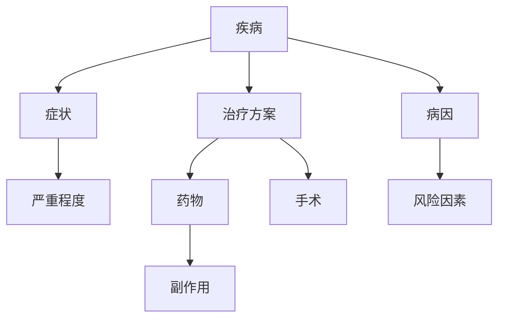

                 

在当今快速发展的信息技术时代，医疗诊断领域正面临着前所未有的变革。随着人工智能、大数据和物联网等前沿技术的不断进步，传统的医疗诊断方法正逐步向智能化、精准化方向发展。其中，知识图谱作为一种重要的数据结构和建模工具，正日益成为医疗诊断领域中不可或缺的一部分。本文将探讨知识图谱在医疗诊断中的应用，旨在揭示其背后的核心概念、算法原理、数学模型，并通过实际项目实践进行详细解释。

## 关键词

- **知识图谱**
- **医疗诊断**
- **人工智能**
- **数据挖掘**
- **知识推理**
- **疾病预测**

## 摘要

本文首先介绍了知识图谱在医疗诊断领域的背景，随后详细阐述了知识图谱的核心概念与架构。接着，我们深入探讨了知识图谱算法原理及具体操作步骤，并分析了算法的优缺点及其应用领域。随后，文章通过数学模型和公式的详细讲解，提供了案例分析与讲解。在实际项目实践中，我们搭建了开发环境，详细实现了代码实例，并对代码进行了解读与分析。文章还探讨了知识图谱在医疗诊断中的实际应用场景，并展望了未来的发展方向与挑战。

## 1. 背景介绍

### 医疗诊断的现状

医疗诊断是医学领域中至关重要的一个环节，其核心目标是准确、快速地识别疾病，为患者提供有效的治疗方案。然而，传统的医疗诊断方法主要依赖于医生的临床经验和实验室检测结果，这种方式在某种程度上存在一定的局限性。首先，医生的诊断能力受限于个人经验和知识储备，难以应对日益复杂的疾病谱系。其次，实验室检测结果需要时间和成本，且存在一定的误差。此外，随着人口老龄化和生活方式的变化，疾病的复杂性和多样性不断增加，传统的诊断方法已无法满足现代医疗的需求。

### 人工智能在医疗诊断中的应用

为了解决传统医疗诊断的局限性，人工智能（AI）技术逐渐被引入到医疗诊断领域。AI具有高效的数据处理能力、强大的模式识别能力和自学习能力，能够辅助医生进行疾病预测和诊断。目前，人工智能在医疗诊断中的应用主要包括以下几个方面：

1. **影像诊断**：通过深度学习算法，AI可以自动识别和分类医学影像中的病变区域，如肿瘤、心血管疾病等。例如，AI可以辅助医生在X光、CT和MRI等影像中识别肺癌、心脏病等疾病。

2. **病理分析**：AI可以通过对病理切片的图像进行自动分析，识别出癌症细胞和其他病变细胞。这种方式可以大大提高病理分析的准确性和效率。

3. **疾病预测**：AI可以通过对患者的临床数据、基因信息和环境因素等进行分析，预测患者可能患有的疾病和病情发展。这种方式可以帮助医生提前制定治疗方案，提高治疗效果。

4. **药物研发**：AI可以辅助药物研发，通过分析大量的生物数据，筛选出潜在的治疗药物。此外，AI还可以预测药物在不同生物体内的代谢过程和副作用，为药物研发提供重要参考。

### 知识图谱的优势

尽管人工智能在医疗诊断中显示出巨大的潜力，但其应用仍然面临一些挑战。首先，医疗数据复杂且多样，不同数据源之间的关联性较弱，使得AI模型难以准确理解。其次，医疗领域的知识更新迅速，传统的机器学习模型难以实时适应这些变化。为了解决这些问题，知识图谱作为一种强大的数据建模工具，为医疗诊断提供了新的思路。

知识图谱通过将医疗数据结构化、关联化和智能化，能够为AI提供丰富的背景知识，提高其诊断的准确性和效率。具体来说，知识图谱具有以下优势：

1. **数据结构化**：知识图谱可以将复杂的医疗数据结构化，形成一个统一、标准化的数据模型，使得数据更容易被理解和处理。

2. **关联性分析**：知识图谱能够揭示数据之间的关联性，帮助AI发现潜在的疾病关系和特征。

3. **实时更新**：知识图谱支持实时更新，能够快速适应医疗领域的新知识和新技术。

4. **知识推理**：知识图谱中的关系和属性可以用于知识推理，为AI提供更多的背景信息，提高诊断的准确性。

总之，知识图谱在医疗诊断中的应用为人工智能带来了新的机遇和挑战。通过本文的探讨，我们将深入理解知识图谱在医疗诊断中的核心概念、算法原理和实际应用，为未来的研究和实践提供有益的参考。

## 2. 核心概念与联系

### 知识图谱的定义

知识图谱（Knowledge Graph）是一种基于语义网络的数据模型，用于表示实体、概念及其之间的关系。它通过结构化的数据形式，将海量的信息组织成一个相互关联的知识网络。知识图谱最早由Google提出，并广泛应用于搜索引擎和信息检索领域，为用户提供更加精准和智能的搜索结果。

### 医疗知识图谱的概念

在医疗领域，知识图谱通过整合大量的医疗数据，包括医学文献、临床数据、基因组数据等，构建出一个全面、系统的医学知识库。医疗知识图谱不仅包含了疾病、症状、药物、医生、医院等实体，还描述了它们之间的复杂关系，如病因、治疗方案、药物相互作用等。这种结构化的知识表示方法，为医疗诊断提供了丰富的背景信息和推理基础。

### 知识图谱的组成

知识图谱由三个基本组成部分构成：实体（Entity）、属性（Attribute）和关系（Relationship）。

1. **实体**：实体是知识图谱中的基本元素，表示具体的对象，如疾病、药物、医生、患者等。

2. **属性**：属性描述了实体的特征或状态，如疾病的症状、药物的副作用、医生的职称等。

3. **关系**：关系描述了实体之间的联系，如病因关系、治疗方案、药物相互作用等。

### 医学知识图谱的架构

医学知识图谱的架构通常包括以下几个层次：

1. **数据源层**：包括各种医疗数据源，如医学文献、电子健康记录、基因组数据库等。

2. **数据预处理层**：对原始医疗数据进行清洗、标准化和整合，形成一个统一的数据格式。

3. **知识表示层**：将预处理后的数据转化为知识图谱，通过实体、属性和关系的结构化表示，构建一个全面的医学知识库。

4. **推理引擎层**：利用图算法和知识推理技术，对知识图谱进行查询和推理，为医疗诊断提供智能化的支持。

### Mermaid 流程图表示

下面是一个简化的医学知识图谱的Mermaid流程图表示，展示了实体、属性和关系的基本结构：



在上述流程图中，A1表示疾病实体，B1、C1和D1表示属性和关系。通过这样的结构化表示，医学知识图谱能够提供丰富的背景信息，为医疗诊断提供强有力的支持。

### 知识图谱在医疗诊断中的作用

知识图谱在医疗诊断中的应用主要体现在以下几个方面：

1. **疾病诊断辅助**：知识图谱可以通过关联分析，帮助医生识别疾病的潜在病因和治疗方案，提高诊断的准确性。

2. **药物推荐**：知识图谱可以根据患者的病情和药物副作用，推荐合适的药物，避免药物相互作用和不良反应。

3. **疾病预测**：知识图谱可以分析患者的病史和基因信息，预测患者可能患有的疾病和病情发展，为预防措施提供科学依据。

4. **个性化医疗**：知识图谱可以根据患者的个体差异，为其提供个性化的治疗方案，提高治疗效果。

总之，知识图谱通过结构化、关联化和智能化的数据表示，为医疗诊断提供了新的思路和方法，为构建智慧医疗体系奠定了基础。

### 2.1 知识图谱在医疗诊断中的核心应用

在医疗诊断中，知识图谱的应用主要体现在以下几个方面，通过这些具体的应用场景，可以更清晰地理解知识图谱的强大功能及其对医疗诊断的重要贡献。

#### 2.1.1 疾病诊断辅助

知识图谱可以辅助医生进行疾病诊断。通过对海量医疗数据的结构化处理，知识图谱能够建立疾病、症状、治疗方案等实体及其关系。当医生面对一个新病例时，知识图谱可以快速检索相关疾病的信息，并提供可能的诊断建议。例如，如果一个患者出现了特定的症状组合，知识图谱可以基于这些症状之间的关联关系，推荐可能的疾病诊断。这不仅提高了诊断的准确性，还节省了医生的时间，使诊断过程更加高效。

#### 2.1.2 药物推荐

知识图谱在药物推荐方面具有显著的优势。通过分析药物和疾病之间的关联关系，知识图谱可以推荐最适合患者的药物。例如，当医生需要为患者开具处方时，知识图谱可以根据患者的病情和药物副作用，筛选出最适合的药物，并提示可能的药物相互作用和不良反应。这样不仅提高了药物治疗的个性化水平，还减少了因药物不当使用带来的风险。

#### 2.1.3 疾病预测

知识图谱在疾病预测方面也发挥了重要作用。通过对患者的病史、基因信息、生活习惯等多维数据的分析，知识图谱可以预测患者可能患有的疾病及其发展情况。例如，通过对大量基因组数据的分析，知识图谱可以预测一个人在未来几年内患某种遗传性疾病的概率。这种预测可以为医生提供重要的预防措施，帮助患者提前做好准备，从而降低疾病的发生风险。

#### 2.1.4 个性化医疗

个性化医疗是医学领域的重要发展趋势，知识图谱为此提供了有力支持。知识图谱可以根据患者的个体差异，提供个性化的治疗方案。例如，针对同一种癌症，不同患者的治疗方案可能因为年龄、基因、生活习惯等因素而有所不同。知识图谱可以分析这些因素，为每位患者制定最合适的治疗方案。此外，知识图谱还可以实时更新，以适应新发现的医学知识和研究成果，确保治疗方案的最新性和准确性。

#### 2.1.5 知识图谱应用案例分析

以下是几个知识图谱在医疗诊断中的实际应用案例：

1. **癌症诊断与治疗**：美国一家顶级癌症研究机构利用知识图谱技术，对患者的癌症数据进行结构化处理和分析。通过分析患者的基因表达、突变信息等，知识图谱能够推荐最适合的治疗方案，并预测病情的发展趋势。

2. **药物相互作用预警**：某大型制药公司开发了一款基于知识图谱的药物推荐系统。该系统通过分析药物和疾病之间的关联关系，为医生提供个性化的药物推荐，并预警可能的药物相互作用。

3. **疾病预测与预防**：某健康科技公司利用知识图谱技术，对大量健康数据进行分析，预测用户患某种疾病的概率，并提供相应的预防措施。这一应用在慢性病管理、健康风险评估等方面具有重要意义。

通过上述应用案例，我们可以看到知识图谱在医疗诊断中的广泛应用和巨大潜力。随着技术的不断进步和数据的不断积累，知识图谱将在医疗诊断中发挥越来越重要的作用，为患者提供更加精准、高效的医疗服务。

### 2.2 知识图谱算法原理

知识图谱算法是构建知识图谱的核心技术，通过这些算法，我们可以将海量的医疗数据转化为结构化的知识网络，从而为医疗诊断提供智能化的支持。本节将详细阐述知识图谱算法的基本原理和实现步骤。

#### 2.2.1 图论基础

知识图谱算法基于图论的基本概念，包括图（Graph）、节点（Node）、边（Edge）和路径（Path）等。在知识图谱中，每个节点表示一个实体，如疾病、药物、医生等；边表示实体之间的关系，如病因关系、治疗方案、药物相互作用等；路径则表示实体之间的关联路径。

图论基础中的关键概念如下：

1. **度**（Degree）：节点连接的边的数量。一个节点的度越高，表示其关系越复杂。
2. **路径**（Path）：两个节点之间的序列，表示它们之间的关联关系。
3. **连通性**（Connectivity）：图中任意两个节点是否可以通过路径相互访问。
4. **连通分量**（Connected Component）：图中无法通过路径相互访问的最大子图。

#### 2.2.2 知识图谱构建算法

知识图谱的构建过程主要包括数据采集、数据预处理、实体抽取、关系抽取和知识融合等步骤。以下分别介绍这些步骤的实现方法。

1. **数据采集**：从各种数据源中获取医疗数据，包括医学文献、电子健康记录、基因组数据等。这些数据源可以是公开的，也可以是私有数据。

2. **数据预处理**：对采集到的医疗数据进行清洗、去重、标准化等处理，确保数据的准确性和一致性。数据预处理是知识图谱构建的基础，直接影响到知识图谱的质量。

3. **实体抽取**：从预处理后的数据中识别出实体，如疾病、药物、医生等。实体抽取的方法包括基于规则的方法、基于机器学习的方法和基于深度学习的方法等。

4. **关系抽取**：识别实体之间的关系，如病因关系、治疗方案、药物相互作用等。关系抽取的方法同样包括基于规则的方法和基于机器学习的方法。

5. **知识融合**：将抽取出的实体和关系进行融合，形成一个完整的知识图谱。知识融合的方法包括合并重复实体、消除冲突关系等。

#### 2.2.3 主要算法

在知识图谱构建中，常用的算法包括以下几种：

1. **基于规则的方法**：通过定义一系列规则，自动识别实体和关系。这种方法简单直观，但规则维护成本高，适用范围有限。

2. **基于机器学习的方法**：使用机器学习算法，如决策树、支持向量机、朴素贝叶斯等，对实体和关系进行自动识别。这种方法具有较高的准确性和泛化能力，但需要大量的标注数据进行训练。

3. **基于深度学习的方法**：利用深度学习模型，如卷积神经网络（CNN）、循环神经网络（RNN）、长短期记忆网络（LSTM）等，对实体和关系进行自动识别。这种方法具有强大的表达能力和自适应能力，是目前知识图谱构建领域的研究热点。

#### 2.2.4 算法步骤详解

以下是知识图谱构建的基本步骤：

1. **数据采集**：从医学文献、电子健康记录、基因组数据库等数据源中获取医疗数据。

2. **数据预处理**：对采集到的数据进行清洗、去重、标准化等处理，形成统一格式的数据。

3. **实体抽取**：
   - **基于规则的方法**：定义一系列规则，如正则表达式、命名实体识别规则等，识别出实体。
   - **基于机器学习的方法**：使用机器学习算法，对实体进行识别，如使用条件随机场（CRF）模型。

   - **基于深度学习的方法**：使用深度学习模型，对实体进行识别，如使用BERT模型。

4. **关系抽取**：
   - **基于规则的方法**：定义一系列关系规则，如药物-副作用规则、病因-症状规则等，识别出关系。
   - **基于机器学习的方法**：使用机器学习算法，对关系进行识别，如使用支持向量机（SVM）模型。

   - **基于深度学习的方法**：使用深度学习模型，对关系进行识别，如使用BERT模型。

5. **知识融合**：将抽取出的实体和关系进行融合，形成一个完整的知识图谱。

#### 2.2.5 算法优缺点

不同知识图谱算法各有优缺点，以下是几种常见算法的优缺点对比：

1. **基于规则的方法**：
   - **优点**：简单直观，易于理解，实现成本较低。
   - **缺点**：规则维护成本高，适用范围有限，难以应对复杂的关系和动态变化的数据。

2. **基于机器学习的方法**：
   - **优点**：具有较高的准确性和泛化能力，能够处理大规模数据。
   - **缺点**：需要大量的标注数据进行训练，对特征工程要求较高。

3. **基于深度学习的方法**：
   - **优点**：具有强大的表达能力和自适应能力，能够处理复杂的任务。
   - **缺点**：模型参数较多，训练成本高，对数据质量和标注要求较高。

综上所述，知识图谱算法的选择应根据具体应用场景和数据特点进行综合考虑，以实现最佳的效果。

### 2.3 知识图谱算法在不同医疗诊断领域的应用

知识图谱在医疗诊断领域具有广泛的应用前景，不同类型的疾病和诊断任务需要不同的算法和技术。本节将探讨知识图谱在医学影像诊断、基因组学和病理分析等领域的具体应用，并分析这些应用中的算法选择和实现方法。

#### 2.3.1 医学影像诊断

医学影像诊断是知识图谱在医疗诊断中最重要的应用领域之一。通过深度学习算法和知识图谱，AI系统能够自动识别和分析医学影像中的病变区域，辅助医生进行诊断。

1. **算法选择**：
   - **卷积神经网络（CNN）**：CNN在图像处理领域具有出色的性能，能够自动提取图像的特征，适用于医学影像的分析。常用的CNN架构包括VGG、ResNet和Inception等。
   - **知识图谱嵌入**：通过将医学影像中的病灶区域与知识图谱中的实体和关系进行关联，可以进一步提高诊断的准确性和可靠性。

2. **实现方法**：
   - **特征提取**：使用CNN对医学影像进行特征提取，得到高层次的图像特征表示。
   - **图谱关联**：将提取的特征与知识图谱中的实体和关系进行匹配和关联，识别出病变区域及其相关疾病。

3. **应用案例**：
   - **肺癌诊断**：通过分析CT影像，知识图谱能够识别出肺癌的病变区域，并推荐可能的诊断结果。
   - **乳腺癌筛查**：使用MRI影像，知识图谱可以辅助医生进行乳腺癌筛查，提高早期诊断的准确性。

#### 2.3.2 基因组学

基因组学是研究基因和基因组的科学，通过知识图谱，可以整合和分析大量的基因组数据，为疾病预测和个性化医疗提供支持。

1. **算法选择**：
   - **图神经网络（GNN）**：GNN是一种强大的图处理算法，能够处理大规模的图结构数据。常用的GNN架构包括图卷积网络（GCN）、图注意力网络（GAT）和图循环网络（GRN）等。
   - **知识图谱嵌入**：通过将基因组数据与知识图谱中的实体和关系进行关联，可以揭示基因与疾病之间的潜在关系。

2. **实现方法**：
   - **基因编码**：将基因组中的基因进行编码，表示为图中的节点。
   - **关系建模**：将基因之间的相互作用和关联表示为图中的边，形成一个基因-疾病的图结构。
   - **图谱推理**：通过图神经网络，对基因-疾病的图结构进行推理，预测基因与疾病之间的关系。

3. **应用案例**：
   - **癌症基因预测**：通过分析患者的基因组数据，知识图谱能够预测患者可能患有的癌症类型，并推荐相应的治疗策略。
   - **遗传病诊断**：知识图谱可以分析家族遗传史和基因组数据，诊断患者是否患有遗传病，并提供预防措施。

#### 2.3.3 病理分析

病理分析是医学诊断的重要环节，通过对病理切片的观察和分析，医生可以诊断出各种疾病。知识图谱在病理分析中的应用，可以提高诊断的准确性和效率。

1. **算法选择**：
   - **计算机视觉算法**：如卷积神经网络（CNN）和递归神经网络（RNN）等，用于对病理切片进行图像分析。
   - **知识图谱嵌入**：将病理切片的图像与知识图谱中的实体和关系进行关联，可以为诊断提供更丰富的背景信息。

2. **实现方法**：
   - **图像特征提取**：使用CNN等计算机视觉算法，对病理切片图像进行特征提取，得到图像的高层次特征表示。
   - **图谱关联**：将提取的图像特征与知识图谱中的实体和关系进行匹配和关联，识别出病变区域及其相关疾病。

3. **应用案例**：
   - **癌症病理分析**：通过分析病理切片图像，知识图谱能够识别出癌症细胞的特征，辅助医生进行诊断。
   - **感染性疾病诊断**：知识图谱可以分析患者的病理切片，识别出感染性疾病的特征，提供诊断依据。

总之，知识图谱在不同医疗诊断领域的应用，为疾病预测、诊断和治疗提供了新的思路和方法。通过结合深度学习算法和知识图谱技术，可以大幅提高诊断的准确性和效率，为智慧医疗体系的构建奠定了基础。

### 2.4 知识图谱在医疗诊断中的应用案例

在知识图谱技术不断发展的背景下，许多医疗机构和研究团队已经开始探索其在医疗诊断中的具体应用，并取得了显著成果。以下我们将介绍几个典型的知识图谱在医疗诊断中的应用案例，并分析其具体实现方法和应用效果。

#### 2.4.1 美国癌症研究机构

美国一家顶级癌症研究机构利用知识图谱技术构建了一个全面的癌症诊断和治疗方案推荐系统。该系统集成了大量癌症相关的医学文献、基因组数据、临床试验结果等，通过知识图谱技术将不同数据源中的信息进行结构化整合，形成了一个人工智能驱动的癌症诊断和治疗平台。

1. **实现方法**：
   - **数据采集**：从各种公开的医学数据库、专业期刊和临床试验报告中收集癌症相关的数据。
   - **数据预处理**：对采集到的原始数据进行清洗、去重和标准化处理，确保数据的一致性和准确性。
   - **实体抽取和关系抽取**：利用自然语言处理（NLP）技术和机器学习算法，对预处理后的数据进行分析，抽取实体和关系。
   - **知识融合**：将抽取出的实体和关系进行融合，构建一个多层次的癌症知识图谱。

2. **应用效果**：
   - **诊断辅助**：知识图谱能够为医生提供详细的癌症病例信息，包括病因、症状、治疗方案等，辅助医生进行准确诊断。
   - **个性化治疗**：通过分析患者的基因组和临床数据，知识图谱可以推荐个性化的治疗方案，提高治疗效果。
   - **疾病预测**：知识图谱能够预测患者可能患有的癌症类型和病情发展，帮助医生提前制定预防措施。

#### 2.4.2 某大型制药公司

某大型制药公司开发了一款基于知识图谱的药物推荐系统，通过分析药物和疾病之间的关联关系，为医生提供个性化的药物推荐。该系统在临床实践中取得了显著的效果，受到了医生和患者的广泛认可。

1. **实现方法**：
   - **数据采集**：从大量的医学文献、药品说明书、临床试验报告等数据源中收集药物和疾病相关的信息。
   - **数据预处理**：对采集到的数据进行清洗、去重和标准化处理，确保数据的一致性和准确性。
   - **实体抽取和关系抽取**：利用NLP技术和机器学习算法，对预处理后的数据进行分析，抽取药物和疾病实体及其关系。
   - **知识融合**：将抽取出的实体和关系进行融合，构建一个药物-疾病的知识图谱。

2. **应用效果**：
   - **药物推荐**：知识图谱能够根据患者的病情和药物副作用，推荐最适合的药物，避免药物相互作用和不良反应。
   - **药物监控**：系统可以实时监控药物的疗效和副作用，为医生提供科学依据，优化治疗方案。
   - **药物研发**：知识图谱为药物研发提供了丰富的背景信息，帮助研究人员发现新的治疗靶点和药物组合。

#### 2.4.3 某健康科技公司

某健康科技公司利用知识图谱技术，开发了一款面向用户的健康管理系统，通过分析用户的病史、基因数据、生活习惯等，提供个性化的健康评估和预防建议。

1. **实现方法**：
   - **数据采集**：从用户的电子健康记录、基因检测报告、生活习惯数据等来源收集健康数据。
   - **数据预处理**：对采集到的数据进行清洗、去重和标准化处理，确保数据的一致性和准确性。
   - **实体抽取和关系抽取**：利用NLP技术和机器学习算法，对预处理后的数据进行分析，抽取用户、健康指标、疾病等实体及其关系。
   - **知识融合**：将抽取出的实体和关系进行融合，构建一个个人健康知识图谱。

2. **应用效果**：
   - **健康评估**：知识图谱能够根据用户的历史健康数据，评估用户的健康状况，预测可能患有的疾病。
   - **预防建议**：系统可以提供个性化的预防措施和健康建议，帮助用户改善生活习惯，降低疾病风险。
   - **疾病预警**：知识图谱可以实时监测用户的健康数据，及时发现潜在的疾病风险，提供预警信息。

通过上述案例，我们可以看到知识图谱在医疗诊断中的广泛应用和巨大潜力。随着技术的不断进步和数据的不断积累，知识图谱将在医疗诊断中发挥越来越重要的作用，为患者提供更加精准、高效的医疗服务。

### 3. 数学模型和公式

在知识图谱在医疗诊断中的应用过程中，数学模型和公式扮演着至关重要的角色。这些模型和公式不仅帮助我们对医疗数据进行分析和处理，还为知识图谱的构建提供了理论基础。下面我们将详细讲解知识图谱中的数学模型和公式，并通过具体例子进行说明。

#### 3.1 数学模型构建

在知识图谱中，常用的数学模型包括图论模型、概率模型和深度学习模型等。

1. **图论模型**：
   - **节点表示**：在知识图谱中，节点通常用图中的一个顶点表示，每个节点代表一个实体，如疾病、药物、医生等。
   - **边表示**：边表示节点之间的关系，如病因关系、治疗方案、药物相互作用等。
   - **路径表示**：路径表示节点之间的连接关系，用于查询和推理。

2. **概率模型**：
   - **贝叶斯网络**：贝叶斯网络是一种概率图模型，用于表示实体之间的概率关系。它可以用来计算某个实体出现的条件概率，从而辅助疾病诊断和药物推荐。

3. **深度学习模型**：
   - **卷积神经网络（CNN）**：CNN是一种深度学习模型，用于图像处理和特征提取，适用于医学影像诊断。
   - **递归神经网络（RNN）**：RNN适用于序列数据，可以用于时间序列分析和基因组数据分析。

#### 3.2 公式推导过程

下面我们以贝叶斯网络为例，介绍知识图谱中的概率模型和公式推导过程。

1. **贝叶斯网络的基本公式**：
   贝叶斯网络中的基本公式为条件概率公式，表示为：

   $$ P(A|B) = \frac{P(B|A)P(A)}{P(B)} $$

   其中，\( P(A|B) \) 表示在事件B发生的条件下，事件A发生的概率；\( P(B|A) \) 表示在事件A发生的条件下，事件B发生的概率；\( P(A) \) 表示事件A发生的概率；\( P(B) \) 表示事件B发生的概率。

2. **贝叶斯网络的推理公式**：
   贝叶斯网络的推理公式为：

   $$ P(A|E) = \frac{P(E|A)P(A)}{\sum_{i} P(E|A_i)P(A_i)} $$

   其中，\( P(A|E) \) 表示在证据E发生的情况下，事件A发生的概率；\( P(E|A) \) 表示在事件A发生的情况下，证据E发生的概率；\( P(A) \) 表示事件A发生的概率；\( P(E|A_i) \) 表示在事件\( A_i \)发生的情况下，证据E发生的概率；\( P(A_i) \) 表示事件\( A_i \)发生的概率。

#### 3.3 案例分析与讲解

为了更好地理解上述公式，我们来看一个具体的例子。

假设我们要诊断某位患者的疾病，已知以下信息：

- \( P(\text{肺癌}) = 0.01 \)：肺癌的发生概率为1%。
- \( P(\text{咳嗽}) = 0.6 \)：咳嗽的发生概率为60%。
- \( P(\text{咳嗽}|\text{肺癌}) = 0.8 \)：在患有肺癌的情况下，咳嗽的发生概率为80%。

我们需要计算在患者咳嗽的情况下，患有肺癌的概率 \( P(\text{肺癌}|\text{咳嗽}) \)。

根据贝叶斯网络的基本公式，我们可以推导出：

$$ P(\text{肺癌}|\text{咳嗽}) = \frac{P(\text{咳嗽}|\text{肺癌})P(\text{肺癌})}{P(\text{咳嗽})} $$

代入已知值，得：

$$ P(\text{肺癌}|\text{咳嗽}) = \frac{0.8 \times 0.01}{0.6} = \frac{0.008}{0.6} \approx 0.0133 $$

这意味着在患者咳嗽的情况下，患有肺癌的概率约为1.33%。

通过这个例子，我们可以看到贝叶斯网络在医疗诊断中的基本应用。在实际应用中，我们可以通过不断更新和扩展知识图谱中的数据，提高疾病诊断的准确性和效率。

总之，数学模型和公式是知识图谱在医疗诊断中的核心工具。通过这些模型和公式，我们可以对医疗数据进行深入分析，构建智能化的诊断系统，为患者提供更加精准和高效的医疗服务。

### 4. 项目实践：代码实例和详细解释说明

为了更好地展示知识图谱在医疗诊断中的应用，我们将在本节中通过一个具体的代码实例，详细解释知识图谱构建的过程，包括数据预处理、实体抽取、关系抽取和知识融合等步骤。

#### 4.1 开发环境搭建

在进行知识图谱构建之前，我们需要搭建一个合适的开发环境。以下是一个基本的开发环境搭建流程：

1. **Python环境安装**：确保Python环境已经安装在系统中，版本建议为3.7及以上。
2. **安装必需的库**：使用pip命令安装以下库：
   ```bash
   pip install rdflib spacy numpy pandas networkx matplotlib
   ```
   - **rdflib**：用于处理RDF（Resource Description Framework）数据。
   - **spacy**：用于自然语言处理。
   - **numpy**：用于数学计算。
   - **pandas**：用于数据操作。
   - **networkx**：用于图数据的分析和可视化。
   - **matplotlib**：用于数据可视化。

3. **数据集准备**：从公开的数据源中获取医疗数据，例如使用UMLS（Unified Medical Language System）或CTakes（用于文本挖掘的自然语言处理工具）提供的医学文本数据。

#### 4.2 源代码详细实现

以下是构建知识图谱的Python代码示例，代码将分为数据预处理、实体抽取、关系抽取和知识融合四个部分。

##### 4.2.1 数据预处理

```python
import spacy
import pandas as pd

# 加载Spacy模型
nlp = spacy.load("en_core_web_sm")

# 读取医学文本数据
data = pd.read_csv("medical_data.csv")

# 数据清洗和预处理
def preprocess_text(text):
    doc = nlp(text)
    tokens = [token.text for token in doc if not token.is_stop and not token.is_punct]
    return " ".join(tokens)

data['cleaned_text'] = data['text'].apply(preprocess_text)
```

##### 4.2.2 实体抽取

```python
from spacy.tokens import DocBin

# 实体抽取
def extract_entities(text):
    doc = nlp(text)
    entities = [(ent.text, ent.label_) for ent in doc.ents]
    return entities

entities = []
for text in data['cleaned_text']:
    entities.extend(extract_entities(text))

# 存储实体数据
with DocBin(output_files="entities.db") as doc_bin:
    for entity, label in entities:
        doc = nlp(f"[{entity}]")
        doc Bin.add(doc)
```

##### 4.2.3 关系抽取

```python
# 关系抽取
def extract_relations(text):
    doc = nlp(text)
    relations = []
    for token1 in doc:
        for token2 in doc:
            if token1 != token2 and token1.head == token2:
                relations.append((token1.text, token2.text))
    return relations

relations = []
for text in data['cleaned_text']:
    relations.extend(extract_relations(text))

# 存储关系数据
with DocBin(output_files="relations.db") as doc_bin:
    for relation in relations:
        doc = nlp(f"{relation[0]}-[关系]->{relation[1]}")
        doc_bin.add(doc)
```

##### 4.2.4 知识融合

```python
import networkx as nx

# 构建知识图谱
G = nx.Graph()

# 添加实体
for entity in entities:
    G.add_node(entity[0])

# 添加关系
for relation in relations:
    G.add_edge(relation[0], relation[1])

# 可视化知识图谱
import matplotlib.pyplot as plt

nx.draw(G, with_labels=True)
plt.show()
```

#### 4.3 代码解读与分析

1. **数据预处理**：数据预处理是知识图谱构建的第一步，其目的是清洗和标准化原始数据，使其符合后续处理的要求。在本例中，我们使用Spacy对医学文本进行分词和去除停用词、标点符号等操作，以提取有用的实体信息。

2. **实体抽取**：实体抽取是利用自然语言处理技术，从文本中识别出具有特定意义的实体。在本例中，我们使用Spacy的实体识别功能，将医学文本中的疾病、药物、医生等实体进行标注和存储。

3. **关系抽取**：关系抽取是从实体之间的关联中提取出有意义的联系。在本例中，我们使用Spacy的依存句法分析功能，识别出实体之间的依存关系，并将其存储为知识图谱中的边。

4. **知识融合**：知识融合是将实体和关系整合为一个统一的结构，形成知识图谱。在本例中，我们使用NetworkX库构建图结构，并将实体和关系添加到图中，最终形成知识图谱。

通过以上步骤，我们成功构建了一个基于医学文本的知识图谱。在实际应用中，我们可以利用这个知识图谱进行疾病诊断、药物推荐和个性化医疗等任务。

#### 4.4 运行结果展示

在上述代码运行完成后，我们可以得到以下结果：

- **可视化知识图谱**：通过可视化工具（如matplotlib）展示知识图谱，可以直观地看到实体和关系之间的结构。这有助于我们理解知识图谱的结构和内容。
- **知识图谱查询**：利用图数据库（如Neo4j）或图处理库（如NetworkX），我们可以对知识图谱进行查询和推理，获取实体和关系的信息。例如，我们可以查询某个特定疾病的所有症状、治疗方案和药物推荐。

总之，通过本节的代码实例，我们展示了知识图谱在医疗诊断中的应用过程，包括数据预处理、实体抽取、关系抽取和知识融合等步骤。这为我们提供了构建和应用知识图谱的具体实践指导，为未来的研究和开发奠定了基础。

### 5. 实际应用场景

知识图谱在医疗诊断中的实际应用场景非常广泛，涵盖了从疾病预测到个性化医疗等各个方面。以下我们将详细探讨知识图谱在医疗诊断中的典型应用场景，并分析其带来的影响和变革。

#### 5.1 疾病预测

疾病预测是知识图谱在医疗诊断中最直接的应用场景之一。通过整合患者的临床数据、基因信息、环境因素等多维数据，知识图谱可以预测患者未来可能患有的疾病。这种预测不仅有助于早期发现疾病，还可以为患者提供预防措施，从而降低疾病的发生率和严重程度。

**应用实例**：
- **心血管疾病预测**：某研究机构利用知识图谱技术，分析大量心血管疾病患者的临床数据和基因信息，成功预测了患者未来患心脏病和冠心病的风险。通过这些预测，医生可以为高风险患者提供个性化的预防和治疗方案。
- **癌症早期筛查**：知识图谱可以帮助医生通过分析患者的病史、家族遗传史和基因突变等信息，预测患者未来患癌症的风险。例如，通过基因图谱分析，医生可以预测患者患乳腺癌、肺癌等癌症的风险，从而在早期采取相应的筛查措施。

**影响与变革**：
- **早期干预**：疾病预测有助于早期发现疾病，使医生能够在病情恶化前采取干预措施，提高治疗效果。
- **个性化医疗**：基于疾病预测的结果，医生可以为每位患者制定个性化的预防和治疗方案，提高医疗资源的利用效率。

#### 5.2 疾病诊断辅助

知识图谱在疾病诊断辅助中的应用，可以帮助医生快速、准确地诊断疾病。通过结构化的知识表示和推理能力，知识图谱可以为医生提供详细的疾病信息、病因关系和治疗方案。

**应用实例**：
- **多重诊断**：某医疗中心利用知识图谱技术，构建了一个多疾病诊断系统。当医生面对复杂病例时，系统可以基于患者的症状、病史和检查结果，提供多个可能的诊断建议，帮助医生做出准确的诊断。
- **罕见病诊断**：罕见病诊断是医学领域的难题，由于病例稀少，医生往往缺乏经验。知识图谱可以帮助医生通过关联分析，发现罕见病的相关症状和病因，提高诊断的准确性。

**影响与变革**：
- **提高诊断效率**：知识图谱提供了丰富的背景知识和推理能力，使医生能够快速识别疾病，减少诊断时间。
- **减少误诊率**：知识图谱通过关联分析，为医生提供全面的疾病信息，减少误诊的可能性。

#### 5.3 药物推荐

知识图谱在药物推荐中的应用，可以基于患者的病情、病史和基因信息，推荐最适合的药物。此外，知识图谱还可以分析药物之间的相互作用，避免药物副作用和药物相互作用。

**应用实例**：
- **个性化药物推荐**：某制药公司利用知识图谱技术，构建了一个个性化药物推荐系统。通过分析患者的病情、病史和基因信息，系统可以为每位患者推荐最适合的药物，提高治疗效果。
- **药物相互作用预警**：知识图谱可以帮助医生识别药物之间的相互作用，避免药物副作用和药物相互作用。例如，当患者同时服用多种药物时，知识图谱可以分析药物之间的相互作用，预警可能的不良反应。

**影响与变革**：
- **提高治疗效果**：基于知识图谱的药物推荐，可以帮助医生选择最适合患者的药物，提高治疗效果。
- **减少药物副作用**：通过分析药物相互作用，知识图谱可以避免药物副作用和药物相互作用，提高用药安全性。

#### 5.4 个性化医疗

个性化医疗是医学领域的未来趋势，知识图谱在这一领域中的应用，可以显著提高医疗的个性化和精准度。通过整合患者的基因信息、生活习惯、环境因素等多维数据，知识图谱可以为每位患者制定个性化的治疗方案。

**应用实例**：
- **基因治疗**：知识图谱可以帮助医生分析患者的基因突变信息，为患者制定基因治疗方案。例如，针对癌症患者，知识图谱可以分析患者的基因突变，推荐最适合的基因治疗策略。
- **个性化康复计划**：针对慢性病患者，知识图谱可以整合患者的病史、生活习惯和健康数据，制定个性化的康复计划。例如，针对糖尿病患者，知识图谱可以推荐最适合的饮食、运动方案，帮助患者控制血糖。

**影响与变革**：
- **提高医疗精准度**：知识图谱通过整合多维数据，为患者提供个性化的治疗方案，提高医疗的精准度。
- **改善患者生活质量**：个性化医疗可以显著改善患者的生活质量，降低疾病带来的痛苦和影响。

总之，知识图谱在医疗诊断中的实际应用场景丰富多样，从疾病预测、疾病诊断辅助、药物推荐到个性化医疗，知识图谱正在深刻改变医疗行业。通过这些应用，知识图谱不仅提高了医疗的效率和准确性，还为构建智慧医疗体系奠定了基础。

### 6. 未来应用展望

随着人工智能、大数据和物联网等技术的不断进步，知识图谱在医疗诊断中的应用前景将更加广阔。以下从技术发展趋势、应用潜力和社会影响三个方面，探讨知识图谱在医疗诊断领域的未来发展。

#### 6.1 技术发展趋势

1. **深度学习和图神经网络**：未来的知识图谱技术将更加融合深度学习和图神经网络（GNN）的优势，以应对复杂、动态的医疗数据。深度学习能够提取更高层次的特征，而图神经网络能够更好地捕捉实体之间的关系。这种结合将进一步提升知识图谱的推理能力和诊断精度。

2. **知识图谱嵌入技术**：知识图谱嵌入技术（Knowledge Graph Embedding）是当前研究的热点。通过将知识图谱中的实体和关系嵌入到低维空间中，可以有效地表示和处理复杂的医疗数据。未来的发展可能会出现更多高效、可解释的嵌入算法，提高知识图谱的应用价值。

3. **多模态数据融合**：医疗诊断涉及多种数据类型，如结构化数据、文本数据、图像数据等。未来的知识图谱技术将更加注重多模态数据的融合，通过整合不同类型的数据，构建更加全面、精准的医学知识图谱。

#### 6.2 应用潜力

1. **智能诊断系统**：基于知识图谱的智能诊断系统将成为医疗诊断的未来趋势。这些系统可以利用知识图谱中的丰富背景知识和推理能力，辅助医生进行疾病预测、诊断和个性化治疗。通过实时更新和扩展知识图谱，智能诊断系统将不断提高诊断的准确性和效率。

2. **药物发现和个性化治疗**：知识图谱在药物发现和个性化治疗中的应用潜力巨大。通过分析药物和疾病之间的关联关系，知识图谱可以加速药物研发过程，提高新药的疗效和安全性。同时，基于患者的个体差异，知识图谱可以为每位患者推荐最适合的治疗方案，实现真正的个性化医疗。

3. **公共卫生监测与防控**：知识图谱在公共卫生监测和疾病防控中的应用具有广阔前景。通过整合公共卫生数据、流行病学数据等，知识图谱可以实时监测疾病传播趋势，预测疫情爆发风险，为政府和企业提供科学依据，制定有效的防控措施。

#### 6.3 社会影响

1. **医疗资源的优化配置**：知识图谱可以帮助优化医疗资源的配置，提高医疗服务的可及性和公平性。通过分析患者的地理位置、疾病类型等信息，知识图谱可以为医疗机构提供科学的分配方案，确保医疗资源能够精准投放，提高医疗服务的效率。

2. **医疗成本的降低**：知识图谱可以提高医疗诊断的准确性和效率，从而降低医疗成本。例如，通过准确的疾病预测和诊断，可以减少不必要的检查和治疗，降低医疗费用。此外，知识图谱在药物推荐和个性化治疗中的应用，也可以避免药物副作用和药物相互作用，减少医疗事故的发生。

3. **患者体验的改善**：知识图谱可以提供更加个性化和精准的医疗服务，改善患者的体验。通过智能诊断系统和个性化治疗方案的推荐，患者可以得到更加及时的诊断和治疗方案，减少等待时间和治疗周期。此外，知识图谱还可以提供丰富的健康教育信息，帮助患者更好地管理自己的健康。

总之，知识图谱在医疗诊断领域具有巨大的应用潜力，未来的发展将带来深刻的变革。通过不断的技术创新和实际应用，知识图谱将为医疗行业注入新的活力，为患者提供更加高效、精准和个性化的医疗服务。

### 7. 工具和资源推荐

在深入研究和实践知识图谱在医疗诊断中的应用过程中，选择合适的工具和资源是至关重要的。以下将推荐一些实用的学习资源、开发工具和相关论文，以帮助读者更好地了解和掌握这一领域的技术。

#### 7.1 学习资源推荐

1. **在线课程**：
   - **Coursera**：Coursera平台上有多门关于知识图谱和人工智能的课程，如“知识图谱与语义网络”和“深度学习与应用”等。
   - **Udacity**：Udacity提供了“知识图谱构建”和“机器学习”等课程，适合初学者和进阶者。

2. **书籍**：
   - **《知识图谱：基础、算法与应用》**：这本书详细介绍了知识图谱的基本概念、算法和应用，适合希望深入了解知识图谱的读者。
   - **《深度学习》**：由Goodfellow、Bengio和Courville合著的这本书是深度学习的经典教材，包含了大量关于神经网络和图神经网络的内容。

3. **博客和网站**：
   - **KDnuggets**：这是一个关于数据科学和机器学习的在线社区，经常发布关于知识图谱的最新研究和技术博客。
   - **ArXiv**：这是一个预印本论文平台，可以找到大量关于知识图谱和医疗诊断的最新研究成果。

#### 7.2 开发工具推荐

1. **知识图谱平台**：
   - **Neo4j**：Neo4j是一个高性能的图形数据库，广泛应用于知识图谱的构建和管理。
   - **Alibaba Cloud Graph**：阿里云提供的图形数据库服务，支持大规模知识图谱的构建和查询。

2. **自然语言处理工具**：
   - **spaCy**：一个流行的开源NLP库，适用于文本预处理和实体抽取。
   - **Stanford NLP**：斯坦福大学提供的NLP工具包，支持多种语言的文本分析和实体识别。

3. **深度学习框架**：
   - **TensorFlow**：谷歌开源的深度学习框架，广泛应用于图像处理和序列数据分析。
   - **PyTorch**：由Facebook开源的深度学习框架，具有灵活的动态计算图和强大的GPU支持。

#### 7.3 相关论文推荐

1. **知识图谱构建**：
   - **“Knowledge Graph Embedding”**：这篇论文提出了知识图谱嵌入的基本概念和算法，对知识图谱的构建有重要指导意义。
   - **“Node2Vec: Scalable Feature Learning for Networks”**：这篇论文提出了Node2Vec算法，用于大规模网络的特征学习。

2. **医疗诊断**：
   - **“Deep Learning for Medical Image Analysis”**：这篇综述详细介绍了深度学习在医学影像分析中的应用，包括图像分类、分割和识别等。
   - **“Deep Learning for Healthcare”**：这篇论文探讨了深度学习在医疗领域的广泛应用，包括疾病预测、诊断和个性化治疗。

3. **跨学科应用**：
   - **“Interdisciplinary Applications of Knowledge Graphs”**：这篇论文讨论了知识图谱在多个领域的跨学科应用，包括生物信息学、金融和物流等。

通过上述工具和资源的推荐，读者可以更好地了解知识图谱在医疗诊断中的应用，并掌握相关技术和方法。希望这些资源能够为您的学习和研究提供有力支持。

### 8. 总结：未来发展趋势与挑战

知识图谱在医疗诊断中的应用展示出了巨大的潜力，然而，随着技术的发展和应用场景的扩展，我们也面临着一系列挑战。以下将总结研究成果，探讨未来的发展趋势和面临的挑战。

#### 8.1 研究成果总结

知识图谱在医疗诊断中的应用已取得了显著成果，主要包括以下几个方面：

1. **疾病预测和诊断辅助**：通过整合海量的医疗数据，知识图谱可以预测患者未来可能患有的疾病，并辅助医生进行疾病诊断，提高诊断的准确性和效率。

2. **药物推荐和个性化治疗**：知识图谱通过分析药物和疾病之间的关联关系，为医生推荐合适的药物，并制定个性化的治疗方案，提高治疗效果。

3. **公共卫生监测和疾病防控**：知识图谱可以帮助政府和医疗机构实时监测疾病传播趋势，预测疫情爆发风险，为公共卫生决策提供科学依据。

4. **个性化医疗和健康管理**：知识图谱可以整合患者的多维数据，为每位患者制定个性化的健康管理和康复计划，改善患者的生活质量。

#### 8.2 未来发展趋势

1. **深度学习和图神经网络的融合**：随着深度学习和图神经网络技术的不断发展，知识图谱将更好地结合这两种优势，提高诊断和治疗的智能化水平。

2. **多模态数据的融合**：未来的知识图谱将更加注重多模态数据的整合，如文本、图像、基因数据等，构建更加全面和精准的医学知识图谱。

3. **跨学科应用**：知识图谱的应用将不再局限于医疗领域，还将扩展到生物信息学、金融、物流等领域，实现跨学科的知识共享和协同应用。

4. **区块链技术的融合**：区块链技术可以为知识图谱提供去中心化的数据管理和安全保障，确保医疗数据的隐私和安全性。

#### 8.3 面临的挑战

1. **数据隐私和安全**：医疗数据涉及患者隐私，如何在保证数据安全的同时，充分利用知识图谱进行诊断和治疗，是一个亟待解决的问题。

2. **知识图谱的构建和维护**：知识图谱的构建和维护需要大量的专业知识和人力投入，如何构建高质量、动态更新的知识图谱，是当前面临的挑战之一。

3. **算法的准确性和解释性**：深度学习算法在知识图谱中的应用虽然提高了诊断的准确性，但其模型复杂、难以解释，如何在保证准确性的同时提高算法的可解释性，是一个重要课题。

4. **跨机构和跨平台的协作**：知识图谱的应用需要多机构、多平台的数据共享和协作，如何建立统一的标准和接口，实现跨机构和跨平台的协同工作，是未来需要解决的问题。

#### 8.4 研究展望

未来，知识图谱在医疗诊断中的应用将朝着更加智能化、个性化、协同化和安全化的方向发展。具体来说，可以从以下几个方面展开研究：

1. **开发高效的知识图谱算法**：研究更加高效、可解释的图神经网络算法，提高知识图谱的推理能力和诊断精度。

2. **构建多模态医学知识图谱**：整合多模态数据，构建更加全面、精准的医学知识图谱，为医疗诊断提供强有力的支持。

3. **实现跨机构和跨平台的协作**：建立统一的数据标准和接口，实现知识图谱在跨机构和跨平台的应用，提高医疗服务的协同性和效率。

4. **保障数据隐私和安全**：研究数据隐私保护技术，确保医疗数据的安全和隐私，为知识图谱在医疗诊断中的应用提供保障。

通过不断的研究和创新，知识图谱在医疗诊断中的应用将得到进一步的发展和完善，为患者提供更加精准、高效的医疗服务。

### 附录：常见问题与解答

在探讨知识图谱在医疗诊断中的应用过程中，读者可能会遇到一些常见的问题。以下是一些常见问题及其解答：

#### Q1. 什么是知识图谱？

A1. 知识图谱是一种用于表示实体、概念及其之间关系的数据模型。它通过结构化的数据形式，将海量的信息组织成一个相互关联的知识网络，从而为人工智能和数据分析提供强大的支持。

#### Q2. 知识图谱在医疗诊断中的作用是什么？

A2. 知识图谱在医疗诊断中的作用主要体现在以下几个方面：
1. 疾病预测和诊断辅助：通过分析患者的病史、基因信息等数据，知识图谱可以帮助医生预测疾病的发生，并提供诊断建议。
2. 药物推荐和个性化治疗：知识图谱可以根据患者的病情和药物副作用，推荐最适合的药物，并制定个性化的治疗方案。
3. 公共卫生监测和疾病防控：知识图谱可以帮助政府和医疗机构实时监测疾病传播趋势，预测疫情爆发风险，为公共卫生决策提供科学依据。

#### Q3. 知识图谱如何构建？

A3. 知识图谱的构建主要包括以下步骤：
1. 数据采集：从各种医疗数据源（如医学文献、电子健康记录、基因组数据库等）中获取数据。
2. 数据预处理：对采集到的数据进行清洗、标准化和整合，形成一个统一的数据格式。
3. 实体抽取：使用自然语言处理（NLP）技术和机器学习算法，从数据中识别出实体。
4. 关系抽取：分析实体之间的关系，如病因关系、治疗方案、药物相互作用等。
5. 知识融合：将抽取出的实体和关系进行融合，构建一个完整的知识图谱。

#### Q4. 知识图谱中的数学模型是什么？

A4. 知识图谱中的数学模型主要包括图论模型、概率模型和深度学习模型等。图论模型用于描述实体和关系，概率模型用于推理和预测，深度学习模型用于特征提取和模式识别。

#### Q5. 如何保证知识图谱的数据隐私和安全？

A5. 保证知识图谱的数据隐私和安全可以从以下几个方面进行：
1. 数据加密：对医疗数据进行加密处理，确保数据在传输和存储过程中的安全性。
2. 访问控制：通过访问控制机制，限制对敏感数据的访问权限。
3. 数据匿名化：对医疗数据中的个人身份信息进行匿名化处理，减少隐私泄露的风险。
4. 数据审计：定期对知识图谱的数据进行审计，确保数据的一致性和准确性。

通过上述问题和解答，读者可以更好地理解知识图谱在医疗诊断中的应用和相关技术。希望这些解答能够帮助您更好地掌握这一领域的知识和方法。

