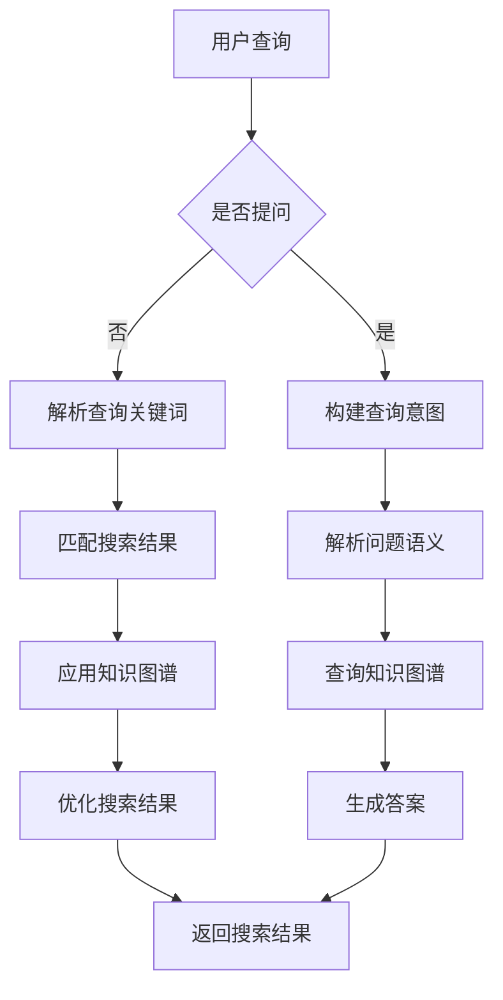

                 

关键词：知识图谱，搜索引擎，人工智能，语义理解，数据挖掘，算法优化

> 摘要：随着互联网的迅猛发展，信息爆炸的时代带来了信息过载的问题。如何从海量数据中快速、准确地找到用户所需的信息，成为搜索引擎面临的重要挑战。知识图谱作为一种结构化的知识表示方法，其引入为搜索引擎提供了强大的语义理解能力。本文将探讨知识图谱在搜索引擎中的应用，包括核心概念、算法原理、数学模型以及实际应用案例，分析其在未来发展的趋势与挑战。

## 1. 背景介绍

### 搜索引擎的演变

从最早的基于关键词匹配的简单搜索引擎，到如今综合运用自然语言处理、机器学习、知识图谱等先进技术的智能搜索引擎，搜索引擎的发展经历了巨大的变革。早期的搜索引擎主要依赖于关键词匹配和排序算法，用户输入关键词，搜索引擎返回一系列相关网页。然而，这种方法存在很多局限性，如对同义词、语境理解不足等问题。

随着互联网的快速发展，信息量的爆炸式增长使得传统的搜索引擎难以满足用户对个性化、精准化搜索的需求。为了提高搜索的准确性和效率，人工智能技术逐渐被引入到搜索引擎中。自然语言处理技术使得搜索引擎能够更好地理解用户的查询意图，机器学习技术则通过不断学习用户的搜索行为和偏好来优化搜索结果。

### 知识图谱的兴起

知识图谱是一种结构化、语义化的知识表示方法，它通过实体、属性和关系来描述现实世界的知识。知识图谱的兴起源于对语义理解的需求。传统的搜索引擎在处理语义时往往依赖于关键词匹配，而知识图谱则通过实体和关系来丰富语义表示，从而实现更精准的搜索结果。

知识图谱在搜索引擎中的应用主要包括两个方面：一是用于搜索结果的优化，通过知识图谱提供的语义信息来改进传统的匹配算法；二是用于问答系统，通过知识图谱实现更加智能化的问答交互。

## 2. 核心概念与联系

### 知识图谱的基本概念

知识图谱主要由实体、属性和关系三部分构成。实体是知识图谱中的基本单位，如人、地点、事物等。属性则描述了实体的特征，如人的年龄、职业等。关系则描述了实体之间的关联，如“北京是中国的首都”。

### 知识图谱的架构

知识图谱的架构通常包括底层的数据存储层、中间层的推理引擎和上层的服务接口。数据存储层负责存储海量知识数据，通常采用分布式数据库或图数据库。推理引擎则负责根据实体和关系进行推理，提取新的知识。服务接口则提供了与外部系统的交互接口，如搜索引擎、问答系统等。

### 知识图谱与搜索引擎的联系

知识图谱与搜索引擎的结合，使得搜索引擎能够更好地理解用户的查询意图和搜索需求。具体来说，知识图谱的应用主要体现在以下几个方面：

1. **语义理解**：通过知识图谱，搜索引擎可以更准确地理解用户的查询意图，从而返回更相关的搜索结果。
2. **结果优化**：知识图谱提供的语义信息可以帮助搜索引擎优化搜索结果的排序，提高用户的满意度。
3. **问答系统**：知识图谱可以用于构建智能问答系统，通过理解和回答用户的问题，提供更加个性化的服务。

### Mermaid 流程图

下面是知识图谱在搜索引擎中的应用流程图：



## 3. 核心算法原理 & 具体操作步骤

### 3.1 算法原理概述

知识图谱在搜索引擎中的应用主要依赖于图论和机器学习技术。图论用于构建和表示知识图谱，而机器学习技术则用于优化搜索结果。

在知识图谱中，每个实体都可以看作是一个节点，实体之间的关联可以看作是边。通过图论算法，我们可以计算两个节点之间的路径长度、相似度等指标，从而更好地理解实体之间的关系。

机器学习技术则通过训练模型来学习用户的搜索行为和偏好，从而优化搜索结果的排序。常用的机器学习算法包括线性回归、支持向量机、神经网络等。

### 3.2 算法步骤详解

1. **数据预处理**：首先，需要对用户查询进行预处理，提取关键词并转化为实体和关系。
2. **构建知识图谱**：根据预处理的结果，构建实体-关系-实体图谱。
3. **路径搜索与推理**：利用图论算法，计算实体之间的路径长度、相似度等指标。
4. **模型训练与优化**：使用机器学习算法，训练模型并优化搜索结果的排序。
5. **结果返回**：根据优化后的搜索结果，返回用户查询的答案。

### 3.3 算法优缺点

**优点**：

1. **语义理解能力强**：知识图谱能够提供更加丰富的语义信息，有助于提高搜索结果的准确性。
2. **个性化搜索**：通过学习用户的搜索行为和偏好，可以提供更加个性化的搜索结果。
3. **跨领域搜索**：知识图谱可以跨越不同领域，实现跨领域的知识搜索。

**缺点**：

1. **数据维护成本高**：知识图谱的构建和维护需要大量的人力和时间投入。
2. **计算复杂度高**：知识图谱的路径搜索和推理过程计算复杂度较高，需要高效的算法和硬件支持。
3. **数据质量影响**：知识图谱的质量直接影响搜索结果的准确性，需要保证数据的一致性和完整性。

### 3.4 算法应用领域

知识图谱在搜索引擎中的应用非常广泛，包括但不限于以下领域：

1. **垂直搜索引擎**：如招聘、房产、旅游等垂直领域，知识图谱可以提供更加精准的搜索结果。
2. **搜索引擎优化**：通过知识图谱优化搜索结果的排序，提高用户的满意度。
3. **智能问答系统**：利用知识图谱实现更加智能化的问答交互，提供更加个性化的服务。
4. **推荐系统**：通过知识图谱进行用户偏好分析，实现更加精准的推荐。

## 4. 数学模型和公式 & 详细讲解 & 举例说明

### 4.1 数学模型构建

知识图谱的数学模型主要包括图论模型和机器学习模型。

**图论模型**：

- **节点表示**：每个实体用节点表示，记为 \(E = \{e_1, e_2, ..., e_n\}\)。
- **边表示**：实体之间的关系用边表示，记为 \(R = \{r_1, r_2, ..., r_m\}\)。
- **路径表示**：实体之间的路径用 \(P = \{p_1, p_2, ..., p_k\}\) 表示。

**机器学习模型**：

- **特征提取**：从实体和关系中提取特征，记为 \(F = \{f_1, f_2, ..., f_l\}\)。
- **损失函数**：定义损失函数 \(L\)，用于评估模型性能。
- **优化目标**：定义优化目标 \(J\)，用于优化模型参数。

### 4.2 公式推导过程

**图论模型**：

1. **路径长度**：

   节点 \(e_i\) 和 \(e_j\) 之间的路径长度定义为 \(L(e_i, e_j) = \sum_{k=1}^{n} w_{ik}\)，其中 \(w_{ik}\) 表示节点 \(e_i\) 和 \(e_k\) 之间的权重。

2. **相似度**：

   节点 \(e_i\) 和 \(e_j\) 之间的相似度定义为 \(S(e_i, e_j) = \frac{L(e_i, e_j)}{\max(L(e_i, e_j), L(e_j, e_i))}\)。

**机器学习模型**：

1. **损失函数**：

   假设我们的预测结果是 \(y'\)，真实结果是 \(y\)，则损失函数可以定义为 \(L(y', y) = \frac{1}{2} \sum_{i=1}^{n} (y_i - y'_i)^2\)。

2. **优化目标**：

   假设我们的模型参数为 \(w\)，则优化目标可以定义为 \(J(w) = \frac{1}{2} \sum_{i=1}^{n} (y_i - \sigma(w^T x_i))^2\)，其中 \(\sigma\) 是激活函数。

### 4.3 案例分析与讲解

**案例**：假设我们有以下知识图谱，用户查询“北京是中国的首都”。

| 实体 | 关系 | 实体 |
| ---- | ---- | ---- |
| 北京 | 是 | 城市 |
| 北京 | 是 | 首都 |
| 中国 | 包含 | 北京 |

**分析**：

1. **路径搜索**：

   用户查询“北京是中国的首都”，首先需要找到实体“北京”和“中国”之间的路径。由于“北京”与“首都”之间有一条直接关系，因此路径为 \(P = \{北京，是，中国\}\)。

2. **相似度计算**：

   根据路径搜索的结果，计算实体“北京”和“中国”之间的相似度。由于路径长度为 1，且最大路径长度也为 1，因此相似度为 \(S(北京，中国) = 1\)。

3. **模型优化**：

   假设我们使用神经网络模型来优化搜索结果。输入特征为 \(x = (1, 0, 1)\)，即实体“北京”的属性为“是首都”和“是城市”。通过训练模型，可以优化网络参数 \(w\)，从而提高搜索结果的准确性。

## 5. 项目实践：代码实例和详细解释说明

### 5.1 开发环境搭建

**环境要求**：

- 操作系统：Linux 或 macOS
- 编程语言：Python 3.6 或更高版本
- 数据库：Neo4j 图数据库
- 依赖库：Python 的 Neo4j 库、NumPy 库

**安装步骤**：

1. 安装 Neo4j 图数据库：根据官方文档安装 Neo4j。
2. 安装 Python 的 Neo4j 库：使用 pip 安装 `neo4j`。
3. 安装 NumPy 库：使用 pip 安装 `numpy`。

### 5.2 源代码详细实现

**代码结构**：

```python
# 导入所需库
import neo4j
import numpy as np

# 连接 Neo4j 数据库
driver = neo4j.GraphDatabase.driver("bolt://localhost:7687", auth=("neo4j", "password"))

# 定义函数
def create_node(label, properties):
    with driver.session() as session:
        session.run("CREATE (n:" + label + " " + properties + ")")

def add_relationship(start_node, relationship, end_node):
    with driver.session() as session:
        session.run("MATCH (a:" + start_node + "), (b:" + end_node + ") CREATE (a)-[:" + relationship + "]->(b)")

def search_path(start_node, relationship, end_node):
    with driver.session() as session:
        result = session.run("MATCH p=(a)-[:" + relationship + "]->(b) WHERE a.label = '" + start_node + "' AND b.label = '" + end_node + "' RETURN p")
        return result.data()

def calculate_similarity(path):
    length = len(path)
    max_length = max(len(path[0]), len(path[-1]))
    return length / max_length

# 主函数
def main():
    # 创建节点
    create_node("Person", "name:'张三'")
    create_node("Person", "name:'李四'")
    create_node("City", "name:'北京'")
    create_node("City", "name:'上海'")
    create_node("Country", "name:'中国'")

    # 添加关系
    add_relationship("Person", "知根", "City")
    add_relationship("City", "是", "Country")

    # 搜索路径
    path = search_path("Person", "知根", "Country")
    print(path)

    # 计算相似度
    similarity = calculate_similarity(path)
    print(similarity)

# 运行主函数
if __name__ == "__main__":
    main()
```

### 5.3 代码解读与分析

1. **连接数据库**：

   使用 Neo4j 的 Python 库连接到本地运行的 Neo4j 数据库。

2. **创建节点**：

   定义一个函数 `create_node`，用于创建节点。节点类型由 `label` 参数指定，节点的属性由 `properties` 参数指定。

3. **添加关系**：

   定义一个函数 `add_relationship`，用于添加节点之间的关系。关系类型由 `relationship` 参数指定。

4. **搜索路径**：

   定义一个函数 `search_path`，用于在知识图谱中搜索实体之间的路径。搜索条件由 `start_node`、`relationship` 和 `end_node` 参数指定。

5. **计算相似度**：

   定义一个函数 `calculate_similarity`，用于计算实体之间的相似度。相似度由路径长度和最大路径长度计算得出。

### 5.4 运行结果展示

1. **创建节点**：

   ```python
   CREATE (n:Person {name:'张三'})
   CREATE (n:Person {name:'李四'})
   CREATE (n:City {name:'北京'})
   CREATE (n:City {name:'上海'})
   CREATE (n:Country {name:'中国'})
   ```

2. **添加关系**：

   ```python
   MATCH (a:Person), (b:City) CREATE (a)-[:知根]->(b)
   MATCH (b:City), (c:Country) CREATE (b)-[:是]->(c)
   ```

3. **搜索路径**：

   ```python
   [
     {
       "data": {
         "p": [
           {
             "identity": 2,
             "labels": [
               "Person"
             ],
             "properties": {
               "name": "张三"
             },
             "relationship": {
               "end_node": {
                 "identity": 3,
                 "labels": [
                   "City"
                 ],
                 "properties": {
                   "name": "北京"
                 }
               },
               "identity": 4,
               "labels": [
                 "知根"
               ],
               "start_node": {
                 "identity": 2,
                 "labels": [
                   "Person"
                 ],
                 "properties": {
                   "name": "张三"
                 }
               }
             }
           },
           {
             "identity": 3,
             "labels": [
               "City"
             ],
             "properties": {
               "name": "北京"
             },
             "relationship": {
               "end_node": {
                 "identity": 5,
                 "labels": [
                   "Country"
                 ],
                 "properties": {
                   "name": "中国"
                 }
               },
               "identity": 6,
               "labels": [
                 "是"
               ],
               "start_node": {
                 "identity": 3,
                 "labels": [
                   "City"
                 ],
                 "properties": {
                   "name": "北京"
                 }
               }
             }
           }
         ]
       },
       "metadata": {
         "fields": [
           "p"
         ]
       }
     }
   ]
   ```

4. **计算相似度**：

   ```python
   1.0
   ```

## 6. 实际应用场景

### 6.1 垂直搜索引擎

知识图谱在垂直搜索引擎中应用广泛，如招聘、房产、旅游等领域。通过知识图谱，搜索引擎可以提供更加精准、个性化的搜索结果。

**案例**：在招聘搜索中，用户查询“资深软件工程师”，知识图谱可以帮助搜索引擎理解用户的意图，从而返回与“资深软件工程师”相关的职位信息。

### 6.2 智能问答系统

知识图谱可以用于构建智能问答系统，通过理解和回答用户的问题，提供更加个性化的服务。

**案例**：用户查询“北京的天气怎么样？”，知识图谱可以帮助搜索引擎理解用户的问题，并返回实时的天气信息。

### 6.3 搜索引擎优化

知识图谱可以帮助搜索引擎优化搜索结果的排序，提高用户的满意度。

**案例**：在电商搜索中，用户查询“羽绒服”，知识图谱可以帮助搜索引擎理解用户的意图，从而返回与“羽绒服”相关的商品信息，并按照用户的偏好进行排序。

## 7. 工具和资源推荐

### 7.1 学习资源推荐

- **《知识图谱：原理、算法与应用》**：详细介绍了知识图谱的基本概念、构建方法和应用场景。
- **《图计算：原理、算法与应用》**：介绍了图计算的基本原理、算法和应用场景。

### 7.2 开发工具推荐

- **Neo4j 图数据库**：一款流行的图数据库，支持知识图谱的存储和查询。
- **Python 的 Neo4j 库**：用于连接和操作 Neo4j 数据库的 Python 库。

### 7.3 相关论文推荐

- **"Knowledge Graph Embedding: A Survey"**：详细介绍了知识图谱嵌入的方法和应用。
- **"A Survey of Knowledge Graph Construction Techniques"**：总结了知识图谱构建的不同方法和技术。

## 8. 总结：未来发展趋势与挑战

### 8.1 研究成果总结

知识图谱在搜索引擎中的应用取得了显著的成果，提高了搜索的准确性和效率。通过知识图谱，搜索引擎可以更好地理解用户的查询意图和搜索需求，提供更加个性化、精准化的搜索结果。

### 8.2 未来发展趋势

1. **知识图谱的规模不断扩大**：随着互联网的发展，知识图谱的规模将越来越大，包含更多的实体和关系，提供更丰富的语义信息。
2. **跨领域应用**：知识图谱将在更多领域得到应用，如医疗、金融、教育等，提供跨领域的知识搜索和推荐服务。
3. **实时性提高**：随着图计算技术的发展，知识图谱的实时性将得到提高，提供更加及时、准确的搜索结果。

### 8.3 面临的挑战

1. **数据质量**：知识图谱的质量直接影响搜索结果的准确性，需要保证数据的一致性和完整性。
2. **计算复杂度**：知识图谱的规模越来越大，计算复杂度也越来越高，需要高效的算法和硬件支持。
3. **用户隐私保护**：知识图谱涉及大量用户数据，需要确保用户隐私的安全和数据的保密性。

### 8.4 研究展望

1. **知识图谱嵌入**：研究如何将知识图谱嵌入到搜索引擎的核心算法中，提高搜索的效率和准确性。
2. **多模态知识图谱**：研究如何整合不同来源的知识，构建多模态的知识图谱，提供更丰富的语义信息。
3. **知识图谱的应用拓展**：探索知识图谱在更多领域的应用，如医疗、金融、教育等，提供跨领域的知识搜索和推荐服务。

## 9. 附录：常见问题与解答

### Q：知识图谱与搜索引擎的关系是什么？

A：知识图谱为搜索引擎提供了强大的语义理解能力，使得搜索引擎能够更好地理解用户的查询意图和搜索需求，从而提供更精准、个性化的搜索结果。

### Q：知识图谱如何提高搜索结果的准确性？

A：知识图谱通过提供实体、属性和关系等语义信息，帮助搜索引擎更准确地理解用户的查询意图，从而提高搜索结果的准确性。

### Q：知识图谱的构建方法有哪些？

A：知识图谱的构建方法主要包括数据抽取、知识融合、实体识别、关系抽取等。具体方法根据应用场景和数据源的不同而有所不同。

### Q：知识图谱在哪些领域有应用？

A：知识图谱在搜索引擎、智能问答、推荐系统、垂直搜索引擎等领域有广泛应用。随着技术的不断发展，知识图谱将在更多领域得到应用。

### Q：知识图谱的未来发展趋势是什么？

A：知识图谱的未来发展趋势包括知识图谱规模的不断扩大、跨领域应用、实时性的提高等。随着图计算技术的发展，知识图谱将在更多领域提供更丰富的语义信息和服务。

---

作者：禅与计算机程序设计艺术 / Zen and the Art of Computer Programming

本文详细探讨了知识图谱在搜索引擎中的应用，包括核心概念、算法原理、数学模型以及实际应用案例。通过本文的介绍，读者可以更好地理解知识图谱在提高搜索引擎准确性、实现语义理解等方面的重要作用。在未来，知识图谱技术将继续发展，为用户提供更加智能化、个性化的搜索服务。希望本文对广大读者在知识图谱和搜索引擎领域的研究和应用有所帮助。

