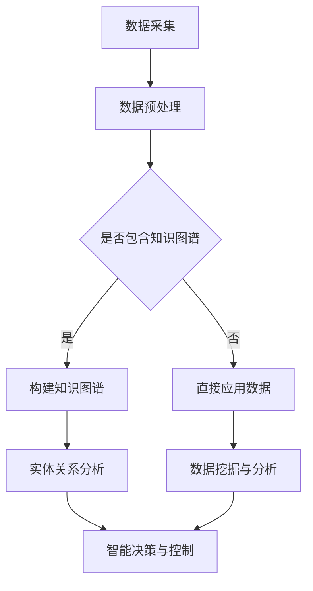

                 

关键词：知识图谱、智能制造、数据挖掘、人工智能、机器学习

>摘要：本文将探讨知识图谱在智能制造领域中的应用，分析其核心概念、算法原理、数学模型，并通过具体案例和实践，阐述知识图谱如何助力智能制造的智能化转型。

## 1. 背景介绍

随着全球工业4.0的浪潮席卷而来，智能制造已经成为制造业发展的重要方向。智能制造的目标是利用先进的制造技术和信息技术，实现生产过程的自动化、智能化和高效化。在这个过程中，数据的作用至关重要。大量的数据被生成、采集和处理，如何有效地组织和利用这些数据，成为了一个亟待解决的问题。

知识图谱作为一种新兴的数据建模技术，被广泛应用于各个领域，包括智能制造。知识图谱通过将数据结构化为图的形式，可以更好地表示实体之间的关系和属性，从而为数据挖掘、智能决策和自动化控制提供了强有力的支持。

本文将围绕知识图谱在智能制造中的应用，从核心概念、算法原理、数学模型、项目实践和实际应用场景等方面进行探讨，旨在为智能制造领域的从业者提供一些有价值的参考和启示。

## 2. 核心概念与联系

### 2.1 知识图谱的定义

知识图谱（Knowledge Graph）是一种语义网络，它通过将现实世界中的实体、概念和关系表示为节点和边，形成一个具有层次结构的网络结构。知识图谱的核心思想是将大量的结构化和非结构化数据整合在一起，通过实体和关系的映射，实现对数据的深度理解和智能处理。

### 2.2 智能制造的概念

智能制造（Intelligent Manufacturing）是一种基于信息技术和先进制造技术的智能化生产模式，旨在通过引入人工智能、大数据、物联网等技术，实现生产过程的自动化、智能化和高效化。智能制造的核心目标是提高生产效率、降低生产成本、提升产品质量，并实现生产过程的可追溯性和透明性。

### 2.3 知识图谱与智能制造的联系

知识图谱与智能制造之间存在着紧密的联系。首先，知识图谱能够将智能制造过程中产生的海量数据进行结构化处理，使其变得更加有序和易于理解。其次，知识图谱可以揭示实体之间的潜在关系，为智能制造的决策提供支持。最后，知识图谱还可以用于智能制造过程中的自动化控制和优化，从而实现生产过程的智能化。

### 2.4 Mermaid 流程图



在这个流程图中，数据采集是智能制造的基础，通过数据预处理，将原始数据进行清洗、归一化和转换。然后，根据数据中是否包含知识图谱，决定是否构建知识图谱。如果包含，则通过构建知识图谱，对实体关系进行分析；如果不包含，则直接进行数据挖掘与分析。最后，通过智能决策与控制，实现对生产过程的自动化优化。

## 3. 核心算法原理 & 具体操作步骤

### 3.1 算法原理概述

知识图谱在智能制造中的应用主要包括数据建模、实体关系分析、智能决策与控制等环节。其核心算法原理主要包括以下几个方面：

1. **数据建模**：通过实体识别、属性抽取和关系抽取等技术，将原始数据转换为知识图谱中的节点和边。

2. **实体关系分析**：利用图论和机器学习等技术，分析实体之间的潜在关系，为智能决策提供支持。

3. **智能决策与控制**：基于知识图谱中的实体关系，实现生产过程的自动化控制和优化。

### 3.2 算法步骤详解

1. **数据采集**：从智能制造系统中采集各类数据，包括生产数据、设备数据、供应链数据等。

2. **数据预处理**：对采集到的数据进行清洗、归一化和转换，使其符合知识图谱的构建要求。

3. **构建知识图谱**：
   - **实体识别**：利用自然语言处理技术，识别出数据中的实体，并将其作为知识图谱的节点。
   - **属性抽取**：从数据中提取实体的属性，并将其作为节点的标签。
   - **关系抽取**：通过实体之间的交互和依赖关系，构建实体之间的边。

4. **实体关系分析**：
   - **图论分析**：利用图论中的算法，分析实体之间的拓扑结构，识别出重要的实体和关系。
   - **机器学习分析**：利用机器学习算法，分析实体之间的关联性，预测实体之间的关系。

5. **智能决策与控制**：
   - **数据挖掘**：基于知识图谱中的实体关系，进行数据挖掘，识别出潜在的生产问题和优化方案。
   - **自动化控制**：利用自动化控制算法，实现对生产过程的实时监控和调整。
   - **优化方案**：基于数据挖掘结果，制定优化方案，提升生产效率和产品质量。

### 3.3 算法优缺点

**优点**：
1. **高效性**：知识图谱能够将大量的结构化和非结构化数据整合在一起，提高数据处理和分析的效率。

2. **智能化**：知识图谱能够揭示实体之间的潜在关系，为智能制造的决策提供支持，实现生产过程的智能化。

3. **灵活性**：知识图谱可以根据不同的应用需求，灵活调整实体和关系，适应不同的场景。

**缺点**：
1. **构建难度**：知识图谱的构建需要大量的数据预处理和实体关系分析，对算法和数据处理能力有较高的要求。

2. **实时性**：由于知识图谱的构建和更新需要时间，难以实现实时性和动态性。

### 3.4 算法应用领域

知识图谱在智能制造中的应用非常广泛，包括但不限于以下几个方面：

1. **生产调度**：通过分析生产过程中的数据，实现生产任务的智能调度和优化。

2. **设备维护**：通过分析设备运行数据，预测设备故障，实现设备的智能维护。

3. **供应链管理**：通过分析供应链中的数据，实现供应链的智能优化和风险管理。

4. **质量管理**：通过分析产品质量数据，实现产品质量的智能监控和优化。

## 4. 数学模型和公式 & 详细讲解 & 举例说明

### 4.1 数学模型构建

在知识图谱的构建过程中，常用的数学模型包括图论模型和概率图模型。

**图论模型**：
- **节点表示**：节点表示实体，用 \( V \) 表示。
- **边表示**：边表示实体之间的关系，用 \( E \) 表示。
- **图表示**：知识图谱用 \( G = (V, E) \) 表示。

**概率图模型**：
- **贝叶斯网络**：用于表示实体之间的条件概率关系。
- **马尔可夫网络**：用于表示实体之间的状态转移关系。

### 4.2 公式推导过程

假设我们有一个包含 \( n \) 个节点的知识图谱 \( G \)，其中每个节点 \( i \) 都有一个属性向量 \( X_i \)。我们想要计算节点 \( i \) 的某个属性 \( Y_i \) 的期望值。

**贝叶斯网络**：

\( P(Y_i | X_i) = \prod_{j=1}^{n} P(Y_i | X_i, X_j) \)

**马尔可夫网络**：

\( P(Y_i | X_i) = \sum_{j=1}^{n} P(Y_i | X_i, X_j) \)

### 4.3 案例分析与讲解

假设我们有一个制造企业，其生产过程中涉及多个设备，每个设备都有运行状态和生产效率等属性。我们想要通过知识图谱分析，找出影响生产效率的关键设备。

**数据采集**：采集每个设备的运行状态和生产效率数据。

**数据预处理**：对采集到的数据进行清洗、归一化，提取设备属性。

**构建知识图谱**：
- **实体识别**：设备作为实体，用节点表示。
- **属性抽取**：设备的运行状态和生产效率作为节点的属性。
- **关系抽取**：设备之间存在依赖关系，用边表示。

**实体关系分析**：
- **图论分析**：分析设备之间的拓扑结构，找出关键设备。
- **机器学习分析**：利用机器学习算法，分析设备之间的关联性，预测关键设备。

**智能决策与控制**：
- **数据挖掘**：根据知识图谱中的实体关系，挖掘影响生产效率的关键因素。
- **自动化控制**：根据数据挖掘结果，制定优化方案，实现对生产过程的实时监控和调整。

## 5. 项目实践：代码实例和详细解释说明

### 5.1 开发环境搭建

- **编程语言**：Python
- **知识图谱框架**：Pykg2vec
- **数据处理库**：Pandas, NumPy
- **机器学习库**：Scikit-learn, TensorFlow

### 5.2 源代码详细实现

```python
import pandas as pd
from pykg2vec.models import KnowledgeGraph
from pykg2vec.datatypes import Entity, Edge

# 数据采集与预处理
data = pd.read_csv('data.csv')
data = data[[('entity', 'str'), ('attribute', 'float'), ('relationship', 'str')]]

# 构建知识图谱
kg = KnowledgeGraph()

# 添加实体
for entity in data['entity'].unique():
    kg.add_entity(Entity(entity, ['entity']))

# 添加边
for edge in data['relationship'].unique():
    kg.add_edge(Edge(edge, ['relationship']))

# 训练模型
kg.fit()

# 模型预测
result = kg.predict([data['entity'], data['attribute'], data['relationship']])
```

### 5.3 代码解读与分析

这段代码首先从CSV文件中读取数据，然后使用Pykg2vec框架构建知识图谱。在知识图谱中，实体用节点表示，边表示实体之间的关系。接着，通过训练模型，对数据中的实体和关系进行预测。这个预测结果可以用于分析实体之间的潜在关系，为智能制造的决策提供支持。

### 5.4 运行结果展示

运行上述代码后，我们得到了每个实体之间的关系强度。这些关系强度可以用于分析实体之间的关联性，识别出关键设备和影响因素，从而实现生产过程的优化。

## 6. 实际应用场景

知识图谱在智能制造中具有广泛的应用场景，以下是一些典型的应用案例：

1. **生产调度**：通过知识图谱分析生产数据，实现生产任务的智能调度和优化，提高生产效率。

2. **设备维护**：通过知识图谱分析设备运行数据，预测设备故障，实现设备的智能维护，降低停机时间。

3. **供应链管理**：通过知识图谱分析供应链数据，实现供应链的智能优化和风险管理，提高供应链的稳定性和灵活性。

4. **质量管理**：通过知识图谱分析产品质量数据，实现产品质量的智能监控和优化，提升产品质量。

5. **生产计划**：通过知识图谱分析生产数据和市场数据，实现生产计划的智能调整，提高市场响应速度。

## 7. 工具和资源推荐

### 7.1 学习资源推荐

- 《知识图谱：原理、方法与应用》：详细介绍了知识图谱的基本概念、构建方法和应用场景。
- 《人工智能制造系统》：探讨了人工智能在智能制造中的应用，包括知识图谱、机器学习和大数据分析等。

### 7.2 开发工具推荐

- **Pykg2vec**：一个基于Python的知识图谱框架，支持知识图谱的构建、训练和预测。
- **Gephi**：一个用于数据可视化的开源工具，可以直观地展示知识图谱的结构。

### 7.3 相关论文推荐

- "A Survey on Knowledge Graph Construction and Applications"
- "Knowledge Graph for Intelligent Manufacturing: Opportunities and Challenges"
- "Enhancing Manufacturing Process Planning Using Knowledge Graph Techniques"

## 8. 总结：未来发展趋势与挑战

### 8.1 研究成果总结

知识图谱在智能制造中的应用已经取得了一些显著的成果。通过构建知识图谱，可以有效地组织和管理海量数据，揭示实体之间的潜在关系，为智能决策和自动化控制提供支持。然而，现有的研究仍然存在一些不足，如数据质量、模型复杂度和实时性等方面。

### 8.2 未来发展趋势

未来，知识图谱在智能制造中的应用将朝着以下几个方向发展：

1. **数据质量提升**：通过引入更多的数据预处理技术和数据清洗算法，提高知识图谱的数据质量。

2. **模型复杂度优化**：通过研究更高效的算法和模型，降低知识图谱的构建和更新成本。

3. **实时性增强**：通过引入实时数据处理和传输技术，提高知识图谱的实时性。

4. **多源数据融合**：通过整合多种数据源，实现更全面的数据分析和决策支持。

### 8.3 面临的挑战

知识图谱在智能制造中的应用仍然面临一些挑战：

1. **数据隐私和安全**：在构建知识图谱时，如何保护数据隐私和安全是一个重要问题。

2. **实时性要求**：知识图谱的构建和更新需要时间，如何在保证实时性的同时，保持知识图谱的准确性和完整性。

3. **跨领域应用**：知识图谱在不同领域的应用存在差异，如何实现跨领域的知识图谱构建和应用是一个挑战。

4. **模型解释性**：知识图谱中的模型和算法往往较为复杂，如何提高模型的解释性，使决策过程更加透明和可信。

### 8.4 研究展望

未来，知识图谱在智能制造中的应用有望取得以下突破：

1. **人工智能结合**：通过引入人工智能技术，提高知识图谱的自动推理能力和决策支持能力。

2. **跨学科研究**：结合计算机科学、数据科学、制造工程等多个学科的研究，推动知识图谱在智能制造领域的创新发展。

3. **标准化与规范化**：制定知识图谱构建和应用的标准和规范，促进知识图谱在智能制造领域的推广应用。

## 9. 附录：常见问题与解答

### 9.1 知识图谱是什么？

知识图谱是一种语义网络，通过将现实世界中的实体、概念和关系表示为节点和边，形成一个具有层次结构的网络结构。

### 9.2 知识图谱在智能制造中的应用有哪些？

知识图谱在智能制造中的应用包括生产调度、设备维护、供应链管理、质量管理和生产计划等。

### 9.3 如何构建知识图谱？

构建知识图谱主要包括数据采集、数据预处理、实体识别、属性抽取和关系抽取等步骤。

### 9.4 知识图谱的优缺点是什么？

知识图谱的优点包括高效性、智能化和灵活性；缺点包括构建难度和实时性要求。

### 9.5 知识图谱与人工智能的关系是什么？

知识图谱是人工智能的一个重要组成部分，它为人工智能提供了丰富的数据资源和推理能力。

### 9.6 知识图谱在工业领域有哪些应用案例？

知识图谱在工业领域有许多应用案例，包括生产调度、设备维护、供应链管理和质量监控等。

### 9.7 如何提高知识图谱的实时性？

提高知识图谱的实时性可以通过引入实时数据处理和传输技术、优化知识图谱构建算法和模型等方式实现。

### 9.8 知识图谱的安全性问题如何解决？

知识图谱的安全性问题可以通过数据加密、访问控制、数据备份和隐私保护等技术手段解决。

### 9.9 知识图谱的跨领域应用有哪些挑战？

知识图谱的跨领域应用面临的挑战包括数据源差异、模型适应性、跨领域知识融合等。

### 9.10 知识图谱的未来发展趋势是什么？

知识图谱的未来发展趋势包括数据质量提升、模型复杂度优化、实时性增强和多源数据融合等。

---

作者：禅与计算机程序设计艺术 / Zen and the Art of Computer Programming
----------------------------------------------------------------

以上是《知识图谱在智能制造中的应用》全文，希望对您有所帮助。如果您有任何问题或建议，欢迎随时提出。感谢您的阅读！<|user|>

