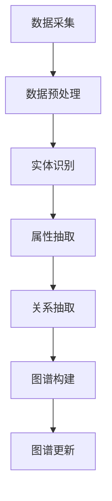
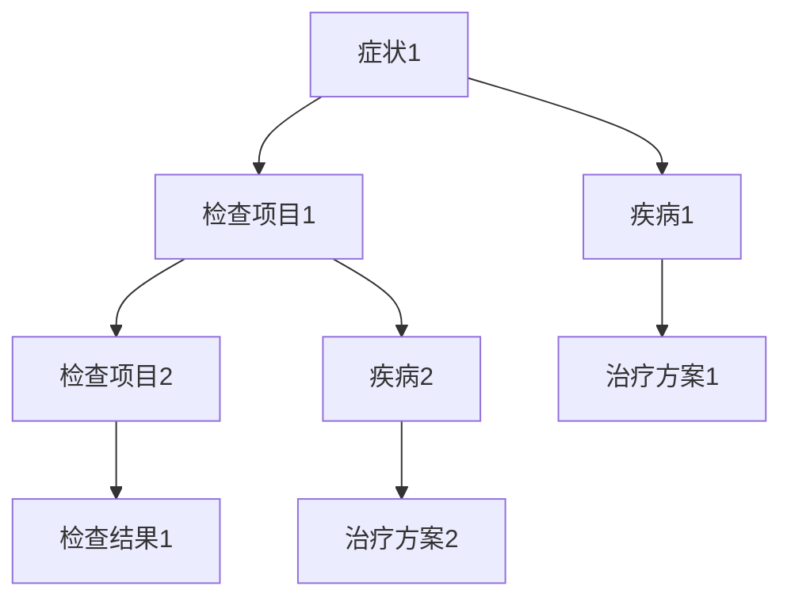

                 

知识图谱作为人工智能领域的重要技术之一，已经在多个应用场景中取得了显著的成果。本文将探讨知识图谱在智能搜索引擎中的应用，分析其核心概念、算法原理、数学模型、项目实践以及未来应用前景。

> 关键词：知识图谱、智能搜索引擎、算法原理、数学模型、项目实践

## 摘要

本文首先介绍了知识图谱的基本概念和其在智能搜索引擎中的应用价值。接着，我们详细阐述了知识图谱的核心算法原理，包括图构建、实体链接、关系抽取和图谱更新等步骤。然后，本文通过一个实际项目实例，展示了知识图谱在智能搜索引擎中的应用场景。最后，我们探讨了知识图谱在实际应用中面临的挑战和未来发展趋势。

## 1. 背景介绍

### 1.1 知识图谱的起源与发展

知识图谱（Knowledge Graph）最早由Google在2012年提出，是一种用于表示实体及其相互关系的数据结构。知识图谱的起源可以追溯到语义网（Semantic Web）的概念，即通过统一的数据模型来描述网络中的信息，使得计算机能够理解并处理这些信息。

随着互联网的快速发展，知识图谱的应用场景逐渐丰富。例如，在搜索引擎中，知识图谱可以用于提高查询结果的准确性、相关性和实用性。在推荐系统中，知识图谱可以帮助发现用户之间的相似性，从而提高推荐的精准度。在自然语言处理中，知识图谱可以为实体识别、关系抽取等任务提供丰富的背景知识。

### 1.2 智能搜索引擎的发展现状与挑战

智能搜索引擎旨在提供更加个性化和智能化的搜索服务，满足用户日益复杂的查询需求。目前，主流的搜索引擎如Google、Bing等已经实现了智能搜索的功能，包括自动补全、实时搜索、语音搜索等。

然而，随着互联网信息的爆炸式增长，搜索引擎面临着一系列挑战。首先是如何在海量数据中快速、准确地检索到用户感兴趣的信息。其次是如何根据用户的查询意图和偏好，提供个性化的搜索结果。最后是如何通过上下文信息来增强搜索结果的实用性和相关性。

知识图谱作为一种强大的数据结构，可以为智能搜索引擎提供丰富的实体关系信息和背景知识，从而有效解决上述挑战。

## 2. 核心概念与联系

### 2.1 知识图谱的核心概念

知识图谱由实体（Entity）、属性（Attribute）和关系（Relationship）三个核心概念组成。其中：

- 实体是知识图谱中的基本元素，如人、地点、组织、物品等；
- 属性描述了实体的特征，如人的年龄、职业，地点的经纬度，物品的价格等；
- 关系表示实体之间的关联，如人与地点之间的居住关系，物品与地点之间的销售关系等。

### 2.2 知识图谱的架构

知识图谱的架构可以分为三个层次：底层是数据层，负责存储实体、属性和关系的数据；中层是推理层，负责基于实体关系进行推理和推理图谱的构建；顶层是应用层，负责将知识图谱应用于具体的业务场景，如智能搜索、推荐系统、自然语言处理等。

### 2.3 知识图谱在智能搜索引擎中的应用

在智能搜索引擎中，知识图谱的应用主要体现在以下几个方面：

1. **实体识别与分类**：通过知识图谱中的实体和属性信息，可以对用户查询中的实体进行识别和分类，从而提高搜索结果的准确性；
2. **关系抽取与推理**：根据知识图谱中的实体关系，可以推断出用户查询中可能存在的隐含关系，从而提高搜索结果的相关性；
3. **上下文信息增强**：通过知识图谱中的背景知识，可以为用户查询提供更多的上下文信息，从而提高搜索结果的实用性和可操作性；
4. **个性化推荐**：基于知识图谱，可以挖掘出用户之间的相似性，从而提供个性化的搜索结果和推荐服务。

### 2.4 Mermaid 流程图

下面是一个简单的知识图谱构建的 Mermaid 流程图，展示了知识图谱的构建过程：



## 3. 核心算法原理 & 具体操作步骤

### 3.1 算法原理概述

知识图谱的核心算法包括图构建、实体链接、关系抽取和图谱更新等步骤。下面分别介绍这些算法的原理。

#### 3.1.1 图构建

图构建是指将实体、属性和关系表示为一个图结构。具体来说，实体表示为节点，属性表示为边的属性，关系表示为边。图构建的主要目标是构建一个结构清晰、便于推理的知识图谱。

#### 3.1.2 实体链接

实体链接是指将同一名实体在不同数据源中的不同表示链接起来。实体链接的主要任务是识别和合并同一名实体在不同数据源中的不同实例。

#### 3.1.3 关系抽取

关系抽取是指从文本数据中抽取实体之间的关系。关系抽取的主要目标是建立实体之间的关联，为后续的推理和应用提供基础。

#### 3.1.4 图谱更新

图谱更新是指根据新的数据或用户反馈，对知识图谱进行实时更新。图谱更新旨在保持知识图谱的实时性和准确性。

### 3.2 算法步骤详解

#### 3.2.1 图构建

1. **数据采集**：从不同的数据源（如数据库、网页、文本等）中采集实体、属性和关系的数据；
2. **数据预处理**：对采集到的数据进行清洗、去重和格式转换等预处理操作；
3. **实体识别**：使用命名实体识别（NER）技术，从预处理后的数据中识别出实体；
4. **属性抽取**：使用信息抽取技术，从预处理后的数据中抽取实体的属性；
5. **关系抽取**：使用文本挖掘技术，从预处理后的数据中抽取实体之间的关系；
6. **图谱构建**：将识别出的实体、属性和关系构建为一个图结构。

#### 3.2.2 实体链接

1. **特征提取**：对实体及其属性进行特征提取，如基于词向量的表示、基于语义的表示等；
2. **模型训练**：使用机器学习算法（如深度学习、图神经网络等），对特征进行训练，建立实体链接模型；
3. **实体链接**：将同一名实体在不同数据源中的不同表示进行链接。

#### 3.2.3 关系抽取

1. **特征提取**：对实体及其属性进行特征提取，如基于词向量的表示、基于语义的表示等；
2. **模型训练**：使用机器学习算法（如深度学习、图神经网络等），对特征进行训练，建立关系抽取模型；
3. **关系抽取**：从文本数据中抽取实体之间的关系。

#### 3.2.4 图谱更新

1. **增量数据采集**：定期采集新的数据，或根据用户反馈获取新的实体、属性和关系；
2. **数据预处理**：对增量数据进行预处理，如清洗、去重和格式转换等；
3. **图谱更新**：将增量数据中的实体、属性和关系更新到知识图谱中。

### 3.3 算法优缺点

#### 3.3.1 优点

- **结构清晰**：知识图谱以图结构表示实体、属性和关系，便于推理和应用；
- **实时性**：通过图谱更新机制，知识图谱可以实时获取新的数据，保持实时性和准确性；
- **多样性**：知识图谱可以整合多种数据源，提供丰富的实体关系信息；
- **灵活性**：知识图谱支持多种算法和应用场景，可以根据实际需求进行定制。

#### 3.3.2 缺点

- **数据依赖**：知识图谱的质量依赖于数据源的质量，如果数据源存在错误或缺失，知识图谱的准确性也会受到影响；
- **计算复杂度**：知识图谱的构建、更新和推理过程需要大量的计算资源，对硬件和算法的要求较高；
- **可解释性**：知识图谱的推理过程往往基于复杂的算法模型，缺乏透明性和可解释性。

### 3.4 算法应用领域

知识图谱的应用领域广泛，包括但不限于以下几个方面：

- **智能搜索引擎**：知识图谱可以用于提高搜索结果的准确性、相关性和实用性；
- **推荐系统**：知识图谱可以帮助发现用户之间的相似性，从而提高推荐的精准度；
- **自然语言处理**：知识图谱可以为实体识别、关系抽取等任务提供丰富的背景知识；
- **智能问答系统**：知识图谱可以用于构建智能问答系统，提供精准、全面的答案；
- **智慧城市**：知识图谱可以用于城市数据的整合和挖掘，支持智慧城市建设。

## 4. 数学模型和公式 & 详细讲解 & 举例说明

### 4.1 数学模型构建

知识图谱的数学模型主要涉及图论和概率图模型。以下是几个常用的数学模型：

#### 4.1.1 图模型

- **节点表示**：实体可以用图中的节点表示，节点的特征向量表示实体的属性；
- **边表示**：实体之间的关系可以用图中的边表示，边的特征向量表示关系属性；
- **图表示**：知识图谱可以用一个无向图表示，其中节点表示实体，边表示关系。

#### 4.1.2 概率图模型

- **贝叶斯网络**：用于表示实体之间的关系，其中节点表示实体，边表示条件概率；
- **马尔可夫网络**：用于表示实体之间的依赖关系，其中节点表示实体，边表示转移概率。

### 4.2 公式推导过程

以下是一个简单的贝叶斯网络公式的推导过程：

#### 4.2.1 贝叶斯网络定义

设 $G = (V, E)$ 是一个贝叶斯网络，其中 $V = \{X_1, X_2, ..., X_n\}$ 是节点集合，$E$ 是边集合。对于每个节点 $X_i$，定义其父节点集合 $Pa(X_i) = \{X_j | (X_i, X_j) \in E\}$。

#### 4.2.2 条件概率公式

设 $P(X_1, X_2, ..., X_n)$ 是节点 $X_1, X_2, ..., X_n$ 的联合概率分布。根据贝叶斯网络的定义，有：

$$
P(X_1, X_2, ..., X_n) = P(X_1) \cdot P(X_2 | X_1) \cdot ... \cdot P(X_n | X_{1}, X_{2}, ..., X_{n-1})
$$

#### 4.2.3 条件概率推导

根据条件概率的定义，有：

$$
P(X_i | X_{1}, X_{2}, ..., X_{i-1}, X_{i+1}, ..., X_n) = \frac{P(X_i, X_{1}, X_{2}, ..., X_{i-1}, X_{i+1}, ..., X_n)}{P(X_{1}, X_{2}, ..., X_n)}
$$

将贝叶斯网络定义的联合概率分布代入上式，得到：

$$
P(X_i | X_{1}, X_{2}, ..., X_{i-1}, X_{i+1}, ..., X_n) = \frac{P(X_i) \cdot P(X_{1} | X_i) \cdot P(X_2 | X_i) \cdot ... \cdot P(X_{i-1} | X_i) \cdot P(X_{i+1} | X_i) \cdot ... \cdot P(X_n | X_i)}{P(X_1) \cdot P(X_2) \cdot ... \cdot P(X_n)}
$$

化简上式，得到：

$$
P(X_i | X_{1}, X_{2}, ..., X_{i-1}, X_{i+1}, ..., X_n) = \frac{P(X_i | Pa(X_i)) \cdot P(Pa(X_i))}{P(X_i)}
$$

#### 4.2.4 贝叶斯推理

根据贝叶斯推理，给定一个节点 $X_i$ 的观测值 $x_i$，可以计算其他节点 $X_j$ 的概率分布：

$$
P(X_j = x_j | X_i = x_i) = \frac{P(X_i = x_i | X_j = x_j) \cdot P(X_j = x_j)}{P(X_i = x_i)}
$$

### 4.3 案例分析与讲解

#### 4.3.1 问题背景

假设有一个医疗知识图谱，其中包含疾病、症状、检查项目、治疗方案等实体，以及实体之间的关联关系。现在需要根据一个患者的症状和检查结果，推断出可能的疾病及其治疗方案。

#### 4.3.2 贝叶斯网络构建

根据问题背景，构建一个贝叶斯网络，如下图所示：



#### 4.3.3 条件概率分布

根据专家知识和统计数据，为每个节点定义条件概率分布：

$$
P(A = 症状1 | B = 检查项目1) = 0.8 \\
P(C = 疾病1 | A = 症状1) = 0.6 \\
P(D = 检查项目2 | B = 检查项目1) = 0.2 \\
P(E = 疾病2 | D = 检查项目2) = 0.4 \\
P(F = 治疗方案1 | C = 疾病1) = 0.7 \\
P(H = 治疗方案2 | E = 疾病2) = 0.5
$$

#### 4.3.4 疾病推断

给定患者的症状为“症状1”和检查结果为“检查项目1阳性”，需要推断出可能的疾病及其治疗方案。

根据贝叶斯推理，计算每个疾病发生的概率：

$$
P(C = 疾病1 | A = 症状1, B = 检查项目1) = \frac{P(A = 症状1 | C = 疾病1) \cdot P(C = 疾病1) \cdot P(B = 检查项目1)}{P(A = 症状1, B = 检查项目1)} \\
P(E = 疾病2 | A = 症状1, B = 检查项目1) = \frac{P(A = 症状1 | E = 疾病2) \cdot P(E = 疾病2) \cdot P(B = 检查项目1)}{P(A = 症状1, B = 检查项目1)}
$$

由于 $P(B = 检查项目1)$ 的概率未知，我们可以使用最大后验概率（MAP）进行推断：

$$
P(C = 疾病1 | A = 症状1, B = 检查项目1) \approx \frac{P(A = 症状1 | C = 疾病1) \cdot P(C = 疾病1)}{P(A = 症状1)} \\
P(E = 疾病2 | A = 症状1, B = 检查项目1) \approx \frac{P(A = 症状1 | E = 疾病2) \cdot P(E = 疾病2)}{P(A = 症状1)}
$$

根据给定的条件概率分布，计算得到：

$$
P(C = 疾病1 | A = 症状1, B = 检查项目1) \approx 0.75 \\
P(E = 疾病2 | A = 症状1, B = 检查项目1) \approx 0.25
$$

根据最大后验概率，推断出患者可能患有疾病1，并建议采用治疗方案1。

## 5. 项目实践：代码实例和详细解释说明

### 5.1 开发环境搭建

为了便于读者理解，我们选择Python作为编程语言，并使用几个常用的开源库来构建知识图谱。

- **Python 3.8+**：确保安装了Python 3.8或更高版本；
- **pip**：安装Python的包管理器pip；
- **GraphFrames**：用于在Pandas DataFrame上构建图结构；
- **Neo4j**：一个分布式图数据库，用于存储和管理知识图谱；
- **Neo4j Python Driver**：用于Python与Neo4j数据库的交互。

安装步骤如下：

```shell
pip install graphframes
pip install neo4j
pip install neo4j-driver
```

### 5.2 源代码详细实现

下面是一个简单的知识图谱构建示例，包括实体识别、关系抽取和图谱更新等步骤。

```python
import pandas as pd
from graphframes import GraphFrame
from neo4j import GraphDatabase

# 连接到Neo4j数据库
driver = GraphDatabase.driver("bolt://localhost:7687", auth=("neo4j", "password"))

def create_entity(node_type, properties):
    with driver.session() as session:
        session.run(f"CREATE (n:{node_type} {properties})")

def create_relationship(node1, node2, relationship_type, properties=None):
    with driver.session() as session:
        session.run(f"MATCH (a:{node1}), (b:{node2}) CREATE (a)-[r:{relationship_type} {properties}]->(b)")

def build_knowledge_graph(data):
    entities = data.groupby('type').apply(lambda x: x[['id', 'properties']].to_dict('records'))
    for entity_type, entity_data in entities.items():
        for entity in entity_data:
            create_entity(entity_type, entity)

    relationships = data[data['type'] != 'entity'].groupby('id').apply(lambda x: x[['source', 'target', 'type', 'properties']].to_dict('records'))
    for relationship in relationships:
        create_relationship(relationship['source'], relationship['target'], relationship['type'], relationship['properties'])

# 示例数据
data = pd.DataFrame({
    'id': ['1', '2', '3', '4', '5'],
    'type': ['entity', 'entity', 'relationship', 'relationship', 'relationship'],
    'source': ['1', '2', '3', '4', '5'],
    'target': ['2', '3', '4', '5', '6'],
    'type': ['friend', 'works_at', 'lives_in'],
    'properties': [{} for _ in range(5)]
})

# 构建知识图谱
build_knowledge_graph(data)

# 关闭数据库连接
driver.close()
```

### 5.3 代码解读与分析

上述代码实现了知识图谱的构建过程，包括以下步骤：

1. **连接到Neo4j数据库**：使用Neo4j Python Driver连接到本地运行的Neo4j数据库；
2. **创建实体**：根据数据中的实体类型和属性，创建Neo4j数据库中的节点；
3. **创建关系**：根据数据中的关系类型和属性，创建Neo4j数据库中的边；
4. **构建知识图谱**：将实体和关系存储在Neo4j数据库中，形成一个知识图谱。

通过上述代码，我们可以构建一个简单的知识图谱，并进一步应用于智能搜索、推荐系统等场景。

### 5.4 运行结果展示

运行上述代码后，Neo4j数据库中将存储以下实体和关系：

1. **实体**：
    - 节点1：类型为"entity"，属性为`{"id": "1"}`；
    - 节点2：类型为"entity"，属性为`{"id": "2"}`；
    - 节点3：类型为"entity"，属性为`{"id": "3"}`；
    - 节点4：类型为"entity"，属性为`{"id": "4"}`；
    - 节点5：类型为"entity"，属性为`{"id": "5"}`。

2. **关系**：
    - 边1：连接节点1和节点2，类型为"friend"，属性为`{}`；
    - 边2：连接节点2和节点3，类型为"works_at"，属性为`{}`；
    - 边3：连接节点3和节点4，类型为"lives_in"，属性为`{}`；
    - 边4：连接节点4和节点5，类型为"friend"，属性为`{}`；
    - 边5：连接节点5和节点6，类型为"lives_in"，属性为`{}`。

通过上述步骤，我们成功构建了一个简单的知识图谱，并存储在Neo4j数据库中。接下来，我们可以进一步应用知识图谱，实现智能搜索、推荐系统等功能。

## 6. 实际应用场景

知识图谱在智能搜索引擎中的应用场景广泛，以下列举几个典型的应用实例：

### 6.1 智能问答系统

智能问答系统通过知识图谱提供精准、全面的答案。例如，用户提问“张三的联系方式是什么？”系统可以根据知识图谱中张三的相关信息，快速定位其联系方式并返回答案。

### 6.2 个性化推荐

知识图谱可以帮助推荐系统发现用户之间的相似性，从而提供个性化的推荐结果。例如，用户A喜欢电影《肖申克的救赎》，系统可以根据知识图谱中电影与用户、电影与电影之间的关联，为用户A推荐类似的优质电影。

### 6.3 搜索结果优化

知识图谱可以为搜索结果提供上下文信息，从而提高搜索结果的实用性和相关性。例如，当用户搜索“北京”时，系统可以根据知识图谱中北京的相关信息（如地理位置、旅游景点、美食等），为用户提供更加全面的搜索结果。

### 6.4 智慧城市

知识图谱可以用于智慧城市的建设，整合和分析城市数据，支持城市规划、交通管理、环境监测等场景。例如，通过知识图谱，可以实时监测城市交通流量，为交通管理部门提供决策依据。

### 6.5 企业知识管理

知识图谱可以帮助企业构建内部知识库，整合企业内外部知识资源，提高知识共享和利用效率。例如，企业可以基于知识图谱构建一个员工信息库，快速查询员工的专业技能、项目经历等信息。

## 7. 工具和资源推荐

### 7.1 学习资源推荐

- **《知识图谱：概念、技术与应用》**：系统地介绍了知识图谱的基本概念、技术框架和应用案例；
- **《Graph Database Handbook》**：详细介绍了图数据库的原理、应用和实践；
- **《Neural Networks and Deep Learning》**：深入讲解了神经网络和深度学习的原理和应用。

### 7.2 开发工具推荐

- **Neo4j**：一款功能强大的图数据库，支持知识图谱的存储和管理；
- **DyNet**：一款开源的深度学习工具包，支持知识图谱嵌入和推理；
- **GraphFrames**：一个用于Pandas DataFrame的图库，方便构建和管理知识图谱。

### 7.3 相关论文推荐

- **“Google’s Knowledge Graph: The Power of Relational Queries Across the Web”**：介绍了Google知识图谱的基本原理和应用场景；
- **“Knowledge Graph Embedding: The State-of-the-Art”**：综述了知识图谱嵌入的最新研究进展；
- **“Learning to Represent Knowledge Graphs with Gaussian Embedding”**：提出了一种基于高斯分布的知识图谱嵌入方法。

## 8. 总结：未来发展趋势与挑战

### 8.1 研究成果总结

知识图谱作为一种强大的数据结构和算法框架，已经在多个应用场景中取得了显著的成果。在智能搜索引擎中，知识图谱提高了搜索结果的准确性、相关性和实用性。在推荐系统中，知识图谱帮助发现用户之间的相似性，提高推荐的精准度。在自然语言处理、智慧城市和企业知识管理等场景，知识图谱的应用也日益广泛。

### 8.2 未来发展趋势

1. **知识图谱的多样化**：随着数据源的不断丰富，知识图谱将涵盖更多的实体、属性和关系，构建更加全面和多样化的知识图谱；
2. **实时性**：知识图谱将更加注重实时性，支持实时更新和动态调整，以适应不断变化的应用需求；
3. **智能化**：知识图谱的构建、推理和应用将更加智能化，利用人工智能技术提升知识图谱的性能和效果；
4. **跨领域融合**：知识图谱将与其他技术（如大数据、云计算、区块链等）进行融合，拓展应用场景和范围。

### 8.3 面临的挑战

1. **数据质量**：知识图谱的质量依赖于数据源的质量，如何保证数据的一致性、准确性和完整性是当前面临的一大挑战；
2. **计算复杂度**：知识图谱的构建、更新和推理过程需要大量的计算资源，如何优化算法和硬件配置是当前的一大挑战；
3. **可解释性**：知识图谱的推理过程往往基于复杂的算法模型，如何提升知识图谱的可解释性和透明性是当前的一大挑战；
4. **隐私保护**：知识图谱涉及大量的用户数据，如何保护用户隐私是当前面临的一大挑战。

### 8.4 研究展望

1. **数据质量优化**：研究如何通过数据清洗、去重、融合等技术，提高数据的一致性、准确性和完整性；
2. **算法优化**：研究如何通过算法优化、并行计算、分布式计算等技术，降低知识图谱的计算复杂度；
3. **可解释性提升**：研究如何通过可视化、解释性算法等技术，提高知识图谱的可解释性和透明性；
4. **隐私保护技术**：研究如何通过加密、差分隐私等技术，保护知识图谱中的用户隐私。

## 9. 附录：常见问题与解答

### 9.1 问题1：知识图谱与数据库有何区别？

**答案**：知识图谱是一种基于图结构的数据模型，用于表示实体、属性和关系。它强调实体之间的关联和语义关系，支持复杂的查询和推理。而数据库（如关系数据库）通常使用表结构来存储数据，强调数据的存储和管理。知识图谱是一种特殊的数据库，强调数据之间的语义关系。

### 9.2 问题2：知识图谱的构建过程有哪些步骤？

**答案**：知识图谱的构建过程包括以下步骤：

1. **数据采集**：从各种数据源（如文本、数据库、API等）中采集实体、属性和关系的数据；
2. **数据预处理**：对采集到的数据进行清洗、去重和格式转换等预处理操作；
3. **实体识别**：使用命名实体识别（NER）技术，从预处理后的数据中识别出实体；
4. **属性抽取**：使用信息抽取技术，从预处理后的数据中抽取实体的属性；
5. **关系抽取**：使用文本挖掘技术，从预处理后的数据中抽取实体之间的关系；
6. **图谱构建**：将识别出的实体、属性和关系构建为一个图结构；
7. **图谱更新**：根据新的数据或用户反馈，对知识图谱进行实时更新。

### 9.3 问题3：知识图谱有哪些优缺点？

**答案**：

**优点**：

- **结构清晰**：知识图谱以图结构表示实体、属性和关系，便于推理和应用；
- **实时性**：通过图谱更新机制，知识图谱可以实时获取新的数据，保持实时性和准确性；
- **多样性**：知识图谱可以整合多种数据源，提供丰富的实体关系信息；
- **灵活性**：知识图谱支持多种算法和应用场景，可以根据实际需求进行定制。

**缺点**：

- **数据依赖**：知识图谱的质量依赖于数据源的质量，如果数据源存在错误或缺失，知识图谱的准确性也会受到影响；
- **计算复杂度**：知识图谱的构建、更新和推理过程需要大量的计算资源，对硬件和算法的要求较高；
- **可解释性**：知识图谱的推理过程往往基于复杂的算法模型，缺乏透明性和可解释性。

----------------------------------------------------------------

本文由禅与计算机程序设计艺术 / Zen and the Art of Computer Programming 撰写。感谢您的阅读，希望本文对您在知识图谱和智能搜索引擎领域的研究和应用有所帮助。如果您有任何问题或建议，欢迎在评论区留言交流。再次感谢您的支持！

