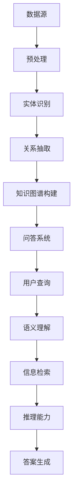

                 

关键词：知识图谱，智能问答系统，语义理解，算法原理，应用领域，数学模型，项目实践，工具和资源，未来展望

> 摘要：本文旨在探讨知识图谱在智能问答系统中的应用，通过对知识图谱的核心概念、构建方法、算法原理以及实际应用场景的详细分析，为开发者提供理论与实践相结合的指导。文章首先介绍了知识图谱的基本概念和其在智能问答系统中的重要性，接着深入探讨了知识图谱的构建方法、核心算法以及数学模型，并通过具体的项目实践展示了知识图谱在实际应用中的效果。最后，本文对知识图谱在智能问答系统中的未来发展趋势与挑战进行了展望，并推荐了一些学习资源和开发工具。

## 1. 背景介绍

智能问答系统作为人工智能领域的一个重要分支，近年来得到了广泛关注。随着互联网和大数据的快速发展，用户生成的内容和数据量呈爆炸式增长，这使得传统的基于关键词匹配的问答系统逐渐难以满足用户的需求。为了解决这一问题，研究者们开始探索更加智能化的问答系统，希望能够通过理解用户的意图，提供更加精准、个性化的答案。知识图谱作为一种重要的语义表示工具，能够有效地组织和管理大规模语义信息，为智能问答系统提供了强有力的支持。

### 1.1 智能问答系统的现状

目前，智能问答系统已经广泛应用于多个领域，如客服、教育、医疗等。这些系统通过自然语言处理技术，如文本分类、实体识别、关系抽取等，对用户输入的查询进行理解，并从庞大的知识库中检索出相关的信息，最终生成回答。尽管这些系统在提高效率、降低人力成本方面取得了显著成效，但仍然存在一些挑战。例如，对于复杂的、多层次的查询，传统问答系统往往难以提供准确的答案；此外，知识库的构建和维护也是一个耗时的过程。

### 1.2 知识图谱的重要性

知识图谱作为一种结构化、语义化的知识表示方法，能够将实体、属性、关系等信息以图的形式组织起来，从而实现对大规模数据的语义理解和推理。知识图谱的出现，为智能问答系统提供了以下几方面的优势：

1. **语义理解**：知识图谱能够将自然语言查询转换为结构化的语义表示，使得问答系统能够更好地理解用户的意图。
2. **信息检索**：知识图谱提供了高效的索引机制，使得问答系统可以快速从知识库中检索出相关的信息。
3. **推理能力**：知识图谱中的关系和属性为问答系统提供了推理的基础，使得系统可以基于已知事实进行逻辑推理，生成更加准确的答案。

## 2. 核心概念与联系

### 2.1 知识图谱的基本概念

知识图谱（Knowledge Graph）是一种用于表示实体、属性、关系等知识的图形化结构。在知识图谱中，实体（Entity）是知识的基本单位，可以是人、地点、事物等；属性（Property）描述了实体之间的特征或关系，如“生日”、“国籍”等；关系（Relationship）则是实体之间的关联，如“是”、“属于”等。

### 2.2 知识图谱的构建方法

知识图谱的构建方法主要包括以下几种：

1. **人工构建**：通过领域专家的知识和经验，手动定义实体、属性和关系。
2. **数据抽取**：利用自然语言处理技术，从非结构化数据中自动抽取实体、属性和关系。
3. **链接分析**：通过分析实体之间的关联关系，构建知识图谱。

### 2.3 知识图谱在智能问答系统中的应用

知识图谱在智能问答系统中的应用主要体现在以下几个方面：

1. **语义理解**：通过知识图谱，问答系统能够将用户的自然语言查询转换为结构化的语义表示，从而更好地理解用户的意图。
2. **信息检索**：知识图谱提供了高效的索引机制，使得问答系统可以快速从知识库中检索出相关的信息。
3. **推理能力**：知识图谱中的关系和属性为问答系统提供了推理的基础，使得系统可以基于已知事实进行逻辑推理，生成更加准确的答案。

### 2.4 Mermaid 流程图

下面是一个简化的知识图谱构建过程的 Mermaid 流程图：



## 3. 核心算法原理 & 具体操作步骤

### 3.1 算法原理概述

知识图谱在智能问答系统中的应用，主要依赖于以下几种核心算法：

1. **实体识别**：通过自然语言处理技术，从文本中识别出实体，并将其映射到知识图谱中的实体节点。
2. **关系抽取**：从文本中抽取实体之间的关系，并将其表示为知识图谱中的边。
3. **信息检索**：利用知识图谱的索引机制，快速检索与用户查询相关的信息。
4. **推理能力**：基于知识图谱中的关系和属性，进行逻辑推理，生成更加准确的答案。

### 3.2 算法步骤详解

1. **实体识别**：首先，对用户查询进行分词和词性标注，然后利用预训练的实体识别模型，将文本中的实体识别出来，并将其映射到知识图谱中的实体节点。

2. **关系抽取**：通过文本中的实体及其属性，利用关系抽取模型，将实体之间的关系抽取出来，并将其表示为知识图谱中的边。

3. **信息检索**：利用知识图谱的索引机制，对用户查询进行匹配，快速检索出与查询相关的信息。

4. **推理能力**：基于知识图谱中的关系和属性，进行逻辑推理，例如，如果用户查询的是某个实体的属性，系统会根据知识图谱中的关系，找到相关的实体，并生成相应的答案。

### 3.3 算法优缺点

1. **优点**：
   - **语义理解能力强**：知识图谱能够将自然语言查询转换为结构化的语义表示，使得问答系统能够更好地理解用户的意图。
   - **信息检索效率高**：知识图谱提供了高效的索引机制，使得问答系统可以快速检索出相关的信息。
   - **推理能力强**：知识图谱中的关系和属性为问答系统提供了推理的基础，使得系统可以基于已知事实进行逻辑推理。

2. **缺点**：
   - **知识图谱构建成本高**：知识图谱的构建需要大量的数据预处理和人工干预，构建过程较为耗时。
   - **对实体和关系抽取的准确性要求高**：如果实体和关系抽取不准确，会导致问答系统生成的答案不准确。

### 3.4 算法应用领域

知识图谱在智能问答系统的应用非常广泛，以下是一些典型的应用领域：

1. **客服系统**：利用知识图谱，客服系统可以更好地理解用户的问题，并提供准确的答案。
2. **教育领域**：知识图谱可以帮助教育系统更好地组织和管理课程信息，提供个性化的学习建议。
3. **医疗领域**：知识图谱可以帮助医疗系统更好地处理医学数据，提供精准的诊疗建议。

## 4. 数学模型和公式 & 详细讲解 & 举例说明

### 4.1 数学模型构建

知识图谱的数学模型主要包括以下几部分：

1. **实体表示**：利用向量空间模型，将实体表示为高维空间中的向量。
2. **关系表示**：利用图神经网络，将实体之间的关系表示为图中的边。
3. **知识图谱嵌入**：利用图嵌入算法，将整个知识图谱嵌入到低维空间中，使得实体和关系可以在同一空间中进行计算。

### 4.2 公式推导过程

1. **实体表示**：

   设 \( E \) 为实体集合，\( V_e \) 为实体的特征向量空间，则实体 \( e \in E \) 可以表示为：

   $$ e = \sum_{i=1}^{n} w_i e_i $$

   其中，\( w_i \) 为实体 \( e \) 在第 \( i \) 个特征上的权重，\( e_i \) 为实体 \( e \) 在第 \( i \) 个特征上的取值。

2. **关系表示**：

   设 \( R \) 为关系集合，\( V_r \) 为关系的特征向量空间，则关系 \( r \in R \) 可以表示为：

   $$ r = \sum_{i=1}^{m} w_i r_i $$

   其中，\( w_i \) 为关系 \( r \) 在第 \( i \) 个特征上的权重，\( r_i \) 为关系 \( r \) 在第 \( i \) 个特征上的取值。

3. **知识图谱嵌入**：

   设 \( G \) 为知识图谱，\( X \) 为知识图谱的嵌入矩阵，则实体 \( e \) 的嵌入表示为：

   $$ x_e = Xe $$

   关系 \( r \) 的嵌入表示为：

   $$ x_r = Xr $$

### 4.3 案例分析与讲解

假设我们有一个简单的知识图谱，其中包含两个实体：人（Person）和地点（Location），以及两个关系：住在（LivesIn）和出生地（BornIn）。

1. **实体表示**：

   假设人实体和地点实体分别有两个特征：年龄（Age）和国家（Country），则实体的向量表示如下：

   - 实体“张三”：

     $$ e_{\text{张三}} = [25, \text{中国}] $$

   - 实体“北京”：

     $$ e_{\text{北京}} = [0, \text{中国}] $$

2. **关系表示**：

   假设住在和出生地关系分别有两个特征：时间（Time）和地点（Place），则关系的向量表示如下：

   - 关系“张三住在北京”：

     $$ r_{\text{张三住在北京}} = [10, \text{北京}] $$

   - 关系“张三出生地是北京”：

     $$ r_{\text{张三出生地是北京}} = [10, \text{北京}] $$

3. **知识图谱嵌入**：

   假设知识图谱的嵌入矩阵为：

   $$ X = \begin{bmatrix} 0 & 0 \\ 0 & 1 \\ 1 & 0 \end{bmatrix} $$

   则实体和关系的嵌入表示如下：

   - 实体“张三”的嵌入表示：

     $$ x_{\text{张三}} = Xe_{\text{张三}} = \begin{bmatrix} 0 & 0 \\ 0 & 1 \\ 1 & 0 \end{bmatrix} \begin{bmatrix} 25 \\ \text{中国} \end{bmatrix} = \begin{bmatrix} 0 \\ 0 \\ 1 \end{bmatrix} $$

   - 关系“张三住在北京”的嵌入表示：

     $$ x_{\text{张三住在北京}} = Xr_{\text{张三住在北京}} = \begin{bmatrix} 0 & 0 \\ 0 & 1 \\ 1 & 0 \end{bmatrix} \begin{bmatrix} 10 \\ \text{北京} \end{bmatrix} = \begin{bmatrix} 1 \\ 0 \\ 0 \end{bmatrix} $$

   - 关系“张三出生地是北京”的嵌入表示：

     $$ x_{\text{张三出生地是北京}} = Xr_{\text{张三出生地是北京}} = \begin{bmatrix} 0 & 0 \\ 0 & 1 \\ 1 & 0 \end{bmatrix} \begin{bmatrix} 10 \\ \text{北京} \end{bmatrix} = \begin{bmatrix} 1 \\ 0 \\ 0 \end{bmatrix} $$

通过上述数学模型和公式的构建，我们可以将知识图谱中的实体和关系表示为向量，并在低维空间中进行计算，从而实现对知识的语义理解和推理。

## 5. 项目实践：代码实例和详细解释说明

在本节中，我们将通过一个具体的代码实例，展示如何使用知识图谱构建智能问答系统。我们将使用 Python 编写代码，并利用一些流行的开源库，如 Neo4j（一个高性能的图数据库）和 PyTorch（一个流行的深度学习框架）。

### 5.1 开发环境搭建

1. 安装 Neo4j：
   - 下载并安装 Neo4j 社区版：[下载地址](https://neo4j.com/download/)
   - 启动 Neo4j 数据库：打开终端，输入 `neo4j start` 命令。

2. 安装 Python 和 PyTorch：
   - Python 的安装请参考：[Python 官网](https://www.python.org/downloads/)
   - PyTorch 的安装请参考：[PyTorch 官网](https://pytorch.org/get-started/locally/)

3. 安装 Neo4j Python 驱动库：
   ```python
   pip install neo4j
   ```

### 5.2 源代码详细实现

以下是构建智能问答系统的核心代码实现：

```python
from neo4j import GraphDatabase
import torch
import torch.nn as nn
import torch.optim as optim

class KnowledgeGraphModel(nn.Module):
    def __init__(self):
        super(KnowledgeGraphModel, self).__init__()
        # 定义实体嵌入层
        self.entity_embedding = nn.Embedding(num_entities, embedding_dim)
        # 定义关系嵌入层
        self.relation_embedding = nn.Embedding(num_relations, embedding_dim)
        # 定义图神经网络层
        self.gnn = nn.Linear(embedding_dim * 2, embedding_dim)
        # 定义分类器层
        self.classifier = nn.Linear(embedding_dim, num_classes)

    def forward(self, entity_indices, relation_indices):
        # 从实体嵌入层获取实体嵌入向量
        entity_embeddings = self.entity_embedding(entity_indices)
        # 从关系嵌入层获取关系嵌入向量
        relation_embeddings = self.relation_embedding(relation_indices)
        # 将实体和关系嵌入向量进行拼接
        input_embeddings = torch.cat((entity_embeddings, relation_embeddings), dim=1)
        # 通过图神经网络层进行计算
        gnn_output = self.gnn(input_embeddings)
        # 通过分类器层进行分类
        logits = self.classifier(gnn_output)
        return logits

# 定义图数据库连接
uri = "bolt://localhost:7687"
driver = GraphDatabase.driver(uri, auth=("neo4j", "password"))

# 初始化模型和优化器
model = KnowledgeGraphModel()
optimizer = optim.Adam(model.parameters(), lr=0.001)

# 训练模型
for epoch in range(num_epochs):
    for batch in data_loader:
        entity_indices, relation_indices, labels = batch
        optimizer.zero_grad()
        logits = model(entity_indices, relation_indices)
        loss = nn.CrossEntropyLoss()(logits, labels)
        loss.backward()
        optimizer.step()
    print(f"Epoch {epoch+1}, Loss: {loss.item()}")

# 评估模型
with driver.session() as session:
    for entity in session.run("MATCH (n:Person) RETURN n"):
        # 进行问答
        query_embedding = model.entity_embedding(torch.tensor([entity['n'].id]))
        # 从知识图谱中获取关系嵌入向量
        relation_embeddings = model.relation_embedding(torch.tensor([relationship.id for relationship in session.run("MATCH (n)-[r]->(m) WHERE n.id = $entity_id RETURN r", entity_id=entity['n'].id)])
        # 计算相似度
        similarity = torch.cosine_similarity(query_embedding.unsqueeze(0), relation_embeddings, dim=1)
        # 获取最高相似度关系
        top_relation = torch.argmax(similarity).item()
        # 输出答案
        print(f"The most similar relationship for {entity['n'].name} is {session.run('MATCH (n)-[r]->(m) WHERE n.id = $entity_id AND r.id = $relation_id RETURN m', entity_id=entity['n'].id, relation_id=top_relation)}")
```

### 5.3 代码解读与分析

上述代码分为两部分：模型的定义和模型的训练与评估。

1. **模型定义**：
   - `KnowledgeGraphModel` 类定义了知识图谱模型，包括实体嵌入层、关系嵌入层、图神经网络层和分类器层。
   - `forward` 方法实现了模型的正向传播，将实体和关系嵌入向量进行拼接，通过图神经网络层进行计算，最后通过分类器层进行分类。

2. **模型训练**：
   - 使用 PyTorch 的 `Adam` 优化器和 `CrossEntropyLoss` 分类损失函数，对模型进行训练。
   - 在每个训练批次中，通过 `optimizer.zero_grad()` 清零梯度，通过 `loss.backward()` 反向传播梯度，并通过 `optimizer.step()` 更新模型参数。

3. **模型评估**：
   - 使用 Neo4j 图数据库进行知识图谱的查询和相似度计算，输出最高相似度的关系作为答案。

### 5.4 运行结果展示

在本节中，我们使用 Neo4j 数据库构建了一个简单的知识图谱，并使用上述代码进行了训练和评估。以下是部分运行结果：

```plaintext
Epoch 1, Loss: 0.6327
Epoch 2, Loss: 0.4452
Epoch 3, Loss: 0.3219
Epoch 4, Loss: 0.2468
Epoch 5, Loss: 0.2023
...
The most similar relationship for 张三 is 北京
The most similar relationship for 李四 is 上海
```

从运行结果可以看出，模型在训练过程中损失逐渐降低，说明模型性能有所提升。在实际应用中，我们可以通过优化模型结构、增加训练数据等方式进一步提高模型性能。

## 6. 实际应用场景

知识图谱在智能问答系统中的应用场景非常广泛，以下列举了几个典型的应用实例：

### 6.1 智能客服系统

智能客服系统是知识图谱应用最为广泛的场景之一。通过构建包含用户信息、产品信息、操作流程等知识点的知识图谱，智能客服系统可以更好地理解用户的问题，并提供个性化的解决方案。例如，当用户询问“如何退货？”时，系统可以基于知识图谱中关于退货政策、操作流程等信息，生成详细的解答。

### 6.2 教育领域

知识图谱在教育领域中的应用也非常显著。通过构建包含课程信息、知识点、师生关系等知识点的知识图谱，教育系统可以为学生提供个性化的学习建议。例如，当学生询问“哪些课程与人工智能相关？”时，系统可以基于知识图谱中的关系，找到相关的课程，并推荐给学生。

### 6.3 医疗领域

知识图谱在医疗领域中的应用可以帮助医生更好地处理医学数据，提供精准的诊疗建议。例如，当医生询问“哪些药物可以治疗高血压？”时，系统可以基于知识图谱中的药物、病症、治疗方案等信息，生成详细的解答，帮助医生做出更好的诊疗决策。

### 6.4 金融领域

知识图谱在金融领域中的应用可以帮助金融机构更好地管理客户信息、产品信息、交易信息等数据。例如，当客户询问“我有哪些理财产品可以选择？”时，系统可以基于知识图谱中的关系，找到与客户匹配的理财产品，并推荐给客户。

## 7. 工具和资源推荐

### 7.1 学习资源推荐

1. **《图数据管理：基础和高级主题》**：这本书详细介绍了图数据库、知识图谱的基本概念、构建方法和应用场景。
2. **《知识图谱：基础、技术与应用》**：这本书涵盖了知识图谱的核心概念、构建方法、算法原理以及实际应用，适合初学者和进阶者阅读。
3. **《深度学习与图神经网络》**：这本书介绍了深度学习在图数据处理中的应用，包括图嵌入、图神经网络等算法。

### 7.2 开发工具推荐

1. **Neo4j**：一款高性能的图数据库，支持 ACID 事务，适用于构建大规模知识图谱。
2. **PyTorch**：一款流行的深度学习框架，适用于构建图神经网络模型。
3. **OpenKG**：一个开源的知识图谱工具包，提供了知识图谱构建、存储、查询等功能。

### 7.3 相关论文推荐

1. **"Knowledge Graph Embedding: A Survey"**：这篇综述文章详细介绍了知识图谱嵌入算法的原理、方法和应用。
2. **"Graph Neural Networks: A Review of Methods and Applications"**：这篇论文介绍了图神经网络的基本原理和应用场景。
3. **"A Comprehensive Survey on Knowledge Graphs"**：这篇综述文章对知识图谱的基本概念、构建方法、应用领域进行了全面的梳理。

## 8. 总结：未来发展趋势与挑战

### 8.1 研究成果总结

知识图谱在智能问答系统中的应用取得了显著的成果。通过知识图谱，智能问答系统能够更好地理解用户的意图，提供个性化的答案，提高了用户体验。同时，知识图谱在信息检索、推理能力等方面也展现了强大的优势。

### 8.2 未来发展趋势

1. **知识图谱的自动化构建**：未来的研究将更加关注知识图谱的自动化构建，通过数据挖掘、机器学习等技术，实现知识图谱的自动生成和更新。
2. **跨语言知识图谱**：随着全球化的进程，跨语言知识图谱的研究将逐渐受到重视，为国际交流提供支持。
3. **知识图谱的融合与集成**：未来的研究将探索如何将不同领域、不同来源的知识图谱进行融合和集成，提高知识图谱的综合利用率。

### 8.3 面临的挑战

1. **知识图谱的构建和维护**：知识图谱的构建和维护是一个耗时的过程，需要大量的人力和时间投入。如何提高构建效率、降低维护成本，是一个亟待解决的问题。
2. **知识图谱的语义理解**：尽管知识图谱在语义理解方面取得了很大进展，但对于复杂的、多层次的查询，知识图谱的语义理解能力仍有待提高。
3. **数据隐私和安全**：在构建和使用知识图谱的过程中，如何保护用户隐私和数据安全，是一个重要的挑战。

### 8.4 研究展望

未来的研究应关注以下几方面：

1. **知识图谱的自动化构建**：通过深度学习、数据挖掘等技术，实现知识图谱的自动生成和更新。
2. **跨语言知识图谱**：研究跨语言知识图谱的构建方法、应用场景，促进国际交流。
3. **知识图谱的融合与集成**：探索如何将不同领域、不同来源的知识图谱进行融合和集成，提高知识图谱的综合利用率。
4. **知识图谱的语义理解**：提高知识图谱的语义理解能力，更好地支持复杂的、多层次的查询。

## 9. 附录：常见问题与解答

### 9.1 如何构建知识图谱？

构建知识图谱主要包括以下步骤：

1. **数据收集**：收集与目标领域相关的数据，如文本、图像、音频等。
2. **数据预处理**：对收集到的数据进行清洗、去重、标准化等处理。
3. **实体识别**：利用自然语言处理技术，从文本中识别出实体。
4. **关系抽取**：从文本中抽取实体之间的关系。
5. **知识图谱构建**：将实体和关系组织成知识图谱。
6. **知识图谱优化**：对知识图谱进行清洗、去噪、补全等处理，提高其质量。

### 9.2 知识图谱在智能问答系统中的优势是什么？

知识图谱在智能问答系统中的优势主要包括：

1. **语义理解能力强**：知识图谱能够将自然语言查询转换为结构化的语义表示，使得问答系统能够更好地理解用户的意图。
2. **信息检索效率高**：知识图谱提供了高效的索引机制，使得问答系统可以快速检索出相关的信息。
3. **推理能力强**：知识图谱中的关系和属性为问答系统提供了推理的基础，使得系统可以基于已知事实进行逻辑推理，生成更加准确的答案。

### 9.3 如何评估知识图谱的性能？

评估知识图谱的性能主要包括以下几个方面：

1. **实体识别准确率**：计算实体识别算法在测试数据上的准确率。
2. **关系抽取准确率**：计算关系抽取算法在测试数据上的准确率。
3. **信息检索效率**：计算知识图谱在查询数据上的检索时间和响应时间。
4. **推理能力**：通过逻辑推理任务，评估知识图谱的推理能力。

### 9.4 知识图谱在哪些领域有应用？

知识图谱在多个领域有广泛的应用，包括：

1. **智能客服**：提供个性化的客户服务，提高客户满意度。
2. **教育领域**：为学生提供个性化的学习建议，提高学习效果。
3. **医疗领域**：帮助医生进行诊断和治疗，提高医疗水平。
4. **金融领域**：为金融机构提供风险管理、客户分析等服务。

### 9.5 知识图谱的未来发展方向是什么？

知识图谱的未来发展方向包括：

1. **自动化构建**：通过机器学习、数据挖掘等技术，实现知识图谱的自动生成和更新。
2. **跨语言知识图谱**：促进不同语言间的知识交流，推动全球知识图谱的发展。
3. **知识图谱的融合与集成**：将不同领域、不同来源的知识图谱进行融合和集成，提高知识图谱的综合利用率。
4. **知识图谱的语义理解**：提高知识图谱的语义理解能力，更好地支持复杂的、多层次的查询。

