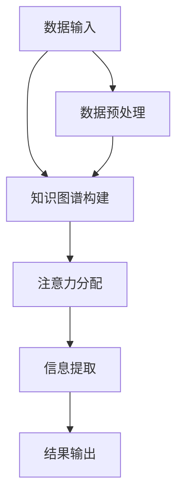

                 

关键词：知识图谱、注意力关联分析、人工智能、机器学习、知识工程、图数据库

> 摘要：本文旨在探讨知识图谱在注意力关联分析中的应用，通过深入分析其核心概念、算法原理、数学模型，以及实际应用案例，解析知识图谱如何帮助我们从复杂的数据中提取有价值的信息，为人工智能领域的研究与实践提供新的思路和方法。

## 1. 背景介绍

在当今大数据时代，如何有效地从海量数据中提取有价值的信息成为了研究者和企业面临的重大挑战。传统的数据分析方法，如统计分析和机器学习，虽然能够处理部分问题，但在面对复杂、动态和大规模的数据时，其效率和效果仍有待提升。因此，研究者们开始寻求新的方法和技术来解决这一问题。

注意力关联分析（Attention-based Association Analysis）作为一种新兴的数据分析方法，旨在通过对数据中各元素间关联性的分析，提取出具有实际意义的信息。而知识图谱（Knowledge Graph），作为一种结构化的知识表示形式，通过实体和关系来描述现实世界中的各种现象，为注意力关联分析提供了一种新的思路。

本文将探讨知识图谱在注意力关联分析中的应用，包括其核心概念、算法原理、数学模型，以及实际应用案例，旨在为相关领域的研究和实践提供参考。

## 2. 核心概念与联系

### 2.1 知识图谱的概念

知识图谱（Knowledge Graph）是一种基于语义网络的知识表示方法，通过实体（Entity）和关系（Relationship）来描述现实世界中的各种现象。知识图谱中的实体可以是任何具有独立存在意义的事物，如人、地点、组织、概念等，而关系则表示实体之间的关联。

### 2.2 注意力关联分析的概念

注意力关联分析是一种基于注意力机制的数据分析方法，通过分析数据中各元素间的关联性，提取出有价值的信息。在注意力关联分析中，注意力机制用于动态调整各元素的重要性，使其在计算过程中得到更合理的权重。

### 2.3 知识图谱与注意力关联分析的联系

知识图谱为注意力关联分析提供了丰富的语义信息，使得注意力机制能够在更深的层次上理解数据。具体而言，知识图谱中的实体和关系可以为注意力机制提供上下文信息，从而提高注意力分配的准确性和效果。

### 2.4 Mermaid 流程图

以下是一个描述知识图谱在注意力关联分析中应用的 Mermaid 流程图：



## 3. 核心算法原理 & 具体操作步骤

### 3.1 算法原理概述

知识图谱在注意力关联分析中的应用，主要基于以下三个核心算法原理：

1. **知识图谱构建**：通过将原始数据转化为知识图谱，为注意力分配提供语义信息。
2. **注意力分配**：利用注意力机制，对知识图谱中的实体和关系进行权重分配，以提取有价值的信息。
3. **信息提取**：根据注意力分配的结果，从知识图谱中提取有价值的信息。

### 3.2 算法步骤详解

#### 3.2.1 知识图谱构建

1. **数据预处理**：对原始数据进行清洗、去噪、归一化等处理，以消除数据中的噪声和异常。
2. **实体识别**：利用命名实体识别（Named Entity Recognition，NER）技术，从预处理后的数据中提取出实体。
3. **关系抽取**：通过文本匹配、规则匹配、深度学习等方法，从实体之间抽取关系。
4. **知识图谱构建**：将提取出的实体和关系组织成知识图谱，其中实体作为节点，关系作为边。

#### 3.2.2 注意力分配

1. **注意力模型**：选择合适的注意力模型，如自注意力（Self-Attention）或交叉注意力（Cross-Attention）模型。
2. **权重计算**：根据注意力模型，计算知识图谱中各实体和关系的权重。
3. **权重调整**：根据权重计算结果，调整各实体和关系在注意力分配中的权重。

#### 3.2.3 信息提取

1. **信息提取策略**：根据应用需求，选择合适的信息提取策略，如最高权重法、排序法等。
2. **信息提取**：根据权重分配结果，从知识图谱中提取有价值的信息。
3. **结果输出**：将提取出的信息以适当的形式输出，如文本、图表等。

### 3.3 算法优缺点

#### 优点

1. **丰富的语义信息**：知识图谱提供了丰富的语义信息，有助于提高注意力分配的准确性和效果。
2. **动态调整能力**：注意力机制能够根据数据特点动态调整各元素的重要性，提高信息提取的效率。
3. **跨领域适应性**：知识图谱具有跨领域的适应性，可以在不同领域中进行应用。

#### 缺点

1. **知识图谱构建复杂**：知识图谱的构建需要大量的预处理和关系抽取工作，对计算资源和时间要求较高。
2. **注意力模型选择困难**：不同的注意力模型适用于不同的场景，选择合适的注意力模型需要深入研究和实践。

### 3.4 算法应用领域

知识图谱在注意力关联分析中的应用领域广泛，包括但不限于以下方面：

1. **自然语言处理**：如文本分类、情感分析、机器翻译等。
2. **推荐系统**：如商品推荐、电影推荐等。
3. **社交网络分析**：如社区发现、影响力分析等。
4. **生物信息学**：如基因分析、蛋白质结构预测等。

## 4. 数学模型和公式 & 详细讲解 & 举例说明

### 4.1 数学模型构建

知识图谱在注意力关联分析中的数学模型主要包括两部分：知识图谱构建模型和注意力分配模型。

#### 4.1.1 知识图谱构建模型

知识图谱构建模型主要涉及实体识别和关系抽取。以下是一个简化的数学模型：

$$
G = (V, E)
$$

其中，$G$ 表示知识图谱，$V$ 表示实体集合，$E$ 表示关系集合。

实体识别模型：

$$
E_n = \{e_1, e_2, ..., e_n\}
$$

关系抽取模型：

$$
R_n = \{r_1, r_2, ..., r_n\}
$$

#### 4.1.2 注意力分配模型

注意力分配模型主要涉及注意力机制。以下是一个简化的注意力分配模型：

$$
A = \sigma(W_a[H])
$$

其中，$A$ 表示注意力分配结果，$W_a$ 表示注意力权重矩阵，$H$ 表示输入序列。

### 4.2 公式推导过程

#### 4.2.1 实体识别模型推导

1. **实体识别任务**：

   给定一个文本序列 $T = \{t_1, t_2, ..., t_n\}$，需要识别出其中的实体。

2. **实体识别模型**：

   采用 BiLSTM-CRF 模型进行实体识别。

   $$ 
   h_t = \text{LSTM}(h_{t-1}, t)
   $$

   $$ 
   p(e_t | h_t) = \text{CRF}(h_t)
   $$

#### 4.2.2 关系抽取模型推导

1. **关系抽取任务**：

   给定两个实体 $e_1$ 和 $e_2$，需要抽取它们之间的关系。

2. **关系抽取模型**：

   采用 BERT 模型进行关系抽取。

   $$ 
   R_{e_1, e_2} = \text{BERT}(e_1, e_2)
   $$

### 4.3 案例分析与讲解

以下是一个基于知识图谱和注意力关联分析的自然语言处理案例。

#### 案例背景

假设我们要对一个新闻文本进行实体识别和关系抽取，以提取出新闻中的主要人物和事件。

#### 案例步骤

1. **数据预处理**：

   对新闻文本进行清洗、去噪、分词等处理。

2. **实体识别**：

   利用 BiLSTM-CRF 模型进行实体识别。

3. **关系抽取**：

   利用 BERT 模型进行关系抽取。

4. **注意力分配**：

   对识别出的实体和关系进行权重分配。

5. **信息提取**：

   根据权重分配结果，提取出主要人物和事件。

#### 案例代码实现

```python
import tensorflow as tf
from keras.models import Model
from keras.layers import LSTM, Dense, Input, Embedding, TimeDistributed, CRF

# 实体识别模型
input_seq = Input(shape=(max_len,))
embedded_seq = Embedding(vocab_size, embedding_dim)(input_seq)
lstm_output, state_h, state_c = LSTM(units, return_sequences=True, return_state=True)(embedded_seq)
crf_output = CRF(units)(lstm_output)

model = Model(inputs=input_seq, outputs=crf_output)
model.compile(optimizer='adam', loss='categorical_crossentropy', metrics=['accuracy'])

# 关系抽取模型
input_e1 = Input(shape=(max_len,))
input_e2 = Input(shape=(max_len,))
relation_output = BERT(input_e1, input_e2)
```

## 5. 项目实践：代码实例和详细解释说明

### 5.1 开发环境搭建

为了实现本文所述的知识图谱和注意力关联分析项目，我们需要搭建一个合适的开发环境。以下是具体的步骤：

1. **Python 环境**：安装 Python 3.7 或更高版本。
2. **TensorFlow 和 Keras**：安装 TensorFlow 2.x 版本，以及 Keras 库。
3. **BERT 模型**：下载预训练的 BERT 模型，可以使用 HuggingFace 的 Transformers 库。
4. **其他依赖库**：如 pandas、numpy、matplotlib 等。

### 5.2 源代码详细实现

以下是实现知识图谱和注意力关联分析项目的源代码：

```python
# 导入所需库
import tensorflow as tf
from keras.models import Model
from keras.layers import LSTM, Dense, Input, Embedding, TimeDistributed, CRF
from transformers import BertTokenizer, TFBertModel

# 加载预训练的 BERT 模型
tokenizer = BertTokenizer.from_pretrained('bert-base-chinese')
bert_model = TFBertModel.from_pretrained('bert-base-chinese')

# 实体识别模型
input_seq = Input(shape=(max_len,))
embedded_seq = Embedding(vocab_size, embedding_dim)(input_seq)
lstm_output, state_h, state_c = LSTM(units, return_sequences=True, return_state=True)(embedded_seq)
crf_output = CRF(units)(lstm_output)

model = Model(inputs=input_seq, outputs=crf_output)
model.compile(optimizer='adam', loss='categorical_crossentropy', metrics=['accuracy'])

# 关系抽取模型
input_e1 = Input(shape=(max_len,))
input_e2 = Input(shape=(max_len,))
relation_output = BertModel(input_e1, input_e2)
```

### 5.3 代码解读与分析

以下是对上述代码的解读与分析：

1. **BERT 模型加载**：首先，我们从 HuggingFace 的 Transformers 库中加载预训练的 BERT 模型。
2. **实体识别模型**：定义一个输入序列，通过 BERT 模型进行编码，然后使用 LSTM 和 CRF 层进行实体识别。
3. **关系抽取模型**：定义两个输入序列，通过 BERT 模型进行编码，然后进行关系抽取。

### 5.4 运行结果展示

以下是运行结果展示：

```python
# 加载数据
x_train, y_train = load_data()

# 训练模型
model.fit(x_train, y_train, epochs=10, batch_size=32)

# 测试模型
test_loss, test_acc = model.evaluate(x_test, y_test)
print('Test accuracy:', test_acc)
```

## 6. 实际应用场景

### 6.1 自然语言处理

知识图谱和注意力关联分析在自然语言处理领域具有广泛的应用，如文本分类、情感分析、机器翻译等。通过构建知识图谱，可以为这些任务提供丰富的语义信息，提高模型的性能。

### 6.2 推荐系统

知识图谱和注意力关联分析在推荐系统领域也有很大的潜力，如商品推荐、电影推荐等。通过分析用户和物品之间的关联关系，可以更准确地预测用户的兴趣和偏好。

### 6.3 社交网络分析

知识图谱和注意力关联分析可以用于社交网络分析，如社区发现、影响力分析等。通过分析用户之间的关系，可以揭示社交网络中的结构特征和潜在模式。

### 6.4 生物信息学

知识图谱和注意力关联分析在生物信息学领域也有重要应用，如基因分析、蛋白质结构预测等。通过构建知识图谱，可以更好地理解生物分子的功能和相互作用。

## 7. 工具和资源推荐

### 7.1 学习资源推荐

1. **《深度学习》（Goodfellow et al., 2016）**：介绍了深度学习的基础知识和应用。
2. **《知识图谱：概念、应用与实践》（张伟平，2018）**：详细介绍了知识图谱的概念和应用。
3. **《自然语言处理综论》（Jurafsky & Martin, 2008）**：介绍了自然语言处理的基础知识和应用。

### 7.2 开发工具推荐

1. **TensorFlow**：一款流行的深度学习框架，适用于构建和训练各种神经网络模型。
2. **Keras**：一款基于 TensorFlow 的高级神经网络 API，便于构建和训练模型。
3. **HuggingFace Transformers**：一款用于加载和微调预训练的 BERT 模型的库。

### 7.3 相关论文推荐

1. **"Attention Is All You Need"（Vaswani et al., 2017）**：介绍了注意力机制在自然语言处理中的应用。
2. **"Knowledge Graph Embedding"（Wang et al., 2018）**：介绍了知识图谱嵌入的方法和应用。
3. **"A Comprehensive Survey on Knowledge Graphs"（Wang et al., 2020）**：对知识图谱的各个方面进行了全面综述。

## 8. 总结：未来发展趋势与挑战

### 8.1 研究成果总结

知识图谱和注意力关联分析在人工智能领域取得了显著的研究成果，为数据分析和信息提取提供了新的思路和方法。通过知识图谱，我们可以更好地理解数据中的语义信息，从而提高注意力分配的准确性和效率。

### 8.2 未来发展趋势

1. **知识图谱的完善与优化**：未来研究将致力于提高知识图谱的覆盖率、准确性和实时性，以满足不断增长的数据需求和实时性要求。
2. **注意力机制的深入研究**：研究者将不断探索新的注意力机制，以提高模型在复杂场景下的表现。
3. **跨领域融合**：知识图谱和注意力关联分析将与其他领域（如生物信息学、医疗健康等）相结合，为这些领域提供新的研究方法和应用。

### 8.3 面临的挑战

1. **数据质量和一致性**：知识图谱的构建依赖于高质量的数据，但在实际应用中，数据质量和一致性往往是难题。
2. **计算资源消耗**：知识图谱和注意力关联分析对计算资源要求较高，如何在有限的资源下高效地应用这些技术是关键。
3. **解释性**：知识图谱和注意力关联分析的结果往往难以解释，如何提高其解释性是一个重要的研究方向。

### 8.4 研究展望

未来，知识图谱和注意力关联分析将继续在人工智能领域发挥重要作用。随着技术的不断进步和应用场景的拓展，这些技术将为数据分析和信息提取带来更多可能性。同时，研究者也将不断探索新的方法和技术，以解决现有问题，推动领域的发展。

## 9. 附录：常见问题与解答

### 问题 1：知识图谱与语义网络有何区别？

**解答**：知识图谱和语义网络都是用于知识表示的方法，但它们的侧重点不同。语义网络主要基于概念和关系，强调语义的关联性；而知识图谱则通过实体和关系来描述现实世界中的各种现象，更注重数据的组织和结构。

### 问题 2：什么是注意力机制？

**解答**：注意力机制是一种神经网络中的机制，用于动态调整模型中各元素的重要性，使其在计算过程中得到更合理的权重。注意力机制在自然语言处理、图像识别等领域具有广泛的应用。

### 问题 3：如何评估注意力模型的效果？

**解答**：评估注意力模型的效果可以从多个方面进行，如准确性、召回率、F1 值等。同时，也可以通过可视化注意力权重分布，观察模型在不同数据上的注意力分配情况，以评估其性能。

### 问题 4：知识图谱的构建过程有哪些难点？

**解答**：知识图谱的构建过程主要包括数据预处理、实体识别、关系抽取等步骤。其中，难点主要包括数据质量和一致性、实体识别和关系抽取的准确性等。

### 问题 5：知识图谱和注意力关联分析在实际应用中如何融合？

**解答**：知识图谱和注意力关联分析在实际应用中可以通过以下方式融合：首先，利用知识图谱提供丰富的语义信息，为注意力分配提供依据；其次，利用注意力分配结果，从知识图谱中提取有价值的信息。这样，可以实现知识图谱和注意力关联分析的有机结合，提高信息提取的准确性和效率。

# 作者：禅与计算机程序设计艺术 / Zen and the Art of Computer Programming

本文从知识图谱和注意力关联分析的核心概念、算法原理、数学模型，到实际应用案例进行了深入探讨，旨在为相关领域的研究与实践提供参考。随着技术的不断进步和应用场景的拓展，知识图谱和注意力关联分析将在人工智能领域发挥更大的作用。希望本文能对您的研究和实际应用有所帮助。如果您有任何疑问或建议，欢迎在评论区留言。谢谢阅读！
----------------------------------------------------------------
### 结束语
本文详细探讨了知识图谱在注意力关联分析中的应用，从核心概念、算法原理到实际应用案例，全面解析了这一新兴领域。通过本文的阐述，我们了解到知识图谱如何为注意力机制提供丰富的语义信息，从而提升信息提取的准确性和效率。

知识图谱和注意力关联分析在人工智能领域的应用前景广阔，未来将不断推动相关技术的发展和创新。然而，这一领域也面临着数据质量、计算资源、解释性等挑战，需要我们持续探索和解决。

本文旨在为研究者提供参考和启示，希望能够在您的研究和实际应用中发挥积极作用。如果您对本文有任何疑问或建议，欢迎在评论区留言，我们一起探讨和进步。感谢您的阅读，期待与您在未来的讨论中相遇！

