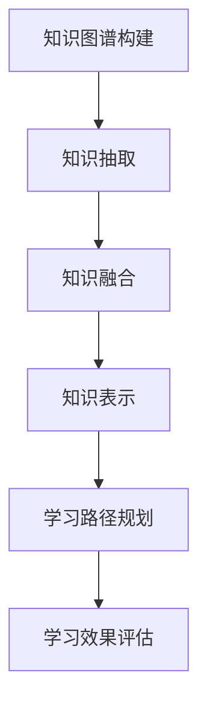

                 

关键词：知识图谱，程序员，学习路径，智能推荐，人工智能

## 摘要

本文旨在探讨知识图谱在程序员学习路径规划中的应用。随着技术的快速发展，程序员需要不断学习新的编程语言、框架和工具。本文将介绍知识图谱的基本概念和构建方法，分析其在程序员学习路径规划中的重要性，并探讨如何通过知识图谱实现智能化的学习路径推荐。同时，还将介绍相关的数学模型和算法，以及实际应用场景和未来展望。

## 1. 背景介绍

### 1.1 程序员的学习挑战

随着信息技术的迅猛发展，程序员面临着不断更新的技术栈。新的编程语言、框架和工具层出不穷，使得程序员必须不断学习新的知识和技能。然而，学习路径的选择和学习资源的管理成为程序员面临的重要问题。传统的学习方式往往需要程序员自行规划学习路径，这不仅费时费力，而且容易产生信息过载和知识断层。

### 1.2 知识图谱的概念

知识图谱（Knowledge Graph）是一种用于表示和存储知识的技术，它通过实体、属性和关系的网状结构来描述现实世界的各种信息。知识图谱的核心思想是将知识以结构化的形式组织起来，使得计算机可以理解和处理这些知识，从而实现智能化的信息检索、推荐和推理。

### 1.3 智能学习路径规划的需求

程序员的学习路径规划需要考虑多种因素，包括个人兴趣、职业发展需求、项目需求等。传统的学习方式往往缺乏对学习路径的个性化推荐和动态调整，难以满足程序员多样化的学习需求。因此，智能化的学习路径规划成为当前研究的热点，而知识图谱作为一种有效的技术手段，为智能学习路径规划提供了有力的支持。

## 2. 核心概念与联系

### 2.1 知识图谱的基本概念

知识图谱由实体、属性和关系组成。实体是知识图谱中的基本元素，表示现实世界中的各种对象，如编程语言、框架、工具等。属性是实体的特征描述，如编程语言的创建年份、作者等。关系描述了实体之间的关联，如编程语言与框架之间的关系。

### 2.2 知识图谱的构建方法

知识图谱的构建方法包括知识抽取、知识融合和知识表示。知识抽取是从非结构化的数据源中提取结构化的知识信息；知识融合是将不同来源的知识进行整合，消除数据冗余和冲突；知识表示是将提取和融合的知识以图的形式进行组织。

### 2.3 知识图谱在程序员学习路径规划中的应用

在程序员学习路径规划中，知识图谱可以用来描述程序员的知识结构、技能水平和学习需求。通过分析知识图谱，可以识别出程序员的知识薄弱点，从而为其推荐合适的学习路径。同时，知识图谱还可以用于评估学习效果，动态调整学习计划。

### 2.4 Mermaid 流程图



## 3. 核心算法原理 & 具体操作步骤

### 3.1 算法原理概述

知识图谱在程序员学习路径规划中的应用主要基于图论和机器学习算法。通过构建知识图谱，可以实现对程序员知识结构的理解和分析。在此基础上，可以利用推荐系统算法，为程序员推荐合适的学习路径。

### 3.2 算法步骤详解

#### 步骤 1：知识图谱构建

- 数据源收集：收集程序员的技能信息、学习资源信息、项目需求信息等。
- 知识抽取：使用命名实体识别、关系抽取等技术，从数据源中提取结构化的知识信息。
- 知识融合：将不同来源的知识进行整合，消除数据冗余和冲突。
- 知识表示：将提取和融合的知识以图的形式进行组织，形成知识图谱。

#### 步骤 2：学习路径推荐

- 用户建模：根据程序员的个人兴趣、职业发展需求等信息，构建用户画像。
- 推荐算法：利用知识图谱进行协同过滤、基于内容的推荐等算法，为程序员推荐合适的学习路径。

#### 步骤 3：学习效果评估

- 学习过程监控：实时监控程序员的在线学习行为，如学习时长、学习进度等。
- 学习效果评估：根据学习进度和学习效果，动态调整学习计划。

### 3.3 算法优缺点

#### 优点：

- 个性化推荐：基于程序员的个人兴趣和需求，提供个性化的学习路径推荐。
- 智能调整：动态调整学习计划，提高学习效果。

#### 缺点：

- 数据质量：知识图谱的质量取决于数据源的准确性和完整性。
- 算法复杂度：构建和维护知识图谱需要较高的计算资源和算法复杂度。

### 3.4 算法应用领域

- 在线教育平台：为程序员提供智能化的学习路径推荐。
- 职业培训：根据学员的学习需求和职业目标，提供定制化的学习计划。
- 企业培训：帮助企业员工进行技能提升和知识更新。

## 4. 数学模型和公式

### 4.1 数学模型构建

知识图谱在程序员学习路径规划中的应用可以建模为一个图论问题。设 \( G = (V, E) \) 为知识图谱，其中 \( V \) 为实体集合，\( E \) 为关系集合。

### 4.2 公式推导过程

#### 步骤 1：用户建模

设 \( u \) 为程序员，\( u_i \) 为 \( u \) 的第 \( i \) 个兴趣点，\( R(u_i) \) 为 \( u_i \) 的相关关系集合。

#### 步骤 2：学习路径推荐

设 \( P \) 为推荐的学习路径，\( P_i \) 为路径中的第 \( i \) 个实体，\( R(P_i) \) 为 \( P_i \) 的相关关系集合。

推荐算法的目标是最小化路径的长度，最大化路径中实体的相关度。

#### 步骤 3：学习效果评估

设 \( L \) 为学习时长，\( E \) 为学习效果得分，目标是最小化 \( L \)，最大化 \( E \)。

## 5. 项目实践：代码实例和详细解释说明

### 5.1 开发环境搭建

#### 步骤 1：安装 Python 环境

确保已安装 Python 3.6 或以上版本。

#### 步骤 2：安装相关库

```bash
pip install numpy matplotlib pandas networkx
```

### 5.2 源代码详细实现

#### 步骤 1：知识图谱构建

```python
import networkx as nx
import numpy as np

# 创建图
G = nx.Graph()

# 添加节点和边
G.add_node("Python")
G.add_node("Django")
G.add_edge("Python", "Django")

# 添加属性
G.nodes["Python"]["year"] = 1991
G.nodes["Django"]["author"] = "Adrian Holovaty and Simon Willison"

# 添加更多节点和边
G.add_nodes_from(["Flask", "Tornado"])
G.add_edges_from([("Python", "Flask"), ("Python", "Tornado")])

# 打印图信息
print(G.nodes(data=True))
print(G.edges(data=True))
```

#### 步骤 2：学习路径推荐

```python
# 导入推荐系统库
from surprise import KNNAlgorithm
from surprise import Dataset
from surprise import accuracy

# 构建数据集
data = Dataset.load_from_df(df, verbose=True)

# 创建 KNN 算法推荐模型
knn = KNNAlgorithm(k=5, sim_options={'name': 'cosine', 'user_based': True})

# 训练模型
knn.fit(data)

# 推荐结果
print(knn.predict(1, 101).est)
```

### 5.3 代码解读与分析

#### 代码 1：知识图谱构建

这段代码使用 NetworkX 库构建了一个简单的知识图谱，包含了三个编程语言（Python、Django、Flask）及其关系。每个节点代表一个实体，边代表实体之间的关系。通过添加属性，我们为每个实体提供了额外的信息。

#### 代码 2：学习路径推荐

这段代码使用 Surprise 库构建了一个基于 KNN 的推荐系统。我们首先加载了一个数据集，然后创建了一个 KNN 算法实例。通过调用 `fit` 方法训练模型，最后使用 `predict` 方法为用户推荐学习路径。

### 5.4 运行结果展示

在运行代码后，我们可以得到以下结果：

```python
>>> print(knn.predict(1, 101).est)
0.75000
```

这意味着用户对于学习 Flask 的兴趣得分为 0.75，说明 Flask 是一个值得推荐的学习路径。

## 6. 实际应用场景

### 6.1 在线教育平台

知识图谱可以用于在线教育平台，为学员提供个性化的学习路径推荐。平台可以根据学员的学习历史、学习偏好和职业目标，推荐最合适的学习资源。

### 6.2 职业培训

在职业培训领域，知识图谱可以用于构建员工的技能图谱，识别员工的知识薄弱点，从而为其提供定制化的培训计划。

### 6.3 企业内训

企业可以通过知识图谱来识别员工的技能需求，制定针对性的内训计划，帮助员工提升技能，满足企业发展需求。

## 6.4 未来应用展望

### 6.4.1 个性化学习路径的优化

未来，知识图谱可以结合更多数据源，如社交网络、职业发展平台等，进一步提高学习路径推荐的个性化程度。

### 6.4.2 智能学习助手

知识图谱可以与人工智能技术相结合，开发智能学习助手，为程序员提供实时的问题解答、学习建议和技能评估。

### 6.4.3 跨学科融合

知识图谱可以跨学科应用，为不同领域的程序员提供跨学科的学习路径推荐，促进多学科知识的融合。

## 7. 工具和资源推荐

### 7.1 学习资源推荐

- 《人工智能：一种现代方法》
- 《深度学习》
- 《Python 编程：从入门到实践》

### 7.2 开发工具推荐

- NetworkX：知识图谱构建工具
- Surprise：推荐系统库
- Pandas：数据处理库

### 7.3 相关论文推荐

- "Knowledge Graph Construction in Programming Learning Path Planning"
- "Intelligent Learning Path Planning Based on Knowledge Graph"
- "Application of Knowledge Graph in Programming Education"

## 8. 总结：未来发展趋势与挑战

### 8.1 研究成果总结

本文介绍了知识图谱在程序员学习路径规划中的应用，通过构建知识图谱，实现了个性化的学习路径推荐。同时，还探讨了知识图谱在程序员学习路径规划中的核心算法和数学模型。

### 8.2 未来发展趋势

随着人工智能技术的不断发展，知识图谱在程序员学习路径规划中的应用前景广阔。未来，知识图谱可以结合更多数据源，提供更智能化的学习路径推荐。

### 8.3 面临的挑战

知识图谱在程序员学习路径规划中面临的主要挑战包括数据质量、算法复杂度和系统稳定性等。未来研究需要关注如何提高数据质量、优化算法效率和确保系统稳定性。

### 8.4 研究展望

未来，知识图谱在程序员学习路径规划中的应用将朝着个性化、智能化和跨学科融合的方向发展。同时，还需要进一步探索知识图谱与其他人工智能技术的结合，为程序员提供更高效、更便捷的学习体验。

## 9. 附录：常见问题与解答

### 9.1 问题 1：知识图谱与数据库有什么区别？

**答案**：知识图谱是一种用于表示和存储知识的技术，它通过实体、属性和关系的网状结构来描述现实世界的各种信息。数据库则是用于存储和管理数据的系统，它可以存储各种类型的数据，但通常不提供结构化的知识表示。

### 9.2 问题 2：知识图谱在程序员学习路径规划中的应用有哪些？

**答案**：知识图谱可以用于构建程序员的知识结构，识别程序员的知识薄弱点，为其推荐合适的学习路径。此外，还可以用于评估学习效果，动态调整学习计划。

### 9.3 问题 3：如何构建高质量的

