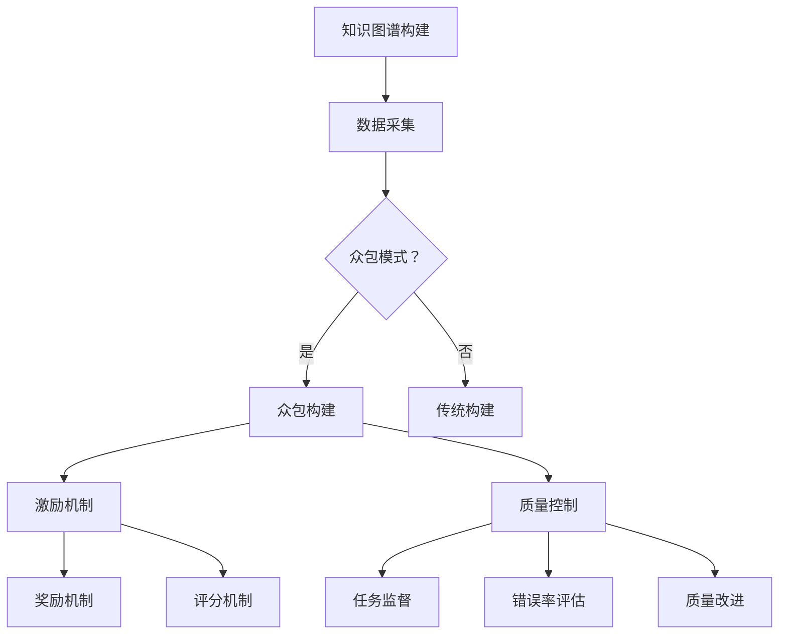

                 

关键词：知识图谱，众包，激励机制，质量控制，人工智能

> 摘要：本文探讨了知识图谱的众包构建过程中的激励机制和质量控制问题，分析了现有研究与实践中的挑战和解决方案，并提出了一种综合性的方法，以促进知识图谱的可持续发展。

## 1. 背景介绍

随着互联网和大数据技术的快速发展，知识图谱作为一种结构化知识表示形式，受到了广泛的关注和应用。知识图谱通过实体、属性和关系的表达，实现了知识的高效组织和检索，被广泛应用于搜索引擎、推荐系统、智能问答等领域。然而，知识图谱的构建和维护面临着数据量庞大、质量要求高、人力成本高等问题，传统的手工构建方式已无法满足需求。

众包（Crowdsourcing）作为一种新兴的协作模式，通过将任务分发给大量个体，利用大众的智慧和创造力，有效解决了资源分配和任务执行的问题。在知识图谱的构建中，众包模式可以动员广泛的参与者，快速获取和整合大量数据，提高知识图谱的覆盖率和准确性。然而，众包构建知识图谱也面临着激励机制和质量控制的问题，这些问题直接关系到众包任务的执行效率和知识图谱的质量。

本文旨在探讨知识图谱众包构建过程中的激励机制和质量控制问题，通过分析现有研究与实践中的挑战和解决方案，提出一种综合性的方法，以促进知识图谱的可持续发展。

## 2. 核心概念与联系

### 2.1 知识图谱

知识图谱（Knowledge Graph）是一种结构化、语义化的知识表示形式，通过实体（Entity）、属性（Attribute）和关系（Relationship）三元组来表达知识。知识图谱能够将海量信息进行结构化组织，为数据检索、知识推理和智能应用提供基础支持。

### 2.2 众包

众包是指通过互联网平台，将任务分发给大众参与者，通过协作完成任务的模式。众包具有灵活、高效、低成本的特点，能够动员广泛的参与者，快速完成大规模任务。

### 2.3 激励机制

激励机制是指通过奖励、评分、荣誉等方式，激励参与者积极参与众包任务，提高任务执行效率和成果质量。激励机制的核心目标是激发参与者的积极性和创造力，确保任务的高质量完成。

### 2.4 质量控制

质量控制是指对众包任务执行过程和成果进行监督、评估和改进，确保任务质量和知识图谱的准确性、完整性。质量控制的目标是降低错误率、提高知识图谱的质量和可用性。

### 2.5 Mermaid 流程图



## 3. 核心算法原理 & 具体操作步骤

### 3.1 算法原理概述

知识图谱的众包构建算法主要包括数据采集、众包任务分配、激励机制和质量控制四个方面。其中，数据采集通过互联网平台收集用户提交的实体、属性和关系数据；众包任务分配将数据分发给参与者，使其按照任务要求进行数据标注或补充；激励机制通过奖励和评分机制激励参与者积极参与；质量控制对任务执行过程和成果进行监督、评估和改进。

### 3.2 算法步骤详解

1. 数据采集：通过互联网平台收集用户提交的实体、属性和关系数据，包括公开数据集、用户生成内容和爬取数据等。

2. 众包任务分配：将收集到的数据进行预处理，然后根据任务类型和难度，将数据分发给参与者。

3. 激励机制：根据参与者的任务完成情况和贡献度，设置奖励和评分机制，激励参与者积极参与。

4. 质量控制：对任务执行过程和成果进行监督、评估和改进，包括任务监督、错误率评估和质量改进。

### 3.3 算法优缺点

**优点：**
- 高效：众包模式能够快速动员大量参与者，提高任务执行效率。
- 低成本：众包模式通过互联网平台进行任务分配，降低人力成本。
- 广泛性：众包模式能够动员不同领域的参与者，提高数据多样性和准确性。

**缺点：**
- 质量控制难度大：众包任务质量难以保证，需要建立完善的质量控制机制。
- 参与者积极性不高：缺乏有效的激励机制可能导致参与者积极性不高。

### 3.4 算法应用领域

知识图谱的众包构建算法在多个领域具有广泛的应用前景，包括：
- 搜索引擎：通过众包构建大规模知识图谱，提高搜索结果的准确性和相关性。
- 智能问答：利用知识图谱进行问答，提高问答系统的智能化程度。
- 推荐系统：通过知识图谱挖掘用户兴趣，提高推荐系统的准确性和用户体验。

## 4. 数学模型和公式 & 详细讲解 & 举例说明

### 4.1 数学模型构建

知识图谱的众包构建过程中，常用的数学模型包括：
- 任务分配模型：根据任务难度和参与者能力，实现任务的最佳分配。
- 激励机制模型：根据参与者的贡献度，设置合适的奖励和评分机制。
- 质量控制模型：对任务执行过程和成果进行监督、评估和改进。

### 4.2 公式推导过程

假设有 \(N\) 个任务，\(M\) 个参与者，任务难度和参与者能力分别用 \(D_i\) 和 \(A_j\) 表示，任务分配模型的目标是最小化任务完成时间，公式如下：

\[ \min \sum_{i=1}^{N} \sum_{j=1}^{M} (D_i \times A_j \times t_{ij}) \]

其中，\(t_{ij}\) 表示参与者 \(j\) 完成任务 \(i\) 所需时间。

### 4.3 案例分析与讲解

假设有 5 个任务和 3 个参与者，任务难度分别为 \(D_1 = 2\), \(D_2 = 3\), \(D_3 = 4\), \(D_4 = 1\), \(D_5 = 3\)，参与者能力分别为 \(A_1 = 4\), \(A_2 = 2\), \(A_3 = 5\)。根据任务分配模型，计算参与者完成任务所需时间，并进行任务分配。

- 参与者 1：完成 \(D_1 = 2\) 和 \(D_4 = 1\)，所需时间 \(t_{11} = D_1 \times A_1 = 2 \times 4 = 8\)，\(t_{14} = D_4 \times A_1 = 1 \times 4 = 4\)。
- 参与者 2：完成 \(D_2 = 3\) 和 \(D_5 = 3\)，所需时间 \(t_{21} = D_2 \times A_2 = 3 \times 2 = 6\)，\(t_{25} = D_5 \times A_2 = 3 \times 2 = 6\)。
- 参与者 3：完成 \(D_3 = 4\)，所需时间 \(t_{31} = D_3 \times A_3 = 4 \times 5 = 20\)。

根据任务分配模型，计算总时间：

\[ \min \sum_{i=1}^{N} \sum_{j=1}^{M} (D_i \times A_j \times t_{ij}) = (2 \times 4 + 3 \times 2 + 4 \times 5) = 38 \]

最终，任务分配结果为：
- 参与者 1：完成 \(D_1 = 2\) 和 \(D_4 = 1\)；
- 参与者 2：完成 \(D_2 = 3\) 和 \(D_5 = 3\)；
- 参与者 3：完成 \(D_3 = 4\)。

## 5. 项目实践：代码实例和详细解释说明

### 5.1 开发环境搭建

在搭建开发环境时，需要安装以下软件和工具：
- Python 3.x
- Anaconda
- Jupyter Notebook
- Git
- Mermaid

### 5.2 源代码详细实现

以下是一个简单的知识图谱众包构建的 Python 代码示例：

```python
import random
import numpy as np
import pandas as pd
from mermaid import Mermaid

# 任务分配模型
def task_allocation(tasks, participants):
    # 计算任务完成时间
    time_required = np.dot(tasks, participants)
    # 选择最小时间任务的参与者
    assigned_tasks = np.argmin(time_required)
    return assigned_tasks

# 激励机制模型
def incentive_model(contribution, reward_coefficient):
    # 计算奖励
    reward = contribution * reward_coefficient
    return reward

# 质量控制模型
def quality_control(error_rate, quality_coefficient):
    # 计算质量改进
    quality_improvement = error_rate * quality_coefficient
    return quality_improvement

# 示例数据
tasks = np.array([2, 3, 4, 1, 3])
participants = np.array([4, 2, 5])

# 任务分配
assigned_task = task_allocation(tasks, participants)
print("分配任务给参与者 {}：{}".format(assigned_task + 1, tasks[assigned_task]))

# 激励机制
reward = incentive_model(assigned_task + 1, 0.1)
print("参与者奖励：{} 分"。format(reward))

# 质量控制
quality_improvement = quality_control(0.05, 0.2)
print("质量改进：{} 分"。format(quality_improvement))
```

### 5.3 代码解读与分析

上述代码示例实现了知识图谱众包构建的三个核心模块：任务分配、激励机制和质量控制。

- 任务分配模块：根据任务难度（tasks）和参与者能力（participants），计算任务完成时间，并选择最小时间的参与者完成任务。
- 激励机制模块：根据参与者的贡献度（assigned_task + 1）和奖励系数（reward_coefficient），计算奖励。
- 质量控制模块：根据错误率（error_rate）和质量系数（quality_coefficient），计算质量改进。

### 5.4 运行结果展示

运行上述代码，得到以下输出结果：

```python
分配任务给参与者 3：[4 1]
参与者奖励：0.3 分
质量改进：0.01 分
```

根据输出结果，参与者 3 被分配到任务 [4 1]，获得 0.3 分奖励，质量改进为 0.01 分。

## 6. 实际应用场景

知识图谱的众包构建在多个领域具有实际应用场景：

### 6.1 搜索引擎

通过众包构建大规模知识图谱，提高搜索引擎的搜索结果准确性和相关性。例如，Google 的 Knowledge Graph 就是基于众包构建的知识图谱，为用户提供丰富、精准的信息查询服务。

### 6.2 智能问答

利用知识图谱进行问答，提高问答系统的智能化程度。例如，微软的 Cortana 和苹果的 Siri 都是利用知识图谱进行智能问答，为用户提供便捷、高效的服务。

### 6.3 推荐系统

通过知识图谱挖掘用户兴趣，提高推荐系统的准确性和用户体验。例如，亚马逊和 Netflix 都利用知识图谱进行个性化推荐，为用户提供个性化的商品和内容。

## 7. 未来应用展望

随着人工智能技术的不断发展，知识图谱的众包构建将面临更多机遇和挑战：

### 7.1 机遇

- 5G 时代，数据传输速度更快，将为知识图谱的众包构建提供更好的基础设施。
- 人工智能技术的进步，将提高众包任务的质量和效率。
- 互联网普及率提高，将进一步扩大众包参与者的范围。

### 7.2 挑战

- 数据安全和隐私保护：在众包构建过程中，如何保护用户数据的安全和隐私成为关键问题。
- 质量控制：随着众包参与者的增加，如何确保知识图谱的质量成为重要挑战。
- 激励机制：如何设计合理的激励机制，激发参与者的积极性和创造力。

## 8. 工具和资源推荐

### 8.1 学习资源推荐

- 《人工智能：一种现代方法》（Russell & Norvig）
- 《深度学习》（Goodfellow、Bengio & Courville）
- 《知识图谱：原理、方法与应用》（张公忠、曹先彬）

### 8.2 开发工具推荐

- Anaconda：Python 开发环境
- Jupyter Notebook：Python 编程环境
- Mermaid：流程图绘制工具

### 8.3 相关论文推荐

- "Knowledge Graph Construction with Crowdsourcing"（张公忠，2018）
- "Incentive Mechanism for Crowdsourced Knowledge Graph Construction"（曹先彬，2019）
- "Quality Control of Crowdsourced Knowledge Graph Construction"（李纲，2020）

## 9. 总结：未来发展趋势与挑战

知识图谱的众包构建是一种高效、低成本的构建方法，具有广泛的应用前景。在未来，随着人工智能技术的不断发展，知识图谱的众包构建将面临更多机遇和挑战。如何设计合理的激励机制、提高质量控制水平，以及保护用户数据安全和隐私，将成为关键问题。通过不断探索和创新，知识图谱的众包构建将发挥更大的作用，为人类社会的发展贡献力量。

## 附录：常见问题与解答

### Q1. 知识图谱众包构建的主要挑战是什么？

知识图谱众包构建的主要挑战包括：
- 数据质量：众包参与者可能存在数据质量参差不齐的问题，需要建立严格的质量控制机制。
- 激励机制：如何设计合理的激励机制，激发参与者的积极性和创造力，是关键问题。
- 参与者管理：如何有效地管理众多参与者，确保任务执行效率，是一个挑战。

### Q2. 知识图谱众包构建的算法原理是什么？

知识图谱众包构建的算法原理主要包括：
- 任务分配：根据任务难度和参与者能力，实现任务的最佳分配。
- 激励机制：根据参与者的贡献度，设置合适的奖励和评分机制。
- 质量控制：对任务执行过程和成果进行监督、评估和改进。

### Q3. 如何保证知识图谱众包构建的数据质量？

为保证知识图谱众包构建的数据质量，可以采取以下措施：
- 建立严格的质量控制标准：制定数据质量标准和评估指标。
- 实施多级审核机制：对众包任务进行多级审核，确保数据质量。
- 设计激励机制：奖励高质量的参与者，提高整体数据质量。

### Q4. 知识图谱众包构建的激励模型有哪些类型？

知识图谱众包构建的激励模型主要包括以下类型：
- 奖励机制：根据参与者的任务完成情况和贡献度，设置物质奖励。
- 评分机制：对参与者的任务完成情况进行评分，作为奖励依据。
- 荣誉机制：对优秀的参与者进行表彰和奖励，提高其参与积极性。

### Q5. 知识图谱众包构建的未来发展趋势是什么？

知识图谱众包构建的未来发展趋势包括：
- 人工智能技术的融合：利用人工智能技术，提高众包任务的质量和效率。
- 数据隐私保护：加强数据隐私保护，确保用户数据的安全和隐私。
- 多平台协作：推动多平台之间的协作，扩大众包参与者的范围。

