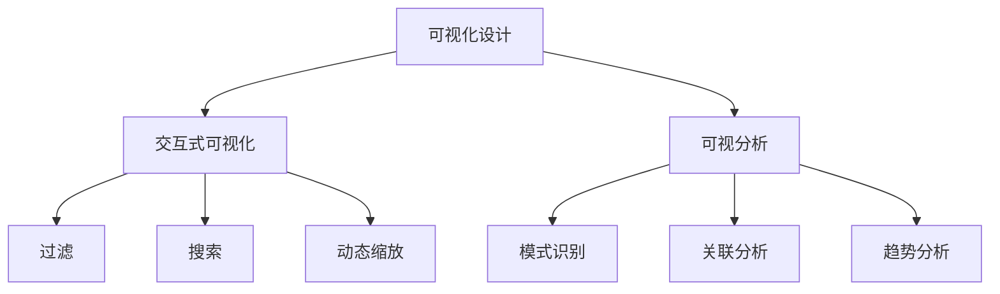

                 

关键词：知识图谱、可视化设计、交互式可视化、可视分析、人工智能、数据可视化、图数据库、数据管理、用户界面设计

摘要：随着大数据和人工智能技术的发展，知识图谱作为一种重要的数据结构，被广泛应用于各种领域。知识图谱的可视化设计是知识图谱研究和应用中的重要环节。本文将探讨知识图谱的可视化设计，重点介绍交互式可视化和可视分析在知识图谱可视化中的重要性，以及如何设计和实现有效的知识图谱可视化系统。通过实际案例分析和未来展望，本文为知识图谱可视化领域的研究和实践提供了有益的参考。

## 1. 背景介绍

知识图谱（Knowledge Graph）是一种结构化的语义数据表示方法，它通过实体和关系来描述现实世界中的各种事物和它们之间的关联。知识图谱的核心思想是将数据以图的形式表示，从而更好地捕捉数据的复杂性和关联性。近年来，随着互联网和信息技术的快速发展，知识图谱在搜索引擎、推荐系统、自然语言处理、知识服务等领域得到了广泛的应用。

可视化设计是知识图谱应用中不可或缺的一部分。通过可视化，用户可以直观地了解知识图谱的结构和内容，发现数据中的模式和规律。交互式可视化和可视分析（Interactive Visualization and Visual Analytics）是近年来在知识图谱可视化领域发展迅速的研究方向。交互式可视化强调用户与可视化系统的实时互动，通过用户的操作来动态调整和探索数据。可视分析则结合数据分析和可视化技术，通过分析数据来发现数据中的规律和模式。

## 2. 核心概念与联系

### 2.1 可视化设计的基本概念

可视化设计是指将数据以视觉的形式展示给用户，使用户能够直观地理解和分析数据。在知识图谱的可视化设计中，主要涉及以下几个基本概念：

- **实体（Entity）**：知识图谱中的基本元素，表示现实世界中的个体或对象，如人、地点、事物等。
- **关系（Relationship）**：实体之间的关联，用边（Edge）表示，如“属于”、“位于”、“创建”等。
- **属性（Attribute）**：实体的额外信息，用于描述实体的特征，如年龄、身高、颜色等。

### 2.2 交互式可视化

交互式可视化强调用户与可视化系统的实时互动。用户可以通过鼠标点击、拖动、缩放等操作来探索数据，动态地调整可视化视图。交互式可视化在知识图谱可视化中的应用，主要体现在以下几个方面：

- **过滤（Filtering）**：用户可以通过选择特定的实体或关系，过滤掉无关的数据，从而突出关键信息。
- **搜索（Searching）**：用户可以通过输入关键词，快速定位到特定的实体或关系。
- **动态缩放（Dynamic Zooming）**：用户可以通过缩放操作，放大或缩小视图，以更好地查看数据的细节。
- **交互式布局（Interactive Layout）**：用户可以通过交互式操作，如拖动实体，重新布局知识图谱。

### 2.3 可视分析

可视分析是将数据分析和可视化技术相结合，通过分析数据来发现数据中的规律和模式。可视分析在知识图谱中的应用，主要体现在以下几个方面：

- **模式识别（Pattern Recognition）**：通过可视化技术，发现知识图谱中的模式，如链式关系、聚类等。
- **关联分析（Correlation Analysis）**：通过分析实体和关系之间的关联性，发现数据中的相关关系。
- **趋势分析（Trend Analysis）**：通过可视化技术，分析数据随时间的变化趋势。

### 2.4 可视化与交互的Mermaid流程图



## 3. 核心算法原理 & 具体操作步骤

### 3.1 算法原理概述

知识图谱的可视化设计主要依赖于图数据库和可视化引擎。图数据库用于存储和管理知识图谱数据，可视化引擎用于将数据以图形化的方式展示给用户。核心算法原理包括以下几个方面：

- **图数据库的选择和配置**：根据知识图谱的数据规模和查询需求，选择合适的图数据库，并进行配置优化。
- **可视化引擎的选择和集成**：选择合适的可视化引擎，如D3.js、Gephi等，并集成到应用程序中。
- **交互式操作的设计**：设计用户与可视化系统的交互操作，如过滤、搜索、动态缩放等。
- **可视化视图的动态调整**：根据用户操作，动态调整可视化视图，以适应不同的用户需求。

### 3.2 算法步骤详解

1. **选择和配置图数据库**：
   - 根据数据规模和查询需求，选择合适的图数据库，如Neo4j、JanusGraph等。
   - 进行数据库的配置优化，如索引创建、内存管理、并发控制等。

2. **选择和集成可视化引擎**：
   - 根据可视化需求，选择合适的可视化引擎，如D3.js、Gephi等。
   - 将可视化引擎集成到应用程序中，如使用Web前端框架（如React、Vue等）进行整合。

3. **设计交互式操作**：
   - 根据用户需求，设计交互式操作，如过滤、搜索、动态缩放等。
   - 实现交互操作与可视化视图的联动，确保用户操作能够实时反映到可视化视图上。

4. **动态调整可视化视图**：
   - 根据用户操作，动态调整可视化视图，如放大、缩小、重新布局等。
   - 实现可视化视图的平滑过渡，提高用户体验。

### 3.3 算法优缺点

#### 优点

- **直观性**：通过图形化的方式展示知识图谱，用户可以直观地理解和分析数据。
- **交互性**：用户可以通过交互式操作，动态调整和探索数据，提高数据分析和决策的效率。
- **可视化分析**：通过可视分析技术，可以快速发现数据中的模式和规律，辅助决策。

#### 缺点

- **性能瓶颈**：知识图谱的可视化涉及大量的数据处理和渲染，可能存在性能瓶颈。
- **复杂度**：知识图谱的可视化设计和实现涉及多个环节，可能存在一定的复杂度。

### 3.4 算法应用领域

- **搜索引擎**：通过知识图谱的可视化，用户可以更直观地了解搜索结果的结构和关联性。
- **推荐系统**：通过知识图谱的可视化，可以发现用户兴趣点，优化推荐算法。
- **知识服务**：通过知识图谱的可视化，用户可以更好地理解知识体系，辅助学习和研究。
- **社会网络分析**：通过知识图谱的可视化，可以分析社交网络中的关系和群体结构。

## 4. 数学模型和公式 & 详细讲解 & 举例说明

### 4.1 数学模型构建

知识图谱的可视化设计涉及到多个数学模型，包括图论模型、概率模型和统计学模型等。以下是一个简单的图论模型：

- **图（Graph）**：由节点（Node）和边（Edge）组成，表示知识图谱的结构。
- **路径（Path）**：节点之间的有序序列，表示实体之间的关联。
- **度（Degree）**：节点所拥有的边的数量，表示节点的连接程度。

### 4.2 公式推导过程

以下是一个简单的路径长度公式：

$$
d(P) = \sum_{i=1}^{n} l(e_i)
$$

其中，$P$表示路径，$d(P)$表示路径的长度，$e_i$表示路径中的第$i$条边，$l(e_i)$表示边$e_i$的长度。

### 4.3 案例分析与讲解

假设我们有一个简单的知识图谱，其中包含三个实体（A、B、C）和三条关系（A-B、B-C、C-A）。我们可以使用路径长度公式来计算A到C的路径长度：

$$
d(A-C) = l(A-B) + l(B-C) + l(C-A)
$$

假设边的长度分别为1，则A到C的路径长度为3。通过这个简单的例子，我们可以看到路径长度公式在计算实体之间的关联程度时的应用。

## 5. 项目实践：代码实例和详细解释说明

### 5.1 开发环境搭建

为了实现知识图谱的可视化设计，我们使用以下开发环境和工具：

- **操作系统**：Linux（如Ubuntu 20.04）
- **编程语言**：Python 3.x
- **图数据库**：Neo4j 4.x
- **可视化引擎**：D3.js 6.x
- **Web框架**：Flask 2.x

首先，我们需要在Linux系统中安装Neo4j数据库和Flask框架。安装命令如下：

```bash
# 安装Neo4j数据库
wget https://download.neo4j.com/channels/stable-unix-x86_64/neo4j-4.4.2-unix-x86_64.tar.gz
tar xvfz neo4j-4.4.2-unix-x86_64.tar.gz
cd neo4j-4.4.2/bin
./neo4j start

# 安装Flask框架
pip install flask
```

### 5.2 源代码详细实现

以下是实现知识图谱可视化系统的源代码示例：

```python
from flask import Flask, jsonify, render_template
from neo4j import GraphDatabase

app = Flask(__name__)

# 连接Neo4j数据库
driver = GraphDatabase.driver("bolt://localhost:7687", auth=("neo4j", "password"))

@app.route('/')
def index():
    with driver.session() as session:
        data = session.run("MATCH (n) RETURN n")
        nodes = [{"id": node["n"].identity, "label": node["n"].properties["label"]} for node in data]
        edges = session.run("MATCH (a)-[:RELATION]->(b) RETURN a, b")
        links = [{"source": edge["a"].identity, "target": edge["b"].identity} for edge in edges]
    return render_template('index.html', nodes=nodes, links=links)

if __name__ == '__main__':
    app.run(debug=True)
```

在这个示例中，我们使用Flask框架搭建Web应用程序，连接到Neo4j数据库，并从数据库中获取节点和边的数据。然后，我们将这些数据传递给前端模板，使用D3.js进行可视化渲染。

### 5.3 代码解读与分析

1. **连接Neo4j数据库**：
   ```python
   driver = GraphDatabase.driver("bolt://localhost:7687", auth=("neo4j", "password"))
   ```
   使用`GraphDatabase.driver`方法连接到本地Neo4j数据库，指定Bolt协议和端口号，以及用户名和密码。

2. **获取节点和边的数据**：
   ```python
   with driver.session() as session:
       data = session.run("MATCH (n) RETURN n")
       nodes = [{"id": node["n"].identity, "label": node["n"].properties["label"]} for node in data]
       edges = session.run("MATCH (a)-[:RELATION]->(b) RETURN a, b")
       links = [{"source": edge["a"].identity, "target": edge["b"].identity} for edge in edges]
   ```
   使用`session.run`方法执行Cypher查询语句，获取节点和边的数据。节点数据包括节点的ID和标签，边数据包括边的起点和终点。

3. **渲染可视化视图**：
   ```html
   <script src="https://d3js.org/d3.v7.min.js"></script>
   <script>
       const width = 960, height = 500;
       const color = d3.scaleOrdinal(d3.schemeCategory10);
       
       const svg = d3.select("svg")
           .attr("width", width)
           .attr("height", height);
       
       const simulation = d3.forceSimulation()
           .force("link", d3.forceLink().id(d => d.id))
           .force("charge", d3.forceManyBody())
           .force("center", d3.forceCenter(width / 2, height / 2));
       
       const link = svg.append("g")
           .attr("class", "links")
           .selectAll("line")
           .data(links)
           .enter().append("line")
           .attr("stroke", "#ccc");
       
       const node = svg.append("g")
           .attr("class", "nodes")
           .selectAll("circle")
           .data(nodes)
           .enter().append("circle")
           .attr("r", 10)
           .attr("fill", d => color(d.label));
       
       node.append("title")
           .text(d => d.label);
       
       simulation
           .nodes(nodes)
           .on("tick", () => {
               link
                   .attr("x1", d => d.source.x)
                   .attr("y1", d => d.source.y)
                   .attr("x2", d => d.target.x)
                   .attr("y2", d => d.target.y);
       
               node
                   .attr("cx", d => d.x)
                   .attr("cy", d => d.y);
           });
   </script>
   ```
   使用D3.js进行数据绑定和渲染。创建一个SVG元素，定义节点和边的视觉属性，并使用力导向布局（forceSimulation）进行布局计算。

### 5.4 运行结果展示

运行Web应用程序后，访问本地地址`http://localhost:5000/`，可以看到知识图谱的可视化视图。节点和边通过颜色进行区分，用户可以通过鼠标悬停查看节点的详细信息。


## 6. 实际应用场景

知识图谱的可视化设计在多个领域有着广泛的应用：

- **搜索引擎**：通过知识图谱的可视化，用户可以更直观地了解搜索结果的结构和关联性，提高搜索体验。
- **推荐系统**：通过知识图谱的可视化，可以发现用户兴趣点，优化推荐算法，提高推荐准确性。
- **知识服务**：通过知识图谱的可视化，用户可以更好地理解知识体系，辅助学习和研究。
- **社会网络分析**：通过知识图谱的可视化，可以分析社交网络中的关系和群体结构，发现潜在的社会影响力。

在实际应用中，知识图谱的可视化设计不仅可以帮助用户直观地理解和分析数据，还可以为数据科学家和研究人员提供强大的工具，辅助他们进行数据探索和发现。

## 7. 工具和资源推荐

### 7.1 学习资源推荐

- **《知识图谱：原理、方法与应用》**：本书详细介绍了知识图谱的基本概念、构建方法和应用场景，适合知识图谱初学者。
- **《图数据库实战》**：本书涵盖了图数据库的基本原理、设计和应用，适合对图数据库感兴趣的读者。
- **《D3.js实战》**：本书通过多个实例，介绍了D3.js的使用方法和技巧，适合学习D3.js进行数据可视化。

### 7.2 开发工具推荐

- **Neo4j**：一款功能强大的图数据库，支持多种查询语言和可视化工具。
- **D3.js**：一款流行的数据可视化库，支持多种图表和布局，适合进行复杂的数据可视化。
- **Gephi**：一款开源的可视化工具，适用于大规模图的交互式可视化。

### 7.3 相关论文推荐

- **"A Tour of Recent Advances in Large-Scale Knowledge Graphs"**：本文综述了近年来大规模知识图谱的研究进展和应用。
- **"Interactive Visualization of Large Knowledge Graphs"**：本文探讨了交互式可视化在大规模知识图谱中的应用。
- **"Visual Analytics for Knowledge Graphs"**：本文介绍了可视分析在大规模知识图谱分析中的应用。

## 8. 总结：未来发展趋势与挑战

### 8.1 研究成果总结

知识图谱的可视化设计在近年来取得了显著的成果。通过交互式可视化和可视分析技术，用户可以更直观地理解和分析知识图谱数据。同时，随着图数据库和可视化引擎的发展，知识图谱可视化系统的性能和稳定性得到了大幅提升。

### 8.2 未来发展趋势

- **多模态数据融合**：未来知识图谱可视化将更多地融合多种数据类型，如文本、图像和音频等，提供更丰富的可视化体验。
- **智能化可视化**：利用机器学习和人工智能技术，实现自动化的可视化布局和交互设计，提高用户效率。
- **大规模实时可视化**：实现大规模知识图谱的实时可视化，支持动态数据流和实时更新。

### 8.3 面临的挑战

- **性能优化**：如何提高大规模知识图谱的可视化性能，仍然是未来研究的一个重要方向。
- **用户体验**：如何设计直观、易用的可视化界面，满足不同用户的需求，是一个挑战。
- **数据隐私和安全**：如何在保障数据隐私和安全的前提下，进行知识图谱的可视化设计，是一个重要问题。

### 8.4 研究展望

未来，知识图谱的可视化设计将继续朝着智能化、实时化和多模态化的方向发展。同时，随着新技术的不断涌现，知识图谱可视化领域将迎来更多的发展机遇和挑战。通过跨学科的合作和创新的算法，知识图谱可视化将为数据科学、人工智能和知识服务等领域带来更多的价值。

## 9. 附录：常见问题与解答

### 9.1 什么是知识图谱？

知识图谱是一种结构化的语义数据表示方法，通过实体和关系来描述现实世界中的各种事物和它们之间的关联。

### 9.2 交互式可视化有哪些优点？

交互式可视化可以提高数据探索和分析的效率，使用户可以直观地理解和分析数据，发现数据中的模式和规律。

### 9.3 如何选择合适的图数据库？

根据数据规模、查询需求和应用场景选择合适的图数据库，如Neo4j、JanusGraph等。

### 9.4 可视分析有哪些应用领域？

可视分析在搜索引擎、推荐系统、知识服务和社交网络分析等领域有着广泛的应用。

### 9.5 如何进行知识图谱可视化系统的开发？

首先选择合适的开发环境和工具，然后设计交互式操作和可视化视图，最后实现系统的集成和部署。

---

作者：禅与计算机程序设计艺术 / Zen and the Art of Computer Programming

本文旨在介绍知识图谱的可视化设计，重点讨论交互式可视化和可视分析在知识图谱可视化中的重要性，以及如何设计和实现有效的知识图谱可视化系统。通过实际案例分析和未来展望，本文为知识图谱可视化领域的研究和实践提供了有益的参考。在未来的研究中，我们将继续探索知识图谱可视化技术的创新和应用，为数据科学、人工智能和知识服务领域带来更多的价值。

