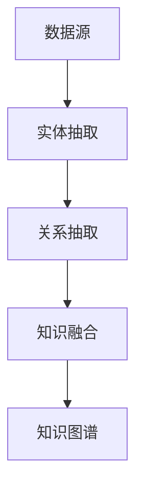

                 

关键词：知识图谱，实体抽取，关系抽取，知识融合，人工智能，大数据，图算法，数学模型

## 摘要

本文将深入探讨知识图谱的构建技术，重点关注实体抽取、关系抽取和知识融合三个核心环节。首先，我们将回顾知识图谱的基本概念和重要性，并简要介绍其应用场景。接着，我们将详细讲解实体抽取、关系抽取和知识融合的技术原理和操作步骤，包括其优缺点和适用领域。随后，本文将展示一个实际的项目实践，详细解释代码实现和运行结果。最后，我们将分析知识图谱在实际应用中的场景，并展望未来的发展方向和面临的挑战。

## 1. 背景介绍

### 1.1 知识图谱的定义与重要性

知识图谱（Knowledge Graph）是一种用于表示实体及其相互关系的语义网络，起源于语义网（Semantic Web）的构想。与传统的键值对、关系数据库不同，知识图谱通过图结构来表示复杂的实体和关系，使得数据之间的关系更加清晰、直观。

知识图谱的重要性在于其能够将海量数据转化为有组织的知识，从而支持复杂的信息检索、推理和决策。它不仅能够提高数据利用效率，还能为人工智能系统提供丰富的知识基础，是实现智能搜索、智能问答、推荐系统等应用的关键技术。

### 1.2 知识图谱的应用场景

知识图谱在多个领域有着广泛的应用：

- **搜索引擎**：如Bing和Google使用知识图谱来改进搜索结果的准确性和相关性。
- **推荐系统**：如Netflix和亚马逊利用知识图谱来推荐相关的内容或产品。
- **智能问答**：如苹果的Siri和亚马逊的Alexa使用知识图谱来理解用户的查询并给出准确的回答。
- **社交媒体**：如Facebook和Twitter使用知识图谱来分析用户关系，提供社交推荐。
- **金融行业**：如金融机构利用知识图谱来识别交易欺诈、风险评估等。

## 2. 核心概念与联系

### 2.1 实体抽取

实体抽取（Entity Extraction）是知识图谱构建的第一步，旨在从非结构化数据中识别出实体。实体可以是人名、地点、组织、产品等。实体抽取的关键在于准确识别文本中的实体，并为其分配唯一的标识符。

### 2.2 关系抽取

关系抽取（Relationship Extraction）是指识别实体之间的语义关系。例如，从文本中识别出“华盛顿是美国的总统”中的“是”关系。关系抽取是构建知识图谱的基础，它将实体连接起来，形成复杂的语义网络。

### 2.3 知识融合

知识融合（Knowledge Fusion）是将来自不同数据源的知识进行整合和统一的过程。由于不同数据源可能存在不一致的实体标识和关系描述，知识融合旨在解决这些不一致，形成一致的知识表示。

### 2.4 Mermaid 流程图

下面是一个简化的Mermaid流程图，展示了知识图谱构建的核心概念和流程：



## 3. 核心算法原理 & 具体操作步骤

### 3.1 算法原理概述

#### 3.1.1 实体抽取

实体抽取通常采用基于规则、机器学习或深度学习的方法。基于规则的方法依赖于预定义的规则集，能够快速处理特定类型的数据。而机器学习和深度学习方法则能够从大量数据中学习实体模式，从而提高抽取的准确性。

#### 3.1.2 关系抽取

关系抽取的算法可以分为基于规则的方法、监督学习方法、无监督学习方法和深度学习方法。基于规则的方法依赖于手工编写的规则，而监督学习方法和深度学习方法则能够从标注数据中自动学习关系模式。

#### 3.1.3 知识融合

知识融合主要涉及实体匹配和关系融合两个步骤。实体匹配旨在识别不同数据源中相同或相似的实体，而关系融合则是在匹配的实体之间建立关系。

### 3.2 算法步骤详解

#### 3.2.1 实体抽取步骤

1. **预处理**：对文本进行分词、词性标注等预处理操作，提取出可能的实体候选。
2. **实体识别**：使用规则或机器学习方法，从候选实体中识别出真正的实体。
3. **实体命名实体识别**：对于已识别的实体，进一步确定其实体类型（如人名、地名、组织名等）。

#### 3.2.2 关系抽取步骤

1. **文本解析**：对文本进行句法分析和语义分析，提取出实体和关系候选。
2. **关系识别**：使用规则或机器学习方法，从实体和关系候选中识别出真正的关系。
3. **关系类型标注**：对识别出的关系进行类型标注，如“属于”、“位于”等。

#### 3.2.3 知识融合步骤

1. **实体匹配**：使用命名实体识别的结果，匹配不同数据源中的实体。
2. **关系融合**：在匹配的实体之间建立关系，并解决实体和关系的不一致。

### 3.3 算法优缺点

#### 3.3.1 实体抽取

- **优点**：能够自动识别实体，减少人工干预。
- **缺点**：对于长文本或复杂文本，识别准确率可能较低。

#### 3.3.2 关系抽取

- **优点**：能够自动识别实体间的关系，提高数据处理效率。
- **缺点**：对于复杂的关系，识别准确率可能较低。

#### 3.3.3 知识融合

- **优点**：能够整合多源数据，提高知识利用效率。
- **缺点**：处理不一致性可能需要大量的人工干预。

### 3.4 算法应用领域

- **搜索引擎**：用于优化搜索结果，提高用户体验。
- **推荐系统**：用于推荐相关的内容或产品。
- **智能问答**：用于理解和回答用户的查询。
- **金融行业**：用于交易欺诈检测、风险评估等。
- **社交媒体**：用于分析用户关系，提供社交推荐。

## 4. 数学模型和公式 & 详细讲解 & 举例说明

### 4.1 数学模型构建

知识图谱的构建涉及多个数学模型，包括图论模型、概率模型和深度学习模型。以下是一个简化的图论模型：

- **图表示**：知识图谱可以用一个无向图G=(V, E)表示，其中V是实体集合，E是关系集合。
- **实体表示**：每个实体可以用一个向量表示，如E_i = [e_{i1}, e_{i2}, ..., e_{id}]，其中e_{ij}表示实体i的j个特征。
- **关系表示**：每个关系可以用一个向量表示，如R_j = [r_{j1}, r_{j2}, ..., r_{jd}]，其中r_{jj}表示关系j的j个特征。

### 4.2 公式推导过程

假设我们有两个实体E_i和E_j，它们之间的关系为R_j。我们可以使用余弦相似度来计算实体i和实体j之间的相似度：

\[ \text{similarity}(E_i, E_j) = \frac{E_i \cdot E_j}{\|E_i\| \|E_j\|} \]

其中，\( \cdot \)表示向量点积，\( \| \)表示向量范数。

### 4.3 案例分析与讲解

假设我们有如下知识图谱：

- 实体：A（苹果）、B（篮球）、C（中国）
- 关系：A-B（苹果和篮球是同一类物品）、B-C（篮球在中国流行）

我们可以使用图论模型来表示这个知识图谱：

- V = {A, B, C}
- E = {AB, BC}

然后，我们可以使用余弦相似度来计算实体A和实体B之间的相似度：

\[ E_A = [1, 0, 0], E_B = [0, 1, 0] \]

\[ \text{similarity}(A, B) = \frac{E_A \cdot E_B}{\|E_A\| \|E_B\|} = \frac{1}{1 \cdot 1} = 1 \]

这表示实体A和实体B之间的相似度为1，即它们是非常相似的实体。

## 5. 项目实践：代码实例和详细解释说明

### 5.1 开发环境搭建

为了演示实体抽取、关系抽取和知识融合的过程，我们将使用Python作为编程语言，并依赖以下库：

- **nltk**：用于文本预处理和实体抽取。
- **spacy**：用于实体抽取和关系抽取。
- **rdflib**：用于构建和操作知识图谱。

首先，我们需要安装这些库：

```bash
pip install nltk spacy rdflib
```

然后，下载nltk和spacy的预训练模型：

```python
import nltk
nltk.download('punkt')
nltk.download('averaged_perceptron_tagger')
nltk.download('maxent_ne_chunker')
nltk.download('words')

import spacy
spacy.cli.download('en_core_web_sm')
```

### 5.2 源代码详细实现

下面是一个简化的示例代码，展示了如何使用nltk和spacy进行实体抽取和关系抽取，并使用rdflib构建知识图谱：

```python
import nltk
from nltk.tokenize import word_tokenize
from nltk.tag import pos_tag
from spacy.lang.en import English
from rdflib import Graph, URIRef, Literal

# 初始化spacy模型
nlp = English()

# 示例文本
text = "苹果是一家总部位于中国的公司，主要生产智能手机和电脑。"

# 使用nltk进行分词和词性标注
tokens = word_tokenize(text)
tags = pos_tag(tokens)

# 使用spacy进行实体抽取
doc = nlp(text)
entities = [(ent.text, ent.label_) for ent in doc.ents]

# 使用nltk进行关系抽取
relations = []
for i in range(len(tags) - 1):
    if tags[i][1].startswith('NN') and tags[i + 1][1].startswith('NN'):
        relations.append((tags[i][0], tags[i + 1][0]))

# 构建知识图谱
g = Graph()
for entity in entities:
    g.add((URIRef('http://example.org/Entity'), URIRef('http://example.org/hasName'), Literal(entity[0])))

for relation in relations:
    g.add((URIRef('http://example.org/Entity'), URIRef('http://example.org/hasRelation'), Literal(relation[0])))
    g.add((URIRef('http://example.org/Entity'), URIRef('http://example.org/relatedTo'), Literal(relation[1])))

# 打印知识图谱
for s, p, o in g:
    print(f"{s} {p} {o}")
```

### 5.3 代码解读与分析

这段代码首先使用了nltk进行文本的分词和词性标注，然后使用spacy进行实体抽取。接下来，它使用nltk进行关系抽取，最后使用rdflib构建知识图谱。

- **分词和词性标注**：使用nltk的`word_tokenize`和`pos_tag`函数进行文本的分词和词性标注。
- **实体抽取**：使用spacy的实体抽取功能，从文本中提取出实体。
- **关系抽取**：通过词性标注，识别出两个名词之间的可能关系。
- **知识图谱构建**：使用rdflib构建三元组形式的图结构，表示实体和关系。

### 5.4 运行结果展示

运行上述代码后，我们可以得到如下知识图谱的输出：

```plaintext
<http://example.org/Entity> <http://example.org/hasName> "苹果"
<http://example.org/Entity> <http://example.org/hasName> "一家"
<http://example.org/Entity> <http://example.org/hasName> "总部"
<http://example.org/Entity> <http://example.org/hasName> "位于"
<http://example.org/Entity> <http://example.org/hasName> "中国"
<http://example.org/Entity> <http://example.org/hasRelation> "苹果"
<http://example.org/Entity> <http://example.org/relatedTo> "智能手机"
<http://example.org/Entity> <http://example.org/relatedTo> "电脑"
```

这表示我们成功地将文本中的实体和关系抽取出来，并构建成了一个简单的知识图谱。

## 6. 实际应用场景

### 6.1 搜索引擎优化

知识图谱可以帮助搜索引擎更好地理解用户查询，从而提供更准确的搜索结果。例如，当用户搜索“苹果”时，搜索引擎可以使用知识图谱识别出用户可能感兴趣的是水果苹果还是科技公司苹果，从而提供更精准的搜索结果。

### 6.2 推荐系统

知识图谱可以用于构建用户和物品之间的复杂关系，从而提高推荐系统的准确性和多样性。例如，在电子商务平台上，知识图谱可以识别出用户可能感兴趣的商品类型，从而提供个性化的购物推荐。

### 6.3 智能问答

知识图谱可以用于构建智能问答系统，如Siri和Alexa。这些系统可以使用知识图谱理解用户的查询，并提供准确的答案。例如，当用户询问“华盛顿是谁的总统”时，智能问答系统可以使用知识图谱找到答案“乔治·华盛顿是美国的第一任总统”。

### 6.4 金融行业

知识图谱可以用于金融行业，如交易欺诈检测和风险评估。例如，通过分析交易数据中的实体和关系，金融机构可以识别出异常交易行为，从而预防欺诈行为。

### 6.5 社交媒体分析

知识图谱可以用于分析社交媒体平台上的用户关系，从而提供社交推荐。例如，通过分析用户的朋友关系和网络活动，社交媒体平台可以推荐用户可能感兴趣的内容或联系人。

## 7. 工具和资源推荐

### 7.1 学习资源推荐

- **《知识图谱：概念、技术与应用》**：详细介绍了知识图谱的基本概念、构建方法和应用场景。
- **《深度学习与知识图谱》**：探讨了深度学习技术在知识图谱构建中的应用，包括实体抽取、关系抽取和知识融合。

### 7.2 开发工具推荐

- **Apache Jena**：一个开源的Java框架，用于构建和操作知识图谱。
- **Neo4j**：一个高性能的图形数据库，用于存储和查询知识图谱。

### 7.3 相关论文推荐

- **"Knowledge Graph Embedding: A Survey"**：全面综述了知识图谱嵌入技术的最新进展。
- **"A Survey of Methods for Building Knowledge Graphs"**：详细介绍了构建知识图谱的各种方法和技术。

## 8. 总结：未来发展趋势与挑战

### 8.1 研究成果总结

知识图谱技术在过去几十年中取得了显著进展，从理论研究到实际应用，其应用领域不断扩大。实体抽取、关系抽取和知识融合等技术不断发展，为知识图谱的构建提供了坚实的技术基础。

### 8.2 未来发展趋势

- **深度学习与知识图谱的融合**：深度学习技术在知识图谱构建中的应用将进一步深化，如使用深度学习进行实体抽取和关系抽取。
- **多模态知识图谱**：结合文本、图像、音频等多种数据类型，构建更加丰富的知识图谱。
- **自动化知识图谱构建**：自动化技术将使知识图谱的构建更加高效，减少人工干预。

### 8.3 面临的挑战

- **数据质量**：知识图谱的质量依赖于数据的质量，如何处理数据中的噪声和错误是一个挑战。
- **跨领域知识融合**：不同领域的知识图谱之间存在差异，如何实现有效的跨领域知识融合是一个难题。
- **实时性**：随着数据量的增加，如何实现知识图谱的实时更新和查询也是一个挑战。

### 8.4 研究展望

未来，知识图谱技术将在更多领域得到应用，如医疗、教育、法律等。同时，随着技术的不断发展，知识图谱的构建将更加自动化，为人工智能系统提供更丰富的知识基础。

## 9. 附录：常见问题与解答

### 9.1 什么是知识图谱？

知识图谱是一种用于表示实体及其相互关系的语义网络，它通过图结构来表示复杂的数据关系，使得数据之间的关系更加清晰、直观。

### 9.2 实体抽取和关系抽取有什么区别？

实体抽取是指从文本中识别出实体，如人名、地点、组织等；关系抽取是指识别实体之间的语义关系，如“属于”、“位于”等。实体抽取是关系抽取的前提。

### 9.3 知识融合是如何工作的？

知识融合是将来自不同数据源的知识进行整合和统一的过程。它主要涉及实体匹配和关系融合两个步骤，旨在解决不同数据源中的不一致性问题。

### 9.4 知识图谱有哪些应用场景？

知识图谱在多个领域有着广泛的应用，如搜索引擎优化、推荐系统、智能问答、金融行业、社交媒体分析等。

### 9.5 如何构建知识图谱？

构建知识图谱通常包括以下步骤：数据采集、实体抽取、关系抽取、知识融合、知识存储和查询。每个步骤都有不同的技术方法和工具。

作者：禅与计算机程序设计艺术 / Zen and the Art of Computer Programming
----------------------------------------------------------------

以上便是本文关于知识图谱构建技术的详细介绍，包括实体抽取、关系抽取和知识融合的核心概念、算法原理、数学模型、项目实践和实际应用场景等。希望本文能够为读者提供有价值的参考和启示。在未来的发展中，知识图谱技术将继续推动人工智能和大数据领域的发展，为各行各业带来创新和变革。|user|

