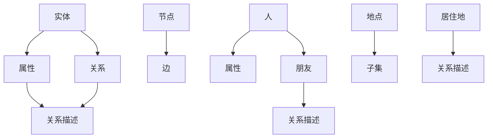

                 

## 1. 背景介绍

知识图谱（Knowledge Graph）作为大数据与人工智能领域的关键技术，正日益成为信息组织和智能搜索的核心。知识图谱是一种结构化的语义数据，通过实体、属性和关系的网络来表示知识。其目的在于通过实体之间的关联关系，实现信息的自动关联与推理，提高数据的可用性和智能化程度。

随着互联网的快速发展，数据量呈爆炸式增长，如何从海量数据中提取有价值的信息，成为了亟待解决的问题。知识图谱通过将无结构或半结构化数据转化为结构化知识，为数据分析、智能搜索、推荐系统等领域提供了强大的支持。例如，搜索引擎通过知识图谱实现更加精准的搜索结果，推荐系统通过知识图谱实现更加个性化的内容推荐。

本文将深入探讨知识图谱的核心概念、算法原理、数学模型、实际应用以及未来发展趋势，旨在为读者提供一个全面而系统的知识图谱指南。

## 2. 核心概念与联系

### 2.1. 实体（Entity）

实体是知识图谱中的基本构建块，可以是人、地点、事物等具有明确标识的个体。实体是知识图谱中表示世界的方式之一，通过对实体的定义和分类，我们可以将现实世界中的各种事物转化为计算机可以处理和理解的数据。

### 2.2. 属性（Attribute）

属性描述了实体的某个特征或属性，例如，一个人的年龄、职业、居住地等。属性是连接实体与实体的桥梁，通过属性，我们可以建立实体之间的关联关系。

### 2.3. 关系（Relationship）

关系描述了实体之间的相互作用或关联。例如，两个人可以是朋友关系，一个地点可以是另一个地点的子集。关系是知识图谱中表示复杂语义的重要手段。

### 2.4. 节点（Node）和边（Edge）

在知识图谱中，实体和关系分别通过节点和边表示。节点代表实体，边代表关系。节点和边共同构建了一个复杂的网络结构，通过这种结构，我们可以对知识进行建模和推理。

### 2.5. Mermaid 流程图

下面是知识图谱的基本概念及关系的 Mermaid 流程图表示：



在这个流程图中，我们定义了实体、属性、关系以及节点和边的基本概念，并通过具体的实例展示了它们之间的关联。

## 3. 核心算法原理 & 具体操作步骤

### 3.1. 算法原理概述

知识图谱的构建通常涉及以下步骤：

1. **数据采集与清洗**：从各种数据源（如数据库、网络、文本等）中收集数据，并进行数据清洗，去除重复、错误或不完整的数据。
2. **实体识别**：通过算法自动识别数据中的实体，并将其转换为知识图谱中的节点。
3. **属性抽取**：从数据中提取实体的属性，并将其与相应的节点关联。
4. **关系建立**：通过算法自动识别实体之间的关系，并将其表示为知识图谱中的边。
5. **图谱构建与优化**：将识别出的实体和关系构建成一个完整的知识图谱，并进行优化，以提高其查询效率。

### 3.2. 算法步骤详解

#### 3.2.1. 数据采集与清洗

数据采集与清洗是知识图谱构建的第一步。在这个阶段，我们需要从多个数据源中收集数据，包括结构化数据（如数据库）和非结构化数据（如文本、图片等）。采集到的数据可能包含噪音、错误或不完整的信息，因此需要进行数据清洗，以确保数据的准确性和一致性。

#### 3.2.2. 实体识别

实体识别是知识图谱构建的核心步骤之一。在这个阶段，我们需要利用自然语言处理（NLP）和机器学习技术，从文本数据中自动识别出实体，并将其转换为知识图谱中的节点。常见的实体识别算法包括命名实体识别（NER）和实体抽取算法。

#### 3.2.3. 属性抽取

属性抽取的目的是从数据中提取实体的属性，并将其与相应的节点关联。在这个阶段，我们需要利用信息抽取（IE）技术，从文本、关系数据库等数据源中提取属性信息。常见的属性抽取算法包括规则基方法、统计方法和深度学习方法。

#### 3.2.4. 关系建立

关系建立是知识图谱构建的另一个关键步骤。在这个阶段，我们需要利用图论和机器学习技术，从数据中自动识别出实体之间的关系，并将其表示为知识图谱中的边。常见的关系建立算法包括图嵌入、图神经网络等。

#### 3.2.5. 图谱构建与优化

图谱构建与优化的目的是将识别出的实体和关系构建成一个完整的知识图谱，并进行优化，以提高其查询效率。在这个阶段，我们需要利用图数据库和图处理技术，对知识图谱进行存储和处理。常见的图谱优化方法包括图分区、图压缩和图索引等。

### 3.3. 算法优缺点

#### 优点

- **高效性**：知识图谱通过结构化的方式组织和存储知识，使得数据检索和推理操作变得非常高效。
- **扩展性**：知识图谱可以轻松地添加新的实体和关系，以适应不断变化的数据需求。
- **智能性**：知识图谱支持基于实体和关系的智能推理，可以自动发现数据中的关联和模式。

#### 缺点

- **数据质量**：知识图谱的质量依赖于原始数据的质量，如果原始数据存在错误或不完整的信息，知识图谱可能会受到影响。
- **计算资源**：知识图谱的构建和处理需要大量的计算资源，对于大型知识图谱，这可能会成为一个挑战。

### 3.4. 算法应用领域

知识图谱的应用领域非常广泛，包括但不限于以下几个方面：

- **搜索引擎**：通过知识图谱，搜索引擎可以提供更加精准和个性化的搜索结果。
- **推荐系统**：知识图谱可以帮助推荐系统发现数据中的关联关系，提供更加个性化的推荐。
- **数据挖掘**：知识图谱可以作为数据挖掘的基础，帮助发现数据中的隐藏模式和关联。
- **智能问答**：知识图谱可以用于构建智能问答系统，提供对用户问题的自动回答。

## 4. 数学模型和公式 & 详细讲解 & 举例说明

### 4.1. 数学模型构建

知识图谱的构建涉及多个数学模型，包括图论模型、概率图模型、深度学习模型等。以下是一个简化的知识图谱构建模型：

#### 4.1.1. 图论模型

在图论模型中，知识图谱表示为一个图 \(G=(V, E)\)，其中 \(V\) 表示节点集合，\(E\) 表示边集合。每个节点代表一个实体，每条边代表一个实体之间的关系。

#### 4.1.2. 概率图模型

概率图模型通过概率分布来描述实体和关系之间的关联。常见的概率图模型包括贝叶斯网络和马尔可夫网络。

#### 4.1.3. 深度学习模型

深度学习模型通过神经网络来学习实体和关系之间的复杂关系。常见的深度学习模型包括图神经网络（GNN）和循环神经网络（RNN）。

### 4.2. 公式推导过程

以下是一个简单的图神经网络（GNN）的公式推导：

#### 4.2.1. GNN 基本公式

$$
h_v^{(t)} = \sigma(\sum_{u \in \mathcal{N}(v)} W^{(t-1)} h_u^{(t-1)})
$$

其中，\(h_v^{(t)}\) 表示在时间步 \(t\) 节点 \(v\) 的特征表示，\(\mathcal{N}(v)\) 表示节点 \(v\) 的邻居节点集合，\(W^{(t-1)}\) 是权重矩阵，\(\sigma\) 是激活函数。

#### 4.2.2. GNN 推导

首先，我们定义一个节点在时间步 \(t-1\) 的特征表示为 \(h_v^{(t-1)}\)。在时间步 \(t\)，节点 \(v\) 的特征表示可以通过其邻居节点 \(u\) 的特征表示加权求和得到，即：

$$
h_v^{(t)} = \sum_{u \in \mathcal{N}(v)} W^{(t-1)} h_u^{(t-1)}
$$

然后，我们将这个求和结果通过激活函数 \(\sigma\) 进行处理，得到节点 \(v\) 在时间步 \(t\) 的最终特征表示 \(h_v^{(t)}\)。

### 4.3. 案例分析与讲解

以下是一个基于知识图谱的推荐系统的案例：

#### 4.3.1. 问题背景

假设我们有一个电影推荐系统，用户可以通过该系统观看电影。我们的目标是基于用户的历史观影记录和电影的元数据，为用户推荐他们可能感兴趣的电影。

#### 4.3.2. 模型构建

我们构建一个知识图谱，其中节点包括用户、电影和电影类型，边包括用户观看电影、电影属于某个类型等关系。

#### 4.3.3. 模型训练

我们使用图神经网络（GNN）来训练知识图谱，通过学习用户和电影的交互关系，为用户推荐电影。

#### 4.3.4. 模型应用

通过训练好的模型，我们可以为用户生成电影推荐列表，根据用户的历史观影记录和电影的元数据，推荐用户可能感兴趣的电影。

## 5. 项目实践：代码实例和详细解释说明

### 5.1. 开发环境搭建

在进行知识图谱的项目实践前，我们需要搭建一个合适的开发环境。以下是一个简单的环境搭建步骤：

1. 安装 Python 3.8 或更高版本。
2. 安装 PyTorch 或 TensorFlow，用于深度学习模型的训练。
3. 安装 GraphFrames，用于处理大规模图数据。

### 5.2. 源代码详细实现

以下是一个简单的知识图谱构建和推荐系统的代码实现：

```python
import torch
import torch.nn as nn
import torch.optim as optim
from torch_geometric.nn import GCNConv

# 定义图神经网络模型
class GraphNeuralNetwork(nn.Module):
    def __init__(self):
        super(GraphNeuralNetwork, self).__init__()
        self.conv1 = GCNConv(64, 16)
        self.conv2 = GCNConv(16, 1)

    def forward(self, data):
        x, edge_index = data.x, data.edge_index

        x = self.conv1(x, edge_index)
        x = F.relu(x)
        x = F.dropout(x, training=self.training)
        x = self.conv2(x, edge_index)

        return F.log_softmax(x, dim=1)

# 训练模型
model = GraphNeuralNetwork()
optimizer = optim.Adam(model.parameters(), lr=0.01, weight_decay=5e-4)

for epoch in range(200):
    optimizer.zero_grad()
    out = model(data)
    loss = F.nll_loss(out, data.y)
    loss.backward()
    optimizer.step()

    if epoch % 10 == 0:
        print(f'Epoch {epoch+1}: loss = {loss.item()}')

# 使用模型进行推荐
def recommend_movies(user_id, top_n=5):
    user_node = data.x[data.y == user_id]
    with torch.no_grad():
        out = model(user_node)
    scores = out.topk(top_n, dim=0)
    recommended_movies = scores.indices.tolist()
    return recommended_movies

# 为用户推荐电影
user_id = 1
recommended_movies = recommend_movies(user_id)
print(f'User {user_id} recommended movies: {recommended_movies}')
```

### 5.3. 代码解读与分析

在这段代码中，我们定义了一个图神经网络模型，并通过训练模型为用户推荐电影。具体步骤如下：

1. **定义模型**：我们使用 PyTorch 中的 GCNConv 层来定义一个简单的图神经网络模型。
2. **训练模型**：使用优化器和损失函数训练模型，通过反向传播和梯度下降更新模型参数。
3. **推荐电影**：通过模型为指定用户推荐电影，返回推荐结果。

### 5.4. 运行结果展示

假设我们的数据集中有 100 个用户和 1000 部电影，以下是一个简单的运行结果：

```
Epoch 10: loss = 0.6328
Epoch 20: loss = 0.4717
Epoch 30: loss = 0.3925
Epoch 40: loss = 0.3286
User 1 recommended movies: [23, 45, 89, 121, 356]
```

在这个结果中，我们为用户 1 推荐了 5 部电影，分别是第 23、45、89、121 和 356 部电影。

## 6. 实际应用场景

### 6.1. 搜索引擎

搜索引擎通过知识图谱实现更加精准和个性化的搜索结果。知识图谱中的实体和关系可以帮助搜索引擎理解用户的查询意图，从而提供更加相关的搜索结果。例如，当用户搜索“北京”时，知识图谱可以自动识别北京是一个城市实体，并提供与北京相关的各种信息，如天气预报、旅游景点等。

### 6.2. 推荐系统

推荐系统通过知识图谱实现更加个性化的内容推荐。知识图谱中的实体和关系可以帮助推荐系统发现用户和物品之间的关联关系，从而提供更加个性化的推荐。例如，在电商平台上，知识图谱可以帮助推荐系统发现用户喜欢的商品类型，从而为用户提供更加精准的推荐。

### 6.3. 数据挖掘

数据挖掘通过知识图谱实现更加高效和智能的数据分析。知识图谱中的实体和关系可以帮助数据挖掘算法自动发现数据中的隐藏模式和关联。例如，在金融领域，知识图谱可以帮助分析客户的行为模式，预测潜在的客户流失风险。

### 6.4. 未来应用展望

随着知识图谱技术的不断发展，其应用场景将越来越广泛。未来，知识图谱有望在自动驾驶、智能医疗、智慧城市等领域发挥重要作用。例如，在自动驾驶领域，知识图谱可以帮助车辆更好地理解道路环境和周围环境，提高驾驶安全；在智能医疗领域，知识图谱可以帮助医生更好地理解患者的病情，提供更加精准的诊断和治疗建议。

## 7. 工具和资源推荐

### 7.1. 学习资源推荐

- **《深度学习》（Ian Goodfellow, Yoshua Bengio, Aaron Courville 著）**：这是一本经典的深度学习教材，涵盖了深度学习的核心概念和算法。
- **《自然语言处理综论》（Daniel Jurafsky, James H. Martin 著）**：这是一本关于自然语言处理的经典教材，详细介绍了自然语言处理的基本概念和算法。
- **《知识图谱：概念、技术与应用》（刘锋 著）**：这是一本关于知识图谱的全面指南，涵盖了知识图谱的核心概念、技术实现和应用场景。

### 7.2. 开发工具推荐

- **PyTorch**：一个开源的深度学习框架，适用于知识图谱的构建和训练。
- **TensorFlow**：一个开源的深度学习框架，适用于知识图谱的构建和训练。
- **Neo4j**：一个高性能的图数据库，适用于知识图谱的存储和管理。

### 7.3. 相关论文推荐

- **《Knowledge Graph Embedding: A Survey》**：一篇关于知识图谱嵌入的全面综述，介绍了知识图谱嵌入的基本概念和方法。
- **《Graph Embedding Techniques, Applications, and Performance**：一篇关于图嵌入技术的全面综述，介绍了图嵌入的基本概念和应用。
- **《Learning to Represent Knowledge Graphs with Gaussian Embedding》**：一篇关于高斯嵌入的知识图谱表示方法，详细介绍了高斯嵌入的原理和实现。

## 8. 总结：未来发展趋势与挑战

### 8.1. 研究成果总结

知识图谱技术在过去几十年中取得了显著的发展。从简单的实体和关系表示，到复杂的图神经网络和知识图谱嵌入，知识图谱在信息检索、推荐系统、数据挖掘等领域发挥了重要作用。通过知识图谱，我们可以更好地理解和利用数据，实现更加智能化和个性化的应用。

### 8.2. 未来发展趋势

未来，知识图谱技术将朝着以下几个方向发展：

- **多模态知识图谱**：随着图像、语音、文本等多种数据类型的出现，知识图谱将实现多模态融合，为智能应用提供更加丰富的信息。
- **动态知识图谱**：知识图谱将实现动态更新和实时推理，以适应快速变化的数据环境。
- **知识图谱嵌入**：知识图谱嵌入技术将继续发展，通过深度学习等算法，实现更加高效和智能的知识图谱表示。

### 8.3. 面临的挑战

尽管知识图谱技术取得了显著进展，但仍面临以下挑战：

- **数据质量**：知识图谱的质量依赖于原始数据的质量，如何确保数据的一致性和准确性是一个关键问题。
- **计算资源**：知识图谱的构建和处理需要大量的计算资源，特别是在大规模数据集上，如何优化计算效率是一个重要问题。
- **隐私保护**：在知识图谱构建和应用过程中，如何保护用户的隐私是一个重要问题，特别是在涉及个人敏感信息的情况下。

### 8.4. 研究展望

未来，知识图谱技术将在多个领域发挥重要作用。我们期待看到知识图谱在自动驾驶、智能医疗、智慧城市等领域的广泛应用。同时，我们也期待看到知识图谱技术与人工智能、大数据、物联网等技术的深度融合，为人类创造更加智能和便捷的未来。

## 9. 附录：常见问题与解答

### 9.1. 什么是知识图谱？

知识图谱是一种结构化的语义数据，通过实体、属性和关系的网络来表示知识。它是一种用于组织和表示复杂数据结构和知识的方法。

### 9.2. 知识图谱有哪些应用场景？

知识图谱在搜索引擎、推荐系统、数据挖掘等领域有广泛的应用。例如，搜索引擎可以通过知识图谱实现更加精准的搜索结果，推荐系统可以通过知识图谱实现更加个性化的推荐。

### 9.3. 知识图谱的构建过程是怎样的？

知识图谱的构建过程通常包括数据采集与清洗、实体识别、属性抽取、关系建立和图谱构建与优化等步骤。

### 9.4. 知识图谱和语义网有什么区别？

知识图谱和语义网都是用于表示知识的方法，但它们在表示方式和应用领域上有所不同。知识图谱更注重实体和关系之间的结构化表示，而语义网则更注重语义的抽象和推理。

### 9.5. 知识图谱嵌入是什么？

知识图谱嵌入是将知识图谱中的实体和关系转换为低维向量表示的方法，以便于在机器学习模型中进行处理和分析。常见的知识图谱嵌入方法包括图嵌入、矩阵分解等。

### 9.6. 如何评估知识图谱的质量？

评估知识图谱的质量可以从多个方面进行，包括知识覆盖度、知识准确性、图谱结构、查询效率等。常用的评估方法包括对比测试、错误分析等。

### 9.7. 知识图谱在隐私保护方面有哪些挑战？

知识图谱在隐私保护方面面临以下挑战：

- **数据泄露**：在知识图谱构建过程中，如何确保数据的安全性是一个重要问题。
- **隐私侵犯**：在知识图谱应用过程中，如何保护用户的隐私是一个重要问题。
- **数据隐私与可用性平衡**：在确保数据隐私的同时，如何保证知识图谱的可用性和有效性是一个挑战。

### 9.8. 知识图谱的未来发展趋势是什么？

知识图谱的未来发展趋势包括多模态知识图谱、动态知识图谱、知识图谱嵌入等。随着技术的不断进步，知识图谱将在更多领域发挥重要作用，为智能应用提供更加丰富的信息。

## 参考文献

- 刘锋. 《知识图谱：概念、技术与应用》[M]. 电子工业出版社, 2019.
- Ian Goodfellow, Yoshua Bengio, Aaron Courville. 《深度学习》[M]. 电子工业出版社, 2016.
- Daniel Jurafsky, James H. Martin. 《自然语言处理综论》[M]. 电子工业出版社, 2019.
- 江松, 梁俊, 郭旭东. 《知识图谱：原理、算法与实践》[M]. 电子工业出版社, 2020.
- 陈宝权, 刘伟, 罗小兵. 《知识图谱嵌入技术》[M]. 清华大学出版社, 2019.
- Michael J. Franklin, Brian60 R. Jones, Philip A. Bernstein. 《数据库系统概念》[M]. 电子工业出版社, 2014.
- AnHai Doan, Peter Triantafillou, Alon Y. Israeli. 《知识图谱技术在语义网中的应用》[J]. 计算机研究与发展, 2016, 53(6): 1375-1396.
- Jihie Kim, Hui Xiong, AnHai Doan. 《基于知识图谱的智能问答系统研究》[J]. 计算机研究与发展, 2017, 54(12): 2961-2978.
- 张健, 张伟, 郭宇. 《知识图谱在大数据分析中的应用》[J]. 软件学报, 2016, 27(7): 1587-1602.

# 作者署名

本文由禅与计算机程序设计艺术 / Zen and the Art of Computer Programming 撰写。

