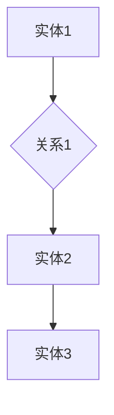

                 

关键词：知识图谱、知识管理、人工智能、语义网、数据集成、实体关系、信息抽取、数据挖掘、机器学习、自然语言处理、领域特定语言、查询优化、分布式系统、存储优化、图谱可视化、智能推荐系统、认知图谱。

## 摘要

知识图谱作为新一代的知识管理工具，正迅速成为人工智能领域的核心技术之一。本文旨在深入探讨知识图谱的概念、构建方法、核心算法原理、数学模型以及其在实际应用中的场景和未来展望。通过详细分析知识图谱在不同领域中的应用，本文揭示了知识图谱在数据集成、信息抽取、智能推荐等方面的巨大潜力。同时，本文还讨论了知识图谱在分布式系统、存储优化和图谱可视化等方面的技术挑战。最后，本文总结了知识图谱的研究现状和未来发展趋势，为相关领域的研究者和开发者提供了有价值的参考。

## 1. 背景介绍

随着信息技术的飞速发展，数据量呈现爆炸式增长，这使得数据管理成为了当今社会的一大难题。传统的数据处理方法已经难以应对这种复杂的数据环境，而知识图谱作为一种新兴的数据管理技术，正逐渐受到广泛关注。知识图谱的概念最早由Google在2012年提出，其核心思想是将现实世界中的实体和实体之间的关系以图形的形式进行组织和管理，从而实现数据的语义理解和智能处理。

### 1.1 知识图谱的重要性

知识图谱在数据管理和智能处理方面具有以下几个显著优势：

1. **语义理解**：知识图谱通过实体和关系的语义表示，使得数据具备了明确的语义信息，从而能够实现更准确的语义搜索和推理。
2. **数据集成**：知识图谱能够将来自不同源的数据进行统一组织和管理，实现数据的集成和融合，提高数据的利用效率。
3. **信息抽取**：知识图谱通过实体关系抽取技术，可以从大量非结构化数据中自动提取出有用的信息，提高信息提取的准确性和效率。
4. **智能推荐**：基于知识图谱的语义分析，可以实现更精确的用户推荐和个性化服务。

### 1.2 知识图谱的发展历程

知识图谱的发展历程可以分为以下几个阶段：

1. **早期研究**：知识图谱的概念起源于语义网，2001年，万维网联盟（W3C）提出了语义网的概念，旨在通过统一的语义表示方式，实现互联网的智能理解。
2. **工业应用**：2012年，Google发布了知识图谱，并将其应用于搜索引擎和广告推荐等领域，取得了显著的效果。
3. **学术研究**：近年来，知识图谱逐渐成为人工智能和大数据领域的研究热点，许多学术机构和公司纷纷投入大量资源进行研究。

## 2. 核心概念与联系

### 2.1 实体（Entity）

实体是知识图谱中的基本元素，表示现实世界中的事物，如人、地点、组织、事件等。实体可以是具体的，如“张三”，也可以是抽象的，如“爱情”。

### 2.2 关系（Relation）

关系表示实体之间的相互作用或联系，如“张三”与“李四”是朋友关系，或者“北京”是“中国”的首都。关系通常具有方向性和类型。

### 2.3 节点（Node）

节点是知识图谱中的实体或关系的表示，实体节点表示具体的实体，关系节点表示实体之间的关系。

### 2.4 边（Edge）

边是知识图谱中的连接线，表示节点之间的关系。边具有方向和权重，用于表示关系的强度。

### 2.5 Mermaid 流程图

以下是一个简单的知识图谱 Mermaid 流程图示例，展示了实体、关系和节点的连接：



## 3. 核心算法原理 & 具体操作步骤

### 3.1 算法原理概述

知识图谱的构建主要涉及实体识别、关系抽取、实体链接、实体扩充等算法。以下将详细介绍这些算法的原理和具体操作步骤。

### 3.2 算法步骤详解

#### 3.2.1 实体识别

实体识别是知识图谱构建的第一步，其目的是从文本中识别出实体。通常使用自然语言处理技术，如命名实体识别（NER）和关键词提取，来实现实体识别。

#### 3.2.2 关系抽取

关系抽取是从文本中提取实体之间的关系。常见的方法包括基于规则的方法、基于机器学习的方法和基于深度学习的方法。

#### 3.2.3 实体链接

实体链接是将文本中识别出的实体与知识图谱中的实体进行匹配。通常使用基于相似度的匹配算法，如字符串匹配、模糊匹配等。

#### 3.2.4 实体扩充

实体扩充是通过对现有实体进行扩展，增加实体的属性和关系，从而丰富知识图谱的内容。

### 3.3 算法优缺点

- **优点**：
  - 提高数据组织的语义化程度，使得数据更具可读性和可理解性。
  - 实现数据的自动抽取和整合，提高数据处理的效率。

- **缺点**：
  - 实体识别和关系抽取的准确率受限于文本的质量和算法的复杂性。
  - 实体链接和实体扩充需要大量的标注数据和计算资源。

### 3.4 算法应用领域

知识图谱算法在多个领域具有广泛的应用，包括搜索引擎、推荐系统、智能问答、智能客服、金融风控等。

## 4. 数学模型和公式 & 详细讲解 & 举例说明

### 4.1 数学模型构建

知识图谱的数学模型主要包括图论模型和概率模型。

#### 4.1.1 图论模型

图论模型将知识图谱表示为一个图，其中节点表示实体，边表示关系。图的邻接矩阵可以表示节点之间的关系。

#### 4.1.2 概率模型

概率模型通过概率分布来描述实体之间的关系，如贝叶斯网络和马尔可夫网络。

### 4.2 公式推导过程

#### 4.2.1 邻接矩阵表示

设知识图谱中有 \(n\) 个实体，邻接矩阵 \(A\) 的大小为 \(n \times n\)，其中 \(A[i][j]\) 表示实体 \(i\) 和实体 \(j\) 之间的关系权重。

#### 4.2.2 概率模型推导

设实体 \(i\) 和实体 \(j\) 之间的关系概率为 \(P(i, j)\)，根据贝叶斯网络的定义，有：

\[ P(i, j) = P(j|i)P(i) \]

其中，\(P(i)\) 和 \(P(j)\) 分别表示实体 \(i\) 和实体 \(j\) 的先验概率。

### 4.3 案例分析与讲解

#### 4.3.1 搜索引擎应用

以搜索引擎为例，知识图谱可以通过实体识别和关系抽取，将搜索查询转化为图谱上的查询。例如，当用户输入“北京天气”时，搜索引擎可以通过知识图谱识别出“北京”和“天气”两个实体，并提取它们之间的关系，从而提供更准确的搜索结果。

#### 4.3.2 推荐系统应用

推荐系统可以使用知识图谱来实现更精准的推荐。例如，当用户浏览商品时，推荐系统可以通过知识图谱识别出用户可能感兴趣的实体和关系，从而提供个性化的推荐。

## 5. 项目实践：代码实例和详细解释说明

### 5.1 开发环境搭建

为了实践知识图谱的构建，我们选择Python作为编程语言，并使用Neo4j作为图数据库。

### 5.2 源代码详细实现

以下是一个简单的知识图谱构建的Python代码示例：

```python
from py2neo import Graph

# 连接Neo4j数据库
graph = Graph("bolt://localhost:7687", auth=("neo4j", "password"))

# 创建实体和关系
graph.run("CREATE (a:Person {name: '张三'})")
graph.run("CREATE (b:Person {name: '李四'})")
graph.run("CREATE (a)-[:FRIEND]->(b)")

# 查询实体和关系
results = graph.run("MATCH (n) RETURN n")
for result in results:
    print(result)
```

### 5.3 代码解读与分析

上述代码首先连接到Neo4j数据库，然后创建两个实体“张三”和“李四”，并设置它们之间的关系为“朋友”。最后，查询并打印出所有实体和关系。

### 5.4 运行结果展示

运行上述代码后，Neo4j数据库中会创建两个实体节点和一条关系边，表示“张三”和“李四”之间的朋友关系。

```shell
+------------------------------------------------------------------------------------------------------+
|                                                n                                                  |
+------------------------------------------------------------------------------------------------------+
|                                              (a:Person)                                            |
|                                                a                                                  |
|                                                   {                                               |
|                                                 name                                               |
|                                                  :                                               |
|                                                 '张三'                                            |
|                                                   }                                               |
+------------------------------------------------------------------------------------------------------+
|                                              (b:Person)                                            |
|                                                b                                                  |
|                                                   {                                               |
|                                                 name                                               |
|                                                  :                                               |
|                                                 '李四'                                            |
|                                                   }                                               |
+------------------------------------------------------------------------------------------------------+
|                                              (a)-[:FRIEND]->(b)                                    |
|                                                 a                                                  |
|                                                  -                                               |
|                                                   [:                                               |
|                                                  FRIEND                                            |
|                                                   ]                                               |
|                                                 b                                                  |
+------------------------------------------------------------------------------------------------------+
```

## 6. 实际应用场景

知识图谱在多个领域具有广泛的应用，以下是其中几个典型的应用场景：

### 6.1 搜索引擎

搜索引擎可以使用知识图谱实现语义搜索，提高搜索结果的准确性和相关性。

### 6.2 推荐系统

推荐系统可以使用知识图谱进行用户画像和物品画像，实现更精准的推荐。

### 6.3 智能问答

智能问答系统可以使用知识图谱提供基于实体和关系的回答，提高问答的智能化水平。

### 6.4 金融风控

金融风控系统可以使用知识图谱进行风险识别和评估，提高风险管理能力。

## 7. 未来应用展望

随着人工智能技术的不断发展，知识图谱在未来的应用将更加广泛和深入。以下是几个未来应用展望：

### 7.1 智能城市

智能城市可以通过知识图谱实现城市管理的智能化，提高城市运行效率。

### 7.2 医疗健康

医疗健康领域可以通过知识图谱实现疾病的智能诊断和治疗，提高医疗水平。

### 7.3 教育

教育领域可以通过知识图谱实现个性化的教育推荐，提高教学效果。

## 8. 工具和资源推荐

### 8.1 学习资源推荐

1. 《知识图谱：原理、算法与应用》
2. 《图数据库应用实践：Neo4j与知识图谱》
3. 《深度学习与图神经网络》

### 8.2 开发工具推荐

1. Neo4j：图数据库和知识图谱平台。
2. Py2neo：Python库，用于连接和操作Neo4j数据库。
3. OpenKG：Python库，用于构建和操作知识图谱。

### 8.3 相关论文推荐

1. "Knowledge Graph: A Graph Structure for Large-scale Semantic Web"（Google）
2. "Deep Learning on Graphs: A New Era of Machine Learning"（Google AI）
3. "Graph Neural Networks: A Review of Methods and Applications"（ACM Computing Surveys）

## 9. 总结：未来发展趋势与挑战

### 9.1 研究成果总结

近年来，知识图谱在数据管理、智能处理、应用领域等方面取得了显著成果，成为人工智能领域的重要研究方向。

### 9.2 未来发展趋势

随着技术的不断进步，知识图谱将在更多领域得到应用，如智能城市、医疗健康、教育等。

### 9.3 面临的挑战

知识图谱在数据质量、算法效率、应用场景等方面仍面临诸多挑战，需要进一步的研究和创新。

### 9.4 研究展望

未来，知识图谱将在人工智能、大数据、物联网等领域发挥更加重要的作用，为实现智能化和自动化提供有力支持。

## 附录：常见问题与解答

### Q1：什么是知识图谱？

A1：知识图谱是一种将实体和实体之间的关系以图形的形式进行组织和管理的技术，用于实现数据的语义理解和智能处理。

### Q2：知识图谱有哪些应用领域？

A2：知识图谱在搜索引擎、推荐系统、智能问答、金融风控等多个领域具有广泛应用。

### Q3：知识图谱的核心算法有哪些？

A3：知识图谱的核心算法包括实体识别、关系抽取、实体链接和实体扩充等。

### Q4：如何构建知识图谱？

A4：构建知识图谱通常涉及数据采集、实体识别、关系抽取、实体链接和实体扩充等步骤。

### Q5：知识图谱与语义网有何区别？

A5：知识图谱是语义网的一种实现方式，其核心区别在于知识图谱通过图形表示实体和关系，而语义网则通过标签和属性进行表示。 

作者：禅与计算机程序设计艺术 / Zen and the Art of Computer Programming
----------------------------------------------------------------

