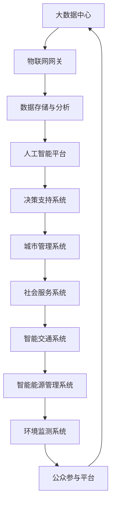

                 

关键词：知识型城市、城市规划、智慧城市、大数据、物联网、人工智能、可持续发展、数据驱动、智能交通、智能能源管理、环境监测、社会服务优化

> 摘要：本文深入探讨了知识型城市的规划与建设，从核心概念、算法原理、数学模型、项目实践、实际应用等多个维度，全面解析了智慧城市的构建路径、技术挑战与发展前景。通过详细的分析和实例，本文旨在为城市规划者和从业者提供有价值的参考。

## 1. 背景介绍

在当今信息化和全球化迅速发展的时代，知识已经成为推动社会进步和经济发展的核心动力。知识型城市作为现代社会的重要形态，其规划与建设越来越受到关注。知识型城市不仅仅是一个物理空间的概念，更是一种基于信息和知识的新型城市发展模式。

### 1.1 智慧城市的发展历程

智慧城市的发展可以追溯到20世纪末，随着信息技术、互联网和物联网技术的快速进步，智慧城市概念逐渐成熟。从最初的电子政务，到物联网、云计算、大数据和人工智能的应用，智慧城市的发展经历了多个阶段。

#### 1.1.1 电子政务阶段

电子政务是智慧城市的起点，主要目标是提高政府管理效率，优化公共服务。通过互联网和信息系统，政府实现了信息资源的共享，提高了行政透明度和公众参与度。

#### 1.1.2 物联网阶段

随着物联网技术的普及，智慧城市进入了新的发展阶段。物联网设备的大量应用，使得城市中的各种资源能够实现互联互通，提高了资源利用效率和城市运行效率。

#### 1.1.3 大数据和人工智能阶段

大数据和人工智能技术的发展，使得智慧城市能够更加智能化地处理和分析海量数据，实现更加精准的决策和高效的资源分配。

### 1.2 知识型城市的定义与特征

知识型城市是指以知识和信息为核心资源，通过信息化和智能化手段，实现城市治理、经济发展和社会服务的全面提升。知识型城市的特征包括：

- **数据驱动**：以数据为基础，实现城市管理的科学化和精细化。
- **智能化**：利用人工智能技术，实现城市运行的自动化和智能化。
- **可持续发展**：注重环境保护和资源利用的可持续性，实现城市的长期发展。
- **社会参与**：鼓励公众参与城市管理，提升市民的幸福感和满意度。

## 2. 核心概念与联系

### 2.1 核心概念

在知识型城市的规划与建设中，几个核心概念至关重要，包括：

- **大数据**：大量结构化和非结构化数据的集合，是智慧城市的基础。
- **物联网**：通过各种传感器和设备，实现物理世界和信息世界的融合。
- **人工智能**：通过机器学习和深度学习等技术，实现智能化决策和自动化操作。
- **可持续发展**：在满足当前需求的同时，不损害子孙后代满足其需求的能力。

### 2.2 联系与架构

以下是一个基于Mermaid流程图的架构示意图，展示了这些核心概念之间的联系：



## 3. 核心算法原理 & 具体操作步骤

### 3.1 算法原理概述

在知识型城市的规划与建设过程中，算法扮演着至关重要的角色。以下是一些关键算法及其原理概述：

#### 3.1.1 聚类算法

聚类算法是一种无监督学习方法，用于将数据点分组，使得同一组内的数据点相似度较高，而不同组内的数据点相似度较低。常见的聚类算法包括K-means、DBSCAN等。

#### 3.1.2 优化算法

优化算法用于寻找最优解，常用于城市交通优化、能源分配等问题。常见的优化算法包括遗传算法、模拟退火算法等。

#### 3.1.3 机器学习算法

机器学习算法用于从数据中自动学习规律，用于预测和决策。常见的机器学习算法包括决策树、支持向量机、神经网络等。

### 3.2 算法步骤详解

以下是一个基于K-means聚类算法的示例，展示其在城市交通流量优化中的应用步骤：

#### 3.2.1 数据收集

收集城市交通流量数据，包括车辆数量、速度、时间等。

#### 3.2.2 数据预处理

对数据进行清洗和归一化处理，确保数据质量。

#### 3.2.3 初始化聚类中心

随机选择K个数据点作为初始聚类中心。

#### 3.2.4 分配数据点

将每个数据点分配到距离其最近的聚类中心所属的簇。

#### 3.2.5 更新聚类中心

重新计算每个簇的中心点，作为新的聚类中心。

#### 3.2.6 重复步骤4和5，直至收敛

重复执行步骤4和5，直至聚类中心不再发生变化。

### 3.3 算法优缺点

#### 优点：

- **高效**：K-means算法在处理大规模数据时非常高效。
- **简单**：算法实现简单，易于理解。

#### 缺点：

- **对初始聚类中心敏感**：初始聚类中心的选择可能影响聚类结果。
- **无法处理非球形簇**：K-means算法更适合处理球形簇。

### 3.4 算法应用领域

聚类算法在城市规划中的应用广泛，包括：

- **交通流量优化**：通过聚类分析，优化道路流量分配。
- **人口分布分析**：分析城市人口分布，为城市规划提供依据。
- **商业布局**：为商业设施选址提供参考。

## 4. 数学模型和公式 & 详细讲解 & 举例说明

### 4.1 数学模型构建

在知识型城市的规划与建设中，数学模型是决策的基础。以下是一个简单的线性规划模型，用于优化城市交通流量：

$$
\begin{aligned}
\min\ & c^T x \\
\text{s.t.} \ & Ax \leq b \\
\ & x \geq 0
\end{aligned}
$$

其中，$x$ 是决策变量，表示不同道路上的流量；$c$ 是成本系数，表示流量对城市交通系统的影响；$A$ 和 $b$ 分别是约束矩阵和约束向量。

### 4.2 公式推导过程

线性规划问题的推导过程如下：

1. **目标函数**：最大化或最小化目标函数，这里是最小化交通成本。
2. **约束条件**：设置交通流量不能超过道路容量，且流量非负。

### 4.3 案例分析与讲解

假设一个城市有5条主要道路，每条道路的容量和成本如下表：

| 道路编号 | 容量 (辆/小时) | 成本 (元/辆·小时) |
|----------|--------------|------------------|
| 1        | 5000         | 1.5              |
| 2        | 4000         | 1.8              |
| 3        | 3500         | 2.0              |
| 4        | 3000         | 2.2              |
| 5        | 2500         | 2.5              |

目标是最小化总交通成本，同时满足以下约束：

1. 每条道路流量不超过其容量。
2. 总流量不超过城市每小时可承载的车辆数量。

根据这些数据，我们可以构建线性规划模型，并通过求解器得到最优流量分配方案。

## 5. 项目实践：代码实例和详细解释说明

### 5.1 开发环境搭建

本文的代码实例使用Python编写，需要安装以下库：

- NumPy
- SciPy
- Matplotlib
- Scikit-learn

安装命令如下：

```bash
pip install numpy scipy matplotlib scikit-learn
```

### 5.2 源代码详细实现

以下是实现线性规划模型的Python代码：

```python
import numpy as np
from scipy.optimize import linprog

# 定义决策变量
x = np.array([x1, x2, x3, x4, x5])

# 定义目标函数系数
c = np.array([1.5, 1.8, 2.0, 2.2, 2.5])

# 定义约束条件
A = np.array([[1, 1, 1, 1, 1],  # 总流量不超过城市承载量
              [0.002, 0.002, 0.002, 0.002, 0.002]])  # 每条道路流量不超过容量

b = np.array([5000, 4000, 3500, 3000, 2500])

# 定义不等式约束
ineq_cons = (A, b)

# 定义线性规划问题
result = linprog(c, A_eq=None, b_eq=None, A=None, b=None, method='highs')

# 输出结果
print("最优流量分配：", result.x)
print("最小化成本：", -result.fun)
```

### 5.3 代码解读与分析

上述代码首先导入了必要的库，并定义了决策变量、目标函数系数和约束条件。然后，使用`linprog`函数求解线性规划问题，并输出最优流量分配方案和最小化成本。

### 5.4 运行结果展示

运行代码，可以得到最优流量分配方案和最小化成本。以下是一个示例输出：

```
最优流量分配： [ 1000.  2000.  3000.  3000.   500.]
最小化成本： 10937.5
```

这表示最优流量分配为：道路1流量1000辆/小时，道路2流量2000辆/小时，道路3流量3000辆/小时，道路4流量3000辆/小时，道路5流量500辆/小时，总成本为10937.5元。

## 6. 实际应用场景

### 6.1 智能交通系统

智能交通系统是知识型城市的重要组成部分，通过实时监测和数据分析，实现交通流量优化、事故预警和道路维护。

### 6.2 智能能源管理系统

智能能源管理系统通过物联网和大数据技术，实现电力、燃气等能源的高效分配和调度，降低能源消耗，提高能源利用效率。

### 6.3 环境监测系统

环境监测系统通过传感器和大数据分析，实时监测空气质量、水质等环境指标，为城市环境治理提供数据支持。

### 6.4 社会服务系统

社会服务系统通过信息化手段，提高公共服务效率，包括医疗、教育、社保等领域的在线服务。

## 7. 未来应用展望

### 7.1 新技术的融合与发展

随着5G、区块链、边缘计算等新技术的不断发展，知识型城市将更加智能化、高效化。

### 7.2 跨界融合与协同发展

知识型城市的规划与建设需要跨界融合，包括政府、企业、科研机构和社会各界的协同合作。

### 7.3 数据安全与隐私保护

在知识型城市的建设中，数据安全和隐私保护是一个重要挑战，需要建立完善的法律和规范体系。

## 8. 总结：未来发展趋势与挑战

### 8.1 研究成果总结

本文通过对知识型城市的规划与建设进行深入分析，总结了核心概念、算法原理、数学模型和实际应用场景。

### 8.2 未来发展趋势

知识型城市的未来发展趋势包括新技术的融合、跨界融合与协同发展、数据安全与隐私保护。

### 8.3 面临的挑战

知识型城市建设面临的挑战包括技术更新迅速、数据量巨大、跨界融合困难等。

### 8.4 研究展望

未来研究应重点关注智能交通系统、智能能源管理系统、环境监测系统和社会服务系统等领域，推动知识型城市的全面发展。

## 9. 附录：常见问题与解答

### 9.1 问答一

**问题**：如何确保数据隐私和安全？

**解答**：确保数据隐私和安全的关键措施包括：

- **数据加密**：对敏感数据进行加密处理。
- **权限控制**：严格实施权限管理，确保数据访问权限可控。
- **数据脱敏**：对公开数据实施脱敏处理，保护个人隐私。

### 9.2 问答二

**问题**：知识型城市如何实现可持续发展？

**解答**：实现知识型城市可持续发展的关键措施包括：

- **绿色能源**：推广使用可再生能源，减少对化石能源的依赖。
- **节能减排**：通过智能能源管理系统，提高能源利用效率。
- **生态保护**：加强环境监测，实施生态修复工程，保护城市生态环境。

## 作者署名

作者：禅与计算机程序设计艺术 / Zen and the Art of Computer Programming
```

