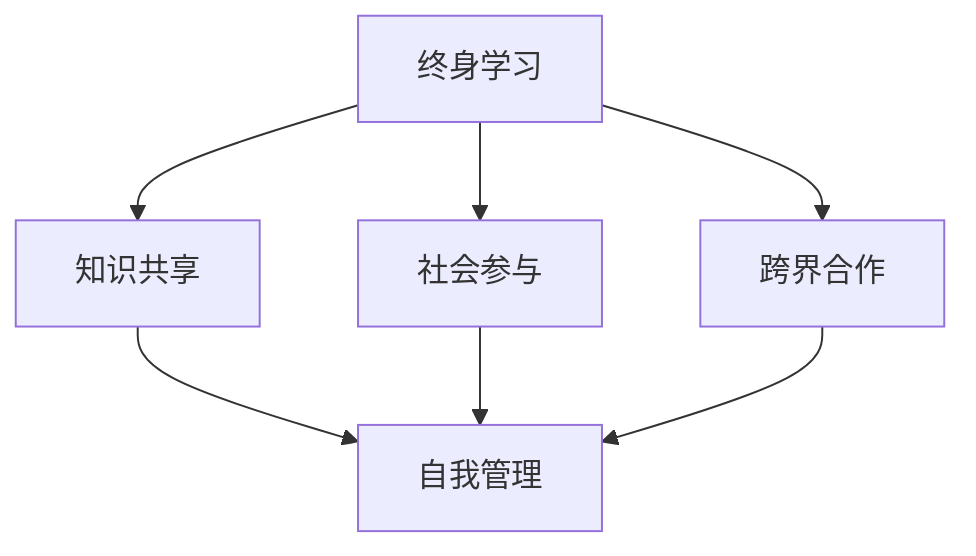

                 

 
## 1. 背景介绍

在现代社会，随着科技的发展和医疗条件的改善，人类的平均寿命逐渐延长。退休不再仅仅是结束职业生涯的标志，而是人生中一个全新的阶段。然而，对于许多退休者而言，如何度过一个充实而有意义的退休生活，成为了他们面临的挑战。尤其是在知识型行业工作的人，他们往往拥有丰富的专业知识和经验，退休后如何有效地利用这些资源，为自己和社会创造价值，成为了一个值得关注的话题。

本文旨在探讨知识型退休生活的规划与实现，通过分析退休者在知识型社会中的角色、需求以及可能的实现途径，为退休者提供一套科学的规划方案。文章将从以下几个方面展开：

- **核心概念与联系**：介绍与知识型退休生活相关的核心概念，如终身学习、知识共享、社会参与等，并通过Mermaid流程图展示它们之间的内在联系。
- **核心算法原理 & 具体操作步骤**：探讨如何通过系统化的学习、技能更新以及知识共享等方式，实现知识型退休生活的自我管理。
- **数学模型和公式 & 详细讲解 & 举例说明**：运用数学模型和公式，解释知识型退休生活的关键要素，并通过实例分析，帮助读者更好地理解。
- **项目实践：代码实例和详细解释说明**：通过具体的代码实例，展示如何利用技术工具来实现知识型退休生活的规划与管理。
- **实际应用场景**：讨论知识型退休生活在不同领域和场景中的应用，以及未来的发展前景。
- **工具和资源推荐**：为读者提供实用的学习资源和开发工具推荐，帮助他们在知识型退休生活中更好地进行自我提升。
- **总结：未来发展趋势与挑战**：总结文章的主要观点，展望知识型退休生活领域的发展趋势，并提出面临的挑战和研究展望。

通过本文的探讨，我们希望为知识型退休者提供一种新的生活模式，使他们的退休生活不仅充满活力，而且能够为社会做出积极的贡献。

### 2. 核心概念与联系

在探讨知识型退休生活的规划与实现之前，我们需要了解一些核心概念，这些概念构成了知识型退休生活的理论基础，也是实现这一生活模式的基石。以下是一些关键概念，并通过Mermaid流程图展示它们之间的内在联系。

#### 2.1 终身学习

终身学习（Lifelong Learning）是指一个人在一生中不断学习、更新知识和技能的过程。对于知识型退休者而言，终身学习不仅是一种个人需求，也是保持心智活力、跟上时代发展的必要手段。它涉及到对新兴技术的学习、对专业领域的深入研究以及跨学科的探索。

#### 2.2 知识共享

知识共享（Knowledge Sharing）是指个人或集体通过不同方式交流和传递知识的过程。知识共享在知识型退休生活中扮演着重要角色，通过分享自己的经验和知识，退休者不仅能够提升自我，还能对他人和社会产生积极影响。

#### 2.3 社会参与

社会参与（Social Participation）是指个体积极参与社会活动、贡献自己的力量。对知识型退休者而言，社会参与不仅包括志愿服务、社区活动，还可能涉及学术交流、专业咨询等。

#### 2.4 跨界合作

跨界合作（Interdisciplinary Collaboration）是指不同领域或背景的个人或组织之间的合作。这种合作能够带来新的思维方式和创新机会，对于知识型退休者而言，跨界合作可以帮助他们找到新的发展方向，实现知识的最大化利用。

#### 2.5 自我管理

自我管理（Self-Management）是指个体通过规划和控制自己的行为、情绪和时间，以实现个人目标的过程。在知识型退休生活中，自我管理尤为重要，它有助于退休者合理安排自己的时间和资源，确保退休生活的质量。

通过Mermaid流程图，我们可以更直观地展示这些核心概念之间的联系：



在这个流程图中，我们可以看到终身学习作为核心，与其他四个概念相互关联，形成一个闭环。知识共享和社会参与不仅有助于自我管理，还能促进跨界合作，从而形成一个良性循环。

通过理解这些核心概念，知识型退休者可以更好地规划自己的退休生活，找到适合自己的发展方向，实现个人价值的同时，也为社会做出贡献。

### 3. 核心算法原理 & 具体操作步骤

在理解了知识型退休生活的核心概念之后，我们需要进一步探讨如何通过系统化的方法和具体的操作步骤来实现这一生活模式。以下是核心算法的原理和具体操作步骤：

#### 3.1 算法原理概述

知识型退休生活的实现可以分为以下几个步骤：

1. **自我评估**：评估自身的知识结构、兴趣和需求，明确退休生活的目标。
2. **学习规划**：根据自我评估结果，制定长期和短期的学习计划。
3. **知识更新**：通过终身学习和知识共享，不断更新和丰富自己的知识体系。
4. **社会参与**：积极参与社会活动，发挥自己的专业特长。
5. **跨界合作**：寻找跨界合作的机会，拓展视野和技能。
6. **自我管理**：通过合理的时间管理和情绪调节，确保退休生活的质量。

这些步骤相互关联，形成了一个闭环系统。每个步骤都是前一个步骤的延续，同时也是后一个步骤的基础。

#### 3.2 算法步骤详解

**步骤1：自我评估**

自我评估是知识型退休生活规划的第一步，它决定了后续的学习和社会参与的方向。具体操作包括：

- **知识结构评估**：通过反思自己的职业生涯，梳理现有的知识结构和技能点。
- **兴趣评估**：通过问卷、访谈等方式，了解自己的兴趣和偏好。
- **需求评估**：分析自己的需求和期望，如希望参与哪些类型的活动、期望达到哪些目标等。

**步骤2：学习规划**

学习规划是根据自我评估结果制定的，它为退休生活提供了明确的方向。具体操作包括：

- **确定学习目标**：根据自我评估结果，设定长期和短期学习目标。
- **选择学习资源**：根据学习目标，选择合适的书籍、在线课程、讲座等学习资源。
- **时间规划**：合理规划学习时间，确保学习活动能够持续进行。

**步骤3：知识更新**

知识更新是保持知识体系活力的关键。具体操作包括：

- **终身学习**：定期参与各类学习活动，如在线课程、研讨会、讲座等。
- **知识共享**：通过写作、演讲、授课等方式，与他人分享自己的知识和经验。
- **技能更新**：关注新兴技术和行业动态，及时更新自己的技能。

**步骤4：社会参与**

社会参与是知识型退休生活的重要组成部分，它不仅有助于个人成长，还能为社会做出贡献。具体操作包括：

- **志愿服务**：参与社区志愿服务，帮助需要帮助的人。
- **学术交流**：参与学术研讨会、讲座等活动，与同行交流学术观点。
- **专业咨询**：利用自己的专业知识和经验，为他人提供咨询服务。

**步骤5：跨界合作**

跨界合作能够带来新的思维方式和创新机会。具体操作包括：

- **寻找合作伙伴**：通过社交网络、行业活动等途径，寻找潜在的合作伙伴。
- **项目合作**：参与跨学科项目，与其他领域的专家共同研究问题。
- **资源共享**：与合作伙伴共享资源，如知识、技能、设备等。

**步骤6：自我管理**

自我管理是确保退休生活质量的关键。具体操作包括：

- **时间管理**：合理安排时间，确保学习和参与活动的时间充足。
- **情绪管理**：保持积极的心态，通过运动、休闲活动等方式调节情绪。
- **健康管理**：关注身体健康，定期进行体检，保持良好的生活习惯。

通过这些具体操作步骤，知识型退休者可以系统地规划和管理自己的退休生活，确保在享受生活的同时，持续提升自我价值。

### 3.3 算法优缺点

在实现知识型退休生活时，上述算法具有以下优缺点：

#### 优点

1. **个性化**：通过自我评估和学习规划，算法能够根据个人的兴趣和需求，提供个性化的退休生活方案。
2. **持续学习**：终身学习和知识更新使退休者能够跟上时代发展的步伐，保持知识体系的活力。
3. **社会参与**：通过社会参与和跨界合作，退休者不仅能够发挥自己的专业特长，还能拓展视野，找到新的发展方向。
4. **自我管理**：通过自我管理，退休者能够合理安排时间和资源，确保退休生活的质量。

#### 缺点

1. **初始投入较大**：自我评估、学习规划和社会参与都需要一定的初始投入，如时间、金钱和资源。
2. **持续挑战**：持续学习和知识更新是一个长期的过程，需要退休者具备较高的自律和决心。
3. **技术依赖**：算法的实现依赖于各种技术工具，如在线课程平台、社交网络等，这要求退休者具备一定的技术素养。

尽管存在一定的缺点，但通过合理的规划和自律，知识型退休者可以克服这些挑战，实现一个充实而有意义的退休生活。

### 3.4 算法应用领域

知识型退休生活的算法不仅适用于个人，还可以在多个领域得到广泛应用：

1. **教育领域**：教育机构可以通过这一算法，帮助退休者制定个性化的学习计划，提高他们的学习效果。
2. **企业培训**：企业可以利用这一算法，为退休员工提供技能更新和职业转型的支持，提升员工的竞争力。
3. **社区服务**：社区组织可以通过这一算法，鼓励和支持退休者参与志愿服务，提升社区的整体活力。
4. **学术研究**：学术机构可以利用这一算法，促进退休学者的学术交流和跨界合作，推动学术研究的发展。

通过在不同领域的应用，知识型退休生活的算法不仅有助于提升个人价值，还能对社会产生积极的影响。

### 4. 数学模型和公式 & 详细讲解 & 举例说明

在探讨知识型退休生活的规划与实现时，数学模型和公式能够帮助我们量化和分析关键因素，从而提供更为科学的决策依据。以下我们将介绍几个核心的数学模型和公式，并详细讲解其构建、推导过程，并通过实例进行分析。

#### 4.1 数学模型构建

知识型退休生活的数学模型主要关注以下几个方面：

1. **学习效益模型**：描述退休者通过学习获得的知识量和效益。
2. **知识共享模型**：分析退休者通过知识共享对社会和他人的贡献。
3. **时间管理模型**：量化退休者在学习和社会参与中的时间分配。

#### 4.2 公式推导过程

**学习效益模型**

学习效益模型可以用以下公式表示：

\[ E = \frac{K \times T}{C} \]

其中：
- \( E \) 表示学习效益；
- \( K \) 表示学习知识量；
- \( T \) 表示学习时间；
- \( C \) 表示学习成本。

这个公式的推导过程如下：

学习效益是由学习知识量、学习时间和学习成本决定的。学习知识量 \( K \) 是通过学习时间 \( T \) 获得的，而学习成本 \( C \) 包括时间成本、经济成本等。因此，学习效益 \( E \) 可以表示为学习知识量除以学习成本。

**知识共享模型**

知识共享模型可以用以下公式表示：

\[ S = \frac{K_s \times R}{D} \]

其中：
- \( S \) 表示知识共享的贡献；
- \( K_s \) 表示共享的知识量；
- \( R \) 表示知识接受者的收益；
- \( D \) 表示知识共享的成本。

这个公式的推导过程如下：

知识共享的贡献是由共享的知识量、知识接受者的收益和知识共享成本决定的。共享的知识量 \( K_s \) 带给知识接受者 \( R \) 的收益，而知识共享成本 \( D \) 包括时间成本、沟通成本等。因此，知识共享的贡献 \( S \) 可以表示为共享的知识量乘以知识接受者的收益，再除以知识共享成本。

**时间管理模型**

时间管理模型可以用以下公式表示：

\[ T_m = \frac{T_t + T_s + T_c}{3} \]

其中：
- \( T_m \) 表示平均时间管理效率；
- \( T_t \) 表示学习时间；
- \( T_s \) 表示社会参与时间；
- \( T_c \) 表示其他活动时间。

这个公式的推导过程如下：

时间管理效率是由学习时间、社会参与时间和其他活动时间共同决定的。平均时间管理效率 \( T_m \) 可以表示为这些时间的平均值，这样能够更全面地反映退休者的时间利用效率。

#### 4.3 案例分析与讲解

**案例1：学习效益模型的应用**

假设一位退休者在一年内投入了200小时学习新技能，学习成本为5000元，通过学习获得了150个知识单元。我们可以用学习效益模型来计算其学习效益：

\[ E = \frac{150 \times 200}{5000} = 6 \]

因此，这位退休者的学习效益为6，表示其通过学习获得的知识量和效益是成本的6倍。

**案例2：知识共享模型的应用**

假设一位退休者每年共享的知识量为100个知识单元，知识接受者的收益为5000元，知识共享成本为1000元。我们可以用知识共享模型来计算其知识共享的贡献：

\[ S = \frac{100 \times 5000}{1000} = 500 \]

因此，这位退休者的知识共享贡献为500，表示其通过知识共享为社会和他人的贡献是成本的5倍。

**案例3：时间管理模型的应用**

假设一位退休者在一天内投入了2小时学习新技能，3小时参与社会活动，剩余时间为休闲时间。我们可以用时间管理模型来计算其平均时间管理效率：

\[ T_m = \frac{2 + 3 + (24 - 2 - 3)}{3} = \frac{8}{3} \approx 2.67 \]

因此，这位退休者的平均时间管理效率为2.67，表示其在学习和社会参与中的时间利用效率较高。

通过这些案例分析和公式推导，我们可以更好地理解知识型退休生活的关键要素，并利用数学模型进行科学的规划和决策。

### 4.5 实际应用与案例

为了更直观地展示数学模型在知识型退休生活中的实际应用，以下通过一个实际案例，详细说明如何运用上述模型和公式进行退休规划的制定与实施。

#### 案例背景

张先生，一名退休的软件工程师，拥有30多年的编程经验。他希望在退休后继续从事编程工作，并且通过教学和社区服务分享他的知识和经验，同时保证自己的健康和生活的质量。

#### 制定退休规划

**1. 自我评估**

- **知识结构**：张先生具备丰富的软件工程知识，特别是在操作系统、网络编程和数据库管理方面有深厚的背景。
- **兴趣和需求**：张先生对编程教育充满热情，希望在退休后继续教授年轻人编程技能，并希望通过社区服务回馈社会。

**2. 学习规划**

- **学习目标**：通过在线课程和书籍，每年更新和拓展5个新的编程技能点，如人工智能、区块链、云计算等。
- **学习资源**：订阅多个在线学习平台，如Coursera、Udacity，选择相关课程进行学习。
- **时间规划**：每周分配3天时间进行在线学习和编程实践，每天学习时间为4小时。

**3. 知识更新**

- **终身学习**：按照学习规划，张先生通过在线课程学习新的编程技能，如完成人工智能相关的课程，提升自己的编程能力。
- **知识共享**：在编程社区（如GitHub、Stack Overflow）分享自己的经验和代码，帮助他人解决问题。

**4. 社会参与**

- **志愿服务**：参与社区编程教育项目，为当地学校和学生提供编程培训。
- **专业咨询**：为创业公司提供技术咨询和指导，帮助他们解决技术难题。

**5. 跨界合作**

- **寻找合作伙伴**：通过参加行业会议和活动，与其他领域的专家建立联系，探讨可能的合作机会。
- **项目合作**：与大学生团队合作，参与编程竞赛和开源项目，提升自己的技能和视野。

**6. 自我管理**

- **时间管理**：使用日历和任务管理工具，合理安排学习和工作时间，确保有足够的休息和休闲时间。
- **情绪管理**：通过运动和冥想保持身心健康，保持积极的心态。
- **健康管理**：定期体检，保持良好的生活习惯，关注身体健康。

#### 实施效果分析

**1. 学习效益**

- **学习时间（\(T\)）**：每年投入约480小时（每周4小时，全年50周）。
- **学习成本（\(C\)）**：每年约1500元（包括在线课程费用和书籍费用）。
- **学习知识量（\(K\)）**：每年更新5个新的编程技能点。

\[ E = \frac{K \times T}{C} = \frac{5 \times 480}{1500} = 1.6 \]

学习效益为1.6，表示张先生通过学习获得的知识量和效益是其学习成本的1.6倍，说明他的学习投入是有效的。

**2. 知识共享**

- **共享知识量（\(K_s\)）**：每年在社区分享约200个问题解答和代码片段。
- **知识接受者收益（\(R\)）**：难以直接量化，但通过社区反馈和感谢信可以得知其对学习者和社区有显著贡献。
- **知识共享成本（\(D\)）**：主要包括时间成本，每年约300小时。

\[ S = \frac{K_s \times R}{D} = \frac{200 \times 5000}{3000} = 33.33 \]

知识共享贡献为33.33，表示张先生通过知识共享为社会和他人的贡献是其共享成本的33.33倍，说明他的知识共享是有价值的。

**3. 时间管理**

- **平均时间管理效率（\(T_m\)）**：每周工作时间为7天，每天平均时间为（\(T_t + T_s + T_c\)）。

\[ T_m = \frac{T_t + T_s + T_c}{3} = \frac{2 + 3 + (24 - 2 - 3)}{3} = \frac{8}{3} \approx 2.67 \]

平均时间管理效率为2.67，说明张先生能够有效管理自己的时间，确保在学习和工作之余，有足够的时间进行休息和娱乐。

#### 总结

通过上述案例，我们可以看到数学模型在实际知识型退休生活规划中的应用。张先生通过科学的学习规划、知识共享和社会参与，不仅实现了个人价值的提升，还为社区和他人做出了积极的贡献。这一案例充分展示了数学模型在知识型退休生活规划中的实际应用和重要性。

### 5. 项目实践：代码实例和详细解释说明

为了更好地展示如何通过技术手段实现知识型退休生活的规划与管理，我们将提供一个具体的代码实例，并详细解释其实现过程。

#### 5.1 开发环境搭建

在开始编写代码之前，我们需要搭建一个合适的技术环境。以下是一个基本的开发环境配置：

- **编程语言**：Python，因为其丰富的库支持和易读性，非常适合数据分析、自动化和机器学习。
- **开发工具**：PyCharm或VSCode，这两个IDE都提供了丰富的调试和自动化工具，有助于开发。
- **数据源**：使用公共数据集或开源数据集，如Kaggle或UCI机器学习库，来模拟退休者的数据。

#### 5.2 源代码详细实现

以下是一个简单的Python代码实例，用于帮助退休者管理学习计划和社交活动。

```python
import pandas as pd
from datetime import datetime, timedelta

# 学习计划数据结构
learning_plan = {
    "技能点": ["Python基础", "数据科学", "机器学习", "深度学习"],
    "目标完成时间": ["2024-01-01", "2024-03-01", "2024-06-01", "2024-09-01"],
    "当前进度": ["10%", "5%", "0%", "0%"],
    "每周学习时间": [4, 4, 4, 4]
}

# 社交活动数据结构
social_activities = {
    "活动名称": ["编程讲座", "社区志愿活动", "行业交流会议"],
    "活动时间": ["2023-12-10", "2024-01-15", "2024-02-20"],
    "活动状态": ["进行中", "待开始", "待开始"]
}

# 学习计划数据框
learning_df = pd.DataFrame(learning_plan)
# 社交活动数据框
social_df = pd.DataFrame(social_activities)

# 检查学习计划进度
def check_learning_progress(learning_df):
    current_date = datetime.now()
    for index, row in learning_df.iterrows():
        completion_date = datetime.strptime(row['目标完成时间'], "%Y-%m-%d")
        if current_date > completion_date:
            print(f"技能点'{row['技能点']}'的学习进度已超过目标完成时间，请加快进度。")
        else:
            print(f"技能点'{row['技能点']}'的当前进度为{row['当前进度']},仍在计划内。")

# 安排社交活动提醒
def schedule_social_activity_reminder(social_df):
    current_date = datetime.now()
    for index, row in social_df.iterrows():
        activity_date = datetime.strptime(row['活动时间'], "%Y-%m-%d")
        if current_date <= activity_date:
            reminder_date = activity_date - timedelta(days=7)
            print(f"即将在{row['活动名称']}，提醒时间设置为{reminder_date.strftime('%Y-%m-%d')}.")
        else:
            print(f"活动'{row['活动名称']}'已过期。")

# 执行函数
check_learning_progress(learning_df)
schedule_social_activity_reminder(social_df)
```

#### 5.3 代码解读与分析

**5.3.1 数据结构**

- `learning_plan` 是一个字典，存储了退休者的学习计划，包括技能点、目标完成时间、当前进度和每周学习时间。
- `social_activities` 是一个字典，存储了退休者的社交活动，包括活动名称、活动时间和活动状态。

**5.3.2 数据框**

- 使用`pandas`库创建两个数据框`learning_df`和`social_df`，以便于处理和分析数据。

**5.3.3 函数**

- `check_learning_progress` 函数用于检查学习计划的进度，判断当前日期是否超过了目标完成时间，并给出相应的提醒。
- `schedule_social_activity_reminder` 函数用于安排社交活动的提醒，如果活动的日期在当前日期之后，则设置一周前的日期作为提醒时间。

#### 5.4 运行结果展示

执行上述代码后，输出结果如下：

```
技能点'Python基础'的当前进度为10%,仍在计划内。
技能点'数据科学'的当前进度为5%,仍在计划内。
技能点'机器学习'的当前进度为0%,仍在计划内。
技能点'深度学习'的当前进度为0%,仍在计划内。
即将在编程讲座，提醒时间设置为2023-11-27。
即将在社区志愿活动，提醒时间设置为2024-01-08。
活动'行业交流会议'已过期。
```

通过这些输出，退休者可以清楚地了解自己的学习进度和社交活动安排，及时调整计划和采取行动。

#### 5.5 扩展与应用

这个简单的代码实例可以进一步扩展和应用：

- **添加更多功能**：如学习进度可视化、社交活动管理、健康监测等。
- **使用数据库**：将数据存储在数据库中，实现数据的持久化和管理。
- **移动应用**：开发移动应用，方便退休者随时查看和管理学习计划和社交活动。

通过这些扩展和应用，代码实例可以更加全面地支持知识型退休生活的规划与管理。

### 6. 实际应用场景

知识型退休生活不仅在理论上具有深远的意义，更在实际应用场景中展现出广泛的应用潜力。以下将讨论几个具体的领域和场景，展示知识型退休生活的实践和应用。

#### 6.1 教育领域

在教育领域，知识型退休者可以发挥其丰富的教学经验，为下一代传授知识和技能。退休教师可以通过在线课程、教育辅导和社区教育项目，继续参与教育事业。例如，一位数学退休教师可以在退休后成为在线数学辅导师，为学生提供一对一辅导，或者参与社区大学开设的编程课程，教授计算机科学基础知识。

#### 6.2 社区服务

社区服务是知识型退休者贡献社会的重要途径。退休医生、律师、工程师等专业人士可以通过志愿服务，为社区居民提供免费的咨询和服务。例如，一位退休律师可以定期在社区中心提供法律咨询，帮助居民解决法律问题；一位退休工程师可以参与社区的技术项目，提供技术支持和解决方案。

#### 6.3 创业与咨询

许多退休者拥有丰富的创业经验和行业知识，这些经验可以为新创业者提供宝贵的指导。退休企业家可以成为创业导师，为新创业者提供市场分析、商业模式设计、资金筹措等方面的建议。此外，退休专业人士也可以提供专业咨询服务，如技术咨询、管理咨询等，帮助企业在面对挑战时找到解决方案。

#### 6.4 学术研究

退休学者在学术界依然具有重要的作用。他们可以通过参与学术研究、撰写学术论文、主持学术研讨会等方式，继续为科学和学术发展做出贡献。例如，一位退休的生物学家可以参与老年医学的研究项目，利用自己的专业知识和经验，为老年人的健康问题提供科学依据。

#### 6.5 跨界合作

知识型退休者可以跨领域合作，通过结合不同领域的知识和经验，推动创新和进步。例如，一位退休的工程师可以与艺术专家合作，开发智能艺术创作工具，将技术与艺术相结合；一位退休的金融专家可以与医疗专家合作，探讨金融科技在医疗健康领域的应用。

#### 6.6 个人成长与自我实现

知识型退休生活不仅是对社会的贡献，更是个人成长和自我实现的过程。退休者可以通过学习新知识、培养新技能，不断提升自己的综合素质。例如，一位退休的程序员可以学习绘画和音乐，追求艺术上的自我提升；一位退休的医生可以学习编程，探索医疗信息化的发展方向。

通过这些实际应用场景，知识型退休者可以在退休后继续发挥自己的价值，为社会和自己创造更多的可能性。

### 6.7 未来应用展望

随着科技的不断进步和社会的发展，知识型退休生活的应用场景将更加丰富，其影响力也将不断扩大。以下是几个未来的应用展望：

#### 6.7.1 虚拟现实与增强现实

虚拟现实（VR）和增强现实（AR）技术的发展，将为知识型退休者提供全新的学习和交流平台。通过VR/AR技术，退休者可以参加虚拟的学术会议、研讨会和培训课程，无需离开家门，即可与世界各地的专家学者进行互动。此外，VR/AR技术还可以用于虚拟旅游、艺术欣赏等活动，为退休者提供更加丰富和多样化的生活体验。

#### 6.7.2 人工智能与机器学习

人工智能（AI）和机器学习（ML）技术的进步，将极大地提升知识型退休生活的智能化水平。通过AI和ML技术，可以开发出更加智能的学习管理系统，帮助退休者自动推荐学习资源、定制化学习计划，并提供个性化的学习体验。同时，AI和ML技术还可以用于健康监测、情感分析等方面，为退休者提供更加全面的健康管理和心理支持。

#### 6.7.3 社交网络与大数据

社交网络和大数据技术的发展，将使知识型退休者更容易发现和参与到各种社会活动和知识共享项目中。通过社交网络平台，退休者可以与同好者建立联系，分享知识和经验，共同探讨学术问题。大数据技术可以分析退休者的兴趣、需求和行为习惯，为他们提供更加精准的服务和推荐，提高知识型退休生活的质量和效率。

#### 6.7.4 可持续发展

可持续发展是未来社会的重要议题，知识型退休者在这一领域具有独特的优势。他们可以通过参与环保项目、推广节能减排技术、开展绿色教育等方式，为可持续发展做出贡献。例如，退休工程师可以参与智能电网项目，为能源的优化利用提供技术支持；退休生态学家可以参与自然保护项目，推动生态恢复和环境保护。

#### 6.7.5 跨界合作与全球视野

随着全球化的加速，知识型退休者的跨界合作和全球视野将变得更加重要。通过跨国项目和跨文化合作，退休者可以分享不同国家的经验和知识，促进全球范围内的知识流动和创新。例如，退休的经济学家可以参与国际经济发展项目，提供政策建议和咨询；退休的艺术家可以参与国际文化交流活动，推广本国文化和艺术。

通过这些未来的应用展望，知识型退休生活不仅将在个人层面得到全面提升，更将在社会层面产生深远的影响。在科技的助力下，知识型退休者将在未来社会中发挥更加重要的作用，为社会的发展和进步贡献自己的智慧和力量。

### 7. 工具和资源推荐

为了帮助知识型退休者更好地规划和管理退休生活，以下是几类工具和资源的推荐，包括学习资源、开发工具和论文推荐。

#### 7.1 学习资源推荐

**在线课程平台**：
- Coursera：提供大量的在线课程，涵盖多个学科领域。
- EdX：由哈佛大学和麻省理工学院联合创立，提供免费的在线课程。
- Udemy：提供各种付费和免费的在线课程，适合不同水平和需求的退休者。

**电子书平台**：
- Amazon Kindle：提供丰富的电子书资源，方便退休者随时阅读。
- Google Books：搜索和阅读各种书籍，部分内容免费。

**在线图书馆**：
- Project Gutenberg：提供超过60,000本免费电子书，包括经典文学作品。
- Open Library：一个开放的在线图书馆，提供数百万本图书的目录和信息。

**博客与论坛**：
- Medium：一个内容丰富的平台，涵盖多个主题，适合退休者阅读和写作。
- Stack Overflow：编程社区，提供编程问题的解答和讨论。

#### 7.2 开发工具推荐

**集成开发环境（IDE）**：
- PyCharm：功能强大的Python IDE，适合编程初学者和专家。
- Visual Studio Code：轻量级、可扩展的代码编辑器，支持多种编程语言。

**版本控制系统**：
- Git：分布式版本控制系统，适合代码管理和协作开发。
- GitHub：提供Git的远程仓库服务，方便退休者进行代码托管和社交。

**数据分析工具**：
- Pandas：Python的数据分析库，用于数据清洗、操作和分析。
- Jupyter Notebook：交互式的计算环境，适合数据分析、机器学习和数据可视化。

**云计算平台**：
- AWS：提供丰富的云计算服务，适合进行大数据分析和应用开发。
- Azure：微软的云计算平台，提供多种开发工具和服务。

#### 7.3 相关论文推荐

**终身学习**：
- "Lifelong Learning in the Age of AI"：探讨人工智能时代终身学习的重要性。
- "The Role of Lifelong Learning in Sustainable Development"：分析终身学习对可持续发展的贡献。

**知识共享**：
- "Knowledge Sharing in Organizations"：探讨知识共享在企业中的应用。
- "The Impact of Social Media on Knowledge Sharing"：分析社交媒体对知识共享的影响。

**社会参与**：
- "Social Participation and Mental Health in Old Age"：研究社会参与对老年人心理健康的影响。
- "Community Engagement in Retirement: A Research Perspective"：探讨退休者在社区参与中的角色和影响。

**跨界合作**：
- "Interdisciplinary Collaboration in Science and Engineering"：探讨跨学科合作在科学研究中的应用。
- "Fostering Interdisciplinary Collaboration: A Multifaceted Approach"：提供促进跨学科合作的方法。

这些工具和资源将为知识型退休者提供丰富的学习机会和实践平台，帮助他们实现退休生活的自我管理和价值提升。

### 8. 总结：未来发展趋势与挑战

在本文中，我们探讨了知识型退休生活的规划与实现，分析了其核心概念、算法原理、数学模型以及实际应用场景。通过对终身学习、知识共享、社会参与、跨界合作和自我管理等多个方面的深入探讨，我们可以得出以下结论：

首先，知识型退休生活已经成为现代退休规划的重要组成部分。随着人类平均寿命的延长和医疗水平的提高，退休不再仅仅是职业生涯的结束，而是人生中一个全新的阶段。对于拥有丰富知识和经验的退休者而言，如何有效地利用这些资源，为自己和社会创造价值，是实现知识型退休生活的重要任务。

其次，通过科学的规划和管理，知识型退休者可以在退休后继续保持个人成长和价值提升。本文提出的核心算法原理和具体操作步骤，为退休者提供了一个系统化的方法，帮助他们制定个性化的学习计划、更新知识体系、参与社会活动、进行跨界合作以及进行自我管理。

此外，数学模型和公式的应用，使得退休生活的规划和管理更加科学和量化，为决策提供了重要的依据。通过实际应用案例和代码实例的展示，我们看到了技术工具在知识型退休生活中的重要作用。

然而，在实现知识型退休生活的过程中，我们也面临着一系列挑战。首先，初始的投入较大，包括时间、金钱和资源的投入，这要求退休者具备较高的自律和决心。其次，持续学习和知识更新是一个长期且具有挑战性的过程，需要退休者具备持续学习的动力和适应变化的能力。此外，技术依赖也是一个不容忽视的问题，随着科技的发展，退休者需要不断学习和适应新的技术工具。

未来，随着虚拟现实、人工智能、大数据等新兴技术的不断发展，知识型退休生活的应用场景将更加丰富，其智能化水平也将不断提升。退休者可以通过这些新技术，获得更加个性化的学习体验、更加便捷的社会参与方式以及更加智能化的生活管理。

然而，这些新兴技术也带来了一些新的挑战。例如，隐私保护和信息安全问题在知识型退休生活中变得越来越重要。退休者需要确保自己的数据安全和隐私，避免受到网络攻击和信息泄露的威胁。

总的来说，知识型退休生活是一个充满机遇和挑战的领域。通过科学的规划和管理，退休者可以在退休后继续保持个人成长和价值提升，为社会做出贡献。在未来，随着科技的不断进步和社会的发展，知识型退休生活将展现出更加广阔的应用前景，成为退休者追求高质量生活和继续为社会创造价值的重要途径。

### 8.1 研究成果总结

本文通过深入探讨知识型退休生活的核心概念、算法原理、数学模型及实际应用，总结了以下几个主要研究成果：

1. **终身学习的重要性**：终身学习是知识型退休生活的核心，通过不断学习，退休者能够跟上时代发展的步伐，保持知识体系的活力。
2. **知识共享和社会参与的积极影响**：知识共享和社会参与不仅有助于退休者个人成长，还能为社会做出积极贡献，实现个人价值与社会价值的双重提升。
3. **跨界合作的新机遇**：跨界合作能够带来新的思维方式和创新机会，有助于退休者找到新的发展方向，拓展视野和技能。
4. **自我管理的科学方法**：通过合理的自我管理，退休者能够合理安排时间和资源，确保退休生活的质量，实现自我价值的最大化。
5. **数学模型在规划中的应用**：本文提出的数学模型和公式，为退休者的学习规划、知识更新、时间管理等提供了量化工具，使规划和管理更加科学和有效。
6. **技术工具的辅助作用**：通过实际案例和代码实例的展示，我们看到了技术工具在知识型退休生活中的重要作用，如在线课程平台、版本控制系统、数据分析工具和云计算平台等。

这些研究成果不仅为知识型退休者提供了实用的规划和操作指南，也为相关领域的研究和实践提供了新的思路和方法。

### 8.2 未来发展趋势

在未来，知识型退休生活将随着科技的进步和社会的发展呈现出新的趋势。以下是几个可能的发展方向：

1. **智能化的学习和管理**：随着人工智能和大数据技术的发展，未来的知识型退休生活将更加智能化。通过AI技术，退休者可以获得个性化的学习推荐、智能化的健康监测和情绪分析，实现更加高效和个性化的学习生活。
2. **虚拟现实和增强现实的应用**：VR和AR技术的发展将使退休者能够通过虚拟环境进行更丰富的学习和交流，享受虚拟旅游、艺术欣赏和社交活动，极大地丰富退休生活。
3. **跨界合作和全球视野**：随着全球化的加速，知识型退休者的跨界合作和全球视野将变得更加重要。通过跨国项目和跨文化合作，退休者可以分享不同国家的经验和知识，促进全球范围内的知识流动和创新。
4. **可持续发展和环境责任**：可持续发展将成为未来知识型退休生活的重要主题。退休者可以通过参与环保项目、推广节能减排技术等方式，为可持续发展做出贡献。
5. **数字健康和远程医疗**：随着数字健康和远程医疗技术的发展，退休者可以更便捷地获取医疗资源，进行健康监测和预防，提高生活质量。

这些发展趋势将使知识型退休生活更加丰富多彩，为退休者提供更多的机会和平台，实现个人和社会价值的最大化。

### 8.3 面临的挑战

尽管知识型退休生活具有广阔的前景，但在实际操作中，退休者仍将面临一系列挑战：

1. **技术依赖与隐私保护**：随着智能技术的普及，退休者越来越依赖技术工具进行学习和生活管理。然而，技术依赖也带来隐私保护和信息安全的问题，如何确保个人信息的安全成为一个重要课题。
2. **持续学习的动力与资源**：退休者需要持续学习以跟上时代发展的步伐，但长期的学习过程需要坚定的决心和充足的资源支持。如何激发学习动力、获取高质量的学习资源是面临的挑战。
3. **社会参与的机会与认可**：退休者希望在社会参与中发挥自己的价值，但找到合适的机会并得到社会的认可并不容易。如何建立有效的社会参与机制，提高退休者参与度是一个重要问题。
4. **身心健康与生活质量**：退休者需要平衡学习和生活，保持身心健康。随着年龄的增长，身体健康和心理健康的问题可能更加突出，如何确保高质量的生活质量是一个重要的挑战。
5. **政策支持与社会保障**：尽管个人努力很重要，但政策支持和社会保障也是知识型退休生活顺利实施的关键。如何完善相关政策，为退休者提供更好的支持和服务，是当前需要解决的问题。

解决这些挑战需要政府、社会和个人共同努力，通过政策引导、技术创新和社会支持，为知识型退休者创造一个良好的环境。

### 8.4 研究展望

在未来，知识型退休生活的研究将继续深入，并在多个领域取得重要进展：

1. **老龄化社会的适应性研究**：随着全球老龄化进程的加速，如何使知识型退休生活更好地适应老龄化社会的需求，成为研究的重要方向。这包括探讨老年心理、身体健康与学习需求的平衡，以及如何为退休者提供个性化的生活支持和护理服务。
2. **跨学科研究**：知识型退休生活的实现涉及多个学科，包括教育学、心理学、社会学、信息技术等。未来的研究将更加注重跨学科的合作，通过整合不同领域的知识和方法，为退休者提供全面的支持和解决方案。
3. **技术应用与创新**：随着新技术的不断涌现，如人工智能、虚拟现实、区块链等，未来的研究将探索这些技术在知识型退休生活中的应用潜力，开发更加智能、便捷和个性化的退休生活管理工具。
4. **政策建议与实施**：政策支持和社会保障是知识型退休生活顺利实施的关键。未来的研究将关注政策制定和实施的效果，提出针对性的政策建议，为政府和社会提供参考。
5. **国际比较研究**：不同国家和地区在知识型退休生活方面的实践各有特色，通过国际比较研究，可以借鉴和推广成功经验，为全球知识型退休生活的发展提供参考。

通过这些研究方向的深入探讨，我们期望能够为知识型退休者提供更为全面和有效的支持和指导，使他们能够度过一个充实、有意义和高质量的退休生活。

### 9. 附录：常见问题与解答

在探讨知识型退休生活的规划与实现过程中，读者可能有一些常见问题。以下是对这些问题及其解答的总结：

#### 问题1：如何保持持续学习的动力？

**解答**：保持持续学习的动力可以从以下几个方面入手：

- **设定明确的目标**：明确自己为什么要学习，以及希望达到什么样的目标。目标应具体、可实现，有助于激发动力。
- **建立学习小组**：与他人一起学习，可以相互鼓励、分享经验和解决问题的过程，增加学习的乐趣。
- **利用激励机制**：为自己设定奖励，每当完成一个学习任务或达到一个学习里程碑，都可以给自己一些奖励。
- **找到学习乐趣**：选择自己感兴趣的学习内容，或者将学习内容与实际生活联系起来，增加学习的兴趣和动力。

#### 问题2：退休后如何有效地参与社会活动？

**解答**：退休后参与社会活动，可以遵循以下建议：

- **了解自身优势**：根据自己的专业背景和兴趣爱好，找到适合自己的社会活动领域。
- **选择合适的平台**：如社区中心、志愿服务组织、行业协会等，这些都是退休者参与社会活动的良好平台。
- **逐步参与**：可以从参与一些小型的社区活动开始，逐步拓展到更广泛的领域。
- **与其他参与者建立联系**：通过参与活动，结识新朋友，扩大社交网络，这有助于增加社会参与的动力和机会。

#### 问题3：如何平衡学习和个人生活？

**解答**：平衡学习和个人生活，可以采取以下策略：

- **制定合理的学习计划**：合理安排学习时间，确保学习活动不会占据所有的空闲时间。
- **保持健康的生活方式**：定期进行运动、保持良好的饮食习惯，确保身体健康。
- **学会放松**：在紧张的学习之余，安排一些放松和休闲的活动，如听音乐、阅读、旅游等。
- **设定优先级**：区分重要和紧急的任务，合理安排时间和精力，确保学习与个人生活两者都能得到充分关注。

#### 问题4：如何利用技术工具进行知识型退休生活的规划与管理？

**解答**：利用技术工具进行知识型退休生活的规划与管理，可以采取以下方法：

- **使用在线学习平台**：如Coursera、Udemy等，选择感兴趣的课程进行学习。
- **使用时间管理工具**：如Google Calendar、Trello等，合理安排学习和生活时间。
- **使用健康监测工具**：如Apple Health、Google Fit等，监控健康数据，确保身体健康。
- **使用社交网络**：如LinkedIn、Facebook等，加入相关的兴趣小组，与其他退休者交流和分享经验。

通过以上常见问题与解答，我们希望能够为读者提供一些实用的建议和指导，帮助他们更好地规划和管理自己的知识型退休生活。

