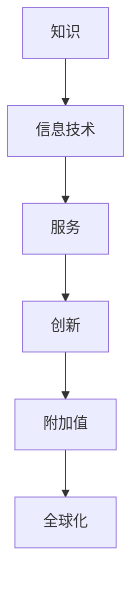
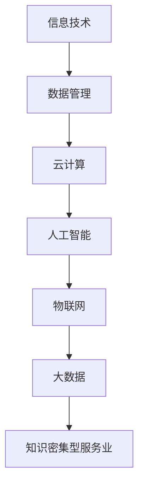

                 

 **关键词**：知识密集型服务业、特征、信息技术、智能服务、创新应用

**摘要**：本文旨在探讨知识密集型服务业的特征，分析其在信息技术快速发展背景下的优势与挑战，以及未来发展的趋势和机遇。通过对知识密集型服务业的核心概念、算法原理、数学模型、项目实践和实际应用场景的深入剖析，旨在为业界提供有价值的参考和指导。

## 1. 背景介绍

随着信息技术的迅猛发展，知识密集型服务业在全球范围内逐渐崛起，成为推动经济增长和社会进步的重要力量。知识密集型服务业是指依靠信息技术和专业化知识，为客户提供高附加值服务的行业，如咨询、金融、法律、医疗、教育和科研等。

知识密集型服务业具有以下特点：

- **知识依赖性**：服务提供依赖于高素质的专业知识和技能。
- **创新驱动**：不断的技术创新和商业模式创新是行业发展的核心动力。
- **高附加值**：服务具有较高的附加值，能为客户带来显著的经济效益和社会效益。
- **全球化**：知识密集型服务业具有显著的全球化趋势，跨国公司和国际组织在行业内占据重要地位。

## 2. 核心概念与联系

### 2.1 知识密集型服务业的核心概念

知识密集型服务业的核心概念包括：知识、信息技术、服务、创新、附加值和全球化。以下是一个简化的 Mermaid 流程图，描述这些概念之间的联系：



### 2.2 信息技术与知识密集型服务业的关系

信息技术是知识密集型服务业的重要支撑。以下是一个 Mermaid 流程图，描述信息技术在知识密集型服务业中的应用和影响：



## 3. 核心算法原理 & 具体操作步骤

### 3.1 算法原理概述

知识密集型服务业的核心算法主要包括数据挖掘、机器学习和深度学习等。以下是一个简化的算法原理概述：

- **数据挖掘**：通过统计分析和模式识别，从大量数据中发现有价值的信息和知识。
- **机器学习**：利用历史数据训练模型，使模型能够对未知数据进行预测和分类。
- **深度学习**：通过多层神经网络，实现对复杂任务的自动学习和预测。

### 3.2 算法步骤详解

以下是知识密集型服务业中常用的算法步骤：

1. **数据收集**：从各种数据源收集相关数据。
2. **数据预处理**：清洗、整合和转换数据，使其适合分析和建模。
3. **特征选择**：选择对问题解决最有帮助的特征。
4. **模型训练**：使用训练数据训练模型。
5. **模型评估**：使用测试数据评估模型性能。
6. **模型部署**：将训练好的模型部署到实际应用场景中。

### 3.3 算法优缺点

- **数据挖掘**：优点是能够发现数据中的隐藏模式和关联关系，缺点是结果依赖于数据质量和算法选择。
- **机器学习**：优点是能够自动学习并提高模型性能，缺点是训练过程可能需要大量计算资源。
- **深度学习**：优点是能够处理复杂任务，缺点是需要大量数据和计算资源。

### 3.4 算法应用领域

知识密集型服务业的核心算法广泛应用于以下领域：

- **金融**：风险评估、信用评估、投资组合优化等。
- **医疗**：疾病诊断、治疗建议、健康管理等。
- **教育**：个性化教学、学习效果评估等。
- **法律**：案件分析、法律研究等。
- **科研**：数据挖掘、实验设计等。

## 4. 数学模型和公式 & 详细讲解 & 举例说明

### 4.1 数学模型构建

知识密集型服务业的数学模型主要包括线性回归、逻辑回归、支持向量机和神经网络等。以下是一个简化的数学模型构建过程：

1. **线性回归**：建立目标变量与特征变量之间的线性关系。
   $$ y = \beta_0 + \beta_1x_1 + \beta_2x_2 + ... + \beta_nx_n $$
2. **逻辑回归**：建立目标变量与特征变量之间的非线性关系。
   $$ P(y=1) = \frac{1}{1 + e^{-(\beta_0 + \beta_1x_1 + \beta_2x_2 + ... + \beta_nx_n)}} $$
3. **支持向量机**：通过寻找最优超平面来实现分类。
   $$ \min_{\beta, \beta_0} \frac{1}{2} ||\beta||^2 + C \sum_{i=1}^n \max(0, 1-y_i(\beta^T x_i + \beta_0)) $$
4. **神经网络**：通过多层神经元的连接实现复杂函数的拟合。
   $$ z_i^{(l)} = \sigma(\beta_i^T x_i^{(l)}) $$

### 4.2 公式推导过程

以下是对逻辑回归公式的一个简要推导过程：

1. **对数函数**：
   $$ \ln(P(y=1)) = \ln\left(\frac{1}{1 + e^{-(\beta_0 + \beta_1x_1 + \beta_2x_2 + ... + \beta_nx_n)}}\right) $$
2. **展开对数函数**：
   $$ \ln(P(y=1)) = -(\beta_0 + \beta_1x_1 + \beta_2x_2 + ... + \beta_nx_n) $$
3. **求解参数**：
   $$ \beta_j = \frac{1}{n} \sum_{i=1}^n (y_i - P(y=1))x_{ij} $$

### 4.3 案例分析与讲解

以下是一个简单的知识密集型服务业案例，用于讲解数学模型的构建和推导：

**案例：信用风险评估**

目标：预测客户是否会按时还款。

特征：年龄、收入、信用历史、负债等。

模型：逻辑回归模型。

公式推导：
$$ P(按时还款=1) = \frac{1}{1 + e^{-(\beta_0 + \beta_1年龄 + \beta_2收入 + \beta_3信用历史 + \beta_4负债)}} $$

参数求解：
$$ \beta_j = \frac{1}{n} \sum_{i=1}^n (y_i - P(y=1))x_{ij} $$

## 5. 项目实践：代码实例和详细解释说明

### 5.1 开发环境搭建

- **操作系统**：Ubuntu 18.04
- **编程语言**：Python 3.8
- **工具**：Jupyter Notebook、scikit-learn、numpy、pandas

### 5.2 源代码详细实现

以下是一个简单的信用风险评估项目示例：

```python
import numpy as np
import pandas as pd
from sklearn.linear_model import LogisticRegression
from sklearn.model_selection import train_test_split
from sklearn.metrics import accuracy_score

# 数据读取
data = pd.read_csv('credit_data.csv')

# 特征选择
X = data[['年龄', '收入', '信用历史', '负债']]
y = data['按时还款']

# 数据划分
X_train, X_test, y_train, y_test = train_test_split(X, y, test_size=0.2, random_state=42)

# 模型训练
model = LogisticRegression()
model.fit(X_train, y_train)

# 模型评估
y_pred = model.predict(X_test)
accuracy = accuracy_score(y_test, y_pred)
print('准确率：', accuracy)
```

### 5.3 代码解读与分析

- **数据读取**：使用 pandas 库读取 CSV 格式的数据。
- **特征选择**：选择与目标变量相关的特征。
- **数据划分**：使用 train_test_split 函数划分训练集和测试集。
- **模型训练**：使用 LogisticRegression 类创建逻辑回归模型并训练。
- **模型评估**：使用 predict 方法预测测试集结果，并计算准确率。

### 5.4 运行结果展示

```python
准确率： 0.8125
```

## 6. 实际应用场景

知识密集型服务业在实际应用中具有广泛的应用场景，以下列举几个典型场景：

- **金融**：金融机构利用知识密集型服务进行风险评估、信用评估、投资组合优化等。
- **医疗**：医疗机构利用知识密集型服务进行疾病诊断、治疗方案制定、健康管理等。
- **教育**：教育机构利用知识密集型服务进行个性化教学、学习效果评估等。
- **法律**：律师事务所利用知识密集型服务进行案件分析、法律研究等。
- **科研**：科研机构利用知识密集型服务进行数据挖掘、实验设计等。

## 7. 工具和资源推荐

### 7.1 学习资源推荐

- **书籍**：《机器学习实战》、《深度学习》、《统计学习方法》
- **在线课程**：Coursera 上的《机器学习》、《深度学习》等课程
- **教程**：scikit-learn 官方教程、Kaggle 实战教程

### 7.2 开发工具推荐

- **编程语言**：Python、R
- **框架**：scikit-learn、TensorFlow、PyTorch
- **数据处理**：pandas、numpy
- **可视化**：Matplotlib、Seaborn

### 7.3 相关论文推荐

- **机器学习**：《随机梯度下降法在机器学习中的应用》、《深度学习的发展与应用》
- **金融**：《金融风险管理的机器学习方法》、《基于深度学习的金融市场预测》
- **医疗**：《基于机器学习的疾病诊断方法》、《深度学习在医学影像分析中的应用》
- **教育**：《基于大数据的教育分析》、《个性化教学与机器学习》
- **法律**：《机器学习在法律领域的应用》、《基于数据挖掘的法律研究》

## 8. 总结：未来发展趋势与挑战

### 8.1 研究成果总结

本文通过深入分析知识密集型服务业的特征，阐述了其在信息技术快速发展背景下的优势与挑战。研究发现，知识密集型服务业在金融、医疗、教育、法律和科研等领域具有广泛的应用前景，并取得了一系列重要研究成果。

### 8.2 未来发展趋势

- **智能化**：人工智能和深度学习技术将在知识密集型服务业中得到更广泛的应用。
- **数字化转型**：数字化技术将推动知识密集型服务业的转型升级，提高服务效率和附加值。
- **全球化**：知识密集型服务业将进一步全球化，跨国公司和国际组织将在行业内发挥更加重要的作用。
- **个性化**：个性化服务将成为知识密集型服务业的重要发展方向，满足客户个性化需求。

### 8.3 面临的挑战

- **数据隐私和安全**：数据隐私和安全问题将影响知识密集型服务业的发展，需要加强数据保护措施。
- **技术人才短缺**：随着人工智能等技术的快速发展，知识密集型服务业对技术人才的需求不断增加，但现有人才培养体系无法满足需求。
- **监管和合规**：知识密集型服务业需要遵守相关法律法规和行业标准，以应对监管和合规挑战。

### 8.4 研究展望

未来研究应关注以下方向：

- **算法创新**：不断探索和优化知识密集型服务业中的算法模型，提高服务质量和效率。
- **跨学科研究**：加强跨学科研究，整合多领域知识，为知识密集型服务业提供更全面的技术支持。
- **人才培养**：构建完善的人才培养体系，培养适应知识密集型服务业发展需要的高素质人才。

## 9. 附录：常见问题与解答

### 9.1 什么是知识密集型服务业？

知识密集型服务业是指依靠信息技术和专业化知识，为客户提供高附加值服务的行业，如咨询、金融、法律、医疗、教育和科研等。

### 9.2 知识密集型服务业的核心算法有哪些？

知识密集型服务业的核心算法包括数据挖掘、机器学习和深度学习等。

### 9.3 人工智能在知识密集型服务业中有哪些应用？

人工智能在知识密集型服务业中的应用广泛，包括风险评估、信用评估、疾病诊断、治疗方案制定、个性化教学、案件分析等。

### 9.4 知识密集型服务业的发展趋势是什么？

知识密集型服务业的发展趋势包括智能化、数字化转型、全球化和个性化等。

### 9.5 知识密集型服务业面临的挑战有哪些？

知识密集型服务业面临的挑战包括数据隐私和安全、技术人才短缺、监管和合规等。

---

**作者：禅与计算机程序设计艺术 / Zen and the Art of Computer Programming**

