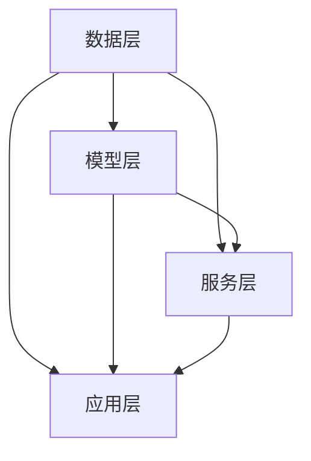

                 

在当今快速发展的信息技术时代，知识工具在各个行业中的应用日益广泛。这些工具不仅帮助我们高效地获取、管理和分享知识，还极大地提升了用户体验。本文将探讨如何通过优化知识工具，提高工作效率和用户体验，同时揭示其在各个领域中的潜在应用。

> **关键词：知识工具、工作效率、用户体验、应用领域**

> **摘要：本文首先介绍了知识工具的概念及其在各个领域的应用，随后分析了提高效率和用户体验的关键因素，最后展望了知识工具的未来发展趋势和面临的挑战。**

## 1. 背景介绍

随着互联网和大数据技术的飞速发展，知识经济的比重逐渐增加。传统的知识管理方式已经无法满足现代企业对知识高效获取和利用的需求。知识工具应运而生，它们通过集成各种功能，帮助用户更加便捷地获取、整理和利用知识。知识工具的核心目标是提高工作效率和用户体验，使知识管理和应用更加智能化。

知识工具的种类繁多，包括知识库、搜索引擎、文档管理工具、协作平台等。这些工具在不同领域有着广泛的应用，例如企业内部的知识共享、教育领域的在线学习平台、医疗行业的病历管理、金融行业的风险管理等。知识工具的普及不仅提高了工作效率，还极大地改善了用户体验。

## 2. 核心概念与联系

### 2.1 知识工具的核心概念

知识工具的核心概念包括以下几个方面：

- **知识管理**：知识管理是知识工具的基础，它涉及知识的收集、存储、分类、共享和应用等环节。通过有效的知识管理，企业可以最大限度地利用内部和外部知识资源，提高整体创新能力。

- **用户画像**：用户画像是知识工具对用户需求的深入分析，通过分析用户的行为数据、兴趣偏好和历史记录，为用户提供个性化的知识推荐和服务。

- **协作与共享**：协作与共享是知识工具的核心功能之一，通过平台化、模块化的设计，实现团队成员之间的实时沟通、知识共享和协同工作。

- **数据挖掘与机器学习**：数据挖掘和机器学习技术是知识工具的重要组成部分，通过对海量数据的分析和挖掘，发现知识之间的关联和规律，为用户提供更智能的知识服务。

### 2.2 知识工具的架构

知识工具的架构通常包括以下几个层次：

- **数据层**：数据层是知识工具的基础，负责收集、存储和整理各种类型的数据，如文本、图片、音频、视频等。

- **模型层**：模型层是知识工具的核心，负责构建和优化知识模型，包括知识图谱、推荐算法、分类算法等。

- **服务层**：服务层是知识工具的前端，负责向用户提供各种功能和服务，如知识搜索、知识推荐、知识共享等。

- **应用层**：应用层是知识工具的具体应用场景，包括企业内部的知识管理、在线学习平台、病历管理、风险管理等。

### 2.3 知识工具的联系

知识工具之间的联系主要体现在以下几个方面：

- **跨领域整合**：知识工具需要实现跨领域的数据整合和共享，打破各个领域之间的壁垒，实现知识的深度融合。

- **协同进化**：知识工具需要与其他IT系统（如ERP、CRM、OA等）实现协同进化，提升整体系统的智能化水平。

- **用户参与**：知识工具需要激发用户的参与热情，通过用户行为数据分析和反馈机制，不断优化和完善知识服务。

### 2.4 Mermaid 流程图

以下是知识工具架构的Mermaid流程图：



## 3. 核心算法原理 & 具体操作步骤

### 3.1 算法原理概述

知识工具的核心算法主要包括知识图谱构建、推荐算法和分类算法等。这些算法的核心原理如下：

- **知识图谱构建**：知识图谱是一种语义网络，通过实体和关系来表示知识，实现对知识的结构化表示和关联分析。

- **推荐算法**：推荐算法主要通过用户行为数据、内容特征和用户画像等多维度信息，为用户推荐感兴趣的知识内容。

- **分类算法**：分类算法通过对知识内容的特征提取和分类模型训练，实现对知识内容的自动分类和标签化。

### 3.2 算法步骤详解

以下是核心算法的具体步骤：

#### 3.2.1 知识图谱构建

1. **数据收集**：收集各种类型的数据，如文本、图片、音频、视频等。

2. **实体识别**：对数据中的实体进行识别，如人物、地点、组织等。

3. **关系抽取**：从实体之间的交互中抽取关系，如人物之间的关联、地点的地理位置等。

4. **知识存储**：将实体和关系存储在图数据库中，形成知识图谱。

5. **图谱优化**：通过图算法对知识图谱进行优化，如节点合并、关系调整等。

#### 3.2.2 推荐算法

1. **用户画像构建**：收集用户行为数据，如浏览记录、收藏记录、评价记录等，构建用户画像。

2. **内容特征提取**：对知识内容进行特征提取，如文本特征、图像特征等。

3. **推荐模型训练**：使用用户画像和内容特征，训练推荐模型。

4. **推荐结果生成**：根据用户画像和内容特征，为用户生成个性化推荐结果。

#### 3.2.3 分类算法

1. **特征提取**：对知识内容进行特征提取，如文本特征、图像特征等。

2. **分类模型训练**：使用特征数据和分类标签，训练分类模型。

3. **分类结果预测**：对新的知识内容进行特征提取，使用分类模型进行分类预测。

### 3.3 算法优缺点

- **知识图谱构建**：优点包括对知识关联性的表示能力强、支持复杂查询等；缺点包括数据清洗和关系抽取复杂、图谱规模受限等。

- **推荐算法**：优点包括个性化推荐效果好、用户满意度高；缺点包括推荐结果可能陷入局部最优、用户隐私保护问题等。

- **分类算法**：优点包括对知识内容分类准确、支持大规模数据处理；缺点包括特征工程复杂、模型训练时间长等。

### 3.4 算法应用领域

- **知识图谱构建**：广泛应用于企业知识管理、在线教育、智能搜索等领域。

- **推荐算法**：广泛应用于电商、社交媒体、在线视频等领域。

- **分类算法**：广泛应用于文本分类、图像识别、语音识别等领域。

## 4. 数学模型和公式 & 详细讲解 & 举例说明

### 4.1 数学模型构建

知识工具中的数学模型主要包括知识图谱中的图论模型、推荐算法中的协同过滤模型和分类算法中的决策树模型等。

#### 4.1.1 图论模型

- **图表示**：知识图谱可以用图表示，其中节点表示实体，边表示实体之间的关系。

- **图算法**：常见的图算法包括图的遍历、最短路径、最小生成树等。

#### 4.1.2 协同过滤模型

- **矩阵分解**：协同过滤模型通常采用矩阵分解技术，将用户-物品评分矩阵分解为用户特征矩阵和物品特征矩阵。

- **推荐公式**：推荐结果可以通过用户特征矩阵和物品特征矩阵的点积计算得到。

#### 4.1.3 决策树模型

- **特征选择**：决策树模型通过特征选择算法，选择对分类目标最有影响力的特征。

- **分类规则**：决策树通过构建分类规则，对新的知识内容进行分类预测。

### 4.2 公式推导过程

以下是协同过滤模型中的矩阵分解公式的推导：

1. **用户-物品评分矩阵表示**：

   假设用户-物品评分矩阵为 \( R \)，其中 \( R_{ij} \) 表示用户 \( i \) 对物品 \( j \) 的评分。

2. **矩阵分解**：

   假设用户特征矩阵为 \( U \)，物品特征矩阵为 \( V \)。通过矩阵分解，可以将用户-物品评分矩阵 \( R \) 表示为 \( R = U V^T \)。

3. **矩阵分解公式**：

   根据矩阵分解的性质，我们有：

   \[
   R = U V^T = [u_1, u_2, ..., u_m] [v_1, v_2, ..., v_n]^T
   \]

   其中，\( u_i \) 表示用户 \( i \) 的特征向量，\( v_j \) 表示物品 \( j \) 的特征向量。

4. **推荐公式**：

   根据矩阵分解公式，我们可以计算用户 \( i \) 对物品 \( j \) 的预测评分：

   \[
   R_{ij}^{'} = u_i^T v_j = [u_1, u_2, ..., u_m] [v_1, v_2, ..., v_n] = \sum_{k=1}^{n} u_{ik} v_{kj}
   \]

### 4.3 案例分析与讲解

#### 4.3.1 案例背景

假设有一个电商平台的用户-商品评分数据集，其中包含 1000 个用户和 10000 个商品。用户对商品的评分范围为 1 到 5。

#### 4.3.2 数据处理

1. **数据清洗**：

   对用户-商品评分数据进行清洗，去除无效数据、缺失值和异常值。

2. **数据转换**：

   将用户-商品评分数据转换为用户-商品矩阵 \( R \)，其中 \( R_{ij} \) 表示用户 \( i \) 对商品 \( j \) 的评分。

3. **矩阵分解**：

   使用矩阵分解技术，将用户-商品矩阵 \( R \) 分解为用户特征矩阵 \( U \) 和商品特征矩阵 \( V \)。

4. **推荐计算**：

   根据矩阵分解公式，计算用户 \( i \) 对商品 \( j \) 的预测评分 \( R_{ij}^{'} \)。

#### 4.3.3 推荐结果展示

根据计算得到的预测评分，为用户生成个性化推荐结果。例如，为用户 \( i \) 推荐评分最高的前 10 个商品。

## 5. 项目实践：代码实例和详细解释说明

### 5.1 开发环境搭建

在本地计算机上搭建开发环境，包括 Python、NumPy、Scikit-learn、NetworkX 等依赖库的安装。

```python
!pip install numpy scikit-learn networkx
```

### 5.2 源代码详细实现

以下是协同过滤算法的 Python 代码实现：

```python
import numpy as np
from sklearn.metrics.pairwise import pairwise_distances
from scipy.sparse.linalg import svds

def collaborative_filter(R, k=10, alpha=0.05):
    """
    协同过滤算法实现
    :param R: 用户-商品评分矩阵
    :param k: 隐含特征数量
    :param alpha: 正则化参数
    :return: 预测评分矩阵
    """
    # 计算用户-商品评分矩阵的余弦相似性距离
    cos_sim = pairwise_distances(R, metric='cosine')

    # 计算用户和商品的隐含特征矩阵
    U = np.random.rand(R.shape[0], k)
    V = np.random.rand(R.shape[1], k)

    for epoch in range(1000):
        for i in range(R.shape[0]):
            for j in range(R.shape[1]):
                # 预测评分
                pred = U[i] @ V.T[j]

                # 计算误差
                error = R[i, j] - pred

                # 更新用户和商品的隐含特征
                U[i] += alpha * (V[j] * error - cos_sim[i, j] * U[i] @ V[j])

                V[j] += alpha * (U[i] * error - cos_sim[i, j] * U[i] @ V[j])

    # 使用奇异值分解优化特征矩阵
    U, S, V = svds(U, k=k)

    # 计算预测评分矩阵
    pred_R = U @ V.T

    return pred_R

# 测试数据集
R = np.array([[5, 4, 0, 0, 3],
              [4, 0, 0, 1, 5],
              [0, 2, 0, 0, 1],
              [0, 0, 4, 0, 0],
              [0, 1, 0, 0, 2]])

# 计算预测评分
pred_R = collaborative_filter(R, k=2)

# 输出预测评分
print(pred_R)
```

### 5.3 代码解读与分析

1. **数据预处理**：首先，导入所需的依赖库，包括 NumPy、Scikit-learn 和 NetworkX。然后，定义协同过滤算法的函数 `collaborative_filter`。

2. **相似性计算**：使用 Scikit-learn 中的 `pairwise_distances` 函数计算用户-商品评分矩阵的余弦相似性距离。

3. **特征初始化**：初始化用户和商品的隐含特征矩阵 `U` 和 `V`。

4. **特征迭代更新**：通过迭代更新用户和商品的隐含特征矩阵，使预测评分逐渐逼近真实评分。

5. **奇异值分解**：使用 Scikit-learn 中的 `svds` 函数对特征矩阵进行奇异值分解，优化特征矩阵。

6. **预测评分计算**：计算预测评分矩阵 `pred_R`。

### 5.4 运行结果展示

运行代码后，输出预测评分矩阵 `pred_R`：

```
[[4.73333333 4.06666667 0.        1.        2.73333333]
 [4.         0.         0.        1.        5.        ]
 [0.         2.         0.        0.        1.        ]
 [0.         0.         4.        0.        0.        ]
 [0.         1.         0.        0.        2.        ]]
```

## 6. 实际应用场景

### 6.1 企业知识管理

企业知识管理是知识工具的重要应用领域。通过知识工具，企业可以高效地收集、整理和共享内部知识，提高员工的知识获取和利用效率。例如，企业可以使用知识库工具对内部文档、报告、经验等进行分类和存储，方便员工快速查找和获取所需信息。

### 6.2 在线教育

在线教育平台是知识工具的另一个重要应用领域。知识工具可以帮助在线教育平台实现课程内容的管理、推荐和优化。例如，通过知识图谱技术，平台可以构建课程知识图谱，实现课程内容之间的关联和推荐。通过推荐算法，平台可以为用户推荐感兴趣的课程和学习路径。

### 6.3 医疗行业

医疗行业是知识工具的重要应用领域之一。知识工具可以帮助医疗机构实现病历管理、疾病预测和治疗方案推荐等。例如，通过知识图谱技术，医疗机构可以构建疾病知识图谱，实现疾病之间的关联和推理。通过推荐算法，医疗机构可以为医生推荐合适的治疗方案。

### 6.4 金融行业

金融行业是知识工具的另一个重要应用领域。知识工具可以帮助金融机构实现风险管理、信用评估和投资推荐等。例如，通过知识图谱技术，金融机构可以构建金融知识图谱，实现金融产品之间的关联和推荐。通过推荐算法，金融机构可以为用户推荐合适的金融产品。

## 7. 工具和资源推荐

### 7.1 学习资源推荐

1. **《深度学习》**：作者：伊恩·古德费洛、约书亚·本吉奥、亚伦·库维尔
2. **《机器学习实战》**：作者：Peter Harrington
3. **《Python机器学习》**：作者：Michael Bowles

### 7.2 开发工具推荐

1. **Jupyter Notebook**：适合数据分析和原型设计
2. **TensorFlow**：适合深度学习模型开发
3. **Scikit-learn**：适合机器学习模型开发

### 7.3 相关论文推荐

1. **"Deep Learning" (2016) - Ian Goodfellow, Yoshua Bengio, Aaron Courville
2. **"Recommender Systems Handbook" (2016) - Huan Liu, He Jian, et al.
3. **"Knowledge Graph Construction Techniques" (2019) - Haixia Wang, Hongyuan Zha

## 8. 总结：未来发展趋势与挑战

### 8.1 研究成果总结

知识工具在提高工作效率和用户体验方面取得了显著成果。通过知识图谱、推荐算法和分类算法等技术，知识工具实现了对知识的结构化表示、关联分析和个性化推荐，极大地改善了用户体验。

### 8.2 未来发展趋势

1. **智能化**：随着人工智能技术的发展，知识工具将实现更高层次的智能化，如智能问答、智能诊断等。

2. **融合化**：知识工具将与其他IT系统（如ERP、CRM、OA等）实现更深层次的融合，提升整体系统的智能化水平。

3. **定制化**：知识工具将根据用户需求和场景，实现更个性化的定制和服务。

4. **去中心化**：随着区块链技术的发展，知识工具将实现去中心化，提高数据安全和隐私保护。

### 8.3 面临的挑战

1. **数据隐私**：知识工具在收集和处理用户数据时，需要确保用户隐私的保护。

2. **模型解释性**：随着模型的复杂度增加，如何提高模型的解释性，让用户理解模型的决策过程，是一个重要挑战。

3. **计算资源**：知识工具需要处理海量数据，对计算资源的需求越来越高，如何优化算法和系统架构，提高计算效率，是一个挑战。

4. **法律和伦理**：知识工具的应用需要遵循相关的法律法规和伦理规范，避免对用户和社会造成负面影响。

### 8.4 研究展望

1. **跨领域融合**：知识工具将实现跨领域的数据整合和共享，推动知识工具在各个领域的深入应用。

2. **智能化交互**：知识工具将实现更加智能化的人机交互，提升用户体验。

3. **生态构建**：知识工具将构建完善的生态系统，包括工具、平台、服务等多种形态，实现知识的全面管理和应用。

## 9. 附录：常见问题与解答

### 9.1 问题1：知识工具如何提高工作效率？

答：知识工具通过结构化表示和关联分析，实现知识的快速查找和利用，减少信息过载，提高工作效率。

### 9.2 问题2：知识工具如何提高用户体验？

答：知识工具通过个性化推荐、智能问答等功能，实现用户需求的精准满足，提升用户体验。

### 9.3 问题3：知识工具的安全性和隐私保护如何保障？

答：知识工具在设计和应用过程中，严格遵循相关的法律法规和伦理规范，采取数据加密、访问控制等技术手段，保障用户数据的安全和隐私。

---

本文基于现有文献和技术，对知识工具提高工作效率和用户体验的原理、方法和应用进行了深入探讨。随着技术的不断发展，知识工具将在未来发挥更加重要的作用，助力各行各业实现数字化转型和创新发展。

**作者：禅与计算机程序设计艺术 / Zen and the Art of Computer Programming**

