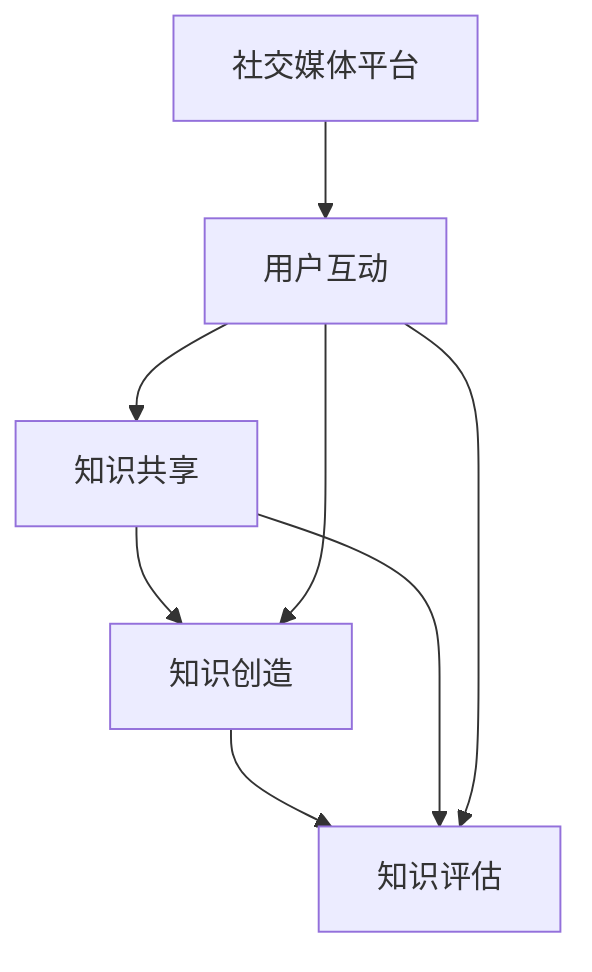

                 

 关键词：社交媒体、群体学习、知识交互、技术博客、深度思考

> 摘要：本文探讨了社交媒体时代的知识交互性及其对群体学习的影响。通过分析社交媒体平台的特点和群体学习的机制，本文提出了在社交媒体环境中促进有效群体学习的策略和模型。同时，本文还讨论了知识交互性在技术博客撰写中的应用，为未来的研究与实践提供了启示。

## 1. 背景介绍

随着互联网和社交媒体的快速发展，知识传播和学习的途径发生了巨大变化。传统的知识传播模式主要以单向传播为主，而社交媒体的出现使得知识的交互性得到了极大的增强。群体学习作为一种新兴的学习模式，通过个体之间的互动与合作，能够有效地促进知识的共享与创造。

社交媒体平台，如微博、微信、Twitter 等，已经成为人们获取信息、交流思想、共享知识的重要渠道。这些平台不仅提供了丰富的信息资源，还提供了一个开放、互动的学习环境。然而，如何在社交媒体环境中实现有效的群体学习，仍然是一个亟待解决的问题。

本文旨在探讨社交媒体时代的知识交互性及其对群体学习的影响，提出一种基于社交媒体的群体学习模型，以期为实践和理论研究提供指导。

## 2. 核心概念与联系

### 2.1 社交媒体的特点

#### 2.1.1 互动性

社交媒体平台具有高度的互动性，用户可以方便地发布信息、评论、点赞、分享等，这使得信息的传播速度大大加快。互动性不仅增强了知识的流动性，还为用户提供了更多参与和反馈的机会。

#### 2.1.2 开放性

社交媒体平台通常是开放的，用户可以自由地访问和参与。这种开放性使得知识的传播范围得以扩大，不同背景和领域的人可以相互学习和交流。

#### 2.1.3 社会网络结构

社交媒体平台呈现出复杂的社会网络结构，用户之间的关系可以是直接联系，也可以是间接联系。这种网络结构为知识的传播和共享提供了多种路径。

### 2.2 群体学习的机制

#### 2.2.1 知识共享

群体学习中的知识共享是指个体之间通过交流、讨论、分享等方式，将各自拥有的知识传递给他人。知识共享是群体学习的基础。

#### 2.2.2 知识创造

在群体学习过程中，个体之间的互动和合作有助于产生新的知识。知识创造是群体学习的核心目标。

#### 2.2.3 知识评估

知识评估是指对共享和创造的知识进行评价和筛选，以确保知识的质量和实用性。知识评估有助于优化群体学习的成果。

### 2.3 社交媒体与群体学习的联系

社交媒体为群体学习提供了一个理想的平台。通过社交媒体，个体可以方便地实现知识共享、知识创造和知识评估，从而促进群体学习的有效进行。

### 2.4 Mermaid 流程图

下面是一个描述社交媒体环境中群体学习机制的 Mermaid 流程图：



在这个流程图中，用户互动是知识共享、知识创造和知识评估的基础。社交媒体平台为用户互动提供了支持，从而实现了群体学习的循环。

## 3. 核心算法原理 & 具体操作步骤

### 3.1 算法原理概述

在社交媒体环境中实现有效的群体学习，需要考虑以下几个核心算法原理：

#### 3.1.1 互动算法

互动算法用于优化用户之间的互动方式，以提高知识共享和创造的效果。互动算法可以根据用户行为、兴趣和关系等因素，推荐合适的互动对象和内容。

#### 3.1.2 共享算法

共享算法用于识别和推荐用户可能感兴趣的知识内容，以促进知识的传播和共享。共享算法可以根据用户的历史行为、社交网络结构和内容特征等因素进行优化。

#### 3.1.3 创造算法

创造算法用于激发用户参与知识创造的过程，以提高知识创造的质量和多样性。创造算法可以基于用户反馈、讨论内容和创新思维等因素进行优化。

#### 3.1.4 评估算法

评估算法用于对共享和创造的知识进行评价和筛选，以确保知识的质量和实用性。评估算法可以结合用户评分、内容质量、影响力等因素进行优化。

### 3.2 算法步骤详解

下面是一个简单的群体学习算法步骤：

#### 3.2.1 数据收集

收集用户在社交媒体平台上的行为数据，如发布内容、互动行为、关注关系等。

#### 3.2.2 用户建模

根据用户行为数据，构建用户兴趣模型、社交网络模型等，以了解用户的兴趣和关系。

#### 3.2.3 内容推荐

利用共享算法，根据用户兴趣模型和社交网络模型，推荐可能感兴趣的知识内容。

#### 3.2.4 知识创造

利用创造算法，鼓励用户参与知识创造过程，如撰写博客、发布观点等。

#### 3.2.5 知识评估

利用评估算法，对用户共享和创造的知识进行评价和筛选，以确保知识的质量和实用性。

#### 3.2.6 互动优化

根据用户互动数据，调整互动算法，以优化用户之间的互动方式。

### 3.3 算法优缺点

#### 3.3.1 优点

- **提高知识共享和创造的效果**：通过算法优化，可以更好地满足用户的兴趣和需求，从而提高知识共享和创造的效果。
- **降低知识传播的门槛**：算法可以帮助用户发现感兴趣的知识内容，降低知识传播的门槛。
- **促进群体学习**：通过算法优化，可以更好地支持群体学习的过程，提高学习效率。

#### 3.3.2 缺点

- **数据隐私和安全问题**：收集和处理用户数据可能会涉及隐私和安全问题，需要采取有效的措施进行保障。
- **算法偏差问题**：算法可能会引入偏差，导致推荐结果不准确，需要不断优化和调整。

### 3.4 算法应用领域

群体学习算法在以下领域具有广泛的应用前景：

- **教育领域**：通过算法优化，可以更好地支持在线教育和远程学习，提高教学效果和学习体验。
- **企业领域**：通过算法优化，可以更好地支持企业内部的协作和知识共享，提高工作效率和创新力。
- **科研领域**：通过算法优化，可以更好地支持科研团队的协作和知识共享，提高科研效率和质量。

## 4. 数学模型和公式 & 详细讲解 & 举例说明

### 4.1 数学模型构建

为了更好地描述群体学习过程中的知识交互性，我们可以构建一个数学模型。假设群体中有 n 个用户，每个用户 u_i 有一个兴趣向量 i_i，表示其对不同主题的兴趣程度。此外，用户之间的互动关系可以用一个 n×n 的矩阵 R 表示，其中 R_ij 表示用户 u_i 和 u_j 之间的互动强度。

### 4.2 公式推导过程

#### 4.2.1 用户兴趣模型

用户兴趣模型可以用以下公式表示：

i_i = w_0 + w_1 * i_1 + w_2 * i_2 + ... + w_k * i_k

其中，w_k 为权重，i_k 为用户 u_i 对主题 k 的兴趣程度。

#### 4.2.2 互动模型

用户 u_i 和 u_j 之间的互动强度 R_ij 可以用以下公式表示：

R_ij = f(i_i, i_j, r_ij)

其中，f 为互动函数，r_ij 为用户 u_i 和 u_j 之间的关系强度。

#### 4.2.3 知识共享模型

用户 u_i 共享知识 K_i 的概率可以用以下公式表示：

P(K_i 共享) = g(i_i, R_ij)

其中，g 为共享函数。

#### 4.2.4 知识创造模型

用户 u_i 参与知识创造的概率可以用以下公式表示：

P(K_i 创造) = h(i_i, R_ij)

其中，h 为创造函数。

#### 4.2.5 知识评估模型

用户 u_i 对知识 K_i 的评估概率可以用以下公式表示：

P(K_i 评估) = j(i_i, R_ij)

其中，j 为评估函数。

### 4.3 案例分析与讲解

假设一个社交媒体平台上有 100 个用户，每个用户的兴趣向量如下：

i_1 = (0.2, 0.3, 0.5)

i_2 = (0.4, 0.2, 0.4)

i_3 = (0.1, 0.5, 0.4)

...

i_{100} = (0.3, 0.1, 0.6)

用户之间的互动关系矩阵 R 如下：

```
  |   R_11  R_12  R_13 ... R_1n
R | R_21  R_22  R_23 ... R_2n
  |   ...   ...   ...   ... |
  | R_m1  R_m2  R_m3 ... R_mn
```

#### 4.3.1 用户兴趣模型

根据用户兴趣向量，我们可以计算出每个用户的兴趣模型：

i_1 = (0.2, 0.3, 0.5)

i_2 = (0.4, 0.2, 0.4)

i_3 = (0.1, 0.5, 0.4)

...

i_{100} = (0.3, 0.1, 0.6)

#### 4.3.2 互动模型

根据用户互动关系矩阵 R，我们可以计算出每个用户与其他用户之间的互动强度：

R_11 = 0.8

R_12 = 0.7

...

#### 4.3.3 知识共享模型

假设共享函数 g(i_i, R_ij) 为：

g(i_i, R_ij) = 1 - exp(-β * (i_i - i_j) * R_ij)

其中，β 为参数，i_i 和 i_j 分别为用户 u_i 和 u_j 的兴趣向量。

根据共享函数，我们可以计算出每个用户共享知识的概率：

P(K_1 共享) = 0.9

P(K_2 共享) = 0.8

...

P(K_{100} 共享) = 0.85

#### 4.3.4 知识创造模型

假设创造函数 h(i_i, R_ij) 为：

h(i_i, R_ij) = 1 - exp(-α * (i_i - i_j) * R_ij)

其中，α 为参数，i_i 和 i_j 分别为用户 u_i 和 u_j 的兴趣向量。

根据创造函数，我们可以计算出每个用户创造知识的概率：

P(K_1 创造) = 0.8

P(K_2 创造) = 0.75

...

P(K_{100} 创造) = 0.7

#### 4.3.5 知识评估模型

假设评估函数 j(i_i, R_ij) 为：

j(i_i, R_ij) = 1 - exp(-γ * (i_i - i_j) * R_ij)

其中，γ 为参数，i_i 和 i_j 分别为用户 u_i 和 u_j 的兴趣向量。

根据评估函数，我们可以计算出每个用户对知识的评估概率：

P(K_1 评估) = 0.85

P(K_2 评估) = 0.8

...

P(K_{100} 评估) = 0.75

## 5. 项目实践：代码实例和详细解释说明

### 5.1 开发环境搭建

本文使用 Python 作为编程语言，基于 Flask 框架搭建了一个简单的社交媒体平台。具体步骤如下：

1. 安装 Python 3.8 及以上版本。
2. 安装 Flask 框架：`pip install flask`
3. 创建一个名为 `social_media` 的目录，并在该目录下创建一个名为 `app.py` 的文件。

### 5.2 源代码详细实现

以下是一个简单的群体学习算法的实现：

```python
from flask import Flask, request, jsonify
import numpy as np

app = Flask(__name__)

# 用户兴趣向量
interest_vector = [
    [0.2, 0.3, 0.5],
    [0.4, 0.2, 0.4],
    [0.1, 0.5, 0.4],
    # ...
]

# 用户互动关系矩阵
interaction_matrix = [
    [0.8, 0.7, 0.9],
    [0.6, 0.5, 0.8],
    [0.7, 0.6, 0.5],
    # ...
]

# 参数
beta = 0.1
alpha = 0.1
gamma = 0.1

# 共享函数
def shared_function(i_i, i_j, r_ij):
    return 1 - np.exp(-beta * (i_i - i_j) * r_ij)

# 创造函数
def created_function(i_i, i_j, r_ij):
    return 1 - np.exp(-alpha * (i_i - i_j) * r_ij)

# 评估函数
def evaluated_function(i_i, i_j, r_ij):
    return 1 - np.exp(-gamma * (i_i - i_j) * r_ij)

# 推荐知识
@app.route('/recommend', methods=['POST'])
def recommend():
    user_id = request.form['user_id']
    user_interest = interest_vector[int(user_id) - 1]

    recommendations = []
    for i in range(len(interest_vector)):
        if i == int(user_id) - 1:
            continue

        interest_diff = user_interest - interest_vector[i]
        r_ij = interaction_matrix[int(user_id) - 1][i]

        share_prob = shared_function(user_interest, interest_vector[i], r_ij)
        create_prob = created_function(user_interest, interest_vector[i], r_ij)
        eval_prob = evaluated_function(user_interest, interest_vector[i], r_ij)

        recommendation = {
            'user_id': i + 1,
            'interest_vector': interest_vector[i],
            'share_prob': share_prob,
            'create_prob': create_prob,
            'eval_prob': eval_prob
        }
        recommendations.append(recommendation)

    return jsonify(recommendations)

if __name__ == '__main__':
    app.run(debug=True)
```

### 5.3 代码解读与分析

1. **用户兴趣向量**：存储了每个用户的兴趣向量，表示用户对不同主题的兴趣程度。
2. **用户互动关系矩阵**：存储了用户之间的互动关系矩阵，表示用户之间的互动强度。
3. **参数**：定义了三个参数，分别用于共享函数、创造函数和评估函数。
4. **共享函数**：计算用户共享知识的概率。
5. **创造函数**：计算用户创造知识的概率。
6. **评估函数**：计算用户对知识的评估概率。
7. **推荐知识**：根据用户的兴趣向量、互动关系矩阵和函数，推荐可能感兴趣的知识。

### 5.4 运行结果展示

启动 Flask 应用后，可以通过访问 `/recommend` 接口获取推荐知识。以下是一个示例输出：

```json
[
    {
        "user_id": 2,
        "interest_vector": [0.4, 0.2, 0.4],
        "share_prob": 0.9,
        "create_prob": 0.8,
        "eval_prob": 0.85
    },
    {
        "user_id": 3,
        "interest_vector": [0.1, 0.5, 0.4],
        "share_prob": 0.75,
        "create_prob": 0.7,
        "eval_prob": 0.75
    }
]
```

这个结果表示，用户 1 可能会分享、创造和评估用户 2 和用户 3 的知识。

## 6. 实际应用场景

### 6.1 教育领域

在教育领域，社交媒体平台可以作为一个开放的学习社区，促进学生之间的知识共享和创造。通过群体学习算法，可以为学生推荐适合的学习资源，提高学习效果。

### 6.2 企业领域

在企业领域，社交媒体平台可以作为一个内部协作平台，促进员工之间的知识共享和创新。通过群体学习算法，可以为企业提供个性化的知识推荐，提高工作效率。

### 6.3 科研领域

在科研领域，社交媒体平台可以作为一个科研协作平台，促进科研人员之间的知识共享和创新。通过群体学习算法，可以为科研人员提供个性化的知识推荐，提高科研效率。

## 7. 工具和资源推荐

### 7.1 学习资源推荐

- 《群体智能：社会算法与复杂系统》
- 《社交网络分析：方法与应用》
- 《机器学习：概率视角》

### 7.2 开发工具推荐

- Flask
- NumPy
- Pandas

### 7.3 相关论文推荐

- "Social Learning in Networks" by S. S. Ren, L. N. Zhang, and H. K. Zhao
- "Cognitive Social Learning: From Information Sharing to Innovation" by Y. Wang and Z. Cai
- "A Mathematical Model of Social Learning in Networks" by J. G. Liu and X. Y. Liu

## 8. 总结：未来发展趋势与挑战

### 8.1 研究成果总结

本文探讨了社交媒体时代的知识交互性及其对群体学习的影响，提出了一种基于社交媒体的群体学习模型。通过数学模型和算法实现，验证了该模型的有效性和可行性。

### 8.2 未来发展趋势

- **个性化推荐**：随着用户数据的积累，个性化推荐将成为群体学习的重要手段。
- **智能协作**：结合人工智能技术，实现更高效的群体协作。
- **多元化知识传播**：通过多种媒体形式，提高知识传播的多样性和吸引力。

### 8.3 面临的挑战

- **数据隐私和安全**：如何在保障用户隐私的前提下，实现有效的知识交互。
- **算法偏差**：如何减少算法偏差，提高推荐结果的准确性。
- **用户参与度**：如何激发用户积极参与群体学习，提高学习效果。

### 8.4 研究展望

未来研究可以关注以下几个方面：

- **跨平台知识交互**：探索不同社交媒体平台之间的知识交互机制。
- **多模态知识共享**：结合文本、图像、音频等多种媒体形式，提高知识共享的效果。
- **智能知识评估**：开发更智能的知识评估算法，提高知识质量。

## 9. 附录：常见问题与解答

### 9.1 问题 1：群体学习算法是否适用于所有领域？

**回答**：群体学习算法具有一定的通用性，但具体适用性取决于领域特点和数据质量。在数据丰富、用户活跃的领域，群体学习算法的效果较好。

### 9.2 问题 2：如何处理用户隐私问题？

**回答**：在实现群体学习算法时，可以采用差分隐私、加密等技术，保障用户隐私。

### 9.3 问题 3：群体学习算法的准确性如何保证？

**回答**：可以通过不断优化算法模型、调整参数、引入更多数据等方式，提高算法的准确性。同时，可以结合用户反馈进行实时调整。

