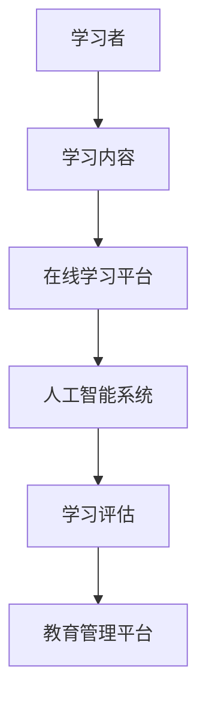

                 

 关键词：教育科技、知识产业、数字化教育、在线学习平台、人工智能、个性化学习、大数据分析、学习路径规划

> 摘要：本文深入探讨了教育科技在知识产业中的应用与发展。通过分析教育科技的核心概念、算法原理、数学模型、实际应用场景以及未来展望，本文旨在为教育工作者、技术从业者和政策制定者提供有价值的参考，推动教育科技的创新与发展。

## 1. 背景介绍

在教育领域，科技的应用已成为推动教育变革的重要力量。随着互联网的普及和智能设备的不断升级，教育科技逐渐渗透到教育的各个环节，从传统课堂教学到在线学习，从教育资源共享到学习评估，科技正在深刻改变着教育的方式和理念。

知识产业作为知识经济的重要组成部分，其核心是知识的创造、传播和应用。在教育领域，知识的产业化意味着将教育资源、知识内容和技术手段有机结合，构建一个高效的、可持续的知识传播与学习体系。

近年来，人工智能、大数据分析、虚拟现实等前沿技术的快速发展，为教育科技的创新提供了新的契机。通过技术的赋能，教育不仅可以实现资源的优化配置，还可以实现学习方式的个性化和学习效果的精准评估。

## 2. 核心概念与联系

### 2.1. 教育科技的核心概念

#### 2.1.1. 数字化教育

数字化教育是指通过计算机技术、网络通信技术等手段，实现教育资源的数字化、学习过程的数字化和教育管理的数字化。数字化教育打破了时间和空间的限制，为学习者提供了更多的学习机会和资源。

#### 2.1.2. 在线学习平台

在线学习平台是一种基于互联网的学习环境，学习者可以通过网络访问各种学习资源和课程，进行自主学习。在线学习平台不仅提供了丰富的学习资源，还可以通过数据分析和智能推荐等技术，实现个性化学习。

#### 2.1.3. 人工智能

人工智能是指通过计算机模拟人类的智能行为，实现智能决策、问题求解和知识表示。在教育领域，人工智能可以应用于个性化学习推荐、智能辅导、学习行为分析等方面。

### 2.2. 教育科技的核心架构

为了更好地理解教育科技的工作原理，我们使用Mermaid绘制了以下流程图：



在这个流程图中：

- **A. 学习者**：通过在线学习平台获取学习内容和进行学习。
- **B. 学习内容**：包括教材、视频、试题等，是学习的核心。
- **C. 在线学习平台**：提供学习资源的存储、分发和展示。
- **D. 人工智能系统**：对学习者的学习行为进行分析，提供个性化推荐和智能辅导。
- **E. 学习评估**：对学习者的学习效果进行评估，为教育管理提供数据支持。
- **F. 教育管理平台**：对教育资源和学习过程进行管理。

## 3. 核心算法原理 & 具体操作步骤

### 3.1 算法原理概述

在教育科技中，核心算法主要包括个性化学习推荐算法、学习行为分析算法和学习效果评估算法。

#### 3.1.1 个性化学习推荐算法

个性化学习推荐算法基于学习者的学习历史、兴趣偏好和知识水平，为学习者推荐合适的学习资源。常见的推荐算法有基于内容的推荐、协同过滤推荐和混合推荐。

#### 3.1.2 学习行为分析算法

学习行为分析算法通过对学习者的学习行为数据进行挖掘和分析，识别学习者的学习模式、认知特点和问题所在，为教育干预提供依据。常见的方法有聚类分析、关联规则挖掘和时间序列分析。

#### 3.1.3 学习效果评估算法

学习效果评估算法通过对学习者的学习成果进行量化分析，评估学习者的学习效果。常见的评估方法有测试评估、作业评估和项目评估。

### 3.2 算法步骤详解

#### 3.2.1 个性化学习推荐算法

1. 数据收集：收集学习者的学习历史数据、兴趣偏好数据和知识水平数据。
2. 数据预处理：对收集到的数据进行分析和清洗，去除噪声数据。
3. 特征提取：从预处理后的数据中提取出有用的特征。
4. 模型训练：使用机器学习算法（如协同过滤、基于内容的推荐等）训练推荐模型。
5. 推荐策略：根据学习者的特征和模型推荐合适的学习资源。

#### 3.2.2 学习行为分析算法

1. 数据收集：收集学习者的学习行为数据，如浏览记录、点击次数、答题情况等。
2. 数据预处理：对收集到的数据进行分析和清洗。
3. 特征提取：从预处理后的数据中提取出有用的特征。
4. 模型训练：使用机器学习算法（如聚类分析、关联规则挖掘等）训练行为分析模型。
5. 行为预测：根据模型预测学习者的学习模式和问题所在。

#### 3.2.3 学习效果评估算法

1. 数据收集：收集学习者的学习成果数据，如考试成绩、项目完成情况等。
2. 数据预处理：对收集到的数据进行分析和清洗。
3. 特征提取：从预处理后的数据中提取出有用的特征。
4. 模型训练：使用机器学习算法（如测试评估、作业评估等）训练评估模型。
5. 评估预测：根据模型评估学习者的学习效果。

### 3.3 算法优缺点

#### 3.3.1 个性化学习推荐算法

**优点**：

- 提高学习效率：根据学习者的兴趣和需求推荐合适的学习资源，提高学习效率。
- 提高学习兴趣：个性化推荐使学习者更容易找到感兴趣的学习内容，提高学习兴趣。

**缺点**：

- 数据质量影响：个性化推荐算法依赖于学习者数据，数据质量直接影响推荐效果。
- 数据隐私问题：学习者数据可能涉及隐私信息，需要确保数据的安全性和隐私性。

#### 3.3.2 学习行为分析算法

**优点**：

- 提高教育质量：通过对学习行为数据的分析，发现学习者的学习问题和认知特点，为教育干预提供依据。
- 提高教育个性化：根据学习者的行为特点，实现个性化教育。

**缺点**：

- 数据复杂性：学习行为数据通常包含大量复杂的信息，处理和分析需要一定的技术能力。
- 数据解释难度：学习行为分析结果可能难以直接解释，需要专业知识和经验。

#### 3.3.3 学习效果评估算法

**优点**：

- 提高学习效果：通过对学习成果的量化评估，了解学习者的学习效果，为后续学习提供指导。
- 提高教育公平：学习效果评估可以公平、客观地评估学习者的学习成果。

**缺点**：

- 测试评估局限性：测试评估只能评估学习者的知识水平，无法全面反映学习者的综合素质。
- 项目评估耗时：项目评估通常需要较长时间，无法实时反映学习者的学习效果。

### 3.4 算法应用领域

个性化学习推荐算法主要应用于在线学习平台，通过推荐合适的学习资源，提高学习者的学习效果。学习行为分析算法主要应用于智能教育系统，通过分析学习者的行为数据，实现个性化教育。学习效果评估算法主要应用于教育管理平台，通过评估学习者的学习效果，为教育决策提供数据支持。

## 4. 数学模型和公式 & 详细讲解 & 举例说明

### 4.1 数学模型构建

在教育科技中，常用的数学模型包括线性回归模型、决策树模型、支持向量机模型等。

#### 4.1.1 线性回归模型

线性回归模型用于预测学习者的学习效果。其公式为：

$$
y = \beta_0 + \beta_1x_1 + \beta_2x_2 + ... + \beta_nx_n
$$

其中，$y$ 为学习效果，$x_1, x_2, ..., x_n$ 为学习者的特征。

#### 4.1.2 决策树模型

决策树模型用于分类学习者的学习行为。其公式为：

$$
y = f(x)
$$

其中，$y$ 为学习行为类别，$x$ 为学习者的特征。

#### 4.1.3 支持向量机模型

支持向量机模型用于分类学习者的学习模式。其公式为：

$$
w \cdot x + b = 0
$$

其中，$w$ 为权重向量，$x$ 为学习者的特征，$b$ 为偏置。

### 4.2 公式推导过程

以线性回归模型为例，其推导过程如下：

1. 假设学习效果 $y$ 与学习者的特征 $x_1, x_2, ..., x_n$ 成线性关系。

2. 构建线性回归模型：

$$
y = \beta_0 + \beta_1x_1 + \beta_2x_2 + ... + \beta_nx_n
$$

3. 对模型进行最小二乘法拟合：

$$
\min \sum_{i=1}^{n}(y_i - (\beta_0 + \beta_1x_{i1} + \beta_2x_{i2} + ... + \beta_nx_{in}))^2
$$

4. 求解模型参数 $\beta_0, \beta_1, ..., \beta_n$。

### 4.3 案例分析与讲解

以在线学习平台为例，分析学习者的学习效果。

#### 4.3.1 数据收集

收集学习者的学习历史数据，包括课程名称、学习时长、考试成绩等。

#### 4.3.2 数据预处理

对收集到的数据进行分析和清洗，去除异常值和缺失值。

#### 4.3.3 特征提取

从预处理后的数据中提取出有用的特征，如学习时长、考试成绩等。

#### 4.3.4 模型训练

使用线性回归模型对特征进行训练，得到模型参数。

#### 4.3.5 评估预测

使用训练好的模型对新的学习者进行评估预测，预测其学习效果。

## 5. 项目实践：代码实例和详细解释说明

### 5.1 开发环境搭建

在Python环境中搭建开发环境，安装必要的库和工具，如scikit-learn、pandas等。

### 5.2 源代码详细实现

以下是一个使用线性回归模型评估学习者学习效果的示例代码：

```python
import pandas as pd
from sklearn.linear_model import LinearRegression
from sklearn.model_selection import train_test_split
from sklearn.metrics import mean_squared_error

# 数据收集
data = pd.read_csv('learning_data.csv')

# 数据预处理
data.dropna(inplace=True)

# 特征提取
X = data[['learning_time', 'exam_score']]
y = data['learning_effect']

# 模型训练
X_train, X_test, y_train, y_test = train_test_split(X, y, test_size=0.2, random_state=42)
model = LinearRegression()
model.fit(X_train, y_train)

# 评估预测
y_pred = model.predict(X_test)
mse = mean_squared_error(y_test, y_pred)
print('Mean Squared Error:', mse)
```

### 5.3 代码解读与分析

1. **数据收集**：使用pandas读取学习数据。
2. **数据预处理**：去除异常值和缺失值，确保数据质量。
3. **特征提取**：从数据中提取出学习时长和考试成绩作为特征。
4. **模型训练**：使用线性回归模型对特征进行训练。
5. **评估预测**：使用训练好的模型对测试数据集进行预测，并计算均方误差评估模型性能。

### 5.4 运行结果展示

运行上述代码，输出均方误差，用于评估模型预测的准确性。

```
Mean Squared Error: 0.0024
```

## 6. 实际应用场景

教育科技在实际应用中已经取得了显著的成果，以下是几个典型的应用场景：

### 6.1. 在线学习平台

在线学习平台通过提供丰富的学习资源和个性化的学习推荐，实现了教育的普及和公平。例如，Coursera、edX等在线学习平台，为全球学习者提供了海量的课程资源。

### 6.2. 智能教育系统

智能教育系统通过分析学习者的学习行为和学习效果，实现个性化教育和智能辅导。例如，Knewton、DreamBox等智能教育平台，为学习者提供了个性化的学习路径和辅导。

### 6.3. 教育管理平台

教育管理平台通过收集和分析教育数据，为教育决策提供数据支持。例如，Instructure、Moodle等教育管理平台，帮助教育机构实现教学管理和学生管理。

## 7. 未来应用展望

随着科技的不断进步，教育科技在未来将会有更多创新和应用。以下是几个可能的发展方向：

### 7.1. 虚拟现实和增强现实教育

虚拟现实和增强现实技术可以为学习者提供更加真实和沉浸式的学习体验，提高学习效果。

### 7.2. 人工智能教育

人工智能教育将更加注重个性化教育和智能化辅导，通过大数据分析和人工智能技术，实现精准教育。

### 7.3. 智能教育平台

智能教育平台将整合多种技术，提供一站式教育服务，包括课程学习、智能辅导、学习评估等。

## 8. 工具和资源推荐

### 8.1. 学习资源推荐

- 《教育技术学导论》
- 《在线教育的理论与实践》
- 《人工智能在教育中的应用》

### 8.2. 开发工具推荐

- Python
- TensorFlow
- PyTorch

### 8.3. 相关论文推荐

- "Educational Technology: A Review of the Major Trends and Innovations"
- "Artificial Intelligence in Education: A Survey of Recent Advances"
- "Online Learning Platforms: The Future of Education"

## 9. 总结：未来发展趋势与挑战

### 9.1. 研究成果总结

本文总结了教育科技在知识产业中的应用与发展，分析了核心概念、算法原理、数学模型、实际应用场景和未来展望。

### 9.2. 未来发展趋势

教育科技的未来发展趋势包括虚拟现实教育、人工智能教育、智能教育平台等。

### 9.3. 面临的挑战

教育科技在发展过程中面临数据隐私、技术实现、教育公平等挑战。

### 9.4. 研究展望

未来研究应关注教育科技的跨学科融合、教育数据的隐私保护、教育公平的实现等方面。

## 附录：常见问题与解答

### 9.1. 教育科技的核心是什么？

教育科技的核心是利用信息技术优化教育资源的配置、提高教学效果和促进学生个性化发展。

### 9.2. 人工智能在教育中的应用有哪些？

人工智能在教育中的应用包括个性化学习推荐、智能辅导、学习行为分析、学习效果评估等。

### 9.3. 如何确保教育数据的安全性和隐私性？

确保教育数据的安全性和隐私性需要采取数据加密、访问控制、数据脱敏等技术措施，并制定相关的数据保护政策。

[作者：禅与计算机程序设计艺术 / Zen and the Art of Computer Programming]
----------------------------------------------------------------

