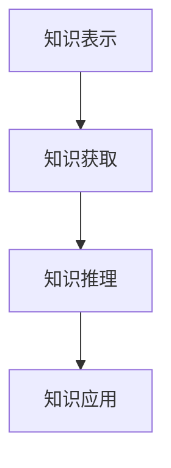

                 

关键词：人工智能、机器学习、知识模拟、算法、数学模型、项目实践、应用场景、未来发展、工具和资源

> 摘要：本文旨在深入探讨人工智能领域中的机器学习技术，分析其在知识模拟中的应用及其前沿发展。通过对核心概念、算法原理、数学模型、项目实践、应用场景和未来展望的详细解析，本文希望能够为读者提供全面、系统的理解和指导，激发对这一领域的进一步研究兴趣。

## 1. 背景介绍

### 1.1 人工智能与机器学习

人工智能（Artificial Intelligence，AI）是一门旨在使计算机模拟人类智能行为的科学。机器学习（Machine Learning，ML）是人工智能的一个重要分支，通过数据和算法让计算机自动学习并作出决策。机器学习的关键在于“学习”，即计算机能够根据输入数据自主调整其行为，以达到优化特定任务的目的。

### 1.2 知识模拟

知识模拟是指利用机器学习技术模拟人类知识获取、理解和应用的过程。在人工智能的发展过程中，知识模拟一直是重要的研究方向，旨在构建能够像人类一样理解、学习和应用知识的智能系统。知识模拟对于推动人工智能在各个领域的应用具有重要意义。

## 2. 核心概念与联系

### 2.1 机器学习的基本概念

**监督学习**：监督学习是一种机器学习方法，通过给定的输入数据和对应的标签，训练模型并使其能够对新的输入数据进行预测。

**无监督学习**：无监督学习不提供标签，通过模型自动识别数据中的模式和结构。

**强化学习**：强化学习通过奖励机制训练模型，使其在特定环境中作出最优决策。

### 2.2 知识模拟的架构

知识模拟的架构通常包括以下几个部分：

**知识表示**：将人类知识以机器可处理的形式表示出来。

**知识获取**：通过机器学习算法从数据中提取有用信息。

**知识推理**：利用推理机制对知识进行推理和扩展。

**知识应用**：将知识应用于实际问题解决中。

### 2.3 Mermaid 流程图



## 3. 核心算法原理 & 具体操作步骤

### 3.1 算法原理概述

机器学习算法的核心在于“学习”，即通过迭代优化模型参数，使其在特定任务上表现优异。常见的机器学习算法包括线性回归、逻辑回归、支持向量机、神经网络等。

### 3.2 算法步骤详解

**3.2.1 数据预处理**

数据预处理是机器学习过程中至关重要的一步，包括数据清洗、归一化、降维等。

**3.2.2 模型选择**

根据具体任务需求选择合适的算法模型。

**3.2.3 模型训练**

使用训练数据对模型进行训练，调整模型参数。

**3.2.4 模型评估**

使用验证数据对模型进行评估，调整模型参数。

**3.2.5 模型应用**

将训练好的模型应用于实际问题解决中。

### 3.3 算法优缺点

**优点**：

- 高效的数据处理能力。
- 自动化的决策过程。

**缺点**：

- 需要大量的数据。
- 模型可解释性差。

### 3.4 算法应用领域

机器学习算法在各个领域都有广泛应用，如自然语言处理、计算机视觉、推荐系统等。

## 4. 数学模型和公式 & 详细讲解 & 举例说明

### 4.1 数学模型构建

机器学习中的数学模型主要包括线性模型、逻辑回归模型、神经网络模型等。

### 4.2 公式推导过程

以线性回归模型为例，推导其数学模型：

$$
Y = \beta_0 + \beta_1X
$$

### 4.3 案例分析与讲解

使用线性回归模型对房价进行预测。

## 5. 项目实践：代码实例和详细解释说明

### 5.1 开发环境搭建

搭建Python开发环境，安装必要的库。

### 5.2 源代码详细实现

```python
# 线性回归模型实现
import numpy as np
from sklearn.linear_model import LinearRegression

# 数据准备
X = np.array([[1], [2], [3], [4], [5]])
y = np.array([1, 2, 2.5, 4, 5])

# 模型训练
model = LinearRegression()
model.fit(X, y)

# 模型评估
print(model.score(X, y))

# 模型应用
X_new = np.array([[6]])
print(model.predict(X_new))
```

### 5.3 代码解读与分析

代码首先导入必要的库，然后准备数据，接下来使用线性回归模型进行训练和评估，最后将训练好的模型应用于新的数据。

## 6. 实际应用场景

### 6.1 自然语言处理

使用机器学习技术对自然语言进行处理和分析，如文本分类、情感分析、机器翻译等。

### 6.2 计算机视觉

利用机器学习算法进行图像识别、目标检测、人脸识别等。

### 6.3 推荐系统

基于用户行为数据，构建推荐系统，为用户提供个性化的推荐。

## 7. 工具和资源推荐

### 7.1 学习资源推荐

- 《Python机器学习基础教程》
- 《深度学习入门》

### 7.2 开发工具推荐

- Jupyter Notebook
- PyCharm

### 7.3 相关论文推荐

- "Deep Learning"
- "Reinforcement Learning: An Introduction"

## 8. 总结：未来发展趋势与挑战

### 8.1 研究成果总结

机器学习技术在各个领域取得了显著的成果，为人工智能的发展奠定了基础。

### 8.2 未来发展趋势

- 深度学习
- 强化学习
- 量子机器学习

### 8.3 面临的挑战

- 数据隐私
- 模型可解释性
- 模型公平性

### 8.4 研究展望

未来机器学习技术将更加深入地应用于各个领域，推动人工智能的进一步发展。

## 9. 附录：常见问题与解答

### 9.1 什么是机器学习？

机器学习是一种人工智能技术，通过数据和算法让计算机自动学习并作出决策。

### 9.2 机器学习有哪些类型？

机器学习主要分为监督学习、无监督学习和强化学习。

### 9.3 如何选择机器学习算法？

根据具体任务需求和数据特点选择合适的算法。

### 9.4 机器学习有哪些应用领域？

机器学习在自然语言处理、计算机视觉、推荐系统等领域都有广泛应用。

### 9.5 机器学习模型的评估指标有哪些？

常用的评估指标包括准确率、召回率、F1分数等。

----------------------------------------------------------------

作者：禅与计算机程序设计艺术 / Zen and the Art of Computer Programming

