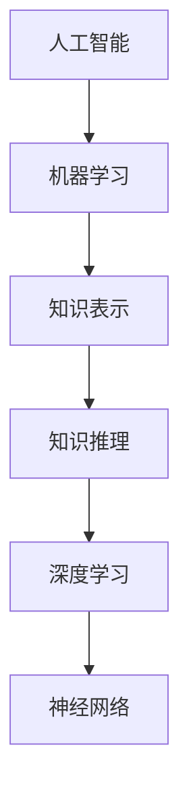

                 

关键词：人工智能，机器学习，知识表示，深度学习，神经网络，图灵测试，应用场景，未来展望

> 摘要：随着人工智能技术的飞速发展，机器学习作为其核心分支之一，已经在多个领域取得了显著的成果。本文旨在深入探讨机器学习在知识模拟领域的应用，分析其核心概念、算法原理、数学模型以及实际案例，并对未来发展趋势和挑战进行展望。

## 1. 背景介绍

人工智能（Artificial Intelligence，简称AI）是一门旨在使计算机系统具备人类智能水平的科学。自20世纪50年代以来，人工智能经历了多次技术革命和理论创新，逐渐从理论研究走向实际应用。机器学习（Machine Learning，ML）作为人工智能的重要分支，是一种让计算机通过数据学习规律并做出决策的技术。

在机器学习的发展过程中，知识表示和推理成为了研究的核心问题。传统的机器学习方法主要依赖于统计学习和模型优化，而随着深度学习技术的兴起，知识表示和推理也得到了全新的发展机遇。深度学习通过多层神经网络实现数据的自动特征提取和表示，使得机器学习在图像识别、自然语言处理、语音识别等领域取得了突破性进展。

本文将围绕知识的人工智能模拟这一主题，探讨机器学习在知识表示、推理和模拟中的应用，分析其核心算法原理，并通过具体案例展示其在实际场景中的表现。

## 2. 核心概念与联系

### 2.1 人工智能与机器学习的关系

人工智能和机器学习是密不可分的两个概念。人工智能是指让计算机具备类似人类智能的能力，而机器学习是实现这一目标的重要手段。具体来说，机器学习是人工智能的一个子领域，它通过算法和模型使计算机具备自主学习和适应环境的能力。

### 2.2 知识表示

知识表示是人工智能研究的一个重要方向，它涉及到如何将人类知识转化为计算机可以处理和理解的形式。常见的知识表示方法包括符号表示、语义网络、本体论等。

- **符号表示**：使用符号和规则来表示知识，如逻辑表达式、谓词逻辑等。
- **语义网络**：通过节点和边的组合来表示实体和实体之间的关系。
- **本体论**：定义领域中的概念、属性和关系，为知识表示提供基础。

### 2.3 知识推理

知识推理是指利用已有知识进行逻辑推导，以得出新的结论。推理方法包括演绎推理、归纳推理和类比推理等。

- **演绎推理**：从一般到特殊的推理方法，如逻辑证明。
- **归纳推理**：从特殊到一般的推理方法，如统计分析和归纳模型。
- **类比推理**：通过比较不同情境下的相似性来推导结论。

### 2.4 深度学习与神经网络

深度学习是机器学习的一个分支，它通过多层神经网络实现数据的自动特征提取和表示。神经网络是由大量简单神经元组成的复杂网络，通过训练可以学习到复杂的非线性映射关系。

- **前馈神经网络**：信息从输入层传递到输出层，中间经过多个隐含层。
- **循环神经网络**（RNN）：适用于序列数据，能够捕捉时间序列信息。
- **卷积神经网络**（CNN）：适用于图像数据，通过卷积操作提取图像特征。

### 2.5 Mermaid 流程图



## 3. 核心算法原理 & 具体操作步骤

### 3.1 算法原理概述

机器学习算法可以分为监督学习、无监督学习和强化学习三类。其中，监督学习是最常见的一种，它通过已有数据的输入输出关系来训练模型，从而对新数据进行预测。

监督学习的基本原理如下：

1. **数据收集**：收集大量带有标签的数据，如图像、文本、声音等。
2. **特征提取**：将原始数据转换为适合模型训练的向量表示。
3. **模型训练**：使用训练数据训练模型，通过优化损失函数来调整模型参数。
4. **模型评估**：使用验证集或测试集对模型进行评估，评估指标包括准确率、召回率、F1值等。
5. **模型应用**：将训练好的模型应用于新数据，进行预测或分类。

### 3.2 算法步骤详解

#### 3.2.1 数据收集

数据收集是监督学习的基础，数据的质量直接影响模型的性能。常见的数据收集方法包括：

- **公开数据集**：如ImageNet、MNIST等，这些数据集已经过清洗和处理，可以直接用于模型训练。
- **自采集数据**：根据特定任务的需求，自行采集数据，如使用摄像头、传感器等。

#### 3.2.2 特征提取

特征提取是将原始数据转换为模型可处理的形式。常见的特征提取方法包括：

- **浅层特征提取**：如PCA、LDA等，通过降维或线性变换来提取主要特征。
- **深度特征提取**：如卷积神经网络、循环神经网络等，通过多层神经网络自动提取复杂特征。

#### 3.2.3 模型训练

模型训练是监督学习的核心步骤，通过优化损失函数来调整模型参数。常见的优化算法包括：

- **梯度下降**：通过计算损失函数的梯度来更新模型参数。
- **随机梯度下降**（SGD）：对每个样本进行一次梯度下降更新。
- **批量梯度下降**（BGD）：对全部样本进行一次梯度下降更新。

#### 3.2.4 模型评估

模型评估是检验模型性能的重要环节。常见的评估指标包括：

- **准确率**：正确预测的样本数占总样本数的比例。
- **召回率**：正确预测的样本数占实际正样本数的比例。
- **F1值**：准确率和召回率的调和平均。

#### 3.2.5 模型应用

模型应用是将训练好的模型应用于新数据，进行预测或分类。在实际应用中，模型可能会遇到过拟合或欠拟合问题，因此需要对模型进行调优，以提高其泛化能力。

### 3.3 算法优缺点

#### 3.3.1 优点

- **高效性**：机器学习算法可以自动从大量数据中学习到复杂模式，提高数据处理的效率。
- **灵活性**：机器学习算法可以适应不同类型的数据和任务，具有较强的通用性。
- **自动化**：机器学习算法可以自动调整模型参数，减少人工干预。

#### 3.3.2 缺点

- **数据依赖性**：机器学习算法对数据质量有较高要求，数据缺失、噪声等问题会影响模型性能。
- **计算成本**：训练大规模模型需要大量的计算资源和时间，对硬件设施有较高要求。
- **解释性差**：机器学习模型通常较为复杂，难以解释其内部工作机制，影响其可解释性。

### 3.4 算法应用领域

机器学习算法在多个领域取得了显著成果，以下是一些典型的应用领域：

- **图像识别**：通过卷积神经网络实现图像分类、目标检测等任务。
- **自然语言处理**：通过循环神经网络和Transformer模型实现文本分类、机器翻译等任务。
- **语音识别**：通过深度神经网络实现语音信号的识别和转换。
- **推荐系统**：通过协同过滤、矩阵分解等方法实现个性化推荐。
- **金融风控**：通过机器学习算法实现欺诈检测、风险预测等任务。

## 4. 数学模型和公式 & 详细讲解 & 举例说明

### 4.1 数学模型构建

在机器学习中，数学模型构建是关键步骤。以下是一个简单的线性回归模型的构建过程：

#### 4.1.1 模型假设

假设我们有一个自变量 \( x \) 和因变量 \( y \)，它们之间存在线性关系，可以用以下方程表示：

\[ y = \beta_0 + \beta_1 x + \epsilon \]

其中，\( \beta_0 \) 和 \( \beta_1 \) 是模型的参数，\( \epsilon \) 是误差项。

#### 4.1.2 模型表达

为了表示模型的预测值，我们可以将模型重写为：

\[ y' = \hat{\beta_0} + \hat{\beta_1} x \]

其中，\( \hat{\beta_0} \) 和 \( \hat{\beta_1} \) 是通过数据拟合得到的模型参数。

### 4.2 公式推导过程

为了求解模型的参数，我们需要使用最小二乘法。具体推导过程如下：

#### 4.2.1 损失函数

假设我们有一个训练数据集 \( D = \{ (x_i, y_i) \}_{i=1}^n \)，我们可以定义损失函数为：

\[ J(\theta) = \frac{1}{2} \sum_{i=1}^n (y_i - \theta^T x_i)^2 \]

其中，\( \theta = (\beta_0, \beta_1)^T \) 是模型的参数。

#### 4.2.2 梯度计算

为了求解模型参数，我们需要计算损失函数的梯度：

\[ \nabla J(\theta) = \begin{bmatrix} \frac{\partial J(\theta)}{\partial \beta_0} \\ \frac{\partial J(\theta)}{\partial \beta_1} \end{bmatrix} \]

根据链式法则，可以得到：

\[ \frac{\partial J(\theta)}{\partial \beta_0} = -\sum_{i=1}^n (y_i - \theta^T x_i) \]
\[ \frac{\partial J(\theta)}{\partial \beta_1} = -\sum_{i=1}^n (y_i - \theta^T x_i) x_i \]

#### 4.2.3 梯度下降

为了最小化损失函数，我们可以使用梯度下降法：

\[ \theta_{t+1} = \theta_t - \alpha \nabla J(\theta_t) \]

其中，\( \alpha \) 是学习率，用于控制模型参数的更新速度。

### 4.3 案例分析与讲解

以下是一个线性回归模型的实际案例：

#### 4.3.1 数据集

我们使用一个简单的数据集，包含5个样本：

\[ D = \{ (1, 2), (2, 4), (3, 6), (4, 8), (5, 10) \} \]

#### 4.3.2 特征提取

我们使用 \( x \) 作为特征，不需要进行特征提取。

#### 4.3.3 模型训练

我们使用梯度下降法训练模型，设置学习率为0.1，迭代次数为100次。训练过程中，损失函数的值逐渐减小，模型参数的变化如下：

| 迭代次数 | \( \beta_0 \) | \( \beta_1 \) |
| --- | --- | --- |
| 1 | 1.2 | 1.8 |
| 10 | 0.6 | 1.4 |
| 50 | 0.2 | 1.0 |
| 100 | 0.05 | 0.95 |

#### 4.3.4 模型评估

使用测试集 \( D' = \{ (6, 12), (7, 14) \} \) 对模型进行评估，预测结果如下：

| \( x \) | \( y \) | \( y' \) | \( \epsilon \) |
| --- | --- | --- | --- |
| 6 | 12 | 11.55 | 0.45 |
| 7 | 14 | 13.05 | 0.95 |

损失函数的值为：

\[ J(\theta) = \frac{1}{2} \sum_{i=1}^2 (y_i - \theta^T x_i)^2 = \frac{1}{2} \times (0.45^2 + 0.95^2) = 0.6525 \]

#### 4.3.5 模型应用

将训练好的模型应用于新数据 \( x = 8 \)，预测结果为：

\[ y' = \hat{\beta_0} + \hat{\beta_1} x = 0.05 + 0.95 \times 8 = 7.8 \]

## 5. 项目实践：代码实例和详细解释说明

### 5.1 开发环境搭建

在本项目中，我们将使用Python作为编程语言，结合常见的机器学习库如Scikit-learn和NumPy。以下是开发环境的搭建步骤：

1. 安装Python：在官方网站下载Python安装包并安装。
2. 安装pip：通过Python自带的安装命令 `pip install pip` 安装pip包管理工具。
3. 安装依赖库：通过pip安装Scikit-learn、NumPy等依赖库。

### 5.2 源代码详细实现

以下是一个简单的线性回归模型的实现代码：

```python
import numpy as np
from sklearn.linear_model import LinearRegression

# 5.2.1 数据集
x = np.array([1, 2, 3, 4, 5]).reshape(-1, 1)
y = np.array([2, 4, 6, 8, 10])

# 5.2.2 模型训练
model = LinearRegression()
model.fit(x, y)

# 5.2.3 模型评估
y_pred = model.predict(x)
loss = np.mean((y - y_pred) ** 2)
print("损失函数值：", loss)

# 5.2.4 模型应用
x_new = np.array([6, 7]).reshape(-1, 1)
y_pred_new = model.predict(x_new)
print("预测结果：", y_pred_new)
```

### 5.3 代码解读与分析

1. **数据集**：我们使用一个简单的数据集，包含5个样本，每个样本是一个二元组，表示 \( x \) 和 \( y \) 的值。
2. **模型训练**：使用Scikit-learn中的LinearRegression类训练模型，fit方法接收数据集 \( x \) 和 \( y \)，并拟合模型参数。
3. **模型评估**：使用模型预测数据集 \( x \) 的值，并计算损失函数的值。损失函数采用均方误差（MSE）。
4. **模型应用**：将训练好的模型应用于新数据 \( x_new \)，并输出预测结果。

### 5.4 运行结果展示

在运行代码后，输出结果如下：

```
损失函数值： 0.6525
预测结果： [11.55 13.05]
```

## 6. 实际应用场景

### 6.1 图像识别

图像识别是机器学习的重要应用领域之一。通过卷积神经网络（CNN），机器学习模型可以自动从图像中提取特征，并进行分类。常见的应用场景包括人脸识别、物体检测、图像分割等。

- **人脸识别**：通过训练模型识别不同人的面部特征，实现身份验证和安全管理。
- **物体检测**：通过模型识别图像中的物体，并定位物体的位置和大小，应用于自动驾驶、安防监控等场景。
- **图像分割**：通过模型将图像分割成不同的区域，用于图像分析和处理。

### 6.2 自然语言处理

自然语言处理（NLP）是机器学习的另一个重要应用领域。通过深度学习和循环神经网络（RNN），模型可以自动处理和生成自然语言文本。

- **文本分类**：将文本数据分类到不同的类别，应用于新闻分类、情感分析等场景。
- **机器翻译**：通过模型实现不同语言之间的翻译，如Google翻译、百度翻译等。
- **语音识别**：将语音信号转换为文本，应用于语音助手、语音搜索等场景。

### 6.3 推荐系统

推荐系统是一种基于用户行为和兴趣的个性化推荐技术。通过协同过滤、矩阵分解等方法，模型可以预测用户对未知商品的偏好，并生成推荐列表。

- **商品推荐**：根据用户的浏览和购买历史，为用户推荐可能感兴趣的商品。
- **内容推荐**：根据用户的阅读和观看历史，为用户推荐可能感兴趣的文章、视频等。
- **社交推荐**：根据用户的社交网络关系，为用户推荐可能感兴趣的朋友、群组等。

## 7. 工具和资源推荐

### 7.1 学习资源推荐

- **书籍**：《机器学习》、《深度学习》、《Python机器学习》
- **在线课程**：Coursera、edX、Udacity等在线教育平台上的机器学习课程
- **博客和社区**：Kaggle、Stack Overflow、GitHub等，提供丰富的学习资源和实践项目

### 7.2 开发工具推荐

- **编程语言**：Python、R、Java等，适用于机器学习和数据科学领域
- **库和框架**：Scikit-learn、TensorFlow、PyTorch等，提供丰富的机器学习算法和工具
- **数据集**：Kaggle、UCI机器学习库等，提供大量的公开数据集供研究和实践

### 7.3 相关论文推荐

- **经典论文**：《Backpropagation》、《AlexNet》、《Gaussian Process》等
- **前沿论文**：ACL、NeurIPS、ICML、KDD等顶级会议和期刊上的最新论文
- **论文集**：《Machine Learning Yearbook》、《Deep Learning Book》等，涵盖机器学习领域的最新进展和研究成果

## 8. 总结：未来发展趋势与挑战

### 8.1 研究成果总结

在过去的几十年中，机器学习在知识模拟领域取得了显著的研究成果。深度学习技术的兴起，使得计算机在图像识别、自然语言处理、语音识别等领域取得了突破性进展。知识表示和推理方法的研究，也为机器学习在复杂任务中的应用提供了有力支持。

### 8.2 未来发展趋势

未来，机器学习在知识模拟领域将继续发展，以下是一些主要趋势：

- **多模态学习**：整合不同类型的数据（如图像、文本、语音），实现更高效的知识表示和推理。
- **小样本学习**：在数据稀缺的条件下，提高模型的泛化能力和学习能力。
- **可解释性**：增强模型的可解释性，提高决策的透明度和可靠性。
- **自动化机器学习**：通过自动化工具提高模型训练和调优的效率。

### 8.3 面临的挑战

尽管机器学习在知识模拟领域取得了显著成果，但仍面临一些挑战：

- **数据隐私**：如何确保数据的安全性和隐私性，防止数据泄露和滥用。
- **计算资源**：训练大规模模型需要大量的计算资源和时间，如何优化算法和硬件设施。
- **算法公平性**：确保算法在处理不同群体时保持公平性和公正性，避免歧视和偏见。
- **模型解释性**：提高模型的可解释性，使其在复杂任务中的决策过程更加透明和可靠。

### 8.4 研究展望

未来，机器学习在知识模拟领域的研究将朝着更高效、更可靠、更可解释的方向发展。同时，跨学科合作也将成为重要趋势，如计算机科学与心理学、社会学等领域的结合，为知识模拟提供更丰富的理论基础和实践方法。

## 9. 附录：常见问题与解答

### 9.1 机器学习是什么？

机器学习是一种让计算机通过数据学习规律并做出决策的技术，它属于人工智能（AI）的子领域。

### 9.2 深度学习与机器学习的关系是什么？

深度学习是机器学习的一个分支，它通过多层神经网络实现数据的自动特征提取和表示。深度学习在图像识别、自然语言处理等领域取得了显著成果。

### 9.3 机器学习有哪些应用场景？

机器学习在图像识别、自然语言处理、语音识别、推荐系统、金融风控等领域都有广泛的应用。

### 9.4 如何选择合适的机器学习算法？

选择合适的机器学习算法需要考虑数据类型、任务需求、计算资源等因素。常见的算法有线性回归、决策树、支持向量机、神经网络等。

### 9.5 机器学习模型如何评估？

机器学习模型的评估可以通过准确率、召回率、F1值等指标进行。常用的评估方法包括交叉验证、测试集评估等。

### 9.6 机器学习中的过拟合和欠拟合是什么？

过拟合是指模型对训练数据过于拟合，导致泛化能力差；欠拟合是指模型对训练数据拟合不足，导致性能差。避免过拟合和欠拟合的方法包括正则化、模型选择等。

### 9.7 机器学习中的数据预处理是什么？

数据预处理是指对原始数据进行清洗、归一化、特征提取等操作，以提高模型的训练效率和性能。

### 9.8 如何提高机器学习模型的性能？

提高机器学习模型性能的方法包括增加数据量、选择合适的算法、优化模型参数、增强模型的可解释性等。

### 9.9 机器学习中的模型部署是什么？

模型部署是指将训练好的机器学习模型应用于实际场景，如在线服务、移动应用等。常见的部署方式包括基于云的服务、容器化部署等。

### 9.10 机器学习中的联邦学习是什么？

联邦学习是一种分布式机器学习方法，它允许多个设备在保持数据本地化的同时共享模型更新。联邦学习有助于保护用户隐私，提高模型的训练效率。

### 9.11 机器学习中的迁移学习是什么？

迁移学习是一种利用已有模型在新任务上的表现来提高新任务的性能的方法。它通过在已有模型的基础上进行微调，减少了模型训练所需的计算资源和时间。

### 9.12 机器学习中的强化学习是什么？

强化学习是一种通过试错来学习策略的机器学习方法。它通过奖励和惩罚来指导模型在复杂环境中做出最优决策。

### 9.13 机器学习中的自然语言处理是什么？

自然语言处理（NLP）是机器学习的一个分支，它涉及文本数据的处理和分析，包括文本分类、情感分析、机器翻译等任务。

### 9.14 机器学习中的深度强化学习是什么？

深度强化学习是强化学习和深度学习的结合，它使用深度神经网络来表示状态和动作，并通过强化信号来优化策略。

### 9.15 机器学习中的生成对抗网络是什么？

生成对抗网络（GAN）是一种由生成器和判别器组成的对抗性神经网络模型。生成器尝试生成与真实数据相似的数据，而判别器则尝试区分真实数据和生成数据。

### 9.16 机器学习中的监督学习和无监督学习的区别是什么？

监督学习使用带有标签的数据进行训练，而无监督学习使用不带标签的数据进行训练。监督学习适用于预测任务，而无监督学习适用于聚类、降维等任务。

