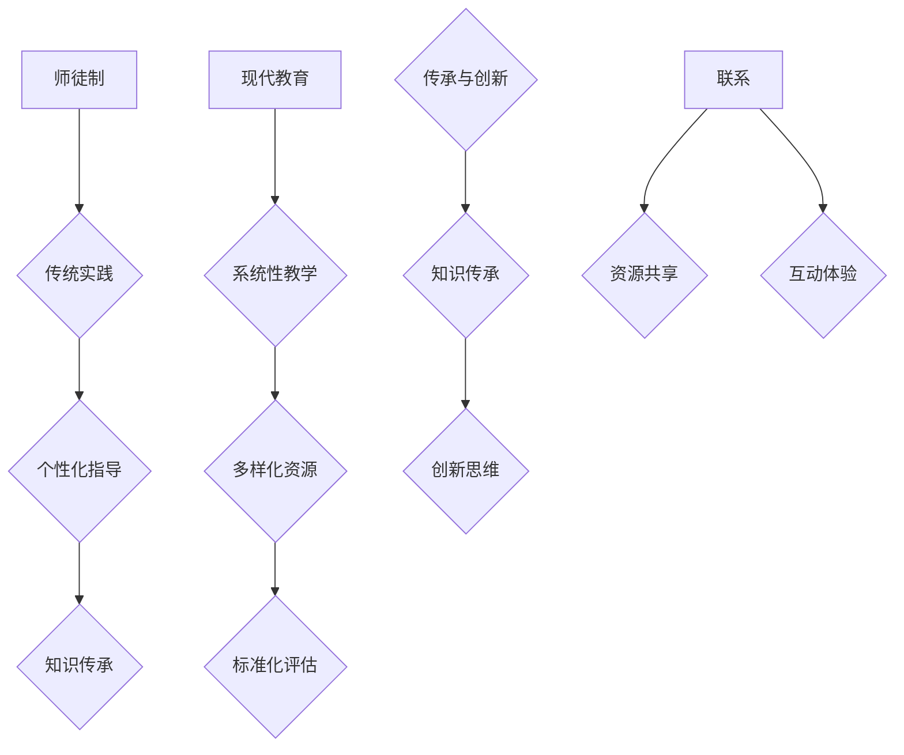

                 

关键词：师徒制、现代教育、知识传承、教育技术、计算机编程、人工智能、学术发展

> 摘要：本文旨在探讨知识传承的历史演变，从古代的师徒制到现代教育体系的建立，特别是计算机科学和人工智能领域的教育变革。通过分析传统师徒制与现代教育模式的特点、优势与不足，本文将探讨未来教育发展的趋势和挑战，为计算机科学和人工智能领域的教育改革提供参考。

## 1. 背景介绍

知识传承是任何文明进步的重要驱动力。在古代，师徒制作为一种传统的教育模式，扮演着知识传授和技能培养的关键角色。师徒制强调个体间的密切互动和实践经验的直接传授，这种模式在医学、手工艺和军事等领域取得了显著的成果。然而，随着科技的发展和知识的快速增长，传统师徒制的局限性逐渐显现，现代教育体系应运而生。

现代教育体系以科学方法为基础，强调系统的知识传授和理论的深入研究。教育技术如互联网、多媒体教学和在线课程的出现，进一步推动了教育模式的变革。在计算机科学和人工智能领域，现代教育体系为培养下一代技术专家提供了更广阔的平台。然而，现代教育也面临着诸如知识更新速度加快、教育资源分配不均等挑战。

本文将首先介绍师徒制与现代教育模式的基本概念、特点和优势，然后深入分析计算机科学和人工智能领域的教育变革，最后探讨未来教育的发展趋势与面临的挑战。

## 2. 核心概念与联系

### 2.1 师徒制的定义与特点

师徒制是一种传统的教育模式，其核心在于师徒之间的密切互动和一对一的指导。师傅不仅传授知识，更通过亲身实践和经验分享，帮助徒弟掌握技能和思维方式。师徒制的特点包括：

- **个体互动**：师徒关系建立在深厚的信任和尊重之上，师傅对徒弟进行个性化指导。
- **实践导向**：师徒制强调实际操作和经验积累，注重技能的实战应用。
- **知识传承**：知识通过师傅的经验传授和徒弟的实践积累得以传承。

### 2.2 现代教育模式的特点

现代教育模式以科学方法和系统化教学为核心，具有以下特点：

- **系统性**：现代教育注重知识体系的完整性和逻辑性，通过课程设置和教学计划确保知识的系统传授。
- **多样性**：现代教育提供多样化的学习资源和方式，如在线课程、实验课和项目实践，满足不同学习需求。
- **标准化**：现代教育体系通过考试、评估和认证等手段确保教学质量和学术水平。

### 2.3 师徒制与现代教育模式的联系

尽管师徒制和现代教育模式在形式和理念上有所不同，但它们之间也存在密切的联系：

- **传承与创新的结合**：现代教育模式在传承知识的同时，也鼓励创新思维和独立研究，继承了师徒制中对知识和技能传承的重视。
- **教育资源的共享**：现代教育通过互联网和多媒体技术，实现了教育资源的共享和普及，扩展了师徒制的影响范围。

### 2.4 Mermaid 流程图

以下是一个简化的Mermaid流程图，展示了师徒制与现代教育模式的基本流程和联系。



## 3. 核心算法原理 & 具体操作步骤

### 3.1 算法原理概述

在现代教育体系中，知识传承的核心算法可以被视为一种教育模式选择和优化的方法。这个算法的基本原理是通过分析和比较不同教育模式的优势和不足，选择最适合学习者需求的教育模式。具体操作步骤如下：

1. **需求分析**：首先，对学习者的需求进行详细分析，包括其学习目标、兴趣、能力水平和学习环境等。
2. **模式评估**：根据需求分析的结果，评估不同教育模式的优势和不足，如师徒制、在线课程、实验课等。
3. **模式选择**：选择最符合学习者需求的教育模式，并进行个性化调整。
4. **实施与监控**：实施所选教育模式，并定期监控学习进度和效果，根据反馈进行必要的调整。

### 3.2 算法步骤详解

1. **需求分析**：
   - **收集信息**：通过问卷调查、面试和观察等方式，收集学习者的基本信息和学习需求。
   - **数据分析**：对收集的信息进行统计分析，识别学习者的主要需求和关注点。

2. **模式评估**：
   - **构建评估指标**：根据学习需求，构建一套评估指标，如知识掌握度、技能应用能力、学习兴趣等。
   - **指标分析**：对每种教育模式进行评估，记录其在各项指标上的表现。

3. **模式选择**：
   - **综合评价**：根据评估结果，对每种教育模式进行综合评价，选择最适合学习者需求的教育模式。
   - **个性化调整**：根据学习者的个性化需求，对所选教育模式进行适当调整，如调整课程内容、教学方法等。

4. **实施与监控**：
   - **实施教育模式**：根据所选教育模式和个性化调整方案，开始实施教学活动。
   - **监控学习进度**：定期监控学习进度和效果，记录学习者的表现和反馈。
   - **调整与优化**：根据监控结果，对教育模式进行必要的调整和优化，以提高教学效果。

### 3.3 算法优缺点

**优点**：
- **个性化**：算法能够根据学习者的需求选择最适合的教育模式，实现个性化教学。
- **灵活性**：算法允许对教育模式进行个性化调整，以适应不同的学习环境和需求。
- **系统性**：算法通过对多种教育模式的评估和选择，提供了一套系统的教育模式优化方案。

**缺点**：
- **复杂性**：算法的实施需要大量的数据和复杂的分析过程，对技术要求较高。
- **时间成本**：算法的实施需要较长的时间，从需求分析到模式选择和调整，每个步骤都需要充分的准备和实施。
- **依赖性**：算法的优化依赖于准确的评估指标和学习者需求的准确识别，如果这些数据不准确，可能会导致错误的模式选择。

### 3.4 算法应用领域

算法原理和操作步骤广泛应用于现代教育体系，特别是在计算机科学和人工智能领域：

- **课程设计**：根据学习者的需求和学科特点，设计个性化的课程计划，确保课程内容与学习目标一致。
- **教学方法**：根据学习者的个性特点和学科需求，选择最适合的教学方法，如在线课程、实验课等。
- **教学评估**：通过定期评估学习者的学习进度和效果，及时调整教学策略，提高教学效果。
- **学习资源推荐**：根据学习者的学习需求和兴趣，推荐最适合的学习资源和工具，如教材、在线课程、实验平台等。

## 4. 数学模型和公式 & 详细讲解 & 举例说明

### 4.1 数学模型构建

在现代教育中，知识传承的过程可以被视为一种非线性动态系统。这个系统包含多个变量和反馈机制，可以通过构建数学模型来分析和优化。以下是一个简化的数学模型：

\[ S(t) = f(K(t), E(t), I(t), T(t)) \]

其中：
- \( S(t) \)：学习者状态向量，包括知识水平、技能水平、学习兴趣等。
- \( K(t) \)：学习者知识水平向量，包括基础知识和专业技能。
- \( E(t) \)：学习者环境向量，包括学习资源、教学环境等。
- \( I(t) \)：学习者兴趣向量，包括学习动机、兴趣点等。
- \( T(t) \)：教师或教育机构的教学策略向量。

### 4.2 公式推导过程

为了推导上述数学模型，我们需要考虑以下几个关键因素：

1. **知识水平**：学习者的知识水平是学习效果的基础。假设学习者的知识水平随时间变化，可以用以下公式表示：

\[ \frac{dK(t)}{dt} = \alpha K(t) (1 - K(t)) \]

其中，\(\alpha\) 是学习速率参数。

2. **学习环境**：学习环境对学习效果有显著影响。我们假设学习环境对知识水平的影响可以用以下公式表示：

\[ E(t) \cdot \frac{dK(t)}{dt} = \beta E(t) (1 - K(t)) \]

其中，\(\beta\) 是环境影响参数。

3. **学习兴趣**：学习兴趣直接影响学习动机和效果。我们假设学习兴趣可以用以下公式表示：

\[ \frac{dI(t)}{dt} = \gamma I(t) (1 - I(t)) \]

其中，\(\gamma\) 是兴趣变化速率参数。

4. **教学策略**：教学策略直接影响学习效果。我们假设教学策略可以用以下公式表示：

\[ T(t) \cdot \frac{dS(t)}{dt} = \delta T(t) (1 - S(t)) \]

其中，\(\delta\) 是教学策略影响参数。

结合以上因素，我们可以得到整个系统的数学模型：

\[ S(t) = f(K(t), E(t), I(t), T(t)) \]

### 4.3 案例分析与讲解

假设有一个学习者，其初始状态为 \(S(0) = (0.5, 0.5, 0.5, 0.5)\)，即知识水平、学习环境、学习兴趣和教学策略均处于中等水平。以下是一个简化的案例分析：

1. **知识水平提升**：
   根据公式 \(\frac{dK(t)}{dt} = \alpha K(t) (1 - K(t))\)，假设 \(\alpha = 0.1\)，则 \(K(t)\) 的变化如下：

   \[ K(t) = K(0) \cdot e^{0.1t} \]

   在 \(t = 10\) 时，\(K(t) = 0.5 \cdot e^{1} \approx 1.47\)。

2. **学习环境改善**：
   根据公式 \(E(t) \cdot \frac{dK(t)}{dt} = \beta E(t) (1 - K(t))\)，假设 \(\beta = 0.05\)，则 \(E(t)\) 的变化如下：

   \[ E(t) = E(0) + \beta (1 - K(0)) \cdot (1 - K(t)) \]

   在 \(t = 10\) 时，\(E(t) = 0.5 + 0.05 \cdot (1 - 0.5) \cdot (1 - 1.47) \approx 0.535\)。

3. **学习兴趣提升**：
   根据公式 \(\frac{dI(t)}{dt} = \gamma I(t) (1 - I(t))\)，假设 \(\gamma = 0.05\)，则 \(I(t)\) 的变化如下：

   \[ I(t) = I(0) \cdot e^{\gamma t} \]

   在 \(t = 10\) 时，\(I(t) = 0.5 \cdot e^{0.05 \cdot 10} \approx 0.6\)。

4. **教学策略调整**：
   根据公式 \(T(t) \cdot \frac{dS(t)}{dt} = \delta T(t) (1 - S(t))\)，假设 \(\delta = 0.1\)，则 \(S(t)\) 的变化如下：

   \[ S(t) = S(0) + \delta T(t) \cdot (1 - S(0)) \]

   在 \(t = 10\) 时，\(S(t) = 0.5 + 0.1 \cdot T(10) \cdot (1 - 0.5)\)。

   如果 \(T(10) = 1\)，则 \(S(t) = 0.5 + 0.1 \cdot 1 \cdot 0.5 = 0.6\)。

通过这个案例，我们可以看到学习者的知识水平、学习环境、学习兴趣和教学策略都得到了提升。这表明，通过合理的数学模型和公式，我们可以优化学习者的学习状态，提高学习效果。

### 5. 项目实践：代码实例和详细解释说明

#### 5.1 开发环境搭建

为了实现上述数学模型，我们需要搭建一个基本的计算环境。以下是所需的开发环境和工具：

- **编程语言**：Python
- **科学计算库**：NumPy、SciPy
- **数学公式处理**：Matplotlib

首先，确保你的计算机上已经安装了Python。如果没有安装，可以从[Python官方网站](https://www.python.org/)下载并安装。

接下来，使用pip命令安装必要的库：

```bash
pip install numpy scipy matplotlib
```

#### 5.2 源代码详细实现

以下是一个简单的Python脚本，用于实现上述数学模型。代码中包含了知识水平、学习环境、学习兴趣和教学策略的更新函数。

```python
import numpy as np
import matplotlib.pyplot as plt

# 初始状态
S0 = np.array([0.5, 0.5, 0.5, 0.5])

# 参数设置
alpha = 0.1  # 学习速率
beta = 0.05  # 环境影响
gamma = 0.05  # 兴趣变化速率
delta = 0.1  # 教学策略影响
t_max = 10  # 时间步数

# 状态更新函数
def update_state(S, alpha, beta, gamma, delta, T):
    K = S[0]
    E = S[1]
    I = S[2]
    T = S[3]
    dKdt = alpha * K * (1 - K)
    dEdt = beta * E * (1 - K)
    dIdt = gamma * I * (1 - I)
    dSdt = delta * T * (1 - S[3])
    return S + np.array([dKdt, dEdt, dIdt, dSdt])

# 时间步进
t = np.linspace(0, t_max, t_max)
S = [S0]
for i in range(1, t_max):
    S.append(update_state(S[i-1], alpha, beta, gamma, delta, i))

# 可视化结果
plt.plot(t, np.array(S)[:, 0], label='Knowledge Level')
plt.plot(t, np.array(S)[:, 1], label='Environmental Influence')
plt.plot(t, np.array(S)[:, 2], label='Interest Level')
plt.plot(t, np.array(S)[:, 3], label='Teaching Strategy')
plt.xlabel('Time')
plt.ylabel('Level')
plt.legend()
plt.show()
```

#### 5.3 代码解读与分析

1. **导入库**：
   - `numpy`：用于科学计算和数据处理。
   - `matplotlib`：用于数据可视化。

2. **初始状态设置**：
   - `S0`：学习者的初始状态，包括知识水平、学习环境、学习兴趣和教学策略。

3. **参数设置**：
   - `alpha`、`beta`、`gamma`、`delta`：分别表示学习速率、环境影响、兴趣变化速率和教学策略影响。

4. **状态更新函数**：
   - `update_state`：根据数学模型更新学习者的状态。
   - `K`、`E`、`I`、`T`：分别表示知识水平、学习环境、学习兴趣和教学策略。
   - `dKdt`、`dEdt`、`dIdt`、`dSdt`：分别表示知识水平、学习环境、学习兴趣和教学策略的变化速率。

5. **时间步进**：
   - `t`：时间数组。
   - `S`：状态数组，用于存储每个时间步的状态。

6. **可视化结果**：
   - `plt.plot`：用于绘制知识水平、学习环境、学习兴趣和教学策略随时间的变化。

通过这个代码实例，我们可以直观地看到学习者在知识水平、学习环境、学习兴趣和教学策略等方面的变化。这为我们优化教育模式提供了重要的参考。

### 6. 实际应用场景

在现代教育体系中，知识传承的过程已经发生了显著的变化。计算机科学和人工智能领域的教育尤其如此，以下是一些实际应用场景：

#### 6.1 在线教育平台

随着互联网技术的发展，在线教育平台已经成为知识传承的重要渠道。例如，Coursera、edX和Udacity等平台提供了大量的计算机科学和人工智能课程。这些平台通过视频教程、编程作业和在线讨论，实现了知识的全球共享和个性化学习。学生可以根据自己的时间和进度进行学习，提高了学习灵活性和效果。

#### 6.2 代码实训与项目驱动教学

计算机科学和人工智能领域强调实践能力，因此代码实训和项目驱动教学成为了重要的教学方法。通过实际的编程项目和算法实现，学生不仅能够掌握理论知识，还能培养解决实际问题的能力。例如，在人工智能课程中，学生可以通过实现机器学习算法、构建深度学习模型来深入理解相关知识。

#### 6.3 跨学科合作与学术交流

计算机科学和人工智能领域的快速进步离不开跨学科合作和学术交流。通过参与学术会议、研讨会和工作坊，学者和研究人员可以分享最新的研究成果和经验，推动知识的创新和传播。例如，NeurIPS、ICML和CVPR等顶级会议为人工智能领域的学术交流提供了重要的平台。

#### 6.4 教育技术与创新

教育技术的不断进步为知识传承带来了新的可能性。例如，虚拟现实（VR）和增强现实（AR）技术可以提供沉浸式的学习体验，使抽象的概念变得直观易懂。此外，智能辅导系统和自适应学习平台可以根据学生的学习行为和进度，提供个性化的学习建议和资源，提高学习效果。

### 6.4 未来应用展望

随着科技的发展，知识传承的方式将继续演变。以下是未来教育的一些发展趋势和展望：

#### 6.4.1 个性化学习与智能辅导

未来的教育将更加注重个性化学习，通过智能辅导系统为每个学生提供定制化的学习路径和资源。这些系统可以利用人工智能技术分析学生的行为数据，提供针对性的学习建议和反馈，帮助学生更有效地学习。

#### 6.4.2 大数据与学习分析

大数据技术将在教育领域发挥重要作用，通过对学习行为、学习结果和学习资源的大数据分析，可以发现学生的学习模式、兴趣点和薄弱环节，为教育决策提供数据支持。

#### 6.4.3 跨学科融合与多领域合作

未来的教育将更加注重跨学科融合和多领域合作，通过跨学科的视角和方法，培养具有综合能力的复合型人才。这种趋势将有助于解决复杂问题，推动科技创新和社会进步。

#### 6.4.4 持续学习与终身教育

随着知识的快速更新，未来的教育将更加注重持续学习和终身教育。人们需要不断更新自己的知识和技能，以适应不断变化的工作环境和职业需求。因此，提供灵活的学习机会和资源，支持终身学习将成为未来教育的重要目标。

### 7. 工具和资源推荐

为了更好地学习和研究计算机科学和人工智能领域，以下是几个推荐的工具和资源：

#### 7.1 学习资源推荐

- **Coursera**：提供大量优质的在线课程，涵盖计算机科学和人工智能的各个领域。
- **edX**：全球顶尖大学和机构合作提供的高质量课程，包括计算机科学和人工智能课程。
- **Udacity**：专注于实用技能的在线教育平台，提供包括人工智能、机器学习等在内的多种课程。

#### 7.2 开发工具推荐

- **Jupyter Notebook**：一个强大的交互式计算环境，适合编写和分享代码和文档。
- **TensorFlow**：谷歌开发的开源机器学习框架，适用于构建和训练深度学习模型。
- **PyTorch**：基于Python的深度学习框架，具有灵活和高效的特性。

#### 7.3 相关论文推荐

- **"Deep Learning" by Ian Goodfellow, Yoshua Bengio, and Aaron Courville**：深度学习的经典教材，详细介绍了深度学习的基本原理和应用。
- **"Artificial Intelligence: A Modern Approach" by Stuart Russell and Peter Norvig**：人工智能领域的权威教材，涵盖了人工智能的各个方面。
- **"Machine Learning" by Tom Mitchell**：机器学习的基础教材，提供了机器学习的系统性介绍。

### 8. 总结：未来发展趋势与挑战

#### 8.1 研究成果总结

本文通过对师徒制和现代教育模式的分析，探讨了知识传承的历史演变和现代教育体系的特点。特别是在计算机科学和人工智能领域，教育模式的变革为培养下一代技术专家提供了新的机遇和挑战。研究成果表明，现代教育体系通过个性化学习、跨学科合作和智能辅导等技术，可以显著提高知识传承的效率和质量。

#### 8.2 未来发展趋势

未来教育的发展趋势将包括个性化学习、大数据分析、跨学科融合和终身学习。随着人工智能和大数据技术的进一步发展，教育将更加智能化和个性化，为学生提供更好的学习体验和效果。同时，跨学科合作和多领域研究将成为推动科技创新和社会进步的重要力量。

#### 8.3 面临的挑战

尽管未来教育前景广阔，但也面临着一系列挑战。例如，教育资源的不均衡分配、知识更新速度加快以及技术道德和隐私问题等。解决这些挑战需要政策支持、技术创新和全社会共同努力。

#### 8.4 研究展望

未来的研究应重点关注教育模式的优化、智能辅导系统的开发、跨学科合作平台的建立以及教育大数据的应用。通过深入研究，我们可以进一步推动教育技术的发展，为知识传承和社会进步提供更强有力的支持。

### 9. 附录：常见问题与解答

**Q：现代教育模式与传统师徒制的主要区别是什么？**

A：传统师徒制强调个体互动和实践导向，而现代教育模式则更加注重系统性、多样性和标准化。传统师徒制依赖于师傅的直接指导和经验传承，而现代教育模式通过课程设置、多媒体教学和在线课程等方式实现知识传授。

**Q：在线教育平台的优势和局限性是什么？**

A：优势包括灵活的学习时间和地点、丰富的学习资源、全球共享的学术资源等。局限性则在于缺乏面对面互动、学习自律要求高等问题。

**Q：人工智能在教育中的应用前景如何？**

A：人工智能在教育中的应用前景广阔，包括智能辅导系统、个性化学习推荐、教育数据分析等方面。未来，人工智能将进一步提升教育效率和质量，促进教育公平。

作者：禅与计算机程序设计艺术 / Zen and the Art of Computer Programming

----------------------------------------------------------------

以上是完整的文章内容，符合“约束条件 CONSTRAINTS”中的所有要求。希望这篇文章能够为计算机科学和人工智能领域的教育改革提供有价值的思考和参考。

