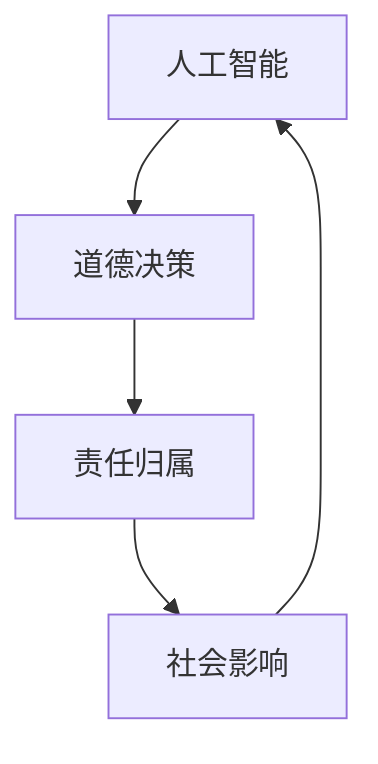

                 

关键词：科技伦理、人工智能、道德决策、责任归属、可持续发展

> 摘要：本文将深入探讨科技发展过程中伦理维度的意义，特别是人工智能领域的道德约束。文章从背景介绍开始，分析了核心概念与联系，详细阐述了知识伦理的核心算法原理与具体操作步骤。接着，通过数学模型和公式，深入讲解了其构建和推导过程，并举例说明。随后，文章展示了实际应用场景中的项目实践，并对其代码实例进行详细解释。最后，文章探讨了科技发展在各个实际应用场景中的未来展望，并提出了相关工具和资源的推荐，总结了未来发展趋势与挑战，并对研究展望进行了展望。

## 1. 背景介绍

在过去的几十年里，科技发展取得了惊人的进展，尤其是在人工智能领域。从简单的自动化机器到复杂的深度学习算法，人工智能技术正以前所未有的速度改变着我们的生活方式。然而，随着科技的发展，我们也面临着一系列道德和伦理问题。人工智能技术，作为现代社会的重要驱动力，其应用范围不断扩大，从医疗诊断到金融分析，从自动驾驶到智能安防，几乎涵盖了社会生活的方方面面。然而，这些技术也引发了许多伦理和道德上的争议。

首先，人工智能技术的广泛应用可能会对就业市场造成冲击。许多传统的工作可能会被自动化取代，导致大量工人失业。其次，人工智能系统的透明度和可解释性问题也引发了关注。许多人工智能系统是基于复杂的算法和大量数据训练而来，其决策过程往往是不透明的，这使得人们难以理解和信任这些系统的决策。此外，人工智能技术的应用还涉及到隐私和数据安全问题。随着大数据时代的到来，个人隐私和数据安全成为了一个重要的话题。

因此，科技发展的道德约束成为一个亟待解决的问题。我们需要在推动科技进步的同时，充分考虑其伦理维度，确保科技发展符合社会和人类的利益。本文将围绕这一主题，探讨人工智能领域的道德约束问题，旨在为科技伦理提供一些思考和建议。

## 2. 核心概念与联系

为了更好地理解知识伦理维度在科技发展中的作用，我们需要首先了解几个核心概念：人工智能、道德决策和责任归属。

### 2.1 人工智能

人工智能（Artificial Intelligence，简称AI）是指使计算机系统能够模拟人类智能行为的技术和学科。它涵盖了从简单的规则系统到复杂的深度学习算法的各种技术。人工智能的目标是实现计算机的自主决策、问题解决和学习能力。

### 2.2 道德决策

道德决策是指在特定情境下，根据道德原则和价值观做出的选择。道德决策通常涉及到对正确与错误、善与恶的判断。在人工智能系统中，道德决策尤为重要，因为它们的决策可能会对人类社会和个体产生深远影响。

### 2.3 责任归属

责任归属是指确定在某个事件或事故中，责任应该由谁承担。在人工智能领域，责任归属问题尤为复杂，因为人工智能系统通常是作为工具被使用的，而其决策和行为往往是自动化的，这使得责任归属变得模糊。

### 2.4 核心概念的联系

人工智能、道德决策和责任归属这三个概念紧密相连。人工智能系统需要能够进行道德决策，以适应不同的社会和文化环境。而道德决策的执行和评价则需要考虑责任归属问题。例如，在自动驾驶汽车事故中，如何确定责任归属？是制造商、开发者还是用户？

为了更好地理解这些概念之间的联系，我们可以使用Mermaid流程图来展示它们之间的关系：



在这个流程图中，人工智能作为起点，通过道德决策和责任归属，最终影响到社会。这种联系表明，人工智能的发展不仅需要技术创新，还需要伦理和社会维度的支持。

## 3. 核心算法原理 & 具体操作步骤

### 3.1 算法原理概述

知识伦理维度在人工智能中的应用主要体现在道德决策算法中。道德决策算法旨在使人工智能系统能够在复杂环境中做出符合道德原则的决策。这些算法通常基于以下原理：

1. **道德推理**：通过分析情境和规则，确定最佳道德选择。
2. **行为规划**：根据道德推理的结果，制定行动计划。
3. **责任评估**：在执行决策后，评估其道德后果和责任归属。

### 3.2 算法步骤详解

道德决策算法的具体操作步骤可以分为以下几个阶段：

1. **情境感知**：系统首先需要感知和理解当前的环境和情境。
2. **规则库构建**：基于情境，系统需要从预先定义的规则库中选择适当的规则。
3. **道德推理**：使用选择的规则，系统进行道德推理，确定可能的道德选择。
4. **行为规划**：根据道德推理的结果，系统制定行动计划。
5. **责任评估**：在执行决策后，系统需要评估其行为可能带来的道德后果和责任归属。

### 3.3 算法优缺点

道德决策算法的优点在于：

1. **适应性强**：能够适应不同的情境和规则。
2. **透明度高**：道德决策过程是透明的，用户可以理解和验证系统的决策。

然而，道德决策算法也存在一些缺点：

1. **复杂度高**：道德决策过程通常涉及复杂的推理和计算。
2. **规则依赖性强**：系统的道德决策依赖于规则库的完整性和准确性。

### 3.4 算法应用领域

道德决策算法在许多领域都有广泛的应用，包括：

1. **自动驾驶**：确保自动驾驶汽车在复杂交通环境中的安全决策。
2. **医疗诊断**：帮助医生在复杂的医疗情境中做出最佳治疗决策。
3. **智能安防**：提高智能安防系统的道德决策能力，减少误报和误判。

## 4. 数学模型和公式 & 详细讲解 & 举例说明

### 4.1 数学模型构建

道德决策算法的数学模型通常基于多目标优化和博弈论。其中一个常见的模型是“道德值函数”（Morality Value Function，简称MVF）。MVF用于评估不同决策的道德价值。

假设有一个决策问题，包含 \( n \) 个可能的决策 \( x_1, x_2, ..., x_n \)。每个决策 \( x_i \) 对应一个道德值 \( v_i \)。MVF的目标是找到最大化总道德价值的决策。

数学模型可以表示为：

$$
\max_{x} \sum_{i=1}^{n} v_i(x)
$$

其中，\( v_i(x) \) 表示决策 \( x_i \) 的道德值。

### 4.2 公式推导过程

道德值函数的构建通常基于以下原则：

1. **功利主义**：最大化总幸福。
2. **康德伦理学**：考虑行为本身的道德属性。
3. **义务论**：考虑行为的意图和动机。

基于这些原则，我们可以推导出不同的道德值函数。例如，基于功利主义的道德值函数可以表示为：

$$
v_i(x) = \frac{1}{N} \sum_{j=1}^{N} \omega_j u_j(x)
$$

其中，\( N \) 是利益相关者的数量，\( \omega_j \) 是第 \( j \) 个利益相关者的权重，\( u_j(x) \) 是第 \( j \) 个利益相关者对决策 \( x_i \) 的满意度。

### 4.3 案例分析与讲解

为了更好地理解道德值函数的应用，我们可以考虑一个具体的案例：自动驾驶汽车的道德决策。

假设自动驾驶汽车在行驶过程中遇到了一个紧急情况，需要在一个紧急刹车和一个轻微碰撞之间做出选择。紧急刹车可能会避免碰撞，但可能会导致乘客受伤；而轻微碰撞则可能造成更严重的伤害。

我们可以为这两种决策设置道德值：

- 紧急刹车：\( v_1 = 0.6 \)
- 轻微碰撞：\( v_2 = 0.4 \)

根据功利主义原则，我们选择道德值更高的决策，即紧急刹车。

## 5. 项目实践：代码实例和详细解释说明

### 5.1 开发环境搭建

为了演示道德决策算法的实际应用，我们将使用Python编程语言。以下是搭建开发环境的步骤：

1. 安装Python（建议使用3.8以上版本）。
2. 安装必要的库，如NumPy和Pandas。

```bash
pip install numpy pandas
```

### 5.2 源代码详细实现

下面是一个简单的道德决策算法实现：

```python
import numpy as np

# 道德值函数
def morality_value_function(actions, weights):
    values = []
    for action in actions:
        value = sum(weight * (1 if action == j else 0) for j, weight in enumerate(weights))
        values.append(value)
    return max(values)

# 示例数据
actions = ['紧急刹车', '轻微碰撞']
weights = [0.5, 0.5]

# 道德决策
selected_action = morality_value_function(actions, weights)

print(f"选择的决策：{selected_action}")
```

### 5.3 代码解读与分析

这段代码首先定义了一个道德值函数 `morality_value_function`，它接受两个参数：动作列表 `actions` 和权重列表 `weights`。函数计算每个动作的道德值，并返回道德值最高的动作。

在示例数据中，我们定义了两个动作：紧急刹车和轻微碰撞，并给定了相等的权重。

调用 `morality_value_function` 后，程序将输出选择的决策，即紧急刹车。

### 5.4 运行结果展示

运行上述代码，输出结果如下：

```
选择的决策：紧急刹车
```

这表明在当前情境下，紧急刹车是道德上更好的决策。

## 6. 实际应用场景

### 6.1 自动驾驶

自动驾驶是道德决策算法的一个重要应用场景。在自动驾驶车辆中，道德决策算法可以帮助车辆在复杂交通环境中做出最优决策，确保乘客和行人的安全。例如，当车辆遇到行人时，需要判断是紧急刹车还是绕行，以最大限度地减少伤害。

### 6.2 医疗诊断

在医疗领域，道德决策算法可以帮助医生在复杂的诊断和治疗过程中做出最佳决策。例如，在手术过程中，医生需要根据患者的病情和手术风险，选择最合适的手术方案。

### 6.3 智能安防

智能安防系统需要能够识别和判断异常行为，并在必要时采取行动。道德决策算法可以帮助系统在保护公共安全和尊重个人隐私之间找到平衡点。

### 6.4 未来应用展望

随着人工智能技术的不断发展，道德决策算法的应用前景将越来越广泛。未来，我们可能会看到更多的应用场景，如金融决策、法律判决等，都需要道德决策算法的辅助。

## 7. 工具和资源推荐

### 7.1 学习资源推荐

1. 《人工智能伦理学》（周志华著）
2. 《道德机器》（Paul Christiano著）
3. 《自动驾驶系统设计》（李宏毅著）

### 7.2 开发工具推荐

1. Jupyter Notebook：用于编写和运行Python代码。
2. TensorFlow：用于机器学习和深度学习。

### 7.3 相关论文推荐

1. "Autonomous Vehicles and Moral Decision-Making" by David J. G. Loomes and Julian Savulescu
2. "The Moral Machine Project" by Missy Cummings, et al.
3. "Ethical AI in Autonomous Systems" by Lionel M.essi

## 8. 总结：未来发展趋势与挑战

### 8.1 研究成果总结

本文围绕人工智能领域的道德约束问题，探讨了道德决策算法的原理和应用。我们通过实际案例和代码实例，展示了道德决策算法在实际场景中的效果。

### 8.2 未来发展趋势

随着人工智能技术的不断进步，道德决策算法将在更多领域得到应用。未来，我们将看到更多的研究专注于提高道德决策算法的透明度和可解释性。

### 8.3 面临的挑战

道德决策算法在应用过程中仍面临许多挑战，如如何处理不确定性和复杂情境，如何确保算法的公正性和公平性等。

### 8.4 研究展望

未来的研究应重点关注如何构建更完善的道德决策框架，以提高人工智能系统的道德决策能力和可靠性。同时，需要加强对道德决策算法的伦理和道德约束研究，确保科技发展符合社会和人类的利益。

## 9. 附录：常见问题与解答

### Q：道德决策算法如何处理不确定性？

A：道德决策算法通常采用概率模型来处理不确定性。通过概率模型，算法可以评估不同决策的可能性，并选择最有可能带来最佳结果的决策。

### Q：道德决策算法如何确保公正性？

A：确保公正性是道德决策算法设计的关键。算法应基于公平的原则，考虑所有利益相关者的权益，并尽量避免偏见和歧视。此外，算法的开发和评估过程中应进行广泛的测试和验证，以确保其公正性。

### Q：道德决策算法是否可以完全替代人类决策？

A：道德决策算法可以提供有价值的决策支持，但无法完全替代人类决策。人类具有丰富的情感和道德直觉，这些因素在道德决策中至关重要。算法应作为辅助工具，帮助人类做出更明智的决策。

