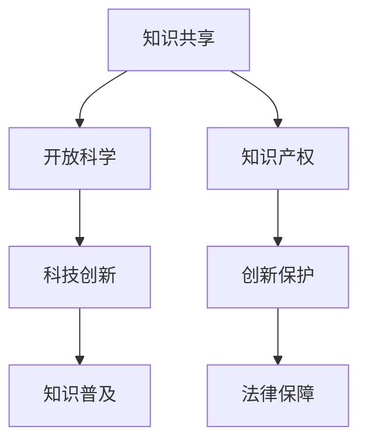

                 

 关键词：开放科学，知识产权，知识共享，技术创新，合作研究，版权保护，开源社区

> 摘要：本文旨在探讨开放科学与知识产权之间的关系，分析开放科学在促进知识共享和科技进步方面的作用，同时讨论知识产权在保护创新成果、推动知识共享中的双重角色。通过案例分析和未来展望，本文提出了一系列平衡知识共享与知识产权保护的策略，以促进科学技术的可持续发展。

## 1. 背景介绍

随着信息技术的飞速发展，科学研究的开放性日益增强，开放科学（Open Science）成为一种新的科研模式。开放科学强调科研过程中的知识共享、透明度和合作，通过打破信息壁垒，提高科研成果的可见度和可获取性。知识产权（Intellectual Property，IP）则是在创新过程中保护个人或团体智力成果的法律制度，包括专利、版权、商标和商业秘密等。

### 1.1 开放科学的兴起

开放科学的兴起可以追溯到20世纪末。随着互联网的普及，科研数据的获取变得更加容易，科研合作变得更加紧密。开放获取（Open Access）运动要求科研成果以免费和开放的形式对公众提供，从而打破传统出版模式的信息垄断。此外，开放数据（Open Data）和开放软件（Open Source Software）也成为了科研的重要组成部分，促进了科研过程的透明化和效率提升。

### 1.2 知识产权的作用

知识产权在科研和创新中扮演着关键角色。它通过赋予发明者、创作者和其他智力成果拥有者一定的独占权利，激励他们进行创新活动，同时也保护了公众的利益，确保创新成果能够为社会带来最大化的价值。知识产权制度为技术创新提供了法律保障，鼓励了科学研究和商业投资。

## 2. 核心概念与联系

为了更好地理解开放科学与知识产权之间的关系，我们需要明确几个核心概念和它们之间的联系。

### 2.1 知识共享的概念

知识共享是指将科研成果、数据、方法和工具等知识资源公开地提供给他人使用和进一步研究。它包括开放获取、开放数据、开放软件等多个方面，是开放科学的核心原则之一。

### 2.2 知识产权的概念

知识产权是指法律赋予创作者或其他主体对特定智力成果的专有权利，包括专利、版权、商标和商业秘密等。这些权利在一定期限内保护了创新成果的独占性，防止他人未经许可擅自使用。

### 2.3 开放科学与知识产权的联系

开放科学与知识产权之间存在紧密的联系。一方面，开放科学通过知识共享促进了科技的进步和知识的普及；另一方面，知识产权通过保护创新成果，激励了更多的科学研究和技术创新。

### 2.4 Mermaid 流程图



## 3. 核心算法原理 & 具体操作步骤

### 3.1 算法原理概述

在开放科学和知识产权的框架下，实现知识共享与知识产权保护的平衡是一个复杂的任务。这里介绍一种基于区块链技术的算法，用于实现这一目标。该算法的核心原理是利用区块链的去中心化和不可篡改特性，为知识共享和知识产权保护提供一种透明且可信的机制。

### 3.2 算法步骤详解

#### 3.2.1 创建知识共享协议

1. **知识创作者发布内容**：知识创作者将科研成果、数据、方法等上传到区块链网络，并创建一个知识共享协议。
2. **协议内容**：协议包括知识的描述、授权方式、使用条件和版权声明等。
3. **签名和发布**：知识创作者对协议内容进行数字签名，确保协议的真实性和完整性，然后将其发布到区块链上。

#### 3.2.2 用户访问与授权

1. **用户请求访问**：用户向区块链网络发起访问请求，并提供身份认证。
2. **权限验证**：区块链网络根据用户的身份和知识共享协议中的授权条件，验证用户是否有权访问特定知识。
3. **授权决策**：如果用户有权访问，区块链将生成一个授权凭证，用户可以下载或使用该知识。

#### 3.2.3 知识产权保护

1. **监控与审计**：区块链网络会监控用户对知识的访问和使用情况，确保使用符合协议规定。
2. **侵权检测**：利用智能合约自动检测可能存在的侵权行为，并触发相应的法律措施。
3. **争议解决**：通过区块链的透明性和不可篡改性，简化知识产权争议的解决流程。

### 3.3 算法优缺点

#### 优点：

- **透明性和可信性**：区块链的公开透明特性提高了知识共享和知识产权保护的透明度。
- **自动化和效率**：智能合约的使用减少了人工干预，提高了处理速度和效率。
- **去中心化**：去中心化的特性降低了单点故障的风险，提高了系统的稳定性和抗攻击能力。

#### 缺点：

- **技术门槛**：区块链技术的复杂性可能导致普通用户难以理解和使用。
- **能源消耗**：区块链网络的运行需要大量能源，可能导致环境问题。
- **法律法规限制**：不同国家和地区对知识产权的法律规定不同，可能影响算法的普适性。

### 3.4 算法应用领域

- **科研合作**：通过区块链技术实现跨国科研团队的协同工作，保护共同研发的知识产权。
- **学术出版**：开放获取期刊可以使用区块链技术确保作者的版权和收益。
- **数据共享**：保护公共数据的安全和隐私，同时允许合法用户进行数据分析和研究。

## 4. 数学模型和公式 & 详细讲解 & 举例说明

### 4.1 数学模型构建

为了更好地理解知识共享与知识产权保护的关系，我们可以构建一个简单的数学模型。该模型主要涉及以下几个参数：

- \( A \)：知识共享的程度，取值范围从0（完全不共享）到1（完全共享）。
- \( B \)：知识产权保护的力度，取值范围从0（完全不保护）到1（完全保护）。
- \( C \)：科技创新的收益，与知识共享和知识产权保护成正比。

### 4.2 公式推导过程

根据上述参数，我们可以得到以下公式：

\[ C = k \cdot A \cdot B \]

其中，\( k \) 是一个比例常数，表示科技创新的边际效益。

### 4.3 案例分析与讲解

假设一个科研团队在某一领域取得了重要突破，他们决定通过开放获取的方式分享研究成果，并利用区块链技术进行知识产权保护。根据上述模型，我们可以进行以下分析：

- 当 \( A = 1 \) 且 \( B = 1 \) 时，即完全共享和完全保护，科技创新的收益 \( C \) 取得最大值。
- 当 \( A = 0 \) 或 \( B = 0 \) 时，科技创新的收益 \( C \) 为0，因为知识共享或知识产权保护不足。

在实际应用中，科研团队可能需要根据实际情况调整 \( A \) 和 \( B \) 的值。例如，他们可以在早期阶段进行部分共享，以吸引更多合作伙伴，同时利用区块链技术保护核心知识产权，确保创新成果的独占性。

## 5. 项目实践：代码实例和详细解释说明

### 5.1 开发环境搭建

为了演示基于区块链的知识共享与知识产权保护算法，我们将使用以太坊（Ethereum）平台。以下是搭建开发环境的基本步骤：

1. 安装Node.js和npm。
2. 安装Truffle框架，用于以太坊的智能合约开发和测试。
3. 配置Ganache，一个本地以太坊私有网络，用于测试智能合约。

### 5.2 源代码详细实现

以下是智能合约的示例代码，用于实现知识共享与知识产权保护的基本功能：

```solidity
// SPDX-License-Identifier: MIT
pragma solidity ^0.8.0;

contract KnowledgeSharing {

    struct Knowledge {
        string id;
        string description;
        address creator;
        bool isShared;
        mapping(address => bool) accessRights;
    }

    mapping(string => Knowledge) private knowledgeMap;

    function createKnowledge(string memory _id, string memory _description) public {
        require(!exists(_id), "Knowledge already exists");
        knowledgeMap[_id] = Knowledge(_id, _description, msg.sender, true);
    }

    function shareKnowledge(string memory _id, address _user) public {
        require(exists(_id), "Knowledge does not exist");
        require(msg.sender == knowledgeMap[_id].creator, "Only the creator can share knowledge");
        knowledgeMap[_id].accessRights[_user] = true;
    }

    function getKnowledge(string memory _id) public view returns (string memory) {
        require(exists(_id), "Knowledge does not exist");
        require(knowledgeMap[_id].accessRights[msg.sender], "You do not have access to this knowledge");
        return knowledgeMap[_id].description;
    }

    function exists(string memory _id) public view returns (bool) {
        return knowledgeMap[_id].id != "";
    }
}
```

### 5.3 代码解读与分析

1. **创建知识**：`createKnowledge` 函数允许知识创作者创建新的知识条目，并存储在区块链上。
2. **共享知识**：`shareKnowledge` 函数允许知识创作者将知识共享给特定用户，并授予他们访问权限。
3. **获取知识**：`getKnowledge` 函数允许用户获取特定知识条目的描述，前提是他们拥有访问权限。

### 5.4 运行结果展示

假设知识创作者 Alice 创建了一个知识条目，并决定与 Bob 共享。以下是操作步骤和运行结果：

1. Alice 调用 `createKnowledge` 函数创建知识条目。
2. Alice 调用 `shareKnowledge` 函数将知识共享给 Bob。
3. Bob 调用 `getKnowledge` 函数获取知识条目的描述。

运行结果将在区块链上永久记录，确保知识共享和知识产权保护的透明性和不可篡改性。

## 6. 实际应用场景

### 6.1 学术研究合作

开放科学在学术研究合作中发挥了重要作用。科研团队可以通过开放获取期刊、开放数据和开放软件共享研究成果，促进科学知识的传播和合作。知识产权在此过程中起到保护创新成果的作用，鼓励科研团队进行更多创新性研究。

### 6.2 商业合作与创新

在商业领域，开放科学和知识产权保护也具有广泛的应用。企业可以通过共享技术和知识，加速产品研发和创新。同时，知识产权保护确保了企业的竞争优势和投资回报，促进了商业合作和可持续发展。

### 6.3 公共数据共享

公共数据共享是开放科学的一个重要领域。通过开放获取公共数据，研究人员和公众可以更方便地获取数据，进行数据分析和研究。知识产权保护则确保了公共数据的安全和隐私，防止数据被滥用。

## 7. 工具和资源推荐

### 7.1 学习资源推荐

- 《区块链技术指南》
- 《开放科学：实践与原理》
- 《知识产权法教程》

### 7.2 开发工具推荐

- Truffle：以太坊智能合约开发框架。
- Ganache：本地以太坊私有网络。
- Remix：在线智能合约编辑器。

### 7.3 相关论文推荐

- "Blockchain for Intellectual Property Protection in Open Science"
- "The Role of Open Science in Promoting Scientific Collaboration"
- "Intellectual Property Rights and Open Science: A Critical Analysis"

## 8. 总结：未来发展趋势与挑战

### 8.1 研究成果总结

本文通过分析开放科学与知识产权的关系，提出了一种基于区块链技术的知识共享与知识产权保护算法。该算法通过实现透明、可信和去中心化的知识共享机制，平衡了知识共享与知识产权保护之间的关系，为科研和创新提供了新的思路。

### 8.2 未来发展趋势

随着技术的进步和政策的支持，开放科学和知识产权保护将在未来得到更广泛的应用。区块链技术、人工智能和大数据分析等新兴技术的融合，将进一步推动开放科学的发展，为知识共享和科技创新提供更强大的支持。

### 8.3 面临的挑战

开放科学和知识产权保护在实现过程中仍面临诸多挑战，如技术复杂性、法律法规差异、隐私保护等。需要进一步研究和探索，以解决这些问题，确保开放科学和知识产权保护的健康可持续发展。

### 8.4 研究展望

未来的研究应重点关注以下几个方面：

- **跨领域合作**：加强不同领域之间的合作，推动开放科学的全面应用。
- **隐私保护**：研究如何在开放科学和知识产权保护的同时，确保数据和个人隐私的安全。
- **政策支持**：制定和完善相关政策，为开放科学和知识产权保护提供法律保障。

## 9. 附录：常见问题与解答

### Q1. 开放科学和知识产权保护是否矛盾？

A1. 开放科学和知识产权保护并非矛盾，而是相辅相成的。开放科学强调知识的共享和普及，而知识产权保护则确保创新成果的独占性和投资回报。通过合理利用知识产权保护，可以激励更多的创新和知识共享。

### Q2. 区块链技术在知识共享中的应用有哪些？

A2. 区块链技术在知识共享中的应用主要包括：创建知识共享协议、记录和验证知识共享过程、监控知识产权保护等。通过区块链技术，可以实现知识的透明、可信和去中心化共享。

### Q3. 开放数据和开放软件对科研有什么影响？

A3. 开放数据和开放软件为科研提供了丰富的资源和工具，促进了科学研究的透明度和合作。开放数据和开放软件有助于缩短科研周期，提高科研效率，推动科学技术的快速发展。

### Q4. 知识产权保护如何确保创新成果的独占性？

A4. 知识产权保护通过赋予发明者或创作者独占权利，确保其创新成果在一定期限内不被他人擅自使用。知识产权制度包括专利、版权、商标和商业秘密等多种形式，根据不同类型的创新成果提供相应的保护。

### Q5. 未来开放科学和知识产权保护的发展方向是什么？

A5. 未来开放科学和知识产权保护的发展方向主要包括：加强跨领域合作，推动技术融合；研究隐私保护和数据安全；制定和完善相关政策，为开放科学和知识产权保护提供法律保障。同时，新兴技术如区块链、人工智能和大数据分析等将进一步推动开放科学和知识产权保护的发展。

