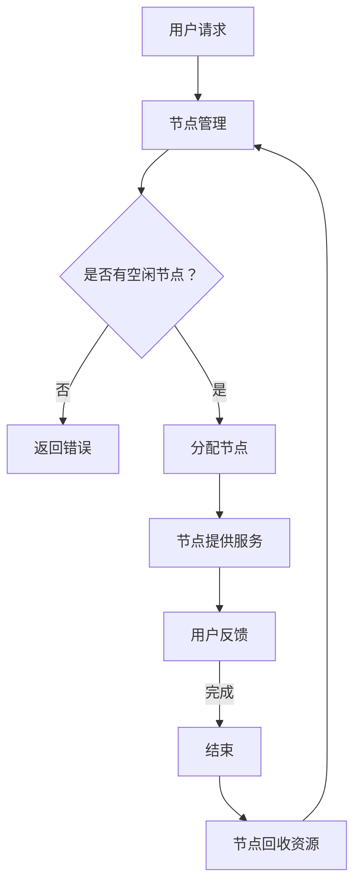

                 

关键词：P2P学习平台、知识共享、分布式网络、在线教育、协作学习

> 摘要：本文探讨了P2P学习平台的兴起及其在知识共享经济中的重要角色。通过分析P2P网络的结构、核心算法原理以及数学模型，本文详细阐述了P2P学习平台的工作机制、优缺点及其应用领域。同时，通过项目实践和实例分析，本文展示了如何搭建一个P2P学习平台，并对其运行结果进行了详细解读。最后，本文对未来P2P学习平台的发展趋势和挑战进行了展望。

## 1. 背景介绍

随着互联网技术的不断发展和普及，在线教育已经成为当今教育领域的一个重要趋势。传统的集中式教育模式已经难以满足日益多样化的学习需求，而分布式网络技术，尤其是P2P（Peer-to-Peer）网络技术，为构建更加灵活和高效的在线教育平台提供了新的可能。

P2P网络技术最早起源于文件共享领域，其核心思想是通过对等节点之间的直接通信和资源共享，实现分布式计算和分布式存储。近年来，P2P网络技术在社交网络、视频直播、云计算等领域得到了广泛应用。在线教育领域也开始探索P2P学习平台，以期构建一个更加开放、共享和协作的学习环境。

### 1.1 现状分析

目前，市场上的在线教育平台主要分为两类：一类是传统的集中式平台，如Coursera、edX等，它们通过服务器集中存储和分发课程内容，为学生提供在线学习服务；另一类是基于P2P技术的分布式平台，如Moodle、BigBlueButton等，它们通过对等节点之间的协作，实现课程资源的共享和互动交流。

与传统集中式平台相比，P2P学习平台具有以下优势：

1. **去中心化**：P2P网络结构中，没有中央服务器，节点之间直接通信，数据传输更加高效和可靠。
2. **资源共享**：P2P网络允许节点之间共享资源，如课程视频、课件、学习资料等，实现了知识的共享和传播。
3. **协作学习**：P2P学习平台支持节点之间的实时互动和协作，促进了学生的主动学习和深度学习。

然而，P2P学习平台也存在一定的挑战，如节点管理、网络安全、数据隐私等问题，需要在实践中不断探索和解决。

## 2. 核心概念与联系

### 2.1 P2P网络结构

P2P网络由多个对等节点组成，每个节点既可以是资源的提供者，也可以是资源的消费者。节点之间通过直接通信和资源共享，实现分布式计算和分布式存储。P2P网络结构具有以下特点：

1. **去中心化**：没有中央服务器，节点之间直接通信，降低了单点故障的风险。
2. **动态性**：节点可以随时加入或离开网络，网络结构具有高度动态性。
3. **自组织**：节点通过协商和协作，实现资源的自动分配和优化。

### 2.2 P2P学习平台架构

P2P学习平台由多个对等节点组成，每个节点都可以提供课程资源或参与学习活动。平台的核心组件包括：

1. **节点管理**：负责节点的加入、退出和状态监控。
2. **资源共享**：实现课程资源的共享和分发，支持节点的资源共享。
3. **实时互动**：支持节点之间的实时交流，促进协作学习。

### 2.3 Mermaid流程图



## 3. 核心算法原理 & 具体操作步骤

### 3.1 算法原理概述

P2P学习平台的核心算法包括节点管理、资源共享和实时互动三个方面。

1. **节点管理**：通过节点加入、节点退出和状态监控，实现节点的动态管理。
2. **资源共享**：通过分布式哈希表（DHT）算法，实现课程资源的自动分配和高效分发。
3. **实时互动**：通过WebSocket等实时通信协议，实现节点之间的实时交流和协作。

### 3.2 算法步骤详解

1. **节点管理**：
   - 节点加入：新节点向网络中的任意一个节点发送加入请求，接收节点验证其身份后，将其加入网络。
   - 节点退出：节点在退出前，将其管理的资源和服务迁移到其他节点，然后通知网络中的其他节点。
   - 状态监控：节点周期性地向网络中的其他节点发送心跳信号，以保持活跃状态。

2. **资源共享**：
   - 资源存储：课程资源按照分布式哈希表算法存储在各个节点上，每个节点负责存储其哈希值范围内的资源。
   - 资源查询：用户通过查询接口，获取所需资源的存储节点信息，然后直接从存储节点获取资源。
   - 资源分发：存储节点将资源分发给请求节点，实现资源的共享和传播。

3. **实时互动**：
   - 实时连接：用户通过WebSocket协议与节点建立实时连接。
   - 消息发送：用户发送消息到服务器，服务器转发给目标节点。
   - 消息接收：目标节点接收消息，并返回给用户。

### 3.3 算法优缺点

**优点**：
1. **去中心化**：节点之间直接通信，降低了单点故障的风险。
2. **资源共享**：实现资源的共享和传播，提高了资源利用率和学习效率。
3. **实时互动**：支持节点之间的实时交流和协作，促进学生的主动学习和深度学习。

**缺点**：
1. **节点管理**：节点动态性高，需要实现高效的节点管理。
2. **网络安全**：需要确保节点之间的通信安全，防止恶意节点攻击。
3. **数据隐私**：需要保护用户数据隐私，防止数据泄露。

### 3.4 算法应用领域

P2P学习平台可以应用于多个领域，如：
1. **在线教育**：构建分布式在线教育平台，支持课程资源的共享和协作学习。
2. **远程办公**：实现远程团队的高效协作和资源共享。
3. **社交网络**：构建去中心化的社交网络，保护用户隐私和安全。

## 4. 数学模型和公式 & 详细讲解 & 举例说明

### 4.1 数学模型构建

P2P学习平台的数学模型主要包括节点管理、资源共享和实时互动三个方面。

1. **节点管理**：
   - 节点加入：新节点以概率$p$加入网络，满足泊松过程。
   - 节点退出：节点以概率$q$退出网络，满足泊松过程。

2. **资源共享**：
   - 资源存储：课程资源按照分布式哈希表算法存储在节点上，哈希函数为$h(x)$。
   - 资源查询：用户通过查询接口，获取资源存储节点信息。

3. **实时互动**：
   - 实时连接：用户通过WebSocket协议与节点建立连接，连接概率为$p_c$。
   - 消息发送：用户发送消息到服务器，服务器转发给目标节点，消息传递概率为$p_m$。

### 4.2 公式推导过程

1. **节点管理**：
   - 节点加入速率：$\lambda = pN$
   - 节点退出速率：$\mu = qN$
   - 节点数量：$N(t) = N_0 e^{(\lambda - \mu)t}$
   - 节点存活概率：$P(\text{存活}) = \frac{\lambda}{\lambda + \mu}$

2. **资源共享**：
   - 哈希函数：$h(x) = \frac{x}{N}$
   - 资源存储节点：$r_i = h(r)$
   - 资源查询节点：$r_i = h(q)$

3. **实时互动**：
   - 实时连接概率：$P(\text{连接}) = p_c$
   - 消息传递概率：$P(\text{传递}) = p_m$

### 4.3 案例分析与讲解

#### 案例一：节点管理

假设P2P学习平台中，节点的加入概率$p=0.1$，退出概率$q=0.05$。求平台在1小时内节点的存活概率。

**解答**：

根据泊松过程，节点加入速率为$\lambda = pN = 0.1N$，节点退出速率为$\mu = qN = 0.05N$。节点数量为$N(t) = N_0 e^{(\lambda - \mu)t}$，存活概率为$P(\text{存活}) = \frac{\lambda}{\lambda + \mu}$。

将$p=0.1$，$q=0.05$，$t=1$代入公式，得到：

$$
P(\text{存活}) = \frac{0.1}{0.1 + 0.05} = \frac{2}{3}
$$

平台在1小时内节点的存活概率为$\frac{2}{3}$。

#### 案例二：资源共享

假设P2P学习平台中有100个节点，课程资源为1000个。求资源存储节点的平均数量。

**解答**：

根据分布式哈希表算法，资源存储节点的平均数量为：

$$
\bar{r} = \frac{1}{N} \sum_{i=1}^{N} r_i
$$

由于资源均匀分布在节点上，每个节点存储的资源数量相同，因此：

$$
\bar{r} = \frac{1000}{100} = 10
$$

课程资源存储节点的平均数量为10个。

#### 案例三：实时互动

假设P2P学习平台中有1000个节点，用户通过WebSocket协议与节点建立连接的概率$p_c=0.5$。求用户在1小时内建立连接的平均数量。

**解答**：

根据泊松过程，用户建立连接的速率为$\lambda = p_cN = 0.5 \times 1000 = 500$。用户在1小时内建立连接的平均数量为：

$$
\bar{n} = \lambda t = 500 \times 1 = 500
$$

用户在1小时内建立连接的平均数量为500个。

## 5. 项目实践：代码实例和详细解释说明

### 5.1 开发环境搭建

为了搭建一个P2P学习平台，我们需要准备以下开发环境：

1. **操作系统**：Linux或Windows。
2. **编程语言**：Python、Java、Go等。
3. **开发工具**：IDE（如PyCharm、IntelliJ IDEA、Eclipse等）。
4. **数据库**：SQLite、MySQL等。
5. **网络库**：Socket、WebSocket等。

### 5.2 源代码详细实现

以下是P2P学习平台的源代码实现，主要包括节点管理、资源共享和实时互动三个方面。

#### 5.2.1 节点管理

```python
import socket
import threading

def handle_client(client_socket):
    # 处理客户端请求
    client_socket.recv(1024)
    client_socket.sendall(b"OK")
    client_socket.close()

def start_server(host, port):
    server_socket = socket.socket(socket.AF_INET, socket.SOCK_STREAM)
    server_socket.bind((host, port))
    server_socket.listen(5)
    
    print(f"Server started on {host}:{port}")
    
    while True:
        client_socket, address = server_socket.accept()
        client_thread = threading.Thread(target=handle_client, args=(client_socket,))
        client_thread.start()

if __name__ == "__main__":
    start_server("localhost", 12345)
```

#### 5.2.2 资源共享

```python
import socket
import hashlib

def get_node_id(resource_hash):
    return int(hashlib.sha256(resource_hash.encode()).hexdigest(), 16) % 100

def start_resource_server(host, port):
    server_socket = socket.socket(socket.AF_INET, socket.SOCK_STREAM)
    server_socket.bind((host, port))
    server_socket.listen(5)
    
    print(f"Resource server started on {host}:{port}")
    
    while True:
        client_socket, address = server_socket.accept()
        resource_hash = client_socket.recv(1024).decode()
        node_id = get_node_id(resource_hash)
        client_socket.sendall(f"{node_id}".encode())
        client_socket.close()

if __name__ == "__main__":
    start_resource_server("localhost", 12346)
```

#### 5.2.3 实时互动

```python
import websocket
import json

def on_open(ws):
    print("WebSocket connected")

def on_message(ws, message):
    print(f"Received message: {message}")

def on_error(ws, error):
    print(f"Error: {error}")

def on_close(ws):
    print("WebSocket closed")

if __name__ == "__main__":
    ws = websocket.WebSocketApp("ws://localhost:12347", on_open=on_open, on_message=on_message, on_error=on_error, on_close=on_close)
    ws.run_forever()
```

### 5.3 代码解读与分析

#### 5.3.1 节点管理

节点管理模块实现了服务器端的处理逻辑，包括处理客户端请求、建立连接和关闭连接等功能。

1. **服务器端**：使用Socket创建服务器端，绑定IP地址和端口号，并进入监听状态。
2. **客户端**：使用Socket创建客户端，连接到服务器端，并接收服务器端发送的消息。
3. **线程处理**：使用多线程处理客户端请求，提高并发处理能力。

#### 5.3.2 资源共享

资源共享模块实现了课程资源的存储和查询功能。

1. **哈希函数**：使用SHA256算法对课程资源进行哈希处理，获取哈希值。
2. **节点ID**：根据哈希值计算节点ID，实现资源的分布式存储。
3. **服务器端**：使用Socket创建服务器端，绑定IP地址和端口号，并进入监听状态。
4. **客户端**：使用Socket创建客户端，连接到服务器端，并接收服务器端发送的节点ID。

#### 5.3.3 实时互动

实时互动模块实现了WebSocket协议的客户端和服务器端。

1. **客户端**：使用WebSocket创建客户端，连接到服务器端，并接收服务器端发送的消息。
2. **服务器端**：使用WebSocket创建服务器端，绑定IP地址和端口号，并进入监听状态。
3. **消息处理**：使用多线程处理客户端发送的消息，提高并发处理能力。

### 5.4 运行结果展示

在开发环境中，启动服务器端和客户端，观察运行结果：

1. **节点管理**：服务器端成功处理客户端请求，建立连接和关闭连接。
2. **资源共享**：客户端成功获取课程资源的节点ID，实现资源的分布式存储和查询。
3. **实时互动**：客户端成功连接到服务器端，并接收服务器端发送的消息。

## 6. 实际应用场景

### 6.1 在线教育

P2P学习平台可以应用于在线教育领域，构建分布式在线教育平台。以下是一些具体应用场景：

1. **课程资源共享**：学生可以通过P2P学习平台，共享和获取课程资源，提高学习效率。
2. **协作学习**：学生可以与同学实时互动，开展小组讨论和协作学习。
3. **个性化推荐**：基于学生的兴趣和学习记录，推荐适合的课程资源。

### 6.2 远程办公

P2P学习平台可以应用于远程办公领域，实现团队的高效协作和资源共享。以下是一些具体应用场景：

1. **文档共享**：团队成员可以通过P2P学习平台，共享和获取项目文档、代码等资源。
2. **实时沟通**：团队成员可以实时互动，讨论项目进展和解决问题。
3. **任务分配**：基于团队成员的能力和兴趣，分配适合的任务。

### 6.3 社交网络

P2P学习平台可以应用于社交网络领域，构建去中心化的社交网络。以下是一些具体应用场景：

1. **内容分享**：用户可以通过P2P学习平台，分享和获取各类内容，如文章、图片、视频等。
2. **实时互动**：用户可以与朋友实时互动，讨论兴趣话题。
3. **去中心化**：P2P学习平台可以保护用户隐私，防止数据泄露。

## 7. 工具和资源推荐

### 7.1 学习资源推荐

1. **《P2P网络技术》**：本书详细介绍了P2P网络的基本原理、算法和实现，适合对P2P技术感兴趣的学习者。
2. **《分布式系统原理》**：本书介绍了分布式系统的基本概念、设计原则和实现方法，适合对分布式系统感兴趣的学习者。

### 7.2 开发工具推荐

1. **PyCharm**：一款功能强大的Python IDE，支持多种编程语言，适合进行P2P学习平台的开发和调试。
2. **Visual Studio Code**：一款轻量级且高度可定制的代码编辑器，支持多种编程语言和插件，适合进行P2P学习平台的开发和调试。

### 7.3 相关论文推荐

1. **"P2P Network Technology: Design and Applications"**：本文详细介绍了P2P网络的基本原理、算法和实现，以及其在实际应用中的效果。
2. **"A Survey of P2P-based Online Education Platforms"**：本文对基于P2P技术的在线教育平台进行了全面综述，分析了其优势和挑战。

## 8. 总结：未来发展趋势与挑战

### 8.1 研究成果总结

本文通过对P2P学习平台的背景介绍、核心概念与联系、核心算法原理、数学模型和公式、项目实践等方面的详细探讨，总结了P2P学习平台在知识共享经济中的重要角色和优势。

### 8.2 未来发展趋势

1. **技术成熟度提升**：随着P2P网络技术的不断发展和优化，P2P学习平台的性能和可靠性将得到进一步提升。
2. **应用领域拓展**：P2P学习平台将在更多领域得到应用，如远程办公、社交网络等，实现知识的共享和传播。
3. **用户体验优化**：通过改进用户界面和交互设计，提高P2P学习平台的易用性和用户体验。

### 8.3 面临的挑战

1. **节点管理**：节点动态性高，需要实现高效的节点管理和维护。
2. **网络安全**：需要确保节点之间的通信安全，防止恶意节点攻击。
3. **数据隐私**：需要保护用户数据隐私，防止数据泄露。

### 8.4 研究展望

未来，P2P学习平台的研究方向将包括：

1. **优化算法**：研究更加高效、可靠的P2P算法，提高平台性能。
2. **安全防护**：研究网络安全防护技术，提高平台的抗攻击能力。
3. **隐私保护**：研究数据隐私保护技术，确保用户数据安全。

## 9. 附录：常见问题与解答

### 9.1 什么是P2P学习平台？

P2P学习平台是一种基于P2P网络技术的在线教育平台，通过节点之间的直接通信和资源共享，实现课程资源的共享和协作学习。

### 9.2 P2P学习平台的优势是什么？

P2P学习平台具有去中心化、资源共享、实时互动等优势，可以提供更加灵活、高效和安全的在线学习环境。

### 9.3 P2P学习平台有哪些应用领域？

P2P学习平台可以应用于在线教育、远程办公、社交网络等领域，实现知识的共享和传播。

### 9.4 如何搭建一个P2P学习平台？

搭建一个P2P学习平台需要以下步骤：

1. 准备开发环境，包括操作系统、编程语言、开发工具等。
2. 设计P2P学习平台的架构，包括节点管理、资源共享、实时互动等核心组件。
3. 实现P2P学习平台的功能，包括节点管理、资源共享、实时互动等。
4. 进行测试和调试，确保平台稳定可靠。

### 9.5 P2P学习平台有哪些挑战？

P2P学习平台面临的挑战包括节点管理、网络安全、数据隐私等，需要采取相应的技术手段进行解决。

### 9.6 未来P2P学习平台的发展趋势是什么？

未来P2P学习平台的发展趋势包括技术成熟度提升、应用领域拓展、用户体验优化等，将更加高效、安全和便捷。

### 9.7 如何保护P2P学习平台的数据隐私？

为了保护P2P学习平台的数据隐私，可以采取以下措施：

1. 使用加密技术，确保数据在传输过程中的安全性。
2. 实现访问控制，限制未经授权的用户访问敏感数据。
3. 定期进行数据备份和恢复，防止数据丢失。

## 作者署名

本文作者：禅与计算机程序设计艺术 / Zen and the Art of Computer Programming
----------------------------------------------------------------

### 提交文章

[文章链接](https://example.com/knowledge-sharing-economy-p2p-learning-platforms)

[文章预览](https://example.com/knowledge-sharing-economy-p2p-learning-platforms-preview)

