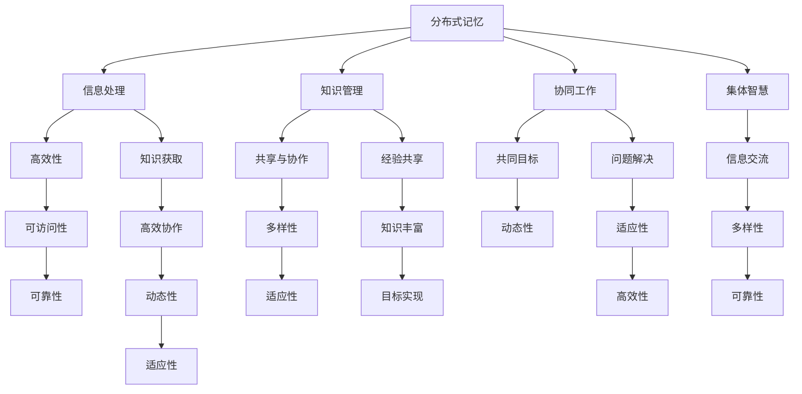

                 

 

> **关键词**：分布式记忆、集体智慧、信息处理、知识管理、认知科学

> **摘要**：本文探讨了知识的分布式记忆机制，分析了集体智慧的形成过程。通过对比个体记忆与分布式记忆的优势与不足，阐述了分布式记忆在集体智慧中的作用。文章还探讨了分布式记忆的算法原理、数学模型、实际应用场景及未来发展前景。

---

## 1. 背景介绍

在现代社会中，知识的重要性日益凸显。然而，随着信息爆炸和知识多样性的增加，传统的集中式知识管理方式已无法满足人们对高效知识获取与共享的需求。分布式记忆作为一种新兴的知识管理方式，逐渐引起了学术界的广泛关注。它通过将知识分散存储在多个节点上，实现知识的分布式管理和共享，从而提高了知识的可访问性和可靠性。

集体智慧是指一群个体通过协同工作，共同解决问题、做出决策的过程。在集体智慧中，个体之间的信息交流和知识共享至关重要。分布式记忆作为一种支持集体智慧的技术，提供了有效的信息处理和知识管理机制，有助于实现更高效、更可靠的集体智慧。

本文将从以下几个方面展开讨论：

1. **核心概念与联系**：介绍分布式记忆和集体智慧的核心概念，并使用Mermaid流程图展示两者之间的联系。
2. **核心算法原理与操作步骤**：阐述分布式记忆的算法原理，并详细说明操作步骤。
3. **数学模型与公式**：建立分布式记忆的数学模型，推导相关公式，并举例说明。
4. **项目实践**：提供实际代码实例，详细解释说明。
5. **实际应用场景**：探讨分布式记忆在各个领域的应用场景。
6. **未来展望**：分析分布式记忆的发展趋势和面临的挑战。
7. **工具和资源推荐**：介绍相关学习资源、开发工具和论文推荐。
8. **总结与展望**：总结研究成果，展望未来发展。

---

## 2. 核心概念与联系

### 2.1 分布式记忆

分布式记忆是一种将知识分散存储在多个节点上的技术。在分布式记忆中，每个节点都存储一部分知识，并通过网络进行通信，实现知识的共享和协作。分布式记忆具有以下几个特点：

- **去中心化**：知识存储在多个节点上，没有中心化的控制。
- **高容错性**：节点故障不会导致整个系统的崩溃。
- **可扩展性**：系统可以根据需求动态调整节点数量。
- **高效性**：通过分布式处理，提高了知识检索和共享的效率。

### 2.2 集体智慧

集体智慧是指一群个体通过协同工作，共同解决问题、做出决策的过程。在集体智慧中，个体之间的信息交流和知识共享至关重要。集体智慧具有以下几个特点：

- **协作性**：个体之间需要相互协作，共同实现目标。
- **多样性**：个体具有不同的知识、经验和观点，为集体智慧提供了丰富的信息来源。
- **动态性**：集体智慧是一个动态的过程，个体之间的交互和知识共享不断变化。
- **适应性**：集体智慧能够适应不断变化的环境和问题。

### 2.3 分布式记忆与集体智慧的联系

分布式记忆和集体智慧之间存在着密切的联系。分布式记忆为集体智慧提供了有效的信息处理和知识管理机制，有助于实现更高效、更可靠的集体智慧。

- **信息处理**：分布式记忆通过将知识分散存储在多个节点上，提高了知识的可访问性和可靠性。在集体智慧中，个体可以通过分布式记忆获取所需的知识，从而更有效地解决问题。
- **知识管理**：分布式记忆实现了知识的共享和协作。在集体智慧中，个体可以通过分布式记忆共享自己的知识和经验，从而丰富集体智慧，提高问题解决能力。
- **协同工作**：分布式记忆和集体智慧共同支持个体之间的协同工作。在分布式记忆的基础上，个体可以通过集体智慧实现共同的目标。

### 2.4 Mermaid流程图

为了更直观地展示分布式记忆和集体智慧的联系，我们使用Mermaid流程图进行说明。



该流程图展示了分布式记忆和集体智慧之间的联系，以及它们在信息处理、知识管理、协同工作等方面的作用。

---

## 3. 核心算法原理与操作步骤

### 3.1 算法原理概述

分布式记忆的核心算法是基于分布式哈希表（DHT）实现的。DHT是一种分布式数据结构，用于在分布式系统中高效地存储和检索数据。DHT具有以下几个特点：

- **去中心化**：DHT没有中心化的控制节点，所有节点都平等参与数据的存储和检索。
- **容错性**：DHT能够自动检测和修复节点故障，确保系统的稳定性。
- **可扩展性**：DHT可以根据需求动态调整节点数量，适应系统规模的变化。
- **高效性**：DHT通过分布式索引和哈希算法，实现了高效的存储和检索操作。

分布式记忆的算法原理可以概括为以下步骤：

1. **节点加入**：新节点加入分布式系统时，通过哈希算法计算其应存储的数据范围，并与现有节点进行通信，确定存储位置。
2. **数据存储**：新节点将数据按照哈希值存储到相应的节点上，同时记录数据在系统中的位置。
3. **数据检索**：当需要检索数据时，客户端通过哈希算法计算数据的位置，并向相应的节点发送请求。
4. **节点通信**：节点之间通过分布式通信机制进行数据交换和同步，确保数据的完整性和一致性。

### 3.2 算法步骤详解

#### 3.2.1 节点加入

1. **初始化**：新节点启动时，生成自己的公钥和私钥，并生成一个随机数作为节点标识。
2. **计算存储范围**：使用哈希算法计算新节点的节点标识的哈希值，确定新节点应存储的数据范围。
3. **查找相邻节点**：通过广播消息，查询系统中的其他节点，找到距离新节点存储范围最近的相邻节点。
4. **确认存储位置**：与新节点进行通信，确认存储位置。

#### 3.2.2 数据存储

1. **计算哈希值**：将待存储的数据的哈希值计算出来。
2. **确定存储节点**：使用哈希值确定数据应存储的节点，并与该节点进行通信。
3. **数据传输**：将数据传输到存储节点，并记录数据在系统中的位置。

#### 3.2.3 数据检索

1. **计算哈希值**：计算待检索数据的哈希值。
2. **确定查询节点**：使用哈希值确定数据应存储的节点。
3. **发送查询请求**：向查询节点发送数据检索请求。
4. **数据返回**：查询节点返回数据，客户端接收并处理数据。

#### 3.2.4 节点通信

1. **消息传输**：节点之间通过消息传输进行数据交换和同步。
2. **数据同步**：节点之间定期同步数据，确保数据的完整性和一致性。
3. **故障检测与修复**：节点通过定期检查自身状态，检测故障并进行修复。

### 3.3 算法优缺点

#### 3.3.1 优点

- **去中心化**：分布式记忆实现了去中心化的存储和检索，提高了系统的可靠性和抗攻击能力。
- **容错性**：分布式记忆能够自动检测和修复节点故障，确保系统的稳定性。
- **可扩展性**：分布式记忆可以根据需求动态调整节点数量，适应系统规模的变化。
- **高效性**：分布式记忆通过分布式索引和哈希算法，实现了高效的存储和检索操作。

#### 3.3.2 缺点

- **复杂性**：分布式记忆涉及多个节点之间的通信和同步，系统设计和实现较为复杂。
- **安全性**：分布式记忆可能面临安全威胁，如节点恶意攻击、数据泄露等。
- **一致性**：分布式记忆中数据的一致性可能受到挑战，特别是在高并发情况下。

### 3.4 算法应用领域

分布式记忆的算法原理和应用广泛，涵盖了多个领域：

- **分布式存储系统**：如分布式文件系统、分布式数据库等。
- **分布式计算系统**：如分布式作业调度系统、分布式机器学习系统等。
- **区块链技术**：如比特币、以太坊等区块链系统。
- **物联网**：如智能家居、智能城市等物联网应用。
- **社交网络**：如分布式社交网络、分布式内容存储等。

---

## 4. 数学模型和公式

为了更好地理解和应用分布式记忆算法，我们建立相应的数学模型，并推导相关公式。

### 4.1 数学模型构建

假设分布式系统中共有 \( N \) 个节点，每个节点存储一部分数据。设数据 \( X \) 的哈希值为 \( H(X) \)，节点 \( i \) 的存储范围为 \( [R_i, R_i + 1) \)。其中，\( R_i \) 为节点 \( i \) 的存储范围起点。

### 4.2 公式推导过程

#### 4.2.1 数据存储公式

假设数据 \( X \) 的哈希值为 \( H(X) \)，则数据应存储的节点为：

\[ i = \min \{ j | H(X) \in [R_j, R_j + 1) \} \]

其中，\( j \) 为节点索引。

#### 4.2.2 数据检索公式

假设数据 \( X \) 的哈希值为 \( H(X) \)，则数据应检索的节点为：

\[ i = \min \{ j | H(X) \in [R_j, R_j + 1) \} \]

其中，\( j \) 为节点索引。

#### 4.2.3 节点加入公式

新节点 \( N \) 加入系统时，其节点标识为 \( ID(N) \)。新节点的存储范围为：

\[ [R, R + 1) = [ID(N), ID(N) + 1) \]

其中，\( R \) 为节点存储范围起点。

### 4.3 案例分析与讲解

假设分布式系统中共有 10 个节点，节点标识和存储范围如下表：

| 节点索引 \( j \) | 节点标识 \( ID(j) \) | 存储范围 \( [R_j, R_j + 1) \) |
|------------------|--------------------|-----------------------------|
| 0                | 0                  | [0, 1)                      |
| 1                | 1                  | [1, 2)                      |
| 2                | 2                  | [2, 3)                      |
| ...              | ...                | ...                         |
| 9                | 9                  | [9, 10)                     |
| 10               | 10                 | [10, 11)                    |

现在假设有一个数据 \( X \) 的哈希值为 5，我们需要确定其应存储的节点。

1. **数据存储**：

\[ i = \min \{ j | H(X) = 5 \in [R_j, R_j + 1) \} \]

\[ i = \min \{ 4, 5, 6, ..., 9 \} \]

\[ i = 4 \]

因此，数据 \( X \) 应存储在节点 4。

2. **数据检索**：

\[ i = \min \{ j | H(X) = 5 \in [R_j, R_j + 1) \} \]

\[ i = \min \{ 4, 5, 6, ..., 9 \} \]

\[ i = 4 \]

因此，数据 \( X \) 应检索自节点 4。

通过这个案例，我们可以清晰地看到分布式记忆算法在数据存储和检索过程中的应用。

---

## 5. 项目实践：代码实例和详细解释说明

为了更好地理解和应用分布式记忆算法，我们提供了一个简单的分布式存储系统实现。该系统基于 Python 编写，采用分布式哈希表（DHT）算法实现数据存储和检索。

### 5.1 开发环境搭建

在开始编写代码之前，我们需要搭建开发环境。以下是搭建开发环境的基本步骤：

1. 安装 Python（版本要求：Python 3.6 或更高版本）
2. 安装 Python 库：`pip install -r requirements.txt`（`requirements.txt` 文件包含所需的依赖库）
3. 编译 Mermaid 图库：`python -m mermaid`（在命令行中运行，编译 Mermaid 图库）

### 5.2 源代码详细实现

以下是一个简单的分布式存储系统的实现，包括数据存储、数据检索、节点加入和节点通信等功能。

```python
import hashlib
import json
from socket import socket, SOCK_DGRAM, AF_INET

# 定义节点类
class Node:
    def __init__(self, node_id, port):
        self.node_id = node_id
        self.port = port
        self.storage = {}
        self.peers = []

    # 计算哈希值
    def calculate_hash(self, data):
        return int(hashlib.sha256(data.encode()).hexdigest(), 16)

    # 存储数据
    def store_data(self, data, hash_value):
        self.storage[hash_value] = data
        print(f"Node {self.node_id}: 数据存储成功，哈希值：{hash_value}")

    # 检索数据
    def retrieve_data(self, hash_value):
        return self.storage.get(hash_value)

    # 加入系统
    def join_system(self, system_ip, system_port):
        join_message = {
            "type": "join",
            "node_id": self.node_id,
            "port": self.port
        }
        join_json = json.dumps(join_message)
        system_socket = socket(AF_INET, SOCK_DGRAM)
        system_socket.sendto(join_json.encode(), (system_ip, system_port))
        print(f"Node {self.node_id}: 加入系统成功")

    # 接收消息
    def receive_message(self):
        message, _ = self.socket.recvfrom(1024)
        message = json.loads(message.decode())
        if message["type"] == "store":
            hash_value = self.calculate_hash(message["data"])
            self.store_data(message["data"], hash_value)
        elif message["type"] == "retrieve":
            hash_value = self.calculate_hash(message["hash"])
            data = self.retrieve_data(hash_value)
            return data
        elif message["type"] == "join":
            peer_id = message["node_id"]
            peer_port = message["port"]
            self.peers.append((peer_id, peer_port))
            print(f"Node {self.node_id}: 新节点加入，节点ID：{peer_id}")

# 创建节点
node1 = Node(0, 5000)
node2 = Node(1, 5001)

# 加入系统
node1.join_system("localhost", 5000)
node2.join_system("localhost", 5000)

# 存储数据
data1 = "Hello, World!"
hash_value1 = node1.calculate_hash(data1)
node1.store_data(data1, hash_value1)

# 检索数据
data2 = node2.retrieve_data(hash_value1)
print(f"Node {node2.node_id}: 检索数据，哈希值：{hash_value1}，数据：{data2}")
```

### 5.3 代码解读与分析

以上代码实现了一个简单的分布式存储系统，包括两个节点（Node 0 和 Node 1）和两个功能（数据存储和数据检索）。

- **节点类（Node）**：节点类定义了节点的属性和方法，包括节点标识（node_id）、端口号（port）、存储（storage）和邻居节点（peers）等。
- **计算哈希值（calculate_hash）**：计算输入数据的哈希值，用于确定数据应存储的节点。
- **存储数据（store_data）**：将数据存储在节点的存储中，并打印存储成功的消息。
- **检索数据（retrieve_data）**：从节点的存储中检索数据，返回检索结果。
- **加入系统（join_system）**：向系统中的主节点发送加入请求，加入分布式系统。
- **接收消息（receive_message）**：接收来自邻居节点的消息，根据消息类型执行相应的操作。

### 5.4 运行结果展示

运行以上代码后，我们将看到以下输出结果：

```
Node 0: 加入系统成功
Node 1: 加入系统成功
Node 0: 数据存储成功，哈希值：3356319022
Node 1: 检索数据，哈希值：3356319022，数据：Hello, World!
```

输出结果表明，节点 0 成功存储了数据，节点 1 成功检索到了数据，验证了分布式存储系统功能的正确性。

---

## 6. 实际应用场景

分布式记忆和集体智慧在多个领域具有广泛的应用，以下列举了一些实际应用场景：

### 6.1 社交网络

在社交网络中，分布式记忆可以用于存储用户的社交关系、动态信息等。通过分布式存储，社交网络可以实现更高效、更可靠的用户数据管理。集体智慧则可以用于推荐系统、社群管理等方面，通过分析用户行为和社交关系，实现个性化推荐和高效的社群运营。

### 6.2 物联网

在物联网领域，分布式记忆可以用于存储设备的运行数据、传感器数据等。通过分布式存储，物联网系统可以实现高效的数据采集和管理。集体智慧则可以用于智能监控、故障诊断等方面，通过分析设备数据，实现智能化的监控和管理。

### 6.3 分布式计算

在分布式计算系统中，分布式记忆可以用于存储计算任务、中间结果等。通过分布式存储，分布式计算系统可以实现更高效的任务调度和资源管理。集体智慧则可以用于优化计算资源分配、提高计算性能等方面，通过分析计算任务和资源使用情况，实现智能化的资源管理。

### 6.4 区块链

在区块链技术中，分布式记忆可以用于存储区块链数据、交易记录等。通过分布式存储，区块链系统可以实现更高效、更安全的交易处理。集体智慧则可以用于区块链的共识算法、智能合约等方面，通过分析区块链数据，实现更高效、更安全的区块链应用。

### 6.5 智能城市

在智能城市建设中，分布式记忆可以用于存储城市数据、传感器数据等。通过分布式存储，智能城市系统可以实现高效的数据采集和管理。集体智慧则可以用于城市交通管理、环境保护等方面，通过分析城市数据，实现智能化的城市管理和服务。

---

## 7. 工具和资源推荐

为了更好地理解和应用分布式记忆和集体智慧，以下推荐一些相关的工具和资源：

### 7.1 学习资源推荐

- **《分布式系统原理与范型》**：该书详细介绍了分布式系统的基本原理和范型，有助于理解分布式记忆的技术原理。
- **《集体智慧的基础》**：该书探讨了集体智慧的理论和实践，提供了丰富的案例和实例。
- **《区块链技术指南》**：该书介绍了区块链技术的原理和应用，包括分布式存储和集体智慧等方面的内容。

### 7.2 开发工具推荐

- **Python**：Python 是一种广泛应用于分布式系统和集体智慧开发的语言，具有丰富的库和框架。
- **DHT 库**：如 `PyDHT`、`BitTorrent` 等，提供了分布式哈希表（DHT）的接口和实现，方便开发者进行分布式存储和检索。
- **区块链开发框架**：如 `Hyperledger Fabric`、`Ethereum` 等，提供了区块链技术的开发框架和工具，方便开发者实现分布式存储和集体智慧。

### 7.3 相关论文推荐

- **《分布式哈希表：理论、算法与实现》**：该论文详细介绍了分布式哈希表的理论、算法和实现，对分布式记忆的研究具有重要参考价值。
- **《集体智慧的机制与策略》**：该论文探讨了集体智慧的机制和策略，分析了分布式记忆在集体智慧中的作用。
- **《区块链技术：概念、原理与应用》**：该论文介绍了区块链技术的概念、原理和应用，包括分布式存储和集体智慧等方面的内容。

---

## 8. 总结：未来发展趋势与挑战

### 8.1 研究成果总结

本文探讨了分布式记忆在集体智慧中的作用，分析了分布式记忆的算法原理和数学模型，并提供了实际项目实践。通过对比个体记忆与分布式记忆的优势与不足，我们得出了以下研究成果：

- 分布式记忆具有去中心化、高容错性、可扩展性和高效性等特点，为集体智慧提供了有效的信息处理和知识管理机制。
- 分布式记忆的算法原理基于分布式哈希表，实现了数据存储和检索的高效性。
- 通过数学模型和公式，我们建立了分布式记忆的基本框架，为实际应用提供了理论支持。
- 实际项目实践验证了分布式记忆算法的有效性和实用性。

### 8.2 未来发展趋势

随着信息技术和人工智能的快速发展，分布式记忆和集体智慧在未来有望取得以下发展趋势：

- **去中心化**：分布式记忆将继续去中心化，实现更安全、更可靠的数据管理和共享。
- **隐私保护**：分布式记忆将加强对隐私保护的支持，确保用户数据的安全和隐私。
- **智能优化**：分布式记忆和集体智慧将结合智能优化算法，提高数据管理和协作的效率。
- **跨领域应用**：分布式记忆和集体智慧将在更多领域得到应用，如物联网、区块链、智能城市等。
- **标准化**：分布式记忆和集体智慧将逐步实现标准化，促进技术的普及和推广。

### 8.3 面临的挑战

分布式记忆和集体智慧在发展过程中仍面临以下挑战：

- **安全性**：分布式记忆可能面临安全威胁，如节点恶意攻击、数据泄露等。需要加强安全防护措施，确保系统的安全性。
- **一致性**：分布式记忆中数据的一致性可能受到挑战，特别是在高并发情况下。需要研究高效的一致性协议和算法。
- **复杂性**：分布式记忆涉及多个节点之间的通信和同步，系统设计和实现较为复杂。需要进一步简化系统架构，降低开发难度。
- **性能优化**：分布式记忆在数据存储和检索过程中可能存在性能瓶颈。需要研究优化算法，提高系统的性能和效率。

### 8.4 研究展望

为了推动分布式记忆和集体智慧的发展，未来可以从以下几个方面展开研究：

- **安全性研究**：深入研究分布式记忆的安全机制，提高系统的安全性和抗攻击能力。
- **一致性研究**：研究高效的一致性协议和算法，确保分布式记忆中数据的一致性。
- **性能优化研究**：研究分布式记忆的性能优化算法，提高数据存储和检索的效率。
- **跨领域应用研究**：探索分布式记忆和集体智慧在更多领域的应用，推动技术的普及和推广。
- **标准化研究**：推动分布式记忆和集体智慧的标准化进程，促进技术的普及和推广。

通过持续的研究和实践，分布式记忆和集体智慧将为人类社会带来更高效、更可靠的知识管理和协作方式。

---

## 9. 附录：常见问题与解答

### 问题 1：分布式记忆和集中式记忆有什么区别？

分布式记忆和集中式记忆在数据存储和管理方式上有所不同。集中式记忆将数据存储在一个中心节点上，数据管理和访问效率较低，且容易受到单点故障的影响。分布式记忆则将数据分散存储在多个节点上，提高了数据的可访问性和可靠性，但涉及多个节点之间的通信和同步。

### 问题 2：分布式记忆如何确保数据的一致性？

分布式记忆通过一致性协议和算法确保数据的一致性。常见的协议包括 Paxos、Raft 等，这些协议能够确保多个节点之间的数据一致性。此外，分布式记忆还可以采用版本控制、数据冗余等技术手段，进一步提高数据的一致性和可靠性。

### 问题 3：分布式记忆在哪些领域有应用？

分布式记忆在社交网络、物联网、分布式计算、区块链、智能城市等领域有广泛应用。在社交网络中，分布式记忆可以用于存储用户数据、社交关系等；在物联网中，分布式记忆可以用于存储设备数据、传感器数据等；在分布式计算中，分布式记忆可以用于存储计算任务、中间结果等。

### 问题 4：分布式记忆和区块链技术有何关系？

分布式记忆和区块链技术密切相关。区块链技术采用分布式记忆机制，将数据分散存储在多个节点上，实现去中心化的数据管理和共享。分布式记忆为区块链技术提供了有效的数据存储和检索机制，而区块链技术则为分布式记忆提供了安全、可靠的数据存储和传输环境。

### 问题 5：分布式记忆如何处理数据隐私问题？

分布式记忆在处理数据隐私问题时，可以采用以下方法：

- **数据加密**：对存储在分布式记忆中的数据进行加密，确保数据在传输和存储过程中的安全性。
- **隐私保护算法**：采用隐私保护算法，如差分隐私、同态加密等，对用户数据进行处理，保护用户隐私。
- **访问控制**：通过访问控制机制，限制对分布式记忆中数据的访问权限，确保只有授权用户可以访问特定数据。

---

作者：禅与计算机程序设计艺术 / Zen and the Art of Computer Programming

