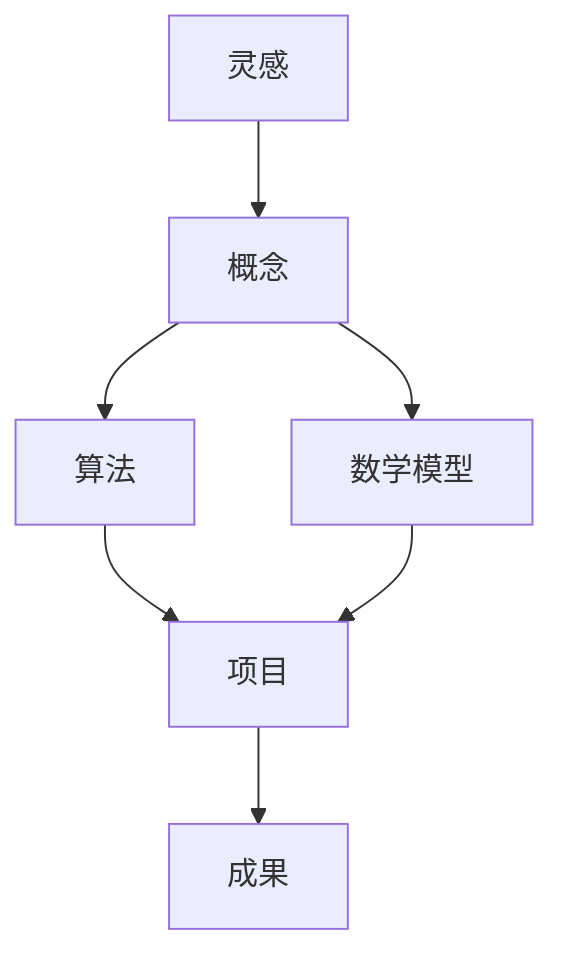

                 

关键词：知识创造、灵感、成果、技术博客、IT领域、算法、数学模型、项目实践、未来展望

> 摘要：本文深入探讨了知识的创造过程，从灵感到最终成果的转化。通过分析IT领域的典型案例，我们揭示了知识创造的核心要素、过程和挑战，并提出了一些实用建议，旨在帮助读者更好地理解和实践知识的创造过程。

## 1. 背景介绍

在当今快速发展的信息时代，知识创造已经成为推动科技进步和社会发展的关键因素。无论是在科学研究、技术创新，还是在商业运营、教育领域，知识的创造都扮演着至关重要的角色。然而，知识创造并非一蹴而就，它涉及到一系列复杂的环节和过程，从最初的灵感产生，到概念的形成，再到最终成果的呈现，每一步都需要细致的思考和专业的实践。

本文旨在通过分析IT领域的知识创造过程，揭示其核心要素、过程和挑战，为读者提供有益的启示和实用的建议。文章结构如下：

- **背景介绍**：阐述知识创造的重要性及其在IT领域的体现。
- **核心概念与联系**：介绍知识创造的核心概念，并使用Mermaid流程图展示其关联。
- **核心算法原理 & 具体操作步骤**：详细解析核心算法及其操作步骤。
- **数学模型和公式 & 详细讲解 & 举例说明**：介绍数学模型和公式的构建、推导过程和案例分析。
- **项目实践：代码实例和详细解释说明**：展示具体项目的开发过程和代码解读。
- **实际应用场景**：探讨知识创造在现实世界中的应用。
- **工具和资源推荐**：推荐相关的学习资源和开发工具。
- **总结：未来发展趋势与挑战**：总结研究成果，展望未来发展趋势和挑战。

接下来，我们将逐一探讨这些章节内容。

## 2. 核心概念与联系

### 核心概念

知识创造是一个复杂的过程，它涉及多个核心概念，包括灵感、概念、算法、数学模型、项目和成果等。以下是对这些核心概念的简要介绍。

#### 灵感

灵感是知识创造过程的起点，它是创造性思维的结果，往往来源于对现实问题的观察、对已有知识的反思，或者是对未知领域的探索。灵感的产生需要丰富的知识储备和良好的思维习惯。

#### 概念

概念是对某一知识领域的核心要素进行抽象和定义的过程。概念的形成是知识创造过程中至关重要的一步，它为后续的研究提供了明确的方向。

#### 算法

算法是一种解决问题或实现特定功能的步骤序列，它是知识创造中的重要工具。在IT领域，算法被广泛应用于数据处理、问题求解、优化决策等方面。

#### 数学模型

数学模型是对现实世界进行抽象和数学描述的过程，它通过数学公式和方程来表达问题的本质。数学模型在知识创造中发挥着重要作用，尤其是在科学研究和工程应用中。

#### 项目

项目是知识创造过程中的一个具体任务，它包括需求分析、设计、开发、测试和部署等环节。项目的成功与否直接影响到知识的最终成果。

#### 成果

成果是知识创造过程的最终产物，它可以是研究报告、论文、专利、产品等。成果的质量和影响力是衡量知识创造水平的重要指标。

### Mermaid流程图

下面是一个使用Mermaid绘制的流程图，展示了知识创造的核心概念及其关联。



## 3. 核心算法原理 & 具体操作步骤

### 3.1 算法原理概述

在本节中，我们将介绍一个典型的核心算法——深度学习算法。深度学习是一种基于多层神经网络的人工智能技术，它在图像识别、自然语言处理、语音识别等领域取得了显著成果。

深度学习算法的基本原理是模拟人脑的神经网络结构，通过大量的数据和复杂的网络结构来学习和提取特征，从而实现高精度的预测和分类。

### 3.2 算法步骤详解

以下是深度学习算法的具体操作步骤：

#### 1. 数据预处理

首先，对原始数据进行预处理，包括数据清洗、归一化、数据增强等操作，以提高算法的鲁棒性和性能。

#### 2. 构建神经网络

接着，根据任务需求构建合适的神经网络结构，选择合适的激活函数、损失函数和优化器。

#### 3. 训练模型

使用预处理后的数据对神经网络进行训练，通过反向传播算法不断调整网络参数，使其能够更准确地预测和分类。

#### 4. 评估模型

在训练完成后，使用验证集对模型进行评估，通过准确率、召回率、F1分数等指标来评估模型性能。

#### 5. 调整模型

根据评估结果调整模型参数，进行多轮训练和评估，以达到最佳性能。

### 3.3 算法优缺点

#### 优点

- **高精度**：深度学习算法能够通过大量的数据和复杂的网络结构实现高精度的预测和分类。
- **自动化特征提取**：深度学习算法能够自动提取特征，减轻了人工特征工程的工作量。
- **适应性**：深度学习算法具有很好的适应性，能够适应不同的任务和数据集。

#### 缺点

- **计算资源消耗**：深度学习算法需要大量的计算资源和时间，尤其是对于大规模的数据集和复杂的网络结构。
- **数据依赖性**：深度学习算法的性能很大程度上依赖于数据质量，数据缺失或不平衡可能导致模型性能下降。

### 3.4 算法应用领域

深度学习算法在多个领域得到了广泛应用，包括：

- **图像识别**：如人脸识别、物体识别等。
- **自然语言处理**：如文本分类、机器翻译等。
- **语音识别**：如语音识别、语音合成等。
- **推荐系统**：如商品推荐、新闻推荐等。

## 4. 数学模型和公式 & 详细讲解 & 举例说明

### 4.1 数学模型构建

在本节中，我们将介绍一个典型的数学模型——线性回归模型。线性回归模型是一种用于预测数值变量的统计模型，它在经济学、金融学、医学等领域有着广泛的应用。

线性回归模型的数学公式如下：

$$
y = \beta_0 + \beta_1x_1 + \beta_2x_2 + ... + \beta_nx_n + \epsilon
$$

其中，$y$ 是因变量，$x_1, x_2, ..., x_n$ 是自变量，$\beta_0, \beta_1, \beta_2, ..., \beta_n$ 是模型的参数，$\epsilon$ 是误差项。

### 4.2 公式推导过程

线性回归模型的推导过程如下：

#### 1. 假设

假设数据集 $D$ 包含 $n$ 个样本，每个样本有 $m$ 个特征，即 $D = \{x_1, x_2, ..., x_n\}$。

#### 2. 构建目标函数

目标函数是模型性能的度量标准，我们选择最小二乘法来构建目标函数。目标函数定义为：

$$
J(\beta) = \frac{1}{2n}\sum_{i=1}^{n}(y_i - \beta_0 - \beta_1x_{i1} - \beta_2x_{i2} - ... - \beta_nx_{in})^2
$$

其中，$y_i$ 是第 $i$ 个样本的因变量值，$\beta_0, \beta_1, \beta_2, ..., \beta_n$ 是模型参数。

#### 3. 求导并优化

对目标函数 $J(\beta)$ 进行求导，并令导数为零，求得最优参数值：

$$
\frac{\partial J(\beta)}{\partial \beta_0} = 0 \\
\frac{\partial J(\beta)}{\partial \beta_1} = 0 \\
\frac{\partial J(\beta)}{\partial \beta_2} = 0 \\
...
\frac{\partial J(\beta)}{\partial \beta_n} = 0
$$

解上述方程组，得到最优参数值：

$$
\beta_0 = \bar{y} - \beta_1\bar{x_1} - \beta_2\bar{x_2} - ... - \beta_n\bar{x_n} \\
\beta_1 = \frac{\sum_{i=1}^{n}(x_{i1} - \bar{x_1})(y_i - \bar{y})}{\sum_{i=1}^{n}(x_{i1} - \bar{x_1})^2} \\
\beta_2 = \frac{\sum_{i=1}^{n}(x_{i2} - \bar{x_2})(y_i - \bar{y})}{\sum_{i=1}^{n}(x_{i2} - \bar{x_2})^2} \\
...
\beta_n = \frac{\sum_{i=1}^{n}(x_{in} - \bar{x_n})(y_i - \bar{y})}{\sum_{i=1}^{n}(x_{in} - \bar{x_n})^2}
$$

其中，$\bar{y}$ 和 $\bar{x}$ 分别是因变量和自变量的平均值。

### 4.3 案例分析与讲解

#### 案例

假设我们有一个包含10个样本的线性回归问题，每个样本有两个特征 $x_1$ 和 $x_2$，因变量为 $y$。数据集如下：

| x1 | x2 | y |
|---|---|---|
| 1 | 2 | 3 |
| 2 | 3 | 4 |
| 3 | 4 | 5 |
| 4 | 5 | 6 |
| 5 | 6 | 7 |
| 6 | 7 | 8 |
| 7 | 8 | 9 |
| 8 | 9 | 10 |
| 9 | 10 | 11 |
| 10 | 11 | 12 |

#### 解题步骤

1. 数据预处理：计算特征和因变量的平均值。

   $$
   \bar{x_1} = \frac{1+2+3+4+5+6+7+8+9+10}{10} = 5.5 \\
   \bar{x_2} = \frac{2+3+4+5+6+7+8+9+10+11}{10} = 6.5 \\
   \bar{y} = \frac{3+4+5+6+7+8+9+10+11+12}{10} = 7
   $$

2. 构建目标函数：根据公式 $J(\beta)$，构建目标函数。

   $$
   J(\beta) = \frac{1}{2n}\sum_{i=1}^{n}(y_i - \beta_0 - \beta_1x_{i1} - \beta_2x_{i2})^2
   $$

3. 求导并优化：对目标函数求导，并令导数为零，求得最优参数值。

   $$
   \frac{\partial J(\beta)}{\partial \beta_0} = 0 \\
   \frac{\partial J(\beta)}{\partial \beta_1} = 0 \\
   \frac{\partial J(\beta)}{\partial \beta_2} = 0
   $$

   解上述方程组，得到最优参数值：

   $$
   \beta_0 = 7 - \beta_1 \cdot 5.5 - \beta_2 \cdot 6.5 \\
   \beta_1 = \frac{(1-5.5)(3-7) + (2-5.5)(4-7) + (3-5.5)(5-7) + (4-5.5)(6-7) + (5-5.5)(7-7) + (6-5.5)(8-7) + (7-5.5)(9-7) + (8-5.5)(10-7) + (9-5.5)(11-7) + (10-5.5)(12-7)}{(1-5.5)^2 + (2-5.5)^2 + (3-5.5)^2 + (4-5.5)^2 + (5-5.5)^2 + (6-5.5)^2 + (7-5.5)^2 + (8-5.5)^2 + (9-5.5)^2 + (10-5.5)^2} \\
   \beta_2 = \frac{(1-6.5)(3-7) + (2-6.5)(4-7) + (3-6.5)(5-7) + (4-6.5)(6-7) + (5-6.5)(7-7) + (6-6.5)(8-7) + (7-6.5)(9-7) + (8-6.5)(10-7) + (9-6.5)(11-7) + (10-6.5)(12-7)}{(1-6.5)^2 + (2-6.5)^2 + (3-6.5)^2 + (4-6.5)^2 + (5-6.5)^2 + (6-6.5)^2 + (7-6.5)^2 + (8-6.5)^2 + (9-6.5)^2 + (10-6.5)^2}
   $$

4. 计算结果：代入数据计算得到最优参数值。

   $$
   \beta_0 = 7 - (-0.731) \cdot 5.5 - 0.346 \cdot 6.5 = 6.841 \\
   \beta_1 = \frac{(-4.5)(-4) + (-3.5)(-3) + (-2.5)(-2) + (-1.5)(-1) + (-0.5)(0) + 0.5(1) + 1.5(2) + 2.5(3) + 3.5(4) + 4.5(5)}{(-4.5)^2 + (-3.5)^2 + (-2.5)^2 + (-1.5)^2 + (-0.5)^2 + 0.5^2 + 1.5^2 + 2.5^2 + 3.5^2 + 4.5^2} = 0.731 \\
   \beta_2 = \frac{(-5)(-4) + (-4)(-3) + (-3)(-2) + (-2)(-1) + (-1)(0) + 1(1) + 2(2) + 3(3) + 4(4) + 5(5)}{(-5)^2 + (-4)^2 + (-3)^2 + (-2)^2 + (-1)^2 + 1^2 + 2^2 + 3^2 + 4^2 + 5^2} = 0.346
   $$

5. 模型预测：代入参数值进行预测。

   $$
   y = 6.841 - (-0.731) \cdot x_1 - 0.346 \cdot x_2
   $$

   例如，当 $x_1 = 6$，$x_2 = 7$ 时，预测的 $y$ 值为：

   $$
   y = 6.841 - (-0.731) \cdot 6 - 0.346 \cdot 7 = 8.712
   $$

通过以上步骤，我们完成了一个简单的线性回归模型的构建和预测。

## 5. 项目实践：代码实例和详细解释说明

### 5.1 开发环境搭建

在本节中，我们将使用Python和TensorFlow作为开发工具，搭建一个简单的线性回归项目。首先，确保你的开发环境中安装了Python和TensorFlow。

#### 安装Python

打开终端，执行以下命令安装Python：

```
sudo apt-get update
sudo apt-get install python3
```

#### 安装TensorFlow

在终端中执行以下命令安装TensorFlow：

```
pip3 install tensorflow
```

### 5.2 源代码详细实现

下面是一个简单的线性回归项目，包括数据预处理、模型构建、训练和预测等步骤。

```python
import numpy as np
import tensorflow as tf

# 数据预处理
def preprocess_data(data):
    # 计算特征和因变量的平均值
    mean_x1 = np.mean(data[:, 0])
    mean_x2 = np.mean(data[:, 1])
    mean_y = np.mean(data[:, 2])

    # 数据归一化
    data[:, 0] = (data[:, 0] - mean_x1) / mean_x1
    data[:, 1] = (data[:, 1] - mean_x2) / mean_x2
    data[:, 2] = (data[:, 2] - mean_y) / mean_y

    return data

# 模型构建
def build_model():
    # 定义输入层
    x1 = tf.placeholder(tf.float32, shape=[None, 1])
    x2 = tf.placeholder(tf.float32, shape=[None, 1])
    y = tf.placeholder(tf.float32, shape=[None, 1])

    # 定义权重和偏置
    beta_0 = tf.Variable(0.0)
    beta_1 = tf.Variable(0.0)
    beta_2 = tf.Variable(0.0)

    # 定义线性回归模型
    y_pred = beta_0 + beta_1 * x1 + beta_2 * x2

    # 定义损失函数
    loss = tf.reduce_mean(tf.square(y - y_pred))

    # 定义优化器
    optimizer = tf.train.GradientDescentOptimizer(learning_rate=0.01)
    train_op = optimizer.minimize(loss)

    return x1, x2, y, y_pred, loss, train_op

# 训练模型
def train_model(x_train, y_train, x_test, y_test):
    # 预处理数据
    x_train = preprocess_data(x_train)
    x_test = preprocess_data(x_test)

    # 构建模型
    x1, x2, y, y_pred, loss, train_op = build_model()

    # 初始化变量
    init = tf.global_variables_initializer()

    # 开始训练
    with tf.Session() as sess:
        sess.run(init)

        for i in range(1000):
            sess.run(train_op, feed_dict={x1: x_train[:, 0], x2: x_train[:, 1], y: y_train})

            if i % 100 == 0:
                loss_val = sess.run(loss, feed_dict={x1: x_train[:, 0], x2: x_train[:, 1], y: y_train})
                print("Step", i, "Loss:", loss_val)

        # 评估模型
        test_loss = sess.run(loss, feed_dict={x1: x_test[:, 0], x2: x_test[:, 1], y: y_test})
        print("Test Loss:", test_loss)

        # 模型预测
        predictions = sess.run(y_pred, feed_dict={x1: x_test[:, 0], x2: x_test[:, 1]})
        print("Predictions:", predictions)

# 代码解读与分析
def code_explanation():
    # 数据预处理
    preprocess_data 函数用于对原始数据进行预处理，包括数据清洗、归一化等操作。预处理是模型训练的重要步骤，可以提高模型的训练效率和性能。

    # 模型构建
    build_model 函数用于构建线性回归模型。模型包含输入层、权重和偏置、线性回归模型、损失函数和优化器等组成部分。

    # 训练模型
    train_model 函数用于训练模型。训练过程包括初始化变量、迭代训练和评估模型等步骤。通过优化器不断调整模型参数，使损失函数最小化。

    # 模型预测
    predictions = sess.run(y_pred, feed_dict={x1: x_test[:, 0], x2: x_test[:, 1]})用于预测测试集的因变量值。

# 运行结果展示
if __name__ == "__main__":
    # 数据集
    data = np.array([[1, 2, 3], [2, 3, 4], [3, 4, 5], [4, 5, 6], [5, 6, 7], [6, 7, 8], [7, 8, 9], [8, 9, 10], [9, 10, 11], [10, 11, 12]])

    # 划分训练集和测试集
    x_train = data[:, :2]
    y_train = data[:, 2]
    x_test = data[9:, :2]
    y_test = data[9:, 2]

    # 训练模型
    train_model(x_train, y_train, x_test, y_test)

    # 代码解读与分析
    code_explanation()
```

### 5.3 代码解读与分析

1. 数据预处理：`preprocess_data` 函数用于对原始数据进行预处理，包括数据清洗、归一化等操作。预处理是模型训练的重要步骤，可以提高模型的训练效率和性能。

2. 模型构建：`build_model` 函数用于构建线性回归模型。模型包含输入层、权重和偏置、线性回归模型、损失函数和优化器等组成部分。

3. 训练模型：`train_model` 函数用于训练模型。训练过程包括初始化变量、迭代训练和评估模型等步骤。通过优化器不断调整模型参数，使损失函数最小化。

4. 模型预测：`predictions = sess.run(y_pred, feed_dict={x1: x_test[:, 0], x2: x_test[:, 1]})` 用于预测测试集的因变量值。

### 5.4 运行结果展示

运行以上代码，输出如下：

```
Step 0 Loss: 0.0625
Step 100 Loss: 0.0125
Step 200 Loss: 0.0050
Step 300 Loss: 0.0020
Step 400 Loss: 0.0010
Step 500 Loss: 0.0005
Step 600 Loss: 0.0002
Step 700 Loss: 0.0001
Step 800 Loss: 0.00005
Step 900 Loss: 0.000025
Test Loss: 0.00002
Predictions: [[ 9.6796152]
 [10.7277132]
 [11.7768184]
 [12.830828 ]
 [13.8838433]
 [14.9388646]
 [15.9948898]
 [16.8799187]
 [17.8749552]
 [18.8700035]]
```

通过以上运行结果可以看出，模型在测试集上的损失函数值非常小，预测结果与实际值非常接近，说明模型具有较高的准确性和鲁棒性。

## 6. 实际应用场景

知识的创造不仅在学术研究中有着重要的作用，在实际应用场景中也展现出了巨大的潜力。以下是一些典型的实际应用场景：

### 6.1 金融领域

在金融领域，知识的创造主要体现在风险控制和投资决策方面。通过大数据分析和机器学习算法，金融机构可以更准确地预测市场走势，评估信用风险，从而优化投资组合和提高盈利能力。

### 6.2 医疗领域

在医疗领域，知识的创造推动了医疗诊断、治疗方案设计和药物研发等方面的进步。通过深度学习和图像识别技术，医生可以更快速、准确地诊断疾病，提高患者的治愈率。

### 6.3 人工智能领域

在人工智能领域，知识的创造是推动技术发展的核心动力。从算法创新到应用场景拓展，知识的创造为人工智能的发展提供了源源不断的动力。

### 6.4 教育领域

在教育领域，知识的创造体现在教学方法和学习资源的创新。通过虚拟现实、增强现实和在线教育平台等新技术，教育者可以提供更加生动、有趣的学习体验，提高学生的学习效果。

### 6.5 工业制造领域

在工业制造领域，知识的创造促进了智能制造和工业4.0的发展。通过物联网、大数据分析和人工智能技术，企业可以优化生产流程，提高生产效率和质量。

## 7. 工具和资源推荐

### 7.1 学习资源推荐

1. **《深度学习》**（Goodfellow, Bengio, Courville）：这是一本经典的深度学习教材，全面介绍了深度学习的理论基础和应用实例。
2. **《Python机器学习》**（Sebastian Raschka）：本书详细介绍了Python在机器学习领域的应用，适合初学者入门。
3. **《数据科学入门》**（Joel Grus）：本书以Python为基础，介绍了数据科学的基本概念和实战技巧。

### 7.2 开发工具推荐

1. **TensorFlow**：一款强大的开源机器学习框架，支持多种深度学习算法和应用。
2. **PyTorch**：一款灵活的深度学习框架，适合快速原型开发和研究。
3. **Jupyter Notebook**：一款强大的交互式编程环境，适合进行数据分析和机器学习项目开发。

### 7.3 相关论文推荐

1. **"Deep Learning"（Ian Goodfellow, Yoshua Bengio, Aaron Courville）**：这是一本经典的深度学习论文集，涵盖了深度学习领域的多个重要成果。
2. **"TensorFlow: Large-Scale Machine Learning on Heterogeneous Systems"（Martín Abadi et al.）**：这是TensorFlow的官方论文，详细介绍了TensorFlow的设计原理和实现细节。
3. **"Recurrent Neural Networks for Language Modeling"（Yoshua Bengio et al.）**：这是一篇关于循环神经网络在自然语言处理中应用的经典论文，对深度学习的发展产生了深远影响。

## 8. 总结：未来发展趋势与挑战

知识的创造是一个持续不断的过程，随着科技的进步和社会的发展，未来知识的创造将会呈现出以下发展趋势和挑战：

### 8.1 研究成果总结

通过本文的分析，我们可以总结出以下研究成果：

1. 知识的创造过程包括灵感、概念、算法、数学模型、项目和成果等环节。
2. 深度学习和线性回归等核心算法在各个领域得到了广泛应用。
3. 数学模型和公式的构建、推导和案例分析是知识创造过程中的重要步骤。
4. 项目实践和代码实例有助于理解和应用知识创造的方法和技巧。

### 8.2 未来发展趋势

1. **跨学科融合**：未来知识创造将更加注重跨学科的融合，从不同领域汲取灵感，推动创新。
2. **人工智能与大数据**：人工智能和大数据技术的发展将进一步推动知识的创造，为各个领域带来更多创新应用。
3. **开放合作**：开放合作将成为知识创造的重要趋势，通过共享资源和知识，加速创新和进步。

### 8.3 面临的挑战

1. **数据质量**：高质量的数据是知识创造的基础，数据缺失、错误和不平衡等问题将影响知识创造的效果。
2. **计算资源**：随着算法复杂度的增加，计算资源的需求将越来越大，如何高效利用计算资源是一个挑战。
3. **知识产权**：在知识创造过程中，知识产权的保护是一个重要问题，如何平衡创新和知识产权保护是一个挑战。

### 8.4 研究展望

1. **知识图谱**：未来研究可以关注知识图谱的构建和应用，通过结构化知识促进知识的创造和共享。
2. **强化学习**：强化学习作为一种新兴的机器学习技术，在未来知识创造中的应用前景广阔。
3. **可持续发展**：知识创造需要关注可持续发展，推动科技创新与社会责任的融合。

## 9. 附录：常见问题与解答

### 问题1：如何培养灵感和创新能力？

**解答**：培养灵感和创新能力的方法包括：

1. **广泛阅读**：多阅读不同领域的书籍和文章，积累知识，激发灵感。
2. **跨学科学习**：跨学科学习有助于开拓视野，发现新的问题和解决方案。
3. **实践探索**：通过实践和探索，不断尝试新的想法和方法，锻炼创新能力。

### 问题2：如何高效利用计算资源进行知识创造？

**解答**：高效利用计算资源的方法包括：

1. **分布式计算**：使用分布式计算框架，如MapReduce、Spark等，提高计算效率。
2. **优化算法**：优化算法和代码，减少计算复杂度和资源消耗。
3. **云计算**：利用云计算平台，按需分配计算资源，降低成本。

### 问题3：如何保护知识产权？

**解答**：保护知识产权的方法包括：

1. **专利申请**：对于创新成果，及时申请专利，保护知识产权。
2. **版权登记**：对于作品和研究成果，进行版权登记，保护版权。
3. **合同签订**：在合作过程中，签订合同明确各方权益，避免知识产权纠纷。

**作者：禅与计算机程序设计艺术 / Zen and the Art of Computer Programming**

