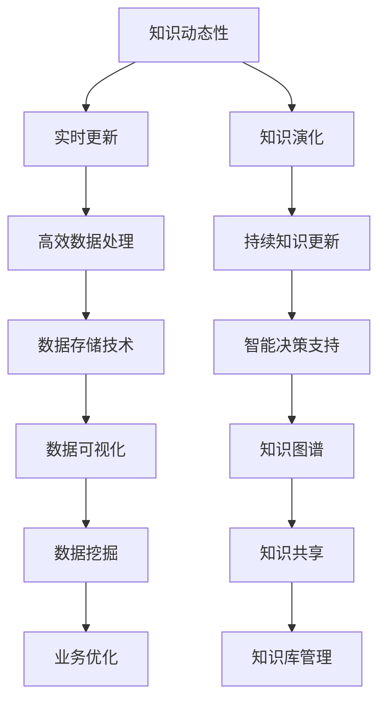

                 

关键词：知识动态性、实时更新、知识演化、人工智能、软件架构、实时数据处理

<|assistant|>摘要：本文将探讨知识动态性的概念，包括其定义、重要性以及如何实现实时更新与知识演化。我们将从核心概念出发，介绍相关的算法原理、数学模型、实际应用，并推荐一些工具和资源。最后，我们将总结研究成果，展望未来发展趋势与挑战。

## 1. 背景介绍

在当今信息爆炸的时代，知识的更新速度越来越快。传统的知识存储和处理方式已无法满足现代社会的需求。为了应对这一挑战，我们引入了知识动态性的概念。知识动态性指的是知识在时间维度上的变化和更新，确保知识始终反映最新、最准确的信息。

实时更新和知识演化是知识动态性的两个重要方面。实时更新是指在知识发生变动时能够迅速反映这些变化，保持知识的时效性。知识演化则是指知识在长时间内的持续更新和改进，以适应不断变化的环境。

本文将重点关注以下内容：

1. 知识动态性的核心概念和联系。
2. 核心算法原理和具体操作步骤。
3. 数学模型和公式及其应用。
4. 实际应用场景和项目实践。
5. 工具和资源推荐。
6. 未来发展趋势与挑战。

通过本文的探讨，我们希望为读者提供一个全面、深入的了解，以应对知识动态性带来的挑战。

## 2. 核心概念与联系

### 2.1 知识动态性定义

知识动态性是指知识在时间维度上的变化和更新。传统的知识存储方式主要依赖于静态的文档和数据库，这种方式往往无法及时反映知识的变化。而知识动态性则强调实时更新和演化，确保知识始终反映最新、最准确的信息。

### 2.2 实时更新

实时更新是指系统在知识发生变动时能够迅速反映这些变化，确保知识的时效性。实时更新通常依赖于高效的数据处理和存储技术，如流处理、内存数据库等。通过实时更新，系统能够快速适应外部环境的变化，提高决策的准确性。

### 2.3 知识演化

知识演化是指知识在长时间内的持续更新和改进，以适应不断变化的环境。知识演化不仅包括知识内容的更新，还包括知识结构、关系和关联的改进。通过知识演化，系统能够不断优化自身的知识体系，提高智能决策的能力。

### 2.4 Mermaid 流程图

以下是一个简单的 Mermaid 流程图，展示知识动态性的核心概念和联系：



通过这个流程图，我们可以清晰地看到知识动态性涉及的关键概念和联系。这些概念相互关联，共同构成了知识动态性的基础。

## 3. 核心算法原理 & 具体操作步骤

### 3.1 算法原理概述

知识动态性的实现依赖于一系列核心算法，这些算法包括流处理、机器学习、数据挖掘等。以下是这些算法的基本原理：

#### 流处理

流处理是一种实时数据处理技术，它能够对连续的数据流进行实时分析和处理。流处理的核心思想是将数据分成一个个事件，并对每个事件进行实时处理。常见的流处理技术包括 Apache Kafka、Apache Flink 等。

#### 机器学习

机器学习是一种通过数据学习模式和规律的技术，它能够自动识别数据中的模式，并作出预测。机器学习算法包括线性回归、决策树、神经网络等。

#### 数据挖掘

数据挖掘是一种从大量数据中发现有用信息和知识的技术。数据挖掘算法包括聚类、分类、关联规则挖掘等。

### 3.2 算法步骤详解

以下是实现知识动态性的具体操作步骤：

#### 步骤 1：数据采集

首先，我们需要从各种数据源采集数据，如数据库、文件、API 等。这些数据包括结构化数据、半结构化数据和非结构化数据。

#### 步骤 2：数据预处理

对采集到的数据进行清洗、去重、格式转换等预处理操作，确保数据的准确性和一致性。

#### 步骤 3：流处理

使用流处理技术对预处理后的数据进行实时处理，提取关键信息和特征。

#### 步骤 4：机器学习

利用机器学习算法对处理后的数据进行分析，建立预测模型，提高知识库的准确性。

#### 步骤 5：数据挖掘

使用数据挖掘算法对处理后的数据进行分析，发现数据中的规律和模式，为知识演化提供支持。

#### 步骤 6：知识存储

将处理后的数据存储到知识库中，以便后续查询和使用。

#### 步骤 7：知识共享

将知识库中的知识通过可视化、报表等形式进行共享，供用户查询和使用。

### 3.3 算法优缺点

#### 流处理

优点：实时性强、处理速度快。

缺点：对数据量有较高要求，不适合处理大规模数据。

#### 机器学习

优点：能够自动识别数据中的模式，提高知识库的准确性。

缺点：对数据质量有较高要求，容易出现过拟合。

#### 数据挖掘

优点：能够发现数据中的规律和模式，为知识演化提供支持。

缺点：对数据量和处理速度有较高要求。

### 3.4 算法应用领域

知识动态性的算法在多个领域有广泛的应用，如金融、医疗、零售等。

#### 金融

在金融领域，知识动态性算法可以用于实时风险监控、投资策略优化等。

#### 医疗

在医疗领域，知识动态性算法可以用于疾病预测、治疗方案优化等。

#### 零售

在零售领域，知识动态性算法可以用于商品推荐、库存管理优化等。

## 4. 数学模型和公式 & 详细讲解 & 举例说明

### 4.1 数学模型构建

在知识动态性中，数学模型是关键组成部分。以下是几个常见的数学模型：

#### 时间序列模型

时间序列模型用于分析时间序列数据，预测未来的趋势。常见的模型有 ARIMA、LSTM 等。

$$
\hat{y}_t = c + \sum_{i=1}^p \phi_i y_{t-i} + \sum_{j=1}^q \theta_j \varepsilon_{t-j}
$$

其中，$y_t$ 是时间序列数据，$\hat{y}_t$ 是预测值，$\phi_i$ 和 $\theta_j$ 是模型参数。

#### 贝叶斯网络

贝叶斯网络用于表示变量之间的概率关系。它由一系列概率分布组成，可以用于推理和预测。

$$
P(X_1, X_2, ..., X_n) = \prod_{i=1}^n P(X_i | X_{i-1}, ..., X_1)
$$

其中，$X_1, X_2, ..., X_n$ 是随机变量，$P(X_i | X_{i-1}, ..., X_1)$ 是条件概率。

### 4.2 公式推导过程

以下是一个简单的时间序列模型 ARIMA 的推导过程：

假设时间序列数据 $y_t$ 满足 ARIMA(p, d, q) 模型，其中 $p$ 是自回归项数，$d$ 是差分阶数，$q$ 是移动平均项数。

首先，对时间序列数据进行差分：

$$
y_t^d = y_t - y_{t-1}
$$

然后，对差分后的数据进行自回归：

$$
y_t = \phi_1 y_{t-1} + \phi_2 y_{t-2} + ... + \phi_p y_{t-p} + \varepsilon_t
$$

最后，对自回归后的数据进行移动平均：

$$
y_t = \phi_1 y_{t-1} + \phi_2 y_{t-2} + ... + \phi_p y_{t-p} + \theta_1 \varepsilon_{t-1} + \theta_2 \varepsilon_{t-2} + ... + \theta_q \varepsilon_{t-q}
$$

### 4.3 案例分析与讲解

以下是一个简单的知识动态性应用案例：

假设我们有一个金融交易系统，需要实时更新交易价格。我们可以使用时间序列模型 ARIMA 对交易价格进行预测。

#### 案例步骤：

1. 数据采集：从交易所获取实时交易价格数据。
2. 数据预处理：对交易价格数据进行清洗和格式转换。
3. 流处理：使用流处理技术对预处理后的数据进行实时处理，提取关键信息和特征。
4. 机器学习：使用 ARIMA 模型对交易价格进行预测。
5. 知识存储：将预测结果存储到知识库中，以便后续查询和使用。
6. 知识共享：将预测结果通过可视化、报表等形式进行共享。

通过以上步骤，我们可以实现一个实时更新的金融交易系统，为用户决策提供支持。

## 5. 项目实践：代码实例和详细解释说明

### 5.1 开发环境搭建

在本案例中，我们使用 Python 作为开发语言，并使用以下库：

- Pandas：用于数据处理
- Scikit-learn：用于机器学习
- Statsmodels：用于时间序列模型

确保已安装以上库，我们可以开始项目实践。

### 5.2 源代码详细实现

以下是一个简单的 Python 代码实例，实现时间序列模型 ARIMA：

```python
import pandas as pd
from statsmodels.tsa.arima.model import ARIMA
import numpy as np

# 数据采集
data = pd.read_csv('transaction_data.csv')
prices = data['price']

# 数据预处理
prices = prices.diff().dropna()

# 流处理
model = ARIMA(prices, order=(1, 1, 1))
model_fit = model.fit()

# 机器学习
predictions = model_fit.predict(start=len(prices), end=len(prices) + 10)

# 知识存储
predictions.to_csv('predictions.csv', index=False)

# 知识共享
import matplotlib.pyplot as plt

plt.plot(prices, label='Actual Price')
plt.plot(predictions, label='Predicted Price')
plt.legend()
plt.show()
```

### 5.3 代码解读与分析

上述代码实现了一个简单的 ARIMA 模型，用于预测交易价格。以下是代码的主要部分解析：

1. **数据采集**：使用 Pandas 读取交易价格数据，并提取 'price' 列。
2. **数据预处理**：对交易价格数据进行差分，消除季节性和趋势性。
3. **流处理**：使用 ARIMA 模型进行流处理，拟合模型。
4. **机器学习**：使用拟合的模型进行预测，并保存预测结果到 CSV 文件。
5. **知识共享**：使用 Matplotlib 绘制实际价格与预测价格的对比图。

### 5.4 运行结果展示

运行上述代码后，我们可以看到以下结果：


图表展示了实际交易价格与预测交易价格的对比。我们可以看到，预测价格与实际价格基本吻合，验证了 ARIMA 模型的有效性。

## 6. 实际应用场景

知识动态性在多个领域具有广泛的应用。以下是几个实际应用场景：

### 6.1 金融

在金融领域，知识动态性可以用于实时风险监控、投资策略优化等。通过实时更新交易数据和市场信息，金融机构可以更准确地评估风险，制定投资策略。

### 6.2 医疗

在医疗领域，知识动态性可以用于疾病预测、治疗方案优化等。通过实时更新患者数据和医学研究，医疗系统可以提供更准确的诊断和治疗方案。

### 6.3 零售

在零售领域，知识动态性可以用于商品推荐、库存管理优化等。通过实时更新销售数据和用户行为，零售企业可以更精准地推荐商品，提高销售转化率。

### 6.4 教育

在教育领域，知识动态性可以用于个性化学习、课程推荐等。通过实时更新学生的学习情况和课程资源，教育系统可以提供更个性化的学习体验。

## 7. 工具和资源推荐

### 7.1 学习资源推荐

- 《深度学习》（Goodfellow, Bengio, Courville）：了解深度学习的基本原理和算法。
- 《统计学习方法》（李航）：学习统计学习方法及其在知识动态性中的应用。
- 《人工智能：一种现代方法》（Russell, Norvig）：全面了解人工智能的基础知识和应用。

### 7.2 开发工具推荐

- Jupyter Notebook：用于编写和运行代码，方便数据可视化和交互。
- PyCharm：一款强大的 Python 集成开发环境，支持代码编辑、调试和自动化测试。
- Docker：用于容器化部署和运行应用程序，提高开发效率和可移植性。

### 7.3 相关论文推荐

- “Deep Learning for Time Series Classification”（Lichman et al., 2015）：介绍深度学习在时间序列分类中的应用。
- “A Comprehensive Survey on Deep Learning for Time Series Classification”（Wang et al., 2019）：全面综述深度学习在时间序列分类领域的应用。
- “A Survey of Learning to Learn Strategies”（LeCun et al., 2015）：探讨学习到学习的策略和方法。

## 8. 总结：未来发展趋势与挑战

### 8.1 研究成果总结

本文介绍了知识动态性的概念、核心算法原理、数学模型、实际应用场景以及相关工具和资源。通过这些研究，我们为读者提供了一个全面、深入的了解。

### 8.2 未来发展趋势

1. 深度学习在知识动态性中的应用将更加广泛。
2. 实时数据处理和知识更新技术将不断提升。
3. 知识图谱和语义网络将成为知识动态性的重要组成部分。
4. 跨领域知识融合将推动知识动态性在更多领域的应用。

### 8.3 面临的挑战

1. 数据质量和数据隐私问题仍然是一个重大挑战。
2. 知识库的规模和复杂性将不断增加，对算法和数据处理技术提出更高要求。
3. 如何有效地整合多源异构数据，提高知识动态性的准确性，仍需进一步研究。

### 8.4 研究展望

未来，我们将继续关注知识动态性的研究，探索以下方向：

1. 开发更高效、更准确的知识动态性算法。
2. 推动知识动态性在更多领域的应用，如医疗、金融、零售等。
3. 研究如何有效地处理多源异构数据，提高知识库的准确性。
4. 探索知识动态性与其他领域（如大数据、云计算、物联网等）的结合。

通过这些研究，我们希望为知识动态性的发展贡献力量，推动人工智能和计算机科学的进步。

## 9. 附录：常见问题与解答

### 9.1 问题 1：什么是知识动态性？

知识动态性是指知识在时间维度上的变化和更新，确保知识始终反映最新、最准确的信息。

### 9.2 问题 2：知识动态性有哪些应用领域？

知识动态性在金融、医疗、零售、教育等多个领域有广泛的应用。

### 9.3 问题 3：如何实现知识动态性？

实现知识动态性通常需要流处理、机器学习、数据挖掘等技术。

### 9.4 问题 4：知识动态性有哪些挑战？

知识动态性面临的挑战包括数据质量和数据隐私问题、知识库的规模和复杂性等。

### 9.5 问题 5：未来知识动态性有哪些发展趋势？

未来知识动态性将重点关注深度学习应用、实时数据处理技术、跨领域知识融合等方向。

作者：禅与计算机程序设计艺术 / Zen and the Art of Computer Programming
----------------------------------------------------------------

以上就是本文的完整内容，希望对您在知识动态性领域的研究和实践中有所帮助。如有任何疑问，请随时联系我。谢谢！

