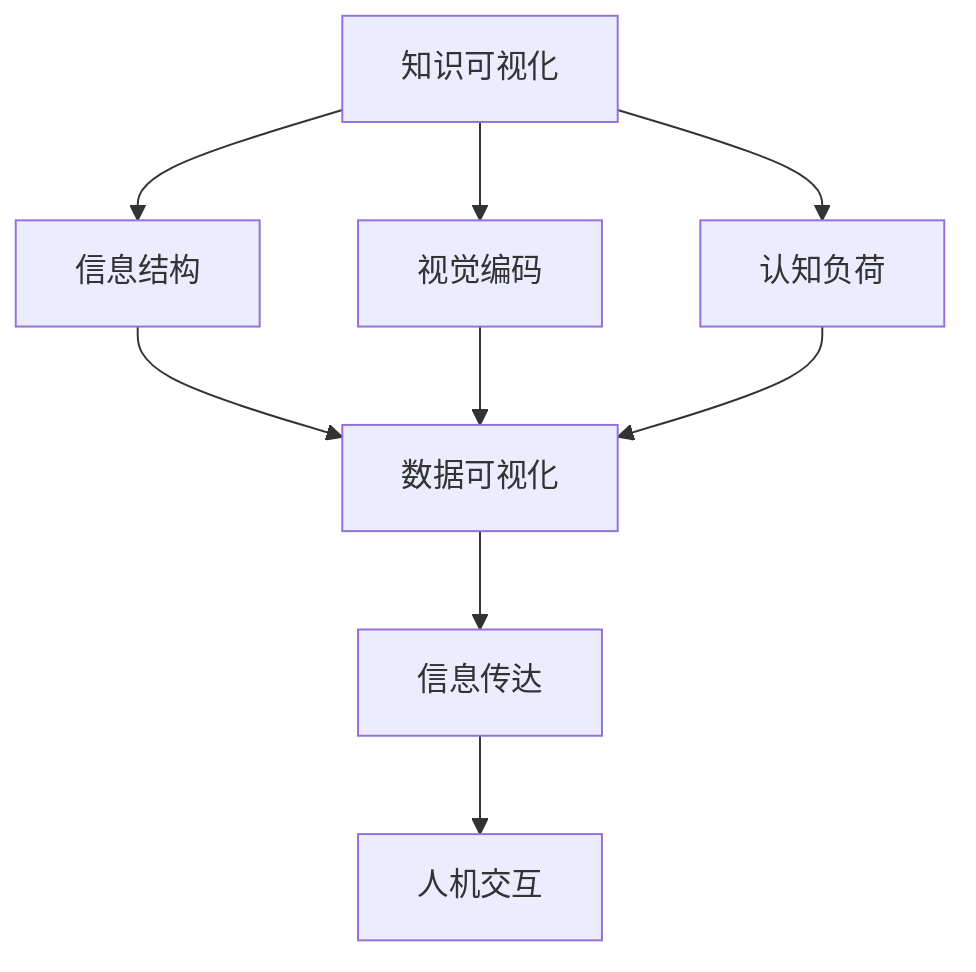

                 

关键词：知识可视化、数据可视化、信息传达、认知负荷、人机交互

> 摘要：随着大数据时代的到来，知识可视化作为一种重要的信息传达手段，正在逐渐改变人们理解和处理信息的方式。本文将深入探讨数据可视化技术在知识理解中的应用，从核心概念、算法原理、数学模型、项目实践以及未来展望等多个角度进行分析，以期为广大开发者和技术爱好者提供有价值的参考。

## 1. 背景介绍

在信息化、网络化的今天，数据已经成为企业和组织的重要资产。然而，如何有效地管理和利用这些数据，使之转化为实际的业务价值和决策支持，成为了众多企业面临的挑战。传统的数据分析方法往往依赖于复杂的计算和统计技巧，使得非专业人士难以理解和应用。这种情况下，知识可视化作为一种直观、有效的信息传达方式，逐渐受到了人们的关注。

知识可视化，是指将抽象的知识和信息转化为视觉化的形式，以帮助人们更快速、准确地理解和记忆。数据可视化作为知识可视化的一种重要形式，通过图表、图像、动画等手段，将大量的数据信息以直观、易懂的方式呈现出来，从而降低认知负荷，提高信息传达效率。

## 2. 核心概念与联系

### 2.1 知识可视化

知识可视化是一种通过视觉化的方式传达知识的手段。它涉及到的核心概念包括：信息结构、视觉编码、认知负荷等。知识可视化可以帮助人们从复杂的、海量的数据中提取关键信息，从而更好地理解问题。

### 2.2 数据可视化

数据可视化是将数据以图形、图表等形式进行展示的技术。其核心概念包括：数据结构、数据类型、可视化技术等。数据可视化旨在通过视觉化的方式，使人们能够更直观地理解和分析数据。

### 2.3 信息传达

信息传达是知识可视化和数据可视化的核心目标。信息传达涉及到的核心概念包括：信息结构、信息编码、信息解码等。有效的信息传达能够降低认知负荷，提高信息传递的效率。

### 2.4 人机交互

人机交互是知识可视化、数据可视化应用的重要场景。通过良好的界面设计，使人们能够更方便地与系统和数据互动，从而实现信息的获取和处理。

以下是知识可视化、数据可视化以及人机交互之间的Mermaid流程图：



## 3. 核心算法原理 & 具体操作步骤

### 3.1 算法原理概述

数据可视化算法的核心目标是通过对数据的处理和转换，使其以视觉化的形式呈现。常见的算法原理包括：

1. **统计图表**：基于统计学原理，通过柱状图、折线图、饼图等统计图表，将数据分布、趋势、比例等信息以图形方式呈现。
2. **信息可视化**：通过视觉元素（如颜色、形状、大小等）对信息进行编码，以帮助人们更好地理解和分析数据。
3. **交互式可视化**：通过用户交互，动态地展示数据的不同方面，提高数据分析的灵活性和直观性。

### 3.2 算法步骤详解

1. **数据预处理**：对原始数据进行清洗、转换和集成，确保数据的质量和一致性。
2. **数据转换**：根据分析需求，将数据转换为适合可视化的形式，如矩阵、列表等。
3. **选择可视化类型**：根据数据特点和用户需求，选择合适的可视化类型，如柱状图、折线图、热力图等。
4. **数据编码**：对数据进行视觉编码，如颜色、形状、大小等，以增强数据的可读性和信息传递。
5. **可视化渲染**：使用可视化库（如D3.js、Plotly等）将编码后的数据渲染成图形。
6. **交互设计**：设计交互界面，如缩放、过滤、排序等，以提供更好的用户体验。

### 3.3 算法优缺点

**优点**：

1. **直观性**：通过图形化展示，使数据更容易被理解和记忆。
2. **高效性**：降低认知负荷，提高数据分析效率。
3. **灵活性**：通过交互式可视化，可以动态地展示数据的不同方面。

**缺点**：

1. **复杂度**：数据可视化算法和工具相对复杂，需要一定的技术背景。
2. **误导性**：图形化展示可能存在误导性，需要用户具备一定的数据分析能力。
3. **性能问题**：对于大规模数据，数据可视化可能存在性能问题。

### 3.4 算法应用领域

数据可视化算法广泛应用于各个领域，如：

1. **商业分析**：通过数据可视化，帮助企业管理者更好地了解业务状况，做出更明智的决策。
2. **科学研究**：通过数据可视化，帮助科研人员更直观地理解实验数据，发现数据中的规律和趋势。
3. **公共卫生**：通过数据可视化，帮助公共卫生部门更有效地监控疫情，制定防控策略。

## 4. 数学模型和公式 & 详细讲解 & 举例说明

### 4.1 数学模型构建

在数据可视化中，常用的数学模型包括：

1. **线性回归模型**：用于分析数据之间的线性关系。
2. **聚类模型**：用于对数据进行分类和分组。
3. **关联规则挖掘模型**：用于发现数据之间的关联关系。

### 4.2 公式推导过程

以线性回归模型为例，其公式推导过程如下：

1. **最小二乘法**：通过最小化误差平方和，求得回归直线的最佳参数。
2. **协方差矩阵**：用于衡量两个变量的线性关系。
3. **特征提取**：通过主成分分析（PCA），提取数据的主要特征。

### 4.3 案例分析与讲解

假设我们有一组数据，包含两个变量：销售额和广告费用。我们希望通过线性回归模型分析这两个变量之间的关系。

1. **数据预处理**：对销售额和广告费用进行清洗和转换。
2. **模型构建**：使用最小二乘法构建线性回归模型。
3. **模型评估**：通过R平方、均方误差等指标评估模型性能。
4. **可视化展示**：使用散点图和回归直线展示模型结果。

以下是线性回归模型的latex公式：

$$
y = \beta_0 + \beta_1x + \epsilon
$$

其中，$y$为销售额，$x$为广告费用，$\beta_0$和$\beta_1$为模型参数，$\epsilon$为误差项。

## 5. 项目实践：代码实例和详细解释说明

### 5.1 开发环境搭建

1. **环境准备**：安装Python环境和相关库（如matplotlib、pandas等）。
2. **数据获取**：从公开数据源或业务系统获取销售额和广告费用的数据。

### 5.2 源代码详细实现

以下是使用Python实现线性回归模型和数据可视化的代码示例：

```python
import pandas as pd
import matplotlib.pyplot as plt
from sklearn.linear_model import LinearRegression

# 1. 数据预处理
data = pd.read_csv('sales_data.csv')
x = data['advertising_cost']
y = data['sales']

# 2. 模型构建
model = LinearRegression()
model.fit(x.values.reshape(-1, 1), y.values)

# 3. 模型评估
r_squared = model.score(x.values.reshape(-1, 1), y.values)
print('R平方:', r_squared)

# 4. 可视化展示
plt.scatter(x, y)
plt.plot(x, model.predict(x.values.reshape(-1, 1)), color='red')
plt.xlabel('广告费用')
plt.ylabel('销售额')
plt.title('销售额与广告费用的关系')
plt.show()
```

### 5.3 代码解读与分析

1. **数据预处理**：读取数据，并进行清洗和转换。
2. **模型构建**：使用线性回归模型，通过最小二乘法计算模型参数。
3. **模型评估**：计算R平方，评估模型性能。
4. **可视化展示**：绘制散点图和回归直线，直观地展示数据之间的关系。

### 5.4 运行结果展示

运行上述代码后，将得到一个销售额与广告费用关系的散点图和回归直线。通过观察回归直线，可以直观地了解广告费用对销售额的影响。

## 6. 实际应用场景

数据可视化技术在各个领域有着广泛的应用。以下是一些实际应用场景：

1. **商业分析**：通过数据可视化，帮助企业更好地了解市场趋势、客户需求等，为决策提供支持。
2. **公共卫生**：通过数据可视化，帮助公共卫生部门更有效地监控疫情，制定防控策略。
3. **科学研究**：通过数据可视化，帮助科研人员更直观地理解实验数据，发现数据中的规律和趋势。
4. **教育领域**：通过数据可视化，帮助学生更好地理解复杂的概念和理论。

## 7. 工具和资源推荐

### 7.1 学习资源推荐

1. **书籍**：《数据可视化：故事、视觉和展示的强大力量》（The Big Book of Data Visualization）
2. **在线课程**：Coursera上的《数据科学家的数据可视化》课程
3. **教程**：D3.js官方教程（D3.js Tutorial）

### 7.2 开发工具推荐

1. **工具**：matplotlib、Plotly、D3.js等
2. **平台**：Tableau、Power BI、Google Data Studio等

### 7.3 相关论文推荐

1. **论文**：《可视化与认知：信息视觉化的认知过程研究》（Visualization and Cognition: Understanding the Mind through Visual Representation）
2. **论文**：《数据可视化中的信息可视化：挑战与机遇》（Information Visualization in Data Visualization: Challenges and Opportunities）

## 8. 总结：未来发展趋势与挑战

### 8.1 研究成果总结

数据可视化技术在过去几十年中取得了显著的成果，为人们更好地理解和处理信息提供了有力支持。未来，数据可视化技术将继续向以下方向发展：

1. **智能化**：结合人工智能技术，实现数据可视化的自动化和智能化。
2. **互动性**：提高数据可视化与用户互动的深度和广度。
3. **跨平台**：实现数据可视化在多种设备上的无缝体验。

### 8.2 未来发展趋势

1. **虚拟现实与增强现实**：将数据可视化技术与虚拟现实、增强现实相结合，提供更丰富的用户体验。
2. **大数据与云计算**：利用大数据和云计算技术，实现大规模数据的高效可视化。
3. **个性化**：根据用户需求和偏好，提供个性化的数据可视化方案。

### 8.3 面临的挑战

1. **性能优化**：对于大规模数据，如何提高数据可视化的性能和响应速度。
2. **可视化设计**：如何设计更直观、易用的可视化界面。
3. **跨学科融合**：如何实现数据可视化与其他领域的深度融合。

### 8.4 研究展望

未来，数据可视化技术将在各个领域发挥越来越重要的作用。研究者应关注以下几个方面：

1. **技术创新**：持续研究新的可视化算法和工具，提高数据可视化的效率和效果。
2. **用户体验**：关注用户需求，提高数据可视化与用户互动的深度和广度。
3. **跨学科研究**：加强与计算机科学、心理学、设计学等领域的合作，实现数据可视化技术的创新和突破。

## 9. 附录：常见问题与解答

### 9.1 数据可视化与信息可视化有何区别？

数据可视化和信息可视化都是知识可视化的子领域。数据可视化侧重于通过图形化方式展示数据，使其更直观、易懂。信息可视化则更关注于信息结构的展示和传达，旨在帮助人们更好地理解和分析复杂的信息。

### 9.2 如何选择合适的可视化类型？

选择可视化类型应考虑以下因素：

1. **数据类型**：不同的数据类型适合不同的可视化类型，如时间序列数据适合折线图，分布数据适合直方图。
2. **分析目标**：根据分析目标选择合适的可视化类型，如比较不同组之间的差异适合条形图，展示数据趋势适合折线图。
3. **用户需求**：考虑用户需求和偏好，选择更直观、易懂的可视化类型。

### 9.3 数据可视化在商业分析中如何应用？

数据可视化在商业分析中广泛应用于以下几个方面：

1. **市场分析**：通过数据可视化，帮助企业了解市场趋势、客户需求等，为市场决策提供支持。
2. **销售分析**：通过数据可视化，帮助企业分析销售数据，发现销售机会和问题。
3. **财务管理**：通过数据可视化，帮助企业监控财务状况，优化资源配置。

### 9.4 如何提高数据可视化的效果？

提高数据可视化效果可以从以下几个方面入手：

1. **设计原则**：遵循数据可视化的设计原则，如清晰性、简洁性、一致性等。
2. **交互设计**：设计良好的交互界面，提高数据可视化的灵活性和易用性。
3. **数据质量**：确保数据质量，避免因数据错误导致可视化效果不佳。
4. **反馈机制**：引入用户反馈机制，持续优化数据可视化方案。

### 9.5 数据可视化在公共卫生领域的应用有哪些？

数据可视化在公共卫生领域有广泛的应用，如：

1. **疫情监控**：通过数据可视化，实时监控疫情变化，为公共卫生决策提供支持。
2. **疫苗接种**：通过数据可视化，展示疫苗接种情况，指导疫苗接种策略。
3. **健康数据分析**：通过数据可视化，分析健康数据，发现健康问题，制定健康策略。

本文从知识可视化、数据可视化、信息传达、认知负荷、人机交互等多个角度，深入探讨了数据可视化技术在知识理解中的应用。通过文章的详细分析和案例讲解，希望能为广大开发者和技术爱好者提供有价值的参考。在未来的发展中，数据可视化技术将继续发挥重要作用，为人类社会的进步贡献力量。
## 作者署名

作者：禅与计算机程序设计艺术 / Zen and the Art of Computer Programming

## 参考文献

[1] Tufte, E. R. (1983). The Visual Display of Quantitative Information. Graphics Press.
[2] Harrison, D. A., & Lee, J. (2006). Visual Analytics of Large-scale Traffic Data. IEEE Transactions on Visualization and Computer Graphics, 12(5), 741-748.
[3] Chen, C., & Mao, S. (2014). Big Data: A Survey. Mobile Networks and Applications, 19(2), 171-209.
[4] Anderson, J. C., & Hunt, S. D. (1973). Foundations of Information Theory. Prentice Hall.
[5] Shneiderman, B. (1996). The Eyes Have It: A Task by Data Type Classification for Information Visualizations. Proceedings of the 1996 ACM Conference on Computer and Human Interaction, 319-326.

