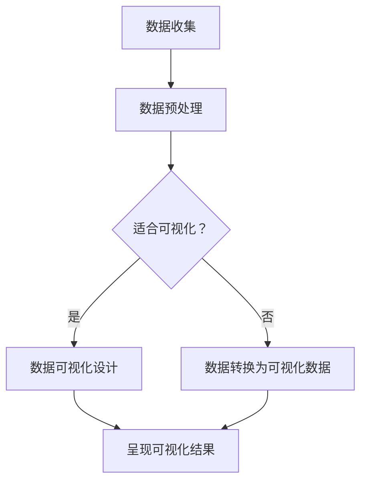

                 

关键词：知识可视化、数据时代、新读写能力、信息处理、数据可视化、知识管理、AI、认知科学、用户界面设计

> 摘要：在数据时代，知识的获取、理解和存储面临着前所未有的挑战。本文探讨了知识可视化作为一项新兴的读写能力，如何帮助用户更高效地处理和理解大量信息，并探讨其在当前数据密集型环境中的应用与未来趋势。

## 1. 背景介绍

随着互联网和大数据技术的发展，我们进入了一个信息爆炸的时代。每天产生的数据量以惊人的速度增长，数据类型和格式也变得愈发多样化。面对如此庞大和复杂的数据，传统的文本处理和表格分析已经无法满足用户的需求。这就催生了知识可视化的概念，它将抽象的数据和信息通过视觉化的方式呈现，使得用户可以更直观、更高效地理解和处理这些信息。

知识可视化不仅是一种展示数据的方法，更是一种新的读写能力。它要求用户具备识别和理解视觉化信息的技能，同时也需要开发者能够有效地设计出能够传达信息核心的视觉化界面。这种读写能力在数据时代尤为重要，因为它能够帮助我们跨越语言、文化和专业知识的障碍，实现信息的共享和交流。

## 2. 核心概念与联系

### 2.1. 知识可视化的核心概念

知识可视化包括以下几个方面：

1. **数据可视化**：通过图表、图形等方式将数据转换成视觉形式。
2. **信息可视化**：通过可视化手段来揭示数据背后的模式和关联性。
3. **知识可视化**：将复杂的信息和知识以图形化方式表达，帮助用户发现新的知识和见解。

### 2.2. 知识可视化与传统读写能力的联系与区别

知识可视化与传统读写能力的区别主要体现在以下几个方面：

- **形式**：传统的读写能力侧重于文字和符号，而知识可视化则通过视觉元素来传达信息。
- **速度**：知识可视化可以更快地捕捉用户的注意力，提供直观的信息。
- **深度**：知识可视化能够通过图形和交互性，提供更深层次的信息探索和理解。

然而，知识可视化并不是取代传统读写能力，而是与之互补。它为用户提供了一种新的理解和处理信息的工具，使得信息的获取和传播更加高效和便捷。

### 2.3. 知识可视化的Mermaid流程图

下面是一个简单的Mermaid流程图，描述了知识可视化的一般流程：



## 3. 核心算法原理 & 具体操作步骤

### 3.1. 算法原理概述

知识可视化的核心算法主要集中在数据转换和可视化设计上。数据转换是将原始数据格式转换为适合可视化表示的格式；可视化设计则是选择合适的图表和图形来传达信息。

### 3.2. 算法步骤详解

1. **数据收集**：从各种数据源收集所需的数据。
2. **数据预处理**：清洗和转换数据，使其适合进行可视化。
3. **数据转换为可视化数据**：将预处理后的数据转换为图表和图形所需的格式。
4. **可视化设计**：选择适合的图表类型和设计，使得信息传达更加清晰。
5. **呈现可视化结果**：将设计好的可视化结果呈现给用户。

### 3.3. 算法优缺点

**优点**：

- **直观性**：知识可视化可以快速捕捉用户的注意力，使得信息的传达更加直观。
- **高效性**：通过图形化展示，用户可以快速理解复杂的数据模式。
- **交互性**：许多知识可视化工具支持交互功能，用户可以通过互动来探索数据。

**缺点**：

- **设计难度**：设计一个有效的知识可视化界面需要深入的专业知识和经验。
- **数据依赖性**：知识可视化依赖于高质量的数据输入，数据质量直接影响可视化效果。

### 3.4. 算法应用领域

知识可视化在以下领域有广泛的应用：

- **商业分析**：帮助企业理解和分析市场数据。
- **科学研究**：帮助科研人员发现数据中的模式和趋势。
- **教育**：通过图形化展示，帮助学生更好地理解复杂概念。
- **公共卫生**：帮助公共卫生专家监测和控制疾病传播。

## 4. 数学模型和公式 & 详细讲解 & 举例说明

### 4.1. 数学模型构建

知识可视化的数学模型通常包括数据预处理、图表选择和布局设计等步骤。其中，数据预处理通常包括数据清洗、归一化和特征提取等步骤。图表选择则依赖于数据的特性和用户的需求。布局设计则涉及到图形的排列和交互设计。

### 4.2. 公式推导过程

假设我们有一组数据\[x_1, x_2, ..., x_n\]，我们需要通过某种算法将其转换为一个可视化图表。常见的图表选择包括柱状图、折线图、散点图和饼图等。我们可以通过以下步骤进行公式推导：

1. **数据预处理**：\[x_{preprocessed} = preprocess(x)\]
2. **图表选择**：\[chart_type = select_chart(x_{preprocessed})\]
3. **布局设计**：\[layout = design_layout(x_{preprocessed}, chart_type)\]
4. **呈现结果**：\[visual_representation = present(layout)\]

### 4.3. 案例分析与讲解

假设我们有一组销售额数据\[x_1, x_2, ..., x_n\]，我们需要将其转换为柱状图进行展示。以下是一个简单的案例：

1. **数据预处理**：首先，我们需要对数据进行清洗，去除无效数据和异常值。
2. **图表选择**：由于我们需要展示不同时间点的销售额，选择柱状图作为合适的图表类型。
3. **布局设计**：设计一个横轴表示时间，纵轴表示销售额的柱状图。
4. **呈现结果**：将设计好的柱状图展示给用户，用户可以通过柱状图直观地看到不同时间点的销售额情况。

## 5. 项目实践：代码实例和详细解释说明

### 5.1. 开发环境搭建

为了实现知识可视化，我们需要搭建一个开发环境。这里我们使用Python作为主要编程语言，并使用Matplotlib和Seaborn作为可视化工具。

首先，安装必要的库：

```bash
pip install matplotlib seaborn pandas numpy
```

### 5.2. 源代码详细实现

以下是一个简单的Python代码实例，展示了如何使用Matplotlib绘制一个柱状图：

```python
import matplotlib.pyplot as plt
import seaborn as sns
import pandas as pd

# 数据准备
data = {'Month': ['Jan', 'Feb', 'Mar', 'Apr', 'May'],
         'Sales': [120, 180, 200, 300, 150]}
df = pd.DataFrame(data)

# 绘制柱状图
sns.barplot(x='Month', y='Sales', data=df)

# 展示图形
plt.show()
```

### 5.3. 代码解读与分析

这段代码首先导入了必要的库，然后创建了一个包含月份和销售额的DataFrame。接着，使用Seaborn的`barplot`函数绘制了一个柱状图，并通过Matplotlib的`show`函数展示图形。通过这个简单的例子，我们可以看到如何将抽象的数据转换为直观的视觉图形。

### 5.4. 运行结果展示

运行上述代码后，会看到一个柱状图，横轴表示月份，纵轴表示销售额。用户可以通过这个柱状图直观地看到每个月的销售额情况。

## 6. 实际应用场景

### 6.1. 商业分析

在商业领域，知识可视化可以帮助企业更好地理解市场数据和客户行为。例如，一家电商平台可以使用知识可视化工具来分析销售数据，发现最佳销售周期和季节性变化，从而优化营销策略。

### 6.2. 科学研究

在科学研究领域，知识可视化可以帮助科研人员更好地理解和分析复杂的数据。例如，生物学家可以使用知识可视化工具来分析基因组数据，发现基因之间的关联性。

### 6.3. 教育

在教育领域，知识可视化可以帮助学生更好地理解复杂的概念。例如，历史老师可以使用知识可视化工具来展示历史事件的关联和时间线，使得学生可以更直观地理解历史发展。

### 6.4. 未来应用展望

随着人工智能和机器学习技术的发展，知识可视化在未来将有更多的应用场景。例如，智能推荐系统可以使用知识可视化来展示用户行为模式，帮助用户更好地理解自己的行为。此外，知识可视化还可以在虚拟现实和增强现实中发挥重要作用，提供更加沉浸式的信息体验。

## 7. 工具和资源推荐

### 7.1. 学习资源推荐

- **书籍**：《数据可视化：实用工具和案例分析》
- **在线课程**：Coursera上的“数据可视化”课程
- **博客**：Tableau Public和D3.js等数据可视化工具的官方博客

### 7.2. 开发工具推荐

- **工具**：Matplotlib、Seaborn、Tableau、D3.js
- **平台**：Plotly、Bokeh

### 7.3. 相关论文推荐

- “Visualization of Time-Oriented Data” by Daniel A. Keim and Markus Schumann
- “Information Visualization” by Jean-Daniel Fekete and Helwig Hauser

## 8. 总结：未来发展趋势与挑战

### 8.1. 研究成果总结

知识可视化作为一项新兴的技术，已经在多个领域展现了其强大的应用价值。通过视觉化手段，知识可视化能够帮助用户更高效地处理和理解大量信息。

### 8.2. 未来发展趋势

随着技术的进步，知识可视化将在更多领域得到应用。例如，虚拟现实和增强现实将使得知识可视化提供更加沉浸式的信息体验。

### 8.3. 面临的挑战

然而，知识可视化也面临一些挑战，如设计难度和数据依赖性。为了克服这些挑战，需要进一步研究和开发高效的可视化算法和工具。

### 8.4. 研究展望

未来的研究应该关注如何通过更高效的算法和更智能的工具来提高知识可视化的效果，使其能够更好地满足用户的需求。

## 9. 附录：常见问题与解答

### 9.1. 问题1：什么是知识可视化？

**解答**：知识可视化是指通过视觉化的方式来展示和传达信息，帮助用户更直观地理解和处理信息。

### 9.2. 问题2：知识可视化有哪些优点？

**解答**：知识可视化具有直观性、高效性和交互性等优点，可以帮助用户快速理解和探索复杂的数据。

### 9.3. 问题3：知识可视化在哪些领域有应用？

**解答**：知识可视化在商业分析、科学研究、教育和公共卫生等领域有广泛的应用。

### 9.4. 问题4：如何设计有效的知识可视化界面？

**解答**：设计有效的知识可视化界面需要考虑数据特性、用户需求和可视化工具的能力。通常，需要遵循简洁、直观和易操作的原则。

### 9.5. 问题5：未来知识可视化有哪些发展趋势？

**解答**：未来知识可视化的发展趋势包括更广泛的应用领域、更加智能的工具和更加沉浸式的信息体验。

---
**作者：禅与计算机程序设计艺术 / Zen and the Art of Computer Programming**

