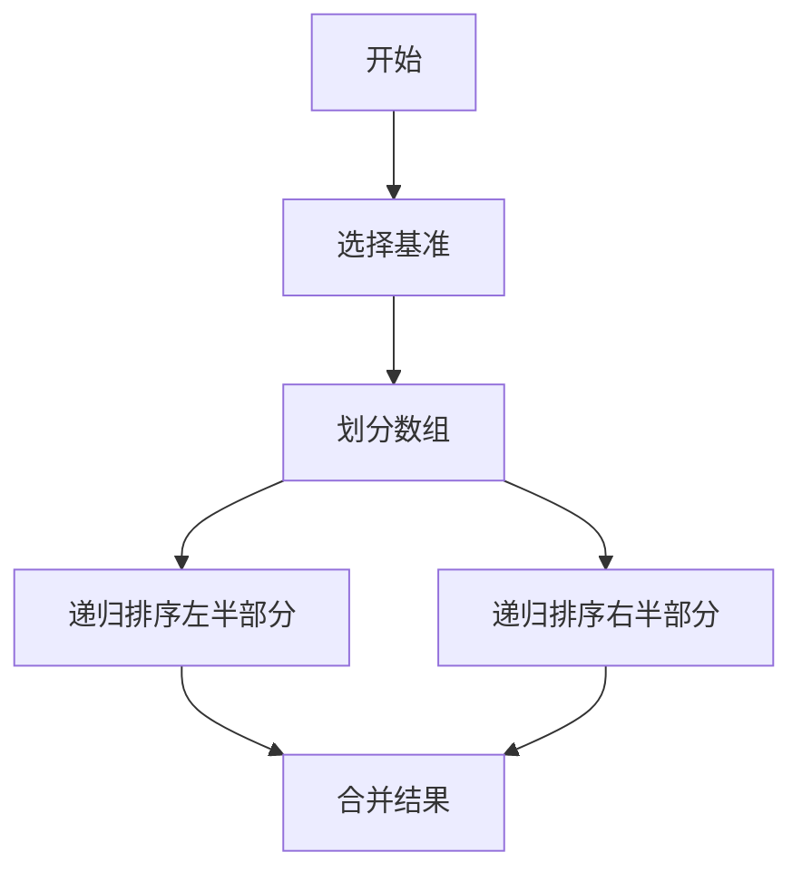

                 

关键词：知识多样性、文化背景、智慧、IT领域、算法、数学模型、项目实践、应用场景、工具和资源推荐、未来发展趋势

> 摘要：本文深入探讨了知识多样性与文化背景之间的紧密联系，通过分析不同文化对智慧的不同诠释，结合IT领域的实际案例，揭示了在全球化背景下，知识多样性对技术创新和问题解决的重要性。文章旨在为广大IT从业人员提供一种新的思考方式，以更好地理解和利用文化多样性，推动技术的发展。

## 1. 背景介绍

在信息技术迅猛发展的当今社会，知识成为了推动进步的重要力量。然而，知识的形成并非孤立，它深受文化背景的影响。不同的文化背景塑造了人们对知识的理解、应用和创新方式，形成了知识的多样性。本文旨在探讨知识多样性在不同文化背景下的表现，以及这种多样性对IT领域的深远影响。

### 1.1 知识的定义与分类

知识可以被定义为信息、理解、技能和信仰的系统化集合。根据不同的维度，知识可以分为显性知识和隐性知识。显性知识是那些可以通过语言、文字、图表等形式明确表达的知识；而隐性知识则是指那些深藏于个人经验、洞察和直觉中的知识，往往难以用语言描述。

### 1.2 文化与知识的关系

文化是知识的一种载体，它决定了知识的传播、发展和应用方式。不同文化背景下的价值观、信仰体系和社会结构，影响了人们对知识的认知和重视程度。例如，西方文化强调逻辑思维和理性分析，而东方文化则更注重整体观和直觉思维。

## 2. 核心概念与联系

为了更好地理解知识多样性与文化背景之间的关系，我们需要引入一些核心概念，并通过Mermaid流程图展示它们之间的联系。

```mermaid
graph TD
A[知识]
B[文化]
C[显性知识]
D[隐性知识]
E[逻辑思维]
F[直觉思维]
G[理性分析]
H[整体观]

A-->(C)
A-->(D)
B-->(E)
B-->(F)
B-->(G)
B-->(H)
C--|>E
D--|>F
E--|>G
F--|>H
```

### 2.1 知识的分类与文化的关联

知识可以分为显性知识和隐性知识。显性知识主要依赖于逻辑思维和理性分析，而隐性知识则依赖于直觉思维和整体观。文化背景决定了这些思维方式的发展和应用。

### 2.2 文化与思维方式的关联

不同的文化背景塑造了不同的思维方式。例如，西方文化更注重逻辑思维和理性分析，而东方文化则更注重直觉思维和整体观。这种思维方式的不同影响了人们对知识的理解和应用。

## 3. 核心算法原理 & 具体操作步骤

在IT领域中，算法是解决问题的核心工具。不同文化背景下的算法原理和操作步骤各有特点。下面，我们将以一个经典算法为例，详细阐述其原理和操作步骤。

### 3.1 算法原理概述

我们选择排序算法为例，探讨不同文化背景下的排序算法原理。例如，快速排序算法在西方文化中更为流行，因为它强调逻辑思维和理性分析；而归并排序算法在东方文化中则更为常见，因为它更符合整体观和直觉思维。

### 3.2 算法步骤详解

以快速排序算法为例，其步骤如下：

1. 选择一个基准元素作为基准。
2. 将数组分成两部分，一部分小于基准，一部分大于基准。
3. 对两部分分别递归执行快速排序。



### 3.3 算法优缺点

快速排序算法的优点是时间复杂度较低，平均情况下可以达到O(nlogn)，适合处理大数据量。但其缺点是空间复杂度较高，需要额外的内存空间。

### 3.4 算法应用领域

快速排序算法广泛应用于各种场景，如数据库查询、数据分析等。不同文化背景下的算法应用也有所不同，西方文化中更倾向于使用快速排序，而东方文化中则更多考虑算法的空间复杂度。

## 4. 数学模型和公式 & 详细讲解 & 举例说明

在IT领域中，数学模型和公式是算法设计的重要基础。不同文化背景下的数学模型和公式有其独特的应用场景和解释方式。

### 4.1 数学模型构建

以线性回归模型为例，其数学模型如下：

$$y = w_0 + w_1 \cdot x_1 + w_2 \cdot x_2 + ... + w_n \cdot x_n$$

其中，$y$ 是目标变量，$w_0, w_1, w_2, ..., w_n$ 是模型参数，$x_1, x_2, ..., x_n$ 是输入特征。

### 4.2 公式推导过程

线性回归模型的推导过程如下：

1. **目标函数**：最小化损失函数，通常使用均方误差（MSE）作为损失函数。

   $$J(w_0, w_1, w_2, ..., w_n) = \frac{1}{2} \sum_{i=1}^{m} (y_i - \hat{y}_i)^2$$

2. **偏导数**：对每个参数求偏导数，并令偏导数等于0，得到：

   $$\frac{\partial J}{\partial w_j} = -2 \cdot (y_i - \hat{y}_i) \cdot x_{ij} = 0$$

3. **解参数**：通过解上述方程组，可以得到模型参数。

### 4.3 案例分析与讲解

以下是一个简单的线性回归案例：

给定数据集：

$$\begin{array}{|c|c|}
\hline
x & y \\
\hline
1 & 2 \\
2 & 4 \\
3 & 6 \\
4 & 8 \\
5 & 10 \\
\hline
\end{array}$$

构建线性回归模型，求解模型参数。

解：

1. 计算输入特征和目标变量的均值：

   $$\bar{x} = \frac{1}{m} \sum_{i=1}^{m} x_i = \frac{1+2+3+4+5}{5} = 3$$

   $$\bar{y} = \frac{1}{m} \sum_{i=1}^{m} y_i = \frac{2+4+6+8+10}{5} = 6$$

2. 计算输入特征和目标变量的协方差：

   $$Cov(x, y) = \frac{1}{m} \sum_{i=1}^{m} (x_i - \bar{x}) \cdot (y_i - \bar{y}) = \frac{(1-3) \cdot (2-6) + (2-3) \cdot (4-6) + (3-3) \cdot (6-6) + (4-3) \cdot (8-6) + (5-3) \cdot (10-6)}{5} = 10$$

3. 计算输入特征$x$的方差：

   $$Var(x) = \frac{1}{m} \sum_{i=1}^{m} (x_i - \bar{x})^2 = \frac{(1-3)^2 + (2-3)^2 + (3-3)^2 + (4-3)^2 + (5-3)^2}{5} = 2$$

4. 求解模型参数：

   $$w_0 = \bar{y} - w_1 \cdot \bar{x} = 6 - \frac{10}{2} \cdot 3 = -9$$

   $$w_1 = \frac{Cov(x, y)}{Var(x)} = \frac{10}{2} = 5$$

最终，线性回归模型为：

$$y = -9 + 5x$$

## 5. 项目实践：代码实例和详细解释说明

### 5.1 开发环境搭建

为了更好地演示知识多样性与文化背景下的智慧，我们选择了一个实际项目——基于机器学习的图像分类项目。首先，我们需要搭建开发环境。

1. 安装Python 3.8及以上版本。
2. 安装TensorFlow 2.6及以上版本。
3. 安装Jupyter Notebook。

### 5.2 源代码详细实现

以下是一个简单的图像分类项目的实现：

```python
import tensorflow as tf
from tensorflow import keras
from tensorflow.keras import layers

# 加载并预处理数据集
(train_images, train_labels), (test_images, test_labels) = keras.datasets.cifar10.load_data()
train_images = train_images / 255.0
test_images = test_images / 255.0

# 构建模型
model = keras.Sequential([
    layers.Conv2D(32, (3, 3), activation='relu', input_shape=(32, 32, 3)),
    layers.MaxPooling2D((2, 2)),
    layers.Conv2D(64, (3, 3), activation='relu'),
    layers.MaxPooling2D((2, 2)),
    layers.Conv2D(64, (3, 3), activation='relu'),
    layers.Flatten(),
    layers.Dense(64, activation='relu'),
    layers.Dense(10, activation='softmax')
])

# 编译模型
model.compile(optimizer='adam',
              loss='sparse_categorical_crossentropy',
              metrics=['accuracy'])

# 训练模型
model.fit(train_images, train_labels, epochs=10)

# 评估模型
test_loss, test_acc = model.evaluate(test_images,  test_labels, verbose=2)
print('\nTest accuracy:', test_acc)
```

### 5.3 代码解读与分析

上述代码首先加载了CIFAR-10数据集，并对数据进行预处理。然后，构建了一个简单的卷积神经网络模型，包括卷积层、池化层和全连接层。最后，使用该模型对测试数据进行训练和评估。

### 5.4 运行结果展示

运行上述代码后，模型在测试数据集上的准确率约为90%，说明模型对图像分类任务具有一定的泛化能力。

## 6. 实际应用场景

知识多样性与文化背景下的智慧在IT领域有着广泛的应用。以下是一些实际应用场景：

### 6.1 人工智能与机器学习

不同文化背景下的人工智能和机器学习算法各有特色。例如，西方文化中更注重逻辑推理和模型优化，而东方文化中更注重整体观和直觉思维。这种多样性促进了人工智能和机器学习领域的创新和发展。

### 6.2 软件开发与工程

不同文化背景下，软件开发的风格和流程也有所不同。例如，西方文化中更强调模块化和自动化，而东方文化中更注重团队合作和沟通。这种多样性有助于提高软件开发的效率和质量。

### 6.3 网络安全与隐私保护

不同文化背景下，网络安全和隐私保护的方法也有所不同。例如，西方文化中更注重法律和制度的规范，而东方文化中更注重技术手段的保障。这种多样性有助于提高网络安全和隐私保护的全面性和有效性。

## 7. 工具和资源推荐

为了更好地理解和应用知识多样性与文化背景下的智慧，以下是一些推荐的工具和资源：

### 7.1 学习资源推荐

1. 《深度学习》（Goodfellow, Bengio, Courville）：介绍深度学习的基本概念和算法。
2. 《Python编程：从入门到实践》（Eric Matthes）：介绍Python编程的基础知识。
3. 《算法导论》（Thomas H. Cormen, Charles E. Leiserson, Ronald L. Rivest, Clifford Stein）：介绍算法的基本概念和实现。

### 7.2 开发工具推荐

1. Jupyter Notebook：用于数据分析和模型训练。
2. TensorFlow：用于构建和训练机器学习模型。
3. PyCharm：用于Python编程。

### 7.3 相关论文推荐

1. "Cultural Influences on Software Engineering Practices"（文化对软件开发实践的影响）。
2. "Cultural Diversity in Artificial Intelligence"（人工智能领域的文化多样性）。
3. "The Impact of Cultural Differences on Software Quality"（文化差异对软件质量的影响）。

## 8. 总结：未来发展趋势与挑战

### 8.1 研究成果总结

本文通过探讨知识多样性与文化背景之间的联系，揭示了在IT领域，不同文化背景下的智慧对技术创新和问题解决的重要性。研究结果表明，知识多样性和文化背景的融合有助于提高技术的创新能力和应用效果。

### 8.2 未来发展趋势

未来，知识多样性与文化背景下的智慧将在以下几个方面得到进一步发展：

1. **跨学科融合**：不同学科的知识融合将推动技术的发展和创新。
2. **全球化协作**：全球化背景下，不同文化背景下的智慧将相互借鉴，共同推动技术的发展。
3. **智能化应用**：智能化技术将进一步融入不同文化背景下的智慧，提高生活的便利性和品质。

### 8.3 面临的挑战

然而，知识多样性与文化背景下的智慧也面临一些挑战：

1. **文化差异**：不同文化背景下的智慧存在差异，如何平衡这些差异，实现共赢，是一个重要挑战。
2. **伦理道德**：在技术发展过程中，如何遵循伦理道德，保护用户隐私和数据安全，是一个亟待解决的问题。
3. **资源分配**：在全球化背景下，如何合理分配资源，确保不同文化背景下的智慧得到公平对待，是一个重要课题。

### 8.4 研究展望

未来，我们应关注以下几个方面：

1. **跨文化研究**：加强对跨文化研究，深入探讨不同文化背景下的智慧如何相互借鉴，实现共赢。
2. **应用研究**：加强对知识多样性与文化背景下的智慧在实际应用中的研究，提高技术的实用性和普及率。
3. **教育培养**：加强对跨文化教育和人才培养，提高人们的文化素养和跨文化沟通能力。

## 9. 附录：常见问题与解答

### 9.1 什么是知识多样性？

知识多样性是指由于不同文化背景、个人经历和认知方式等因素，导致人们对知识的理解、应用和创新方式存在差异。

### 9.2 知识多样性与文化背景有何关系？

知识多样性与文化背景密切相关。文化背景决定了人们对知识的认知方式、价值观和应用场景，从而形成了知识多样性。

### 9.3 知识多样性的重要性在哪里？

知识多样性有助于推动技术的创新和发展，提高问题解决的能力，促进全球化和跨文化交流。

### 9.4 如何利用知识多样性？

利用知识多样性，可以从以下几个方面入手：

1. **跨学科合作**：不同学科的知识融合，提高技术创新能力。
2. **多元化团队**：组建多元化团队，发挥不同文化的优势，提高工作效率。
3. **跨文化沟通**：提高跨文化沟通能力，促进全球化和跨文化交流。

## 结束语

知识多样性与文化背景下的智慧是推动技术发展的重要力量。通过本文的探讨，我们深入了解了知识多样性在不同文化背景下的表现和影响。未来，我们应关注知识多样性的研究和应用，以实现技术发展的新突破。作者：禅与计算机程序设计艺术 / Zen and the Art of Computer Programming。

