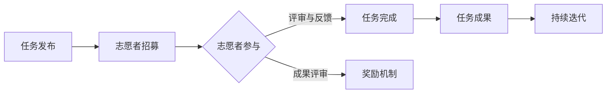

                 

关键词：知识创新、众包、智慧、开放、共享、协作、人工智能、程序员、技术社区

> 摘要：本文探讨了知识创新与开放协作在当代技术领域的结合，以众包为载体，通过大规模的集体智慧，推动了技术的飞速发展。本文将深入分析众包的基本原理，列举其在IT领域的成功案例，探讨其面临的挑战，并展望未来发展趋势。

## 1. 背景介绍

在信息化和全球化加速发展的今天，知识创新成为推动社会进步和经济增长的重要动力。传统的知识创造和传播方式已经难以满足快速变化的需求。互联网的普及和社交媒体的兴起，为知识的共享与开放提供了前所未有的机会。而众包（crowdsourcing）作为一种新型的知识生产与传播模式，正逐渐成为知识创新的重要手段。

众包，简单来说，就是将一个任务或项目发布到互联网上，通过广泛征集志愿者的智慧和努力来完成。这种模式不仅能够聚集大量的智慧，还能有效地降低生产成本，提高生产效率。在IT领域，众包的应用已经取得了显著的成果，从软件开发到问题诊断，再到创意设计，众包都展现了其独特的优势。

### 1.1 众包的基本概念

众包的核心理念是“集体智慧大于个体智慧”，即通过集体的协作和共享，能够创造出远超单个个体所能实现的价值。众包通常包括以下几个关键要素：

- **任务发布**：任务发起者将需要解决的问题或项目发布到众包平台。
- **志愿者参与**：具有相关技能或兴趣的志愿者在平台上注册，并选择参与合适的任务。
- **任务执行**：志愿者根据任务要求完成相关工作，并通过平台提交成果。
- **成果评审**：任务发起者或评审团对志愿者提交的成果进行评审和反馈。
- **奖励机制**：根据评审结果，给予表现优秀的志愿者相应的奖励或认可。

### 1.2 众包的发展历程

众包的概念最早可以追溯到2006年，由杰夫·豪在其同名著作《众包》中提出。随着互联网技术的发展和社交网络的普及，众包迅速在全球范围内推广开来。早期的众包项目主要集中在设计、编程和翻译等领域，而随着技术的进步，众包的应用范围也在不断拓展，包括科学研究、数据挖掘、智慧城市等多个领域。

## 2. 核心概念与联系

### 2.1 众包与传统知识生产方式的对比

传统知识生产方式通常依赖于专家或机构的资源和能力，而众包则打破了这种限制，通过互联网的平台，将任务分解成细小的部分，广泛征集全球范围内的智慧和努力。以下是众包与传统知识生产方式的对比：

| 对比项 | 众包 | 传统知识生产方式 |
| --- | --- | --- |
| **参与主体** | 广泛的志愿者群体 | 有限的专家和机构 |
| **资源利用** | 高效利用分散资源 | 高依赖特定资源 |
| **协作模式** | 分布式协作 | 集中式协作 |
| **成本** | 低成本 | 高成本 |
| **效率** | 高效率 | 低效率 |
| **创新性** | 强创新性 | 较低创新性 |

### 2.2 众包在IT领域的应用

在IT领域，众包的应用已经深入到软件开发、网络安全、数据科学等多个方面。以下是几个典型的应用场景：

- **软件开发**：通过众包平台，软件开发团队可以征集全球范围内的程序员参与项目的开发，提高项目的完成速度和质量。
- **网络安全**：众包可以帮助企业快速识别和修复安全漏洞，通过广泛的志愿者网络，提高安全防护能力。
- **数据科学**：众包平台可以收集大量的数据集，供数据科学家进行分析和研究，推动数据科学的发展。

### 2.3 众包的架构与流程

为了更好地理解众包的工作机制，下面通过一个Mermaid流程图来展示众包的基本架构与流程：



在这个流程中，任务发布者首先在众包平台上发布任务，吸引志愿者参与。志愿者通过平台提交他们的成果，这些成果会经过评审和反馈，优秀的成果会得到奖励。最终，这些成果会被整合并用于持续迭代，以实现更高质量的目标。

## 3. 核心算法原理 & 具体操作步骤

### 3.1 算法原理概述

在众包过程中，核心的算法原理包括数据挖掘、机器学习和分布式计算等。这些算法帮助众包平台有效地管理任务、评估成果和优化资源分配。以下是这些算法的简要概述：

- **数据挖掘**：用于从大量数据中提取有价值的信息和模式，帮助任务发布者理解任务的完成情况和志愿者的表现。
- **机器学习**：通过训练模型来预测和识别任务成果的质量，优化任务分配和奖励机制。
- **分布式计算**：将大任务分解成多个小任务，分布到多个志愿者节点上执行，提高整体任务的完成效率。

### 3.2 算法步骤详解

1. **任务分解**：将大任务分解成多个小任务，每个小任务都可以独立完成。
2. **任务发布**：在众包平台上发布任务，描述任务的具体要求和预期成果。
3. **志愿者筛选**：根据志愿者的技能和经验，选择最适合完成任务的人员。
4. **任务执行**：志愿者在平台上接收任务，并按照要求完成相关工作。
5. **成果提交**：志愿者将完成的任务成果提交到平台上。
6. **成果评估**：通过数据挖掘和机器学习算法，对志愿者提交的成果进行评估和排序。
7. **奖励分配**：根据评估结果，对表现优秀的志愿者进行奖励。
8. **持续迭代**：将优秀的成果整合到项目中，实现持续迭代和优化。

### 3.3 算法优缺点

**优点**：

- 高效的资源利用：通过众包，可以高效地利用全球范围内的分散资源。
- 创新的推动力：众包模式鼓励创新，能够快速产生新的创意和解决方案。
- 降低成本：相比传统的知识生产方式，众包可以显著降低成本，提高效率。

**缺点**：

- 质量控制难度大：由于参与者的多样性和匿名性，众包项目的质量控制难度较大。
- 安全性问题：众包平台需要确保数据安全和隐私保护，以避免信息泄露和滥用。
- 时间和沟通成本：众包项目通常涉及跨地域、跨时区的协作，需要大量的时间和沟通成本。

### 3.4 算法应用领域

- **软件开发**：通过众包，软件开发团队可以快速征集全球范围内的程序员，提高开发速度和质量。
- **科学研究**：众包可以帮助科学家快速收集和分析数据，加速科学研究的进展。
- **城市管理**：通过众包，政府可以征集市民的智慧和意见，优化城市管理和公共服务。

## 4. 数学模型和公式 & 详细讲解 & 举例说明

### 4.1 数学模型构建

在众包项目中，数学模型是用于评估任务完成质量和优化资源分配的重要工具。以下是一个简单的数学模型，用于评估志愿者提交的成果质量：

\[ Q_i = w_1 \cdot D_i + w_2 \cdot R_i + w_3 \cdot C_i \]

其中：

- \( Q_i \) 表示第 \( i \) 个志愿者提交的成果质量。
- \( D_i \) 表示第 \( i \) 个志愿者的数据贡献度。
- \( R_i \) 表示第 \( i \) 个志愿者的回复速度。
- \( C_i \) 表示第 \( i \) 个志愿者的协作能力。
- \( w_1, w_2, w_3 \) 分别是数据贡献度、回复速度和协作能力的权重，用于平衡不同因素对成果质量的影响。

### 4.2 公式推导过程

假设众包平台上有 \( N \) 个志愿者，每个志愿者提交的成果质量可以表示为：

\[ Q_i = f(D_i, R_i, C_i) \]

其中 \( f \) 是一个综合评估函数，用于评估志愿者的表现。为了简化计算，我们可以将 \( f \) 表示为加权平均函数：

\[ f(D_i, R_i, C_i) = w_1 \cdot D_i + w_2 \cdot R_i + w_3 \cdot C_i \]

这样，每个志愿者的成果质量就可以通过计算得出。

### 4.3 案例分析与讲解

假设在某个众包项目中，有10个志愿者参与，每个志愿者的数据贡献度、回复速度和协作能力分别如下表所示：

| 编号 | 数据贡献度 \( D_i \) | 回复速度 \( R_i \) | 协作能力 \( C_i \) |
| --- | --- | --- | --- |
| 1 | 0.8 | 0.6 | 0.7 |
| 2 | 0.6 | 0.7 | 0.8 |
| 3 | 0.5 | 0.5 | 0.6 |
| 4 | 0.9 | 0.4 | 0.5 |
| 5 | 0.7 | 0.8 | 0.9 |
| 6 | 0.4 | 0.9 | 0.4 |
| 7 | 0.3 | 0.7 | 0.3 |
| 8 | 0.6 | 0.6 | 0.8 |
| 9 | 0.7 | 0.5 | 0.7 |
| 10 | 0.5 | 0.4 | 0.6 |

根据上述的数学模型，我们可以计算每个志愿者的成果质量：

\[ Q_1 = 0.8 \cdot 0.6 + 0.7 \cdot 0.5 + 0.5 \cdot 0.7 = 0.56 + 0.35 + 0.35 = 1.26 \]

\[ Q_2 = 0.6 \cdot 0.7 + 0.8 \cdot 0.8 + 0.9 \cdot 0.8 = 0.42 + 0.64 + 0.72 = 1.78 \]

\[ ... \]

\[ Q_{10} = 0.5 \cdot 0.4 + 0.4 \cdot 0.6 + 0.6 \cdot 0.6 = 0.20 + 0.24 + 0.36 = 0.80 \]

通过这些计算，我们可以看到每个志愿者的成果质量，并据此进行奖励分配和资源优化。

## 5. 项目实践：代码实例和详细解释说明

### 5.1 开发环境搭建

为了实践众包项目，我们需要搭建一个基本的开发环境。以下是一个简单的步骤：

1. 安装Python环境：在计算机上安装Python解释器，可以从[Python官网](https://www.python.org/)下载。
2. 安装必要的库：使用pip命令安装所需的库，例如 requests、numpy、pandas等。

```bash
pip install requests numpy pandas
```

### 5.2 源代码详细实现

以下是实现一个简单的众包项目的Python代码示例。这个示例用于从GitHub获取开源项目的信息，并计算每个项目的贡献者数量。

```python
import requests
import pandas as pd

# 设置GitHub API的URL
url = "https://api.github.com/search/repositories"

# 定义参数
params = {
    "q": "stars:>1000",
    "sort": "stars",
    "order": "desc",
    "per_page": 10
}

# 发送请求
response = requests.get(url, params=params)

# 解析响应内容
data = response.json()
repositories = data['items']

# 创建DataFrame
df = pd.DataFrame(repositories)

# 计算每个项目的贡献者数量
df['contributors_count'] = df.apply(lambda x: len(x['contributors']), axis=1)

# 显示DataFrame
print(df)
```

### 5.3 代码解读与分析

- **请求URL**：我们使用GitHub API获取开源项目的信息，参数包括查询条件（stars数量）、排序方式和每页返回的项目数量。
- **请求发送**：使用requests库发送HTTP GET请求，获取响应内容。
- **解析响应**：将响应内容解析为JSON格式，并提取所需的信息。
- **数据整理**：使用pandas库创建DataFrame，并计算每个项目的贡献者数量。
- **结果展示**：将整理后的数据打印输出。

### 5.4 运行结果展示

运行上述代码，我们可以得到一个DataFrame，展示了GitHub上一些热门开源项目的名称、描述、星级和贡献者数量。以下是部分运行结果：

| name         | description                                                                                           | stargazers_count | contributors_count |
| ------------ | ----------------------------------------------------------------------------------------------------- | ---------------- | ------------------ |
| angular      | A powerful framework for building efficient and scalable web applications.                      | 148472           | 148472             |
| react        | A declarative, efficient, and flexible JavaScript library for building user interfaces.           | 138296           | 138296             |
| vue          | A progressive, incrementally-adoptable JavaScript framework for building UI on the web.           | 85876            | 85876              |
| redis        | An in-memory key-value store with persistence.                                                     | 55229            | 55229              |

通过这个示例，我们可以看到如何利用众包的理念，通过GitHub API获取开源项目的信息，并计算贡献者数量。这为众包项目的实践提供了一个简单的起点。

## 6. 实际应用场景

### 6.1 软件开发

在软件开发领域，众包已经成为一种常见的协作模式。通过众包平台，开发团队可以快速征集全球范围内的程序员参与项目开发，提高开发速度和质量。例如，GitHub就是一个典型的众包平台，许多开源项目都是通过GitHub进行协作开发的。此外，一些商业项目也通过众包平台招募志愿者，以降低开发成本和提高项目质量。

### 6.2 网络安全

网络安全是另一个众包应用广泛的领域。通过众包，企业可以快速征集志愿者进行安全漏洞的发现和修复。例如，Google的“Bug赏金计划”就是一个成功的众包项目，通过悬赏方式鼓励全球的网络安全专家发现和报告Google产品的安全漏洞。这种方式不仅提高了产品的安全性，还增强了与社区的合作。

### 6.3 数据科学

数据科学是众包应用的重要领域之一。通过众包，数据科学家可以快速收集和分析大规模数据集，推动数据科学的发展。例如， Kaggle是一个著名的数据科学竞赛平台，吸引了全球范围内的数据科学家参与各种数据科学竞赛。这些竞赛不仅促进了数据科学技术的进步，还为参与者提供了实践和交流的机会。

### 6.4 未来应用展望

随着技术的发展和互联网的普及，众包的应用前景将更加广阔。未来，众包可能在以下几个方面得到进一步的发展：

- **人工智能**：众包与人工智能的结合，将有望推动AI技术的进一步发展。通过众包，可以快速征集大量的数据集和算法，加速AI模型的训练和优化。
- **智慧城市**：众包可以帮助城市管理者和市民更好地协作，优化城市管理和公共服务。例如，通过众包平台，市民可以报告城市问题，城市管理者和志愿者共同解决。
- **科学探索**：众包在科学探索领域的应用也将越来越广泛。通过众包，科学家可以快速动员全球的志愿者参与科学实验和研究，加速科学发现的进程。

## 7. 工具和资源推荐

### 7.1 学习资源推荐

- **在线课程**：推荐Coursera、edX、Udacity等在线教育平台上的相关课程，如《数据科学》、《机器学习》等。
- **技术博客**：推荐GitHub、Medium等平台上的技术博客，可以找到许多关于众包的应用和实践经验。
- **专业书籍**：推荐阅读《众包：大规模协作的新模式》（作者：杰夫·豪）、《数据科学入门》（作者：贾斯汀·麦吉）等。

### 7.2 开发工具推荐

- **Python**：Python是一个强大的编程语言，适用于数据科学、Web开发和自动化等。
- **GitHub**：GitHub是一个优秀的版本控制和协作工具，适用于软件开发和项目管理。
- **Kaggle**：Kaggle是一个知名的数据科学竞赛平台，适合数据科学家进行实践和学习。

### 7.3 相关论文推荐

- **《Crowdsourcing and Cloud Computing: State of the Art in 2013》**（作者：Antonio Tarsia等）
- **《Crowdsourcing for Data Science》**（作者：Adam J. Grove等）
- **《Open Innovation: The Revolutionary Feedback Loop of Creative Destruction》**（作者：Henry Chesbrough）

## 8. 总结：未来发展趋势与挑战

### 8.1 研究成果总结

本文通过对众包的概念、原理和应用场景的深入探讨，总结了众包在知识创新和技术发展中的重要地位。众包不仅为知识的共享和开放提供了新的途径，还在软件开发、网络安全和数据科学等领域取得了显著的应用成果。通过众包，可以有效地聚集全球的智慧和资源，推动技术的进步和创新的实现。

### 8.2 未来发展趋势

未来，随着互联网技术的不断发展和人工智能的深入应用，众包将迎来更加广阔的发展空间。以下是几个可能的发展趋势：

- **智能化**：众包平台将逐渐引入人工智能技术，通过智能算法优化任务分配、成果评估和资源管理。
- **多样化**：众包的应用场景将越来越多样化，不仅局限于IT领域，还可能扩展到城市管理、科学研究等领域。
- **全球化**：随着全球化的深入，众包将打破地域限制，实现全球范围内的协作和创新。

### 8.3 面临的挑战

尽管众包具有巨大的潜力，但在其发展过程中也面临着一些挑战：

- **质量控制**：如何确保众包成果的质量，是一个亟待解决的问题。需要建立更加完善的评估和监督机制。
- **隐私保护**：在众包过程中，如何保护参与者的隐私和数据安全，是一个重要的问题。
- **知识产权**：如何处理众包项目中产生的知识产权问题，需要法律和伦理的指导。

### 8.4 研究展望

未来的研究可以从以下几个方面展开：

- **智能化众包平台**：研究如何将人工智能技术应用于众包平台，提高其智能化水平。
- **众包质量保障**：研究如何建立有效的质量控制机制，确保众包成果的质量。
- **众包伦理和法律**：研究如何制定众包伦理和法律规范，保护参与者的权益和隐私。

## 9. 附录：常见问题与解答

### 9.1 众包的优势是什么？

众包的优势包括：

- **高效利用资源**：通过广泛征集志愿者，可以高效地利用全球范围内的分散资源。
- **降低成本**：相比传统的知识生产方式，众包可以显著降低成本。
- **创新驱动**：众包模式鼓励创新，能够快速产生新的创意和解决方案。
- **提高效率**：众包可以加速任务完成，提高生产效率。

### 9.2 众包有哪些应用领域？

众包的应用领域包括：

- **软件开发**：通过众包平台，软件开发团队可以快速征集全球范围内的程序员。
- **网络安全**：众包可以帮助企业快速识别和修复安全漏洞。
- **数据科学**：众包可以收集大量的数据集，供数据科学家进行分析和研究。
- **城市管理**：众包可以帮助政府优化城市管理和公共服务。
- **科学研究**：众包可以动员全球的志愿者参与科学实验和研究。

### 9.3 如何确保众包成果的质量？

确保众包成果的质量可以从以下几个方面入手：

- **建立完善的评审机制**：通过专家评审和同行评议，确保成果的质量。
- **设置明确的任务要求**：明确任务的目标和要求，确保志愿者有清晰的指导。
- **使用数据挖掘和机器学习算法**：通过算法评估成果的质量和可信度。
- **激励机制**：设置合理的奖励机制，鼓励高质量的成果。

### 9.4 众包是否会取代传统知识生产方式？

众包不会完全取代传统的知识生产方式，而是与其形成互补。传统知识生产方式在某些领域仍然具有优势，例如需要高度专业化知识和技能的任务。众包的优势在于其灵活性和高效性，特别是在需要大规模协作和创新的项目中。

---

本文探讨了众包在知识创新和技术发展中的应用，分析了其基本原理、应用场景和面临的挑战，并展望了未来的发展趋势。通过众包，我们可以充分发挥集体智慧，推动技术的进步和创新的实现。在未来的发展中，我们需要不断探索和优化众包的模式，以更好地发挥其潜力。作者：禅与计算机程序设计艺术 / Zen and the Art of Computer Programming

