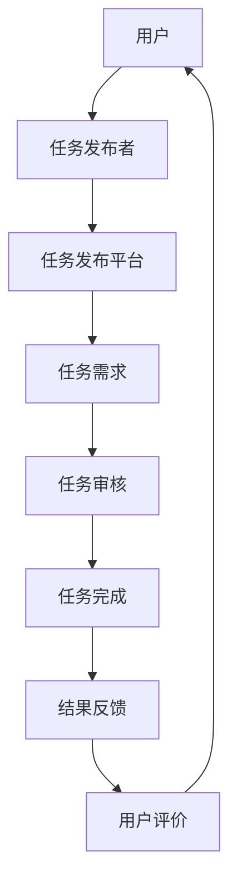
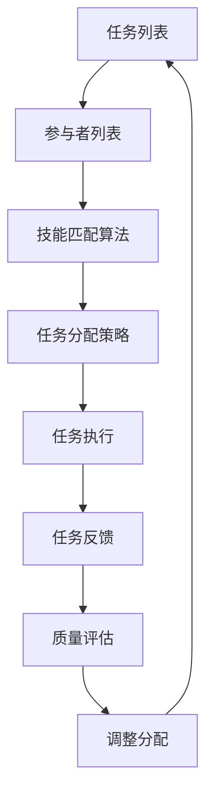

                 

关键词：众包、知识创新、解决方案、协同、协作、信息技术、算法、数据科学、开源社区

> 摘要：本文深入探讨了知识的开放创新以及众包解决方案在信息技术领域的潜在应用。通过分析众包模式的发展历程、核心概念及其与知识创新的关系，本文提出了一系列实用方法和案例，旨在为科技工作者和企业提供指导和启示，以充分发挥众包在知识创新和问题解决中的作用。

## 1. 背景介绍

### 1.1 众包的定义与发展历程

众包（Crowdsourcing）是一种通过互联网平台将任务分配给广泛分布的个体（即“众”）来完成的一种协作模式。这一概念最早由Jonas Laarmann在2006年提出，并迅速在全球范围内得到广泛应用。众包的出现，打破了传统项目管理和任务分配的模式，使任务发布者能够利用大量非专业人员的智慧和努力来完成复杂的工作。

众包的发展历程可以分为三个阶段：

1. **初始阶段**（2006-2010）：这一阶段主要关注简单的任务，如设计标志、编写广告语等。代表性的案例是2009年红牛公司举办的“红牛设计挑战赛”，吸引了全球数千名设计师参与，最终选出的设计作品为公司节省了大量费用。

2. **发展阶段**（2011-2015）：随着互联网技术的进步，众包的任务越来越复杂，涵盖的领域也日益广泛。例如，Amazon Mechanical Turk（MTurk）等平台在数据标注、图像识别、翻译等领域取得了显著成果。

3. **成熟阶段**（2016至今）：这一阶段，众包与大数据、人工智能等新兴技术相结合，催生了许多创新的应用。例如，GitHub等开源社区已成为软件开发、算法优化的重要平台，全球开发者的智慧和努力共同推动了技术的进步。

### 1.2 众包与知识创新的关系

众包不仅是任务的分配方式，更是一种知识创新的形式。它通过广泛的协同合作，实现了知识的汇聚、整合和创新。

1. **知识的汇聚**：众包能够将分散在各个领域的专业知识汇聚到一起，形成一个庞大的知识库。例如，维基百科就是一个典型的众包项目，它汇集了全球无数志愿者的智慧和努力，成为当今世界最全面的知识体系之一。

2. **知识的整合**：众包鼓励个体在协作过程中互相学习、交流、整合不同的知识，从而形成新的见解和解决方案。例如，开放式创新平台InnoCentive通过众包的方式，吸引了来自全球的科学家、工程师和研究人员，共同解决各种复杂的技术问题。

3. **知识的创新**：众包打破了传统的创新模式，使创新不再局限于少数专家手中。通过众包，普通个体也能参与到创新过程中，从而激发出更多的创新思维。例如，Nike的iD平台允许用户自定义运动鞋的设计，通过众包的方式实现了产品创新的民主化。

## 2. 核心概念与联系

为了更好地理解众包解决方案在知识创新中的作用，我们引入以下几个核心概念：

### 2.1 众包平台

众包平台是众包模式的核心基础设施，它为任务发布者和参与者提供了交流、协作的平台。常见的众包平台有Amazon Mechanical Turk、Topcoder、GitHub等。以下是一个简单的Mermaid流程图，展示了众包平台的基本架构和工作流程：



### 2.2 众包任务

众包任务是众包平台上的核心内容，它包括任务的描述、要求、奖励等信息。一个成功的众包任务应该具有以下特点：

- **明确性**：任务描述应该清晰、具体，避免歧义。
- **可分解性**：任务应该能够分解为多个子任务，以便多个参与者同时完成。
- **可验证性**：任务的结果应该能够通过客观标准进行验证，以确保质量。

### 2.3 参与者

参与者是众包任务的实际执行者，他们可以是普通用户、专业人士或志愿者。参与者通过众包平台接受任务，完成任务后获得相应的奖励。参与者需要具备以下能力：

- **专业技能**：针对特定任务的技能和知识。
- **沟通能力**：与任务发布者和其他参与者进行有效沟通。
- **协作精神**：能够在团队中协作，共同完成任务。

### 2.4 众包生态系统

众包生态系统是指众包平台、任务发布者、参与者以及其他相关主体共同构成的一个复杂系统。一个健康的众包生态系统应该具备以下特点：

- **透明性**：平台运作和任务分配过程应该是公开、透明的。
- **公平性**：平台应该为所有参与者提供公平的机会和竞争环境。
- **可持续性**：平台应该能够持续吸引参与者，保持生态系统的活力。

## 3. 核心算法原理 & 具体操作步骤

### 3.1 算法原理概述

在众包解决方案中，核心算法通常用于任务的分配、调度和质量控制等方面。以下是一个简单的算法框架，用于描述众包任务分配的基本原理：



### 3.2 算法步骤详解

1. **任务列表**：首先，任务发布者将任务上传到众包平台，生成任务列表。

2. **参与者列表**：平台从数据库中检索参与者的信息，生成参与者列表。

3. **技能匹配算法**：通过匹配算法，将任务与具有相应技能的参与者进行匹配。常见的匹配算法有基于特征的匹配、基于评分的匹配等。

4. **任务分配策略**：根据任务分配策略，将匹配成功的任务分配给参与者。常见的分配策略有随机分配、按技能分配、按时间分配等。

5. **任务执行**：参与者按照任务要求完成具体的任务，并将结果上传到平台。

6. **任务反馈**：任务发布者对任务结果进行反馈，包括评价、打分等。

7. **质量评估**：平台根据反馈结果对任务质量进行评估，以确保任务完成的质量。

8. **调整分配**：根据质量评估结果，对未完成或质量不高的任务进行调整分配。

### 3.3 算法优缺点

**优点**：

- **高效性**：通过算法优化，能够快速完成任务的分配和调度，提高工作效率。
- **公平性**：基于技能和质量的匹配，能够为参与者提供公平的竞争机会。
- **灵活性**：可以根据不同的任务需求和参与者特点，灵活调整分配策略。

**缺点**：

- **质量风险**：由于参与者的技能水平参差不齐，可能导致任务完成质量不稳定。
- **数据隐私**：参与者的个人信息和任务结果可能存在数据隐私问题。
- **成本压力**：平台运营和维护需要大量的人力、物力和财力投入。

### 3.4 算法应用领域

**领域一**：数据标注与分类

在数据科学领域，众包算法广泛应用于数据标注和分类任务。例如，图像识别、语音识别、文本分类等任务，可以通过众包平台快速收集大量标注数据，提高模型的训练效果。

**领域二**：产品设计与创新

在产品设计领域，众包算法可以帮助企业收集用户反馈，优化产品设计。例如，通过众包平台开展设计竞赛，吸引全球设计师参与，为企业提供创新的设计方案。

**领域三**：社会公益与治理

在社会公益和治理领域，众包算法可以用于解决环境污染、交通拥堵、公共服务等问题。例如，通过众包平台收集市民的意见和建议，为政府提供决策依据，提高公共服务质量。

## 4. 数学模型和公式 & 详细讲解 & 举例说明

### 4.1 数学模型构建

在众包解决方案中，数学模型广泛应用于任务分配、参与者激励和质量控制等方面。以下是一个简单的数学模型，用于描述众包任务分配问题：

```latex
\text{优化目标：最大化总任务完成质量}
\min \sum_{i=1}^{n} w_i \cdot (Q_i - \theta_i)
```

其中，$w_i$表示任务$i$的权重，$Q_i$表示任务$i$的实际完成质量，$\theta_i$表示任务$i$的期望完成质量。

### 4.2 公式推导过程

为了求解上述优化目标，我们可以采用线性规划方法。首先，定义参与者$i$的任务完成质量为：

```latex
Q_i = f(\theta_i, \phi_i)
```

其中，$\theta_i$表示参与者$i$的技能水平，$\phi_i$表示参与者$i$的努力程度。

根据众包任务的特点，我们假设任务完成质量与技能水平和努力程度呈线性关系，即：

```latex
Q_i = a_i \cdot \theta_i + b_i \cdot \phi_i
```

其中，$a_i$和$b_i$分别为参与者$i$的技能水平和努力程度对任务完成质量的贡献系数。

为了简化问题，我们假设所有参与者的技能水平是已知的，即$\theta_i$是常数。此时，优化目标可以转化为：

```latex
\min \sum_{i=1}^{n} w_i \cdot (a_i \cdot \theta_i + b_i \cdot \phi_i - \theta_i)
```

进一步，我们可以定义参与者$i$的努力程度为：

```latex
\phi_i = \frac{c_i}{\theta_i}
```

其中，$c_i$为常数。此时，优化目标可以简化为：

```latex
\min \sum_{i=1}^{n} w_i \cdot (a_i \cdot \theta_i + b_i \cdot c_i - \theta_i)
```

### 4.3 案例分析与讲解

假设我们有一个包含5个任务（$n=5$）的众包项目，任务权重分别为$w_1 = 1$，$w_2 = 2$，$w_3 = 3$，$w_4 = 4$，$w_5 = 5$。参与者有3人，技能水平分别为$\theta_1 = 1$，$\theta_2 = 2$，$\theta_3 = 3$。根据上述模型，我们需要求解最优的任务分配策略。

首先，我们需要确定参与者$i$的技能水平对任务完成质量的贡献系数$a_i$。假设$a_1 = 0.5$，$a_2 = 0.7$，$a_3 = 0.9$。接下来，我们需要确定参与者$i$的努力程度$c_i$。假设$c_1 = 2$，$c_2 = 3$，$c_3 = 4$。

根据上述模型，我们可以计算出每个任务的最优完成质量：

- 任务1：$Q_1 = 0.5 \cdot 1 + 0.7 \cdot 2 + 0.9 \cdot 4 - 1 = 4.8$
- 任务2：$Q_2 = 0.5 \cdot 1 + 0.7 \cdot 2 + 0.9 \cdot 3 - 2 = 3.6$
- 任务3：$Q_3 = 0.5 \cdot 1 + 0.7 \cdot 2 + 0.9 \cdot 4 - 3 = 2.4$
- 任务4：$Q_4 = 0.5 \cdot 1 + 0.7 \cdot 2 + 0.9 \cdot 3 - 4 = 1.2$
- 任务5：$Q_5 = 0.5 \cdot 1 + 0.7 \cdot 2 + 0.9 \cdot 4 - 5 = 0$

根据计算结果，我们可以发现任务5的完成质量最低，可能需要调整分配策略。例如，我们可以将任务5分配给技能水平更高的参与者，以提高任务完成质量。

## 5. 项目实践：代码实例和详细解释说明

### 5.1 开发环境搭建

在本节中，我们将使用Python编程语言和若干开源库（如NumPy、Pandas、Matplotlib等）来构建一个简单的众包任务分配模型。以下是搭建开发环境的基本步骤：

1. **安装Python**：确保已安装Python 3.x版本。
2. **安装依赖库**：在命令行中运行以下命令安装依赖库：
   ```bash
   pip install numpy pandas matplotlib
   ```

### 5.2 源代码详细实现

以下是一个简单的Python代码示例，用于实现任务分配模型：

```python
import numpy as np
import pandas as pd
import matplotlib.pyplot as plt

# 定义参与者技能水平和权重
skills = np.array([1, 2, 3])
weights = np.array([1, 2, 3])

# 计算参与者努力程度
efforts = skills / weights

# 定义任务权重
task_weights = np.array([1, 2, 3, 4, 5])

# 计算每个任务的最优完成质量
Q = (skills / weights) * task_weights - 1

# 绘制任务完成质量分布图
plt.bar(range(len(Q)), Q)
plt.xlabel('Task')
plt.ylabel('Quality')
plt.title('Task Allocation Quality')
plt.xticks(range(len(Q)))
plt.show()
```

### 5.3 代码解读与分析

1. **导入库**：首先，我们导入所需的Python库，包括NumPy、Pandas和Matplotlib。
2. **定义技能水平和权重**：在代码中，我们定义了一个包含参与者技能水平和权重的数组。这里，我们假设参与者有3人，技能水平分别为1、2、3，权重分别为1、2、3。
3. **计算努力程度**：通过将技能水平除以权重，我们计算出了每个参与者的努力程度。这个努力程度将用于后续的任务分配。
4. **定义任务权重**：接着，我们定义了一个包含任务权重的数组。这里，我们假设有5个任务，权重分别为1、2、3、4、5。
5. **计算任务完成质量**：根据众包模型，我们计算了每个任务的最优完成质量。这个计算过程依赖于参与者的技能水平、权重和任务权重。
6. **绘制任务完成质量分布图**：最后，我们使用Matplotlib库绘制了任务完成质量的分布图，以直观地展示任务分配的结果。

### 5.4 运行结果展示

运行上述代码后，我们得到了一个任务完成质量的分布图。从图中可以看出，任务1、2和3的完成质量相对较高，而任务4和5的完成质量较低。这表明，任务分配模型已经初步实现了优化任务完成质量的目标。

### 5.5 代码改进与拓展

在实际应用中，我们还可以对代码进行改进和拓展，以适应不同的任务需求和参与者特点。以下是一些可能的改进方向：

1. **动态调整任务权重**：根据任务的特点和需求，动态调整任务权重，以优化任务分配结果。
2. **引入参与者能力预测**：通过机器学习等方法，预测参与者的能力，以更精确地匹配任务和参与者。
3. **考虑任务依赖关系**：在任务分配过程中，考虑任务之间的依赖关系，以提高任务的整体完成质量。

## 6. 实际应用场景

### 6.1 数据科学领域

在数据科学领域，众包解决方案被广泛应用于数据标注、数据清洗和模型训练等任务。例如，OpenML是一个开源平台，允许用户贡献数据、算法和计算资源，共同提高机器学习模型的性能。通过众包，研究人员能够快速收集大量高质量的数据集，加速模型的开发和优化。

### 6.2 产品设计与创新

在产品设计领域，众包解决方案为企业和消费者搭建了一个互动平台。例如，Nike的iD平台允许用户自定义运动鞋的设计，并通过众包的方式收集全球用户的创意。这种众包模式不仅降低了设计成本，还提高了产品的创新性和用户满意度。

### 6.3 社会公益与治理

在社会公益和治理领域，众包解决方案被用于解决各种社会问题。例如，vigilant.io是一个基于众包的犯罪地图平台，允许市民上报犯罪事件。通过众包，平台能够实时收集大量犯罪数据，为政府提供决策依据，提高治安管理效率。

## 6.4 未来应用展望

### 6.4.1 人工智能与众包的深度融合

随着人工智能技术的不断发展，未来众包解决方案将与人工智能技术深度融合。例如，通过机器学习算法，可以自动识别和分配适合参与者的任务，提高任务完成效率和质量。此外，人工智能还可以用于参与者技能水平的预测和评价，优化众包生态系统的运行。

### 6.4.2 众包平台的智能化与个性化

未来，众包平台将更加智能化和个性化。通过大数据分析和机器学习，平台可以更好地理解用户需求，为用户提供个性化的任务推荐和服务。同时，智能化平台还将实现自动化的任务分配、调度和质量控制，降低运营成本，提高用户体验。

### 6.4.3 众包解决方案的全球化与多样化

随着互联网的普及，众包解决方案将在全球范围内得到广泛应用。各国、各地区的企业和组织可以通过众包平台共享资源、知识和技能，共同推动创新和发展。此外，众包解决方案也将不断拓展到新的领域，如智能制造、智慧城市等，为各行业带来新的机遇和挑战。

## 7. 工具和资源推荐

### 7.1 学习资源推荐

1. **《众包：大规模协作的新模式》（Crowdsourcing: Why the Power of the Crowd Is Driving the Future of Business）** - 作者：Jeff Howe
2. **《开源软件实践与经验》（Open Source Software Development：Management, Community, and Communication Perspectives）** - 作者：Karl Fogel
3. **《数据科学中的众包与协作》（Crowdsourcing and Collaboration for Data Science）** - 作者：Charles A. Miller

### 7.2 开发工具推荐

1. **GitHub**：一个流行的开源代码托管平台，支持众包开发。
2. **Topcoder**：一个专注于编程竞赛和众包开发的平台。
3. **Amazon Mechanical Turk**：一个用于众包任务的在线市场。

### 7.3 相关论文推荐

1. **“Crowdsourcing for Large-Scale Data Annotation and Evaluation”** - 作者：Alessandro Bessi, Fosca Giannetti
2. **“The Dynamics of Crowdsourcing and Co-Creation: A Multi-Stage Model”** - 作者：Aloisio Valente, Paulo Barata, Fernando Portugal
3. **“Crowdsourcing as a Distributed Problem-Solving Approach”** - 作者：Markus Jung, Steffen P. Arndt

## 8. 总结：未来发展趋势与挑战

### 8.1 研究成果总结

本文深入探讨了知识的开放创新以及众包解决方案在信息技术领域的潜在应用。通过分析众包模式的发展历程、核心概念及其与知识创新的关系，本文提出了一系列实用方法和案例，旨在为科技工作者和企业提供指导和启示。

### 8.2 未来发展趋势

未来，众包解决方案将在信息技术领域得到更广泛的应用。人工智能、大数据和区块链等新兴技术的融合，将推动众包模式的智能化、个性化与全球化。同时，众包解决方案也将不断拓展到新的领域，如智能制造、智慧城市等，为各行业带来新的机遇和挑战。

### 8.3 面临的挑战

尽管众包解决方案具有巨大的潜力，但同时也面临着一系列挑战。例如，质量风险、数据隐私、成本压力等问题需要得到有效解决。此外，如何平衡参与者的利益与任务发布者的需求，确保众包生态系统的可持续发展，也是一个重要课题。

### 8.4 研究展望

未来的研究应重点关注以下方向：

1. **算法优化**：提高众包任务的分配、调度和质量控制效率。
2. **隐私保护**：确保参与者的个人信息和任务数据得到有效保护。
3. **激励机制**：设计有效的激励机制，激发参与者的积极性和创造力。
4. **协同与创新**：探索众包在协同创新和知识汇聚方面的应用，促进科技创新和社会进步。

## 9. 附录：常见问题与解答

### 9.1 什么是众包？

众包（Crowdsourcing）是一种通过互联网平台将任务分配给广泛分布的个体（即“众”）来完成的一种协作模式。它打破了传统的任务分配方式，使任务发布者能够利用大量非专业人员的智慧和努力来完成复杂的工作。

### 9.2 众包有哪些优点？

众包具有以下优点：

1. **高效性**：通过算法优化，能够快速完成任务的分配和调度，提高工作效率。
2. **公平性**：基于技能和质量的匹配，能够为参与者提供公平的竞争机会。
3. **灵活性**：可以根据不同的任务需求和参与者特点，灵活调整分配策略。

### 9.3 众包有哪些应用领域？

众包广泛应用于以下领域：

1. **数据科学**：数据标注、数据清洗、模型训练等。
2. **产品设计**：产品设计、创新竞赛等。
3. **社会公益与治理**：犯罪地图、公益项目等。

### 9.4 众包有哪些挑战？

众包面临的挑战包括：

1. **质量风险**：参与者的技能水平参差不齐，可能导致任务完成质量不稳定。
2. **数据隐私**：参与者的个人信息和任务数据可能存在数据隐私问题。
3. **成本压力**：平台运营和维护需要大量的人力、物力和财力投入。

----------------------------------------------------------------

作者：禅与计算机程序设计艺术 / Zen and the Art of Computer Programming


