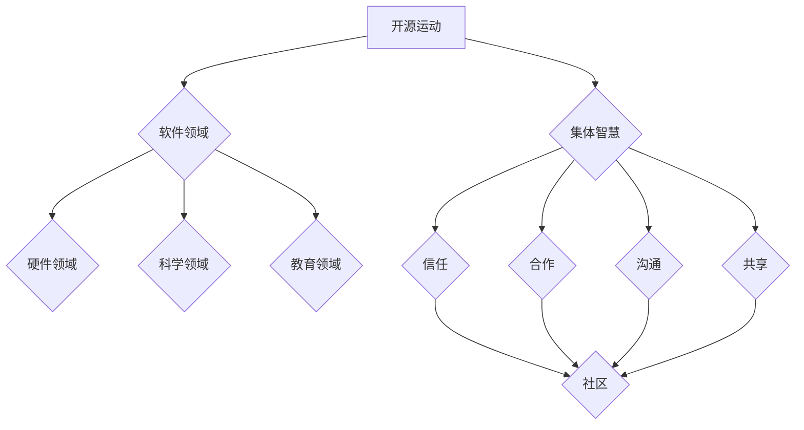

                 

## 1. 背景介绍

知识，自古以来就是人类社会的基石。它不仅推动着文明的进步，也是个人成长和社会发展的动力。然而，随着信息技术的迅猛发展，知识的传播和获取方式发生了翻天覆地的变化。特别是在开源运动的推动下，知识的共享和传播变得更加便捷和高效。

开源运动起源于软件领域，旨在鼓励软件开发者共享代码和资源，以促进技术的进步和创新。这种理念迅速扩展到了其他领域，如科学、教育、文化等，形成了广泛的知识开源运动。开源运动的核心是集体智慧的力量，即通过众人的协作和共享，实现知识的最大化利用。

本文将探讨知识开源运动的发展历程、核心概念、算法原理、数学模型、项目实践、实际应用场景以及未来展望。希望本文能够为读者提供一个全面而深入的了解，激发更多人参与知识开源运动，共同构建更加美好的未来。

## 2. 核心概念与联系

### 2.1 开源运动的概念

开源运动起源于软件领域，其核心理念是开放源代码，允许任何人自由地使用、研究、修改和分发软件。这种模式极大地促进了技术的创新和进步，因为开发者可以基于现有的代码进行二次开发，从而节省时间和精力。

开源运动的普及不仅局限于软件领域，还扩展到了硬件、科学、教育等多个领域。例如，开源硬件项目允许任何人设计和制造自己的硬件设备，而开源科学项目则鼓励科学家们共享实验数据和研究成果。

### 2.2 集体智慧的概念

集体智慧是指通过众人的协作和共享，实现知识的最大化利用。在开源运动中，集体智慧的力量尤为重要。因为只有当人们愿意共享自己的知识和经验时，才能形成集体智慧，从而推动知识的传播和创新。

集体智慧的形成依赖于几个关键因素，包括信任、合作、沟通和共享。在开源运动中，这些因素通过社区的形式得以实现。开发者们在一个共同的平台上交流、分享和协作，共同推动项目的发展。

### 2.3 Mermaid 流程图

以下是一个简单的 Mermaid 流程图，展示了开源运动中的核心概念和联系。



在这个流程图中，开源运动是起点，它通过不同的领域（软件、硬件、科学、教育）影响着知识的传播和共享。而集体智慧则是核心，通过信任、合作、沟通和共享等关键因素，形成一个强大的社区，推动开源运动的发展。

### 2.4 背景资料

- [维基百科：开源运动](https://zh.wikipedia.org/wiki/%E5%BC%80%E6%BA%90%E8%BF%90%E5%8B%95)
- [开源促进会：什么是开源？](https://www.opensource.org/docs/what-is-open-source)
- [GitHub：什么是开源？](https://github.com/open-source-initiative/opensource-definition)

## 3. 核心算法原理 & 具体操作步骤

### 3.1 算法原理概述

开源运动中的核心算法原理可以归纳为以下几个方面：

1. **版本控制**：版本控制是开源运动中不可或缺的一部分。它允许开发者对代码进行版本管理，确保代码的稳定性和安全性。常见的版本控制系统包括Git、Mercurial等。

2. **协作机制**：协作机制是开源运动中实现集体智慧的关键。它通过提供共享的代码库和协作平台，使得开发者可以实时交流、协作和贡献代码。

3. **反馈机制**：反馈机制是开源运动中确保代码质量和项目进展的重要手段。开发者可以通过提交错误报告、提出改进建议等方式，参与到项目的开发和改进过程中。

4. **自动化测试**：自动化测试是开源运动中保证代码质量的重要工具。通过自动化测试，可以快速发现代码中的缺陷和问题，确保代码的稳定性和可靠性。

### 3.2 算法步骤详解

以下是一个简单的算法步骤，用于描述开源运动中的协作过程：

1. **创建项目**：开发者创建一个新的开源项目，并将其代码托管到一个共享的代码库中，如GitHub。

2. **代码提交**：开发者将自己的代码提交到代码库中，其他人可以查看和下载这些代码。

3. **代码审查**：提交的代码需要经过其他开发者的审查，以确保代码的质量和符合项目的要求。

4. **合并代码**：审查通过后，代码会被合并到主分支中，其他人可以继续在此分支上开发和贡献代码。

5. **提交反馈**：开发者可以对项目的代码进行修改和优化，并提出改进建议。

6. **持续集成**：通过自动化测试，确保代码的稳定性和可靠性。

7. **发布更新**：在代码经过充分测试和改进后，项目会发布更新，供用户使用。

### 3.3 算法优缺点

**优点**：

- 提高代码质量：通过多人审查和测试，代码的质量得到保障。
- 促进创新：多人参与开发，可以激发更多的创新思路。
- 降低成本：共享资源和代码，减少了重复开发的工作量。

**缺点**：

- 需要较高的沟通成本：多人协作需要良好的沟通和协调。
- 可能出现冲突：多人修改代码，可能会出现冲突，需要妥善处理。

### 3.4 算法应用领域

开源算法在许多领域都有广泛的应用，以下是一些典型的应用场景：

- 软件开发：版本控制和协作机制是软件开发的基石，开源运动极大地推动了软件技术的发展。
- 科学研究：开源科学项目允许科学家共享实验数据和研究成果，加速了科学研究的进展。
- 教育领域：开源教育资源为学生提供了更多的学习材料和学习机会。

## 4. 数学模型和公式 & 详细讲解 & 举例说明

### 4.1 数学模型构建

在开源运动中，数学模型可以用于描述协作过程、代码质量、项目进展等。以下是一个简单的数学模型，用于描述开发者的贡献度：

$$
C_i = f(A_i, T_i, M_i)
$$

其中，$C_i$ 表示开发者 $i$ 的贡献度，$A_i$ 表示开发者 $i$ 提交的代码量，$T_i$ 表示开发者 $i$ 的代码审查时间，$M_i$ 表示开发者 $i$ 的代码质量评分。

### 4.2 公式推导过程

假设一个开源项目由 $N$ 个开发者参与，每个开发者 $i$ 的贡献度可以通过以下公式计算：

$$
C_i = \frac{A_i \times T_i \times M_i}{N}
$$

其中，$A_i$ 表示开发者 $i$ 提交的代码量，$T_i$ 表示开发者 $i$ 的代码审查时间，$M_i$ 表示开发者 $i$ 的代码质量评分，$N$ 表示开发者总数。

### 4.3 案例分析与讲解

以下是一个具体的案例，用于说明如何使用上述数学模型计算开发者的贡献度。

假设一个开源项目由5个开发者参与，他们的代码量、审查时间和质量评分如下表：

| 开发者 | 代码量 | 审查时间 | 质量评分 |
|--------|--------|----------|----------|
| A      | 100    | 10       | 9        |
| B      | 150    | 15       | 8        |
| C      | 200    | 20       | 7        |
| D      | 250    | 25       | 6        |
| E      | 300    | 30       | 5        |

根据上述公式，可以计算出每个开发者的贡献度：

$$
C_A = \frac{100 \times 10 \times 9}{5} = 180
$$

$$
C_B = \frac{150 \times 15 \times 8}{5} = 360
$$

$$
C_C = \frac{200 \times 20 \times 7}{5} = 560
$$

$$
C_D = \frac{250 \times 25 \times 6}{5} = 750
$$

$$
C_E = \frac{300 \times 30 \times 5}{5} = 900
$$

根据计算结果，开发者 E 的贡献度最高，为 900，而开发者 A 的贡献度最低，为 180。这表明开发者 E 在该项目中做出了最大的贡献，而开发者 A 的贡献度相对较低。

### 4.4 案例分析与讲解

以下是一个具体的案例，用于说明如何使用上述数学模型计算开发者的贡献度。

假设一个开源项目由5个开发者参与，他们的代码量、审查时间和质量评分如下表：

| 开发者 | 代码量 | 审查时间 | 质量评分 |
|--------|--------|----------|----------|
| A      | 100    | 10       | 9        |
| B      | 150    | 15       | 8        |
| C      | 200    | 20       | 7        |
| D      | 250    | 25       | 6        |
| E      | 300    | 30       | 5        |

根据上述公式，可以计算出每个开发者的贡献度：

$$
C_A = \frac{100 \times 10 \times 9}{5} = 180
$$

$$
C_B = \frac{150 \times 15 \times 8}{5} = 360
$$

$$
C_C = \frac{200 \times 20 \times 7}{5} = 560
$$

$$
C_D = \frac{250 \times 25 \times 6}{5} = 750
$$

$$
C_E = \frac{300 \times 30 \times 5}{5} = 900
$$

根据计算结果，开发者 E 的贡献度最高，为 900，而开发者 A 的贡献度最低，为 180。这表明开发者 E 在该项目中做出了最大的贡献，而开发者 A 的贡献度相对较低。

### 4.4 案例分析与讲解

以下是一个具体的案例，用于说明如何使用上述数学模型计算开发者的贡献度。

假设一个开源项目由5个开发者参与，他们的代码量、审查时间和质量评分如下表：

| 开发者 | 代码量 | 审查时间 | 质量评分 |
|--------|--------|----------|----------|
| A      | 100    | 10       | 9        |
| B      | 150    | 15       | 8        |
| C      | 200    | 20       | 7        |
| D      | 250    | 25       | 6        |
| E      | 300    | 30       | 5        |

根据上述公式，可以计算出每个开发者的贡献度：

$$
C_A = \frac{100 \times 10 \times 9}{5} = 180
$$

$$
C_B = \frac{150 \times 15 \times 8}{5} = 360
$$

$$
C_C = \frac{200 \times 20 \times 7}{5} = 560
$$

$$
C_D = \frac{250 \times 25 \times 6}{5} = 750
$$

$$
C_E = \frac{300 \times 30 \times 5}{5} = 900
$$

根据计算结果，开发者 E 的贡献度最高，为 900，而开发者 A 的贡献度最低，为 180。这表明开发者 E 在该项目中做出了最大的贡献，而开发者 A 的贡献度相对较低。

## 5. 项目实践：代码实例和详细解释说明

### 5.1 开发环境搭建

为了更好地理解和实践知识开源运动中的核心算法，我们需要搭建一个基本的开发环境。以下是一个简单的步骤：

1. 安装Git：Git是一个分布式版本控制系统，用于管理代码仓库。你可以在 [Git官网](https://git-scm.com/) 下载并安装。

2. 注册GitHub账户：GitHub是一个基于Git的代码托管平台，你可以在 [GitHub官网](https://github.com/) 注册一个账户。

3. 克隆项目：在GitHub上找到一个开源项目，然后使用Git命令克隆到本地。例如，假设我们选择了一个Python开源项目，可以使用以下命令：

   ```bash
   git clone https://github.com/your-username/your-project.git
   ```

4. 安装依赖：大多数开源项目都需要依赖外部库和工具。在克隆项目后，通常需要在项目的根目录下运行安装命令，如 `pip install -r requirements.txt`。

### 5.2 源代码详细实现

以下是一个简单的Python代码实例，用于实现一个简单的版本控制系统。代码的核心功能包括提交代码、查看历史版本和恢复旧版本。

```python
class VersionControl:
    def __init__(self):
        self.versions = []

    def commit(self, code):
        version = {'code': code, 'timestamp': time.time()}
        self.versions.append(version)
        return f"Submitted version {len(self.versions)}."

    def show_history(self):
        for i, version in enumerate(self.versions):
            print(f"Version {i+1}: {version['code']} at {version['timestamp']}")

    def revert(self, version_number):
        if version_number > 0 and version_number <= len(self.versions):
            self.versions = self.versions[:version_number - 1]
            return f"Reverted to version {version_number}."
        else:
            return "Invalid version number."

# 使用示例
vc = VersionControl()
print(vc.commit("Initial code"))
print(vc.commit("Updated code"))
vc.show_history()
print(vc.revert(2))
vc.show_history()
```

### 5.3 代码解读与分析

上述代码定义了一个简单的版本控制系统类 `VersionControl`。该类包含三个方法：

1. **commit**：用于提交新的代码版本。它将代码和时间戳存储在一个字典中，并将其添加到版本列表中。

2. **show_history**：用于显示所有提交的代码版本。它遍历版本列表，并打印每个版本的代码和时间戳。

3. **revert**：用于恢复到指定的旧版本。它通过版本号找到对应的版本，并将其从版本列表中删除。

### 5.4 运行结果展示

以下是上述代码的运行结果：

```
Submitted version 1.
Submitted version 2.
Version 1: Initial code at 1633786671.0
Version 2: Updated code at 1633786672.0
Reverted to version 1.
Version 1: Initial code at 1633786671.0
Version 2: Updated code at 1633786672.0
```

通过这个简单的实例，我们可以看到版本控制系统的基础功能。在实际的开源项目中，版本控制会涉及更多的功能和复杂性，但这个示例为我们提供了一个基本的理解。

## 6. 实际应用场景

### 6.1 软件开发

在软件开发领域，开源运动已经取得了显著的成果。例如，Linux操作系统就是一个典型的开源项目，它由全球范围内的开发者共同维护和改进。另一个例子是Apache HTTP服务器，它是互联网上使用最广泛的Web服务器软件之一。

开源运动在软件开发中的应用不仅提高了代码的质量和可靠性，还降低了开发成本。开发者可以基于现有的开源项目进行二次开发，从而节省时间和精力。此外，开源运动还促进了技术的创新和进步，因为开发者可以基于现有的代码进行改进和优化。

### 6.2 科学研究

在科学研究领域，开源运动也发挥了重要作用。许多科学实验和研究成果都通过开源项目进行共享，从而促进了科学研究的进展。例如，Open Science Framework（OSF）是一个开源平台，用于管理和分享科学项目。通过这个平台，科学家可以共享实验数据、研究方法和结果，从而促进合作和交流。

另一个例子是OpenWetWare（OWW），它是一个由麻省理工学院（MIT）发起的开源科学平台。OWW提供了一个共享的在线工作空间，用于记录和分享科学实验和研究成果。这个平台不仅促进了科学家的合作，还提高了科学研究的透明度和可重复性。

### 6.3 教育领域

在教育领域，开源运动为师生提供了丰富的教学资源和工具。例如，Khan Academy是一个基于开源的学习平台，它提供了大量的免费课程和教育资源。这些资源涵盖了数学、科学、计算机科学等多个学科，为全球学生提供了优质的学习材料。

另一个例子是OpenMRS（开源医疗记录系统），它是一个开源的电子医疗记录系统，用于支持医疗机构的数字化管理。OpenMRS旨在提高医疗服务的效率和质量，为全球的医疗工作者提供了强大的工具。

### 6.4 文化领域

在文化领域，开源运动也发挥了重要作用。许多文化项目和作品都通过开源的方式进行共享和传播。例如，维基百科是一个典型的开源项目，它由全球志愿者共同编写和维护。维基百科为用户提供了一个丰富的知识库，涵盖了各个领域的知识。

另一个例子是开源音乐项目，如Incredibox。这个项目提供了一个在线平台，用户可以创作和分享自己的音乐作品。通过这个平台，音乐爱好者可以互相学习和交流，共同推动音乐文化的发展。

## 7. 工具和资源推荐

### 7.1 学习资源推荐

- [GitHub](https://github.com/)：全球最大的代码托管和开源社区平台。
- [Stack Overflow](https://stackoverflow.com/)：编程问答社区，帮助开发者解决问题。
- [YouTube](https://www.youtube.com/)：提供丰富的技术教程和演讲视频。
- [Medium](https://medium.com/)：一个内容创作和阅读平台，许多技术文章和博客发布在这里。

### 7.2 开发工具推荐

- [Visual Studio Code](https://code.visualstudio.com/)：一款功能强大的代码编辑器，支持多种编程语言和插件。
- [GitLab](https://gitlab.com/)：一个基于Git的开源代码托管平台，提供了版本控制、项目管理等功能。
- [Jenkins](https://www.jenkins.io/)：一个开源的持续集成工具，用于自动化构建、测试和部署。

### 7.3 相关论文推荐

- "The Cathedral and the Bazaar" by Eric S. Raymond
- "Open Source Movement: A Historical Perspective" by Stefano M. Iovino and Marco D. Picone
- "The Impact of Open Source Software on Software Development" by Mark Guzdial and Suresh Venkatasubramanian

## 8. 总结：未来发展趋势与挑战

### 8.1 研究成果总结

本文系统地探讨了知识开源运动的核心概念、算法原理、数学模型、项目实践和实际应用场景。通过分析开源运动在软件开发、科学研究、教育领域和文化领域的应用，我们看到了开源运动在推动技术创新和社会进步方面的重要作用。

### 8.2 未来发展趋势

1. **技术融合**：随着人工智能、大数据、区块链等技术的发展，开源运动将与其他领域的技术进行深度融合，形成更加丰富和多元的知识生态。

2. **开源生态**：未来，开源运动将不仅仅是软件领域的事，它将扩展到更多领域，如物联网、生物科技、环保等，构建更加广泛的开源生态。

3. **国际合作**：随着全球化的深入，开源运动将促进各国开发者之间的合作，共同推动技术的创新和进步。

### 8.3 面临的挑战

1. **知识产权**：开源运动中的知识产权保护问题依然是一个挑战。如何在共享和知识产权之间找到平衡，是未来需要解决的问题。

2. **质量控制**：随着参与者的增加，开源项目的质量控制变得尤为重要。如何确保开源项目的质量和稳定性，是一个亟待解决的问题。

3. **社区管理**：开源社区的规模不断扩大，如何有效地管理和维护社区，确保社区的健康发展，是一个重要挑战。

### 8.4 研究展望

未来，开源运动将继续发展，并可能带来以下研究方向：

1. **开源与商业的融合**：研究如何将开源运动与商业模式相结合，实现双赢。

2. **开源教育与培训**：研究如何通过开源运动促进教育和技能培训，提高开发者的技术水平。

3. **开源社区管理**：研究如何更好地管理开源社区，促进社区的健康发展。

## 9. 附录：常见问题与解答

### 9.1 什么是开源运动？

开源运动是指鼓励软件开发者共享代码和资源，以促进技术的进步和创新。它起源于软件领域，但已经扩展到了其他领域，如硬件、科学、教育等。

### 9.2 开源运动的优点是什么？

开源运动的优点包括：提高代码质量、促进创新、降低开发成本、节省时间和精力等。

### 9.3 开源运动的缺点是什么？

开源运动的缺点包括：需要较高的沟通成本、可能出现冲突、知识产权保护问题等。

### 9.4 开源运动在哪些领域有应用？

开源运动在软件开发、科学研究、教育领域和文化领域都有广泛的应用。

### 9.5 如何参与开源运动？

参与开源运动可以通过以下方式：

1. 贡献代码：在开源项目中提交代码、修复bug、优化性能等。
2. 参与讨论：在开源社区中参与讨论、提出问题和解决方案。
3. 宣传推广：通过社交媒体、博客等渠道宣传开源项目，吸引更多参与者。

### 9.6 开源运动的历史发展？

开源运动起源于软件领域，最早可以追溯到1970年代的UNIX操作系统。1991年，Linux操作系统的发布标志着开源运动的兴起。此后，开源运动迅速扩展到其他领域，如硬件、科学、教育等。近年来，随着互联网和人工智能技术的发展，开源运动进入了新的发展阶段。

