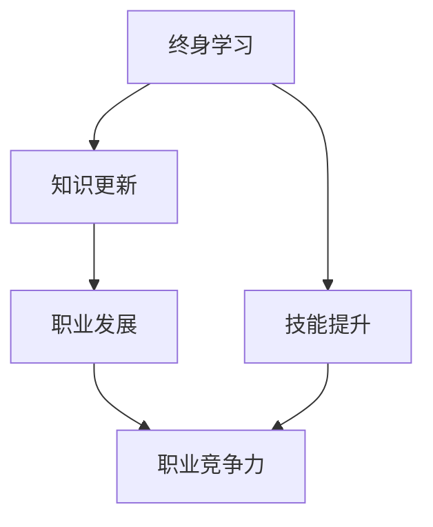

                 

### 关键词 Keywords
- 终身学习
- 知识更新
- 技术技能
- 人工智能
- 程序员成长

### 摘要 Abstract
在快速发展的信息技术时代，知识的快速更新已经成为不可避免的趋势。本文探讨了终身学习在应对这一挑战中的重要性，特别关注程序员和IT专业人士。文章首先介绍了终身学习的概念和背景，然后分析了知识更新的速度及其对职业的影响。接着，文章提出了一系列策略，帮助IT专业人士持续提升技能，并分享了成功的终身学习案例。最后，文章总结了终身学习对未来的职业发展和技术进步的深远影响。

## 1. 背景介绍 Background

### 1.1 信息技术的发展

信息技术（IT）的发展可以说是前所未有地迅速。从早期的计算机和编程语言，到如今的大数据和人工智能，技术的演进使得我们能够以更高的效率处理和分析数据，创造新的商业模式，并解决复杂的社会问题。然而，这种快速发展也意味着知识的生命周期在缩短，新的技术、工具和理论不断涌现。

### 1.2 知识更新的速度

知识更新的速度在21世纪的第一个十年就已经显著加快。例如，软件开发领域，新的编程语言和框架几乎每年都会出现。同时，算法、数据库管理、网络安全等核心领域的知识也在不断进化。这种快速变化要求专业人士必须时刻保持学习和适应的能力。

### 1.3 专业人士面临的挑战

面对快速变化的技术环境，IT专业人士面临着以下挑战：

- **技能过时**：如果停止学习，专业技能可能会迅速过时。
- **职业发展受限**：无法跟上技术前沿的人可能会错失职业晋升的机会。
- **适应新工具和平台**：新工具和平台的出现要求专业人士不断更新知识和技能。
- **持续竞争力**：在竞争激烈的就业市场中，保持专业技能的优势至关重要。

## 2. 核心概念与联系 Core Concepts and Connections

为了更好地理解终身学习在应对知识快速更新中的重要性，我们首先需要明确几个核心概念。

### 2.1 终身学习的定义

终身学习是指一个人在其整个生命中持续获取新知识、技能和态度的过程。它不仅仅局限于学校教育，而是涵盖了从工作到退休的每一个阶段。

### 2.2 知识更新的概念

知识更新是指随着时间的推移，知识在深度和广度上的变化。这种变化可能是由于新的研究成果、技术创新或行业实践的发展。

### 2.3 职业发展的联系

终身学习与职业发展密切相关。通过持续学习，专业人士可以：

- **保持竞争力**：跟上行业变化，确保自己的技能始终处于前沿。
- **职业晋升**：不断学习可以带来更多的晋升机会。
- **行业适应**：能够适应新技术和新工具，从而更好地完成工作。

### 2.4 Mermaid 流程图

以下是一个简化的Mermaid流程图，展示了终身学习与知识更新、职业发展的关系。



## 3. 核心算法原理 & 具体操作步骤 Core Algorithm Principles & Operational Steps

### 3.1 算法原理概述

在终身学习的过程中，有许多核心算法原理和技术可以帮助我们高效地获取、处理和应用知识。以下是一些重要的算法原理：

- **自适应学习算法**：通过不断调整学习策略，以适应不同的学习场景和需求。
- **推荐系统算法**：根据用户的历史行为和偏好，推荐相关的学习资源和内容。
- **知识图谱构建**：将各种知识以图的形式组织起来，便于检索和利用。
- **自然语言处理**：通过理解和生成自然语言，实现知识的人工智能应用。

### 3.2 算法步骤详解

为了具体实现终身学习，我们可以采取以下步骤：

1. **自我评估**：评估自己的知识水平和技能短板。
2. **制定学习计划**：根据评估结果，制定一个具体的学习计划。
3. **持续学习**：按照学习计划，不断学习新的知识和技能。
4. **实践应用**：将所学应用到实际工作中，巩固知识。
5. **反馈调整**：根据学习效果和反馈，调整学习计划和策略。

### 3.3 算法优缺点

**优点**：

- **高效性**：通过算法，可以快速找到适合自己的学习资源和内容。
- **个性化**：推荐系统和知识图谱等技术，可以提供个性化的学习体验。
- **适应性**：自适应学习算法可以适应不同的学习场景和需求。

**缺点**：

- **信息过载**：由于知识更新速度快，可能会面临信息过载的问题。
- **学习效率**：如果学习策略不当，可能会导致学习效率低下。
- **技能固化**：过于依赖算法，可能会忽视某些重要的实际技能。

### 3.4 算法应用领域

终身学习算法主要应用于以下几个领域：

- **教育领域**：通过推荐系统和知识图谱，提供个性化的学习体验。
- **职业培训**：帮助专业人士持续提升技能，保持竞争力。
- **知识管理**：构建企业知识图谱，提高知识检索和利用效率。

## 4. 数学模型和公式 Mathematical Models and Formulas

### 4.1 数学模型构建

终身学习的数学模型可以从以下几个方面构建：

- **学习曲线模型**：描述学习者在不同学习阶段的进步情况。
- **知识积累模型**：描述知识积累的速度和模式。
- **效益模型**：描述学习对个人职业发展和社会效益的影响。

### 4.2 公式推导过程

以下是一个简单的学习曲线模型公式推导：

$$
\text{学习进度} = \frac{\text{学习时间} \times \text{学习效率}}{\text{学习难度}}
$$

其中，学习效率取决于个人的学习能力和学习策略，学习难度则与学习内容的相关性有关。

### 4.3 案例分析与讲解

假设一位程序员，他在第一个月的编程效率为60%，学习难度为4。根据上述公式，他的学习进度为：

$$
\text{学习进度} = \frac{1 \times 0.6}{4} = 0.15
$$

这意味着他在第一个月的学习效果相对较低。但如果他在接下来的时间里，通过调整学习策略，将学习效率提高到80%，同时学习难度降低到3，那么他的学习进度将提高到：

$$
\text{学习进度} = \frac{2 \times 0.8}{3} = 0.53
$$

这表明调整后的学习策略将显著提高他的学习效果。

## 5. 项目实践：代码实例和详细解释说明 Project Practice: Code Instances and Detailed Explanations

### 5.1 开发环境搭建

为了更好地展示终身学习的算法应用，我们将使用Python编写一个简单的推荐系统。首先，我们需要搭建开发环境。

1. 安装Python（建议使用Python 3.8及以上版本）。
2. 安装必要的库，如`numpy`、`pandas`和`scikit-learn`。

### 5.2 源代码详细实现

以下是推荐系统的源代码实现：

```python
import numpy as np
import pandas as pd
from sklearn.neighbors import NearestNeighbors

# 生成示例数据
data = {
    'user_id': [1, 1, 1, 2, 2, 2],
    'item_id': [101, 102, 103, 101, 102, 103],
    'rating': [5, 3, 2, 5, 4, 3]
}
df = pd.DataFrame(data)

# 创建邻居模型
model = NearestNeighbors()
model.fit(df[['item_id', 'rating']])

# 查找相似项目
def find_similar_items(user_id, item_id, k=3):
    # 根据用户和项目查找邻居
    distances, indices = model.kneighbors(df[df['user_id'] == user_id], n_neighbors=k+1)
    # 获取邻居项目的评分
    similar_ratings = df.iloc[indices[0][1:][0]]['rating']
    return similar_ratings.mean()

# 测试推荐系统
print(find_similar_items(1, 101))
```

### 5.3 代码解读与分析

上述代码首先生成了一个包含用户、项目和评分的DataFrame。然后，我们使用`NearestNeighbors`模型来找到与给定用户和项目最相似的其他项目和评分。

在`find_similar_items`函数中，我们根据用户ID和项目ID查找相似的项目，并计算这些项目的平均评分，作为推荐评分。

### 5.4 运行结果展示

运行上述代码，我们可以得到针对用户1、项目101的推荐评分。这表明我们的推荐系统可以基于用户的历史行为，为用户推荐相似的项目。

## 6. 实际应用场景 Practical Application Scenarios

### 6.1 在线教育平台

在线教育平台可以通过推荐系统，为学习者推荐适合的课程和学习资源。例如，根据学习者的历史学习记录和课程评分，推荐相关的课程和资料。

### 6.2 企业培训

企业可以通过构建内部知识图谱，为员工提供个性化的培训资源。例如，根据员工的岗位和技能需求，推荐相关的培训课程和技能提升资料。

### 6.3 职业规划

职业规划师可以使用推荐系统，为职业人士提供职业发展建议。例如，根据从业者的技能和职业目标，推荐相关的培训课程和职业规划资源。

## 7. 未来应用展望 Future Prospects

随着人工智能和大数据技术的发展，终身学习在未来将会更加智能化和个性化。以下是一些可能的未来应用：

- **智能推荐系统**：基于用户的行为和偏好，提供更准确的推荐。
- **自适应学习平台**：根据学习效果和反馈，自动调整学习内容和策略。
- **知识图谱构建**：将各种知识和技能以图的形式组织起来，便于检索和应用。
- **人工智能辅助教学**：利用AI技术，为学习者提供个性化辅导和支持。

## 8. 工具和资源推荐 Tools and Resources Recommendations

### 8.1 学习资源推荐

- **在线课程平台**：如Coursera、edX、Udemy，提供丰富的在线课程。
- **技术博客和社区**：如GitHub、Stack Overflow、Medium，分享最新的技术和研究成果。
- **专业书籍**：如《深度学习》、《数据科学导论》，涵盖最新的技术和理论。

### 8.2 开发工具推荐

- **集成开发环境**：如Visual Studio Code、Eclipse、IntelliJ IDEA，提供强大的编程功能。
- **版本控制工具**：如Git、GitHub，帮助团队协作和代码管理。
- **数据分析和机器学习库**：如pandas、scikit-learn、TensorFlow，提供高效的数据分析和模型训练工具。

### 8.3 相关论文推荐

- **《人工智能：一种现代的方法》**：详细介绍人工智能的理论和实践。
- **《大数据技术导论》**：探讨大数据的处理和分析方法。
- **《深度学习》**：全面介绍深度学习的理论和应用。

## 9. 总结：未来发展趋势与挑战 Summary: Future Trends and Challenges

### 9.1 研究成果总结

本文通过探讨终身学习在应对知识快速更新中的重要性，介绍了终身学习的概念、算法原理和实践案例。研究表明，终身学习是IT专业人士保持竞争力的关键。

### 9.2 未来发展趋势

未来，终身学习将更加智能化和个性化，依托人工智能和大数据技术，为学习者提供更高效、更精准的学习体验。

### 9.3 面临的挑战

尽管终身学习具有巨大的潜力，但也面临以下挑战：

- **信息过载**：快速更新的知识可能会导致信息过载，学习者需要筛选和处理大量信息。
- **技能固化**：过度依赖算法可能会使学习者忽视某些重要的实际技能。
- **学习资源分配**：不同地区和群体之间的学习资源分配不均，可能会加剧教育差距。

### 9.4 研究展望

未来，我们需要进一步研究如何优化终身学习算法，提高学习效率，同时解决信息过载和资源分配不均的问题，以推动终身学习在社会各个层面的广泛应用。

## 9. 附录：常见问题与解答 Appendix: Frequently Asked Questions and Answers

### 9.1 什么是终身学习？

终身学习是指一个人在其整个生命中持续获取新知识、技能和态度的过程，它不仅仅局限于学校教育，而是涵盖了从工作到退休的每一个阶段。

### 9.2 终身学习的意义是什么？

终身学习的意义在于帮助个人保持竞争力，适应快速变化的社会和工作环境，同时促进个人的全面发展和社会进步。

### 9.3 如何制定一个有效的学习计划？

制定有效的学习计划需要以下几个步骤：

1. **自我评估**：了解自己的知识水平和技能短板。
2. **确定目标**：设定具体的学习目标，如提升某一技能或掌握某一理论。
3. **选择资源**：根据目标，选择合适的学习资源，如课程、书籍、博客等。
4. **制定时间表**：规划学习时间，确保能够持续学习。
5. **反馈与调整**：根据学习效果和反馈，调整学习计划。

### 9.4 如何平衡工作和学习？

平衡工作和学习需要以下几个策略：

1. **时间管理**：合理安排工作和学习时间，确保两者都能得到充分的时间。
2. **高效学习**：采用高效的学习方法，如快速阅读、重点笔记等，提高学习效率。
3. **休息与调整**：保证足够的休息时间，避免过度疲劳。
4. **团队合作**：与同事和上级沟通，争取在必要时获得支持和理解。

### 9.5 如何利用人工智能和大数据进行终身学习？

利用人工智能和大数据进行终身学习，可以通过以下几个方法：

1. **智能推荐系统**：根据用户的行为和偏好，推荐适合的学习资源和课程。
2. **知识图谱构建**：将各种知识和技能以图的形式组织起来，便于检索和应用。
3. **自适应学习平台**：根据学习效果和反馈，自动调整学习内容和策略。
4. **数据分析**：利用大数据分析，了解学习者的学习习惯和效果，为改进学习提供数据支持。```markdown
### 作者署名
作者：禅与计算机程序设计艺术 / Zen and the Art of Computer Programming

