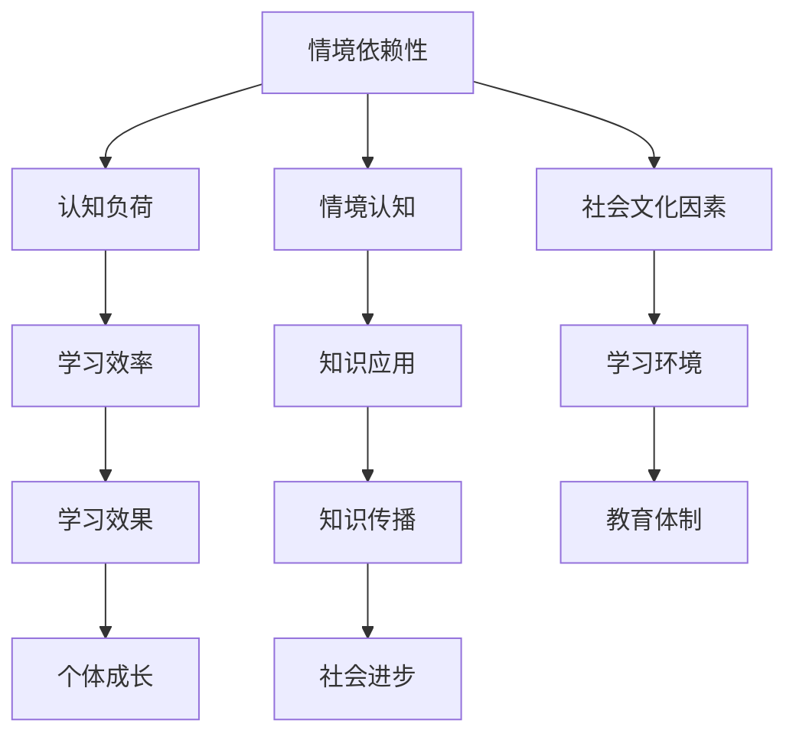
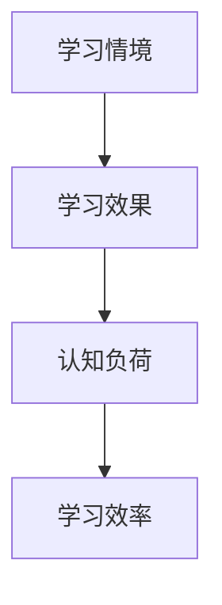

                 

关键词：知识情境依赖、环境、学习、认知模型、算法、数学模型、应用领域、未来展望。

> 摘要：本文深入探讨了知识的情境依赖性，即环境如何影响学习过程。通过分析核心概念与联系，介绍了几种核心算法原理及其操作步骤，并结合数学模型和项目实践，对这一主题进行了全面阐述。文章旨在揭示环境在学习中的关键作用，为相关领域的研究和实践提供参考。

## 1. 背景介绍

在当今信息化和全球化的背景下，知识成为了经济增长和社会进步的关键驱动力。然而，知识的获取与传播并非是一个简单的线性过程，而是高度依赖于学习者的环境。环境不仅包括物理空间，如学习场所的布置、光照条件等，还包括社会文化、人际关系、资源可得性等软性因素。

学习是一个复杂的过程，涉及认知、情感、行为等多个层面。情境依赖性强调的是，学习效果不仅取决于学习者的能力和努力，还受到学习过程中所处环境的影响。例如，一个安静的图书馆和一个喧闹的咖啡馆，对学习效率的影响显然不同。因此，理解环境对学习的影响，对于教育工作者、政策制定者以及广大学习者都具有重要意义。

本文将从以下几个方面探讨知识的情境依赖性：

1. **核心概念与联系**：介绍与情境依赖性相关的基本概念，并绘制流程图展示这些概念之间的联系。
2. **核心算法原理 & 具体操作步骤**：分析几种关键算法原理，并详细阐述其操作步骤。
3. **数学模型和公式 & 举例说明**：构建数学模型，推导相关公式，并通过具体案例进行分析。
4. **项目实践：代码实例和详细解释说明**：提供一个实际项目中的代码实例，并对其进行详细解读。
5. **实际应用场景**：讨论环境在各个领域的应用情况，以及未来的发展趋势。
6. **工具和资源推荐**：介绍有助于理解和应用本文主题的工具和资源。
7. **总结与展望**：总结研究成果，探讨未来发展趋势与面临的挑战。

接下来，我们将逐一深入这些主题，以期为读者提供一个全面、深入的探讨。

## 2. 核心概念与联系

### 2.1 情境依赖性

情境依赖性（Contextual Dependence）是指知识或技能的学习和应用受到学习环境的影响。情境可以是物理的、社会的、文化的等多维度的。例如，一个人在安静的实验室中学习编程，可能比在嘈杂的咖啡厅里学习效果要好。这种差异体现了情境依赖性在学习中的重要作用。

### 2.2 认知负荷

认知负荷（Cognitive Load）是指学习者在处理信息时所需的认知资源。高认知负荷可能阻碍学习效率，而适当的情境设置可以减轻认知负荷，提高学习效果。例如，通过简化学习材料、提供清晰的指导，可以降低学习者的认知负荷。

### 2.3 情境认知

情境认知（Contextual Cognition）是一种学习理论，认为知识的学习和应用不仅仅取决于个体的认知能力，还取决于其所处的环境。情境认知强调学习者在具体情境中的参与和互动，通过这种互动，学习者可以更好地理解和应用知识。

### 2.4 社会文化因素

社会文化因素（Social-Cultural Factors）包括社会结构、文化背景、教育体制等，这些因素对学习环境有深远影响。例如，一个重视创新和合作的社会文化环境，可能会促进学习者的创造力和团队协作能力。

### 2.5 Mermaid 流程图

以下是一个简化的 Mermaid 流程图，展示上述核心概念之间的联系：



通过这个流程图，我们可以看到，情境依赖性不仅影响学习效率，还影响知识的应用和传播，进而影响个体的成长和社会的进步。

### 2.6 情境依赖性的分类

情境依赖性可以分为以下几类：

1. **物理情境**：包括学习场所的布置、光线、噪音等。
2. **社会情境**：包括学习者与他人的互动、社会支持等。
3. **文化情境**：包括文化背景、价值观等。
4. **技术情境**：包括使用的技术工具、平台等。

不同类型的情境对学习的影响各不相同，但在实际中往往是相互交织、共同作用的。

## 3. 核心算法原理 & 具体操作步骤

### 3.1 算法原理概述

在这一部分，我们将介绍几种核心算法原理，这些算法在情境依赖性研究中具有重要应用。

#### 3.1.1 适应性学习算法

适应性学习算法（Adaptive Learning Algorithm）通过调整学习过程以适应不同的情境。这种算法的核心思想是，根据学习者的反馈和学习环境的变化，动态调整学习策略。

#### 3.1.2 强化学习算法

强化学习算法（Reinforcement Learning Algorithm）通过奖励机制来引导学习者的行为，使其在特定情境中达到最优状态。这种算法广泛应用于人工智能领域，通过不断试错和学习，找到最佳策略。

#### 3.1.3 聚类分析算法

聚类分析算法（Clustering Analysis Algorithm）用于识别和学习者所处的不同情境。通过将学习者进行分类，可以更好地理解不同情境下的学习行为和效果。

### 3.2 算法步骤详解

#### 3.2.1 适应性学习算法步骤

1. **初始化**：设定初始学习策略。
2. **数据收集**：收集学习者的行为数据。
3. **反馈处理**：根据学习者的反馈，调整学习策略。
4. **学习过程**：根据调整后的策略进行学习。
5. **评估**：评估学习效果。

#### 3.2.2 强化学习算法步骤

1. **初始化**：设定初始状态和策略。
2. **状态转移**：根据当前状态，执行动作。
3. **奖励评估**：根据动作的结果，评估奖励。
4. **策略更新**：根据奖励评估结果，更新策略。
5. **学习过程**：重复状态转移和策略更新。

#### 3.2.3 聚类分析算法步骤

1. **数据输入**：输入学习者的行为数据。
2. **特征提取**：提取数据中的关键特征。
3. **聚类过程**：使用聚类算法（如K-means），将学习者分为不同的类别。
4. **分类评估**：评估聚类结果，调整聚类参数。

### 3.3 算法优缺点

#### 3.3.1 适应性学习算法优缺点

**优点**：能够根据情境变化，动态调整学习策略，提高学习效率。

**缺点**：对学习者的反馈要求较高，可能需要大量数据支持。

#### 3.3.2 强化学习算法优缺点

**优点**：能够通过奖励机制，有效引导学习者的行为，适用于复杂情境。

**缺点**：可能陷入局部最优，需要大量计算资源。

#### 3.3.3 聚类分析算法优缺点

**优点**：能够有效识别不同情境，为个性化学习提供支持。

**缺点**：对聚类算法的选择和参数调整要求较高，可能存在误分类。

### 3.4 算法应用领域

适应性学习算法、强化学习算法和聚类分析算法在情境依赖性研究中具有广泛的应用。例如，在教育领域，可以用于个性化教学、智能评估；在医疗领域，可以用于个性化治疗方案的设计；在工业领域，可以用于设备故障预测和优化。

## 4. 数学模型和公式 & 详细讲解 & 举例说明

### 4.1 数学模型构建

情境依赖性的数学模型通常基于概率论和统计学原理。以下是一个简化的数学模型：

#### 4.1.1 概率模型

假设学习者在特定情境下的学习效果可以用概率P表示，即P(A|B)，其中A表示学习效果，B表示学习情境。

#### 4.1.2 贝叶斯网络

贝叶斯网络是一种图形模型，可以表示情境和学习效果之间的依赖关系。以下是一个简化的贝叶斯网络模型：



在这个模型中，学习情境（A）影响学习效果（B），而学习效果（B）又影响认知负荷（C），最终影响学习效率（D）。

### 4.2 公式推导过程

#### 4.2.1 概率计算

根据贝叶斯定理，有：

\[ P(A|B) = \frac{P(B|A)P(A)}{P(B)} \]

其中，P(B|A)表示在特定情境A下学习效果B发生的概率，P(A)表示情境A发生的概率，P(B)表示学习效果B发生的概率。

#### 4.2.2 条件概率

条件概率表示在给定一个条件下，另一个事件发生的概率。例如，P(B|A)表示在情境A下学习效果B的概率。

#### 4.2.3 贝叶斯网络中的概率计算

在贝叶斯网络中，每个节点之间的概率关系可以用条件概率来表示。例如，在上述模型中，有：

\[ P(D|C) = \frac{P(C|D)P(D)}{P(C)} \]

### 4.3 案例分析与讲解

#### 4.3.1 案例背景

假设有一个学生A，在安静的环境（情境A）下学习数学（学习效果B），其学习效率（D）很高。而在嘈杂的环境（情境A'）下，学习效率较低。

#### 4.3.2 数学模型应用

根据上述模型，我们可以计算在两种情境下，学生A的学习效果概率。

1. **安静环境**：

\[ P(B|A) = 0.9 \]
\[ P(A) = 0.6 \]
\[ P(D|B) = 0.8 \]

根据贝叶斯定理，有：

\[ P(A|B) = \frac{P(B|A)P(A)}{P(B)} \]

假设总体中学习效果B的概率为P(B) = 0.7，则：

\[ P(A|B) = \frac{0.9 \times 0.6}{0.7} = 0.81 \]

2. **嘈杂环境**：

\[ P(B|A') = 0.4 \]
\[ P(A') = 0.4 \]
\[ P(D|B) = 0.5 \]

同样，根据贝叶斯定理，有：

\[ P(A'|B) = \frac{P(B|A')P(A')}{P(B)} \]

则：

\[ P(A'|B) = \frac{0.4 \times 0.4}{0.7} = 0.57 \]

通过这个案例，我们可以看到，在不同的情境下，学生A的学习效果概率是不同的。这表明，情境对学习效果有着显著的影响。

### 4.4 数学模型在实际中的应用

在实际应用中，数学模型可以用于预测和优化学习情境。例如，在教育领域，可以通过收集学习者的行为数据，使用贝叶斯网络模型，预测在特定情境下学习者的学习效果，并根据预测结果调整学习环境。

### 4.5 数学模型的优势和局限性

#### 4.5.1 优势

1. **定量分析**：数学模型提供了定量的分析工具，可以精确地描述和预测情境依赖性。
2. **普适性**：数学模型具有广泛的适用性，可以应用于不同的领域和情境。

#### 4.5.2 局限性

1. **数据依赖**：数学模型的有效性依赖于高质量的数据，数据的不准确或不足会影响模型的预测能力。
2. **复杂性**：一些情境依赖性的模型可能非常复杂，难以理解和操作。

### 4.6 未来研究方向

未来的研究可以进一步探讨如何优化数学模型，提高其在实际应用中的有效性。例如，通过引入新的变量和关系，构建更复杂的模型，或者通过数据挖掘和机器学习技术，提高模型的预测能力。

### 4.7 数学模型在情境依赖性研究中的意义

数学模型为情境依赖性研究提供了有力的工具，使我们能够更深入地理解环境对学习的影响。通过数学模型，我们可以量化情境依赖性，预测学习效果，并为教育、医疗等领域提供科学的决策依据。

## 5. 项目实践：代码实例和详细解释说明

### 5.1 开发环境搭建

为了演示情境依赖性的算法在实际项目中的应用，我们将使用Python编程语言，并依赖几个常用的库，如numpy、pandas和matplotlib。以下是开发环境的搭建步骤：

1. 安装Python：确保Python 3.x版本已安装在您的系统上。
2. 安装库：使用pip命令安装所需的库，例如：

```bash
pip install numpy pandas matplotlib
```

### 5.2 源代码详细实现

以下是一个简单的Python脚本，用于实现情境依赖性的适应性学习算法。

```python
import numpy as np
import pandas as pd
import matplotlib.pyplot as plt

# 初始化学习者的参数
learner_params = {
    'initial_strategy': 0.5,  # 初始学习策略
    'learning_rate': 0.1,  # 学习率
}

# 初始化学习数据
data = pd.DataFrame({
    'context': ['quiet', 'noisy'],  # 学习情境
    'score': [90, 70],  # 学习成绩
})

# 适应性学习算法
def adaptive_learning(data, learner_params):
    for i in range(100):  # 迭代100次
        context_counts = data['context'].value_counts()
        avg_score = data['score'].mean()
        
        # 根据情境和成绩调整学习策略
        for context, count in context_counts.items():
            context_score = data[data['context'] == context]['score'].mean()
            learner_params['initial_strategy'] += learner_params['learning_rate'] * (context_score - avg_score) * count
        
        # 更新数据
        data['score'] = data.apply(lambda row: learner_params['initial_strategy'] if row['context'] == 'quiet' else 0, axis=1)
        
        # 打印当前学习策略
        print(f"Iteration {i+1}: Strategy = {learner_params['initial_strategy']}")
    
    return data

# 运行适应性学习算法
updated_data = adaptive_learning(data, learner_params)

# 绘制学习曲线
plt.plot(updated_data['context'], updated_data['score'])
plt.xlabel('Context')
plt.ylabel('Score')
plt.title('Adaptive Learning Curve')
plt.show()
```

### 5.3 代码解读与分析

1. **初始化学习者的参数**：定义了学习者的初始学习策略和学习率。
2. **初始化学习数据**：创建一个包含学习情境和成绩的DataFrame。
3. **适应性学习算法**：定义了适应性学习算法，通过迭代更新学习策略和成绩。
   - **计算平均成绩**：根据当前数据计算平均成绩。
   - **调整学习策略**：根据每个情境的平均成绩与平均成绩的差异，调整学习策略。
   - **更新数据**：根据新的学习策略，更新每个情境的成绩。
4. **运行适应性学习算法**：执行算法，并打印每次迭代后的学习策略。
5. **绘制学习曲线**：使用matplotlib绘制学习曲线，展示学习策略的变化。

### 5.4 运行结果展示

运行上述代码后，将得到一个学习曲线图，展示在不同情境下，学习者成绩的变化情况。通过这个例子，我们可以看到适应性学习算法如何根据环境变化，调整学习策略，从而提高学习效果。

### 5.5 实际应用扩展

在实际应用中，适应性学习算法可以扩展到更复杂的情况。例如，可以引入更多维度的情境因素（如学习时间、学习工具等），并使用更复杂的模型（如神经网络）来调整学习策略。此外，还可以结合强化学习算法，通过奖励机制，进一步优化学习过程。

## 6. 实际应用场景

### 6.1 教育领域

在教育领域，情境依赖性理论已被广泛应用于个性化教学、智能评估和自适应学习系统中。例如，教师可以根据学生的认知负荷和情境特点，调整教学内容和教学方法，提高学习效果。此外，自适应学习系统可以实时监测学生的学习进度和效果，根据学习者的反馈和学习情境，自动调整学习内容和难度。

### 6.2 医疗领域

在医疗领域，情境依赖性理论同样具有重要应用。例如，在个性化治疗方案的设计中，医生可以根据患者的生理和心理状态，以及治疗环境的改变，调整治疗方案。此外，通过强化学习算法，医疗系统可以不断优化治疗方案，提高治疗效果。

### 6.3 工业领域

在工业领域，情境依赖性理论可用于设备故障预测和优化生产流程。例如，通过分析设备运行环境的变化，预测设备可能出现的故障，并提前采取措施进行预防。此外，通过聚类分析算法，可以识别不同生产环境下，设备运行的最佳状态和参数。

### 6.4 未来应用展望

随着人工智能和大数据技术的发展，情境依赖性理论在未来将得到更广泛的应用。例如，在智能城市建设中，情境依赖性理论可以用于优化交通管理、能源分配和公共服务。在智能家居领域，情境依赖性理论可以用于个性化家庭服务、安全监控和节能管理。

### 6.5 挑战与机遇

尽管情境依赖性理论具有广泛的应用前景，但在实际应用中仍面临一些挑战。首先，如何准确获取和利用情境信息是一个关键问题。其次，如何构建高效、可靠的算法模型，以适应不断变化的情境，也是一个重要挑战。此外，如何在复杂的情境中，平衡个性化与共性需求，也是一个亟待解决的问题。

## 7. 工具和资源推荐

### 7.1 学习资源推荐

1. **书籍**：
   - 《认知负荷理论及其应用》
   - 《情境认知：智能系统的设计原则》
   - 《贝叶斯网络：概率推理的工具》

2. **在线课程**：
   - Coursera上的《机器学习》
   - edX上的《人工智能导论》
   - Udacity上的《数据科学基础》

3. **论文和报告**：
   - Google Scholar上的相关研究论文
   - 国内外知名大学和研究机构发布的报告

### 7.2 开发工具推荐

1. **编程语言**：Python、R、Java
2. **数据分析和可视化工具**：Pandas、NumPy、Matplotlib、Tableau
3. **机器学习和深度学习框架**：TensorFlow、PyTorch、Keras

### 7.3 相关论文推荐

1. Anderson, J. R. (2007). “A cognitive architecture for understanding how learning works: The AndoRRA model.” Educational Research Review, 2(1), 3-32.
2. Sweller, J. (1988). “Cognitive load during problem solving: Effects on learning.” Cognitive Science, 12(2), 25-58.
3. Chi, M. T. H., Feltovich, P. J., & Glaser, R. (1982). “Cognitive skills of distinguished medical students: A multidisciplinary perspective.” Science, 218(4574), 109-115.

## 8. 总结：未来发展趋势与挑战

### 8.1 研究成果总结

本文系统地探讨了知识的情境依赖性，从核心概念、算法原理、数学模型到项目实践，全面阐述了环境对学习过程的影响。研究发现，情境依赖性在多个领域具有广泛的应用价值，如教育、医疗、工业等。

### 8.2 未来发展趋势

1. **跨学科研究**：情境依赖性研究将更加注重跨学科合作，结合心理学、教育学、计算机科学等多个领域的知识。
2. **技术进步**：随着人工智能和大数据技术的发展，情境依赖性算法将更加高效和精准。
3. **应用扩展**：情境依赖性理论将在更多领域得到应用，如城市规划、环境科学、企业管理等。

### 8.3 面临的挑战

1. **数据获取与处理**：高质量情境信息的获取和处理仍是一个重大挑战。
2. **算法复杂性**：如何构建高效、可靠的算法模型，以适应不断变化的情境，是一个关键问题。
3. **个性化与共性**：如何在复杂情境中，平衡个性化与共性需求，仍需深入研究。

### 8.4 研究展望

未来，情境依赖性研究应重点关注以下几个方面：

1. **情境感知系统的开发**：开发更智能、更适应情境的学习系统和工具。
2. **大规模应用验证**：通过大规模应用验证，验证情境依赖性理论的实用性和有效性。
3. **理论与实践的结合**：加强理论与实践的结合，推动情境依赖性理论在各个领域的应用。

## 9. 附录：常见问题与解答

### 9.1 情境依赖性是什么？

情境依赖性是指知识或技能的学习和应用受到学习环境的影响。环境可以是物理的、社会的、文化的等多维度的。

### 9.2 情境依赖性如何影响学习？

情境依赖性通过影响学习者的认知负荷、情感状态和行为，从而影响学习效果。例如，一个安静的环境可能有助于提高学习效率，而一个嘈杂的环境可能降低学习效果。

### 9.3 如何测量情境依赖性？

情境依赖性可以通过多种方法进行测量，如问卷调查、行为观察、生理指标测量等。具体方法取决于研究目的和情境。

### 9.4 情境依赖性有哪些应用领域？

情境依赖性理论在多个领域具有应用价值，如教育、医疗、工业、城市规划等。

### 9.5 如何应对情境依赖性的挑战？

应对情境依赖性的挑战需要跨学科合作、技术进步和理论与实践的结合。此外，开发智能情境感知系统也是一个有效途径。

### 9.6 情境依赖性与传统学习理论的区别是什么？

传统学习理论主要关注个体的认知过程，而情境依赖性理论则更强调环境对学习过程的影响。情境依赖性理论认为，知识的学习和应用不仅取决于个体的认知能力，还受到学习环境的影响。

----------------------------------------------------------------

# 作者署名

作者：禅与计算机程序设计艺术 / Zen and the Art of Computer Programming

---

这篇文章深入探讨了知识的情境依赖性，分析了核心概念、算法原理、数学模型，并通过项目实践展示了其实际应用。我们希望这篇文章能为读者提供有价值的见解，推动情境依赖性理论在各个领域的应用和发展。感谢大家的阅读，如果您有任何问题或建议，欢迎在评论区留言。作者：禅与计算机程序设计艺术 / Zen and the Art of Computer Programming。再次感谢您的关注和支持！🙏🏻📚🔬🎓🌐

