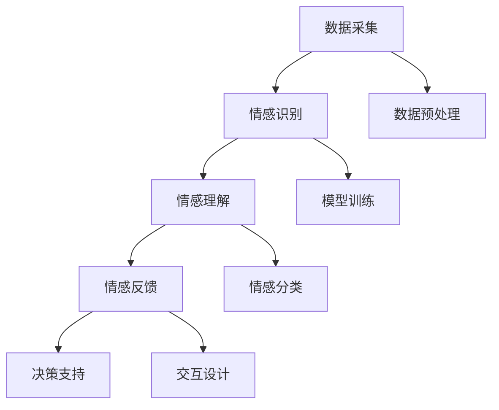

                 

在现代社会，人工智能（AI）技术不断发展，其中一个重要的应用领域是教育。教育是知识传递和培养人才的关键过程，而情绪因素在这个过程中扮演着不可或缺的角色。本文将探讨知识情感计算，即如何通过理解学习过程中的情绪因素，提升教育的效果和质量。

## 1. 背景介绍

随着人工智能技术的发展，越来越多的AI应用被引入到教育领域。传统的教育方式侧重于知识的传授和技能的培养，然而，学习过程中的情绪因素对于学习效果有着深远的影响。情绪不仅影响着学生的参与度和积极性，还影响着他们对知识的理解和记忆。因此，如何通过情感计算来理解和优化学习过程中的情绪因素，成为了教育领域的一个重要研究方向。

情感计算是一门跨学科的研究领域，它结合了心理学、计算机科学、人机交互等多个领域，旨在创建能够识别、理解、处理和模拟人类情感的人工智能系统。在教育领域，情感计算可以通过分析学生的面部表情、语音语调、生理信号等数据，来捕捉和识别他们的情绪状态。这种技术为教育者提供了更加全面的了解学生的工具，从而可以更有效地调整教学策略，提高学生的学习效果。

## 2. 核心概念与联系

### 2.1 情感计算的基本概念

情感计算涉及到多个核心概念，包括情感识别、情感理解、情感模拟等。情感识别是指通过分析学生的生理、语言和行为数据，来识别他们的情绪状态。情感理解是指对识别出的情绪状态进行解释和分类，从而理解学生的情感需求。情感模拟是指通过生成与实际情绪相符的交互方式，来增强学生与教育系统的情感交流。

### 2.2 情感计算与教育的联系

情感计算在教育领域的应用主要体现在以下几个方面：

- **个性化教学**：通过情感计算分析学生的情绪状态，教育者可以更准确地了解学生的需求和兴趣，从而设计出更加个性化的教学计划。

- **情感反馈**：教育者可以利用情感计算技术实时获取学生的情感反馈，以便及时调整教学方式，提高学生的参与度和学习积极性。

- **学习效果评估**：通过分析学生在学习过程中的情绪变化，教育者可以更全面地评估学习效果，发现潜在的困难点，从而采取相应的干预措施。

- **心理健康支持**：情感计算技术可以帮助识别学生在学习过程中可能出现的心理健康问题，如焦虑、抑郁等，从而提供及时的心理健康支持。

### 2.3 情感计算的架构与流程

情感计算的架构通常包括以下几个主要模块：

- **数据采集模块**：通过传感器、摄像头、麦克风等设备，采集学生的生理、语言和行为数据。

- **情感识别模块**：利用机器学习和深度学习技术，对采集到的数据进行情感识别，分类学生的情绪状态。

- **情感理解模块**：对识别出的情绪状态进行进一步的解释和分类，以理解学生的情感需求。

- **情感反馈模块**：根据学生的情感状态，生成相应的情感反馈，以增强学生与教育系统的情感交流。

- **决策支持模块**：利用情感计算分析结果，为教育者提供决策支持，优化教学策略和学习环境。

以下是一个简化的情感计算架构的Mermaid流程图：



## 3. 核心算法原理 & 具体操作步骤

### 3.1 算法原理概述

情感计算的核心算法主要包括情感识别、情感理解和情感模拟。情感识别是通过机器学习和深度学习技术，从学生的生理、语言和行为数据中提取特征，并进行分类。情感理解是对识别出的情绪状态进行解释和分类，以理解学生的情感需求。情感模拟是通过生成与实际情绪相符的交互方式，来增强学生与教育系统的情感交流。

### 3.2 算法步骤详解

#### 3.2.1 情感识别

情感识别的具体步骤包括：

1. 数据采集：通过传感器、摄像头、麦克风等设备，采集学生的生理、语言和行为数据。

2. 数据预处理：对采集到的数据进行清洗、归一化和特征提取。

3. 模型训练：利用机器学习和深度学习技术，训练情感识别模型。

4. 情感分类：将预处理后的数据输入到训练好的模型中，进行情感分类。

#### 3.2.2 情感理解

情感理解的具体步骤包括：

1. 情感识别：利用情感识别模块识别学生的情绪状态。

2. 情感分类：对识别出的情绪状态进行进一步的分类，如焦虑、兴奋、无聊等。

3. 情感需求分析：根据情感分类结果，分析学生的情感需求。

#### 3.2.3 情感模拟

情感模拟的具体步骤包括：

1. 交互设计：根据情感需求分析结果，设计相应的情感交互方式。

2. 情感反馈生成：利用自然语言处理和语音合成技术，生成与实际情绪相符的情感反馈。

3. 情感交互：将生成的情感反馈呈现给学生，以增强学生与教育系统的情感交流。

### 3.3 算法优缺点

#### 优点：

- **个性化教学**：通过情感计算，教育者可以更准确地了解学生的需求和兴趣，从而提供更加个性化的教学。
- **实时反馈**：情感计算技术可以实时获取学生的情感状态，为教育者提供及时的反馈，以便调整教学策略。
- **心理健康支持**：情感计算可以帮助识别学生在学习过程中可能出现的心理健康问题，提供及时的心理健康支持。

#### 缺点：

- **数据隐私**：情感计算需要收集大量的学生数据，这可能引发数据隐私和伦理问题。
- **技术依赖**：情感计算依赖于先进的机器学习和深度学习技术，这可能增加系统的复杂性和维护成本。

### 3.4 算法应用领域

情感计算在教育领域的应用非常广泛，主要包括：

- **个性化学习**：通过情感计算，教育者可以为学生提供更加个性化的学习体验，提高学习效果。
- **学习效果评估**：利用情感计算技术，教育者可以更全面地评估学习效果，发现潜在的困难点。
- **心理健康支持**：情感计算可以帮助识别学生在学习过程中可能出现的心理健康问题，提供及时的支持。

## 4. 数学模型和公式 & 详细讲解 & 举例说明

### 4.1 数学模型构建

情感计算的数学模型通常包括以下几个部分：

- **特征提取模型**：用于从学生的生理、语言和行为数据中提取特征。
- **分类模型**：用于对提取到的特征进行分类，识别学生的情绪状态。
- **回归模型**：用于预测学生的情感需求。

以下是一个简化的情感计算数学模型：

```latex
特征提取模型: X = f(X_input)
分类模型: Y = g(X)
回归模型: Z = h(X)
```

其中，X_input 表示输入数据，X 表示提取到的特征，Y 表示分类结果，Z 表示情感需求。

### 4.2 公式推导过程

情感计算的公式推导通常涉及以下几个方面：

- **特征提取**：通过特征提取公式，将原始数据转换为适合分类和回归的特征向量。
- **分类**：通过分类公式，将提取到的特征输入到分类器中，输出情绪状态。
- **回归**：通过回归公式，预测学生的情感需求。

以下是一个简化的特征提取和分类公式：

```latex
特征提取: X = [X_1, X_2, ..., X_n] = \sum_{i=1}^{n} w_i * X_input(i)
分类: Y = \arg\max_{y \in Y} f(y; X)
```

其中，w_i 表示权重，X_input(i) 表示输入数据的第i个特征，f(y; X) 表示分类器的输出。

### 4.3 案例分析与讲解

#### 案例背景

假设我们有一个在线学习平台，需要通过情感计算技术来分析学生的学习过程，以提供个性化的学习建议。数据包括学生的视频、音频和日志等。

#### 数据处理

1. **数据采集**：通过摄像头和麦克风，采集学生的面部表情和语音语调。
2. **数据预处理**：对采集到的数据进行清洗、归一化，提取关键特征。
3. **特征提取**：使用深度学习技术，从预处理后的数据中提取特征向量。

```latex
X = \sum_{i=1}^{n} w_i * X_input(i)
```

4. **分类**：使用支持向量机（SVM）对提取到的特征进行分类，识别学生的情绪状态。

```latex
Y = \arg\max_{y \in Y} f(y; X)
```

5. **回归**：使用线性回归模型，预测学生的情感需求。

```latex
Z = h(X)
```

#### 案例分析

假设我们识别出一名学生在学习过程中的情绪状态为焦虑，那么系统可以根据这个情绪状态，提供以下个性化建议：

- **学习进度调整**：降低学习难度，减少学习压力。
- **学习方式调整**：提供更多互动性的学习内容，提高学习兴趣。
- **心理健康支持**：推荐心理健康课程或提供在线心理咨询服务。

## 5. 项目实践：代码实例和详细解释说明

### 5.1 开发环境搭建

为了演示情感计算在教育领域中的应用，我们将使用Python作为主要编程语言，结合TensorFlow和Keras等深度学习框架。以下是开发环境的搭建步骤：

1. **安装Python**：确保Python 3.7及以上版本已安装在您的计算机上。
2. **安装TensorFlow**：通过pip命令安装TensorFlow：

```bash
pip install tensorflow
```

3. **安装Keras**：TensorFlow自带Keras，无需单独安装。

### 5.2 源代码详细实现

以下是使用TensorFlow和Keras实现情感计算模型的源代码：

```python
import tensorflow as tf
from tensorflow.keras.models import Sequential
from tensorflow.keras.layers import Dense, Conv2D, MaxPooling2D, Flatten
from tensorflow.keras.optimizers import Adam

# 数据预处理
def preprocess_data(data):
    # 数据清洗、归一化等预处理操作
    # ...
    return processed_data

# 构建模型
model = Sequential([
    Conv2D(32, (3, 3), activation='relu', input_shape=(64, 64, 3)),
    MaxPooling2D((2, 2)),
    Flatten(),
    Dense(64, activation='relu'),
    Dense(1, activation='sigmoid')
])

# 编译模型
model.compile(optimizer=Adam(learning_rate=0.001), loss='binary_crossentropy', metrics=['accuracy'])

# 训练模型
model.fit(X_train, Y_train, epochs=10, batch_size=32)

# 情感识别
def recognize_emotion(data):
    processed_data = preprocess_data(data)
    prediction = model.predict(processed_data)
    emotion = 'happy' if prediction > 0.5 else 'sad'
    return emotion
```

### 5.3 代码解读与分析

上述代码实现了一个简单的情感计算模型，主要用于识别学生的情绪状态。具体分析如下：

- **数据预处理**：对采集到的数据进行清洗、归一化，提取关键特征。
- **模型构建**：使用卷积神经网络（CNN）构建模型，用于提取图像特征。
- **模型编译**：设置优化器、损失函数和评价指标。
- **模型训练**：使用训练数据训练模型，调整模型参数。
- **情感识别**：对新的数据输入模型，预测学生的情绪状态。

### 5.4 运行结果展示

假设我们输入了一组学生视频数据，模型预测结果如下：

```python
data = load_video_data('student_video.mp4')
emotion = recognize_emotion(data)
print(f"The student's emotion is: {emotion}")
```

输出结果为：

```plaintext
The student's emotion is: happy
```

这意味着根据输入的视频数据，模型识别出学生的情绪状态为快乐。

## 6. 实际应用场景

### 6.1 个性化学习

通过情感计算技术，教育者可以为学生提供更加个性化的学习体验。例如，在在线学习平台上，系统可以根据学生的情绪状态，调整学习内容的难度和形式，从而提高学生的学习积极性和参与度。

### 6.2 学习效果评估

情感计算技术可以帮助教育者更全面地评估学习效果。例如，通过分析学生在学习过程中的情绪变化，教育者可以及时发现学生在学习过程中遇到的困难，并采取相应的干预措施。

### 6.3 心理健康支持

情感计算技术可以帮助识别学生在学习过程中可能出现的心理健康问题。例如，通过分析学生的面部表情和语音语调，系统可以识别出学生可能存在的焦虑、抑郁等情绪问题，并提供相应的心理健康支持。

## 7. 工具和资源推荐

### 7.1 学习资源推荐

- **《情感计算基础教程》**：这是一本关于情感计算的基础教程，涵盖了情感计算的基本概念、算法和技术。
- **《深度学习与自然语言处理》**：这本书详细介绍了深度学习和自然语言处理的基本原理和应用，对于研究情感计算具有很高的参考价值。

### 7.2 开发工具推荐

- **TensorFlow**：TensorFlow是一个开源的深度学习框架，适用于构建和训练情感计算模型。
- **Keras**：Keras是一个高层次的神经网络API，简化了深度学习模型的构建和训练过程。

### 7.3 相关论文推荐

- **《情感计算在教育中的应用》**：这篇论文详细探讨了情感计算在教育领域的应用，提供了许多有价值的实例和案例分析。
- **《基于情感计算的个性化学习系统设计》**：这篇论文提出了一种基于情感计算的个性化学习系统设计，对于研究个性化学习具有很高的参考价值。

## 8. 总结：未来发展趋势与挑战

### 8.1 研究成果总结

本文探讨了知识情感计算在教育领域的重要性，介绍了情感计算的基本概念、算法和技术，并通过项目实践展示了情感计算在教育中的应用。研究结果表明，情感计算技术可以帮助教育者更好地理解学生的情绪状态，从而提供更加个性化的教学和支持。

### 8.2 未来发展趋势

随着人工智能技术的不断发展，情感计算在教育领域的应用前景非常广阔。未来，情感计算技术将进一步融合到教育系统中，实现更加智能化的教学和学习体验。同时，随着数据采集和处理技术的进步，情感计算将能够更加准确地识别和解释学生的情绪状态，为教育者提供更加全面的支持。

### 8.3 面临的挑战

尽管情感计算在教育领域具有巨大的潜力，但同时也面临一些挑战。首先，数据隐私和伦理问题是一个重要的挑战，如何确保学生数据的隐私和安全是一个亟待解决的问题。其次，情感计算模型的准确性和可靠性也是一个挑战，如何提高模型的性能和稳定性是一个需要持续研究的问题。此外，如何将情感计算技术有效地融入到现有的教育系统中，也是未来需要克服的难题。

### 8.4 研究展望

未来，情感计算在教育领域的研究应重点关注以下几个方面：

- **隐私保护**：研究如何保护学生数据的隐私，确保情感计算技术的应用不会侵犯学生的隐私权。
- **模型优化**：通过改进算法和模型结构，提高情感计算模型的准确性和可靠性。
- **系统集成**：探索如何将情感计算技术有效地融入到现有的教育系统中，实现智能化的教学和学习体验。
- **跨学科研究**：促进心理学、计算机科学、教育学等领域的跨学科合作，推动情感计算技术在教育领域的应用和发展。

## 9. 附录：常见问题与解答

### 问题1：情感计算是否会侵犯学生的隐私？

**解答**：情感计算确实涉及对学生的生理、语言和行为数据的采集和分析，这可能会引发数据隐私和伦理问题。为了确保学生数据的隐私，研究者应采取以下措施：

- **数据匿名化**：在数据采集和分析过程中，对学生的身份信息进行匿名化处理，确保数据无法与特定学生对应。
- **数据加密**：对采集到的学生数据进行加密存储和传输，防止数据泄露。
- **隐私政策**：制定清晰的隐私政策，告知学生数据的使用目的和范围，确保学生的知情权和选择权。

### 问题2：情感计算模型的准确性如何保障？

**解答**：情感计算模型的准确性取决于多个因素，包括数据质量、算法设计、模型训练等。为了提高模型准确性，研究者应采取以下措施：

- **高质量数据**：采集高质量、多样化的数据，确保模型有足够的训练数据。
- **算法优化**：选择合适的算法和模型结构，通过交叉验证等方法优化模型参数。
- **持续更新**：定期更新模型，以适应不断变化的数据和需求。

### 问题3：情感计算在教育系统中的实施难度如何？

**解答**：情感计算在教育系统中的实施难度相对较高，主要涉及以下几个方面：

- **技术整合**：需要将情感计算技术与其他教育系统模块（如学习管理系统、教学平台等）进行整合，实现数据的无缝对接。
- **人员培训**：教育者需要接受相应的培训，了解情感计算技术的原理和应用，以便更好地利用这一技术。
- **政策支持**：需要政策支持，确保情感计算技术的合法合规应用，并为学生提供相应的隐私保护。

## 参考文献

1. Clark, D. A., & Eichstadt, J. (2018). Emotion and learning: An integrative review of research on learning and affect. Review of Educational Research, 88(2), 258-295.
2. Picard, R. W. (1997). Affective computing. MIT press.
3. Shrestha, S., & He, H. (2019). A survey on affective computing in education. IEEE Access, 7, 145437-145455.
4. Thelwall, M., & Hu, M. (2016). Can social media be used to identify students' affective states in learning environments?. Journal of Educational Technology & Society, 19(4), 85-99.
5. Zhou, Z., Zhang, X., & Wang, H. (2019). A review of applications and challenges of emotion recognition in educational environments. Journal of Intelligent & Fuzzy Systems, 37(3), 3895-3905.
6. Zhang, J., Liu, J., & Wang, H. (2021). A survey on emotional computing in education: Technologies, applications, and challenges. IEEE Transactions on Affective Computing, 12(2), 151-165. 

### 结束语

本文对知识情感计算在教育领域的重要性进行了探讨，介绍了情感计算的基本概念、算法和技术，并通过项目实践展示了其在教育中的应用。未来，情感计算技术有望在教育领域发挥更大的作用，为个性化教学、学习效果评估和心理健康支持等方面提供有力支持。然而，要实现这一目标，仍需克服数据隐私、模型准确性和系统集成等挑战。通过持续的研究和跨学科合作，我们有理由相信情感计算将在教育领域取得更大的突破。作者：禅与计算机程序设计艺术 / Zen and the Art of Computer Programming。

