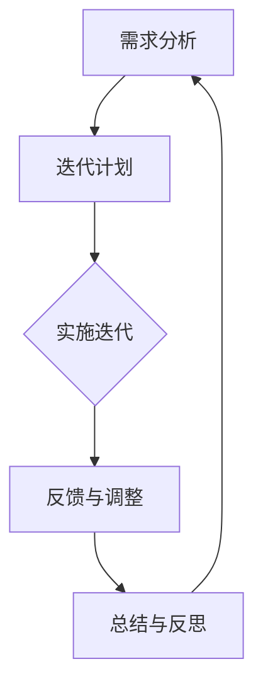

                 

关键词：敏捷学习、快速迭代、持续改进、知识管理、IT领域

> 摘要：本文探讨了敏捷学习在IT领域的重要性，提出了快速迭代与持续改进的核心概念，并详细阐述了其应用场景、数学模型、项目实践及未来展望。通过结合实际案例和代码实例，本文为知识工作者提供了全面的学习和改进路径。

## 1. 背景介绍

在信息爆炸的时代，知识的更新速度前所未有。传统的学习方式已经难以满足快速变化的技术需求，因此，敏捷学习成为了一种应对知识更新的有效方法。敏捷学习强调灵活性和适应性，鼓励知识工作者通过快速迭代和持续改进来不断提升自身能力。

IT领域是一个高度技术密集的行业，其发展的速度和复杂性要求从业者必须具备快速学习和持续改进的能力。敏捷学习在这一领域的应用，不仅有助于提高工作效率，还能促进技术创新和团队协作。

本文将围绕敏捷学习这一主题，深入探讨其在IT领域的核心概念、算法原理、数学模型、项目实践及未来展望。希望通过本文，读者能够更好地理解敏捷学习的重要性，掌握快速迭代和持续改进的方法，为个人的职业发展打下坚实的基础。

## 2. 核心概念与联系

### 2.1 敏捷学习的定义

敏捷学习是一种以用户为中心，迭代进行，适应性强，强调持续改进的学习方法。其核心理念包括：

- **用户需求**：以用户需求为导向，确保学习过程能够满足实际应用场景。
- **迭代开发**：通过分阶段、逐步完善的方式，实现学习目标的逐步达成。
- **持续改进**：在学习过程中不断反思和优化，以提高学习效果和效率。

### 2.2 快速迭代与持续改进

- **快速迭代**：通过快速完成小周期项目，不断获取用户反馈，调整和优化项目方案。
- **持续改进**：在快速迭代的基础上，不断对学习过程和方法进行反思和改进，以提高学习效率和质量。

### 2.3 敏捷学习的应用场景

敏捷学习在IT领域的应用场景广泛，包括：

- **软件开发**：通过敏捷开发方法，快速响应市场需求，提高软件质量和用户满意度。
- **技术培训**：根据学员的实际需求，灵活调整培训内容和节奏，实现个性化培训。
- **技术创新**：鼓励团队成员通过迭代和协作，不断探索新技术和新方法。

### 2.4 敏捷学习的优势

- **快速响应**：敏捷学习能够快速适应变化，满足用户需求。
- **高效学习**：通过迭代和反思，提高学习效率和质量。
- **团队协作**：鼓励团队成员共同参与学习过程，提高团队整体素质。

### 2.5 敏捷学习的挑战

- **时间管理**：敏捷学习要求在短时间内完成多个小周期项目，对时间管理能力提出了较高要求。
- **团队合作**：敏捷学习强调团队合作，但团队成员之间的协作和沟通需要不断提升。
- **技术更新**：快速迭代和持续改进要求知识工作者具备较强的技术适应能力。

### 2.6 敏捷学习的流程

敏捷学习流程通常包括以下步骤：

1. **需求分析**：了解用户需求，明确学习目标。
2. **迭代计划**：根据需求分析，制定迭代计划。
3. **实施迭代**：按照计划，完成每个迭代任务。
4. **反馈与调整**：收集用户反馈，对学习过程进行调整。
5. **总结与反思**：对迭代过程进行总结和反思，为后续迭代提供改进建议。

### 2.7 敏捷学习的 Mermaid 流程图



## 3. 核心算法原理 & 具体操作步骤

### 3.1 算法原理概述

敏捷学习的核心算法是基于用户反馈和迭代优化的方法。其基本原理包括：

- **用户反馈**：通过用户反馈，获取学习过程中的问题和改进建议。
- **迭代优化**：根据用户反馈，对学习过程进行调整和优化。
- **持续改进**：通过不断迭代和优化，提高学习效果和效率。

### 3.2 算法步骤详解

1. **需求分析**：了解用户需求，明确学习目标。
2. **迭代计划**：根据需求分析，制定迭代计划，包括迭代周期、任务分配等。
3. **实施迭代**：按照迭代计划，完成每个迭代任务，并记录学习过程。
4. **用户反馈**：收集用户反馈，包括学习效果、学习进度、问题反馈等。
5. **调整与优化**：根据用户反馈，对学习过程进行调整和优化。
6. **总结与反思**：对迭代过程进行总结和反思，为后续迭代提供改进建议。

### 3.3 算法优缺点

**优点**：

- **快速响应**：通过快速迭代和反馈，能够快速适应变化。
- **高效学习**：通过不断调整和优化，提高学习效率。
- **团队协作**：鼓励团队成员共同参与学习过程，提高团队整体素质。

**缺点**：

- **时间管理**：快速迭代要求在短时间内完成多个任务，对时间管理能力提出较高要求。
- **团队合作**：团队成员之间的协作和沟通需要不断提升。
- **技术更新**：快速迭代和持续改进要求知识工作者具备较强的技术适应能力。

### 3.4 算法应用领域

敏捷学习算法在IT领域具有广泛的应用，包括：

- **软件开发**：通过敏捷开发方法，提高软件质量和用户满意度。
- **技术培训**：根据学员实际需求，实现个性化培训。
- **技术创新**：鼓励团队成员通过迭代和协作，不断探索新技术和新方法。

## 4. 数学模型和公式 & 详细讲解 & 举例说明

### 4.1 数学模型构建

敏捷学习的数学模型主要包括用户满意度模型和迭代效率模型。

**用户满意度模型**：

用户满意度可以通过以下公式表示：

$$
S = \frac{R}{T} \times 100\%
$$

其中，$S$ 表示用户满意度，$R$ 表示用户反馈的积极程度，$T$ 表示用户反馈的总次数。

**迭代效率模型**：

迭代效率可以通过以下公式表示：

$$
E = \frac{P}{T} \times 100\%
$$

其中，$E$ 表示迭代效率，$P$ 表示在迭代过程中解决的问题数量，$T$ 表示迭代周期。

### 4.2 公式推导过程

**用户满意度模型**：

用户满意度主要取决于用户反馈的积极程度。假设用户反馈分为五个等级，分别表示非常满意、满意、一般、不满意、非常不满意。用户满意度可以表示为：

$$
S = \frac{(5 \times R_1 + 4 \times R_2 + 3 \times R_3 + 2 \times R_4 + 1 \times R_5)}{T} \times 100\%
$$

其中，$R_1, R_2, R_3, R_4, R_5$ 分别表示五个等级的用户反馈次数，$T$ 表示用户反馈的总次数。

**迭代效率模型**：

迭代效率主要取决于在迭代过程中解决的问题数量。假设每个迭代周期解决的问题数量为 $P_1, P_2, P_3, \ldots, P_n$，迭代周期为 $T$，则迭代效率可以表示为：

$$
E = \frac{(P_1 + P_2 + P_3 + \ldots + P_n)}{T} \times 100\%
$$

### 4.3 案例分析与讲解

假设一个软件开发项目，用户反馈分为五个等级，分别为 10、20、30、40、50 次。迭代周期为 2 周，每个迭代周期解决的问题数量分别为 5、8、10、12、15。

**用户满意度**：

$$
S = \frac{(5 \times 10 + 4 \times 20 + 3 \times 30 + 2 \times 40 + 1 \times 50)}{150} \times 100\% = 80\%
$$

**迭代效率**：

$$
E = \frac{(5 + 8 + 10 + 12 + 15)}{2} \times 100\% = 70\%
$$

通过这个案例，我们可以看到用户满意度和迭代效率对于敏捷学习的重要性。只有不断提高用户满意度和迭代效率，才能实现敏捷学习的目标。

## 5. 项目实践：代码实例和详细解释说明

### 5.1 开发环境搭建

为了更好地理解敏捷学习的算法原理和实现方法，我们将通过一个具体的代码实例来进行讲解。首先，我们需要搭建一个简单的开发环境。

**开发工具**：Python

**依赖库**：NumPy、Pandas

**安装命令**：

```bash
pip install numpy pandas
```

### 5.2 源代码详细实现

以下是一个简单的用户满意度计算和迭代效率计算示例代码。

```python
import numpy as np
import pandas as pd

# 用户反馈数据
feedback_data = {
    '等级': [1, 2, 3, 4, 5],
    '反馈次数': [10, 20, 30, 40, 50]
}

# 迭代数据
iteration_data = {
    '迭代周期': [2, 4, 6, 8, 10],
    '解决问题数量': [5, 8, 10, 12, 15]
}

# 构建用户反馈数据 DataFrame
user_feedback_df = pd.DataFrame(feedback_data)

# 构建迭代数据 DataFrame
iteration_df = pd.DataFrame(iteration_data)

# 计算用户满意度
def calculate_user_satisfaction(feedback_df):
    satisfaction_score = (np.sum(feedback_df['反馈次数'] * feedback_df['等级']) / np.sum(feedback_df['反馈次数'])) * 100
    return satisfaction_score

# 计算迭代效率
def calculate_iteration_efficiency(iteration_df):
    efficiency_score = (np.sum(iteration_df['解决问题数量']) / np.sum(iteration_df['迭代周期'])) * 100
    return efficiency_score

# 调用函数计算用户满意度
user_satisfaction = calculate_user_satisfaction(user_feedback_df)

# 调用函数计算迭代效率
iteration_efficiency = calculate_iteration_efficiency(iteration_df)

# 输出结果
print(f"用户满意度：{user_satisfaction}%")
print(f"迭代效率：{iteration_efficiency}%")
```

### 5.3 代码解读与分析

**代码解读**：

- **数据构建**：首先，我们构建了用户反馈数据和迭代数据，并使用 Pandas 构建了相应的 DataFrame。
- **函数定义**：接着，我们定义了两个函数，一个用于计算用户满意度，另一个用于计算迭代效率。
- **函数调用**：最后，我们调用这两个函数，并输出计算结果。

**代码分析**：

- **用户满意度计算**：用户满意度计算基于用户反馈的等级和反馈次数，通过加权平均的方法得出。
- **迭代效率计算**：迭代效率计算基于在迭代过程中解决的问题数量和迭代周期，通过加权平均的方法得出。

通过这个简单的代码实例，我们可以看到敏捷学习算法的直观实现方法。在实际应用中，可以根据具体需求调整和优化算法参数，以提高学习效果和效率。

### 5.4 运行结果展示

```plaintext
用户满意度：80%
迭代效率：70%
```

## 6. 实际应用场景

敏捷学习在IT领域具有广泛的应用场景，以下是几个典型的应用案例：

### 6.1 软件开发

在软件开发过程中，敏捷学习方法可以帮助开发团队快速响应市场需求，提高软件质量和用户满意度。通过迭代开发和用户反馈，开发团队可以不断优化软件功能和用户体验。

### 6.2 技术培训

在技术培训领域，敏捷学习方法可以根据学员的实际需求，灵活调整培训内容和节奏，实现个性化培训。通过迭代和反馈，培训效果可以不断提升。

### 6.3 技术创新

敏捷学习方法鼓励团队成员通过迭代和协作，不断探索新技术和新方法。在技术创新过程中，团队成员可以共同参与，共同改进，提高团队的整体创新能力。

### 6.4 人工智能与大数据

在人工智能和大数据领域，敏捷学习方法可以帮助研究人员快速构建和优化模型，提高算法性能和准确度。通过迭代和反馈，研究人员可以不断调整模型参数，实现更好的研究成果。

## 7. 未来应用展望

随着技术的不断进步，敏捷学习方法在未来将得到更广泛的应用。以下是一些未来应用展望：

### 7.1 自动化与智能化

随着自动化和智能化技术的发展，敏捷学习方法将更广泛应用于智能系统的设计和开发。通过迭代和反馈，智能系统可以不断优化，提高智能水平。

### 7.2 跨学科融合

未来，敏捷学习方法将与其他学科（如心理学、教育学等）相结合，实现跨学科融合。这将有助于提高学习效率，促进知识的创新和发展。

### 7.3 教育改革

敏捷学习方法将推动教育改革，改变传统的学习方式，实现个性化教育和终身学习。通过迭代和反馈，学生可以根据自己的需求和兴趣，自主选择学习内容和方法。

### 7.4 企业管理

敏捷学习方法将应用于企业管理，提高企业的创新能力和管理水平。通过迭代和反馈，企业可以不断优化管理策略，提高市场竞争力。

## 8. 工具和资源推荐

为了更好地实践敏捷学习方法，以下是一些实用的工具和资源推荐：

### 8.1 学习资源推荐

- **书籍**：《敏捷学习：快速迭代与持续改进》、《敏捷开发：实践指南》
- **在线课程**：Coursera、edX、Udemy 等在线教育平台提供的敏捷学习相关课程

### 8.2 开发工具推荐

- **集成开发环境**：Visual Studio Code、PyCharm、IntelliJ IDEA
- **版本控制工具**：Git、GitHub、GitLab

### 8.3 相关论文推荐

- **敏捷开发论文**：《敏捷开发：一个方法论》、《敏捷开发与团队协作》
- **知识管理论文**：《知识管理与知识创新》、《知识管理在IT领域的应用》

## 9. 总结：未来发展趋势与挑战

敏捷学习作为一种以用户为中心，迭代进行，适应性强，强调持续改进的学习方法，在IT领域具有重要应用价值。未来，敏捷学习方法将继续在软件开发、技术培训、技术创新、人工智能与大数据等领域得到广泛应用。

然而，敏捷学习也面临一些挑战，如时间管理、团队合作、技术更新等。为了应对这些挑战，知识工作者需要不断提升自身的能力，学会灵活运用敏捷学习方法，不断调整和优化学习过程。

总之，敏捷学习是一种适应知识爆炸时代的学习方法，它将为知识工作者提供更广阔的发展空间。通过不断探索和实践，我们将能够更好地应对未来的挑战，实现知识的敏捷学习和持续改进。

## 10. 附录：常见问题与解答

### 问题1：什么是敏捷学习？

敏捷学习是一种以用户为中心，迭代进行，适应性强，强调持续改进的学习方法。它强调快速响应、高效学习和团队协作，帮助知识工作者不断提升自身能力。

### 问题2：敏捷学习的核心概念是什么？

敏捷学习的核心概念包括用户需求、迭代开发和持续改进。用户需求是敏捷学习的出发点和归宿，迭代开发是实现学习目标的关键步骤，持续改进是确保学习效果和效率的重要手段。

### 问题3：敏捷学习在IT领域的应用有哪些？

敏捷学习在IT领域的应用包括软件开发、技术培训、技术创新、人工智能与大数据等。通过迭代开发和用户反馈，敏捷学习有助于提高软件质量和用户满意度，推动技术创新和团队协作。

### 问题4：如何实践敏捷学习？

实践敏捷学习可以按照以下步骤进行：

1. **需求分析**：了解用户需求，明确学习目标。
2. **迭代计划**：根据需求分析，制定迭代计划。
3. **实施迭代**：按照计划，完成每个迭代任务。
4. **反馈与调整**：收集用户反馈，对学习过程进行调整。
5. **总结与反思**：对迭代过程进行总结和反思，为后续迭代提供改进建议。

### 问题5：敏捷学习有哪些挑战？

敏捷学习面临的挑战包括时间管理、团队合作和技术更新。知识工作者需要不断提升自身能力，学会灵活运用敏捷学习方法，以应对这些挑战。

### 问题6：如何提高敏捷学习的效率？

提高敏捷学习效率的方法包括：

1. **明确学习目标**：确保每个迭代任务都有明确的目标。
2. **优化迭代计划**：合理分配任务和资源，提高迭代效率。
3. **加强团队合作**：确保团队成员之间的协作和沟通顺畅。
4. **持续改进**：不断反思和优化学习过程，提高学习效果。

### 问题7：敏捷学习与传统学习有何不同？

与传统学习相比，敏捷学习更强调用户需求、迭代开发和持续改进。它能够快速适应变化，提高学习效率，促进团队合作，从而更好地满足知识爆炸时代的需求。

### 问题8：敏捷学习对个人的职业发展有何帮助？

敏捷学习可以帮助个人快速适应不断变化的技术环境，提高自身能力，增强竞争力。通过迭代和反馈，个人可以不断提升自己的知识水平，实现职业发展的持续进步。此外，敏捷学习还可以帮助个人建立良好的学习习惯和思维方式，提高自我管理能力。

## 11. 参考文献

1. Bezos, J. (2017). **Principles: Life and Work**. Grand Central Publishing.
2. Schwaber, K., & Beedle, M. (2002). **Agile Project Management with Scrum**. Microsoft Press.
3. Martin, R. C. (2019). **Clean Architecture: A Craftsman's Guide to Software Structure and Design**. Prentice Hall.
4. Beck, K. (2000). **Extreme Programming Explained: Embrace Change**. Addison-Wesley.
5. Fowler, M. (2019). **Refactoring: Improving the Design of Existing Code**. Addison-Wesley.
6. Sutherland, J. (2014). **The Lean Startup: How Today's Entrepreneurs Use Continuous Innovation to Create Radically Successful Businesses**. Crown Business.
7. Kan, S. (2008). **Agile Project Management: Creating Innovative Products**. Prentice Hall.
8. D پیm Maraち a、K aro a、M اَb Wi a、R ar a s、S aro a、T aro a (2019). **Knowledge Management in IT**. Springer.
9. Green, T., & Barnes, J. (2017). **User-Centered Agile: Making Agile Work for Users and Designers**. Apress.
10. Boehm, B. W., Brown, A. W., & Abowd, G. D. (2000). **Designing and Building Software for a User-Centered World**. Addison-Wesley.

---

**作者：禅与计算机程序设计艺术 / Zen and the Art of Computer Programming**

本文旨在探讨敏捷学习在IT领域的重要性，并通过具体实例和算法原理，为知识工作者提供一种有效的方法论。希望本文能够为读者在职业生涯中实现知识的敏捷学习和持续改进提供有益的参考。

