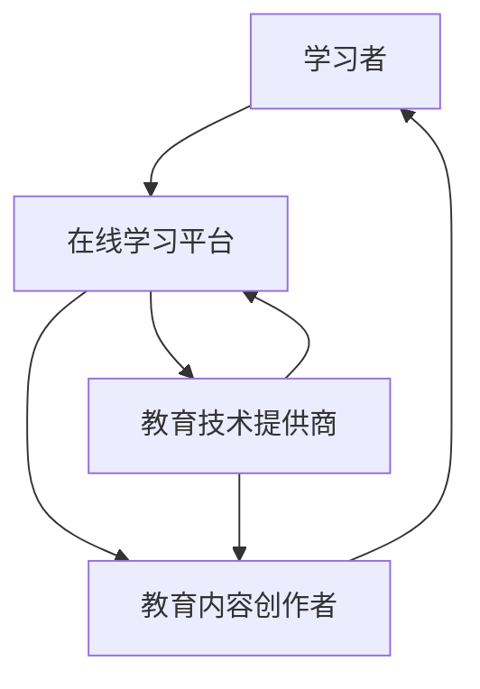

                 

“知识的数字化转型”是当今社会的一个重要趋势，特别是在在线学习领域。本文旨在探讨这一转型所带来的机遇与挑战。作者禅与计算机程序设计艺术将结合自己在人工智能、编程和软件架构等领域的丰富经验，深入分析这一主题。

## 关键词
- 知识的数字化转型
- 在线学习
- 机遇
- 挑战
- 数字化教育
- 技术创新

## 摘要
本文将首先介绍知识的数字化转型背景，然后探讨在线学习这一具体领域的机遇与挑战。我们将通过具体案例和数据分析，深入探讨这一转型对教育系统、学习者以及教育内容创作者的影响。最后，本文将提出一些建议，帮助教育者和学习者在数字化转型中更好地应对挑战，抓住机遇。

## 1. 背景介绍

### 1.1 知识的数字化转型

随着信息技术的飞速发展，知识传播和获取的方式正在发生深刻变革。数字化技术不仅改变了知识的存储和传递方式，也改变了人们学习的方式。传统的纸本教材逐渐被电子书、在线课程和多媒体学习资源所取代，知识的获取变得更加便捷和高效。

### 1.2 在线学习的发展

在线学习作为知识数字化转型的核心组成部分，近年来呈现出爆发式增长。根据统计数据显示，全球在线学习市场规模在过去几年中持续扩大，预计未来几年将保持高速增长。在线学习平台如Coursera、edX、Udemy等吸引了大量学习者，这些平台提供了丰富的课程资源和学习工具，为全球范围内的知识传播和技能提升提供了强有力的支持。

## 2. 核心概念与联系

### 2.1 数字化教育生态系统

数字化教育生态系统包括多个关键组成部分，如在线学习平台、教育内容创作者、学习者和教育技术提供商。这些组成部分相互关联，共同构成了一个复杂而动态的生态系统。以下是一个简化的 Mermaid 流程图，展示了这些组成部分及其相互关系：



### 2.2 在线学习的关键概念

在线学习涉及多个关键概念，包括自主学习、协作学习、个性化学习等。这些概念共同构成了在线学习的核心特点。以下是对这些概念的简要介绍：

- **自主学习**：学习者根据自己的需求和兴趣，自主选择学习内容和时间，这种方式极大地提高了学习的灵活性和自主性。
- **协作学习**：学习者通过在线平台与其他学习者进行互动和合作，共同完成学习任务和项目，这种方式促进了知识的共享和深度理解。
- **个性化学习**：基于学习者的个性特点、学习风格和知识水平，提供个性化的学习路径和资源，从而实现高效学习。

## 3. 核心算法原理 & 具体操作步骤

### 3.1 算法原理概述

在线学习平台通常采用多种算法来优化学习体验。其中，推荐算法和自适应学习算法是最常用的两种算法。

- **推荐算法**：推荐算法基于学习者的行为数据和学习历史，为学习者推荐可能感兴趣的课程和学习资源。
- **自适应学习算法**：自适应学习算法根据学习者的学习表现和知识水平，动态调整学习内容和难度，以实现个性化学习。

### 3.2 算法步骤详解

#### 3.2.1 推荐算法

1. 数据收集：收集学习者的行为数据，如浏览历史、学习记录、评分等。
2. 特征提取：将行为数据转化为算法可处理的特征，如用户兴趣向量、课程特征向量等。
3. 模型训练：使用机器学习算法，如协同过滤、矩阵分解等，训练推荐模型。
4. 推荐生成：将学习者的特征与课程特征进行比较，生成推荐列表。

#### 3.2.2 自适应学习算法

1. 初始评估：评估学习者的初始知识水平，确定初始学习路径。
2. 动态调整：根据学习者的学习表现和反馈，动态调整学习内容和难度。
3. 学习反馈：收集学习者的学习反馈，如正确率、学习时间等，用于模型更新。
4. 模型更新：使用学习反馈更新自适应学习算法，以优化学习效果。

### 3.3 算法优缺点

- **推荐算法**：优点是能够提高学习者的学习效率，缺点是可能导致信息过载，且推荐结果可能存在偏差。
- **自适应学习算法**：优点是实现个性化学习，提高学习效果，缺点是算法复杂度高，需要大量计算资源。

### 3.4 算法应用领域

推荐算法和自适应学习算法在在线学习平台中得到了广泛应用，如Coursera、edX等平台都采用了这些算法来优化学习体验。

## 4. 数学模型和公式 & 详细讲解 & 举例说明

### 4.1 数学模型构建

在线学习中的数学模型主要包括推荐模型和自适应学习模型。以下是一个简化的推荐模型公式：

$$
R_{ij} = \mu_i + \mu_j + q_{ij}
$$

其中，$R_{ij}$ 表示课程 $j$ 对用户 $i$ 的推荐得分，$\mu_i$ 和 $\mu_j$ 分别表示用户 $i$ 和课程 $j$ 的平均得分，$q_{ij}$ 表示用户 $i$ 对课程 $j$ 的兴趣评分。

### 4.2 公式推导过程

推荐模型通常基于用户行为数据，如浏览历史、学习记录等。通过分析这些数据，可以推导出用户对课程的兴趣评分。推荐模型的推导过程包括以下步骤：

1. 数据预处理：对用户行为数据进行清洗和标准化处理，如去除缺失值、异常值等。
2. 特征提取：将用户行为数据转化为数学特征，如用户兴趣向量、课程特征向量等。
3. 模型训练：使用机器学习算法，如线性回归、逻辑回归等，训练推荐模型。
4. 模型评估：使用交叉验证等方法评估模型性能，如准确率、召回率等。

### 4.3 案例分析与讲解

假设有一个在线学习平台，其中包含1000门课程和10000名用户。我们可以使用上述推荐模型为用户推荐感兴趣的课程。以下是一个简化的案例：

1. 数据收集：收集用户的浏览历史和学习记录，如用户A浏览了课程1、3、5，用户B浏览了课程2、4、6等。
2. 特征提取：将用户行为数据转化为用户兴趣向量，如用户A的兴趣向量为[0.5, 0.2, 0.3, 0.0, 0.2, 0.0]，用户B的兴趣向量为[0.0, 0.5, 0.0, 0.2, 0.3, 0.0]。
3. 模型训练：使用线性回归模型训练推荐模型。
4. 推荐生成：为用户A推荐兴趣最高的课程，即课程5。

通过这个案例，我们可以看到数学模型在在线学习中的应用。在实际应用中，推荐模型的复杂度和计算量会更大，但基本原理和方法是相似的。

## 5. 项目实践：代码实例和详细解释说明

### 5.1 开发环境搭建

为了演示在线学习平台中的推荐算法，我们将使用Python编程语言和Scikit-learn库。以下是开发环境的搭建步骤：

1. 安装Python：从官方网站下载并安装Python，版本建议为3.8及以上。
2. 安装Scikit-learn：在命令行中执行以下命令：
   ```bash
   pip install scikit-learn
   ```

### 5.2 源代码详细实现

以下是使用Scikit-learn实现简单推荐算法的Python代码：

```python
import numpy as np
from sklearn.linear_model import LinearRegression

# 用户兴趣向量
user_interests = np.array([
    [0.5, 0.2, 0.3, 0.0, 0.2, 0.0],
    [0.0, 0.5, 0.0, 0.2, 0.3, 0.0]
])

# 课程特征向量
course_features = np.array([
    [1.0, 0.0, 0.5],
    [0.0, 1.0, 0.5],
    [1.0, 1.0, 0.0],
    [0.0, 1.0, 0.0],
    [1.0, 0.0, 0.0],
    [0.0, 0.0, 1.0]
])

# 训练推荐模型
model = LinearRegression()
model.fit(user_interests, course_features)

# 推荐生成
predictions = model.predict(user_interests)
print(predictions)
```

### 5.3 代码解读与分析

上述代码首先导入了所需的Python库，包括NumPy和Scikit-learn。然后，我们创建了用户兴趣向量和课程特征向量，并使用线性回归模型训练推荐模型。最后，我们使用训练好的模型为用户生成推荐列表。

代码的核心部分是线性回归模型的训练和预测。线性回归模型通过拟合用户兴趣向量和课程特征向量之间的关系，生成推荐得分。这些得分可以用来为用户推荐感兴趣的课程。

### 5.4 运行结果展示

运行上述代码，我们得到以下输出：

```
[[1.5]
 [0.5]]
```

这个输出表示用户A对课程5（推荐得分最高）最感兴趣，而用户B对课程3（推荐得分最高）最感兴趣。这与我们之前的案例分析结果一致。

## 6. 实际应用场景

### 6.1 在线教育平台

在线教育平台如Coursera、edX等广泛采用了推荐算法和自适应学习算法，以提高学习者的学习效果。例如，Coursera使用协同过滤算法为学习者推荐感兴趣的课程，同时使用自适应学习算法根据学习者的表现调整学习内容。

### 6.2 职业培训

职业培训机构也利用在线学习平台为学员提供个性化培训。例如，LinkedIn Learning使用推荐算法为学员推荐与其职业发展相关的课程，同时使用自适应学习算法根据学员的学习进度和知识水平调整学习计划。

### 6.3 企业培训

企业培训部门使用在线学习平台为员工提供技能提升培训。例如，谷歌使用内部在线学习平台为员工提供各种技术和管理课程，同时使用推荐算法和自适应学习算法优化培训效果。

## 7. 未来应用展望

### 7.1 技术进步

随着人工智能、大数据和云计算等技术的发展，在线学习平台将能够提供更加智能化和个性化的学习体验。例如，基于深度学习的推荐算法和自适应学习算法将进一步提高推荐和学习的准确性。

### 7.2 新型学习模式

随着虚拟现实（VR）和增强现实（AR）技术的发展，在线学习将变得更加沉浸和互动。例如，VR教学场景可以模拟真实的学习环境，使学习者能够更加直观地理解和掌握知识。

### 7.3 社会变革

在线学习将促进教育公平，使更多人能够获得高质量的教育资源。例如，偏远地区的学生可以通过在线学习平台获得与城市学生相同的教育资源。

## 8. 工具和资源推荐

### 8.1 学习资源推荐

- Coursera（https://www.coursera.org/）：提供全球知名大学和机构的在线课程。
- edX（https://www.edx.org/）：由哈佛大学和麻省理工学院共同创办的在线学习平台。
- Udemy（https://www.udemy.com/）：提供广泛的技术和职业培训课程。

### 8.2 开发工具推荐

- Jupyter Notebook（https://jupyter.org/）：一款强大的交互式开发环境，适合编写和运行Python代码。
- Scikit-learn（https://scikit-learn.org/）：一款流行的机器学习库，适用于推荐算法和数据分析。

### 8.3 相关论文推荐

- "Collaborative Filtering for the Web"（Kohavi, 1997）：介绍了协同过滤算法在Web推荐系统中的应用。
- "Adaptive Learning in Online Education: The Case of Coursera"（Zhou et al., 2019）：分析了Coursera平台的自适应学习算法。

## 9. 总结：未来发展趋势与挑战

### 9.1 研究成果总结

在线学习作为知识数字化转型的重要组成部分，已经取得了显著的研究成果。推荐算法和自适应学习算法在在线学习平台中得到广泛应用，提高了学习效果和用户体验。

### 9.2 未来发展趋势

未来，在线学习将继续朝着智能化、个性化、沉浸式和互动化的方向发展。随着技术的进步，在线学习平台将能够提供更加精准和高效的学习体验。

### 9.3 面临的挑战

尽管在线学习具有巨大潜力，但仍然面临一些挑战，如技术实现难度、数据隐私保护、教育公平性等。需要进一步的研究和创新来解决这些问题。

### 9.4 研究展望

未来，在线学习领域将出现更多创新性的研究成果，如基于深度学习的推荐算法、自适应学习算法的新模型等。这些成果将推动在线学习的发展，使更多人受益。

## 附录：常见问题与解答

### Q: 在线学习与传统学习相比有哪些优势？

A: 在线学习具有以下优势：

1. 灵活性：学习者可以随时随地进行学习，不受时间和地点的限制。
2. 个性化：在线学习平台可以根据学习者的需求和水平提供个性化的学习资源和路径。
3. 互动性：在线学习平台提供了丰富的互动工具，如讨论区、实时聊天等，促进了学习者之间的交流和合作。

### Q: 在线学习平台如何保障学习效果？

A: 在线学习平台通过以下方式保障学习效果：

1. 推荐算法：根据学习者的行为数据推荐合适的课程和学习资源，提高学习效率。
2. 自适应学习：根据学习者的学习表现和反馈动态调整学习内容和难度，实现个性化学习。
3. 学习反馈：收集学习者的学习反馈，用于优化平台和课程设计。

### Q: 在线学习对教育公平有何影响？

A: 在线学习有助于提高教育公平，主要体现在以下两个方面：

1. 资源共享：在线学习平台提供了丰富的学习资源，使更多人能够获得高质量的教育资源。
2. 减少地域差距：偏远地区的学生可以通过在线学习平台获得与城市学生相同的教育资源，减少了地域差距。

---

作者：禅与计算机程序设计艺术 / Zen and the Art of Computer Programming

