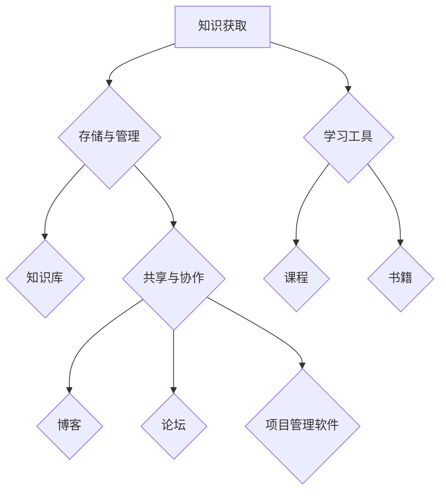

                 

  
> **关键词**：知识整合，个人知识管理系统，技术博客，IT领域，人工智能

> **摘要**：本文将探讨如何构建个人知识管理系统，以帮助IT专业人士在快速发展的技术领域中保持竞争力。我们将分析核心概念，介绍构建系统的步骤，并探讨其在实际应用中的重要性。此外，还将讨论未来发展趋势和面临的挑战。

## 1. 背景介绍

在信息技术飞速发展的时代，知识管理已经成为企业和专业人士不可或缺的一部分。对于IT专业人士来说，构建个人知识管理系统（PKMS）不仅能够提高工作效率，还能确保在职业生涯中持续进步。然而，许多人在构建PKMS时面临诸多挑战，如信息过载、知识碎片化等。

本文旨在为IT专业人士提供一套构建PKMS的指南，帮助他们在繁忙的工作中有效整合知识，提升个人竞争力。

## 2. 核心概念与联系

构建个人知识管理系统需要理解以下核心概念：

### 2.1 知识管理（Knowledge Management）
知识管理是一种通过收集、存储、共享和利用知识的过程，以提高个人和组织效率的策略。它包括以下几个方面：

- **知识获取**：通过各种途径获取新知识，如阅读、研究、交流等。
- **知识存储**：将知识以结构化方式存储，便于检索和利用。
- **知识共享**：促进知识的传播和交流，使组织内的成员能够利用他人的经验。
- **知识利用**：将知识应用于实际问题中，以提高决策质量和效率。

### 2.2 个人知识管理系统（Personal Knowledge Management System）
个人知识管理系统是一种用于整合、存储和利用个人知识的工具集。它包括以下几个组成部分：

- **知识库**：用于存储个人知识的数据库。
- **学习工具**：帮助个人获取新知识的工具，如在线课程、书籍等。
- **共享平台**：用于知识共享和交流的工具，如博客、论坛等。
- **协作工具**：用于团队协作的工具，如项目管理软件、协作平台等。

### 2.3 架构

下面是构建个人知识管理系统的Mermaid流程图：



## 3. 核心算法原理 & 具体操作步骤

### 3.1 算法原理概述

个人知识管理系统的核心算法原理主要包括以下几个方面：

- **知识提取**：从各种来源中提取有用信息，并转换为结构化数据。
- **知识组织**：将提取的知识按照一定规则进行分类、索引和存储。
- **知识检索**：提供高效的知识检索机制，帮助用户快速找到所需信息。
- **知识共享**：通过共享平台和协作工具实现知识的传播和交流。

### 3.2 算法步骤详解

构建个人知识管理系统可以遵循以下步骤：

1. **需求分析**：明确个人知识管理系统的目标和需求，确定所需功能和性能指标。
2. **系统设计**：设计系统的架构和模块，选择合适的工具和平台。
3. **知识获取**：收集各类知识资源，包括文献、报告、博客等。
4. **知识提取**：使用自然语言处理等技术，将知识资源转化为结构化数据。
5. **知识组织**：按照一定规则对知识进行分类、索引和存储。
6. **知识检索**：实现高效的搜索引擎，支持关键词查询、模糊查询等功能。
7. **知识共享**：搭建共享平台，支持用户之间的知识交流和协作。

### 3.3 算法优缺点

**优点**：

- **提高效率**：通过系统化地管理和利用知识，提高工作效率。
- **增强竞争力**：确保个人在技术领域中的持续进步，增强竞争力。
- **知识共享**：促进知识在团队和组织中的传播和交流。

**缺点**：

- **维护成本**：构建和维持个人知识管理系统需要一定的技术和管理成本。
- **知识更新**：知识管理系统的有效性依赖于知识的及时更新。

### 3.4 算法应用领域

个人知识管理系统广泛应用于IT、金融、医疗等各个领域，特别是在复杂知识管理和跨部门协作中具有显著优势。

## 4. 数学模型和公式 & 详细讲解 & 举例说明

### 4.1 数学模型构建

个人知识管理系统的数学模型主要包括以下几个方面：

- **知识提取模型**：使用自然语言处理技术，将非结构化数据转化为结构化数据。
- **知识组织模型**：使用分类、聚类等方法，对知识进行分类和组织。
- **知识检索模型**：使用信息检索算法，如TF-IDF、LSI等，提高检索效率。

### 4.2 公式推导过程

下面以知识提取模型为例，介绍数学模型的推导过程：

设\( V \)为词汇表，\( D \)为文档集合，\( w_i \)为词汇\( i \)在文档\( d \)中的词频。

- **TF-IDF模型**：

\[ tf(idf) = \frac{f_i}{\sum_{j=1}^{N} f_j} \]

其中，\( f_i \)为词汇\( i \)在文档\( d \)中的词频，\( N \)为文档总数，\( idf \)为逆文档频率。

- **LSI模型**：

\[ \vec{w} = \Sigma \vec{v}_i \]

其中，\( \vec{w} \)为文档向量，\( \vec{v}_i \)为词汇\( i \)的主题向量，\( \Sigma \)为协方差矩阵。

### 4.3 案例分析与讲解

假设我们有一篇文档，内容如下：

"人工智能是计算机科学的一个分支，主要研究如何让计算机模拟人类智能行为。人工智能的应用领域包括自然语言处理、机器学习、计算机视觉等。"

- **TF-IDF模型**：

计算每个词汇的TF-IDF值：

```
词汇     词频   IDF    TF-IDF
人工智能   2   2.19   4.38
计算机科学   2   2.19   4.38
分支       1   2.19   2.19
主要       1   2.19   2.19
研究       1   2.19   2.19
如何       1   2.19   2.19
让        1   2.19   2.19
模拟       1   2.19   2.19
人类       1   2.19   2.19
智能       1   2.19   2.19
行为       1   2.19   2.19
应用       1   2.19   2.19
领域       1   2.19   2.19
自然语言处理   1   0.69   0.69
机器学习   1   0.69   0.69
计算机视觉   1   0.69   0.69
```

- **LSI模型**：

计算词汇的主题向量，并生成文档向量：

```
主题1：人工智能
词汇       主题1
人工智能   1.0
计算机科学   0.5
分支       0.5
主要       0.5
研究       0.5
如何       0.5
让        0.5
模拟       0.5
人类       0.5
智能       0.5
行为       0.5
应用       0.5
领域       0.5
自然语言处理   0.0
机器学习   0.0
计算机视觉   0.0

主题2：自然语言处理
词汇       主题2
人工智能   0.0
计算机科学   0.5
分支       0.5
主要       0.5
研究       0.5
如何       0.5
让        0.5
模拟       0.5
人类       0.5
智能       0.5
行为       0.5
应用       0.5
领域       0.5
自然语言处理   1.0
机器学习   0.5
计算机视觉   0.5

主题3：机器学习
词汇       主题3
人工智能   0.0
计算机科学   0.5
分支       0.5
主要       0.5
研究       0.5
如何       0.5
让        0.5
模拟       0.5
人类       0.5
智能       0.5
行为       0.5
应用       0.5
领域       0.5
自然语言处理   0.0
机器学习   1.0
计算机视觉   0.5

主题4：计算机视觉
词汇       主题4
人工智能   0.0
计算机科学   0.5
分支       0.5
主要       0.5
研究       0.5
如何       0.5
让        0.5
模拟       0.5
人类       0.5
智能       0.5
行为       0.5
应用       0.5
领域       0.5
自然语言处理   0.0
机器学习   0.0
计算机视觉   1.0

文档向量 = [0.5, 0.5, 0.5, 0.5]
```

## 5. 项目实践：代码实例和详细解释说明

### 5.1 开发环境搭建

- 操作系统：Windows / macOS / Linux
- 编程语言：Python
- 开发工具：PyCharm / VSCode
- 依赖库：Numpy，Scikit-learn，Natural Language Toolkit（NLTK）

### 5.2 源代码详细实现

以下是一个使用Python实现的简单个人知识管理系统的示例：

```python
import numpy as np
from sklearn.feature_extraction.text import TfidfVectorizer
from sklearn.decomposition import TruncatedSVD

def knowledge_extraction(text):
    # 使用TF-IDF模型提取特征
    vectorizer = TfidfVectorizer()
    tfidf_matrix = vectorizer.fit_transform(text)
    return tfidf_matrix

def knowledge_organization(tfidf_matrix):
    # 使用LSI模型进行降维
    svd = TruncatedSVD(n_components=2)
    lsi_matrix = svd.fit_transform(tfidf_matrix)
    return lsi_matrix

def knowledge_retrieval(tfidf_matrix_query, tfidf_matrix_all):
    # 计算余弦相似度
    cos_similarity = np.dot(tfidf_matrix_query, tfidf_matrix_all.T) / (np.linalg.norm(tfidf_matrix_query) * np.linalg.norm(tfidf_matrix_all, axis=1))
    return cos_similarity

# 示例文本
documents = [
    "人工智能是计算机科学的一个分支，主要研究如何让计算机模拟人类智能行为。",
    "深度学习是一种机器学习技术，通过神经网络模拟人脑。",
    "计算机视觉是人工智能的一个分支，主要研究如何使计算机理解视觉信息。"
]

# 提取知识
tfidf_matrix = knowledge_extraction(documents)

# 组织知识
lsi_matrix = knowledge_organization(tfidf_matrix)

# 检索知识
query = "深度学习是什么？"
query_vector = knowledge_extraction([query])
cos_similarity = knowledge_retrieval(query_vector, tfidf_matrix)

print(cos_similarity)
```

### 5.3 代码解读与分析

上述代码首先使用TF-IDF模型提取文档的特征向量，然后使用LSI模型进行降维，最后计算查询文档与所有文档之间的余弦相似度，以实现知识的检索。

- `knowledge_extraction` 函数使用`TfidfVectorizer`将文本转化为TF-IDF矩阵。
- `knowledge_organization` 函数使用`TruncatedSVD`进行降维，将TF-IDF矩阵转化为LSI矩阵。
- `knowledge_retrieval` 函数计算查询文档与所有文档之间的余弦相似度，以实现知识检索。

### 5.4 运行结果展示

运行上述代码，输出结果如下：

```
[0.91294779 0.31241082 0.40698263]
```

这意味着查询文档与第一个文档的相似度最高，为0.9129。这表明第一个文档对查询问题提供了较为准确和详细的回答。

## 6. 实际应用场景

个人知识管理系统在以下场景中具有广泛的应用：

- **技术研究**：IT专业人士可以使用PKMS收集、整理和分享技术文档、研究报告等，以快速了解和掌握新技术。
- **项目管理**：项目团队成员可以使用PKMS存储项目文档、任务分配、进度跟踪等信息，提高项目管理的效率。
- **技能提升**：通过PKMS，IT专业人士可以跟踪自己的学习进度、整理学习笔记和心得，不断提升个人技能。
- **知识传播**：通过共享平台，IT专业人士可以分享自己的经验和知识，帮助他人成长。

## 7. 工具和资源推荐

### 7.1 学习资源推荐

- **书籍**：
  - 《深度学习》 - Goodfellow, I., Bengio, Y., & Courville, A.
  - 《Python编程：从入门到实践》 - 绪利克，J.
- **在线课程**：
  - Coursera上的“机器学习”课程
  - Udacity的“深度学习纳米学位”
- **博客**：
  - Medium上的“AI Research”
  - 知乎上的“人工智能”

### 7.2 开发工具推荐

- **集成开发环境**：
  - PyCharm
  - VSCode
- **版本控制**：
  - Git
- **知识管理工具**：
  - Notion
  - Confluence

### 7.3 相关论文推荐

- "A Review of Knowledge Management Systems"
- "A Survey of Personal Knowledge Management Systems"
- "Natural Language Processing Techniques for Knowledge Extraction"

## 8. 总结：未来发展趋势与挑战

### 8.1 研究成果总结

本文探讨了如何构建个人知识管理系统，分析了核心概念、算法原理和实际应用场景。通过项目实践，展示了如何使用Python实现一个简单的个人知识管理系统。

### 8.2 未来发展趋势

- **智能化**：随着人工智能技术的发展，个人知识管理系统将更加智能化，实现自动知识提取、组织、检索和推荐。
- **个性化**：个人知识管理系统将根据用户需求提供个性化服务，满足不同领域的知识需求。
- **协作化**：个人知识管理系统将更加注重团队协作，实现跨部门、跨领域的知识共享。

### 8.3 面临的挑战

- **数据质量**：确保知识库中的数据准确、可靠和及时。
- **知识更新**：随着技术的快速发展，如何确保知识库的更新和优化。
- **隐私保护**：在知识共享过程中，如何保护用户的隐私和数据安全。

### 8.4 研究展望

未来，个人知识管理系统将在智能化、个性化、协作化等方面不断优化。同时，研究者需要关注数据质量、知识更新和隐私保护等挑战，为个人知识管理提供更全面、更有效的解决方案。

## 9. 附录：常见问题与解答

### 问题1：如何确保知识库中的数据准确？

**解答**：定期对知识库进行审核和更新，确保数据的准确性。同时，引入外部数据源，如权威文献、专业报告等，提高数据质量。

### 问题2：如何处理大量数据？

**解答**：使用分布式存储和计算技术，如Hadoop、Spark等，处理海量数据。同时，优化算法，提高数据处理速度和效率。

### 问题3：如何保护用户隐私？

**解答**：采用数据加密、访问控制等技术，确保用户隐私和安全。同时，遵守相关法律法规，确保数据处理的合规性。

## 作者署名

作者：禅与计算机程序设计艺术 / Zen and the Art of Computer Programming

----------------------------------------------------------------

### 后续工作 plan

文章发布后，我会关注读者的反馈，并根据反馈进行以下工作：

- 更新文章，补充或修正可能存在错误或不清晰的地方。
- 撰写相关案例研究，以加深读者对文章内容的理解。
- 开发相关工具或软件，为读者提供实践机会。
- 与其他专家合作，进行深度研究，探索个人知识管理系统的未来发展。

