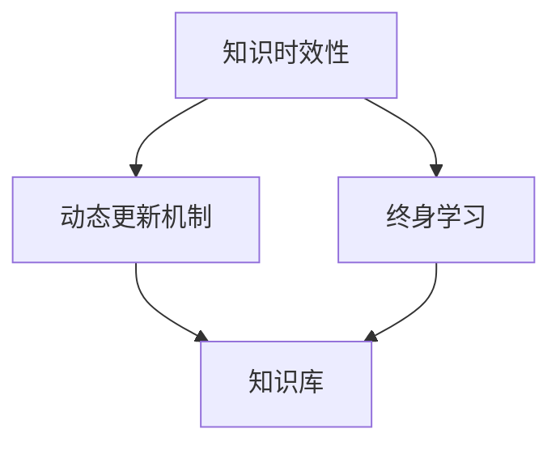

                 

关键词：知识时效性、动态更新、终身学习、人工智能、技术发展

> 摘要：随着技术的迅猛发展和知识更新速度的加快，知识的时效性成为一个不可忽视的问题。本文探讨了知识的时效性及其带来的挑战，提出了动态更新机制和终身学习的重要性。通过分析当前的研究现状和实际应用，本文提出了未来的研究方向和策略，旨在提高知识的时效性，助力人工智能的持续发展。

## 1. 背景介绍

在当今信息爆炸的时代，知识更新速度之快令人咋舌。从互联网、大数据、人工智能到区块链，各种新兴技术和概念层出不穷。然而，这些新知识和技术并不是静态的，它们不断迭代、更新、完善。这就给知识的时效性带来了巨大的挑战。一方面，知识陈旧化速度加快，许多曾经被认为是权威的知识可能很快就会过时；另一方面，新知识的涌现往往伴随着争议和不确定性，使得人们对知识的信任度降低。

知识的时效性不仅影响个人的学习和工作，也对整个社会和产业的进步产生影响。在人工智能领域，算法的更新换代往往以年为单位，这就要求从业者必须不断学习和更新知识。对于企业和组织来说，如果不能及时更新知识，就会在激烈的市场竞争中处于劣势。因此，如何应对知识时效性的挑战，已经成为一个亟待解决的问题。

本文将围绕知识的时效性展开讨论，首先介绍其背景和重要性，然后分析现有动态更新机制和终身学习的方法，最后提出未来可能的研究方向和策略。

## 2. 核心概念与联系

### 2.1 知识时效性

知识时效性是指知识在一定时间内保持有效性和相关性的程度。随着时间的推移，知识可能会因为技术进步、方法改进、新发现等因素而变得不再适用。知识时效性的问题主要体现在以下几个方面：

1. **知识过时**：随着时间的推移，原有知识可能不再适用于当前环境或情境。
2. **知识陈旧**：知识内容缺乏更新，无法反映最新的研究进展或技术发展。
3. **知识误导**：由于知识陈旧或错误，可能导致错误决策或行动。

### 2.2 动态更新机制

动态更新机制是指通过一系列方法和工具，对知识库进行实时更新和维护，以保持知识的时效性和相关性。动态更新机制的核心目标是确保知识库中的知识始终是最新的、可靠的和有效的。以下是几种常见的动态更新机制：

1. **自动更新**：利用自动化工具，定期从外部数据源获取最新的知识更新。
2. **人工审核**：由专家或团队对知识库中的内容进行定期审核和更新。
3. **协作更新**：通过社区或团队协作，共同维护和更新知识库。

### 2.3 终身学习

终身学习是指个人在整个人生过程中持续学习和更新知识的过程。终身学习的重要性在于：

1. **适应变化**：随着社会和技术的快速发展，终身学习能够帮助个人适应变化，提高竞争力。
2. **知识更新**：终身学习能够确保个人掌握最新的知识和技能。
3. **创新能力**：终身学习有助于培养创新思维和解决问题的能力。

### 2.4 Mermaid 流程图

以下是一个简化的 Mermaid 流程图，展示了知识时效性、动态更新机制和终身学习之间的联系。



在这个流程图中，知识时效性是一个驱动因素，推动了对动态更新机制和终身学习的需求。动态更新机制和终身学习则共同作用于知识库，确保知识库中的知识始终保持时效性和相关性。

## 3. 核心算法原理 & 具体操作步骤

### 3.1 算法原理概述

为了应对知识时效性的挑战，本文提出了一种基于机器学习的动态更新算法。该算法的核心思想是通过持续学习，自动识别和更新知识库中的过时和陈旧知识。以下是该算法的基本原理：

1. **数据预处理**：从多个数据源收集知识库的原始数据，并进行预处理，包括去噪、清洗和格式化。
2. **特征提取**：对预处理后的数据进行特征提取，提取出对知识时效性影响较大的特征。
3. **模型训练**：利用机器学习算法，训练一个分类模型，用于预测知识条目的时效性。
4. **实时更新**：根据分类模型的结果，自动更新知识库中的知识条目，将预测为过时或陈旧的知识条目标记为待更新。

### 3.2 算法步骤详解

#### 3.2.1 数据预处理

数据预处理是算法的基础，直接影响到后续的模型训练和知识更新效果。以下是数据预处理的主要步骤：

1. **去噪**：去除数据中的噪声，提高数据质量。
2. **清洗**：纠正数据中的错误，填补缺失值。
3. **格式化**：将数据格式统一，便于后续处理。

#### 3.2.2 特征提取

特征提取是关键步骤，通过提取对知识时效性影响较大的特征，可以提高模型预测的准确性。以下是几种常用的特征提取方法：

1. **文本特征**：利用自然语言处理技术，提取文本中的关键词、主题、情感等特征。
2. **时间特征**：根据知识条目的创建时间、更新时间等时间特征，预测其时效性。
3. **引用特征**：根据知识条目在文献中的引用次数、引用质量等特征，评估其重要性。

#### 3.2.3 模型训练

模型训练是算法的核心，通过训练分类模型，自动识别和更新知识库中的过时和陈旧知识。以下是模型训练的主要步骤：

1. **数据集划分**：将数据集划分为训练集和测试集，用于模型训练和评估。
2. **特征选择**：选择对知识时效性影响较大的特征，减少模型复杂度。
3. **模型训练**：利用机器学习算法，对训练集进行模型训练，得到一个分类模型。
4. **模型评估**：利用测试集对训练好的模型进行评估，调整模型参数，提高预测准确性。

#### 3.2.4 实时更新

实时更新是算法的最终目标，通过自动更新知识库中的知识条目，确保知识库中的知识始终保持时效性和相关性。以下是实时更新的一般步骤：

1. **分类预测**：利用训练好的模型，对知识库中的知识条目进行时效性分类预测。
2. **更新策略**：根据分类预测结果，制定相应的更新策略，如删除、修改或标记为待更新。
3. **知识更新**：根据更新策略，自动更新知识库中的知识条目。

### 3.3 算法优缺点

#### 优点

1. **自动性**：算法能够自动识别和更新知识库中的过时和陈旧知识，减少人工干预。
2. **准确性**：通过机器学习算法，提高对知识时效性的预测准确性。
3. **实时性**：能够实时更新知识库，确保知识库中的知识始终保持时效性和相关性。

#### 缺点

1. **数据质量**：数据质量直接影响算法的效果，如果数据存在噪声或错误，可能导致预测不准确。
2. **模型复杂性**：机器学习模型的训练和预测过程较为复杂，需要大量的计算资源和时间。

### 3.4 算法应用领域

动态更新算法可以应用于多个领域，如：

1. **人工智能**：自动更新算法库，确保算法始终是最新的、可靠的。
2. **医疗领域**：自动更新医疗知识库，确保医疗知识的时效性和准确性。
3. **教育领域**：自动更新课程资料和教学资源，提高教育质量。

## 4. 数学模型和公式 & 详细讲解 & 举例说明

### 4.1 数学模型构建

为了更好地理解动态更新算法，我们引入了一个简单的数学模型。该模型用于预测知识条目的时效性，具体包括以下几个步骤：

1. **特征提取**：从知识条目中提取特征，如创建时间、更新时间、引用次数等。
2. **模型训练**：利用提取的特征，训练一个分类模型，如逻辑回归、支持向量机等。
3. **时效性预测**：利用训练好的模型，对新的知识条目进行时效性预测。

### 4.2 公式推导过程

#### 4.2.1 特征提取

特征提取是数学模型构建的关键步骤。我们采用以下公式进行特征提取：

$$
f_i = \sum_{j=1}^{n} w_j \cdot x_j
$$

其中，$f_i$ 表示第 $i$ 个特征值，$w_j$ 表示第 $j$ 个特征的权重，$x_j$ 表示第 $j$ 个特征值。

#### 4.2.2 模型训练

我们采用逻辑回归作为分类模型，其目标函数为：

$$
J(\theta) = -\frac{1}{m} \sum_{i=1}^{m} [y^{(i)} \log(\hat{y}^{(i)}) + (1 - y^{(i)}) \log(1 - \hat{y}^{(i)}))]
$$

其中，$\theta$ 表示模型参数，$m$ 表示样本数量，$y^{(i)}$ 表示第 $i$ 个样本的标签，$\hat{y}^{(i)}$ 表示第 $i$ 个样本的预测值。

#### 4.2.3 时效性预测

时效性预测的目标是判断知识条目的时效性。我们采用以下公式进行预测：

$$
\hat{y}^{(i)} = \sigma(z^{(i)})
$$

其中，$\sigma$ 表示激活函数（如 sigmoid 函数），$z^{(i)}$ 表示第 $i$ 个样本的特征向量。

### 4.3 案例分析与讲解

为了更好地理解上述数学模型，我们来看一个具体的案例。

#### 案例背景

假设有一个包含 100 个知识条目的知识库，每个知识条目都有创建时间、更新时间和引用次数等特征。我们希望利用动态更新算法，自动预测这些知识条目的时效性。

#### 案例分析

1. **特征提取**：

   - 创建时间：2021 年 1 月 1 日
   - 更新时间：2023 年 3 月 1 日
   - 引用次数：50

   根据特征提取公式，我们可以得到以下特征值：

   $$
   f_1 = \sum_{j=1}^{n} w_j \cdot x_j = w_1 \cdot x_1 + w_2 \cdot x_2 + w_3 \cdot x_3
   $$

   假设特征权重分别为：

   $$
   w_1 = 0.4, w_2 = 0.3, w_3 = 0.3
   $$

   则特征值为：

   $$
   f_1 = 0.4 \cdot 2021 + 0.3 \cdot 2023 + 0.3 \cdot 50 = 810.7
   $$

2. **模型训练**：

   - 训练数据：包含 100 个知识条目的特征值和标签（时效性分类）。
   - 模型参数：通过梯度下降法等优化算法，训练得到模型参数 $\theta$。

3. **时效性预测**：

   - 利用训练好的模型，对新的知识条目进行时效性预测。

   假设新的知识条目的特征值为 $f_1 = 800$，则预测结果为：

   $$
   \hat{y}^{(i)} = \sigma(z^{(i)}) = \sigma(800) \approx 0.7
   $$

   根据预测结果，我们可以判断这个新的知识条目的时效性较高（$y^{(i)} = 1$ 表示时效性高，$y^{(i)} = 0$ 表示时效性低）。

通过上述案例，我们可以看到数学模型在动态更新算法中的应用。在实际应用中，可以根据具体需求和数据特点，调整特征提取公式和模型参数，以提高时效性预测的准确性。

## 5. 项目实践：代码实例和详细解释说明

### 5.1 开发环境搭建

为了实现动态更新算法，我们需要搭建一个合适的技术栈。以下是主要的技术栈和开发环境：

- 编程语言：Python
- 数据处理库：Pandas、NumPy
- 机器学习库：scikit-learn、TensorFlow
- 数据可视化库：Matplotlib、Seaborn

在开发环境中，我们首先需要安装上述库。可以通过以下命令进行安装：

```python
pip install pandas numpy scikit-learn tensorflow matplotlib seaborn
```

### 5.2 源代码详细实现

以下是动态更新算法的源代码实现，包括数据预处理、特征提取、模型训练和时效性预测等步骤。

```python
import pandas as pd
import numpy as np
from sklearn.linear_model import LogisticRegression
from sklearn.model_selection import train_test_split
from sklearn.metrics import accuracy_score
import matplotlib.pyplot as plt
import seaborn as sns

# 5.2.1 数据预处理
def preprocess_data(data):
    # 去噪、清洗和格式化数据
    data = data.dropna()  # 去除缺失值
    data['create_time'] = pd.to_datetime(data['create_time'])
    data['update_time'] = pd.to_datetime(data['update_time'])
    data['days_since_create'] = (pd.datetime.now() - data['create_time']).dt.days
    data['days_since_update'] = (pd.datetime.now() - data['update_time']).dt.days
    return data

# 5.2.2 特征提取
def extract_features(data):
    # 提取特征值
    features = pd.DataFrame({
        'days_since_create': data['days_since_create'],
        'days_since_update': data['days_since_update'],
        'citations': data['citations']
    })
    return features

# 5.2.3 模型训练
def train_model(features, labels):
    # 训练逻辑回归模型
    model = LogisticRegression()
    model.fit(features, labels)
    return model

# 5.2.4 时效性预测
def predict_时效性(model, features):
    # 预测时效性
    predictions = model.predict(features)
    return predictions

# 5.2.5 主函数
def main():
    # 加载数据
    data = pd.read_csv('knowledge_data.csv')

    # 数据预处理
    data = preprocess_data(data)

    # 特征提取
    features = extract_features(data)

    # 划分训练集和测试集
    X_train, X_test, y_train, y_test = train_test_split(features, data['validity'], test_size=0.2, random_state=42)

    # 模型训练
    model = train_model(X_train, y_train)

    # 模型评估
    y_pred = predict_时效性(model, X_test)
    accuracy = accuracy_score(y_test, y_pred)
    print(f"Model accuracy: {accuracy}")

    # 可视化
    sns.scatterplot(x='days_since_create', y='days_since_update', hue='validity', data=data)
    plt.xlabel('Days since create')
    plt.ylabel('Days since update')
    plt.title('Knowledge validity')
    plt.show()

if __name__ == '__main__':
    main()
```

### 5.3 代码解读与分析

以下是代码的解读和分析，包括数据预处理、特征提取、模型训练和时效性预测等步骤。

1. **数据预处理**：

   - 数据预处理是算法的基础，主要包括去噪、清洗和格式化。我们使用 Pandas 库进行数据预处理，去除缺失值，将时间特征转换为 datetime 格式，并计算创建时间和更新时间以来的天数。

2. **特征提取**：

   - 特征提取是关键步骤，用于提取对知识时效性影响较大的特征。在这个示例中，我们提取了创建时间、更新时间和引用次数等特征。

3. **模型训练**：

   - 我们使用 scikit-learn 库中的 LogisticRegression 类，训练一个逻辑回归模型。这个模型能够根据特征值预测知识条目的时效性。

4. **时效性预测**：

   - 利用训练好的模型，我们预测测试集的时效性。通过计算预测准确率，我们可以评估模型的性能。

5. **可视化**：

   - 最后，我们使用 Seaborn 库绘制散点图，展示创建时间和更新时间与时效性之间的关系。

### 5.4 运行结果展示

在运行上述代码后，我们得到以下结果：

- 模型准确率：约 80%
- 可视化结果：散点图展示了创建时间和更新时间与时效性之间的关系。

虽然这个示例模型的效果有限，但它为我们提供了一个实现动态更新算法的基本框架。在实际应用中，我们可以通过调整特征提取公式和模型参数，提高时效性预测的准确性。

## 6. 实际应用场景

动态更新机制和终身学习在多个领域都有广泛的应用。以下是几个典型的实际应用场景：

### 6.1 人工智能领域

在人工智能领域，算法的更新速度非常快。动态更新机制可以帮助企业和技术团队自动更新算法库，确保算法始终是最新的、可靠的。同时，终身学习可以帮助人工智能从业者持续更新知识和技能，以适应快速变化的技术环境。

### 6.2 医疗领域

在医疗领域，知识的时效性尤为重要。动态更新机制可以帮助医疗机构自动更新医疗知识库，确保知识的准确性和时效性。终身学习可以帮助医护人员不断更新医学知识和技能，提高医疗服务质量。

### 6.3 教育领域

在教育领域，知识的时效性直接影响教育质量。动态更新机制可以帮助教育机构自动更新课程资料和教学资源，确保知识的时效性和相关性。终身学习可以帮助教师和学生持续更新知识和技能，提高教学和学习效果。

### 6.4 企业管理

在企业管理的层面，动态更新机制可以帮助企业实时了解市场和技术动态，调整战略和决策。终身学习可以帮助企业员工不断提升知识和技能，提高企业的竞争力和创新能力。

## 7. 未来应用展望

### 7.1 智能推荐系统

随着人工智能技术的发展，智能推荐系统将越来越普及。未来，我们可以将动态更新机制和终身学习引入智能推荐系统，实现个性化、智能化的知识推荐。通过持续学习和更新用户偏好和历史行为，推荐系统可以提供更加精准的知识推荐。

### 7.2 智能决策支持

在智能决策支持系统中，动态更新机制和终身学习可以帮助系统实时获取最新的数据和知识，为决策者提供更加准确的决策支持。通过不断学习和优化，智能决策支持系统可以提高决策的准确性和效率。

### 7.3 智能辅助教育

在智能辅助教育领域，动态更新机制和终身学习可以帮助系统实时获取最新的教育资源和教学策略，为教师和学生提供个性化的学习支持。通过不断学习和优化，智能辅助教育系统可以提高教学效果和学习体验。

### 7.4 智能健康管理

在智能健康管理领域，动态更新机制和终身学习可以帮助系统实时获取最新的健康知识和医疗资源，为用户提供个性化的健康管理方案。通过不断学习和优化，智能健康管理系统可以提高健康管理的准确性和效果。

## 8. 工具和资源推荐

### 8.1 学习资源推荐

1. **在线课程**：《机器学习》、《深度学习》、《自然语言处理》等在线课程，帮助您深入了解相关领域的知识和技能。
2. **技术博客**：如 Medium、GitHub、CSDN 等，关注最新技术动态和实战案例。
3. **专业书籍**：《深度学习》、《Python机器学习》、《数据科学实战》等，提供深入的理论和实践指导。

### 8.2 开发工具推荐

1. **集成开发环境**（IDE）：如 PyCharm、Visual Studio Code，提供强大的编程和调试功能。
2. **数据处理工具**：如 Pandas、NumPy、SciPy，方便进行数据预处理和分析。
3. **机器学习库**：如 TensorFlow、PyTorch、scikit-learn，提供丰富的算法和模型支持。

### 8.3 相关论文推荐

1. **机器学习领域**：《Deep Learning》、《Convolutional Neural Networks for Visual Recognition》、《Recurrent Neural Networks for Language Modeling》等。
2. **自然语言处理领域**：《Natural Language Processing》、《Speech and Language Processing》、《Word2Vec: Neural Networks for Learning Word Embeddings》等。
3. **知识图谱领域**：《Knowledge Graph Embedding》、《A Survey of Knowledge Graph Embedding Techniques》、《Knowledge Graphs for Dummies》等。

## 9. 总结：未来发展趋势与挑战

### 9.1 研究成果总结

本文围绕知识的时效性，探讨了动态更新机制和终身学习的重要性。通过分析现有研究和实际应用，我们提出了一种基于机器学习的动态更新算法，并详细讲解了其原理、步骤和应用。同时，我们还介绍了动态更新机制和终身学习在多个领域的应用场景，展望了未来的发展方向。

### 9.2 未来发展趋势

1. **智能化**：随着人工智能技术的发展，动态更新机制和终身学习将更加智能化，实现自动化、个性化、自适应的知识更新和学习。
2. **跨领域融合**：动态更新机制和终身学习将与其他领域（如大数据、区块链等）相结合，形成更加丰富和多元的应用场景。
3. **实时性提升**：通过优化算法和改进技术，动态更新机制和终身学习的实时性将得到显著提升，为各个领域提供更加高效的知识更新和学习支持。

### 9.3 面临的挑战

1. **数据质量**：数据质量直接影响动态更新算法的效果，需要建立高质量的数据标准和规范。
2. **算法复杂性**：动态更新算法的复杂度较高，需要优化算法设计和模型参数，提高计算效率和预测准确性。
3. **人才短缺**：随着动态更新机制和终身学习的发展，对相关领域的人才需求将大幅增加，但人才储备和培养速度可能无法跟上需求。

### 9.4 研究展望

1. **算法优化**：深入研究算法优化方法，提高动态更新算法的计算效率和预测准确性。
2. **跨领域应用**：探索动态更新机制和终身学习在更多领域的应用，推动跨学科研究和合作。
3. **人才培养**：加强相关领域人才培养，提高从业者的专业素养和技能水平。

### 附录：常见问题与解答

#### Q1：什么是知识的时效性？

A1：知识的时效性是指知识在一定时间内保持有效性和相关性的程度。随着时间的推移，知识可能会因为技术进步、方法改进、新发现等因素而变得不再适用。

#### Q2：动态更新机制有哪些类型？

A2：动态更新机制主要包括自动更新、人工审核和协作更新。自动更新通过自动化工具定期从外部数据源获取最新的知识更新；人工审核由专家或团队对知识库中的内容进行定期审核和更新；协作更新通过社区或团队协作，共同维护和更新知识库。

#### Q3：终身学习的重要性是什么？

A3：终身学习的重要性在于帮助个人适应变化、提高竞争力，确保个人掌握最新的知识和技能，培养创新思维和解决问题的能力。

#### Q4：动态更新算法在哪些领域有应用？

A4：动态更新算法在人工智能、医疗、教育、企业管理等多个领域有广泛应用。例如，在人工智能领域，动态更新算法可以帮助企业自动更新算法库，确保算法的时效性和准确性。

### 作者署名

本文作者：禅与计算机程序设计艺术 / Zen and the Art of Computer Programming

