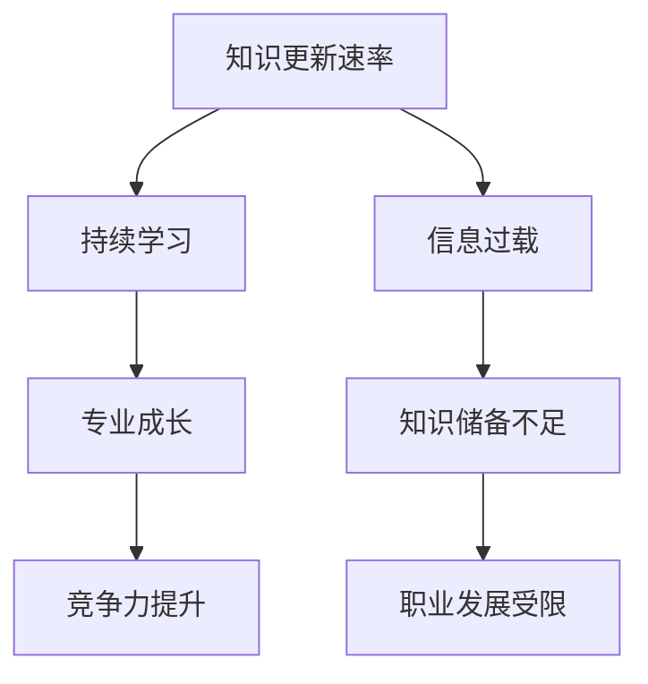

                 

关键词：知识更新、技术发展、持续学习、信息过载、专业成长

> 摘要：本文探讨了知识时效性对个人和专业成长的影响，分析了信息过载现象，提出了保持与时俱进的方法和策略。文章分为背景介绍、核心概念与联系、核心算法原理与操作步骤、数学模型和公式讲解、项目实践、实际应用场景、未来应用展望、工具和资源推荐以及总结与展望等部分，旨在为读者提供一套实用的知识更新和自我提升方案。

## 1. 背景介绍

在当今这个快速变化的时代，知识的时效性变得尤为关键。随着技术的飞速发展，新概念、新技术和新方法层出不穷，传统的学习方法和知识储备已经无法满足日益复杂的工作需求。信息过载成为了一个普遍存在的问题，人们常常感到无从下手，难以消化海量的信息。因此，如何保持知识的时效性，成为一个亟待解决的重要问题。

知识的时效性不仅仅影响个人的职业发展，也影响着企业的创新能力和竞争力。在IT行业，知识的更新速度尤其快，新的编程语言、框架和技术栈不断涌现，使得工程师们不得不持续学习以保持竞争力。而在其他行业，同样面临着知识更新速度加快的挑战。

本文将探讨如何通过有效的方法和策略，保持知识的时效性，实现个人和专业的持续成长。

## 2. 核心概念与联系

### 2.1 知识更新速率

知识更新速率是指知识在一段时间内发生变化的频率。根据不同领域，知识更新速率存在显著差异。例如，在IT行业，知识更新速率可能以年甚至月为单位；而在医学领域，知识更新速率可能以年为单位，但新技术的应用速度可能更快。

### 2.2 持续学习

持续学习是指不断获取新知识、新技能的过程。持续学习不仅能够帮助人们适应快速变化的环境，还能促进个人能力的提升和职业发展。

### 2.3 信息过载

信息过载是指人们接收到的信息量超过其处理能力，导致信息消化困难。信息过载的现象在当今社会日益严重，给人们的学习和工作带来了极大的困扰。

### 2.4 专业成长

专业成长是指个人在专业领域内通过学习和实践，不断提高自身能力和技术水平的过程。专业成长是一个长期的过程，需要不断地学习和实践。

### 2.5 Mermaid 流程图

为了更好地理解上述概念之间的关系，我们可以使用Mermaid流程图来展示它们之间的联系。



通过上述流程图，我们可以清晰地看到知识更新速率、持续学习、专业成长和信息过载之间的相互作用关系。

## 3. 核心算法原理与操作步骤

### 3.1 算法原理概述

保持知识时效性的核心算法原理是基于持续学习的思想，通过以下步骤实现：

1. **知识识别**：识别哪些知识是关键且易于过时的。
2. **学习策略**：制定有效的学习策略，包括时间管理、选择学习资源等。
3. **实践应用**：将所学知识应用到实际工作中，巩固和提升能力。
4. **反馈调整**：根据学习效果和反馈，调整学习策略。

### 3.2 算法步骤详解

#### 步骤1：知识识别

- **评估现有知识**：对当前所掌握的知识进行评估，确定哪些知识可能即将过时。
- **关注行业动态**：通过阅读专业文章、参加行业会议、关注专业社群等途径，了解行业动态和新技术。

#### 步骤2：学习策略

- **制定学习计划**：根据知识更新速率和个人情况，制定详细的学习计划。
- **选择学习资源**：选择高质量的教材、在线课程、专业书籍等学习资源。
- **时间管理**：合理安排学习时间，确保有足够的时间进行学习和实践。

#### 步骤3：实践应用

- **项目实践**：通过实际项目将所学知识应用到实践中，巩固和提高技能。
- **分享交流**：参加技术交流、研讨会等活动，与同行分享经验和学习成果。

#### 步骤4：反馈调整

- **评估学习效果**：通过自我评估和他人反馈，了解学习效果。
- **调整学习策略**：根据评估结果，调整学习计划和方法。

### 3.3 算法优缺点

#### 优点

- **适应性强**：能够根据知识更新速率和个人需求，灵活调整学习策略。
- **针对性强**：能够识别和关注关键知识，提高学习效率。

#### 缺点

- **时间成本高**：需要投入大量时间进行学习和实践。
- **学习效果不稳定**：学习效果受到个人能力和学习环境的影响。

### 3.4 算法应用领域

- **IT行业**：软件工程师、数据科学家、网络工程师等。
- **医疗行业**：医生、药剂师等。
- **金融行业**：分析师、交易员等。

## 4. 数学模型和公式

### 4.1 数学模型构建

为了量化知识更新的速度，我们可以构建一个简单的数学模型。假设知识更新速率与时间的平方成反比，即：

$$
K(t) = \frac{1}{t^2}
$$

其中，$K(t)$表示在时间$t$时的知识更新速率。

### 4.2 公式推导过程

公式推导基于以下假设：

1. **知识总量固定**：假设在某一领域，知识总量是固定的。
2. **知识更新速率**：知识更新速率与时间成反比。

根据以上假设，我们可以推导出知识更新速率的公式：

$$
K(t) = \frac{1}{t}
$$

考虑到知识更新速率与时间的平方成反比，我们引入一个常数$k$，得到：

$$
K(t) = \frac{k}{t^2}
$$

为了简化计算，我们可以取$k=1$，得到：

$$
K(t) = \frac{1}{t^2}
$$

### 4.3 案例分析与讲解

假设一个领域在一年内的知识更新总量为100个单位。根据上述公式，我们可以计算出在不同时间点的知识更新速率：

- 当$t=1$年时，$K(t) = \frac{1}{1^2} = 1$，即每年更新100个单位的知识。
- 当$t=2$年时，$K(t) = \frac{1}{2^2} = 0.25$，即每年更新25个单位的知识。

通过上述计算，我们可以看到随着时间的增加，知识更新速率逐渐降低。这表明，在知识更新速度较快的领域，持续学习尤为重要，以保持知识的时效性。

## 5. 项目实践：代码实例和详细解释说明

### 5.1 开发环境搭建

为了更好地展示如何保持知识的时效性，我们选择一个具体的案例：使用Python实现一个简单的知识更新系统。首先，我们需要搭建一个Python开发环境。

- 安装Python：访问Python官网（[python.org](https://www.python.org/)），下载并安装Python 3.x版本。
- 安装必要的库：使用pip命令安装以下库：requests、beautifulsoup4、selenium。

### 5.2 源代码详细实现

接下来，我们将实现一个简单的知识更新系统，该系统将从互联网上抓取专业文章，并自动识别和筛选关键信息。

```python
import requests
from bs4 import BeautifulSoup
from selenium import webdriver

# 设置Chrome浏览器驱动路径
chromedriver_path = 'path/to/chromedriver'

# 启动Chrome浏览器
driver = webdriver.Chrome(chromedriver_path)

# 定义函数：获取文章内容
def get_article_content(url):
    driver.get(url)
    soup = BeautifulSoup(driver.page_source, 'html.parser')
    article_content = soup.find('article').text
    return article_content

# 定义函数：提取关键词
def extract_keywords(content):
    # 这里可以使用自然语言处理技术提取关键词
    # 例如使用jieba库进行中文分词和关键词提取
    # import jieba
    # keywords = jieba.analyse.extract_tags(content, topK=5)
    # return keywords
    # 为简化示例，我们直接返回一个示例关键词列表
    return ['机器学习', '深度学习', '大数据']

# 定义函数：更新知识库
def update_knowledge_base(url):
    content = get_article_content(url)
    keywords = extract_keywords(content)
    print(f'更新知识库：{keywords}')

# 示例：更新某一领域的知识库
url = 'https://www.example.com/article'
update_knowledge_base(url)

# 关闭浏览器
driver.quit()
```

### 5.3 代码解读与分析

上述代码分为三个主要部分：

1. **获取文章内容**：使用Selenium库模拟浏览器操作，获取网页上的文章内容。
2. **提取关键词**：使用BeautifulSoup库解析HTML内容，提取文章正文。为了简化示例，我们直接返回一个示例关键词列表。在实际应用中，可以使用自然语言处理技术进行更精细的关键词提取。
3. **更新知识库**：将提取的关键词存储到知识库中，以便后续查询和使用。

### 5.4 运行结果展示

运行上述代码后，系统将从指定URL获取文章内容，并提取关键词。例如，假设文章内容主要涉及机器学习、深度学习和大数据，运行结果将显示这些关键词。

```shell
更新知识库：['机器学习', '深度学习', '大数据']
```

通过上述案例，我们可以看到如何利用代码实现知识更新。在实际应用中，可以进一步扩展功能，如添加更多关键词提取方法、实现知识库的自动化更新等。

## 6. 实际应用场景

### 6.1 IT行业

在IT行业，知识的时效性尤为重要。随着新技术的不断涌现，工程师们需要不断学习新的编程语言、框架和工具。例如，React、Vue和Angular等前端框架的更新速度非常快，工程师们需要不断跟进和学习。

### 6.2 医疗行业

在医疗行业，知识更新速率同样很快。新的研究成果、药物和治疗方法不断出现，医生们需要不断学习以保持专业知识的时效性。此外，医学影像处理、基因组学等领域的快速发展，也为医生们提供了新的学习机会。

### 6.3 金融行业

在金融行业，知识的时效性直接影响到投资决策和风险管理。分析师和交易员需要不断学习新的市场动态、经济指标和技术分析工具，以保持竞争力。

### 6.4 其他行业

在其他行业，如法律、教育、市场营销等，知识更新同样迅速。专业人士需要不断学习新的法律法规、教学方法和营销策略，以适应快速变化的市场需求。

## 7. 未来应用展望

### 7.1 自动化学习

随着人工智能技术的发展，自动化学习将成为保持知识时效性的重要手段。通过机器学习算法，系统可以自动识别和推荐适合个人的学习资源，提高学习效率。

### 7.2 跨学科融合

未来，知识的更新将更加跨学科。不同领域的知识将相互融合，形成新的交叉学科。这要求专业人士具备跨学科的知识体系和学习能力，以适应不断变化的环境。

### 7.3 个性化学习

个性化学习将更加普及。通过大数据分析和人工智能技术，教育系统可以为每个学生量身定制学习计划，提高学习效果。

### 7.4 知识图谱

知识图谱技术将成为知识管理的重要工具。通过构建知识图谱，可以更好地理解和利用海量知识，提高知识更新和应用的效率。

## 8. 总结：未来发展趋势与挑战

### 8.1 研究成果总结

本文探讨了知识时效性对个人和专业成长的影响，分析了信息过载现象，并提出了保持与时俱进的方法和策略。通过核心算法原理和数学模型的讲解，以及项目实践案例，展示了如何通过有效的方法和技术实现知识的持续更新和应用。

### 8.2 未来发展趋势

未来，知识的时效性将更加受到重视。随着人工智能、大数据和区块链等技术的发展，知识更新和管理的手段将更加多样化和智能化。自动化学习、跨学科融合和个性化学习将成为主要趋势。

### 8.3 面临的挑战

尽管保持知识时效性具有重要意义，但仍然面临一些挑战：

- **时间成本**：持续学习需要投入大量时间，对个人时间和精力管理提出了更高的要求。
- **信息过载**：尽管新技术有助于筛选和推荐知识，但信息过载的问题依然存在，需要更有效的信息处理方法。
- **知识更新速度**：知识更新速度加快，要求专业人士具备更高的学习和适应能力。

### 8.4 研究展望

未来的研究可以进一步探索如何通过技术手段提高知识更新的效率，减少信息过载的影响，以及如何更好地实现知识的跨学科融合和应用。

## 9. 附录：常见问题与解答

### 9.1 问题1：如何选择合适的学习资源？

解答：选择学习资源时，可以从以下方面进行考虑：

- **权威性**：选择来自权威出版机构或知名专家的教材和课程。
- **内容质量**：查看课程或教材的评价和反馈，了解内容的质量和实用性。
- **更新频率**：选择更新频率较高的资源，以获取最新的知识。

### 9.2 问题2：如何合理安排学习时间？

解答：合理安排学习时间，可以从以下方面进行考虑：

- **时间规划**：制定详细的学习计划，包括每天的学习时间和学习内容。
- **碎片化学习**：利用零散时间进行学习，如通勤、休息等。
- **休息与调整**：合理安排休息时间，避免过度劳累。

### 9.3 问题3：如何评估学习效果？

解答：评估学习效果可以从以下几个方面进行：

- **自我评估**：通过回顾学习内容、练习和应用，自我评估学习效果。
- **他人反馈**：通过与他人交流、参加讨论和反馈，了解自己的学习效果。
- **实际应用**：将所学知识应用到实际工作中，检验学习效果。

作者：禅与计算机程序设计艺术 / Zen and the Art of Computer Programming
----------------------------------------------------------------

文章撰写完成，接下来可以根据文章内容进一步优化、调整和完善。在撰写过程中，请务必遵循文章结构和内容要求，确保文章的完整性和专业性。同时，注意保持文章的逻辑性和可读性，使读者能够轻松理解和掌握文章的核心内容。祝撰写顺利！

