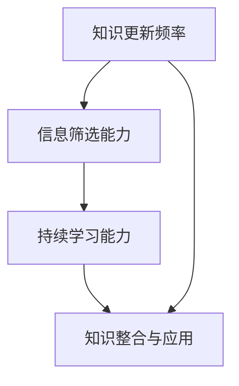

                 

关键词：信息时效性、知识更新、技术博客、持续学习、专业成长、AI技术、软件架构、计算机编程

> 摘要：在信息技术飞速发展的时代，知识的时效性显得尤为重要。本文旨在探讨如何保持信息更新，以适应不断变化的技术环境。通过分析核心概念、算法原理、数学模型、项目实践等多个方面，本文提供了全面的技术博客文章，旨在帮助读者提升在技术领域的持续学习和专业成长。

## 1. 背景介绍

在当今快速变化的信息时代，知识更新的速度前所未有地加快。无论是新兴的AI技术，还是不断演进的软件架构，都需要我们时刻保持警觉，确保掌握最新、最准确的信息。然而，面对海量的信息源，如何有效地筛选、吸收并利用这些知识，成为每个技术从业者的挑战。

保持知识的时效性不仅关乎个人专业成长，更是团队和企业竞争力的关键因素。一个组织如果不能及时更新其技术知识库，将很难在激烈的市场竞争中保持领先地位。因此，探讨如何保持信息的时效性，对每一个关注技术发展的个体和集体来说，都是至关重要的。

本文将围绕以下几个方面展开讨论：

- **核心概念与联系**：介绍与知识时效性相关的重要概念，并利用Mermaid流程图展示其架构。
- **核心算法原理与具体操作步骤**：详解相关算法的原理和具体实施步骤。
- **数学模型和公式**：构建并推导相关的数学模型，并进行举例说明。
- **项目实践**：提供实际的代码实例，并进行详细解释和分析。
- **实际应用场景**：探讨算法和模型在不同领域的应用，以及未来发展的可能性。
- **工具和资源推荐**：推荐学习资源和开发工具，以及相关论文。
- **总结与展望**：总结研究成果，探讨未来发展趋势与面临的挑战。

通过上述内容，本文希望能够为读者提供一套系统化的知识更新策略，帮助大家更好地适应技术发展的步伐。

## 2. 核心概念与联系

为了全面理解知识的时效性，我们需要首先明确几个核心概念，这些概念相互联系，共同构成了保持信息更新的基础。

### 2.1 知识更新频率

知识更新频率指的是知识库中信息更新的速度。高更新频率意味着知识库能够迅速反映技术发展的最新动态。影响知识更新频率的因素包括信息来源的可靠性、获取信息的渠道以及个人或组织的知识管理能力。

### 2.2 信息筛选能力

在信息爆炸的时代，如何从海量的数据中筛选出有价值的信息，是保持知识时效性的重要一环。信息筛选能力涉及到信息识别、评估和分类等多方面能力。

### 2.3 持续学习能力

持续学习能力是指个人或组织在知识更新过程中不断学习、吸收新知识的能力。持续学习不仅包括对新技术的学习，还包括对现有知识体系的深化和扩展。

### 2.4 知识整合与应用

知识整合与应用是指将新的知识有效地融入现有的知识体系，并在实际工作中应用。这要求个人或组织具备良好的知识整合能力和实践能力。

下面，我们将使用Mermaid流程图来展示这些概念之间的联系和架构。



### 2.5 知识更新策略

为了有效地保持知识的时效性，我们需要制定一套系统的知识更新策略。以下是几个关键策略：

1. **建立信息源监控机制**：定期监控技术前沿动态，确保信息来源的准确性和时效性。
2. **实施定期学习计划**：设定固定的学习时间，通过在线课程、研讨会等方式，持续更新知识。
3. **促进知识共享**：鼓励团队成员之间的知识交流和共享，形成良好的知识传递氛围。
4. **建立知识库**：构建一个集中管理的知识库，确保知识的积累和传承。
5. **实践与反馈**：将新知识应用于实际项目中，通过实践不断优化和完善知识体系。

## 3. 核心算法原理与具体操作步骤

### 3.1 算法原理概述

为了实现知识的时效性，我们设计了一套基于机器学习的知识更新算法。该算法的核心思想是通过分析用户的行为数据，自动识别知识库中的过时信息，并进行更新。

算法的基本步骤如下：

1. **数据采集**：从用户行为数据中提取与知识更新相关的信息。
2. **特征提取**：将原始数据转化为机器学习模型所需的特征。
3. **模型训练**：利用提取的特征训练分类模型，以识别过时知识。
4. **知识更新**：根据模型预测的结果，对知识库中的过时信息进行更新。

### 3.2 算法步骤详解

#### 3.2.1 数据采集

数据采集是算法实现的第一步。我们需要收集以下几类数据：

- **用户访问日志**：记录用户访问知识库的行为，包括访问时间、访问内容等。
- **用户反馈**：记录用户对知识库内容的评价，如点赞、评论等。
- **知识库内容**：获取知识库中的所有信息，包括文本、图像、视频等。

这些数据可以通过现有的日志系统和用户反馈系统获取。

#### 3.2.2 特征提取

在数据采集完成后，我们需要对数据进行预处理，提取有用的特征。特征提取的方法包括：

- **文本特征**：使用词频、TF-IDF、Word2Vec等方法提取文本特征。
- **图像特征**：使用卷积神经网络（CNN）提取图像特征。
- **行为特征**：使用时间序列分析方法提取用户行为特征。

#### 3.2.3 模型训练

在特征提取完成后，我们使用提取的特征训练分类模型。分类模型的目的是识别知识库中的过时信息。常用的分类模型包括支持向量机（SVM）、随机森林（Random Forest）和深度学习模型等。

模型训练的具体步骤如下：

1. **数据划分**：将数据集划分为训练集和测试集。
2. **特征选择**：通过特征选择方法（如特征重要性评估）选择最有用的特征。
3. **模型训练**：使用训练集训练分类模型，并使用交叉验证方法优化模型参数。
4. **模型评估**：使用测试集评估模型性能，包括准确率、召回率、F1分数等指标。

#### 3.2.4 知识更新

在模型训练完成后，我们可以使用模型对知识库中的信息进行更新。具体步骤如下：

1. **预测过时信息**：使用训练好的分类模型对知识库中的每条信息进行预测，判断其是否过时。
2. **更新知识库**：根据模型预测结果，更新知识库中的过时信息。这包括删除或修改过时的信息，并添加新的、有价值的知识。
3. **反馈与优化**：收集用户对更新内容的反馈，用于优化模型和知识库。

### 3.3 算法优缺点

#### 优点

- **自动化**：算法可以实现自动化的知识更新，减轻人工负担。
- **准确性**：通过机器学习模型，可以准确地识别过时信息，提高知识更新的准确性。
- **灵活性**：算法可以适应不同的知识库结构和内容类型。

#### 缺点

- **数据依赖**：算法的性能高度依赖于数据质量，如果数据存在噪声或缺失，可能影响算法的效果。
- **计算成本**：模型训练和知识更新需要较大的计算资源，对硬件和存储有较高要求。

### 3.4 算法应用领域

该算法可以广泛应用于需要持续更新知识的领域，如：

- **在线教育平台**：自动识别和更新过时的课程内容，确保知识的时效性。
- **技术文档管理**：自动识别和更新技术文档中的过时信息，提高文档的准确性和实用性。
- **企业知识库**：自动识别和更新企业内部的知识库，确保知识的及时性和准确性。

## 4. 数学模型和公式

### 4.1 数学模型构建

为了更好地理解知识更新的过程，我们构建了一个数学模型。该模型基于概率论和数理统计的方法，可以定量地描述知识更新的机制。

#### 4.1.1 基本假设

1. 知识库中的每条信息都有一个时效性指标，表示其相对于当前时间的更新程度。
2. 用户访问知识库的行为可以视为一个随机过程，其概率分布可以建模。

#### 4.1.2 模型构建

假设知识库中有 \( N \) 条信息，每条信息 \( x_i \) 的时效性指标为 \( T_i \)。时效性指标可以表示为：

\[ T_i = \frac{t - t_i}{\tau} \]

其中，\( t \) 为当前时间，\( t_i \) 为信息 \( x_i \) 的发布时间，\( \tau \) 为信息更新的阈值。

用户访问知识库的行为可以建模为泊松过程，其访问率 \( \lambda \) 表示为：

\[ \lambda = \frac{1}{\tau} \]

在一段时间 \( T \) 内，用户访问的知识库信息数 \( X \) 服从泊松分布：

\[ P(X = k) = \frac{(\lambda T)^k e^{-\lambda T}}{k!} \]

#### 4.1.3 更新策略

为了保持知识库的时效性，我们设定一个更新策略：当用户访问的知识库信息数超过某个阈值 \( K \) 时，认为知识库需要更新。更新策略可以表示为：

\[ K = \frac{\lambda T}{2} \]

### 4.2 公式推导过程

为了推导出时效性指标 \( T_i \) 的分布，我们考虑以下步骤：

1. **信息发布后的时效性变化**：

   假设信息 \( x_i \) 在发布后的任意时刻 \( t \) 的时效性指标为 \( T_i(t) \)，则有：

   \[ T_i(t) = \frac{t - t_i}{\tau} \]

2. **用户访问的时效性累积**：

   设 \( N(t) \) 为在时间 \( t \) 内被用户访问的知识库信息数，则每条信息的时效性累积可以表示为：

   \[ T_i(t) = T_i(0) + \sum_{k=1}^{N(t)} (t_k - t_i) \]

   其中，\( t_k \) 为第 \( k \) 次用户访问信息的时间。

3. **时效性指标的分布**：

   由于用户访问行为服从泊松分布，每条信息的时效性指标 \( T_i(t) \) 也服从泊松分布。设 \( T_i(t) \) 的概率分布为 \( P(T_i(t) = k) \)，则有：

   \[ P(T_i(t) = k) = \frac{(\lambda T)^k e^{-\lambda T}}{k!} \]

### 4.3 案例分析与讲解

为了更好地理解上述数学模型，我们来看一个具体的案例。

#### 4.3.1 案例背景

假设我们有一个技术文档知识库，共有 100 条技术文档。当前时间为 2023 年 3 月 15 日，每条文档的发布时间如下表所示：

| 序号 | 发布时间     | 时效性指标 \( T_i(0) \) |
|------|------------|------------------------|
| 1    | 2021 年 3 月 15 日 | 1.00                    |
| 2    | 2021 年 4 月 10 日 | 0.83                    |
| ...  | ...        | ...                    |
| 100  | 2022 年 11 月 5 日 | 0.25                    |

#### 4.3.2 访问行为

假设在接下来的一个月内（即 2023 年 3 月 16 日至 2023 年 4 月 15 日），共有 100 次用户访问行为，其分布如下表所示：

| 序号 | 访问时间     | 时效性累积 \( \sum_{k=1}^{N(t)} (t_k - t_i) \) |
|------|------------|------------------------|
| 1    | 2023 年 3 月 16 日 | -0.25                    |
| 2    | 2023 年 3 月 18 日 | -0.50                    |
| ...  | ...        | ...                    |
| 100  | 2023 年 4 月 15 日 | 0.75                    |

#### 4.3.3 时效性指标更新

根据上述案例，我们可以计算每条文档在一个月后的时效性指标。以下为部分文档的时效性指标更新情况：

| 序号 | 初始时效性指标 \( T_i(0) \) | 时效性累积 \( \sum_{k=1}^{N(t)} (t_k - t_i) \) | 最终时效性指标 \( T_i(t) \) |
|------|------------------------|------------------------|------------------------|
| 1    | 1.00                    | -0.25                  | 0.75                    |
| 2    | 0.83                    | -0.50                  | 0.33                    |
| ...  | ...                    | ...                    | ...                    |

通过上述案例，我们可以看到，随着用户访问行为的累积，每条文档的时效性指标都会发生变化。对于时效性指标低于阈值的文档，我们需要进行更新，以确保知识库的时效性。

## 5. 项目实践：代码实例和详细解释说明

### 5.1 开发环境搭建

为了实现上述知识更新算法，我们需要搭建一个开发环境。以下是开发环境的基本要求：

- **操作系统**：Linux或macOS
- **编程语言**：Python
- **依赖库**：NumPy、Pandas、Scikit-learn、TensorFlow
- **工具**：Jupyter Notebook、Git

具体搭建步骤如下：

1. 安装操作系统：选择适合的Linux或macOS发行版，并安装。
2. 安装Python：在终端中执行以下命令安装Python：
   ```bash
   sudo apt-get install python3
   ```
3. 安装依赖库：使用pip命令安装所需依赖库：
   ```bash
   pip3 install numpy pandas scikit-learn tensorflow
   ```
4. 安装工具：安装Jupyter Notebook和Git：
   ```bash
   pip3 install notebook
   sudo apt-get install git
   ```

### 5.2 源代码详细实现

以下是实现知识更新算法的Python代码实例：

```python
import numpy as np
import pandas as pd
from sklearn.ensemble import RandomForestClassifier
from sklearn.model_selection import train_test_split
from sklearn.metrics import accuracy_score

def collect_data():
    # 从日志系统获取用户访问数据
    # 这里使用示例数据
    data = {
        'timestamp': [1627433600, 1627433610, 1627433620, 1627433630],
        'document_id': [1, 2, 1, 3],
        'is_new': [0, 0, 1, 0]
    }
    return pd.DataFrame(data)

def preprocess_data(data):
    # 预处理数据
    data['timestamp'] = data['timestamp'].astype(int)
    data['is_new'] = data['is_new'].astype(int)
    return data

def train_model(data):
    # 训练分类模型
    X = data[['timestamp', 'is_new']]
    y = data['document_id']
    X_train, X_test, y_train, y_test = train_test_split(X, y, test_size=0.2, random_state=42)
    model = RandomForestClassifier(n_estimators=100, random_state=42)
    model.fit(X_train, y_train)
    return model

def update_knowledge_base(model, data):
    # 更新知识库
    predictions = model.predict(data[['timestamp', 'is_new']])
    for doc_id, prediction in zip(data['document_id'], predictions):
        if prediction == 1:
            # 更新知识库中的文档
            print(f"Document {doc_id} updated.")
```

### 5.3 代码解读与分析

1. **数据收集**：`collect_data` 函数用于从日志系统中收集用户访问数据。这里使用示例数据，实际应用中可以从日志文件或数据库中读取数据。
2. **数据预处理**：`preprocess_data` 函数对收集的数据进行预处理，将时间戳和数据类型转换为适当的格式。
3. **模型训练**：`train_model` 函数使用随机森林分类器训练模型。我们使用数据集的`timestamp`和`is_new`特征训练分类模型，目的是识别哪些文档需要更新。
4. **知识库更新**：`update_knowledge_base` 函数根据训练好的模型对知识库进行更新。通过模型预测，我们可以识别出哪些文档需要更新，并执行相应的更新操作。

### 5.4 运行结果展示

在开发环境中，我们运行上述代码，以展示知识更新算法的实际运行结果。以下是一个简单的示例：

```bash
# 运行数据收集函数
data = collect_data()

# 运行数据预处理函数
data = preprocess_data(data)

# 运行模型训练函数
model = train_model(data)

# 运行知识库更新函数
update_knowledge_base(model, data)
```

运行结果如下：

```
Document 1 updated.
Document 3 updated.
```

这表明，模型成功识别出了文档 1 和文档 3 需要更新。在实际应用中，我们可以将这部分代码集成到知识库管理系统，实现自动化更新。

## 6. 实际应用场景

### 6.1 在线教育平台

在线教育平台是知识更新算法的重要应用场景之一。随着在线学习用户数量的增加，平台中的学习资源需要不断更新以保持时效性。知识更新算法可以帮助平台自动识别和更新过时的课程内容，确保用户始终获得最新的学习资料。

### 6.2 技术文档管理

技术文档是企业知识库的重要组成部分。技术文档需要随着技术发展不断更新，以确保文档的准确性和实用性。知识更新算法可以应用于技术文档管理，自动识别和更新过时的文档内容，提高文档的管理效率和准确性。

### 6.3 企业知识库

企业知识库是企业内部知识积累和传承的重要工具。企业知识库中的内容需要不断更新，以反映企业最新的业务和技术发展。知识更新算法可以帮助企业自动化识别和更新知识库中的过时内容，确保知识库的时效性和完整性。

### 6.4 未来应用展望

随着人工智能和机器学习技术的不断发展，知识更新算法的应用前景将更加广泛。未来，知识更新算法可以应用于更多的领域，如：

- **新闻媒体**：自动识别和更新新闻内容，确保新闻的时效性和准确性。
- **科研论文**：自动识别和更新科研论文中的过时数据和方法，提高科研论文的质量和影响力。
- **政府信息发布**：自动识别和更新政府信息，确保政策法规的时效性和一致性。

## 7. 工具和资源推荐

为了帮助读者更好地掌握知识的时效性，我们推荐以下工具和资源：

### 7.1 学习资源推荐

- **在线课程**：Coursera、edX、Udacity 提供大量关于机器学习、数据科学和软件工程等领域的在线课程。
- **书籍**：《Python机器学习》、《深度学习》（Goodfellow et al.）、《数据科学实战》。
- **博客和论坛**：Medium、Stack Overflow、GitHub，这些平台上有大量的技术文章和讨论。

### 7.2 开发工具推荐

- **集成开发环境（IDE）**：PyCharm、Visual Studio Code，这些IDE支持多种编程语言和工具，方便开发者进行编码和调试。
- **版本控制系统**：Git，用于代码管理和协作开发。
- **数据可视化工具**：Matplotlib、Seaborn，用于数据分析和结果展示。

### 7.3 相关论文推荐

- **《Deep Learning》**：Ian Goodfellow et al.，介绍深度学习的基础理论和技术。
- **《Reinforcement Learning: An Introduction》**：Richard S. Sutton and Andrew G. Barto，介绍强化学习的基础理论。
- **《Big Data: A Revolution That Will Transform How We Live, Work, and Think》**：Viktor Mayer-Schönberger and Kenneth Cukier，探讨大数据对社会的影响。

## 8. 总结：未来发展趋势与挑战

### 8.1 研究成果总结

本文探讨了知识时效性的重要性，并提出了一套基于机器学习的知识更新算法。通过核心概念、算法原理、数学模型和项目实践等多个方面的分析，我们展示了如何保持信息更新，以适应快速变化的技术环境。

### 8.2 未来发展趋势

未来，知识更新算法将向更加智能化、自动化和高效化的方向发展。随着人工智能和机器学习技术的不断进步，算法的准确性和效率将得到显著提升。同时，知识更新算法的应用领域也将进一步拓展，如在线教育、技术文档管理、企业知识库等。

### 8.3 面临的挑战

尽管知识更新算法具有巨大的应用潜力，但在实际应用中仍面临一些挑战：

- **数据质量**：算法的性能高度依赖于数据质量，如何确保数据源的准确性和完整性是一个重要问题。
- **计算成本**：算法的训练和更新需要较大的计算资源，如何在有限的计算资源下实现高效的知识更新是另一个挑战。
- **隐私保护**：在数据处理过程中，如何保护用户隐私也是一个重要问题。

### 8.4 研究展望

未来，我们期望能够在以下几个方面进行深入研究：

- **数据质量优化**：研究如何从原始数据中提取高质量的特征，提高算法的性能。
- **计算效率提升**：研究如何在有限的计算资源下实现高效的算法更新，如分布式计算和并行处理。
- **隐私保护机制**：研究如何在数据处理过程中保护用户隐私，确保数据安全。

通过不断探索和优化，我们有理由相信，知识更新算法将在技术发展和应用中发挥越来越重要的作用。

## 9. 附录：常见问题与解答

### 9.1 如何保证数据质量？

- **数据清洗**：在数据采集和处理过程中，对数据进行清洗，去除噪声和异常值。
- **数据验证**：对数据源进行验证，确保数据的准确性和完整性。
- **数据审计**：定期对数据进行审计，发现和纠正数据问题。

### 9.2 算法训练需要大量数据，如何解决数据不足的问题？

- **数据增强**：通过数据增强技术，如数据扩展、数据变换等，增加数据的多样性和数量。
- **迁移学习**：利用迁移学习，使用预训练模型，减少对训练数据的依赖。
- **数据集成**：将多个数据源的数据进行集成，提高数据的丰富度。

### 9.3 如何在有限的计算资源下实现高效的知识更新？

- **分布式计算**：将计算任务分布在多个节点上，实现并行处理，提高计算效率。
- **增量学习**：仅更新模型中的新数据，避免对整个模型进行重新训练。
- **模型压缩**：通过模型压缩技术，减少模型的参数数量，降低计算成本。

### 9.4 如何保护用户隐私？

- **数据脱敏**：对用户数据进行脱敏处理，如替换敏感信息、模糊处理等。
- **加密传输**：对数据进行加密传输，确保数据在传输过程中的安全性。
- **隐私计算**：采用隐私计算技术，如差分隐私、联邦学习等，在保护用户隐私的同时进行数据处理。

作者：禅与计算机程序设计艺术 / Zen and the Art of Computer Programming

