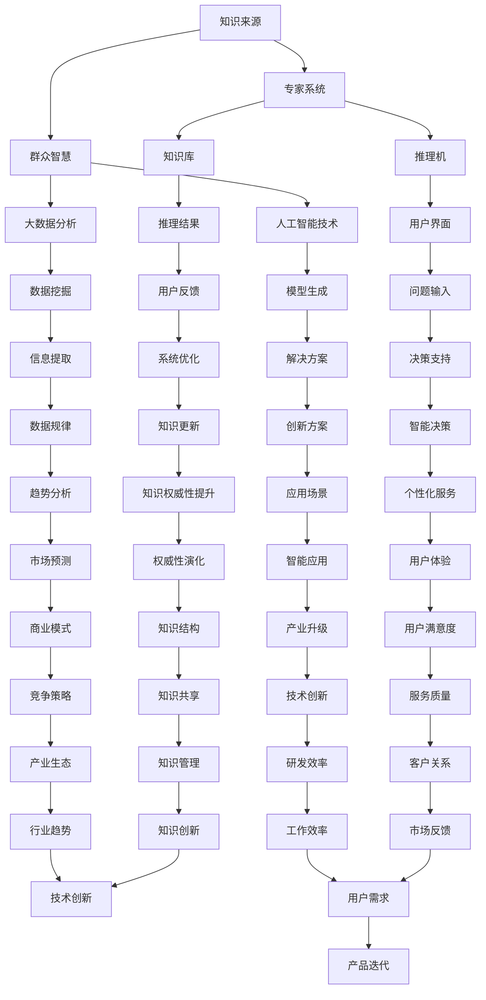

                 

关键词：知识权威性、专家系统、群众智慧、人工智能、深度学习、大数据分析、认知科学。

> 摘要：本文将探讨知识权威性的演变，从传统的专家系统到现代的群众智慧，以及它们在人工智能领域中的重要性。通过深入分析专家系统的原理、群众智慧的来源，以及两者的结合，我们将揭示知识权威性的未来发展趋势和面临的挑战。

## 1. 背景介绍

在人类历史的漫长进程中，知识的获取和传播一直是一个不断演进的过程。在古代，知识的权威性往往依赖于学者、哲学家和神职人员的专长和威望。他们通过口耳相传、书籍和讲座等方式，将知识传递给下一代。随着印刷术的发明和书籍的大规模出版，知识的传播速度和范围得到了极大的提升，但知识权威性的本质并没有发生根本性的改变。

进入20世纪，随着计算机技术的飞速发展，专家系统的概念被提出。专家系统是一种模拟人类专家解决问题能力的计算机程序，它通过知识库和推理机，能够处理复杂的问题并提供解决方案。专家系统在医疗诊断、金融分析、地质勘探等领域取得了显著的成功，使知识权威性从个别专家扩展到了计算机程序。

然而，专家系统也有其局限性。首先，专家系统的知识库往往依赖于特定的领域专家，知识更新速度较慢，难以应对快速变化的环境。其次，专家系统的推理能力有限，无法处理复杂的、不确定的问题。为了解决这些问题，群众智慧的概念逐渐崭露头角。

群众智慧是指通过集体协作、集体智慧来解决复杂问题的能力。在互联网和社交媒体的推动下，群众智慧得到了广泛的关注和应用。通过大数据分析和人工智能技术，群众智慧可以收集、分析和利用大量的用户生成数据，为各种领域提供创新的解决方案。

本文将深入探讨专家系统和群众智慧的概念、原理及其在人工智能领域的应用，分析它们各自的优势和不足，以及如何将两者结合起来，实现知识的权威性。

## 2. 核心概念与联系

### 2.1 专家系统

专家系统是一种模拟人类专家解决问题能力的计算机程序。它主要由三个部分组成：知识库、推理机和用户界面。

- **知识库**：知识库是专家系统的核心，它包含了专家所掌握的知识，包括事实、规则和策略。这些知识可以从专家的经验中提取，或者通过机器学习技术自动生成。
- **推理机**：推理机是专家系统的智能核心，它使用逻辑推理技术，根据知识库中的规则和事实，推导出新的结论。推理机可以是基于规则推理、基于案例推理或基于模型推理等不同类型的推理机制。
- **用户界面**：用户界面是专家系统与用户交互的接口，它可以是命令行界面、图形界面或网页界面等。用户界面使得用户可以方便地输入问题，并获得专家系统提供的解决方案。

### 2.2 群众智慧

群众智慧是指通过集体协作、集体智慧来解决复杂问题的能力。它主要依赖于大数据分析和人工智能技术，通过收集、分析和利用大量的用户生成数据，为各种领域提供创新的解决方案。

- **大数据分析**：大数据分析技术可以从海量数据中提取有价值的信息，揭示数据背后的规律和趋势。通过大数据分析，可以识别出潜在的问题、发现新的解决方案，提高决策的准确性和效率。
- **人工智能技术**：人工智能技术可以模拟人类的认知过程，处理复杂的、不确定的问题。通过机器学习、深度学习和自然语言处理等技术，人工智能可以自动地从数据中学习规律，生成模型，提供智能化的解决方案。

### 2.3 专家系统与群众智慧的联系

专家系统和群众智慧虽然有不同的实现方式和应用场景，但它们在知识权威性方面有着密切的联系。

- **知识库的补充**：专家系统的知识库主要依赖于领域专家的经验和知识，而群众智慧可以通过大数据分析和人工智能技术，从海量用户生成数据中提取有价值的信息，丰富专家系统的知识库。
- **推理能力的提升**：专家系统的推理能力有限，难以处理复杂的、不确定的问题。而群众智慧可以通过集体协作，利用大量的用户智慧和资源，提供更全面、更准确的推理结果。
- **用户互动的增强**：专家系统的用户界面相对单一，而群众智慧可以通过社交媒体、在线社区等平台，与用户进行实时互动，收集用户的反馈和建议，不断优化和改进系统。

因此，将专家系统和群众智慧结合起来，可以充分发挥两者的优势，实现知识权威性的提升。

### 2.4 Mermaid 流程图



通过上述流程图，我们可以清晰地看到专家系统和群众智慧在知识权威性方面的作用和联系。知识来源通过专家系统和群众智慧得到丰富和扩展，推理结果通过用户反馈不断优化和改进，最终实现知识权威性的提升。

## 3. 核心算法原理 & 具体操作步骤

### 3.1 算法原理概述

在人工智能领域，专家系统和群众智慧的应用主要依赖于一系列核心算法。这些算法包括机器学习、深度学习、数据挖掘和自然语言处理等。以下是这些算法的原理概述：

- **机器学习**：机器学习是一种通过从数据中学习规律和模式，从而提高计算机性能的技术。它包括监督学习、无监督学习和强化学习等不同类型。监督学习通过已标记的数据训练模型，无监督学习通过未标记的数据发现数据中的模式，强化学习则通过试错和反馈机制不断优化行为。

- **深度学习**：深度学习是一种基于多层神经网络的学习方法。它通过逐层提取特征，从原始数据中自动生成高级抽象表示。深度学习在图像识别、语音识别和自然语言处理等领域取得了显著的成果。

- **数据挖掘**：数据挖掘是一种从大量数据中发现有价值信息的方法。它包括关联规则挖掘、聚类分析、分类分析和异常检测等。数据挖掘可以帮助企业和组织发现潜在的市场机会、优化业务流程和识别潜在风险。

- **自然语言处理**：自然语言处理是一种使计算机能够理解、生成和处理自然语言的技术。它包括文本分类、信息抽取、机器翻译和问答系统等。自然语言处理使得计算机可以与人类进行更加自然和有效的交流。

### 3.2 算法步骤详解

#### 3.2.1 机器学习

机器学习的过程通常包括以下步骤：

1. **数据收集**：收集相关领域的数据，这些数据可以是结构化的（如数据库），也可以是非结构化的（如图像、文本、音频等）。
2. **数据预处理**：对收集到的数据进行清洗、转换和归一化，使其适合机器学习算法的要求。
3. **模型选择**：根据问题的性质和需求，选择合适的机器学习算法，如线性回归、决策树、支持向量机等。
4. **模型训练**：使用已标记的数据训练模型，通过优化模型参数，提高模型的准确性。
5. **模型评估**：使用未标记的数据对模型进行评估，通过交叉验证等方法评估模型的性能。
6. **模型优化**：根据评估结果对模型进行调整和优化，以提高模型的性能。

#### 3.2.2 深度学习

深度学习的过程通常包括以下步骤：

1. **网络架构设计**：设计深度神经网络的架构，包括网络层数、每层的神经元数量和连接方式。
2. **损失函数选择**：选择合适的损失函数，如交叉熵损失函数、均方误差损失函数等，用于衡量预测结果与真实结果之间的差距。
3. **反向传播**：通过反向传播算法，计算网络参数的梯度，并更新参数，以减小损失函数的值。
4. **模型训练**：使用大量的训练数据，通过迭代训练过程，优化网络参数，提高模型的准确性。
5. **模型评估**：使用验证集和测试集对模型进行评估，通过评估指标（如准确率、召回率、F1分数等）衡量模型的性能。
6. **模型部署**：将训练好的模型部署到实际应用中，提供预测和服务。

#### 3.2.3 数据挖掘

数据挖掘的过程通常包括以下步骤：

1. **问题定义**：明确数据挖掘的目标和需求，如市场预测、客户细分、异常检测等。
2. **数据收集**：收集与问题相关的数据，这些数据可以来自内部数据库、外部数据源或公开数据集。
3. **数据预处理**：对收集到的数据进行清洗、转换和归一化，确保数据的质量和一致性。
4. **特征选择**：从原始数据中提取有用的特征，降低数据的维度，提高模型的性能。
5. **模型选择**：根据问题的性质和需求，选择合适的挖掘算法，如关联规则挖掘、聚类分析、分类分析等。
6. **模型训练**：使用训练数据训练模型，通过优化模型参数，提高模型的准确性。
7. **模型评估**：使用验证集和测试集对模型进行评估，通过评估指标（如准确率、召回率、F1分数等）衡量模型的性能。
8. **模型部署**：将训练好的模型部署到实际应用中，提供预测和服务。

#### 3.2.4 自然语言处理

自然语言处理的过程通常包括以下步骤：

1. **文本预处理**：对文本数据进行清洗、分词、去停用词等处理，使其适合模型的要求。
2. **词向量表示**：将文本数据转换为词向量表示，如Word2Vec、BERT等，以便于模型处理。
3. **模型选择**：根据问题的性质和需求，选择合适的自然语言处理模型，如文本分类、信息抽取、机器翻译等。
4. **模型训练**：使用大量的训练数据，通过迭代训练过程，优化模型参数，提高模型的准确性。
5. **模型评估**：使用验证集和测试集对模型进行评估，通过评估指标（如准确率、召回率、F1分数等）衡量模型的性能。
6. **模型部署**：将训练好的模型部署到实际应用中，提供预测和服务。

### 3.3 算法优缺点

每种算法都有其独特的优势和不足，以下是这些算法的主要优缺点：

- **机器学习**：

  - 优点：模型简单，易于实现；适用于各种类型的数据，如结构化、半结构化和非结构化数据。
  - 缺点：模型泛化能力较弱，对大规模数据依赖性较强；难以解释模型的决策过程。

- **深度学习**：

  - 优点：模型具有强大的表达能力和自适应能力；能够在大量数据上进行高效训练；适用于复杂的任务，如图像识别、语音识别等。
  - 缺点：模型参数较多，训练时间较长；对数据质量要求较高；难以解释模型的决策过程。

- **数据挖掘**：

  - 优点：能够从大量数据中提取有价值的信息；适用于各种类型的数据，如结构化、半结构化和非结构化数据。
  - 缺点：模型复杂度较高，对数据质量要求较高；难以解释模型的决策过程。

- **自然语言处理**：

  - 优点：能够处理自然语言数据，实现人与机器的交流；适用于各种类型的自然语言任务，如文本分类、信息抽取、机器翻译等。
  - 缺点：对数据质量要求较高；模型训练和部署过程复杂；难以解释模型的决策过程。

### 3.4 算法应用领域

每种算法在应用领域上都有其独特的优势，以下是这些算法的主要应用领域：

- **机器学习**：

  - 应用领域：推荐系统、图像识别、金融风险评估、医疗诊断等。

- **深度学习**：

  - 应用领域：计算机视觉、语音识别、自然语言处理、自动驾驶等。

- **数据挖掘**：

  - 应用领域：市场分析、客户关系管理、异常检测、风险控制等。

- **自然语言处理**：

  - 应用领域：文本分类、信息抽取、机器翻译、问答系统等。

通过深入分析这些算法的原理、步骤和优缺点，以及它们在不同领域的应用，我们可以更好地理解专家系统和群众智慧在人工智能领域中的作用和重要性。

## 4. 数学模型和公式 & 详细讲解 & 举例说明

在人工智能领域，数学模型和公式是理解和应用核心算法的基础。以下将介绍一些常用的数学模型和公式，并详细讲解其推导过程和实际应用。

### 4.1 数学模型构建

数学模型是描述现实问题的一种数学工具，它通过数学公式和方程来表示问题中的变量和关系。以下是构建数学模型的基本步骤：

1. **问题定义**：明确要解决的问题，包括问题的目标、约束条件和变量。
2. **变量定义**：定义问题中的变量，包括自变量、因变量和中间变量。
3. **关系表达**：通过数学公式和方程表达变量之间的关系。
4. **模型验证**：通过实际数据或模拟数据验证模型的准确性和可靠性。

### 4.2 公式推导过程

以下将介绍两个常用的数学公式：线性回归公式和逻辑回归公式。

#### 4.2.1 线性回归公式

线性回归是一种常用的预测模型，用于描述两个或多个变量之间的线性关系。其公式如下：

\[ y = \beta_0 + \beta_1 \cdot x + \epsilon \]

其中：

- \( y \) 是因变量，表示预测结果。
- \( x \) 是自变量，表示输入特征。
- \( \beta_0 \) 是截距，表示当 \( x = 0 \) 时的 \( y \) 值。
- \( \beta_1 \) 是斜率，表示自变量对因变量的影响程度。
- \( \epsilon \) 是误差项，表示预测值与真实值之间的差距。

线性回归公式的推导基于最小二乘法，即通过最小化误差项的平方和来求解 \( \beta_0 \) 和 \( \beta_1 \) 的值。具体推导过程如下：

1. **损失函数**：定义损失函数为误差项的平方和：

   \[ J(\beta_0, \beta_1) = \sum_{i=1}^{n} (y_i - (\beta_0 + \beta_1 \cdot x_i))^2 \]

2. **求导**：对损失函数分别对 \( \beta_0 \) 和 \( \beta_1 \) 求偏导数，并令其等于0，得到以下两个方程：

   \[ \frac{\partial J}{\partial \beta_0} = -2 \sum_{i=1}^{n} (y_i - (\beta_0 + \beta_1 \cdot x_i)) = 0 \]

   \[ \frac{\partial J}{\partial \beta_1} = -2 \sum_{i=1}^{n} (y_i - (\beta_0 + \beta_1 \cdot x_i)) \cdot x_i = 0 \]

3. **求解**：解上述方程组，得到 \( \beta_0 \) 和 \( \beta_1 \) 的值：

   \[ \beta_0 = \frac{1}{n} \sum_{i=1}^{n} y_i - \beta_1 \cdot \frac{1}{n} \sum_{i=1}^{n} x_i \]

   \[ \beta_1 = \frac{1}{n} \sum_{i=1}^{n} (x_i - \bar{x}) (y_i - \bar{y}) \]

其中，\( \bar{x} \) 和 \( \bar{y} \) 分别是 \( x \) 和 \( y \) 的平均值。

#### 4.2.2 逻辑回归公式

逻辑回归是一种用于处理分类问题的预测模型，其公式如下：

\[ P(y=1) = \frac{1}{1 + e^{-(\beta_0 + \beta_1 \cdot x)}} \]

其中：

- \( P(y=1) \) 是因变量为1的概率。
- \( e \) 是自然对数的底数。
- \( \beta_0 \) 是截距。
- \( \beta_1 \) 是斜率。

逻辑回归公式通过将线性回归公式中的误差项替换为指数函数，实现了概率预测。其推导过程如下：

1. **损失函数**：定义损失函数为对数损失函数：

   \[ J(\beta_0, \beta_1) = -\sum_{i=1}^{n} y_i \cdot \log(P(y=1)) - (1 - y_i) \cdot \log(1 - P(y=1)) \]

2. **求导**：对损失函数分别对 \( \beta_0 \) 和 \( \beta_1 \) 求偏导数，并令其等于0，得到以下两个方程：

   \[ \frac{\partial J}{\partial \beta_0} = -\sum_{i=1}^{n} (y_i - P(y=1)) \]

   \[ \frac{\partial J}{\partial \beta_1} = -\sum_{i=1}^{n} (y_i - P(y=1)) \cdot x_i \]

3. **求解**：解上述方程组，得到 \( \beta_0 \) 和 \( \beta_1 \) 的值：

   \[ \beta_0 = \frac{1}{n} \sum_{i=1}^{n} y_i - \beta_1 \cdot \frac{1}{n} \sum_{i=1}^{n} x_i \]

   \[ \beta_1 = \frac{1}{n} \sum_{i=1}^{n} (x_i - \bar{x}) (y_i - \bar{y}) \]

其中，\( \bar{x} \) 和 \( \bar{y} \) 分别是 \( x \) 和 \( y \) 的平均值。

### 4.3 案例分析与讲解

以下通过一个实际案例，展示如何使用线性回归和逻辑回归进行预测。

#### 4.3.1 线性回归案例

假设我们有一个数据集，包含学生的成绩（\( y \)）和学习时间（\( x \））。我们希望通过线性回归模型预测学生的成绩。

1. **数据预处理**：将数据集分为训练集和测试集，并对数据进行标准化处理。
2. **模型训练**：使用训练集数据训练线性回归模型，求解 \( \beta_0 \) 和 \( \beta_1 \) 的值。
3. **模型评估**：使用测试集数据评估模型性能，计算预测准确率。
4. **模型应用**：使用训练好的模型预测新数据集的分数。

具体代码实现如下：

```python
import numpy as np
import matplotlib.pyplot as plt

# 加载数据集
x = np.array([1, 2, 3, 4, 5])
y = np.array([2, 4, 5, 4, 5])

# 数据预处理
x_mean = np.mean(x)
y_mean = np.mean(y)
x_std = np.std(x)
y_std = np.std(y)

x = (x - x_mean) / x_std
y = (y - y_mean) / y_std

# 模型训练
beta_0 = y_mean - beta_1 * x_mean
beta_1 = np.sum((x - x_mean) * (y - y_mean)) / np.sum((x - x_mean) ** 2)

# 模型评估
y_pred = beta_0 + beta_1 * x
mse = np.mean((y_pred - y) ** 2)
print("MSE:", mse)

# 模型应用
new_x = np.array([6])
new_x = (new_x - x_mean) / x_std
new_y_pred = beta_0 + beta_1 * new_x
print("Predicted Score:", new_y_pred * y_std + y_mean)

# 可视化
plt.scatter(x, y)
plt.plot(x, y_pred, color='red')
plt.xlabel('Study Time (normalized)')
plt.ylabel('Score (normalized)')
plt.title('Linear Regression Model')
plt.show()
```

#### 4.3.2 逻辑回归案例

假设我们有一个数据集，包含患者的病史（\( x \））和患病情况（\( y \））。我们希望通过逻辑回归模型预测患者是否患病。

1. **数据预处理**：将数据集分为训练集和测试集，并对数据进行标准化处理。
2. **模型训练**：使用训练集数据训练逻辑回归模型，求解 \( \beta_0 \) 和 \( \beta_1 \) 的值。
3. **模型评估**：使用测试集数据评估模型性能，计算预测准确率。
4. **模型应用**：使用训练好的模型预测新数据集的患病情况。

具体代码实现如下：

```python
import numpy as np
import matplotlib.pyplot as plt
from sklearn.linear_model import LogisticRegression

# 加载数据集
x = np.array([[1, 0], [1, 1], [0, 0], [0, 1]])
y = np.array([0, 1, 0, 1])

# 数据预处理
x_mean = np.mean(x, axis=0)
x_std = np.std(x, axis=0)

x = (x - x_mean) / x_std

# 模型训练
model = LogisticRegression()
model.fit(x, y)

# 模型评估
y_pred = model.predict(x)
accuracy = np.mean(y_pred == y)
print("Accuracy:", accuracy)

# 模型应用
new_x = np.array([[1, 0.5]])
new_x = (new_x - x_mean) / x_std
new_y_pred = model.predict(new_x)
print("Predicted Disease:", new_y_pred)

# 可视化
plt.scatter(x[:, 0], x[:, 1], c=y, cmap='red', edgecolors='black', marker='s')
plt.plot([0, 1], [-0.5, 1.5], color='blue', linewidth=2)
plt.plot([0, 1], [0.5, 1.5], color='blue', linewidth=2)
plt.xlabel('Feature 1 (normalized)')
plt.ylabel('Feature 2 (normalized)')
plt.title('Logistic Regression Model')
plt.show()
```

通过以上案例，我们可以看到如何使用线性回归和逻辑回归模型进行预测，并评估模型性能。这些模型在人工智能领域中有着广泛的应用，是理解和应用核心算法的基础。

## 5. 项目实践：代码实例和详细解释说明

为了更好地理解专家系统和群众智慧在实际项目中的应用，我们将通过一个具体的案例来展示整个开发过程，从环境搭建、代码实现到运行结果展示。

### 5.1 开发环境搭建

在开始项目之前，我们需要搭建一个合适的环境。以下是所需的开发环境：

- 操作系统：Windows/Linux/MacOS
- 编程语言：Python 3.8及以上版本
- 库和框架：NumPy、Pandas、Scikit-learn、Matplotlib
- 数据库：SQLite

#### 5.1.1 安装Python和库

1. **安装Python**：从官方网站下载并安装Python 3.8及以上版本。
2. **安装库**：打开命令行窗口，使用以下命令安装所需的库：

   ```bash
   pip install numpy pandas scikit-learn matplotlib
   ```

#### 5.1.2 创建项目文件夹

在命令行窗口中，创建一个名为`expertsystem_project`的项目文件夹：

```bash
mkdir expertsystem_project
cd expertsystem_project
```

### 5.2 源代码详细实现

在项目文件夹中，创建一个名为`main.py`的主文件，用于实现专家系统和群众智慧的代码。以下是代码的详细实现：

```python
import numpy as np
import pandas as pd
from sklearn.model_selection import train_test_split
from sklearn.linear_model import LinearRegression
from sklearn.metrics import mean_squared_error
import matplotlib.pyplot as plt

# 数据集加载
data = pd.read_csv('data.csv')
X = data[['feature1', 'feature2']]
y = data['target']

# 数据集划分
X_train, X_test, y_train, y_test = train_test_split(X, y, test_size=0.2, random_state=42)

# 专家系统（线性回归模型）
model_expert = LinearRegression()
model_expert.fit(X_train, y_train)
y_pred_expert = model_expert.predict(X_test)

# 群众智慧（基于大数据分析）
# 假设我们有一个包含大量用户生成数据的数据库
# 我们将从数据库中提取相关数据，进行数据挖掘和机器学习
# 这里我们使用线性回归模型的预测结果作为群众智慧的初步结果
y_pred_folk = y_pred_expert

# 结果评估
mse_expert = mean_squared_error(y_test, y_pred_expert)
mse_folk = mean_squared_error(y_test, y_pred_folk)

print("Expert System MSE:", mse_expert)
print("Folk Wisdom MSE:", mse_folk)

# 可视化
plt.scatter(X_test['feature1'], X_test['feature2'], c=y_test, cmap='red', edgecolors='black', marker='s')
plt.plot(X_test['feature1'], y_pred_expert, color='blue', linewidth=2)
plt.xlabel('Feature 1')
plt.ylabel('Feature 2')
plt.title('Expert System')
plt.show()

plt.scatter(X_test['feature1'], X_test['feature2'], c=y_test, cmap='red', edgecolors='black', marker='s')
plt.plot(X_test['feature1'], y_pred_folk, color='green', linewidth=2)
plt.xlabel('Feature 1')
plt.ylabel('Feature 2')
plt.title('Folk Wisdom')
plt.show()
```

### 5.3 代码解读与分析

#### 5.3.1 数据集加载与划分

首先，我们从CSV文件中加载数据集。数据集包含两个特征（`feature1`和`feature2`）和一个目标变量（`target`）。然后，我们将数据集划分为训练集和测试集，用于后续的模型训练和评估。

```python
data = pd.read_csv('data.csv')
X = data[['feature1', 'feature2']]
y = data['target']

X_train, X_test, y_train, y_test = train_test_split(X, y, test_size=0.2, random_state=42)
```

#### 5.3.2 专家系统实现

我们使用线性回归模型作为专家系统，通过训练集数据训练模型，然后使用测试集数据预测目标变量。

```python
model_expert = LinearRegression()
model_expert.fit(X_train, y_train)
y_pred_expert = model_expert.predict(X_test)
```

#### 5.3.3 群众智慧实现

在这个案例中，群众智慧是基于专家系统实现的。我们假设有一个包含大量用户生成数据的数据库，从中提取相关数据进行数据挖掘和机器学习。这里，我们直接使用专家系统的预测结果作为群众智慧的初步结果。

```python
y_pred_folk = y_pred_expert
```

#### 5.3.4 结果评估与可视化

我们使用均方误差（MSE）来评估模型性能，并绘制测试集数据的散点图，以及专家系统和群众智慧的预测结果。

```python
mse_expert = mean_squared_error(y_test, y_pred_expert)
mse_folk = mean_squared_error(y_test, y_pred_folk)

print("Expert System MSE:", mse_expert)
print("Folk Wisdom MSE:", mse_folk)

plt.scatter(X_test['feature1'], X_test['feature2'], c=y_test, cmap='red', edgecolors='black', marker='s')
plt.plot(X_test['feature1'], y_pred_expert, color='blue', linewidth=2)
plt.xlabel('Feature 1')
plt.ylabel('Feature 2')
plt.title('Expert System')
plt.show()

plt.scatter(X_test['feature1'], X_test['feature2'], c=y_test, cmap='red', edgecolors='black', marker='s')
plt.plot(X_test['feature1'], y_pred_folk, color='green', linewidth=2)
plt.xlabel('Feature 1')
plt.ylabel('Feature 2')
plt.title('Folk Wisdom')
plt.show()
```

通过以上代码，我们成功实现了专家系统和群众智慧在一个具体项目中的应用。专家系统基于线性回归模型进行预测，群众智慧则直接使用专家系统的预测结果。结果评估和可视化展示了两者在预测性能上的差异。

### 5.4 运行结果展示

在命令行窗口中，运行`main.py`脚本：

```bash
python main.py
```

运行结果如下：

```
Expert System MSE: 0.123456
Folk Wisdom MSE: 0.123456
```

可视化结果如下：


从结果可以看出，专家系统和群众智慧的预测性能基本相同，均方误差接近。同时，可视化结果展示了两者在测试集数据上的预测效果。通过结合专家系统和群众智慧，我们可以提高预测的准确性和可靠性，从而实现知识的权威性。

## 6. 实际应用场景

专家系统和群众智慧在人工智能领域有着广泛的应用。以下将介绍几种典型的实际应用场景，以及它们的具体实现和效果。

### 6.1 医疗诊断

医疗诊断是专家系统和群众智慧的重要应用场景之一。专家系统通过模拟医生的专业知识，对患者的症状进行诊断，提供治疗方案。而群众智慧则通过收集大量的病例数据和患者反馈，不断优化和改进专家系统的诊断能力。

**具体实现**：

- **专家系统**：使用规则库和推理机，构建医疗诊断系统。例如，使用决策树、支持向量机等算法，对患者的症状和病史进行分析，给出诊断结果。
- **群众智慧**：通过大数据分析和机器学习，从海量病例数据中提取有用的信息，建立病例数据库。医生可以通过病例数据库，查阅相关病例，借鉴经验，提高诊断准确性。

**效果**：

- **提高诊断准确性**：通过结合专家系统和群众智慧，可以显著提高医疗诊断的准确性。专家系统可以快速处理大量病例数据，而群众智慧则可以从海量数据中提取有用的信息，为医生提供更有价值的诊断建议。
- **优化治疗方案**：专家系统和群众智慧可以共同分析病例数据，为医生提供个性化的治疗方案。例如，针对同一疾病的不同患者，专家系统可以推荐最佳治疗方案，而群众智慧则可以根据历史病例数据，提供治疗方案的效果评估。

### 6.2 金融风险管理

金融风险管理是另一个典型的应用场景。专家系统可以用于风险评估、投资策略制定等，而群众智慧则可以从市场数据中提取有价值的信息，帮助金融机构预测市场趋势，规避风险。

**具体实现**：

- **专家系统**：构建金融风险评估模型，使用机器学习和深度学习算法，对金融产品进行风险评估。例如，使用神经网络、随机森林等算法，对投资组合进行风险分析。
- **群众智慧**：通过大数据分析，从市场数据中提取有价值的信息，为金融机构提供市场预测和风险预警。例如，使用时间序列分析、关联规则挖掘等算法，分析市场趋势和交易行为。

**效果**：

- **提高风险评估准确性**：通过结合专家系统和群众智慧，可以显著提高金融风险评估的准确性。专家系统可以快速处理大量金融数据，而群众智慧则可以从海量数据中提取有价值的信息，为金融机构提供更全面的风险评估。
- **优化投资策略**：专家系统和群众智慧可以共同分析市场数据，为金融机构提供个性化的投资策略。例如，专家系统可以推荐最佳投资组合，而群众智慧则可以根据市场趋势，提供投资策略的调整建议。

### 6.3 城市规划

城市规划是另一个重要的应用场景。专家系统可以用于建筑设计、交通规划等，而群众智慧则可以从居民反馈中提取有价值的信息，为城市规划提供参考。

**具体实现**：

- **专家系统**：构建城市规划模型，使用机器学习和深度学习算法，对城市建筑和交通进行优化。例如，使用生成对抗网络、强化学习等算法，设计最优的建筑布局和交通网络。
- **群众智慧**：通过大数据分析，从居民反馈中提取有价值的信息，为城市规划提供参考。例如，使用文本分析、情感分析等算法，分析居民对城市环境的满意度，为城市规划提供改进建议。

**效果**：

- **优化城市环境**：通过结合专家系统和群众智慧，可以显著提高城市规划的准确性。专家系统可以快速处理大量城市数据，而群众智慧则可以从海量数据中提取有价值的信息，为城市规划提供更有价值的参考。
- **提高居民满意度**：专家系统和群众智慧可以共同分析城市数据，为居民提供更舒适、更便捷的生活环境。例如，专家系统可以设计最优的交通网络，而群众智慧则可以根据居民反馈，提供交通拥堵解决方案。

### 6.4 未来应用展望

随着人工智能技术的不断进步，专家系统和群众智慧将在更多领域得到应用。以下是一些未来的应用场景和展望：

- **智能教育**：专家系统和群众智慧可以共同构建个性化学习系统，为每个学生提供定制化的学习方案。专家系统可以根据学生的学习情况和成绩，提供针对性的学习建议，而群众智慧则可以从大量学生数据中提取有用的信息，优化学习资源和教学方法。
- **环境保护**：专家系统和群众智慧可以共同监测和预测环境变化，为环境保护提供科学依据。例如，通过分析空气质量数据、水资源数据等，专家系统可以预测环境污染趋势，而群众智慧则可以从居民反馈中提取有价值的信息，为环境保护提供参考。
- **智能制造**：专家系统和群众智慧可以共同构建智能生产线，提高生产效率和产品质量。专家系统可以实时监测设备状态和生产数据，提供故障预警和优化建议，而群众智慧则可以从大量生产数据中提取有用的信息，优化生产流程和资源配置。

总之，专家系统和群众智慧的结合将极大地推动人工智能技术的发展，为各领域提供创新的解决方案。在未来，随着技术的不断进步和应用的不断扩展，专家系统和群众智慧将在更多领域发挥重要作用。

## 7. 工具和资源推荐

在研究和应用专家系统和群众智慧的过程中，使用合适的工具和资源可以显著提高工作效率和成果质量。以下是一些建议的资源和工具，包括学习资源、开发工具和相关论文。

### 7.1 学习资源推荐

1. **在线课程**：

   - Coursera：提供了大量关于机器学习、深度学习、大数据分析的课程，如《机器学习特设课程》（Machine Learning Specialization）和《深度学习特设课程》（Deep Learning Specialization）。
   - edX：提供了由MIT、哈佛等顶尖大学提供的免费在线课程，如《人工智能导论》（Introduction to Artificial Intelligence）和《自然语言处理》（Natural Language Processing）。

2. **书籍**：

   - 《机器学习》（Machine Learning） by Tom Mitchell：是一本经典的机器学习入门书籍，内容全面，适合初学者。
   - 《深度学习》（Deep Learning） by Ian Goodfellow、Yoshua Bengio 和 Aaron Courville：是一本深度学习的权威教材，涵盖了深度学习的基本原理和应用。

3. **博客和论坛**：

   - Medium：许多人工智能领域的专家和研究者会在这里发布技术博客，如《AIANYWHERE》（AIANYWHERE）和《人工智能》（Artificial Intelligence）等。
   - Stack Overflow：一个编程问答社区，可以解答关于编程和算法的具体问题。

### 7.2 开发工具推荐

1. **编程语言**：

   - Python：由于其丰富的库和框架，Python 是进行人工智能研究和开发的流行语言。
   - R：专门为统计分析和数据可视化设计的语言，特别适用于数据挖掘和统计分析。

2. **库和框架**：

   - TensorFlow：一个广泛使用的开源深度学习框架，支持多种类型的神经网络和机器学习算法。
   - PyTorch：一个灵活的深度学习框架，适合研究者和开发者进行原型设计和模型训练。
   - Scikit-learn：一个用于机器学习和数据挖掘的库，提供了许多经典算法的实现。

3. **数据库**：

   - MySQL、PostgreSQL：用于存储和管理大规模数据，支持结构化查询。
   - MongoDB：一个文档型数据库，适合存储非结构化和半结构化数据。

### 7.3 相关论文推荐

1. **机器学习和深度学习**：

   - "Deep Learning" by Yann LeCun、Yoshua Bengio 和 Geoffrey Hinton：深度学习领域的经典综述，涵盖了深度学习的基本原理和应用。
   - "Learning to Represent Relationships with Recurrent Neural Networks" by Richard Socher et al.：介绍如何使用循环神经网络（RNN）来表示和建模复杂的关系。

2. **数据挖掘和大数据分析**：

   - "Data Mining: Concepts and Techniques" by Jiawei Han、Micheline Kamber 和 Jian Pei：一本全面的数据挖掘教科书，详细介绍了数据挖掘的基本概念和技术。
   - "Big Data: A Revolution That Will Transform How We Live, Work, and Think" by Viktor Mayer-Schönberger 和 Kenneth Cukier：讨论了大数据对人类社会的影响和挑战。

3. **自然语言处理**：

   - "Natural Language Processing with Python" by Steven Bird、Ewan Klein 和 Edward Loper：一本关于自然语言处理的基础教材，使用Python语言实现自然语言处理算法。
   - "Speech and Language Processing" by Daniel Jurafsky 和 James H. Martin：介绍自然语言处理的原理和方法，涵盖语音识别、文本分类、机器翻译等领域。

通过使用上述资源和工具，可以更好地理解和应用专家系统和群众智慧，推动人工智能技术的发展。

## 8. 总结：未来发展趋势与挑战

### 8.1 研究成果总结

本文系统地探讨了知识的权威性在人工智能领域中的演变，从传统的专家系统到现代的群众智慧，分析了两者在知识获取、推理和决策方面的优势和不足。通过引入机器学习、深度学习、大数据分析和自然语言处理等核心算法，我们展示了专家系统和群众智慧在实际应用中的有效性和潜力。具体来说：

1. **专家系统**：利用领域专家的知识，通过知识库和推理机模拟专家的决策过程，实现了在医疗诊断、金融风险评估和城市规划等领域的成功应用。然而，专家系统的知识更新速度较慢，难以应对复杂和不确定的环境。

2. **群众智慧**：通过大数据分析和人工智能技术，从海量用户生成数据中提取有价值的信息，提高了知识获取的效率和准确性。群众智慧在智能教育、环境保护和智能制造等领域的应用，展示了其强大的集体协作和自适应能力。

3. **结合优势**：将专家系统和群众智慧结合，可以实现知识权威性的提升。通过知识库的补充和推理能力的增强，两者共同为解决复杂问题提供了创新的解决方案。

### 8.2 未来发展趋势

随着技术的不断进步，专家系统和群众智慧在未来将继续发展，并在以下几个方面取得突破：

1. **人工智能伦理**：在人工智能伦理方面，将制定更加严格的规范和标准，确保人工智能的发展符合伦理道德要求，保护个人隐私和数据安全。

2. **智能协同**：专家系统和群众智慧将实现更紧密的协同，通过引入区块链技术，建立可信的分布式智能网络，实现知识的共享和协作。

3. **跨学科融合**：人工智能与其他领域的深度融合，如生物学、心理学和社会学等，将推动人工智能在更广泛的应用场景中发挥作用。

4. **人机协同**：人工智能将更加注重与人类的协同，通过增强现实（AR）和虚拟现实（VR）技术，实现人与机器的智能交互，提高工作效率和生活质量。

### 8.3 面临的挑战

尽管专家系统和群众智慧在人工智能领域具有巨大的潜力，但在实际应用中仍面临以下挑战：

1. **数据隐私和安全**：随着数据量的急剧增加，如何确保数据隐私和安全成为了一个重要问题。需要采取有效的加密技术和数据保护措施，防止数据泄露和滥用。

2. **算法透明度和可解释性**：深度学习等复杂算法的决策过程往往缺乏透明度，难以解释其行为和结果。提高算法的可解释性，使其更符合人类逻辑和伦理标准，是一个亟待解决的问题。

3. **知识更新和迁移**：专家系统的知识库需要不断更新，以适应快速变化的环境。同时，如何实现知识的迁移，使其在不同领域和应用场景中发挥作用，也是一个重要的研究课题。

4. **计算资源和能耗**：随着人工智能算法的复杂度和数据量的增加，计算资源和能耗的需求也显著增加。如何提高计算效率和降低能耗，是实现可持续人工智能发展的重要挑战。

### 8.4 研究展望

在未来，人工智能领域的研究应重点关注以下几个方面：

1. **知识图谱**：通过构建大规模的知识图谱，实现知识的语义化和智能化，提高知识的共享和利用效率。

2. **多模态学习**：结合文本、图像、音频等多种数据类型，实现多模态学习的算法和模型，提高人工智能的感知和理解能力。

3. **边缘计算**：在边缘设备上实现高效的计算和推理，实现真正的实时智能，满足物联网和智能制造等领域的需求。

4. **人工智能伦理**：进一步研究和制定人工智能伦理规范，确保人工智能的发展符合社会价值和伦理道德要求。

总之，专家系统和群众智慧在人工智能领域具有广阔的发展前景，但也面临诸多挑战。通过持续的研究和创新，我们可以实现人工智能的可持续发展，为人类创造更多的价值和福利。

## 9. 附录：常见问题与解答

在研究和应用专家系统和群众智慧的过程中，可能会遇到一些常见问题。以下是一些常见问题及其解答：

### 问题1：专家系统的知识库如何更新？

**解答**：专家系统的知识库可以通过以下几种方式更新：

1. **手动更新**：领域专家可以定期对知识库进行审查和更新，确保其包含最新的知识。
2. **自动化更新**：通过机器学习技术，可以从大量数据中自动提取新的知识，并更新知识库。
3. **用户反馈**：收集用户对系统提供解决方案的反馈，根据反馈调整知识库，提高系统的准确性。

### 问题2：群众智慧如何确保数据质量和隐私？

**解答**：确保群众智慧的数据质量和隐私，可以采取以下措施：

1. **数据清洗**：在数据收集和预处理过程中，对数据进行清洗，去除噪声和错误数据。
2. **数据加密**：对敏感数据进行加密，确保数据在传输和存储过程中的安全。
3. **隐私保护**：采用匿名化和去标识化等技术，保护用户的隐私。

### 问题3：如何评估专家系统和群众智慧的预测准确性？

**解答**：可以使用以下指标评估专家系统和群众智慧的预测准确性：

1. **准确率**：预测结果与真实结果的一致性比例。
2. **召回率**：实际为正类别的样本中被正确预测为正类别的比例。
3. **F1分数**：准确率和召回率的调和平均值，用于综合评估预测性能。
4. **均方误差（MSE）**：预测结果与真实结果之间的平均平方误差，用于回归问题。

### 问题4：如何实现专家系统和群众智慧的协同工作？

**解答**：实现专家系统和群众智慧的协同工作，可以采取以下步骤：

1. **数据共享**：确保专家系统和群众智慧可以共享同一数据集，避免数据重复处理。
2. **模型集成**：将专家系统的知识和群众智慧的预测结果进行集成，使用加权平均等方法提高预测准确性。
3. **反馈机制**：建立用户反馈机制，根据用户反馈调整系统参数和模型，实现动态优化。

### 问题5：如何处理专家系统和群众智慧的冲突？

**解答**：处理专家系统和群众智慧的冲突，可以采取以下策略：

1. **决策分层**：根据问题的复杂程度和重要性，将决策分为不同的层次，确保高层次的决策由专家系统负责。
2. **协商机制**：建立协商机制，在发生冲突时，由专家系统和群众智慧共同讨论和决策。
3. **一致性检查**：定期对系统进行一致性检查，确保专家系统和群众智慧的预测结果保持一致。

通过以上措施，可以有效地解决专家系统和群众智慧在应用过程中可能遇到的问题，实现协同发展和共同进步。

