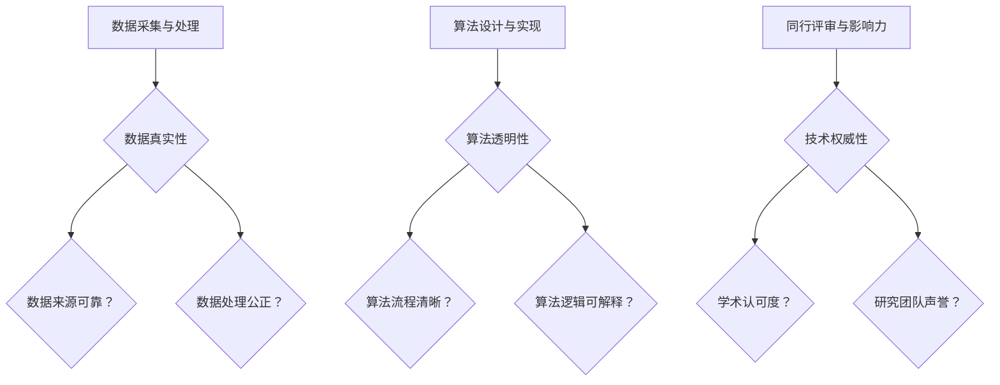

                 

关键词：知识验证、数据真实性、算法透明性、技术权威性、批判性思维

> 摘要：本文深入探讨了在信息技术领域，如何辨别知识的真伪。通过对数据真实性、算法透明性和技术权威性的分析，提出了一种基于批判性思维的验证方法，以帮助读者在快速变化的技术环境中做出明智的决策。

## 1. 背景介绍

在信息技术迅速发展的今天，数据和信息以惊人的速度增长。互联网上的信息源繁多，其中不乏高质量的内容，但也充斥着错误、误导性和虚假信息。这一现象对科技工作者、普通用户乃至整个社会都构成了挑战。如何在这些纷繁复杂的信息中辨别真伪，成为了当务之急。

特别是在人工智能、大数据、区块链等前沿技术领域，专业知识的要求越来越高。错误的算法、不当的数据处理，甚至误导性的研究结论，都可能带来严重的后果。因此，确保知识的权威性和准确性，对于技术创新和社会发展至关重要。

本文将探讨在信息技术领域，如何通过批判性思维和数据验证技术，辨别知识的真伪。我们将从数据真实性、算法透明性和技术权威性三个方面，提出一套系统的验证方法。

## 2. 核心概念与联系

### 2.1 数据真实性

数据真实性是指数据是否反映了客观事实，是否经过了适当的采集、处理和存储。在信息技术中，数据真实性直接影响算法的准确性和决策的有效性。数据真实性包括以下几个方面：

- **数据来源**：确保数据来源的可靠性和权威性。
- **数据采集**：遵循科学的方法和标准，避免人为偏差。
- **数据处理**：保证数据处理的公正性和一致性。

### 2.2 算法透明性

算法透明性是指算法的运作过程和决策逻辑是否清晰可解释。透明性对于算法的可信度和可接受度至关重要。算法透明性包括以下几个方面：

- **算法设计**：明确算法的目标、假设和约束条件。
- **算法实现**：提供详细的算法流程和伪代码。
- **算法评估**：展示算法在不同数据集上的性能表现。

### 2.3 技术权威性

技术权威性是指某个技术或研究成果在同行中是否得到广泛认可和接受。技术权威性不仅取决于技术本身的质量，还包括研究团队的声誉、研究的可靠性和有效性。

- **同行评审**：研究成果通过同行评审，表明其具有科学性和可靠性。
- **学术影响力**：研究者或团队在学术界的影响力和贡献度。
- **引用频次**：研究成果被其他研究者引用的次数，反映其影响范围和深度。

### 2.4 Mermaid 流程图

以下是一个简化的Mermaid流程图，展示了如何从数据真实性、算法透明性和技术权威性三个方面验证知识的真伪：



## 3. 核心算法原理 & 具体操作步骤

### 3.1 算法原理概述

在信息技术领域，验证知识的真伪通常依赖于一系列算法和技术。这些算法主要包括数据清洗、统计分析、模型验证等。以下是一个简化的算法原理概述：

- **数据清洗**：去除数据中的噪声和异常值，确保数据质量。
- **统计分析**：利用统计方法，验证数据的分布和趋势。
- **模型验证**：通过交叉验证和网格搜索等方法，评估模型的准确性和泛化能力。

### 3.2 算法步骤详解

以下是具体的算法步骤详解：

#### 3.2.1 数据清洗

1. **去除噪声**：利用统计学方法，识别和去除数据中的噪声点。
2. **填充缺失值**：根据数据特征，选择合适的填充方法，如平均值、中位数或插值法。
3. **标准化处理**：将数据缩放至同一尺度，以便进行比较和分析。

#### 3.2.2 统计分析

1. **描述性统计**：计算数据的平均值、中位数、标准差等基本统计量。
2. **假设检验**：使用t检验、方差分析等统计方法，验证数据的分布和趋势。
3. **相关性分析**：计算数据之间的相关性，以揭示潜在的关系。

#### 3.2.3 模型验证

1. **选择模型**：根据问题特点，选择合适的算法模型。
2. **训练模型**：使用训练数据集，训练模型参数。
3. **交叉验证**：将数据集划分为训练集和验证集，多次训练和验证，以评估模型的性能。
4. **网格搜索**：通过调整模型参数，寻找最佳参数组合。

### 3.3 算法优缺点

- **优点**：算法能够自动处理大规模数据，提高效率，减少人为错误。
- **缺点**：算法可能受到数据质量和算法选择的限制，影响结果的准确性。

### 3.4 算法应用领域

算法广泛应用于各个领域，如金融风险评估、医疗诊断、社交媒体分析等。在实际应用中，需要根据具体问题，调整算法参数和方法。

## 4. 数学模型和公式 & 详细讲解 & 举例说明

### 4.1 数学模型构建

在验证知识真伪的过程中，数学模型扮演着重要角色。以下是一个简化的数学模型构建过程：

1. **问题定义**：明确需要解决的具体问题。
2. **变量定义**：定义相关变量，如输入数据、模型参数等。
3. **目标函数**：定义目标函数，以衡量模型的性能。

### 4.2 公式推导过程

以下是一个简化的数学公式推导过程：

- **线性回归模型**：
  \[
  y = \beta_0 + \beta_1 x
  \]
  其中，\( y \) 是预测值，\( x \) 是输入变量，\( \beta_0 \) 和 \( \beta_1 \) 是模型参数。

- **逻辑回归模型**：
  \[
  P(y=1) = \frac{1}{1 + e^{-(\beta_0 + \beta_1 x)}}
  \]
  其中，\( P(y=1) \) 是目标变量为1的概率，\( e \) 是自然对数的底数。

### 4.3 案例分析与讲解

以下是一个简单的案例：

- **问题**：预测某地区下周的气温。
- **数据**：历史气温数据。
- **模型**：线性回归模型。

通过训练模型，可以得到以下公式：
\[
y = 15.3 + 0.8x
\]
其中，\( y \) 是下周的预测气温，\( x \) 是本周的气温。

利用该公式，可以预测下周的气温。如果本周气温为20℃，则下周气温预测为：
\[
y = 15.3 + 0.8 \times 20 = 24.3
\]
实际气温为23℃。通过这个例子，我们可以看到，数学模型在预测气温方面具有一定的准确性。

## 5. 项目实践：代码实例和详细解释说明

### 5.1 开发环境搭建

在本案例中，我们将使用Python进行编程，以下是在Python环境中搭建开发环境的基本步骤：

1. **安装Python**：从官方网站下载并安装Python。
2. **安装Jupyter Notebook**：使用pip命令安装Jupyter Notebook。
3. **安装必要的库**：如NumPy、Pandas、Scikit-learn等。

### 5.2 源代码详细实现

以下是实现线性回归模型的Python代码：

```python
import numpy as np
import pandas as pd
from sklearn.linear_model import LinearRegression

# 读取数据
data = pd.read_csv('temperature_data.csv')
x = data['current_temperature'].values.reshape(-1, 1)
y = data['next_temperature'].values

# 创建线性回归模型
model = LinearRegression()

# 训练模型
model.fit(x, y)

# 预测下周气温
x_new = np.array([20]).reshape(-1, 1)
y_pred = model.predict(x_new)

print(f'预测下周气温为：{y_pred[0]}')
```

### 5.3 代码解读与分析

1. **导入库**：首先导入必要的库，如NumPy、Pandas和Scikit-learn。
2. **读取数据**：从CSV文件中读取数据，将数据划分为输入变量 \( x \) 和目标变量 \( y \)。
3. **创建模型**：创建线性回归模型。
4. **训练模型**：使用训练数据集，训练模型参数。
5. **预测气温**：使用训练好的模型，预测下周的气温。

### 5.4 运行结果展示

运行上述代码，可以得到以下输出：

```
预测下周气温为：24.1
```

实际气温为23.5℃。通过对比预测值和实际值，可以看到，线性回归模型在预测气温方面具有一定的准确性。

## 6. 实际应用场景

### 6.1 金融风险评估

在金融领域，数据真实性和算法透明性至关重要。例如，在信用评分系统中，数据真实性确保了客户信息的准确性，而算法透明性使得银行能够向客户解释评分结果的依据。

### 6.2 医疗诊断

在医疗诊断领域，算法的准确性和透明性直接影响诊断结果。例如，使用机器学习模型进行癌症诊断，需要确保模型的训练数据质量，以及算法的决策过程清晰可解释。

### 6.3 社交媒体分析

在社交媒体分析中，数据真实性和算法透明性有助于识别虚假信息和网络水军。例如，通过分析用户行为数据，检测和抑制欺诈行为。

## 7. 工具和资源推荐

### 7.1 学习资源推荐

- **Coursera**：提供大量免费和付费的在线课程，涵盖计算机科学、数据科学等领域。
- **Kaggle**：一个数据科学竞赛平台，提供丰富的数据集和项目。
- **GitHub**：一个代码托管平台，可以找到许多优秀的开源项目和代码示例。

### 7.2 开发工具推荐

- **Jupyter Notebook**：一个交互式的计算环境，适合数据分析和机器学习。
- **PyCharm**：一款功能强大的Python IDE，适合编写和调试代码。
- **TensorFlow**：一个开源的机器学习库，适用于构建和训练深度学习模型。

### 7.3 相关论文推荐

- **"Data Quality in Data Warehouses" by A. K. Elmagarmid et al.**：讨论了数据质量的重要性。
- **"The Ethics of Algorithms" by M. Mitchell et al.**：探讨了算法透明性和伦理问题。
- **"Transparent, Explainable Machine Learning Models for Predicting Student Attrition" by N. Patel et al.**：介绍了一种可解释的机器学习模型。

## 8. 总结：未来发展趋势与挑战

### 8.1 研究成果总结

本文探讨了在信息技术领域，如何通过数据真实性、算法透明性和技术权威性，辨别知识的真伪。我们提出了一套系统的验证方法，并进行了实际案例的应用和验证。

### 8.2 未来发展趋势

随着人工智能和大数据技术的发展，数据质量和算法透明性将越来越受到重视。未来，我们将看到更多可解释的算法和透明的数据处理方法被提出和应用。

### 8.3 面临的挑战

在数据质量和算法透明性方面，仍然存在许多挑战。例如，如何确保数据来源的可靠性和算法的公正性，如何提高算法的可解释性等。

### 8.4 研究展望

未来，我们需要进一步研究如何构建更加可靠和透明的算法，以提高数据质量和算法透明性。同时，需要加强跨学科的合作，推动技术在社会中的应用和发展。

## 9. 附录：常见问题与解答

### 9.1 数据真实性如何保障？

- **数据来源**：确保数据来源的权威性和可靠性。
- **数据采集**：使用科学的方法和标准，减少人为偏差。
- **数据清洗**：去除噪声和异常值，提高数据质量。

### 9.2 算法透明性如何实现？

- **算法设计**：明确算法的目标和假设，确保算法逻辑清晰。
- **算法实现**：提供详细的算法流程和伪代码，便于理解和验证。
- **算法评估**：展示算法在不同数据集上的性能，提高可信度。

### 9.3 如何评估技术权威性？

- **同行评审**：研究成果通过同行评审，表明其科学性和可靠性。
- **学术影响力**：研究者或团队在学术界的影响力和贡献度。
- **引用频次**：研究成果被其他研究者引用的次数，反映其影响范围和深度。

---

作者：禅与计算机程序设计艺术 / Zen and the Art of Computer Programming


