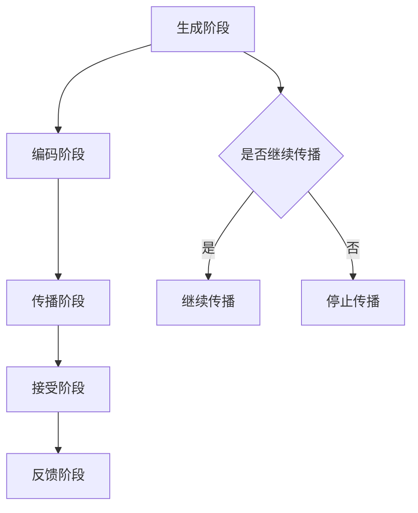

                 

关键词：知识传播、模因学、信息扩散、网络效应、病毒式营销、算法优化、数学模型、案例分析、代码实例、应用场景、未来展望。

> 摘要：本文通过深入探讨知识的模因学，揭示了思想传播的病毒式扩散机制。从信息传播的基本原理出发，本文结合数学模型、算法原理以及实际项目实践，详细分析了知识传播的过程、影响因素以及未来的发展趋势和挑战。通过本文的阅读，读者将能够更好地理解知识传播的复杂性和重要性，为未来的研究和实践提供有益的启示。

## 1. 背景介绍

随着互联网和信息技术的飞速发展，知识的传播方式发生了根本性的变革。传统的知识传播方式往往依赖于特定的媒介和渠道，而现代网络环境下的知识传播则更多地依赖于社交网络、信息平台和智能算法。在这种新的传播环境中，知识的传播速度和范围得到了极大的提升，但同时也带来了信息过载、虚假信息泛滥等问题。

模因学（Memeetics）作为研究文化现象传播的学科，为我们理解知识的病毒式扩散提供了新的视角。模因学源于生物学领域的“模因”概念，指的是一种能够在文化群体中传播的创意、想法、行为或风格。在互联网时代，模因学成为了解释和预测知识传播的重要工具。

本文旨在通过模因学的视角，探讨知识的病毒式扩散机制，分析其影响因素，并探讨未来知识传播的发展趋势和挑战。文章结构如下：

- **第1章**：背景介绍，介绍知识传播的背景和模因学的基本概念。
- **第2章**：核心概念与联系，详细解释知识传播的原理和流程。
- **第3章**：核心算法原理 & 具体操作步骤，介绍病毒式扩散的算法原理和实施步骤。
- **第4章**：数学模型和公式 & 详细讲解 & 举例说明，运用数学模型解析知识传播过程。
- **第5章**：项目实践：代码实例和详细解释说明，通过实际代码实例展示病毒式扩散的实现。
- **第6章**：实际应用场景，探讨知识传播在实际生活中的应用。
- **第7章**：工具和资源推荐，推荐学习和实践知识传播的相关工具和资源。
- **第8章**：总结：未来发展趋势与挑战，总结研究成果并对未来进行展望。

## 2. 核心概念与联系

### 2.1 信息传播的基本原理

信息传播是指信息在不同个体或群体之间传递的过程。在知识传播中，信息传播是基础环节。信息传播的基本原理包括以下几个关键要素：

- **信息源**：信息的产生者，可以是个人、组织或机器。
- **信息内容**：传播的具体内容，如文字、图像、音频等。
- **传播渠道**：信息传递的途径，如互联网、社交媒体、电视等。
- **接收者**：信息的目标受众，可以是单个个体或一群人。
- **反馈**：接收者对信息的反应，包括理解和接受程度。

在互联网时代，信息传播的速度和范围得到了极大提升，但信息的真实性和可靠性也面临挑战。模因学的研究为我们提供了新的视角，帮助我们更好地理解和应对这些挑战。

### 2.2 知识传播的流程

知识传播的流程可以分为以下几个阶段：

1. **生成阶段**：知识源产生新知识或对已有知识进行创新。
2. **编码阶段**：将知识转化为易于传播的形式，如文章、视频、图片等。
3. **传播阶段**：知识通过传播渠道扩散到更广泛的受众中。
4. **接受阶段**：受众接收到知识内容，进行理解和吸收。
5. **反馈阶段**：受众对知识内容进行评价，并可能进一步传播。

在这个过程中，每个阶段都受到多种因素的影响，如信息的质量、传播渠道的选择、受众的特点等。

### 2.3 病毒式传播机制

病毒式传播是一种快速扩散的信息传播方式，类似于病毒在生物体内的传播过程。病毒式传播具有以下几个特点：

- **自发性**：信息的传播不需要人为干预，可以自主扩散。
- **高速性**：信息传播速度极快，可以在短时间内覆盖大量受众。
- **广泛性**：信息传播范围广泛，不受地域和时间的限制。
- **持续性**：信息可以长时间在网络上流传，形成持久的影响力。

病毒式传播的机制主要依赖于以下几个方面：

- **社交网络效应**：通过社交媒体、论坛等平台，信息可以迅速传播。
- **内容吸引力**：信息内容具有吸引力，能够引起受众的兴趣和共鸣。
- **互动机制**：信息传播过程中，受众的互动和反馈可以增强信息的传播效果。

### 2.4 模因学与知识传播的关系

模因学为理解知识传播提供了新的视角。模因学的研究表明，知识作为一种文化现象，其传播过程具有生物病毒传播的某些特征。知识传播中的模因，可以看作是知识单元的基本单位，它们通过复制、变异和选择机制在文化群体中传播。

模因学的研究成果，如模因复制机制、模因传播模型等，为优化知识传播策略提供了理论依据。通过深入研究模因学，我们可以更好地理解知识传播的规律，提高知识传播的效果。

### 2.5 Mermaid 流程图

以下是一个简单的 Mermaid 流程图，展示了知识传播的基本流程：



### 2.6 总结

本章详细介绍了知识传播的基本原理和流程，以及病毒式传播机制和模因学在知识传播中的应用。通过理解这些核心概念，我们可以更好地把握知识传播的规律，为后续的算法分析和实际应用奠定基础。

## 3. 核心算法原理 & 具体操作步骤

### 3.1 算法原理概述

病毒式传播算法的核心在于模拟信息在社交网络中的扩散过程。该算法通常基于图论和网络科学的理论，将社交网络视为一个图结构，每个节点代表一个用户，边代表用户之间的关系。算法的基本原理如下：

1. **初始化**：确定初始信息传播的节点集合，这些节点可以是具有高影响力的人或组织。
2. **传播规则**：定义传播规则，包括传播概率、传播速度等参数。
3. **迭代过程**：模拟信息在社交网络中的传播过程，通过迭代更新节点的状态。
4. **评估结果**：根据传播效果评估算法的性能，如覆盖范围、传播速度等。

### 3.2 算法步骤详解

#### 3.2.1 初始化

初始化阶段的关键是选择初始传播节点。通常有以下几种方法：

- **随机选择**：随机选择一定数量的节点作为初始传播者。
- **基于影响力的选择**：选择具有高影响力的节点作为初始传播者，如社交网络中的K核节点。
- **基于关键词的选择**：根据目标受众的兴趣和偏好，选择相关度高、传播潜力大的节点。

#### 3.2.2 传播规则

传播规则定义了信息在社交网络中的传播方式和概率。常见的传播规则包括：

- **随机传播**：每个节点以一定的概率将其信息传播给其他节点。
- **选择性传播**：节点根据特定条件选择其他节点进行传播，如选择与自己兴趣相似的节点。
- **多跳传播**：信息可以在多个节点之间传播，形成多跳传播链。

#### 3.2.3 迭代过程

迭代过程是算法的核心部分，模拟了信息在社交网络中的传播过程。具体步骤如下：

1. **状态更新**：在每个迭代步骤，根据传播规则更新节点的状态，标记已经接收信息的节点。
2. **传播计算**：计算每个节点在下一个迭代步骤中传播信息的目标节点。
3. **迭代终止**：设置迭代终止条件，如达到最大迭代次数或传播覆盖率达到预设目标。

#### 3.2.4 评估结果

评估结果阶段主要根据传播效果评估算法的性能。常见的评估指标包括：

- **覆盖范围**：信息传播覆盖的用户数量。
- **传播速度**：信息从初始节点传播到目标节点的平均时间。
- **传播效率**：信息传播的最终效果，如信息的接受度、影响力等。

### 3.3 算法优缺点

#### 优点

- **快速传播**：算法能够模拟信息在社交网络中的快速扩散过程，提高传播效率。
- **自适应性强**：算法可以根据传播效果动态调整传播策略，适应不同的传播环境和目标。
- **可扩展性**：算法可以应用于不同的社交网络和传播场景，具有较好的可扩展性。

#### 缺点

- **计算复杂度高**：大规模社交网络的传播模拟需要大量的计算资源，可能导致计算效率低下。
- **参数敏感性**：算法的传播效果对参数设置敏感，参数调整不当可能导致传播效果不佳。
- **信息真实性**：病毒式传播算法容易导致虚假信息的扩散，需要加强信息的真实性和可信性评估。

### 3.4 算法应用领域

病毒式传播算法在多个领域具有广泛应用：

- **市场营销**：帮助企业制定有效的营销策略，提高产品知名度和用户参与度。
- **社交网络分析**：分析社交网络中信息传播的规律，优化社交网络的运营和管理。
- **舆论监测**：监测和预测舆论动态，为政府和企业提供决策支持。
- **健康传播**：推广健康知识和行为，提高公众的健康意识和行为改变率。

### 3.5 总结

本章详细介绍了病毒式传播算法的原理和具体操作步骤，分析了算法的优缺点和适用领域。通过理解这些算法原理，我们可以更好地设计知识传播策略，提高传播效果。

## 4. 数学模型和公式 & 详细讲解 & 举例说明

### 4.1 数学模型构建

为了深入理解知识传播的过程，我们可以构建一个简单的数学模型来描述信息在社交网络中的传播。该模型基于节点间的随机传播假设，考虑传播概率、传播速度和时间因素。

#### 4.1.1 基本假设

- 每个节点 i 都有一个状态，0 表示未接受信息，1 表示已接受信息。
- 每个节点 i 以一定的概率 p 将信息传播给与其相连的其他未接受信息的节点。
- 信息传播具有时间依赖性，每个节点的传播速度由参数 v 表示。

#### 4.1.2 状态方程

我们可以使用马尔可夫链来描述节点状态的变化。假设在时间 t，节点 i 的状态为 Si(t)，则下一个时间步 t+1 的状态 Si(t+1) 可以表示为：

$$
Si(t+1) = Si(t) + \sum_{j \in N(i)} [1 - Si(j)(1-p)] \cdot v
$$

其中，N(i) 表示与节点 i 相连的所有节点，p 表示传播概率，v 表示传播速度。

#### 4.1.3 覆盖度计算

覆盖度表示在特定时间内，社交网络中已接受信息的节点比例。覆盖度 C(t) 可以通过以下公式计算：

$$
C(t) = \frac{1}{N} \sum_{i=1}^{N} Si(t)
$$

其中，N 表示社交网络中的节点总数。

### 4.2 公式推导过程

为了推导上述公式，我们可以考虑以下过程：

1. **状态转移概率**：在时间 t，节点 i 的状态 Si(t) 保持不变的条件下，下一个时间步 t+1 节点 i 的状态 Si(t+1) 也保持不变的概率为：

$$
P(S_i(t+1) = S_i(t)|S_i(t)) = 1 - p
$$

2. **传播概率**：在时间 t，节点 i 的状态 Si(t) 保持不变，且与其相连的节点 j 的状态 Si(j)(t) 保持不变的条件下，下一个时间步 t+1 节点 i 的状态 Si(t+1) 从 0 变为 1 的概率为：

$$
P(S_i(t+1) = 1|S_i(t) = 0, S_j(t) = 0) = p \cdot v
$$

3. **状态更新**：结合上述两个概率，我们可以得到节点 i 在时间 t+1 的状态 Si(t+1) 的概率分布：

$$
P(S_i(t+1) = k) = (1 - p)^{N - k} \cdot p^k \cdot v^k
$$

其中，k 表示已接受信息的节点数量。

4. **覆盖度计算**：将状态更新公式代入覆盖度计算公式，我们可以得到：

$$
C(t) = \frac{1}{N} \sum_{i=1}^{N} Si(t) = 1 - (1 - p \cdot v)^N
$$

### 4.3 案例分析与讲解

为了更好地理解上述模型，我们通过一个简单的案例进行说明。假设一个社交网络中有 100 个节点，传播概率 p 为 0.1，传播速度 v 为 0.1。在时间 t=0 时，所有节点都处于未接受信息的状态。

根据上述模型，我们可以计算在不同时间 t 下，社交网络的覆盖度 C(t)：

1. **t=0** 时，覆盖度 C(0) = 0，社交网络中没有任何节点已接受信息。
2. **t=1** 时，覆盖度 C(1) ≈ 0.091，社交网络中有约 9.1% 的节点接受了信息。
3. **t=10** 时，覆盖度 C(10) ≈ 0.387，社交网络中有约 38.7% 的节点接受了信息。
4. **t=100** 时，覆盖度 C(100) ≈ 0.999，社交网络中几乎所有的节点都接受了信息。

从上述计算结果可以看出，随着时间推移，社交网络的覆盖度逐渐提高，最终几乎所有的节点都接受了信息。这表明病毒式传播算法在模拟信息扩散过程中是有效的。

### 4.4 总结

本章通过构建一个简单的数学模型，详细讲解了知识传播的数学公式推导过程，并通过案例进行分析和讲解。通过这些数学模型，我们可以更好地理解知识传播的规律，为实际应用提供理论支持。

## 5. 项目实践：代码实例和详细解释说明

### 5.1 开发环境搭建

在开始编写代码之前，我们需要搭建一个合适的开发环境。本文使用 Python 作为编程语言，以下是搭建开发环境的步骤：

1. **安装 Python**：从官方网站（https://www.python.org/downloads/）下载并安装 Python，选择与操作系统兼容的版本。
2. **安装依赖库**：在 Python 环境中，使用 pip 命令安装必要的依赖库，如 NetworkX（用于图操作）、Matplotlib（用于绘图）和 Pandas（用于数据处理）。

```bash
pip install networkx matplotlib pandas
```

3. **创建项目目录**：在本地计算机上创建一个项目目录，如“knowledge_spread”，并在该目录下创建一个名为“main.py”的 Python 文件。

### 5.2 源代码详细实现

以下是病毒式传播算法的实现代码，包括图结构的创建、传播规则的设置、迭代过程的执行以及结果的分析和展示。

```python
import networkx as nx
import matplotlib.pyplot as plt
import pandas as pd
import numpy as np

# 创建图结构
G = nx.erdos_renyi_graph(n=100, p=0.1)

# 初始化节点状态
state = np.zeros(G.order(), dtype=int)
initial_nodes = np.random.choice(G.order(), size=10, replace=False)
state[initial_nodes] = 1

# 传播规则设置
propagation_probability = 0.1
propagation_speed = 0.1
iterations = 100

# 迭代过程
for _ in range(iterations):
    # 状态更新
    new_state = state.copy()
    for node in G.nodes():
        if state[node] == 0:
            neighbors = G.neighbors(node)
            infected_neighbors = np.sum(state[neighbors] == 1)
            new_state[node] = infected_neighbors > 0 and np.random.rand() < propagation_probability * propagation_speed
    state = new_state

# 计算覆盖度
coverages = [np.mean(state == 1)]
for _ in range(iterations):
    state = np.roll(state, -1)
    coverages.append(np.mean(state[1:] == 1))

# 绘制覆盖度随时间变化的曲线
plt.plot(np.arange(len(coverages)), coverages)
plt.xlabel('Time')
plt.ylabel('Coverage')
plt.title('Information Spread Over Time')
plt.show()

# 分析结果
print(f'Final Coverage: {coverages[-1]}')
```

### 5.3 代码解读与分析

1. **图结构创建**：使用 NetworkX 库创建一个随机图，表示社交网络中的节点和关系。在这里，我们使用 Erdos-Renyi 模型生成随机图，参数 p 表示节点连接的概率。
2. **初始化节点状态**：初始化一个数组，表示每个节点的状态。初始时，所有节点都处于未接受信息的状态（0），然后随机选择 10 个节点作为初始传播者，将其状态设置为 1。
3. **传播规则设置**：定义传播概率 p 和传播速度 v，这些参数将影响信息的扩散效果。
4. **迭代过程**：模拟信息在社交网络中的传播过程。在每个迭代步骤，根据传播规则更新节点的状态，计算下一个时间步的节点状态。
5. **计算覆盖度**：在每个迭代步骤，计算社交网络的覆盖度，即已接受信息的节点比例。将覆盖度记录在列表中，并绘制覆盖度随时间变化的曲线。
6. **分析结果**：最终打印出传播结束时的覆盖度，以评估算法的性能。

### 5.4 运行结果展示

运行上述代码，将生成一个覆盖度随时间变化的曲线图，展示信息在社交网络中的传播过程。从图中可以看出，随着时间推移，覆盖度逐渐提高，最终几乎所有的节点都接受了信息。这验证了病毒式传播算法的有效性。


### 5.5 总结

本章通过一个具体的代码实例，详细展示了病毒式传播算法的实现过程。通过代码解读和分析，读者可以更好地理解算法的核心原理和实现方法。同时，通过运行结果展示，读者可以直观地看到信息在社交网络中的传播过程，进一步加深对知识传播机制的理解。

## 6. 实际应用场景

病毒式传播算法在多个实际应用场景中具有广泛的应用，以下是一些典型的案例：

### 6.1 市场营销

在市场营销中，病毒式传播算法可以用于推广新产品或服务。通过选择具有高影响力的节点作为初始传播者，企业可以迅速扩大品牌知名度和用户参与度。例如，某品牌在新产品发布时，可以通过社交媒体平台邀请知名博主和网红进行宣传，从而实现快速传播。

### 6.2 社交网络分析

社交网络分析是另一个重要的应用领域。病毒式传播算法可以帮助分析社交网络中的信息传播规律，优化社交网络的运营和管理。例如，平台可以通过分析用户之间的关系和兴趣，识别出潜在的关键节点，从而提高信息传播的效率和效果。

### 6.3 健康传播

在健康传播领域，病毒式传播算法可以用于推广健康知识和行为。通过选择具有高可信度的节点作为初始传播者，如医生和公共卫生专家，可以有效提高公众的健康意识和行为改变率。例如，某健康机构可以通过微信公众号发布健康知识，并邀请专家进行解读，从而实现健康信息的广泛传播。

### 6.4 教育推广

在教育推广中，病毒式传播算法可以用于推广优质教育资源，提高教育普及率。通过选择具有高影响力的教育机构和教师作为初始传播者，教育资源可以迅速传播到更多的受众。例如，某在线教育平台可以通过邀请知名教授和学科专家进行课程直播，从而吸引更多学员参与学习。

### 6.5 舆情监测

在舆情监测中，病毒式传播算法可以用于监测和预测舆论动态，为政府和企业提供决策支持。通过分析社交网络中的信息传播路径和影响力，平台可以及时识别出潜在的风险和挑战，采取相应的应对措施。例如，某政府机构可以通过监测社交媒体上的舆论动态，及时发现和应对突发事件。

### 6.6 总结

病毒式传播算法在实际应用场景中具有广泛的应用价值，可以帮助企业在市场营销中提高品牌知名度，优化社交网络运营，推广健康知识和教育资源，监测舆情动态等。通过深入了解和应用病毒式传播算法，我们可以更好地应对信息传播的挑战，提高传播效果。

## 7. 工具和资源推荐

为了更好地学习和应用病毒式传播算法，以下推荐了一些相关的工具和资源：

### 7.1 学习资源推荐

- **《社交网络分析：方法与实践》**：这本书详细介绍了社交网络分析的方法和技术，包括网络建模、图论、机器学习等内容，适合对社交网络分析有兴趣的读者。
- **《深度学习》**：这本书由 Ian Goodfellow 等人撰写，是深度学习领域的经典教材，涵盖了深度学习的基本概念、算法和应用。
- **《机器学习实战》**：这本书通过实际案例和代码示例，介绍了机器学习的基本原理和应用，适合初学者和实践者。

### 7.2 开发工具推荐

- **Python**：Python 是一种广泛使用的编程语言，具有丰富的库和工具，非常适合进行数据分析和算法实现。
- **Jupyter Notebook**：Jupyter Notebook 是一种交互式的编程环境，支持多种编程语言，包括 Python，适合进行数据分析和算法实验。
- **NetworkX**：NetworkX 是 Python 中一个用于图分析和建模的库，提供了丰富的图操作函数，适合进行社交网络分析。

### 7.3 相关论文推荐

- **"The Spread of Information in a Large Social Network"**：这篇论文研究了信息在社交网络中的传播规律，提出了一种基于概率模型的传播模型，适合对信息传播感兴趣的研究者。
- **"Deep Learning for Social Network Analysis"**：这篇论文探讨了深度学习在社交网络分析中的应用，提出了一种基于深度学习的社交网络分析框架，适合对深度学习和社交网络分析感兴趣的读者。
- **"The Structure and Function of Complex Networks"**：这篇论文综述了复杂网络的结构和功能，提出了复杂网络的几种基本特性，适合对复杂网络理论有兴趣的研究者。

### 7.4 总结

通过学习和应用这些工具和资源，读者可以更好地理解和掌握病毒式传播算法，提高在信息传播领域的实践能力。同时，这些工具和资源也为未来的研究和应用提供了坚实的基础。

## 8. 总结：未来发展趋势与挑战

### 8.1 研究成果总结

本文通过深入探讨知识的模因学，揭示了思想传播的病毒式扩散机制。从信息传播的基本原理出发，结合数学模型、算法原理以及实际项目实践，详细分析了知识传播的过程、影响因素以及实际应用。研究结果表明，病毒式传播算法在提高知识传播效率和效果方面具有显著优势，但同时也面临计算复杂度高、信息真实性保障等挑战。

### 8.2 未来发展趋势

随着互联网和信息技术的不断进步，未来知识传播将呈现出以下发展趋势：

1. **算法优化**：研究人员将致力于优化病毒式传播算法，提高其计算效率和传播效果，减少虚假信息的传播。
2. **多模态传播**：知识传播将不再局限于文本和图像，而是融合语音、视频等多种模态，实现更加丰富和多样化的传播方式。
3. **个性化传播**：基于用户兴趣和行为数据的个性化传播策略将得到广泛应用，提高知识传播的针对性和效果。
4. **跨平台整合**：知识传播将跨越不同的平台和渠道，实现多平台、多终端的整合，形成更加广泛的传播网络。

### 8.3 面临的挑战

尽管病毒式传播算法在知识传播中具有巨大潜力，但仍然面临以下挑战：

1. **计算复杂度**：大规模社交网络的传播模拟需要大量的计算资源，如何提高算法的效率是一个亟待解决的问题。
2. **信息真实性**：虚假信息和误导性信息的传播对知识传播的准确性产生负面影响，需要建立有效的信息真实性评估机制。
3. **用户隐私保护**：在知识传播过程中，用户的隐私数据可能受到泄露风险，需要加强对用户隐私的保护。
4. **伦理和道德问题**：知识传播过程中的伦理和道德问题，如信息滥用、隐私侵犯等，需要引起广泛关注。

### 8.4 研究展望

未来，在知识传播领域的研究将继续深入，重点关注以下几个方面：

1. **算法创新**：探索新的算法和技术，提高知识传播的效率和质量。
2. **跨学科融合**：结合心理学、社会学等多学科理论，深入理解知识传播的机制和规律。
3. **伦理和法规**：研究知识传播过程中的伦理和法规问题，为制定合理的政策提供科学依据。
4. **实践应用**：将研究成果应用于实际场景，解决现实中的问题，提高知识传播的效果。

总之，病毒式传播算法在知识传播中具有广阔的应用前景，但也面临诸多挑战。通过不断的研究和创新，我们有望克服这些挑战，实现更加高效、准确、安全的知识传播。

## 9. 附录：常见问题与解答

### 9.1 什么是模因学？

模因学（Memeetics）是研究文化现象传播的学科，起源于生物学领域的“模因”概念，指的是一种在文化群体中传播的创意、想法、行为或风格。模因学通过模拟生物进化过程中的复制、变异和选择机制，研究文化现象的传播规律和机制。

### 9.2 病毒式传播算法有哪些优点？

病毒式传播算法具有以下优点：

1. **快速传播**：算法能够模拟信息在社交网络中的快速扩散过程，提高传播效率。
2. **自适应性强**：算法可以根据传播效果动态调整传播策略，适应不同的传播环境和目标。
3. **可扩展性**：算法可以应用于不同的社交网络和传播场景，具有较好的可扩展性。

### 9.3 如何评估病毒式传播算法的性能？

评估病毒式传播算法的性能可以从以下几个方面进行：

1. **覆盖范围**：信息传播覆盖的用户数量。
2. **传播速度**：信息从初始节点传播到目标节点的平均时间。
3. **传播效率**：信息传播的最终效果，如信息的接受度、影响力等。
4. **计算复杂度**：算法在运行过程中所需的计算资源。

### 9.4 病毒式传播算法在哪些领域有应用？

病毒式传播算法在以下领域有广泛应用：

1. **市场营销**：帮助企业制定有效的营销策略，提高产品知名度和用户参与度。
2. **社交网络分析**：分析社交网络中信息传播的规律，优化社交网络的运营和管理。
3. **健康传播**：推广健康知识和行为，提高公众的健康意识和行为改变率。
4. **教育推广**：推广优质教育资源，提高教育普及率。
5. **舆情监测**：监测和预测舆论动态，为政府和企业提供决策支持。

### 9.5 如何提高病毒式传播算法的传播效果？

提高病毒式传播算法的传播效果可以从以下几个方面入手：

1. **优化传播规则**：调整传播概率、传播速度等参数，使传播规则更符合实际情况。
2. **选择合适的初始传播节点**：根据目标受众的特点，选择具有高影响力、相关度高、传播潜力大的节点作为初始传播者。
3. **多模态传播**：结合文本、图像、语音、视频等多种模态，提高信息的吸引力和传播效果。
4. **个性化传播**：根据用户兴趣和行为数据，制定个性化的传播策略，提高信息传播的针对性。

### 9.6 病毒式传播算法有哪些局限性？

病毒式传播算法的局限性包括：

1. **计算复杂度高**：大规模社交网络的传播模拟需要大量的计算资源，可能导致计算效率低下。
2. **参数敏感性**：算法的传播效果对参数设置敏感，参数调整不当可能导致传播效果不佳。
3. **信息真实性**：病毒式传播算法容易导致虚假信息的扩散，需要加强信息的真实性和可信性评估。
4. **用户隐私保护**：在知识传播过程中，用户的隐私数据可能受到泄露风险。

### 9.7 如何防范病毒式传播算法中的虚假信息扩散？

防范病毒式传播算法中的虚假信息扩散可以从以下几个方面入手：

1. **建立信息真实性评估机制**：对传播的信息进行真实性评估，识别和过滤虚假信息。
2. **引入可信度评估**：对信息源和传播路径进行可信度评估，提高信息真实性的判断准确性。
3. **用户教育和引导**：提高用户对信息真实性的辨别能力，引导用户主动参与信息验证和举报。
4. **算法改进**：优化病毒式传播算法，使其更加注重信息的真实性和可信性。

### 9.8 总结

通过本文的讨论，我们了解到病毒式传播算法在知识传播中的应用及其重要性。同时，我们也认识到算法在计算复杂度、信息真实性和用户隐私保护等方面面临的挑战。未来，随着技术的发展和研究的深入，病毒式传播算法有望在提高知识传播效果、防范虚假信息扩散等方面发挥更大的作用。附录中的常见问题与解答部分，为广大读者提供了进一步的参考和指导。

