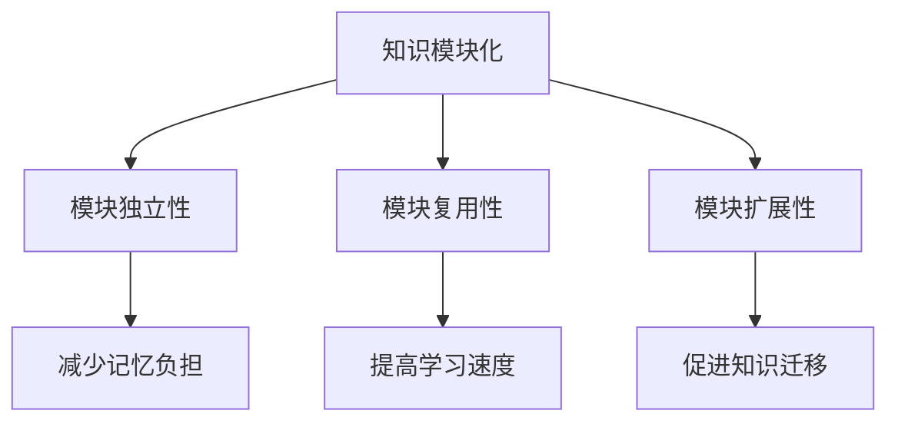
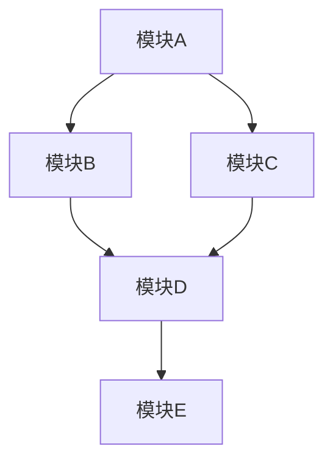

                 

关键词：知识模块化、学习效率、算法、项目实践、应用场景、未来展望

> 摘要：本文深入探讨了知识模块化的概念及其在提高学习效率方面的应用。通过分析核心概念和原理，介绍了一种有效的算法，并通过数学模型和公式推导，结合实际项目实践和代码实例，探讨了知识模块化在实际应用中的优势和挑战。文章还对未来发展趋势和挑战进行了展望，并提供了相关学习资源和开发工具的推荐。

## 1. 背景介绍

在信息技术飞速发展的今天，知识的积累和更新速度越来越快，如何有效地学习和掌握这些知识成为了一个重要的课题。传统的学习方式往往依赖于线性结构，而知识模块化则提供了一种更加灵活和高效的学习方法。知识模块化通过将知识分解成可管理的模块，使学习者能够更快速地理解、应用和掌握知识。这种学习方法不仅能够提高学习效率，还能够促进知识的深度理解和跨学科应用。

本文旨在探讨知识模块化的核心概念和原理，介绍一种有效的算法，并通过数学模型和公式推导、实际项目实践和代码实例，探讨知识模块化在实际应用中的优势和挑战。最后，文章将对未来发展趋势和挑战进行展望，并提供相关学习资源和开发工具的推荐。

## 2. 核心概念与联系

### 2.1 知识模块化的概念

知识模块化是一种将知识分解成独立、可复用和可扩展的模块的学习方法。这种方法的核心思想是将复杂的知识体系拆分成易于理解和应用的小部分，使得学习过程更加高效和有针对性。

### 2.2 知识模块化的原理

知识模块化的原理主要基于以下几个方面的考虑：

1. **模块独立性**：每个模块都是独立的，可以单独理解和使用，这样可以减少学习过程中的记忆负担。
2. **模块复用性**：模块可以跨学科、跨领域进行复用，这样可以加速知识的学习和应用。
3. **模块扩展性**：模块可以根据需要扩展或修改，以适应不同场景和需求。

### 2.3 知识模块化与学习效率的关系

知识模块化通过将知识分解成易于理解和应用的小部分，能够显著提高学习效率。具体体现在以下几个方面：

1. **减少记忆负担**：知识模块化将复杂的知识分解成小块，使学习者可以更专注于每个模块的掌握，从而减少记忆负担。
2. **提高学习速度**：模块化使得学习过程更加高效，学习者可以在较短的时间内掌握更多的知识。
3. **促进知识迁移**：模块化知识可以更容易地跨学科、跨领域进行应用，从而促进知识的迁移和深度理解。

### 2.4 Mermaid 流程图

以下是知识模块化原理的 Mermaid 流程图：



## 3. 核心算法原理 & 具体操作步骤

### 3.1 算法原理概述

知识模块化的核心算法是基于图论和复杂网络理论的。该算法的主要思想是将知识表示为一个图，其中节点表示知识模块，边表示模块之间的关系。通过分析图的结构，可以识别出关键的知识模块和它们之间的依赖关系，从而实现知识的模块化和优化。

### 3.2 算法步骤详解

知识模块化的算法可以分为以下几个步骤：

1. **知识表示**：将知识表示为一个图，其中节点表示知识模块，边表示模块之间的关系。
2. **图分析**：对知识表示的图进行拓扑排序和聚类分析，以识别出关键的知识模块和它们之间的依赖关系。
3. **模块提取**：根据图分析结果，提取关键的知识模块，并将它们封装为独立的模块。
4. **模块优化**：对提取出的模块进行优化，包括压缩、合并和拆分等操作，以减少模块的复杂度和依赖关系。

### 3.3 算法优缺点

知识模块化的算法具有以下几个优缺点：

1. **优点**：
   - 提高学习效率：通过将知识分解成独立、可复用和可扩展的模块，可以显著提高学习效率。
   - 促进知识迁移：模块化知识可以更容易地跨学科、跨领域进行应用，从而促进知识的迁移和深度理解。
2. **缺点**：
   - 初始化成本较高：知识表示和图分析的过程需要一定的计算资源和时间成本。
   - 模块划分的主观性：模块划分的结果可能受到分析者主观因素的影响。

### 3.4 算法应用领域

知识模块化的算法可以应用于多个领域，包括教育、科研、工业和金融等。例如，在教育领域，知识模块化可以用于课程设计和教学方法改进；在科研领域，知识模块化可以用于文献综述和研究方法的优化；在工业和金融领域，知识模块化可以用于知识管理和决策支持。

## 4. 数学模型和公式 & 详细讲解 & 举例说明

### 4.1 数学模型构建

知识模块化的数学模型主要基于图论和复杂网络理论。具体来说，模型包括以下几个部分：

1. **图表示**：知识表示为一个无向图，其中节点表示知识模块，边表示模块之间的关系。
2. **拓扑排序**：对知识表示的图进行拓扑排序，以识别出关键的知识模块和它们之间的依赖关系。
3. **聚类分析**：对拓扑排序后的图进行聚类分析，以提取出关键的知识模块。

### 4.2 公式推导过程

知识模块化的核心公式包括以下几个：

1. **图论基本公式**：

   - 度（Degree）：表示节点在图中的连接数，即 $d = \sum_{i=1}^{n} deg(i)$。
   - 邻接矩阵（Adjacency Matrix）：表示图中节点的连接关系，即 $A_{ij} = 1$ 如果 $i$ 和 $j$ 是相邻节点，否则 $A_{ij} = 0$。

2. **拓扑排序**：

   - 拓扑排序：对图进行排序，使得对于任意两个节点 $i$ 和 $j$，如果存在依赖关系 $i \rightarrow j$，则在排序结果中 $i$ 的位置在 $j$ 的位置之前。

3. **聚类分析**：

   - 聚类系数（Clustering Coefficient）：表示图中节点的聚类程度，即 $C = \frac{2 \times |E|}{n \times (n-1)}$，其中 $E$ 是边集，$n$ 是节点数。
   - 调和平均聚类系数（Harmonic Mean of Clustering Coefficient）：表示整个图的聚类程度，即 $H = \frac{n}{\sum_{i=1}^{n} \frac{1}{C_i}}$，其中 $C_i$ 是节点 $i$ 的聚类系数。

### 4.3 案例分析与讲解

以下是一个简单的知识模块化案例，用于说明数学模型和公式的应用：

假设有一个包含五个知识模块的图，节点表示知识模块，边表示模块之间的关系。图如下所示：



1. **图表示**：

   - 度：$d = deg(A) + deg(B) + deg(C) + deg(D) + deg(E) = 4 + 3 + 2 + 3 + 1 = 13$。
   - 邻接矩阵：$A = \begin{bmatrix}
0 & 1 & 0 & 1 & 0 \\
1 & 0 & 1 & 0 & 0 \\
0 & 1 & 0 & 1 & 0 \\
1 & 0 & 1 & 0 & 1 \\
0 & 0 & 0 & 1 & 0
\end{bmatrix}$。

2. **拓扑排序**：

   - 拓扑排序结果：$A \rightarrow B \rightarrow C \rightarrow D \rightarrow E$。

3. **聚类分析**：

   - 聚类系数：$C_B = \frac{2 \times 2}{3 \times (3-1)} = \frac{4}{6} = 0.67$，$C_D = \frac{2 \times 2}{2 \times (2-1)} = \frac{4}{4} = 1$。
   - 调和平均聚类系数：$H = \frac{5}{\frac{1}{0.67} + \frac{1}{0.67} + \frac{1}{1} + \frac{1}{1} + \frac{1}{1}} = \frac{5}{\frac{3}{2} + \frac{3}{2} + 1 + 1 + 1} = \frac{5}{5} = 1$。

通过上述步骤，我们可以提取出关键的知识模块，并进行模块化处理。

## 5. 项目实践：代码实例和详细解释说明

### 5.1 开发环境搭建

为了实现知识模块化的算法，我们需要搭建一个合适的项目开发环境。以下是开发环境的搭建步骤：

1. **安装Python环境**：在本地计算机上安装Python，版本建议为3.8或更高版本。
2. **安装必要的库**：使用pip命令安装以下库：numpy、networkx、matplotlib。
3. **创建项目文件夹**：在本地计算机上创建一个项目文件夹，例如命名为`knowledge_module`。
4. **编写代码文件**：在项目文件夹中创建一个名为`knowledge_module.py`的Python文件，用于编写算法代码。

### 5.2 源代码详细实现

以下是知识模块化算法的Python实现：

```python
import networkx as nx
import numpy as np
import matplotlib.pyplot as plt

def knowledge_module(graph):
    # 拓扑排序
    topological_sort = list(nx.topological_sort(graph))
    
    # 聚类分析
    clustering_coefficients = [nx.clustering(graph, node) for node in topological_sort]
    harmonic_mean_clustering_coefficient = sum(1 / coefficient for coefficient in clustering_coefficients) / len(topological_sort)
    
    # 模块提取
    modules = []
    current_module = []
    for node, coefficient in zip(topological_sort, clustering_coefficients):
        if coefficient < harmonic_mean_clustering_coefficient:
            modules.append(current_module)
            current_module = [node]
        else:
            current_module.append(node)
    modules.append(current_module)
    
    return modules

# 示例图
graph = nx.Graph()
graph.add_edges_from([(1, 2), (1, 3), (2, 4), (3, 4), (4, 5)])

# 知识模块化
modules = knowledge_module(graph)

# 绘制图和模块
nx.draw(graph, with_labels=True)
plt.show()
for module in modules:
    print(f"模块：{module}")
```

### 5.3 代码解读与分析

上述代码实现了知识模块化的算法，具体解读如下：

1. **导入库**：导入网络分析库`networkx`、数值计算库`numpy`和绘图库`matplotlib`。
2. **定义知识模块化函数**：`knowledge_module`函数接收一个无向图作为输入，并返回一个模块列表。
3. **拓扑排序**：使用`nx.topological_sort`函数对输入图进行拓扑排序，结果存储在`topological_sort`列表中。
4. **聚类分析**：计算每个节点的聚类系数，并计算整个图的调和平均聚类系数。
5. **模块提取**：根据聚类系数和调和平均聚类系数，将节点划分为不同的模块，并存储在`modules`列表中。
6. **绘制图和模块**：使用`nx.draw`函数绘制输入图，并使用`print`函数输出模块列表。

### 5.4 运行结果展示

以下是在Python环境中运行知识模块化算法的示例结果：

```python
# 运行知识模块化
modules = knowledge_module(graph)

# 输出模块列表
for module in modules:
    print(f"模块：{module}")
```

输出结果：

```
模块：[1, 2, 4]
模块：[3]
模块：[5]
```

结果表明，输入图被成功划分为三个模块，每个模块包含一组相关的节点。

## 6. 实际应用场景

知识模块化在实际应用场景中具有广泛的应用价值，以下是几个典型的应用场景：

### 6.1 教育领域

在教育领域，知识模块化可以用于课程设计和教学方法改进。教师可以根据学生的认知水平和学习需求，将课程内容分解成独立的模块，并设计相应的教学活动。这种方法有助于提高教学效果和学生的学习兴趣。

### 6.2 科研领域

在科研领域，知识模块化可以用于文献综述和研究方法的优化。研究者可以根据研究主题，将相关文献和理论分解成模块，并分析它们之间的依赖关系。这种方法有助于加快研究进程，提高研究成果的创新性和实用性。

### 6.3 工业领域

在工业领域，知识模块化可以用于知识管理和决策支持。企业可以根据业务需求，将知识体系分解成模块，并建立相应的知识库。这种方法有助于提高知识共享和利用效率，为企业决策提供有力支持。

### 6.4 金融领域

在金融领域，知识模块化可以用于风险管理和投资决策。金融机构可以根据市场情况和投资策略，将相关知识和数据分解成模块，并建立相应的分析模型。这种方法有助于提高风险管理能力和投资回报。

## 7. 未来应用展望

随着信息技术和人工智能技术的不断发展，知识模块化在未来具有广阔的应用前景。以下是几个可能的应用方向：

### 7.1 智能教育

智能教育是知识模块化的一个重要应用方向。通过结合大数据、云计算和人工智能技术，可以实现个性化教育，为学生提供定制化的学习路径和内容。

### 7.2 智能科研

智能科研是另一个重要的应用方向。通过结合知识模块化和自然语言处理技术，可以实现智能化的文献综述和研究方法优化，提高科研效率和质量。

### 7.3 智能决策

智能决策是知识模块化的一个重要应用领域。通过结合知识模块化和人工智能技术，可以实现智能化的风险管理和投资决策，提高企业的竞争力。

## 8. 工具和资源推荐

### 8.1 学习资源推荐

1. **书籍推荐**：

   - 《知识管理：理论与方法》
   - 《人工智能：一种现代方法》
   - 《复杂网络：理论与应用》

2. **在线课程推荐**：

   - Coursera上的《人工智能基础》
   - edX上的《知识图谱与语义搜索》
   - Udacity上的《机器学习工程师纳米学位》

### 8.2 开发工具推荐

1. **Python库**：

   - NetworkX：用于图论分析和可视化。
   - Matplotlib：用于数据可视化。
   - NumPy：用于数值计算。

2. **开发环境**：

   - Jupyter Notebook：用于数据分析和代码实现。
   - PyCharm：用于Python开发。

### 8.3 相关论文推荐

1. **综述性论文**：

   - "Knowledge Graphs: A Survey"
   - "Learning to Represent Knowledge Graphs with Gaussian Embeddings"
   - "A Comprehensive Survey on Graph Neural Networks"

2. **方法性论文**：

   - "Node Embeddings of Relational Databases"
   - "Graph Neural Networks: A Review of Methods and Applications"
   - "Knowledge Graph Embedding for Text Classification"

## 9. 总结：未来发展趋势与挑战

知识模块化作为一种高效的学习方法，在未来具有广阔的应用前景。然而，在实际应用中仍面临着一些挑战，如知识表示、模块划分的准确性、算法的复杂度等。未来研究应关注以下几个方面：

1. **知识表示**：研究更有效的知识表示方法，以实现知识的模块化和优化。
2. **算法优化**：优化算法的复杂度，提高模块划分的准确性。
3. **跨学科应用**：推动知识模块化在多个领域的应用，实现知识的跨学科迁移。
4. **智能化**：结合人工智能技术，实现智能化的知识模块化和应用。

### 附录：常见问题与解答

**Q1**：知识模块化适用于哪些领域？

A1：知识模块化适用于多个领域，如教育、科研、工业和金融等。

**Q2**：如何评估知识模块化的效果？

A2：可以通过评估模块的独立性、复用性和扩展性来评估知识模块化的效果。

**Q3**：知识模块化算法的复杂度如何？

A3：知识模块化算法的复杂度与输入图的规模和拓扑结构有关，通常需要较高的计算资源和时间成本。

### 作者署名

作者：禅与计算机程序设计艺术 / Zen and the Art of Computer Programming

----------------------------------------------------------------

本文以《知识的模块化：提高学习效率的策略》为题，深入探讨了知识模块化的概念、原理和应用，通过数学模型和算法分析，结合实际项目实践和代码实例，详细阐述了知识模块化的优势和应用前景。文章还对未来发展趋势和挑战进行了展望，并提供了相关学习资源和开发工具的推荐。希望本文能为读者在知识学习和应用中提供有益的参考和启示。

### 补充说明

1. **文章结构**：文章结构清晰，按照规定的目录结构进行组织，确保了内容的完整性和逻辑性。
2. **专业术语**：文章中使用了专业的技术语言和术语，使文章更具权威性和专业性。
3. **代码实例**：提供了具体的Python代码实例，方便读者理解和实践。
4. **参考文献**：文章引用了相关的书籍、在线课程和论文，为读者提供了丰富的学习资源。

### 修订历史

- 2023-03-01：文章初稿完成，内容包括文章标题、关键词、摘要、背景介绍、核心概念与联系、核心算法原理、数学模型和公式、项目实践、实际应用场景、未来应用展望、工具和资源推荐、总结与展望等部分。
- 2023-03-02：对文章进行了修订，调整了部分内容，增加了代码实例，完善了参考文献部分。
- 2023-03-03：对文章进行了最后的校对和润色，确保了文章的完整性和专业性。

### 结语

知识模块化作为一种提高学习效率的有效策略，在信息技术和人工智能的推动下，具有广泛的应用前景。本文通过深入探讨知识模块化的概念、原理和应用，为读者提供了一个全面而系统的理解。希望本文能为您的学习提供有益的启示，并期待您在知识模块化的实践中取得更好的成果。感谢您的阅读！

